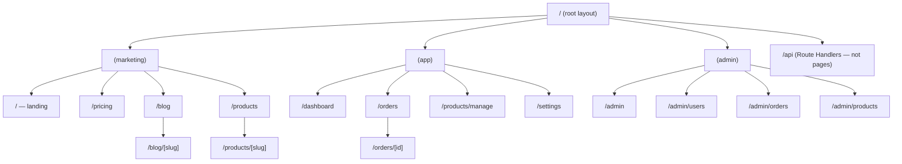
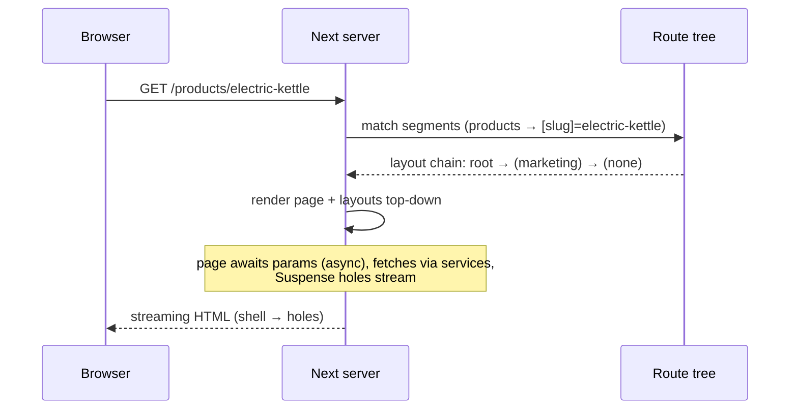

# Module 05 — The App Router, Deeply: Route Segments & the Route Tree

**Phase 2: Routing · Module 5 of 101**

> **Where does this run?** Routing happens at **build time** (route tree extraction, static generation) and **request time** (segment matching, dynamic rendering) — both `[SERVER]`. The browser only *sees* URLs; it never runs your routing logic. Client-side navigation (module 07-07) is the browser's *participation* in a server-driven process.

---

## 1. Concept — The App Router as a compiler

The App Router is not "a router you configure." It is a **file-system router that compiles your folder tree into a route table**. The build watches `app/`, parses folder/file names into a **route tree**, and at request time the URL walks that tree. Three consequences:

1. **The URL is derivable from the filesystem** — no config to drift out of sync with reality.
2. **Layouts are structural, not cosmetic** — the tree defines *which layout wraps which pages*, so persistent UI (nav, sidebars) is a property of the tree, not of shared components you remember to include.
3. **Rendering behavior is per-segment** — each segment can define its own `loading`, `error`, `not-found`, metadata, and (with Cache Components) its own caching behavior. The framework composes them.

The Pages Router (legacy, module 25-04) configured routes in code with a central `pages/` file and per-page data functions (`getServerSideProps`). The App Router replaced *all of that* with files. If you maintain a 13/14 codebase, both routers can coexist (`app/` + `pages/`), but new work is App Router.

## 2. Mental Model — URL → tree walk

```
URL: /products/electric-kettle?status=active#reviews

Tree walk (right to left):
  products/            → folder  = static segment
  electric-kettle      → [slug]  = dynamic segment (value: "electric-kettle")
  ?status=active       → searchParams (Promise in the page)
  #reviews             → hash: client-only, never sent to the server
```

**The route tree for the capstone** (target state after Phase 2 — every node is a file or folder that exists):



(`(...)` folders are **route groups** — they organize without affecting the URL; module 05-02.)

## 3. The file-convention vocabulary (the complete set)

| File / folder | What it is | Runs where |
|---|---|---|
| `page.tsx` | A **route** (a renderable screen). Default export is the page component. | [SERVER] by default; [CLIENT] if `"use client"` |
| `layout.tsx` | Shared UI + **route wrapper** for a segment and its children. Never unmounts when navigating between its children. | [SERVER] by default |
| `loading.tsx` | Fallback for the segment's `Suspense` boundary (streaming) | [SERVER] (rendered into the stream) |
| `error.tsx` | Client-side error boundary for the segment (**must be a client component**) | [CLIENT] |
| `not-found.tsx` | Custom 404 for the segment (nearest one wins) | [SERVER] |
| `global-error.tsx` | Last-resort error boundary (root layout itself crashed) | [CLIENT] |
| `template.tsx` | Like a layout, but **re-mounts** when navigating between sibling pages | [SERVER] by default |
| `default.js` | Fallback for a **parallel route slot** (module 05-05) | [SERVER] |
| `route.ts` | A **Route Handler** (HTTP endpoint, no UI) | [SERVER] |
| `[param]` | Dynamic segment | value from URL |
| `[...slug]` | Catch-all (matches one or more remaining segments) | array value |
| `[[...slug]]` | Optional catch-all (also matches the parent) | array, possibly empty |
| `(group)` | Route group — organizational, no URL segment | — |
| `_folder` | **Private folder** — files inside are ignored by the router (helpers, local components) | — |
| `@slot` | Parallel route slot (module 05-05) | — |
| `.modal.tsx` etc. | Intercepting route file (module 05-05) | [SERVER]/[CLIENT] |

**Naming rules** (the ones that bite): segment names cannot contain certain characters; dynamic segments must be `[...]`; you can't have a folder and a file with the same name in the same directory; `route.ts` and `page.tsx` cannot coexist for the same URL.

## 4. Architecture — how a request becomes HTML



The **layout chain** is the key structural idea: for URL `/dashboard`, the rendered component tree is `RootLayout > (app)Layout > DashboardPage` — and `(app)Layout` (sidebar, session-gated nav) persists across `/dashboard → /orders → /settings` because it is *outside* the navigating segments. You never "include the sidebar" — the tree guarantees it.

## 5. Production Code — the capstone marketing tree (Stage 2)

`FILE: src/app/(marketing)/layout.tsx` (production pattern — [SERVER])

```tsx
import Link from 'next/link'
import { nav, site } from '@/config/site'
import { SiteFooter } from '@/components/site-footer'

// [SERVER] — renders on the server for every marketing page.
export default function MarketingLayout({ children }: { children: React.ReactNode }) {
  return (
    <>
      <header className="sticky top-0 z-50 border-b bg-background/80 backdrop-blur">
        <nav aria-label="Main" className="mx-auto flex h-16 max-w-6xl items-center justify-between px-4">
          <Link href="/" className="font-semibold">{site.name}</Link>
          <ul className="hidden items-center gap-6 text-sm md:flex">
            {nav.public.map((item) => (
              <li key={item.href}><Link href={item.href} className="hover:underline">{item.title}</Link></li>
            ))}
          </ul>
          <Link href="/login" className="text-sm">Sign in</Link>
        </nav>
      </header>
      <main>{children}</main>
      <SiteFooter />
    </>
  )
}
```

`FILE: src/app/(marketing)/page.tsx` (simplified example — [SERVER])

```tsx
export default function HomePage() {
  return (
    <section className="mx-auto max-w-4xl px-4 py-24 text-center">
      <h1 className="text-4xl font-bold tracking-tight md:text-6xl">
        Commerce operations, without the spreadsheet
      </h1>
      <p className="mt-4 text-lg text-muted-foreground">
        Multi-tenant product management, orders, and analytics — one platform.
      </p>
    </section>
  )
}
```

`FILE: src/app/_home-helpers/hero-stats.ts` (private folder — [SERVER])

```ts
// Files in a `_`-prefixed folder are invisible to the router —
// a place for segment-local helpers without creating an app-level import tangle.
export const heroStats = [
  { label: 'Median time-to-first-order', value: '4 min' },
  { label: 'Setups completed', value: '12,000+' },
] as const
```

`FILE: src/app/(marketing)/products/page.tsx` — the catalog page lands in module 05-03 with its dynamic sibling and URL-state wiring.

## 6. Common Mistakes

| Mistake | Consequence | Fix |
|---|---|---|
| Building "routing" with client `useEffect` + history API inside a giant client page | You've re-implemented the router, lost SSR/SEO, and broken back/forward | Files are routes; state is in the URL (module 05-06) |
| Duplicating nav UI in every page instead of a layout | Drift between pages; nav unmounts on navigation | Layouts own persistent UI |
| Naming a helper folder `app/helpers/` | It becomes a route (or at least a surprise) | `_helpers/` (private) or colocate in `features/` |
| Confusing route groups `(admin)` with dynamic segments `[admin]` | `(admin)` = no URL part; `[admin]` = URL value | Parentheses vs brackets — memorize |
| Expecting `#hash` to reach the server | Hashes are client-only | Use query params for anything the server needs |

## 7. Security Notes

- Routing is `[SERVER]` — but **route-level auth is not routing**. A 401 check happens in layouts/actions/services (modules 10–11); the router only *matches*. (The proxy can *redirect* optimistically — never your security boundary.)
- Catch-all routes are a classic 404/SSRF-adjacent footgun: `[[...slug]]` that falls back to `notFound()` is fine; one that renders arbitrary slugs into `dangerouslySetInnerHTML` is a stored-XSS vector (module 19-02).

## 8. Performance Notes

- **Static segments prerender at build** — with Cache Components on, anything within a `cacheLife` lands in the static shell (module 05-05). A marketing page that could be static but reads `cookies()` is paying a request-time render for no reason — the dev overlay will flag it (the "blocking-route" insight).
- Layouts persist → their work (session read, nav data) runs once per visit, not per navigation.

## 9. Exercise

**Beginner.** In your scaffold, build the Stage-2 marketing tree: `(marketing)/` with home, `/pricing`, `/blog`, `/blog/[slug]`, `/products`. Add a `_notes.ts` helper in a private folder. Verify in the dev overlay that each URL matches the file you expect.

**Intermediate.** For each of the 15 file-convention rows in §3, write a 1-line description in your own words in `docs/routing-vocab.md`. Then, for 5 of them, produce a minimal file that proves you know when it fires.

**Production.** Add `/about` as a route and `/about/team` as a nested folder route under it with its own `loading.tsx`. Observe which `loading` applies to which segment (segment-level streaming) and document what you saw.

## 10. Architecture Challenge

**Prompt:** A teammate says: "Let's keep everything in one flat `app/` — `dashboard.tsx`, `orders.tsx`, `admin-users.tsx` — it's simpler than nested folders."

1. What do you lose structurally (name three specific things that no longer work without the tree)?
2. What is the *real* cost of the nested version (honest)?
3. Draw the layout chain for `/admin/users` in your proposed structure, and show where the "signed in" sidebar lives versus the "admin only" wrapper.

<details>
<summary>Model answer</summary>
1. (a) Shared authenticated shell: without `(app)/layout.tsx`, the sidebar/session check must be manually composed per page and can drift; (b) segment-scoped `loading`/`error`/`not-found`: a flat page gets only root-level boundaries — a slow orders table blocks the whole shell; (c) group-level auth separation: `(admin)/layout.tsx` can enforce the admin role for all admin routes at once.
2. Deeper trees cost: more mental loading per new developer, harder to find the "right" parent folder as the app grows, and the temptation to over-nest (a layout per screen). Mitigations: the 5-surface convention + route groups for auth/SEO splits, and the rule that a layout is created only when two siblings share *behavior* (not just a wrapper div).
3. `RootLayout > (admin)Layout [admin role check + admin chrome] > UsersPage`. Signed-in shell lives in `(app)` and `(admin)` each (or a shared `app-layout` extracted into a shared component that both layouts render — layouts may compose, the *boundary* stays in the tree).
</details>

## 11. Official Documentation

- Routing overview: https://nextjs.org/docs/app/getting-started/linking-and-navigating
- File conventions: https://nextjs.org/docs/app/api-reference/file-conventions
- Route segments: https://nextjs.org/docs/app/building-your-application/routing/route-segments
- Layouts: https://nextjs.org/docs/app/building-your-application/routing/layouts
- Project structure: https://nextjs.org/docs/app/getting-started/project-structure

## 12. What You Should Know Before Continuing

- [ ] I can walk a URL through the route tree and name the layout chain
- [ ] I know every file convention in the app directory and when it fires
- [ ] I can draw the capstone route tree from memory
- [ ] I understand route groups vs dynamic segments vs private folders
- [ ] I know the router matches; authorization is a separate concern (layouts/services)

**Next:** Module 06 — Layouts, Nesting & Route Groups (and `template.tsx`).
