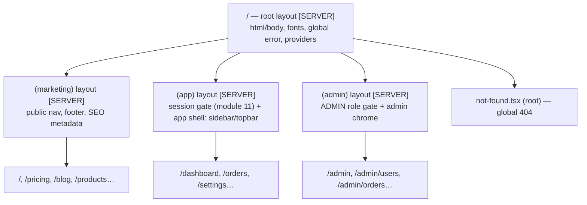

# Module 06 — Layouts, Nesting, Route Groups & Templates

**Phase 2: Routing · Module 6 of 101**

> **Where does this run?** Layouts render `[SERVER]` (unless client-marked) and are part of the streamed HTML. Their structural property — *persistence across navigation* — is what makes them an architectural tool, not a styling convenience.

---

## 1. Concept — What a layout actually is

A `layout.tsx` is a **parent component that stays mounted** while its children (pages, nested layouts) change. Three properties follow:

1. **Persistence:** navigating `/dashboard → /orders` re-renders only the page segments; the `(app)` layout (sidebar, topbar, session) does not unmount. Scroll position and layout-local client state survive.
2. **Structural encapsulation:** the layout's children prop is the only connection to what's inside — everything else (chrome, data, providers) belongs to the layout.
3. **Boundary scoping:** each segment can carry its own `loading.tsx`, `error.tsx`, `not-found.tsx`, and metadata — the layout tree is the error/streaming topology.

**The root layout is special:** it *must* render `<html>` and `<body>`, it wraps *every* route (including `/api`'s 404s), and it is where global providers, fonts, and the `lang` attribute live.

## 2. Mental Model — "When do I need a layout?" decision

```
Two or more sibling routes share…
  ├── persistent chrome (nav/sidebar)          → layout
  ├── an auth gate (signed-in / admin)         → layout (the gate is per-route-group, module 11)
  ├── a data dependency loaded once (profile, org list) → layout (fetch once, pass via props/context)
  └── nothing shared                           → NO layout (don't nest to impress)
```

And the **client layout** question: a layout may be a Client Component (to hold `useState`/providers), but you pay hydration for the whole subtree's chrome. The default is a server layout with client *islands* inside it (theme toggle, nav menu).

## 3. Architecture — the capstone layout chain (target)



`FILE: src/app/layout.tsx` (production pattern — [SERVER])

```tsx
import type { Metadata } from 'next'
import { Inter } from 'next/font/google'
import { Toaster } from '@/components/ui/toaster'
import './globals.css'

const inter = Inter({ subsets: ['latin'], variable: '--font-sans' })

// Static metadata for the whole app (per-page metadata wins — module 14).
export const metadata: Metadata = {
  metadataBase: new URL(process.env.NEXT_PUBLIC_APP_URL ?? 'http://localhost:3000'),
  title: { default: 'Commerce Ops', template: '%s | Commerce Ops' },
  description: 'Multi-tenant commerce & operations platform',
}

export default function RootLayout({ children }: { children: React.ReactNode }) {
  return (
    <html lang="en" className={inter.variable}>
      <body className="min-h-dvh bg-background text-foreground antialiased">
        {children}
        <Toaster />
      </body>
    </html>
  )
}
```

`FILE: src/app/(app)/layout.tsx` (production pattern — [SERVER])

```tsx
import { redirect } from 'next/navigation'
import { auth } from '@/lib/auth'
import { AppShell } from '@/components/app-shell'

// [SERVER] — the authenticated shell. The session check here is the layout-level
// gate; per-resource authorization still happens in services (module 11).
export default async function AppLayout({ children }: { children: React.ReactNode }) {
  const session = await auth.api.getSession({ headers: await headers() })
  // [SERVER] — no `window` here. The `from` target (if present) is validated in the
  // login flow; layouts redirect to a fixed path (module 10-04).
  if (!session) redirect('/login')

  // orgId is resolved from the active organization (module 11-02) — layout fetches it ONCE.
  const org = (await session.user?.organizationId) ?? null

  return (
    <AppShell orgId={org} user={{ name: session.user.name, email: session.user.email }}>
      {children}
    </AppShell>
  )
}
```

**Route groups — the `(marketing)` / `(app)` / `(admin)` split:** parenthesized folders group routes *without* adding URL segments. They exist precisely because marketing and app pages need **different root-level wrappers** (public nav vs authed shell) but share the same root layout. Without route groups you'd need two root layouts, which Next.js forbids — groups are the framework's answer.

`FILE: src/app/(admin)/layout.tsx` (production pattern — [SERVER])

```tsx
import { notFound, redirect } from 'next/navigation'
import { headers } from 'next/headers'
import { auth } from '@/lib/auth'

export default async function AdminLayout({ children }: { children: React.ReactNode }) {
  const session = await auth.api.getSession({ headers: await headers() })
  if (!session) redirect('/login?from=/admin')
  // Role check is SERVER-SIDE and belongs in the service layer (module 11-01).
  // A layout may also gate here, but the service is the enforcement point:
  const { hasRole } = await import('@/services/authorization')
  if (!(await hasRole(session, 'admin'))) notFound() // 404, not 403 — don't advertise /admin's existence

  return <div className="admin-chrome">{children}</div>
}
```

**`template.tsx` — the re-mounting layout:** identical to a layout, *except* it re-mounts when navigating between sibling pages under it. Use when a page group should *reset* per page (e.g., a wizard whose steps are routes: each step starts fresh). The capstone uses it for the settings sub-pages (each settings tab is a route; the form state should reset on tab switch, and `useEffect` cleanup should run).

```
settings/
├── template.tsx   ← re-mounts per settings page
├── profile/page.tsx
├── security/page.tsx
└── billing/page.tsx
```

## 4. Common Mistakes

| Mistake | Fix |
|---|---|
| Layout as a styling wrapper for a single page | That's just the page — delete the layout |
| Client layout wrapping the whole app "for state" | State doesn't need a layout; a provider in the root layout (server) + client context where needed |
| Fetching per-page data in a layout it doesn't share | Data dependencies belong at the shallowest segment that *all* consumers share — and only if truly shared |
| Gate auth in the layout and assume it's security | It *is* an enforcement point for the route group — but services must re-check for every resource (module 11). Layout gate = first line; service = the line |
| Forgetting the root layout renders 404s too | The global `not-found.tsx` must render full HTML (it's outside your layouts) |

## 5. Security Notes

- Layout gates run `[SERVER]` and use the **session, never client state**. The redirect target after a failed gate is a potential open-redirect surface: validate `?from=` values (module 19-02).
- Admin chrome rendered by an admin layout is *affordance* — the admin *actions* are enforced server-side. A user who navigates directly to an admin URL sees 404 (or 403), and a user who POSTs to an admin Server Function is rejected by the service.

## 6. Performance Notes

- Layout data fetches run **once per layout render** — with Cache Components, a `cacheLife`'d layout fetch can be part of the static shell. An uncached session read in the root layout is the classic thing that *destroys* the static shell for the whole app (module 10-05 teaches the fix: session read in the *app* layout, streamed behind Suspense, marketing pages stay static).
- Next 16's **layout deduplication** (enhanced routing) reuses rendered layouts across navigations — the browser doesn't re-execute layout code for routes sharing a layout prefix.

## 7. Exercise

**Beginner.** Add `(marketing)` to your scaffold, move home/pricing/blog/catalog inside it, and add a shared marketing header/footer in the group layout. Verify `/` still works and the URL is unchanged by the group.

**Intermediate.** Create `settings/template.tsx` with three tab pages. Prove the template re-mounts (a `console.log` in a client component's mount effect fires on tab switch) while a plain layout would not.

**Production.** Implement the `(admin)` gate from §3 with a stub `hasRole`. Write three Playwright-free curl checks: (a) no cookie → `/admin` redirects to `/login`; (b) user-role cookie → 404; (c) admin cookie → 200. (You'll wire real auth in Phase 10; the *routing* behavior exists now.)

## 8. Architecture Challenge

**Prompt:** The capstone needs a "checkout" flow: `/checkout` (cart review), `/checkout/payment`, `/checkout/success`. The cart state lives in the client. Three engineers propose: (a) one big client page with internal step state; (b) three routes under a plain layout; (c) three routes under a `template.tsx`.

Decide. Reason about: back/forward behavior, refresh persistence, shareable URLs (e.g., a payment-confirmation email linking to `/checkout/success`), state reset semantics, and where cart state actually lives.

<details>
<summary>Model answer</summary>
(c) — with cart state in a *client store/URL*, not the template. (a) fails: no per-step URLs (deep links from email dead), back button doesn't step, refresh loses step. (b) works but if the template is a *layout*, client state persists across steps (fine for cart) — the subtle failure is that a layout never re-mounts, so any per-step cleanup (e.g., resetting a payment form's 3DS state on leaving `/checkout/payment`) must be handled manually; (c) gives you per-step fresh mounts while the *checkout chrome* (order summary sidebar) lives in the enclosing layout, and cart state survives because it's in a client store (Zustand, module 23-02) or persisted to the server, not in the template. The success page is a normal route — shareable, indexable if needed, and its template re-mount means no stale payment form.
</details>

## 9. Official Documentation

- Layouts: https://nextjs.org/docs/app/building-your-application/routing/layouts
- Route groups: https://nextjs.org/docs/app/building-your-application/routing/route-groups
- Templates: https://nextjs.org/docs/app/building-your-application/routing/templates
- Root layout: https://nextjs.org/docs/app/api-reference/file-conventions/layout
- Parallel routes: https://nextjs.org/docs/app/building-your-application/routing/parallel-routes
- Intercepting routes: https://nextjs.org/docs/app/building-your-application/routing/intercepting-routes

## 10. What You Should Know Before Continuing

- [ ] I can state the three properties of a layout (persistence, encapsulation, boundary scoping)
- [ ] I can draw the capstone layout chain and name where the session gate lives
- [ ] I know the route-group reason (two wrappers, one root) and that groups don't change URLs
- [ ] I know layout vs template: persist vs re-mount
- [ ] I understand layout data fetch frequency and why the root layout's uncached session read is dangerous (coming up in module 10-05)

**Next:** Module 07 — Dynamic & Catch-All Routes.
