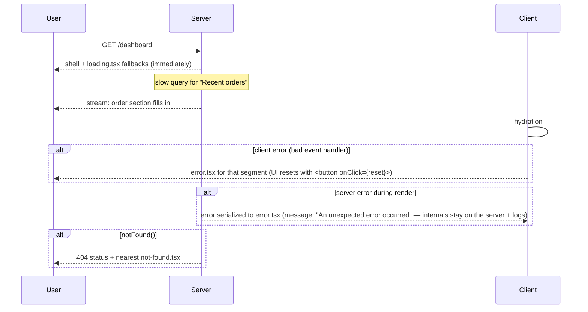

# Module 08 — `loading.tsx`, `error.tsx`, `not-found.tsx`: The Special Files

**Phase 2: Routing · Module 8 of 101**

> **Where do these run?** `loading.tsx` streams **from the server** (it's part of the prerendered shell). `not-found.tsx` renders **on the server** (404 is a server decision). `error.tsx` is a **client component** — error boundaries can only catch errors in the client tree; server errors are *serialized* to it as opaque messages.

---

## 1. Concept — Every segment is a resilience unit

The App Router makes each segment a **self-contained resilience unit**: it can define how it looks while loading, when it fails, and when it doesn't exist. The framework composes these per route. This replaces the SPA pattern ("wrap the page in a try/catch + a spinner state variable") with *structure*: the loading/error/404 topology is the folder tree.

The mapping to React primitives:

| Special file | React primitive | When it fires |
|---|---|---|
| `loading.tsx` | `<Suspense>` fallback | Async work in the segment (data fetch, uncached hole, navigation) |
| `error.tsx` | Error Boundary (client) | An uncaught error in the segment's client tree (or a server error thrown *during* that segment's rendering) |
| `not-found.tsx` | — (routing) | `notFound()` thrown anywhere in the segment's render, or an unmatched dynamic value |
| `global-error.tsx` | Root error boundary | The **root layout itself** throws — the last resort; must render its own `<html>` |

**Nearest-wins:** `/admin/users/error.tsx` catches `/admin/users` errors; uncaught ones bubble to `/admin/error.tsx`, then root. Same for `not-found`.

## 2. Mental Model — who sees what, and when



Key discipline: **`error.tsx` must never show raw server stack traces to users** (module 19: the serialized message is intentionally generic; the full error goes to your logger/error tracker — module 21-01).

## 3. Production Code

`FILE: src/app/loading.tsx` (simplified example — [SERVER], streamed)

```tsx
// Root-level fallback: shown for ANY segment without its own loading.tsx.
export default function RootLoading() {
  return (
    <div className="flex min-h-dvh items-center justify-center" role="status" aria-live="polite">
      <span className="sr-only">Loading…</span>
      <div className="h-8 w-8 animate-spin rounded-full border-2 border-primary border-t-transparent" />
    </div>
  )
}
```

`FILE: src/app/(app)/loading.tsx` (production pattern — skeleton, [SERVER])

```tsx
// Segment-level: the app shell (sidebar/topbar from the layout) is ALREADY rendered;
// only this segment's content is the skeleton. This is why segment-level loading
// beats a page-level spinner for perceived performance.
import { DashboardSkeleton } from '@/components/dashboard-skeleton'

export default function AppLoading() {
  return <DashboardSkeleton />
}
```

`FILE: src/app/error.tsx` (production pattern — **[CLIENT], required**)

```tsx
'use client'

import { useEffect } from 'react'

export default function ErrorBoundary({
  error,
  reset,
}: {
  error: Error & { digest?: string }   // digest: the server's stable ID for this error
  reset: () => void
}) {
  // Report with the digest — this is how a generic message connects to a tracked incident (module 21-01).
  useEffect(() => {
    console.error('[boundary]', error.digest ?? error.message)
    // reportToErrorTracker({ digest: error.digest })
  }, [error])

  return (
    <div className="flex min-h-[50vh] flex-col items-center justify-center gap-4 p-8 text-center" role="alert">
      <h2 className="text-xl font-semibold">Something went wrong</h2>
      <p className="text-sm text-muted-foreground">
        The {error.digest ? `error reference ${error.digest}` : 'details were logged'} — try again.
      </p>
      <button type="button" onClick={reset} className="rounded-md bg-primary px-4 py-2 text-sm text-primary-foreground">
        Try again
      </button>
    </div>
  )
}
```

`FILE: src/app/not-found.tsx` (production pattern — [SERVER])

```tsx
import Link from 'next/link'

export default function NotFound() {
  return (
    <main className="flex min-h-[70vh] flex-col items-center justify-center gap-3 px-4 text-center">
      <p className="text-sm font-medium text-primary">404</p>
      <h1 className="text-2xl font-semibold">Page not found</h1>
      <p className="max-w-sm text-sm text-muted-foreground">
        The page you're looking for doesn't exist, or you may not have access to it.
      </p>
      <Link href="/" className="mt-2 rounded-md bg-primary px-4 py-2 text-sm text-primary-foreground">
        Back home
      </Link>
    </main>
  )
}
```

`FILE: src/app/global-error.tsx` (production pattern — [CLIENT], **no CSS inheritance — it renders outside your layout**)

```tsx
'use client'

// IMPORTANT: global-error bypasses the root layout — it must render <html>/<body>
// itself, and it cannot rely on fonts/CSS variables set in the layout.
export default function GlobalError({ children }: { children: React.ReactNode }) {
  return (
    <html lang="en">
      <body style={{ margin: 0, fontFamily: 'system-ui, sans-serif', display: 'grid', placeItems: 'center', minHeight: '100dvh' }}>
        <div style={{ textAlign: 'center' }}>
          <h1>Application error</h1>
          <p>A critical error occurred. The team has been notified.</p>
          <button onClick={() => window.location.reload()}>Reload</button>
        </div>
        {children}
      </body>
    </html>
  )
}
```

**`notFound()` everywhere it belongs:** services that can't find a tenant-scoped resource call `notFound()` (or return null and the page calls it) — never a 500. `redirect()` is its sibling (module 05-09).

## 4. Common Mistakes

| Mistake | Consequence | Fix |
|---|---|---|
| `error.tsx` without `'use client'` | Build error (it must be a client component) | Add the directive; `reset` is a client function |
| Showing `error.message` to users | Leaks internals (paths, SQL fragments) | Generic copy + `digest` for support/correlation |
| One giant root `loading.tsx` and nothing segment-level | Whole-page spinners; slow sections block fast ones | Segment `loading.tsx` at every segment with async work |
| `notFound()` in a layout to "hide" a section | Hides the *layout and everything under it* | 404 at the page level, or conditionally render the *content* |
| `global-error.tsx` styled with Tailwind classes | Styles don't apply (outside your layout/CSS) | Inline styles / a self-contained stylesheet |
| Catching a *server* error in a client `try/catch` and assuming you get the stack | You get the digest, by design | Log server-side at the throw site or via instrumentation (module 21-01) |

## 5. Security Notes

- **The 404 vs 403 choice is security** (module 11-03): for resources whose *existence* is sensitive (other tenants' orders), `notFound()` is safer than 403 — it reveals nothing.
- `error.tsx` output is user-facing: never include request URLs with query params (they can contain tokens in broken flows) or env-derived strings.

## 6. Performance Notes

- `loading.tsx` is **part of the initial HTML** — it's free (no JS). The hierarchy of skeletons (page skeleton → section skeletons) is your perceived-performance design, and streaming makes each level real (module 06).
- An `error.tsx` that *fetches* on mount (e.g., a "report this error" widget) must be cheap — it renders at the worst possible moment (network is often the problem).

## 7. Exercise

**Beginner.** Add `loading.tsx`, `error.tsx`, `not-found.tsx` to `(app)` and to the root. Force a client error (throw in an event handler) and a 404 (`notFound()` in a dynamic page). Screenshot all three UIs.

**Intermediate.** Make a service throw a 500 (bad DB row shape) in `/dashboard`. Observe: (a) which `error.tsx` catches it, (b) what `error.digest` is and that it's *stable* across reloads of the same error, (c) that the layout chrome (sidebar) survives. Explain each.

**Production.** Add a `global-error.tsx` and break the root layout deliberately (invalid `<html>` nesting) to trigger it. Verify it renders standalone. Document the three-layer error topology (global → segment → inline) in `docs/error-topology.md`.

## 8. Architecture Challenge

**Prompt:** A slow external API (payment status) is called from `/orders/[id]`. Options: (a) let it block the page; (b) Suspense it with a skeleton; (c) move it to a client component that fetches after mount; (d) cache it with `use cache` for 30s.

Pick the *combination* and defend it against: a user refreshing mid-payment, a crawler, and an admin checking the same order simultaneously.

<details>
<summary>Model answer</summary>
(b) + (d) for the *server-rendered* status, (c) never for primary content: (b) keeps the order details instant and streams the payment panel — no full-page block, and crawlers get the order (payment status degrades to a skeleton, acceptable). (d) at `cacheLife('seconds')` — short enough that "refreshing mid-payment" sees a fresh status on the *next* request (short-lived caches are dynamic holes, so each refresh re-fetches while the *other* parts of the page can still serve from cache); the admin's simultaneous view hits the same 30s cache entry — fine for status, and the admin's *actions* (refund) bypass it via direct service calls (never read from the user cache for mutations). (c) is reserved for *optional* enrichment (e.g., "latest 3DS logs" for support) where a skeleton-after-mount is acceptable UX.
</details>

## 9. Official Documentation

- `loading.tsx`: https://nextjs.org/docs/app/api-reference/file-conventions/loading
- `error.tsx`: https://nextjs.org/docs/app/api-reference/file-conventions/error
- `not-found.tsx`: https://nextjs.org/docs/app/api-reference/file-conventions/not-found
- `global-error.tsx`: https://nextjs.org/docs/app/api-reference/file-conventions/global-error
- Error handling guide: https://nextjs.org/docs/app/getting-started/error-handling
- `notFound()`: https://nextjs.org/docs/app/api-reference/functions/not-found
- `redirect()`: https://nextjs.org/docs/app/api-reference/functions/redirect

## 10. What You Should Know Before Continuing

- [ ] I know the React primitive behind each special file and where it runs
- [ ] My app has the three-file set at root + `(app)`, plus `global-error.tsx`
- [ ] I can explain why `error.tsx` is a client component with a generic message + digest
- [ ] I know nearest-wins bubbling for errors and 404s
- [ ] I can argue 404-vs-403 from an information-disclosure standpoint

**Next:** Module 09 — Redirects, Parallel Routes & Intercepting Routes.
