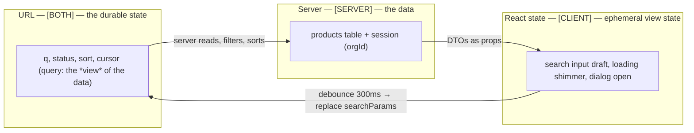

# Module 10 — URL State: Where Does State Belong?

**Phase 2: Routing · Module 10 of 101**

> **Where does this run?** `searchParams` is read `[SERVER]` (as a Promise) or `[CLIENT]` via `useSearchParams()`. The URL itself is **shared state** — it's the one state container that survives refresh, deep links, back/forward, and being sent to a colleague.

---

## 1. Concept — The URL is a state container, and the most durable one

Every piece of UI state in a web app falls into one of four owners:

| Owner | Survives refresh? | Shareable? | Back/forward? | Who writes it |
|---|---|---|---|---|
| **URL** (path + query) | ✅ | ✅ (it's a link) | ✅ (native) | Server (query) or client (`Link`/`router.push`) |
| **Server** (DB/session) | ✅ | ✅ (per user) | n/a | Mutations (Server Functions) |
| **React state** (hooks) | ❌ | ❌ | ❌ | Client events |
| **Browser storage** (localStorage/IndexedDB) | ✅ | ❌ (per device) | n/a | Client |

The rule that resolves 90% of state debates: **if a different value of X changes what the page *means* (which data, which filter, which page of results, which tab), X is URL state.** If X changes only *how something looks right now* (dialog open, tooltip, drag position), it's React state. If X is *the data itself*, it's server state, and the URL is at most a *reference* to it (an ID).

## 2. Mental Model — the three-state diagram for a real screen

`/products?q=kettle&status=active&sort=price_asc&cursor=abc123`



**The flow is always: client intent → URL → server renders data → client renders it.** React state is a *transit* buffer (the input field while typing), never the source of truth for the view.

## 3. Production Code

### 3.1 Server: read & parse `searchParams`

The catalog page (from module 05-07) is the canonical pattern:

`FILE: src/app/(marketing)/products/page.tsx` (production pattern — [SERVER]; excerpt)

```tsx
const searchSchema = z.object({
  q: z.string().max(100).optional(),
  status: z.enum(['draft', 'active', 'archived']).optional(),
  sort: z.enum(['newest', 'price_asc', 'price_desc']).default('newest'),
  cursor: z.string().max(128).optional(),
})

export default async function CatalogPage({ searchParams }: { searchParams: Promise<Record<string, string | string[] | undefined>> }) {
  const raw = await searchParams                       // ← async, required in 16.x
  const parsed = searchSchema.safeParse(flatten(raw))
  const query = parsed.success ? parsed.data : DEFAULT_QUERY   // garbage in → defaults, never a crash
  // …fetch with the parsed query (services/products.ts)
}
```

### 3.2 Client: controlled inputs that write to the URL

`FILE: src/features/product/components/product-filters.tsx` (production pattern — [CLIENT])

```tsx
'use client'

import { useEffect, useState } from 'react'
import { usePathname, useRouter, useSearchParams } from 'next/navigation'
import { Input } from '@/components/ui/input'
import { Select } from '@/components/ui/select'

export function ProductFilters({ initial }: { initial: { q?: string; status?: string; sort?: string } }) {
  const router = useRouter()
  const pathname = usePathname()
  const searchParams = useSearchParams()
  const [draft, setDraft] = useState(initial.q ?? '')

  // Commit the search box to the URL on submit (and debounced as the user types).
  const commit = (patch: Record<string, string | null>) => {
    const params = new URLSearchParams(searchParams.toString())
    for (const [key, value] of Object.entries(patch)) {
      if (value === null || value === '') params.delete(key)
      else params.set(key, value)
    }
    // replace: filter changes shouldn't spam the history stack
    router.replace(`${pathname}?${params}`, { scroll: false })
  }

  useEffect(() => {
    const id = setTimeout(() => {
      if (draft !== (searchParams.get('q') ?? '')) commit({ q: draft || null })
    }, 300)
    return () => clearTimeout(id)
  }, [draft]) // eslint-disable-line react-hooks/exhaustive-deps

  return (
    <form
      role="search"
      className="flex flex-wrap items-center gap-3"
      onSubmit={(e) => { e.preventDefault(); commit({ q: draft || null }) }}
    >
      <Input
        aria-label="Search products"
        value={draft}
        onChange={(e) => setDraft(e.target.value)}
        placeholder="Search by name…"
      />
      <Select
        aria-label="Status"
        value={searchParams.get('status') ?? ''}
        onChange={(e) => commit({ status: e.target.value || null })}
      >
        <option value="">All statuses</option>
        <option value="active">Active</option>
        <option value="draft">Draft</option>
      </Select>
      <Select
        aria-label="Sort"
        value={searchParams.get('sort') ?? 'newest'}
        onChange={(e) => commit({ sort: e.target.value })}
      >
        <option value="newest">Newest</option>
        <option value="price_asc">Price ↑</option>
        <option value="price_desc">Price ↓</option>
      </Select>
    </form>
  )
}
```

**Why `useSearchParams` needs a Suspense boundary on the client:** during prerendering its value is unknown (it's request data), so a component that calls it must be wrapped in `<Suspense>` or the segment can't be statically prerendered. The filters component above is rendered inside a `<Suspense>` in the page (or the page passes the current values as *initial props* from the server — better: zero client read of `searchParams` for initial values).

### 3.3 Pagination that preserves filters (the URL does the work)

`FILE: src/components/pagination.tsx` (production pattern — [CLIENT])

```tsx
import Link from 'next/link'

// Cursor-based (module 09-04); offset variant noted in the exercise.
export function Pagination({ basePath, cursor, nextCursor, search }: {
  basePath: string
  cursor: string | null
  nextCursor: string | null
  search: string   // everything EXCEPT cursor, preserved verbatim
}) {
  const makeHref = (c: string | null) => {
    const params = new URLSearchParams(search)
    if (c) params.set('cursor', c)
    return `${basePath}${params.size ? `?${params}` : ''}`
  }
  return (
    <nav aria-label="Pagination" className="flex items-center justify-between gap-4">
      <Link href={cursor ? makeHref(cursor) : '#'} aria-disabled={!cursor} className={!cursor ? 'pointer-events-none opacity-50' : ''}>
        Previous
      </Link>
      <Link href={nextCursor ? makeHref(nextCursor) : '#'} aria-disabled={!nextCursor} className={!nextCursor ? 'pointer-events-none opacity-50' : ''}>
        Next
      </Link>
    </nav>
  )
}
```

Filters, sort, and page *all* live in the URL, so "share this view" is just "copy the address bar." Refresh restores the view. Back/forward steps through it. **This is the feature SPAs get wrong** (state in memory, share = broken).

### 3.4 Tabs

Tabs with *distinct data* → query param (`?tab=analytics`). Tabs that are purely presentational (switching between two client widgets on the same page) → React state. The litmus test: can a teammate open the link and land on *that* tab? If the answer should be yes, it's URL.

## 4. Common Mistakes

| Mistake | Fix |
|---|---|
| Filters in `useState`, reset on refresh, unshareable | URL query params; React state is only the *draft* |
| `router.push` per keystroke in a search box | Submit + debounce; `replace` for non-history-worthy changes |
| Reading `searchParams` as a sync object | `await searchParams` (server) / `useSearchParams()` (client, inside Suspense) |
| Query params that are *data* (e.g., `?productId=123` when there's a `/products/123` route) | Use the route (IDs are paths); queries carry *view modifiers* |
| History stack polluted by filter toggles | `router.replace` for toggles, `push` for user-meaningful navigation |
| Trusting query values | Zod-parse at the server (module 05-07 pattern); the URL is user-writable |

## 5. Security Notes

- The query string is **public and attacker-writable**: anything in it reaches your server untrusted (Zod at the boundary). Never put tokens in URLs (they leak to logs, referrers, browser history) — sessions are cookies.
- `?from=` / `?next=` style params are open-redirect surfaces (module 05-09 validation).

## 6. Performance Notes

- URL-driven state means the server can **prerender cache variants**: `/products` and `/products?status=active` are distinct cache entries (the search params are part of the cache key) — a performance benefit *and* a sharing benefit from one decision.
- `replace` vs `push` also controls prefetch behavior: hover-prefetch (module 11) targets the `href` of `Link`s — query-param pagination links prefetch *exactly the next filtered page*.

## 7. Exercise

**Beginner.** Add a `?greeting=` param to a scratch page: server reads it (Zod-parsed, max 40 chars, default "Hello"), client input commits it via `router.replace`. Refresh, share the URL in a new tab, press back/forward — narrate what happens at each step.

**Intermediate.** Build the catalog filters + cursor pagination from §3 end-to-end against the in-memory product list (module 04 stub). Verify: (a) refresh preserves the view; (b) "Next" preserves `q`/`status`/`sort`; (c) malformed `?status=bogus` renders defaults without crashing.

**Production.** Add the three tabs (Products / Orders / Activity) to `/dashboard` using `?tab=`. Write a 300-word doc: for each of the 20+ state variables in the screen, name its owner (URL/server/React/localStorage) and one sentence why. This doc is the template for every data screen you'll build in Phase 17.

## 8. Architecture Challenge

**Prompt:** "Save this view as a preset" — users can name their current filter combination and re-apply it later. Presets must be shareable between teammates in the same org.

Design it: where does the preset live (table? JSON?), what does its URL look like, how does applying a preset interact with the current URL state, and what's the security check (a preset from another org)?

<details>
<summary>Model answer</summary>
The preset is *server state* (a row: `presets(id, orgId, ownerId, name, params jsonb)`) — because it's data, not a view. Applying a preset is a navigation: the client builds the URL from the preset's `params` (which are re-validated by the *same* Zod schema as the live query — a preset cannot smuggle in invalid filters) and does `router.replace`. URL is still the live source of truth; the preset is a *bookmark into the URL space*. Sharing = the preset row is org-scoped; the service filters `eq(orgId, sessionOrgId)` on read — a preset ID from another org is a 404 (module 11-02 tenancy). The preset's `params` are stored as JSON *validated on write* (Zod) — never trust stored data either.
</details>

## 9. Official Documentation

- `searchParams`: https://nextjs.org/docs/app/api-reference/file-conventions/page#searchparams-optional
- `useSearchParams`: https://nextjs.org/docs/app/api-reference/functions/use-search-params
- `useRouter`: https://nextjs.org/docs/app/api-reference/functions/use-router
- Linking & navigating: https://nextjs.org/docs/app/getting-started/linking-and-navigating

## 10. What You Should Know Before Continuing

- [ ] I can assign an owner (URL/server/React/storage) to any state variable with a one-line reason
- [ ] My data screens: draft in React state, committed view in the URL, data from the server
- [ ] I handle malformed query params with schema + defaults, never crashes
- [ ] Pagination preserves the full query; history is sane (`replace` vs `push` deliberately)
- [ ] I know why `useSearchParams` needs Suspense on the client

**Phase 2 complete (next: the navigation module).** Capstone Stage 2 is functional: all public routes, URL-driven catalog, loading/error/404 topology. **Next:** Module 11 — Instant Navigation & the Modern Prefetching Architecture.
