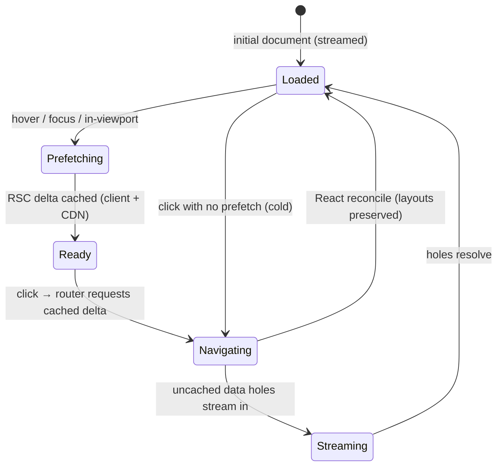

# Module 11 — Instant Navigation & the Modern Prefetching Architecture

**Phase 2: Routing · Module 11 of 101 (closes Phase 2)**

> **Where does this run?** Navigation is a **co-production**: the browser (client router) orchestrates, the server renders the next RSC payload, the CDN may serve parts of it. "Instant" is the sum of prefetching, caching, layout deduplication, and streaming — not one feature.

---

## 1. Concept — What "navigation" actually is in the App Router

Two kinds of navigation:

1. **Hard (initial) load:** browser → full request → streamed HTML. This is a document load.
2. **Client (soft) navigation:** click a `<Link>` → the **client router** requests the *next route's RSC payload* (not a document) → React reconciles the new tree, **preserving layout and client state that survives** → no document reload, no full re-hydration.

The SPA comparison (what this module is for): in a Vite+React SPA, soft navigation = client router + your `fetch()` to your API + your cache library. In Next.js, the *framework* does the fetch (RSC payload from *its own* server), the *cache* is the caching model (module 05), and *hydration* is skipped for unchanged subtrees. The SPA still "wins" nothing here except for apps with no server.

**Next.js 16's enhanced routing** (the current architecture) adds three mechanisms that make soft navigation feel like a native app:

- **Layout deduplication:** layouts shared between the current and next route are *reused* — their client code isn't re-executed, their server work isn't re-rendered. Navigating `/dashboard → /orders` inside `(app)` keeps the shell 100%.
- **Incremental / partial prefetching:** prefetching fetches *only what's missing* for the target route — the shared layout is already held; the delta (the page + its data) is fetched. (Official guide: "Adopting Partial Prefetching.")
- **Prefetch triggers beyond hover:** `<Link>` prefetches on **hover/focus** (desktop) and **in-viewport** (lists) — so the payload often arrives *before* the click.

## 2. Mental Model — the navigation state machine



**What survives a soft navigation** (and what doesn't):

| Survives | Doesn't survive |
|---|---|
| Layouts (deduplicated) | The *page* (re-rendered from the new payload) |
| Client state inside layouts | Page-level `useState` (page unmounts) |
| Session/cookies (implicit) | Scroll (unless `scroll: false`) |
| Fonts, hydrated framework internals | `useEffect` re-runs in the new page |

This is why state placement (module 10) is navigation-critical: anything you want to survive *across* pages belongs in the layout, a client store (module 23-02), or the URL — not in the page.

## 3. Production Code

### 3.1 Links are the unit of prefetching

`FILE: src/components/nav-link.tsx` (production pattern — [CLIENT])

```tsx
'use client'

import Link from 'next/link'
import { usePathname } from 'next/navigation'
import { cn } from '@/lib/utils'

type NavLinkProps = { href: string; children: React.ReactNode; prefetch?: boolean }

export function NavLink({ href, children, prefetch = true }: NavLinkProps) {
  const pathname = usePathname()
  const isActive = pathname === href
  return (
    <Link
      href={href}
      prefetch={prefetch}
      aria-current={isActive ? 'page' : undefined}
      className={cn('rounded-md px-3 py-2 text-sm transition-colors', isActive && 'bg-muted font-medium')}
    >
      {children}
    </Link>
  )
}
```

`prefetch` is a boolean knob: `true` (default) = hover + viewport behavior; `false` = only on click. Use `false` for links whose targets are *heavy or user-specific* (an "open last invoice" deep link) where a speculative fetch wastes bandwidth.

### 3.2 Preserving app state across navigation (the pattern that replaces "SPA state")

`FILE: src/features/cart/cart-provider.tsx` (production pattern — [CLIENT])

```tsx
'use client'

// Cart state must survive navigation across /products → /cart → /checkout.
// It lives in a client store mounted in the (app) layout — NOT in any page.
import { createContext, useContext, useEffect, useSyncExternalStore } from 'react'
import { useCartStore } from '@/hooks/use-cart-store'   // Zustand (module 23-02) — the justified global store

type CartContextValue = ReturnType<typeof useCartStore>
const CartContext = createContext<CartContextValue | null>(null)

export function CartProvider({ children }: { children: React.ReactNode }) {
  const store = useCartStore()
  // Hydrate persisted cart on first mount; sync to server on change (debounced).
  useEffect(() => store.hydrate(), [])
  return <CartContext.Provider value={store}>{children}</CartContext.Provider>
}

export function useCart() {
  const ctx = useContext(CartContext)
  if (!ctx) throw new Error('useCart must be used inside <CartProvider>')
  return ctx
}
```

`FILE: src/app/(app)/layout.tsx` (excerpt — [SERVER] wrapping [CLIENT])

```tsx
import { CartProvider } from '@/features/cart/cart-provider'
// …
return (
  <AppShell …>
    <CartProvider>{children}</CartProvider>
  </AppShell>
)
```

Because the provider is *in the layout*, every soft navigation re-renders the page but the cart store object identity is stable — the "SPA state" you expected from an SPA, with server rendering for everything else.

### 3.3 Programmatic navigation (server-side)

`FILE: src/features/order/order-actions.ts` (production pattern — [SERVER])

```ts
'use server'

import { redirect } from 'next/navigation'

export async function placeOrder(formData: FormData) {
  // validate → create (module 07/12) …
  const order = await createOrder(/* … */)
  updateTag('orders')                       // read-your-own-writes (module 05-04)
  redirect(`/orders/${order.id}?placed=1`)  // post-mutation navigation, server-driven
}
```

`redirect()` inside a Server Action is the canonical post-mutation navigation: the client never decides the URL, and the *new* page's data is fetched server-side with the fresh cache state.

### 3.4 `router.refresh()` — refetch data without a new URL

`FILE: src/features/settings/settings-actions-client.ts` (production pattern — [CLIENT])

```tsx
'use client'

import { useRouter } from 'next/navigation'

export function RefreshButton({ onSaved }: { onSaved?: () => void }) {
  const router = useRouter()
  // After a client-side data mutation that DIDN'T go through a Server Action
  // (e.g., a client cache invalidation), ask the router to refetch the RSC data
  // for the current route — layouts preserved, same URL.
  return <button type="button" onClick={() => router.refresh()}>Refresh</button>
}
```

Use `refresh()` sparingly: it's a full data refetch for the route. The *default* path after a mutation is a Server Action that revalidates its tags and redirects/refreshes precisely (module 05-04) — `refresh()` is the escape hatch for data you didn't invalidate by tag.

## 4. How this differs from SPA navigation (the explicit contrast)

| Concern | SPA (Vite + React + Query) | Next.js 16 |
|---|---|---|
| Initial paint | blank → JS → first render | streamed HTML → paint → hydrate |
| Navigation request | your `fetch('/api/…')` to your API | RSC payload to the framework's own server (partial) |
| Cache | your Query cache (memory) | layered: browser/CDN/data cache (module 05) + optional Query |
| Layout persistence | you build it (Router providers) | structural (layouts deduplicated) |
| Freshness after mutation | your invalidation calls | tags (`updateTag`/`revalidateTag`) + redirect/refresh |
| SEO/crawlers | fragile (JS rendering) | first-class (real HTML) |
| Progressive enhancement | none | forms work without JS (module 07-02) |

## 5. Common Mistakes

| Mistake | Fix |
|---|---|
| `window.location.href = …` for internal navigation | `Link`/`router.push` — hard navigation discards the client tree (full reload) |
| Prefetching *everything* (lists of 500 links) | `prefetch={false}` on beyond-the-fold items; prefetch the visible window |
| Page-level `useState` expected to survive navigation | It doesn't — move state to layout/store/URL (module 10) |
| `router.refresh()` in a `useEffect` after render (loop risk) | Refresh in response to a completed mutation, never on every render |
| Assuming soft navigation re-runs layout `useEffect`s | Layouts persist; effects in layouts run once (per mount) — test it |
| Measuring "speed" of a cached navigation without the network panel | You're measuring cache; throttle (Slow 3G) to measure the cold path |

## 6. Security Notes

- Prefetch is **speculative**: it runs with the *current* session/cookies. Never encode sensitive state in URLs that prefetch would amplify (a `?token=` link prefetches with the token in the URL — another reason tokens aren't query params).
- A prefetch hitting a route whose *layout* redirects (auth gate) is harmless (the redirect is just cached as a redirect) — but it does mean an unauthenticated user prefetches a 401/redirect; that's expected, not a leak.

## 7. Performance Notes

- The prefetch trigger mix (hover + viewport + partial) means **the click is often a cache hit** — measure it: Network panel → click a nav link → is the RSC request `200 (from disk cache)` or a fresh fetch?
- Partial prefetching fetches *deltas* — a route sharing 90% of the tree transfers 10%. Layout deduplication is the multiplier that makes this work.
- Cold navigation (no prefetch) = full RSC payload + data holes; that's your worst case and what your `loading.tsx` skeletons cover.

## 8. Exercise

**Beginner.** Instrument it: open the catalog with DevTools → Network. Hover three product links (watch prefetch requests appear *before* click). Click one. Note the status of the navigated request. Repeat with `prefetch={false}` on those links. Write down what changed.

**Intermediate.** Add the cart provider pattern (§3.2) to your scaffold with an in-memory store (Zustand comes in Phase 23; a local `useSyncExternalStore` store is fine now). Prove persistence: add an item on `/products`, navigate to `/cart` via soft nav, and confirm the item survived — then hard-reload and confirm the *hydration* restores it (from `sessionStorage` if you want it to).

**Production.** Build the "next page" prefetch for cursor pagination: the "Next" link prefetches the next page's RSC payload on hover. Measure time-to-interactive for the next page with prefetch on/off (throttled network) and record the delta. This number is the whole business case for the feature.

## 9. Architecture Challenge

**Prompt:** Your dashboard has six nav links (Dashboard, Orders, Products, Analytics, Settings, Billing). Analytics is heavy (5s uncached query behind Suspense). Billing is user-specific and rarely visited. A junior proposes: "prefetch all six on dashboard mount so everything is instant."

Evaluate: bandwidth, server load, cache semantics, and the user whose billing data is *different next time* (stale prefetch?). Then write the actual prefetch policy you'd ship (per-link `prefetch` values + any `router.prefetch()` calls + what stays cold).

<details>
<summary>Model answer</summary>
"Prefetch all six on mount" = six speculative RSC fetches per dashboard visit: bandwidth ×6, server render cost ×6 (Analytics' 5s query runs *for nobody yet*), and a stale-billing risk only if billing data lands in the *prerendered shell* (with Cache Components, uncached/short-lived data is a dynamic hole, so a prefetch of billing would still fetch fresh *at prefetch time* — the staleness window = time between prefetch and click, which for a rarely-clicked link is hours; a user who changes their card in that window sees stale billing. Unacceptable.)
Policy:
- Dashboard/Orders/Products: `prefetch` default (hover/viewport) — they share the `(app)` layout, so partial prefetch is cheap deltas.
- Analytics: `prefetch={false}` — 5s speculations are worse than a 5s wait *when wanted*; instead render its Suspense skeleton fast on actual visit, and consider a longer `cacheLife` (module 05-06 case study) so visits are usually cache hits.
- Billing: `prefetch={false}` + no mount prefetch — user-specific, sensitive, rare.
- No `router.prefetch()` on mount at all: the hover/viewport behavior already covers the links users actually reach. Speculative mount prefetching is the anti-pattern.
</details>

## 10. Official Documentation

- Linking & navigating (prefetching, client-side navigation): https://nextjs.org/docs/app/getting-started/linking-and-navigating
- Adopting Partial Prefetching: https://nextjs.org/docs/app/guides/adopting-partial-prefetching
- `Link`: https://nextjs.org/docs/app/api-reference/components/link
- `useRouter`: https://nextjs.org/docs/app/api-reference/functions/use-router
- `redirect()`: https://nextjs.org/docs/app/api-reference/functions/redirect
- Next.js 16 (enhanced routing): https://nextjs.org/blog/next-16

## 11. What You Should Know Before Continuing

- [ ] I can describe the soft-navigation state machine (loaded → prefetch → ready → navigating)
- [ ] I know what survives a soft navigation (layouts, layout client state, stores) and what doesn't (page state)
- [ ] I can write the prefetch policy for a nav bar with a *reason* per link
- [ ] I use `redirect()` after mutations and `refresh()` only as an escape hatch
- [ ] I can explain the SPA-difference table row by row

**Phase 2 complete.** **Next:** Phase 3 — Server/Client Components. Module 12: Server Components, the deep dive (the most important module cluster in the course begins).
