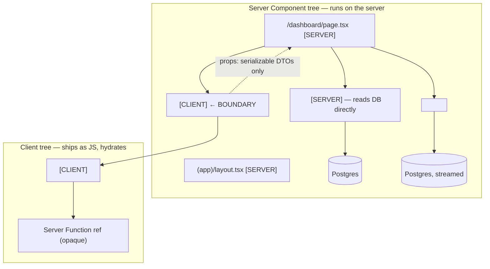

# Module 12 — Server Components: The Deep Dive

**Phase 3: Server/Client Components · Module 12 of 101 (the most important module cluster begins)**

> **Where does this run?** Everywhere in this module is `[SERVER]` — that's the point. You're learning the half of React you've never been able to point at directly.

---

## 1. Concept — What a Server Component *is* (not SSR, not an API)

A **React Server Component** is a React component whose code **only ever runs on the server** and whose *output* — a serialized description of the UI tree — is what the client receives. It is not:

- **Not SSR of old** (renderToString + hydrate the whole thing): the server component's *code never ships at all*. There is nothing to hydrate for it.
- **Not an API endpoint**: it's part of the component tree, callable like a function/component (`<Dashboard/>`), with no HTTP ceremony.
- **Not "fast React"**: it's a *different execution contract* — the component runs in a React server runtime with no DOM, no event system, no browser APIs — and can `await` anything.

What this buys (the actual value stack):

1. **Zero client JavaScript for that component** (and its imports, recursively).
2. **Direct server access from the render**: DB, filesystem, secrets, internal services — no API hop.
3. **Streaming**: the server can keep rendering while slow work awaits; Suspense fallbacks go out first.
4. **The cache becomes structural** (module 05): a server component's output is a cacheable artifact; a client component's *output* is not what you'd cache at the edge.
5. **Secrets stay server-side by construction** — there is no bundle to leak them into.

## 2. Mental Model — the RSC wire format (the "under the hood" you keep deferring)

When a Server Component tree renders, React produces **two things** for the wire:

```
┌────────────────────────────────────────────────────────────┐
│ 1. HTML  — the prerendered/static shell                    │
│    (paintable immediately; includes Suspense fallbacks)    │
├────────────────────────────────────────────────────────────┤
│ 2. RSC payload — a serialized React element tree:          │
│    • Server Components → *descriptions* (type + props),    │
│      NOT their code — the client re-creates the tree       │
│    • Client Components → a *reference* to the client       │
│      bundle that contains them + their props               │
│    • async data → embedded values or "holes" to stream     │
└────────────────────────────────────────────────────────────┘
```

On initial load the browser paints (1) while (2) + client JS chunks load; React then reconciles (2) against the DOM — **hydration happens only for the client components** (and in React 19's selective model, only where interactivity actually exists). On soft navigation (module 11) there is no (1) at all — just the (2) delta, reconciled.

**The consequences you must feel:**

- A Server Component can read `await cookies()` and render "Hello, Dana" — that string is in the HTML; the *logic* that produced it is gone from the wire.
- The same component written as client would ship its code, re-run in the browser, and need the data fetched separately (or serialized as props from a server parent).
- **Props are the only data channel between the two worlds** — and they're serialized (module 13 lists exactly what crosses).

## 3. Architecture — the tree with boundaries marked



**What a Server Component can do** (the capability list):

| Can | Cannot |
|---|---|
| `await` (async component, `use` for promises) | Use `useState`, `useEffect`, `useRef` |
| Read `cookies()`, `headers()`, `params`, `searchParams` | Handle events (`onClick`, `onChange`) |
| Access `process.env` secrets, filesystem, DB | Use browser APIs (`window`, `document`, `localStorage`) |
| Import anything server-side | Pass functions/components as props *to client children* (except serialized things — module 13) |
| Render client components as "leaves" | Be rendered inside a client component (client files import server components as *descriptions* only — actually: a client component *cannot import* a server component at all; the boundary is one-directional: server → client) |

## 4. Production Code

### 4.1 The canonical server page (capstone dashboard)

`FILE: src/app/(app)/dashboard/page.tsx` (production pattern — [SERVER])

```tsx
import { Suspense } from 'react'
import { headers } from 'next/headers'
import { auth } from '@/lib/auth'
import { listOrders } from '@/services/orders'
import { getRevenueSummary } from '@/services/analytics'
import { getRecentActivity } from '@/services/activity'
import { RevenueCard } from '@/features/analytics/components/revenue-card'
import { OrdersTable } from '@/features/order/components/orders-table'
import { RecentActivity } from '@/features/activity/components/recent-activity'
import { DashboardSkeleton } from '@/components/dashboard-skeleton'

export default async function DashboardPage() {
  // [SERVER] — session read is the root of everything user-specific.
  const session = await auth.api.getSession({ headers: await headers() })
  if (!session) throw new Error('unreachable: layout gated this route')
  const orgId = session.organizationId!  // resolved by the org service (module 11-02)

  // Independent slow sections stream independently (module 06):
  return (
    <div className="grid gap-6">
      <Suspense fallback={<DashboardSkeleton section="revenue" />}>
        <RevenueSummary orgId={orgId} />          {/* async child — own Suspense hole */}
      </Suspense>
      <Suspense fallback={<DashboardSkeleton section="orders" />}>
        <OrdersSection orgId={orgId} />           {/* async child */}
      </Suspense>
      <Suspense fallback={<DashboardSkeleton section="activity" />}>
        <RecentActivity orgId={orgId} />          {/* async child */}
      </Suspense>
    </div>
  )
}

async function RevenueSummary({ orgId }: { orgId: string }) {
  const summary = await getRevenueSummary(orgId)  // service → DB; cached per module 05
  return <RevenueCard summary={summary} />        // RevenueCard = [SERVER] presentational
}

async function OrdersSection({ orgId }: { orgId: string }) {
  const { items, nextCursor } = await listOrders(orgId, { limit: 10, sort: { by: 'createdAt', dir: 'desc' } })
  return <OrdersTable orders={items} nextCursor={nextCursor} />  // OrdersTable = [CLIENT] island
}
```

Notes to internalize: (a) the page is a *composition* — it owns the session read and the Suspense topology; (b) async children (`RevenueSummary`) are plain functions, not extra routes; (c) `OrdersTable` is the only client island and receives **DTOs**; (d) there is no `useEffect`, no `fetch` in a client — the data is *already here*.

### 4.2 A server component reading request data (the pattern that makes PPR possible)

`FILE: src/app/(marketing)/products/[slug]/page.tsx` (excerpt — [SERVER])

```tsx
export default async function ProductPage({ params }: { params: Promise<{ slug: string }> }) {
  const { slug } = await params
  // 'use cache' + cacheLife('hours') + cacheTag('product:' + slug) — module 05.
  const product = await getProductBySlugCached(slug)
  if (!product) notFound()
  return <ProductView product={product} />
}
```

Because the read is *cached with a long-enough life*, the page contributes to the **static shell** (prerendered, CDN-served). Remove the cache → it becomes a dynamic hole behind the nearest Suspense. **Caching is what decides static vs dynamic** — module 05-05 proves it.

### 4.3 `use` for promises (React 19)

`FILE: src/features/product/components/product-view.tsx` (simplified example — [SERVER])

```tsx
import { use } from 'react'

// A component that receives a PROMISE of data can "unwrap" it at render with use(),
// suspending on the nearest boundary until it resolves — no useEffect, no state.
export function ProductView({ product }: { product: Promise<ProductDTO> }) {
  const p = use(product)   // [SERVER] — resolves during render; suspends if not ready
  return <article>{p.name}</article>
}
```

`use()` is the primitive that lets *server* code stay declarative about async: pass the promise down, unwrap where you render it. (Clients may also `use` promises/context — module 13.)

## 5. Common Mistakes

| Mistake | Consequence | Fix |
|---|---|---|
| `useState` in a server component | Build error (hook not allowed) | Move the component to the client boundary |
| Fetching in a client component "because it's a component" | Extra roundtrip + you've lost the server boundary | The *parent* server component fetches; passes DTOs |
| Server component importing a client component's *internal* helper | Drags the whole client module into the boundary | Split files: pure helpers in `lib/` (both-safe), UI in the client file |
| Passing a `Date`-only DTO and expecting the client to format it "the same way" | Timezone drift between server render and client event | Format in one place (server, or a shared [BOTH] formatter with explicit timezone) |
| Believing "the server rendered it, so the client has it" | The client has the *serialized props*, not the server's module state | Anything the client needs must be in the serialized payload (props) |

## 6. Security Notes

- The capability list *is* the security model: secrets, DB, and internal services are reachable **only** from server components — a client component importing a service is a build error (module 09-01's `server-only` guard).
- What the server component renders is *publicly visible* (it's in the HTML/RSC payload): never render data the user isn't allowed to see, even "temporarily" — the initial HTML is the attack surface.

## 7. Performance Notes

- Every server component is **client JS you didn't ship**. The audit habit: bundle report → find the largest chunks → ask "which of these could be server components?" (module 18-03 does this systematically).
- Async children + Suspense turn *sequential* data needs into *parallel* streams (module 04-03).
- Cached server components (module 05) make repeated renders **free** — the server skips them entirely.

## 8. Exercise

**Beginner.** Write a server component that reads `process.env` (log the *name*, not value, of an env var to the server console) and renders a counter *without* `useState` (a static number). Then try to add `onClick` and read the exact build error. Explain the error in one sentence.

**Intermediate.** Build `/dashboard` per §4.1 with stub services (in-memory data). Add three independent Suspense sections with distinct artificial delays (1s/2s/3s). In the dev server, observe the HTML stream (View Source shows fallbacks; the network waterfall shows the stream). Screenshot the waterfall.

**Production.** Take any client component in your app that *fetches data in `useEffect`* (write one if needed: a "recent invoices" dropdown). Refactor: the parent server component fetches; the client component receives data as props and keeps only its *interaction* code. Compare: (a) client bundle size delta, (b) first-paint of that section (skeleton → data), (c) what happens with JS disabled. This exercise, done honestly, is the entire pitch of the course.

## 9. Architecture Challenge

**Prompt:** A design system has 40 "UI primitives" (Button, Input, Dialog…) that were written as client components "to be safe." A performance review finds 180KB of client JS is mostly these primitives on a *static* pricing page.

1. Of the 40 primitives, which *can* be server components, and which fundamentally cannot? Give the rule, not a list.
2. What is the migration plan that doesn't fork the component library?
3. After migration, what does the pricing page's client JS contain?

<details>
<summary>Model answer</summary>
1. Rule: **a primitive needs to be client iff it has interactivity the server can't express** — event handlers, browser APIs, client state (open/close for a dialog *is* state, but that state can live in a thin client wrapper around a server-rendered dialog *shell*… in practice: Radix-based primitives (Dialog, Dropdown, Popover) are client; presentational primitives (Button-as-`<button>`, Input-as-`<input>`, Card, Badge, Skeleton, Table markup, Avatar) are pure DOM + classes → server. Roughly: form controls that need JS focus management/dialogs → client; everything that's "markup with classes" → server.
2. No fork: each primitive gets **two exports** or a split file — `button.tsx` (server, no directive) re-exports the shared class logic from `button-styles.ts` [BOTH]; the client variant (`button.tsx` → `button-client.tsx`) wraps it with behavior only where needed. Most primitives end up as the server file with the client file *deleted*. The Radix-backed ones stay client. Ship behind a feature flag per component; verify bundle size per step.
3. The pricing page's client JS ≈ framework runtime + the few genuinely interactive islands (FAQ accordion if client, theme toggle) + nothing from the 40. Expect a multi-100KB reduction and near-zero hydration work.
</details>

## 10. Official Documentation

- Server and Client Components: https://nextjs.org/docs/app/getting-started/server-and-client-components
- React — Server Components reference: https://react.dev/reference/rsc
- React — "use client": https://react.dev/reference/rsc/use-client
- `use`: https://react.dev/reference/react/use
- React Server Components FAQ: https://react.dev/learn/react-server-components-faq

## 11. What You Should Know Before Continuing

- [ ] I can explain the two-part wire format (HTML shell + RSC payload) and what's in each
- [ ] I can state the server-component capability table (can/cannot) from memory
- [ ] I know hydration applies to *client* components only
- [ ] I can build the dashboard page with three independent streaming sections
- [ ] I can apply the "can this be a server component?" rule to a UI primitive

**Next:** Module 13 — Client Components & the Boundary (what `"use client"` actually does, and the island architecture).
