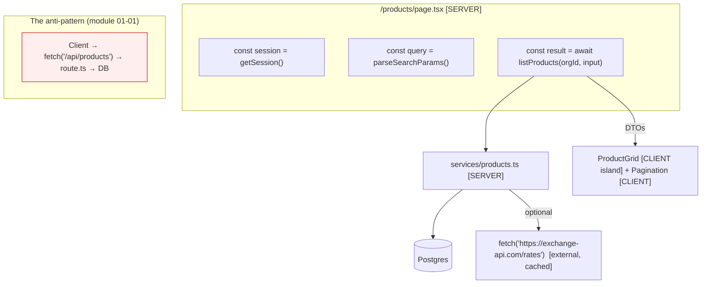

# Module 16 — Fetching Data in Server Components

**Phase 4: Data Fetching · Module 16 of 101**

> **Where does this run?** `[SERVER]` — everything in this module. The "fetch" in modern Next.js data fetching is often *not* an HTTP fetch at all: it's a direct database call inside a Server Component.

---

## 1. Concept — The request is your backend

In the SPA world, "data fetching" means: browser → HTTP → your API → database. In the App Router, when a Server Component needs data, **the code is already where the database is**. The request path collapses:

```
SPA:      Browser ──HTTP──▶ API server ──▶ DB        (2 hops, 2 serializations, 2 auth checks)
Next.js:  Browser ──HTTP──▶ Server Component ──▶ DB  (1 hop, 1 serialization, 1 auth check)
```

The component *is* the backend handler. There is no `/api/products` to write — the page calls `listProducts()` and the data is in the render. This is the single biggest architectural shift from the Pages Router era (where even server code often fetched from its own API routes) and the reason the course has an entire module saying *don't*.

**The exception list (when HTTP *is* the right fetch)** — each one is taught later and is *external*:
1. **Third-party APIs** (Stripe, a payments provider, a logistics API) — you genuinely cross a network to someone else's server. Use `fetch` (module 16-03 for patterns; module 05 for caching it).
2. **Your own Route Handlers** — *only* for the cases module 08 enumerates (external consumers, webhooks, file downloads, streaming responses, BFF aggregation of *separate* backends). Never "because the SPA habit says so."
3. **Client islands fetching on demand** — the narrow cases modules 13–14 justified (polling via `router.refresh()`, on-demand feature data).

Everything else is a **service call to the database**.

## 2. Mental Model — the three data sources in a Server Component

| Source | Pattern | Caching story |
|---|---|---|
| **Your database** | `await listProducts(...)` → service → Drizzle | `use cache` + `cacheLife` + tags on the service (module 05) |
| **External API** | `await fetch('https://api.provider.com/…')` | `use cache` wrapping the fetch (same model); respect the provider's rate limits & ETags |
| **Request data** | `await cookies()`, `await searchParams`, `params` | Not cacheable *in place* — read outside cached scopes, pass as args (module 05-02) |

The pattern for every one of them is identical: **read in the server component, map to a DTO, pass down as props.** The difference is only *where the bytes come from* and *what cache life they deserve*.

## 3. Architecture — the fetch topology for the capstone



## 4. Production Code

### 4.1 Database read in a page (the default)

`FILE: src/app/(marketing)/products/[slug]/page.tsx` (excerpt — [SERVER]; full file in module 07)

```tsx
export default async function ProductPage({ params }: { params: Promise<{ slug: string }> }) {
  const { slug } = await params
  const product = await getProductBySlugCached(slug)   // service with 'use cache' (module 05-02)
  if (!product) notFound()
  return <ProductView product={product} />
}
```

### 4.2 External API read (the honest `fetch`)

`FILE: src/services/exchange-rates.ts` (production pattern — [SERVER])

```ts
import { cacheLife, cacheTag } from 'next/cache'
import { z } from 'zod'

// External provider — a real network boundary, rate-limited, returns JSON.
// The response shape is UNTRUSTED: Zod at the boundary (module 04).
const rateSchema = z.object({
  EUR: z.number().positive(),
  USD: z.number().positive(),
})

const PROVIDER_URL = 'https://api.example-rates.dev/v1/latest'   // from env in production

export async function getExchangeRates(): Promise<z.infer<typeof rateSchema>> {
  'use cache'
  cacheLife('minutes')        // rates change slowly for display purposes
  cacheTag('fx-rates')

  const res = await fetch(PROVIDER_URL, {
    // Next.js fetch in a 'use cache' scope is cached by the framework;
    // plain fetch (no cache) would hit the provider every request — never for a 3rd party.
    next: { revalidate: 300 },   // belt-and-braces at the fetch layer too (module 05-07)
  })
  if (!res.ok) {
    // Fail closed for *display* data? No — fall back to last known value if you keep one,
    // or throw to stream an error boundary (module 08). Never render a fake rate.
    throw new Error(`FX provider error: ${res.status}`)
  }
  return rateSchema.parse(await res.json())
}
```

Notes: (a) the external response is **validated** (it's a trust boundary); (b) the failure mode is a deliberate choice documented at the call site; (c) caching at the service level means *every* page using rates shares one cache entry (module 05-02's "data-level caching").

### 4.3 Reading request data correctly (the pattern that protects your cache)

`FILE: src/app/(app)/settings/page.tsx` (simplified example — [SERVER])

```tsx
import { cookies } from 'next/headers'

export default async function SettingsPage() {
  // REQUEST DATA is read HERE, in the (uncached) scope:
  const cookieStore = await cookies()
  const theme = cookieStore.get('theme')?.value ?? 'system'   // not part of any cache key

  // Cached, session-derived work happens in a child that RECEIVES the value as an arg:
  return <SettingsContent theme={theme} />
}

// A cached function that needs the user? Pass the user in — it becomes part of the cache key
// (module 05-02), so per-user entries are correct and the page's non-user parts can still
// be static.
async function SettingsContent({ theme }: { theme: string }) {
  const profile = await getCurrentProfile()   // 'use cache' inside; keyed by session via getSession()
  return <div>{/* profile form (client island) + preferences */}</div>
}
```

This "read runtime data outside, pass in as args" rule is **the** pattern for keeping Cache Components working (official docs recommend it explicitly; module 05-02 formalizes it with cache keys).

### 4.4 The anti-pattern, executed (study the failure)

`FILE: src/app/api/products/route.ts` (BAD — exists only to be deleted)

```ts
// BAD: a Server Component page fetches this; a client island fetches this;
// both are re-implementing the service layer as an HTTP API for your own app.
import { listProducts } from '@/services/products'
import { NextResponse } from 'next/server'

export async function GET() {
  const items = await listProducts('default-org', { filter: {}, sort: { by: 'id', dir: 'desc' } })
  return NextResponse.json(items)
}
```

**The deletion checklist** (run it on any codebase you inherit):
1. Find every `fetch('/api/…')` where the target is *your own* route.
2. For each: who calls it? Server component → replace with the service call. Client island → check the module 13/14 exceptions; if none apply, lift the data to the parent server component as props.
3. Keep the route handler **only** if an external consumer (mobile app, partner, cron) genuinely calls it — and then treat it as a *public API* (auth, versioning, rate limits — module 08-03), not an internal detail.
4. Measure: TTFB of the page (should improve — one fewer hop), and `/api` traffic (should drop).

## 5. Common Mistakes

| Mistake | Fix |
|---|---|
| "I need an API layer for testability" | You don't — the *service* is the seam; test the service against a real DB (module 20-02). The HTTP layer adds a serialization you must spec, version, and secure for no consumer |
| Fetching in `useEffect` because "components fetch data" | Components don't fetch in this architecture; *pages* (server) do |
| One giant fetch in the page then passing *everything* down | Compose per-section fetches behind Suspense (module 06); narrow DTOs per section |
| `fetch` without handling `!res.ok` | You're parsing an error page as JSON; throw/branch on status |
| Caching an external response for `max` | The provider changes, you don't notice for a year; match the life to the data (module 05-03) |
| Reading `cookies()` *inside* a `'use cache'` scope | Build error / cache corruption — the pattern of §4.3 |

## 6. Security Notes

- **Every external API response is untrusted input**: schema-validate (Zod) before it touches your logic — a compromised/buggy provider is a data-injection vector (malicious strings in `name` fields → stored XSS if you render them unescaped later; React escapes by default, but your *logic* that trusts the shape breaks first).
- **The service is the tenancy boundary**: `listProducts(orgId)` — `orgId` from the session, never from the caller's args if the caller is untrusted (module 11-02).
- Don't log external responses containing PII at debug level (module 21-01).

## 7. Performance Notes

- One fewer hop is not a rounding error: a self-API call is ~10–50ms of latency *plus* the JSON round-trip *plus* a second auth check. At 20 fetches per page (SPA habit), that's seconds.
- `fetch` to external providers: set timeouts (`AbortSignal.timeout(5_000)`), retries *only* for idempotent reads, and cache aggressively — the provider's availability should not be your page's availability (fail with a skeleton + retry UI, not a 500 — module 08).
- Parallelism comes next (module 17): sequential `await`s in a page are waterfalls by construction.

## 8. Exercise

**Beginner.** In a scratch page (server component): (a) read `searchParams` and echo them; (b) `fetch` a public JSON API and render one field; (c) add the `!res.ok` branch and trigger it (bad URL) — observe the error boundary (module 08).

**Intermediate.** Build `getExchangeRates()` from §4.2 with a real public rate API (or a local mock server). Verify: (a) two page loads share one cache entry (dev overlay / logs); (b) the Zod schema rejects a mutated response (run the mock returning `{ EUR: -1 }` and confirm the boundary catches it).

**Production.** Execute the §4.4 deletion checklist on any Next.js app you have access to (yours, a colleague's, a fork of a tutorial). Document: N self-API calls found, M deleted, K kept with the module-08 justification. Measure TTFB before/after on the most affected page (Lighthouse or Web Vitals panel). This artifact is what a senior hire is expected to do in week one.

## 9. Architecture Challenge

**Prompt:** Your app needs data from three sources on one page: (1) the product catalog (your DB), (2) live inventory counts (your DB, changes every few seconds from warehouse webhooks), (3) product reviews (a third-party reviews API, 200ms, rate-limited 60 req/min).

Design the fetch plan: which source gets which mechanism (direct service / client refresh / SSE / cached fetch), what cache life each gets, what the page's Suspense topology looks like, and what happens when source (3) is rate-limited mid-page.

<details>
<summary>Model answer</summary>
(1) Catalog: direct service, `use cache` + `cacheLife('hours')` + `cacheTag('products')` — the static-shell citizen.
(2) Live inventory: this is the *one* genuinely live dataset. Options ranked: (a) 30s `router.refresh()` on a small client island showing counts (cheap, coarse); (b) SSE from a Route Handler (`text/event-stream`, module 08) for true push (cost: a persistent connection per viewer — only for high-value screens like "warehouse view"); (c) *rethink the requirement* — "every few seconds" is usually a stakeholder guessing; 30s + "updated X seconds ago" label covers it. Default (a) or (c); ship (b) only with real usage data behind it.
(3) Reviews: `fetch` inside `use cache`, `cacheLife('minutes')` (reviews don't change fast; the rate limit *demands* caching — 60 req/min against an uncached fetch dies at 30 concurrent users), `cacheTag('reviews:'+slug)`. Rate-limited mid-page: the cached entry (minutes) means a 429 from the provider is rare; if it happens on a *cold* entry, the Suspense boundary catches the throw → the reviews section shows a "reviews unavailable" fallback while the *rest of the page renders* — this is the exact reason the section has its own Suspense boundary (module 06).
Topology: page → [CatalogHero (cached, instant)] + [InventoryBadge (short-lived, streamed)] + [<Suspense><Reviews/></Suspense> (minutes-cached, streams)].
</details>

## 10. Official Documentation

- Fetching Data: https://nextjs.org/docs/app/getting-started/fetching-data
- `fetch` (Next.js): https://nextjs.org/docs/app/api-reference/functions/fetch
- Cache Components (caching fetches): https://nextjs.org/docs/app/getting-started/caching
- Data Security: https://nextjs.org/docs/app/guides/data-security

## 11. What You Should Know Before Continuing

- [ ] I can state the collapsed request path (component → service → DB) and why it beats the self-API hop
- [ ] I know the 3 legitimate HTTP-fetch cases (external API, justified Route Handler, on-demand client) and can reject the 4th (habit)
- [ ] I can write the external-fetch pattern with Zod + cache + failure branch
- [ ] I apply the "read runtime data outside, pass as args" pattern reflexively
- [ ] I have the self-API deletion checklist and have used it once

**Next:** Module 17 — The Service Layer: the seam between components and the ORM.
