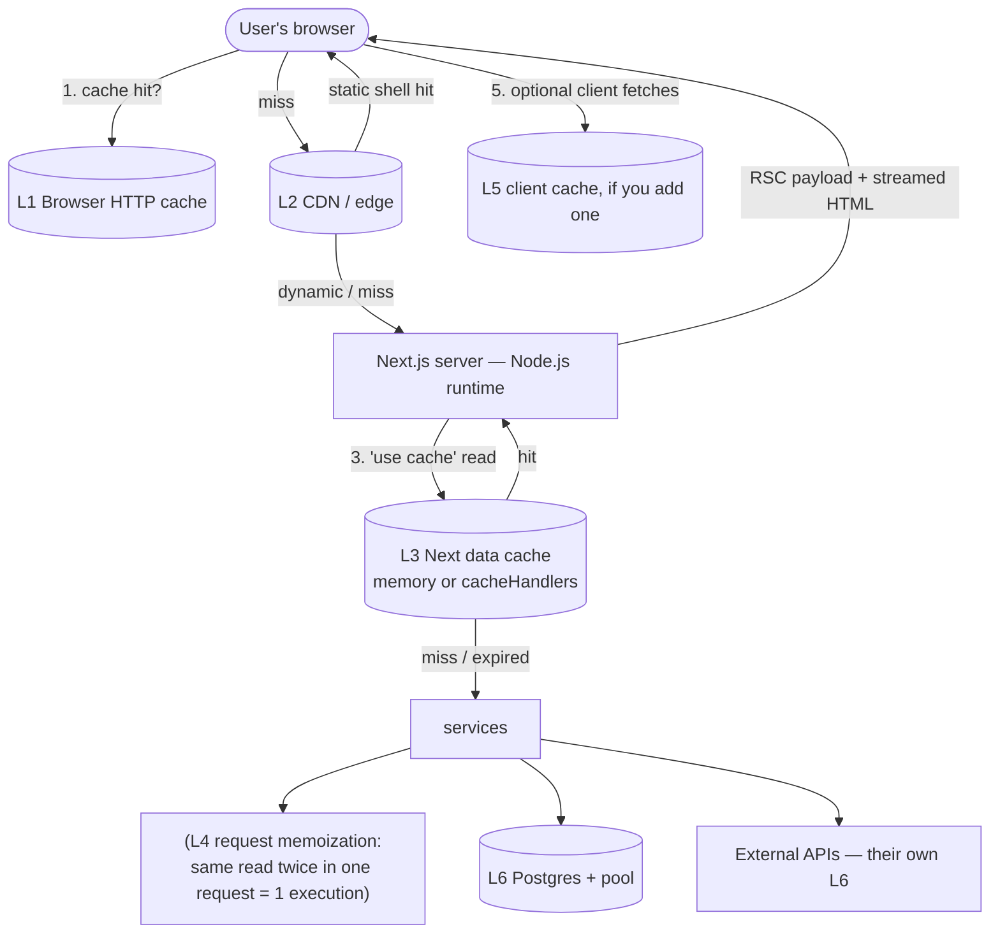

# Module 20 — The Caching Mental Model: Six Layers, Five Questions

**Phase 5: Caching · Module 20 of 101 (the course's deepest section begins)**

> **Where does this run?** Caching in Next.js is a property of `[SERVER]` code and the platform around it. You configure it in code; it lives in memory, on the CDN, and in your browser. This module gives you the *vocabulary* the next six modules fill with mechanics.

---

## 1. Concept — "The cache" does not exist

Every "my data is stale/slow" bug in a Next.js app is a bug about **which** of at least six caches held the value you were looking at. Name the layer and the bug becomes a question with a single answer.

| # | Layer | Where it lives | What it holds | Lifetime control | Who invalidates |
|---|---|---|---|---|---|
| 1 | **Browser HTTP cache** | user's machine (disk/memory) | HTML, JS chunks, images, fonts — whatever sent cache headers | `Cache-Control`, `ETag` (the platform sets sane defaults) | browser policy; new deploy (hashes change) |
| 2 | **CDN / edge cache** | network edge (Vercel/Cloudflare/…) | static assets, **static shell** (prerendered HTML + RSC payload for static routes) | platform + route cacheability | deploy (build ID), tag revalidation reaching the edge |
| 3 | **Next.js data cache** (Cache Components) | server process memory by default; your `cacheHandlers` (e.g., Redis) for durable/shared | return values of `'use cache'` functions & components — keyed by build ID + function ID + serialized args (+ captured closure values) | `cacheLife` (stale/revalidate/expire) | `updateTag` / `revalidateTag` / time / deploy |
| 4 | **Request memoization** | one request's memory | identical uncached calls within one render pass run once per key (e.g., the same `fetch` URL in two components of one page) | request scope | nothing — it dies with the request |
| 5 | **Client cache** (if added) | browser JS memory | server state you chose to fetch client-side (TanStack Query cache — module 23-03) | your library config | your invalidation code |
| 6 | **Database / infra cache** | your infra | DB query cache, connection pool state, PgBouncer, provider-side CDNs | infra config | infra ops |

**Layer 3 is the one you configure in Next.js code; the others you *account for*.** The classic stale-data bug is a layer-3 bug (wrong tag / no invalidation), misdiagnosed as a browser bug (layer 1). The classic slow-page bug is a layer-2/3 miss on a cold key. The classic "works locally, stale on Vercel" bug is layer-3 in-memory ≠ shared (two function instances, two memories — module 05-04's "How Revalidation Works" territory).

## 2. Mental Model — the five questions (the assignment format)

For **every** cached thing you introduce (a service, a page, a section), answer in writing:

1. **WHAT is cached?** the data value? a UI fragment? the whole page? (Cache Components lets you cache at *data level* — a function's return — or *UI level* — a component's rendered output. Know which you chose and why.)
2. **WHERE does it live?** layers 1–6 — be specific: "in-memory on the Vercel function" vs "Redis via cacheHandlers" vs "CDN" are different answers with different failure modes.
3. **FOR HOW LONG?** the `cacheLife` profile (or custom stale/revalidate/expire), and *why that value* (the data's real change rate, not a guess).
4. **WHO invalidates it?** a named mutation (`updateTag` in `cancelOrder`), a job (nightly refresh), a deploy, or "nobody — it's a `max`/`days` life and staleness is acceptable." "Nobody, accidentally" is the failure.
5. **WHAT does the user see after invalidation?** three behaviors (module 05-04): **stale-while-revalidate** (stale now, fresh in background — `revalidateTag`), **immediate** (read-your-own-writes — `updateTag`), **hard wait** (expired entry, no traffic — next request blocks until fresh).

**The ownership rule (the security question inside the caching question):** the cache key must contain *everything the data depends on*. Cache keys are auto-built from arguments (+ captured closure values) — so a function that reads `cookies()` *inside* a cache scope is a **build error**, and the correct pattern (read outside, pass as argument) is simultaneously the *correctness* fix (per-user entries) and the *security* fix (no cross-user bleed). When you see a "cache + user" bug in the wild, this rule is the diagnosis.

## 3. Architecture — where the six layers sit in a request



**The static shell** (built in module 05-05): with `cacheComponents: true`, a route's **static shell** = everything within `use cache` scopes whose `cacheLife` is long enough to store, rendered at build. It lives on the CDN (L2) and can also be served from *prefetch* (module 11) — a prefetched page is the shell + cached data, no server roundtrip at all. Dynamic holes (short-lived/uncached reads, runtime APIs) are the gaps the shell streams over.

## 4. Production Code — the "caching inventory" (the recurring artifact)

Like the boundary inventory (Architecture Review #1), every phase that adds caching produces this:

`FILE: docs/caching-inventory.md` (template)

```md
# Caching Inventory
| Surface (function/component/route) | WHAT (data/UI/page) | WHERE (layer) | HOW LONG (profile + why) | WHO invalidates (exact tag + exact mutation) | USER SEES (SWR / immediate / hard-wait) |
|---|---|---|---|---|---|
| getProductBySlugCached | data | L3 memory (L2 via shell) | 'hours' — catalog changes on publish | 'products' tag ← publish/delist/archive actions | SWR |
| getRevenueSummary | data | L3 | 'hours' — decision-grade, not real-time | 'revenue:{orgId}' ← order paid/shipped/cancelled mutations + webhook | SWR (actor: immediate via updateTag) |
| session read (layout) | data (request) | L3? NO — request data | n/a (not cached) | n/a | always fresh |
| /products page shell | UI (page) | L2 CDN + prefetch | as long as its contents allow | 'products' | instant (prefetch) |
…
```

**Rule: a surface that isn't in the inventory isn't cached deliberately — it's an accident.** The dashboard case study (module 26) is this table, filled in for the capstone, with the reasoning written out.

## 5. Common Mistakes (the six-layer version)

| Mistake | The layer it confuses | Fix |
|---|---|---|
| "Clear the browser cache" as the first debugging move | L1 blamed for L3's bug | Five questions first; browser cache is almost never the app-data bug |
| Expecting in-memory `use cache` to be shared across serverless instances | L3's "where" was never answered | `cacheHandlers` / `'use cache: remote'` for a durable shared cache — or accept per-instance semantics (module 05-02) |
| Caching user-specific data without the user in the key | the ownership rule | read runtime data outside; pass as args (module 05-02) |
| `cacheLife('max')` "because it's fast" | L2/L3 confusion: a max-life entry is a *deploy*-invalidated fossil | Match the life to the data's change rate (module 05-03) |
| Treating the CDN as "the cache" and forgetting L3 exists | both | The shell is L2; the *data* inside dynamic renders is L3 — different invalidation paths |
| Adding a client cache (L5) to "fix" server staleness | L5 solving an L3 problem | Fix the server cache/invalidation; L5 adds a *second* stale layer you now own (module 23-03) |

## 6. Security Notes

- **Cross-tenant/cross-user cache bleed is a security incident**, not a perf quirk: the ownership rule (key = full dependency set) is the control. Test it: two users, same URL shape, assert isolation (module 20-03 exercise).
- **Stale authorization is authorization**: a cached "user is active" check that outlives a suspension is a live bypass. Auth-relevant reads are request-scoped (never `use cache`'d) — module 10-05.
- Cache handlers you add (Redis) hold **your data in your infra** — encrypt it, access-scope it, include it in your secrets/backup/retention review.

## 7. Performance Notes

- The layer you *don't* hit is the win: a CDN shell hit = ~50ms global TTFB; an L3 hit = ~1–10ms server-side; an L6 miss = your DB's latency. The caching architecture's job is to push the *common case* to the leftmost layer the data's freshness allows.
- Measure per-layer: CDN hits (response headers), L3 hits (dev overlay / logs), DB hits (pg_stat_statements). "Cache hit rate" without a layer name is a meaningless number (module 18-01).
- Prefetch (module 11) is *layer-2/3 made invisible to the user*: the cache hit happens before the click.

## 8. Exercise

**Beginner.** For the capstone's current surfaces (catalog list, product detail, session read, one marketing fetch), fill five rows of the caching inventory *before* writing any cache code. Guess the profiles and invalidators now; you'll correct them in modules 22–24 — the *act of committing* to answers is the exercise.

**Intermediate.** In a scratch route: (a) a `use cache`'d function with `cacheLife('minutes')` that returns `Date.now()` at execution; (b) call it from two components on the page; (c) observe L4 (request memoization): one execution per request; (d) navigate away and back (soft nav): cached (L3); (e) after the stale window: observe the SWR behavior. Log timestamps for each. This single experiment teaches you L3 + L4 + stale at once.

**Production.** Cause and diagnose all three classic layer bugs in dev: (1) L1: force a stale HTML (serve with a TTL, don't redeploy, observe); (2) L3: forget to tag a mutation, observe the stale read, fix with the tag; (3) L3-multi-instance (simulate by logging the execution per request — you can't see two instances locally, so *reason* it through the docs: what changes on Vercel vs Docker?). Document each in `docs/cache-bugs.md`.

## 9. Architecture Challenge

**Prompt:** "Users are seeing stale product prices after we update them in the admin." Three engineers propose: (A) "add `revalidatePath('/products')` everywhere we touch a product"; (B) "tag every product read and revalidate the tag on update"; (C) "turn caching off for products — correctness over speed."

For each: what it costs (performance, correctness, blast radius), which one is right *for the catalog pages specifically*, and what the *price* field's freshness contract should actually be (think: who updates prices, how often, what does a 5-minute stale price cost vs a per-update invalidation).

<details>
<summary>Model answer</summary>
(A) `revalidatePath('/products')`: invalidates *everything under that path* — every product detail page, the catalog, any cached section on those routes. It works, but it's a hammer: a price edit on one SKU re-renders the entire catalog surface on the next hit (a cold cache for every product until traffic regenerates them). Blast radius = the whole path.
(B) Tag-based: reads get `cacheTag('products')` (+ per-product `product:{slug}` where you want fine-grained control); the update action invalidates only what it touched. Blast radius = the tag. This is the default-correct design and the one the course standardizes on.
(C) "Turn it off": correct, and *fast enough*? An uncached product read is a DB roundtrip per view — for a public catalog with 10k products and spiky traffic, that's real database load and real TTFB. "Correctness over speed" is the wrong frame: the *stale price* was never a correctness problem in the user's decision (a 5-minute-old price on a catalog page, revalidated on the next request, is the industry-standard tradeoff — the price they *pay* is confirmed at checkout, where the price is re-read fresh server-side). The real correctness requirement is: **the checkout price is never cached** (module 12's checkout: price computed at submit).
So: (B) with `cacheLife('hours')` + `cacheTag('products')`; the update action calls `revalidateTag('products', 'max')` (SWR — other users see the new price on their next visit, background-refreshed); the *admin* who changed the price sees it immediately because the admin's own read is tagged AND the action uses `updateTag('products')` — read-your-own-writes for the actor. Checkout reads the price uncached. Five answers, no hammer, no cache-off.
</details>

## 10. Official Documentation

- Caching (Cache Components): https://nextjs.org/docs/app/getting-started/caching
- Caching (Previous Model): https://nextjs.org/docs/app/guides/caching-without-cache-components
- How Revalidation Works (tags, consistency, multi-instance): https://nextjs.org/docs/app/guides/how-revalidation-works
- CDN Caching: https://nextjs.org/docs/app/guides/cdn-caching
- Cache Handlers: https://nextjs.org/docs/app/api-reference/config/next-config-js/cacheHandlers

## 11. What You Should Know Before Continuing

- [ ] I can name the six cache layers and, for a given symptom, name the suspect layer first
- [ ] I can answer the five questions for any cached surface (and I have the inventory template)
- [ ] I know the ownership rule (key = full dependency set) and why it's a *security* rule
- [ ] I know the three post-invalidation behaviors (SWR / immediate / hard-wait) and their names
- [ ] I know what a static shell is and where it lives (L2, fed by L3-eligible content)

**Next:** Module 21 — Cache Components Deep Dive (`'use cache'`, cache keys, the remote/private variants).
