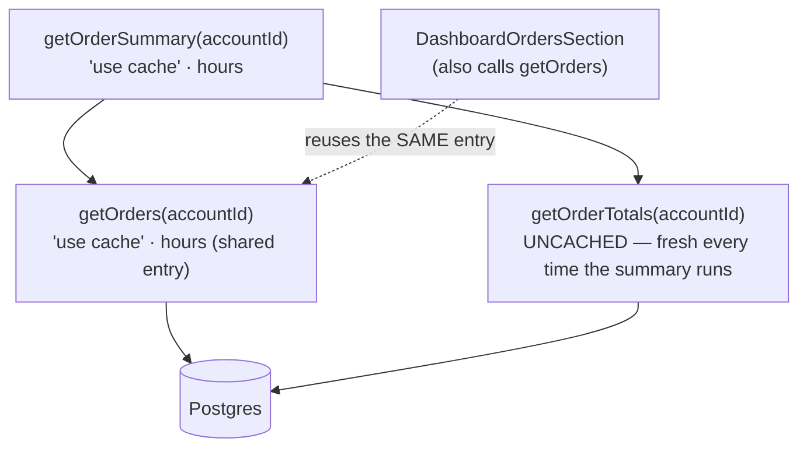

# Module 22 — `cacheLife`: Profiles, Custom Lifetimes, Nested Caching

**Phase 5: Caching · Module 22 of 101**

> **Where does this run?** `cacheLife()` is called `[SERVER]`, *inside* a `use cache` scope, and it answers the WHERE/HOW-LONG questions of module 20 for that scope: **three clocks, one call.**

---

## 1. Concept — Three clocks per cache entry

A cache entry has **three independent timers** (verified against the official `cacheLife` reference):

| Property | Whose clock | What it controls |
|---|---|---|
| **`stale`** | **client-side** | How long the *client router* can serve this entry from its own cache *without checking the server* (instant page loads, possibly outdated). Also decides whether the entry can be part of the route's **static shell** (too short to store → dynamic hole). |
| **`revalidate`** | **server-side (background)** | After this, the *next request* serves the cached value **immediately** and regenerates in the **background** (stale-while-revalidate — the ISR behavior, now a per-entry property). |
| **`expire`** | **server-side (hard)** | After this *with no traffic*, the next request **waits** for a fresh value (hard wait). Must be ≥ `revalidate` (validated — an invalid combo is a build error). |

Read that table again, because it resolves the confusion that sinks most caching designs: **"stale" is a *client* concept and "revalidate/expire" are *server* concepts.** A user can be reading client-cached data that is "stale" by the client clock *while* the server entry is still fresh by its clock — three different "how old is this?" questions, three answers.

## 2. Mental Model — choosing a profile is choosing a *contract*

The preset profiles (official values):

| Profile | `stale` | `revalidate` | `expire` | The contract it expresses |
|---|---|---|---|---|
| `default` | 5m | 15m | never | "standard content; don't guess, say it explicitly" (omit only when the default is truly what you mean) |
| `seconds` | 30s | 1s | 60s | **real-time-ish** (scores, live counters) — *and it's a dynamic hole*: too short to store → never in the shell |
| `minutes` | 5m | 1m | 1h | frequently updated (feeds, news) |
| `hours` | 5m | 1h | 1d | multiple daily updates (catalog, dashboards) |
| `days` | 5m | 1d | 1w | daily updates (blog, pricing) |
| `weeks` | 5m | 1w | 30d | weekly (curated lists) |
| `max` | 5m | 30d | 1y | "rarely changes; a deploy is my invalidation" (legal pages, archived) |

**The decision procedure (write it for every surface — the inventory, module 20):**

1. **What is the real change rate of this data?** (Ask the owner, not your anxiety.) → pick the profile whose *revalidate* is ≥ the change interval with margin.
2. **What does staleness cost?** (A 5-minute-stale price? Fine — checkout re-reads. A 5-minute-stale "account suspended" flag? Unacceptable → **don't cache it at all** — auth-relevant reads are request-scoped, module 10-05.)
3. **Should it be in the static shell?** (Do you want it CDN-served/prefetched?) → the life must be long enough to store (short-lived → it becomes a dynamic hole by design, module 25).
4. **Who invalidates it on mutation?** → name the tag and the mutation *now* (module 23). "We'll add revalidation later" is how stale data ships.

**Custom configs** when a preset doesn't fit (seconds):

```ts
'use cache'
cacheLife({
  stale: 300,        // 5 min client-side instant serving
  revalidate: 900,   // 15 min server background refresh
  expire: 86_400,    // 1 day hard expiry (must be > revalidate — enforced)
})
```

**The rule of placement** (official guidance, worth memorizing): call `cacheLife` **in the same function/component where the cache is defined** — don't abstract it into a shared utility ("`cached(fn, 'hours')`" wrappers hide the behavior; the point of Cache Components is that the lifetime is *visible at the call site*). One call per invocation (branches are fine if only one executes per request).

## 3. Architecture — nested caching (the composition rule)

A cached scope can *call* another cached scope (a UI-level `getOrderSummary` calling data-level `getOrders` — the official example). The composition rule:

- **Each scope has its own entry and its own life.** `getOrders` (hours) and `getOrderSummary` (hours) are *separate entries* keyed by their own args.
- **The inner read is skipped when the inner entry is fresh** — if `getOrders(accountId)` was already filled (by the summary or by a direct call), the summary's call to it *reuses the entry* — the query doesn't re-run. Caching **composes downward**: the fine-grained entries dedupe the coarse ones.
- **The inner lifetime constrains the outer shell placement** (nested-caching behavior): if the inner entry is short-lived (a `seconds` profile), the *outer* scope containing it cannot be stored as a static shell entry for longer than the inner allows — the hole propagates up. (This is how one live section keeps a page's shell honest: the shell is the *intersection* of what all its cached parts can safely store.)



Note the official example's subtle point: `getOrderTotals` is *deliberately uncached* (exported so other parts can read fresh totals) — inside the summary it runs whenever the *summary* runs. **Mixing cached and uncached reads in one scope is a design statement: name which parts are fresh and why** (here: totals are decision-critical; orders can be an hour old).

## 4. Production Code — the capstone's life assignments

`FILE: docs/caching-inventory.md` (the rows this module produces)

```md
| Surface | Profile | Why (change rate + staleness cost) | Shell? | Invalidation |
|---|---|---|---|---|
| listCatalogProducts (data) | hours | catalog changes on publish (human-paced); stale price costs nothing (checkout re-reads) | yes | tag 'catalog' ← publish/delist actions |
| getProductBySlugCached (data) | hours | same | yes (head teams/products) | tag 'products' + 'product:{slug}' |
| getRevenueSummary (data, per-org) | hours | dashboard decision-grade; 1h margin OK | hole for the user (orgId arg) | 'revenue:{orgId}' ← order mutations + webhook |
| getExchangeRates (external) | minutes | provider updates intraday; 429 risk demands caching | no (short) | time-based only (no tag needed) |
| PricingTable (UI) | days | weekly changes at most | yes | 'pricing' ← admin update (updateTag) |
| session read | — NOT CACHED | auth-relevant: stale = bypass | n/a | n/a (request-scoped) |
| getLiveInventoryBadge (data) | seconds | genuinely live; staleness cost = user complaints | no (dynamic hole by design) | time (or SSE upgrade, module 18 challenge) |
```

## 5. Common Mistakes

| Mistake | Symptom | Fix |
|---|---|---|
| No `cacheLife` "to keep it simple" | The implicit `default` (5m/15m/never) applies — *and you can't see it* | Set the profile explicitly everywhere; "default" is a default, not a decision (official guidance) |
| `cacheLife('max')` on data that changes hourly | A year of stale data until a deploy | The change-rate question (procedure step 1) — `max` is for legal pages |
| `cacheLife` in a shared utility (`makeCached()`) | Lifetimes invisible at the call site; the whole point of the model lost | Call it inside the scope; accept the two lines |
| `expire` < `revalidate` | Build error (validated) | Fix the order — and notice the framework caught a contradictory contract |
| Caching a *short-lived* read and *also* expecting it in the shell | It's a hole — that's the design (module 25: short lives are excluded from prerender) | If it must be in the shell, its life must be long enough; if it must be fresh, accept the hole |
| Per-user data cached without the user in the key | Cross-user bleed (security incident) | Runtime data outside + args in the key (module 21); this is the most dangerous row in the inventory |

## 6. Security Notes

- The **staleness-cost question (step 2) is a security question** for auth-adjacent data: role checks, suspension flags, and MFA state are *never cached* — request-scoped reads only. The inventory must show them as "NOT CACHED" rows; a missing row is a review finding.
- `expire` bounds how long a *fossil* entry survives on a dead key (an archived product's page): set it when "eventually someone requests this and gets garbage for a year" is unacceptable.
- Client `stale` (the router serving without checking) means **a logged-out user can keep seeing a logged-in user's page from the client cache** for up to the stale window *if the page was user-scoped* — one more reason user-specific pages shouldn't lean on long client stale (module 10-05 handles the session interaction).

## 7. Performance Notes

- The shell is built from the *intersection* of what's storable (module 22 nesting rule) — one `seconds` section in a layout can demote the *whole route* to shell-plus-holes. Profile the *layout chain*, not just the page.
- Background revalidation (SWR) is free *for the user* (they get the stale value instantly) but costs a *regeneration* — on a high-traffic route, every expired entry's next hit triggers one (deduped). The `expire` clock is your load-shaping tool: stagger it (custom values, not all-`days`) to avoid synchronized regeneration storms (module 23's "how revalidation works").
- `stale` is your **perceived performance** knob: the client serving a 4-minute-old dashboard instantly (stale 5m) is faster *to the user* than a 200ms fresh fetch — then the background check updates silently. Choose stale with the user's patience, not the data's freshness, in mind.

## 8. Exercise

**Beginner.** Assign a profile to every row of your caching inventory (module 20) *in writing* with the 4-step procedure. Defend each to a peer (or to the written record): "hours because… stale costs… who invalidates…". Rows you can't defend are the wrong profile.

**Intermediate.** Build the nested example (summary → orders + uncached totals) with fake delays. Prove in dev: (a) two entry points filling `getOrders` share one execution; (b) the summary's totals run *every* summary execution (log); (c) making totals `seconds`-cached changes the summary's shell eligibility (dev overlay / build output). Explain each in one sentence.

**Production.** Introduce a **regeneration storm** in a test: 10 `days`-life entries, all created at the same build (same age). Advance time (or shrink the lives to minutes for the test) and hit the 10 routes together — observe the 10 simultaneous background regenerations (DB load spike in logs). Fix it the production way: stagger the lives (10 profiles, `days`±offsets via custom configs) and re-observe. Document the pattern in `docs/caching-inventory.md` as the "storm avoidance" note.

## 9. Architecture Challenge

**Prompt:** Product A (your team's data) is used by: the public spec page (changes when an engineer publishes a new version — ~2×/week), the support tooling (must show the *currently published* version, 5s staleness max), and the API you expose to partners (they poll it; it's contractually "fresh within 5 minutes").

One dataset, three freshness contracts. Design: how many cache entries exist (arg by arg), what lives, what tags, how the support tool and the API stay within their contracts *without* invalidating the public page's shell on every publish, and what the publish action's invalidation sequence looks like (order matters — say why).

<details>
<summary>Model answer</summary>
Three *readers*, potentially one *dataset* — but the contracts differ enough that the entries differ too:
- Public spec page: `getProductSpecCached(productId, version='published')` — `cacheLife('weeks')` (changes 2×/week; the margin absorbs it), `cacheTag('spec:' + productId)` — shell-eligible, CDN-served.
- Support tooling: **uncached** read `getProductSpecFresh(productId)` (5s contract ≈ "always read the DB"; a `seconds` profile would also work but is simpler to leave uncached at support-tool traffic volumes — measure, don't assume; if volume grows, `'use cache'` + `seconds` = dynamic hole + per-second background check, which is *more* load than a direct read, not less).
- Partner API: a Route Handler (module 08) reading the *published* spec via the **public** cached entry (hours-or-weeks life) — but the contract says 5 minutes: so the API's read uses a *separate* entry: `getProductSpecForApiCached(productId)` — `cacheLife({ stale: 300, revalidate: 300, expire: 3600 })` (custom: 5-min SWR — matches the contract exactly), `cacheTag('spec-api:' + productId)`. (Contract-driven life, not content-driven — the *contract* is the change-rate question's answer here.)
Publish action sequence (order matters): ① write the new version row + flip `published_version` pointer **in a transaction** (module 09-04) — the DB is the single source of truth first; ② `updateTag('spec:'+id)` **and** `updateTag('spec-api:'+id)` — immediate for the actor (the publishing engineer sees the new version at once — read-your-own-writes) and for the API's next background check; the *public* shell keeps serving the old version until its next hit regenerates in the background (SWR — a few minutes of staleness on the public page is *the contract* for that surface; the publish is a 2×/week event, and the shell's CDN copies don't all flip at once — that's a feature: no thundering herd, no half-deployed-looking site). Never invalidate the public shell *synchronously* on publish: you'd turn a 2×/week event into a fleet-wide cold cache.
</details>

## 10. Official Documentation

- `cacheLife`: https://nextjs.org/docs/app/api-reference/functions/cacheLife
- Caching: https://nextjs.org/docs/app/getting-started/caching
- How Revalidation Works: https://nextjs.org/docs/app/guides/how-revalidation-works
- CDN Caching: https://nextjs.org/docs/app/guides/cdn-caching

## 11. What You Should Know Before Continuing

- [ ] I can name the three clocks (stale=client, revalidate=server-background, expire=server-hard) and what each controls
- [ ] I can run the 4-step profile decision and write the contract sentence
- [ ] I know the nested-caching rule (separate entries, downward dedup, hole propagation)
- [ ] My inventory has explicit profiles (no implicit `default`), NOT-CACHED rows for auth data, and named invalidators
- [ ] I've caused and fixed a regeneration storm (staggered lives)

**Next:** Module 23 — Revalidation: `cacheTag`, `revalidateTag(tag, profile)`, `updateTag`, `revalidatePath` — and the SWR vs immediate decision.
