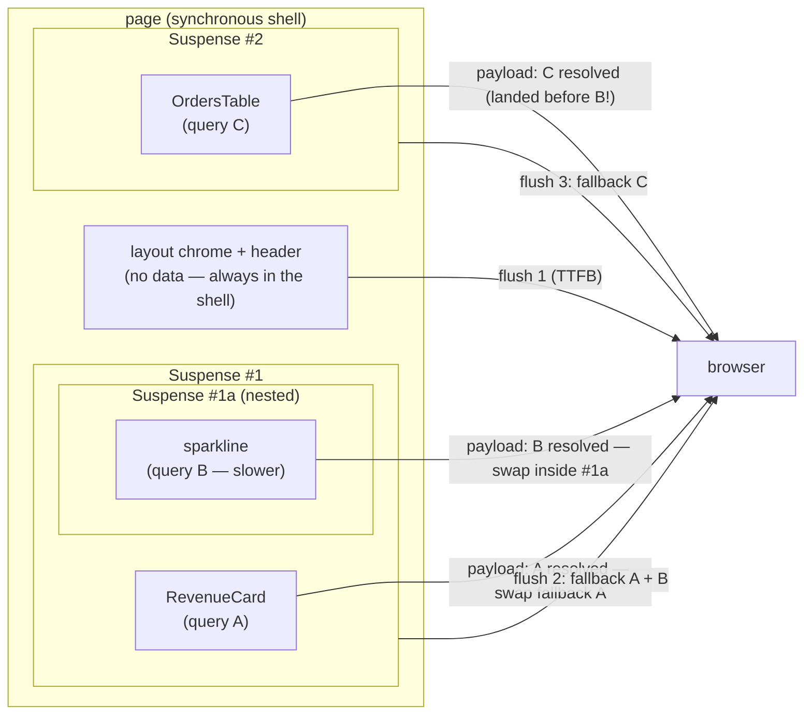

# Module 27 — Streaming Deep Dive: The Shell, the Holes, and Nested Boundaries

**Phase 6: Streaming & Suspense · Module 27 of 101**

> **Where does this run?** Streaming is a **rendering behavior** — the server renders HTML *incrementally* (`[SERVER]`), the browser consumes it incrementally (`[CLIENT]`), and the unit that makes it possible — `<Suspense>` — is `[BOTH — BOUNDARY]`: a boundary the *server* renders a fallback through, and the *client* later swaps for the resolved content.

---

## 1. Concept — What "streaming" actually is (the mechanics)

**The problem without streaming:** a page whose slowest data takes 2s sends *nothing* for 2s. TTFB = the *sum* of the page's work. The user sees a blank/white screen; every metric (TTFB, LCP, FCP) pays the slowest piece's cost.

**The streaming model:** the server sends the page **as it renders**, not when it finishes. HTML is *append-friendly* (the browser can parse and paint what it has while more arrives), so the server can:

1. Render everything *synchronous* (the shell: layout chrome, headers, the fast sections).
2. Hit a `<Suspense>` boundary whose data isn't ready → **flush the HTML so far** to the network, send the *fallback* (the skeleton) for that hole in its final place, and keep rendering.
3. When the slow data resolves, send the **resolved content** in a way the browser can swap: in classic HTML streaming this is the *re-send* trick (HTML re-executes scripts, so the resolved chunk arrives as `<script>` that replaces the fallback's DOM); in the **React Server Components wire format** (module 12's 2-part format), the resolved data arrives as a **payload chunk + a tiny script** that tells the already-hydrated React tree to reconcile the fallback into the real content.

The result: **TTFB = the shell's cost** (the synchronous path), and each hole lands *independently*, in completion order, *after* first paint.

**The precise claim (what streaming does and doesn't change):**

| Metric | Without streaming | With streaming |
|---|---|---|
| TTFB | slowest piece (the page blocks) | the shell (synchronous path only) |
| FCP | TTFB + full parse | TTFB + parse of the shell (earlier) |
| LCP | the LCP element waits for *its* data (no choice) | **unchanged if the LCP element is in a hole** (streaming doesn't make *data* faster — it makes *everything else* not wait for it) — the design rule: **the LCP element belongs in the shell** (module 24's LCP audit) |
| Perceived speed | one big "it arrived" | progressive: chrome → skeletons → sections, each a visible event |

**Streaming is not caching** (the modules-20-26 sibling, different job): caching makes the data *available fast* (a cache hit ≈ 1ms); streaming makes the *unavailable parts not block* (a 300ms hole lands 300ms after first paint instead of delaying the paint). They **compose**: a hole that's a *cache hit* streams in ~1ms (warm case — the dashboard is "instant" because the holes are warm); a hole that's a *cold query* streams in ~200ms (cold case — the skeletons earn their keep).

## 2. Mental Model — `<Suspense>` as the unit of *independent delivery*

**`<Suspense>` is the only unit of streaming.** (React's rule: a boundary isolates a *fallback* — the server can't stream "half of a component," it streams "everything up to the boundary, the boundary's fallback, everything after.") Consequences that follow from that one rule:

1. **A boundary = an independent delivery unit.** The content inside lands when *its* data is ready; the rest of the page doesn't wait. Two slow pieces in *one* boundary land together (the slowest wins); in *two* boundaries, they land independently.
2. **Fallbacks are the user's first impression of the slow parts.** A skeleton with the *right shape* (the section's real dimensions, the real text lengths) makes a 300ms wait feel instant; a spinning spinner makes it feel broken. The fallback is *design surface* (module 13's design system owns the skeleton components — consistent across the app).
3. **The boundary *position* is the design decision.** Too few boundaries (one big boundary around the whole content) = "streaming" that streams nothing (the page is still all-or-nothing). Too many (a boundary per `<p>`) = boundary overhead + a janky "pop" everywhere. **Boundaries go around *data-dependent sections* — the unit is "the thing with its own query" (module 18's sections, module 25's rows).**
4. **Nested boundaries compose** (the module's title claim): a boundary inside a boundary is a *sub-unit* — the inner resolves into the outer's content *independently* of the outer's other parts. (The dashboard: `Suspense(Revenue) > Suspense(revenue's sparkline)` — the card lands, the sparkline lands 50ms later, the card is already visible.)



**Read the order:** C (the orders) can land *before* B (the sparkline) — the holes are *independent*; the user sees the page fill in *by completion*, not by document order. The nested sparkline resolves *into* the already-visible card (the boundary's content, not the page).

## 3. Architecture — Where the boundaries go (the placement rules)

**Rule 1 — Around the query, not around the markup.** The boundary wraps the *component that awaits the data* (the async child, module 18's pattern: `RevenueSummary` awaits `getRevenueSummaryCached`; the `Suspense` wraps `<RevenueSummary>`, not the `<div>` *inside* it). If the boundary is *inside* the async child, the boundary never gets a chance to fall back (the child suspends *before* rendering its own content — the fallback must be *outside* the await).

```tsx
// WRONG: boundary inside the suspender — the fallback is unreachable
async function RevenueSummary() {
  const s = await getRevenueSummaryCached(orgId)   // suspends HERE
  return <Suspense fallback={<Skeleton />}><Card s={s} /></Suspense>  // never rendered as a fallback
}

// RIGHT: boundary outside the suspender
<Suspense fallback={<RevenueSkeleton />}>
  <RevenueSummary orgId={orgId} />                 // the async child, module 18
</Suspense>
```

**Rule 2 — The shell is what renders *before* the first boundary.** Everything synchronous (the layout chrome, the static headers, the nav) is the shell — it's in the TTFB. A component that *awaits* anywhere in its tree (even to read the session) pushes the *shell* behind it — the module-25 dashboard's TTFB is "layout + session + org" precisely because those awaits are *before* the first `Suspense` and are *fast* (two indexed lookups). **Slow synchronous work before the first boundary = slow TTFB** — audit what's in the shell (the module-18-01 TTFB measurement's "what ran before flush 1" list).

**Rule 3 — One boundary per data story, not per visual section.** If two visual sections share one query (the revenue card and the revenue sparkline are *two* queries — two boundaries; but the "last updated" chip that *shows* the revenue's freshness is *not* a query — it's part of the card's boundary, not its own). The unit is the *fetch*, not the `<section>`.

**Rule 4 — Error boundaries are the other half of the boundary's job** (module 09-04's special files): a `<Suspense>` isolates *suspension*; an `error.tsx` (co-located at the same segment) isolates *errors*. **A hole that errors must not take the page down** — the error boundary renders the section's error state (a retry button, the module 09-04 pattern) while the other holes keep streaming. The dashboard: one section's query 500s → that section shows its error UI; the other three sections are *already painted* (they streamed first). This is the *reliability* argument for boundaries, separate from the performance one.

**Rule 5 — Client-side navigation streams too.** A soft navigation (module 11) doesn't re-download HTML — it fetches the *RSC payload* for the target route, and the *same* boundary logic applies on the client: the shell of the new page renders immediately (much of it from the L1 client cache — module 20), and the holes resolve into it as their payloads arrive. **The streaming model is one model** (server HTML streaming on hard loads, RSC payload streaming on soft navigations) — the module-12 wire format's "second part" *is* the hole payloads.

## 4. Production Code — the streaming primitives, complete

### 4.1 The async-child + boundary pattern (the capstone's canonical section)

`FILE: src/app/(app)/dashboard/page.tsx` (the streaming-relevant excerpt — [SERVER])

```tsx
<Suspense fallback={<RevenueSkeleton />}>
  <RevenueSummary orgId={orgId} />
</Suspense>

// the async child: the await is INSIDE; the boundary is OUTSIDE (rule 1)
async function RevenueSummary({ orgId }: { orgId: string }) {
  const summary = await getRevenueSummaryCached(orgId)   // the 'use cache' entry (module 25)
  return (
    <section aria-label="Revenue">
      <RevenueCard summary={summary} />
      {/* nested boundary: the sparkline is a SEPARATE, slower query (rule 3) */}
      <Suspense fallback={<SparklineSkeleton />}>
        <RevenueSparkline orgId={orgId} />
      </Suspense>
    </section>
  )
}

async function RevenueSparkline({ orgId }: { orgId: string }) {
  const points = await getRevenueSeriesCached(orgId)     // hours · 'revenue:{orgId}' — the 30d series
  return <Sparkline points={points} />                   // [CLIENT] island (canvas/SVG — no chart lib in the shell)
}
```

### 4.2 The per-section error boundary (the reliability half — rule 4)

`FILE: src/app/(app)/dashboard/revenue/error.tsx` (production pattern — [CLIENT])

```tsx
'use client'

import { useEffect } from 'react'

export default function RevenueSectionError({
  error, reset,
}: { error: Error & { digest?: string }; reset: () => void }) {
  // The digest is the incident ID (module 09-04): log it server-side (the error digest →
  // the observability pipeline, module 21) and show the user a *recoverable* state.
  useEffect(() => {
    // fire the digest to the telemetry endpoint (module 21-01) — never the raw error (module 19-03)
    void fetch('/api/telemetry', { method: 'POST', body: JSON.stringify({ digest: error.digest, scope: 'revenue' }) })
  }, [error.digest])

  return (
    <section aria-label="Revenue" role="alert" className="rounded-lg border p-6 text-sm">
      <h2>Revenue couldn't load</h2>
      <p>The rest of your dashboard is still current. This section is retrying-safe.</p>
      <button type="button" onClick={reset} className="mt-3 rounded-md bg-primary px-3 py-1.5 text-white">
        Try again
      </button>
    </section>
  )
}
```

**The boundary's *scope* is the segment** (module 09-04): `revenue/error.tsx` catches errors from the `revenue/` route segment's subtree — the other dashboard sections (different segments, or inline async children with their own `error` files at the route) have *their own* boundaries. (Inline async children on one page: the *page-level* `error.tsx` catches any of them — for per-section isolation of inline children, the sections are *segments* (`/dashboard/revenue` rendered via a shared layout, or the client `<ErrorBoundary>` pattern for client islands) — the capstone uses *segments* for the four dashboard sections: the module-25 diagram's "four independent sections" are four segments under a `dashboard` layout — that's why each has its own `error.tsx` *and* its own `Suspense`.)

### 4.3 The skeleton (design surface, module 13's system)

`FILE: src/components/dashboard-skeleton.tsx` (simplified example — [SERVER-safe, no hooks])

```tsx
// Skeletons are the fallbacks — they render in the *streamed HTML* (no 'use client' needed):
// matching the section's real dimensions (the LCP card's width/height) is what makes
// the swap "invisible" (no layout shift — the CLS metric, module 18-05).
export function RevenueSkeleton() {
  return (
    <div aria-hidden className="animate-pulse rounded-lg border p-6">
      <div className="h-4 w-24 rounded bg-muted" />
      <div className="mt-3 h-10 w-40 rounded bg-muted" />
      <div className="mt-6 h-16 w-full rounded bg-muted" />
    </div>
  )
}
```

**Skeleton = same box, no content.** The `aria-hidden` (the skeleton is not content for AT — the real section, when it lands, carries the `aria-label`); the *stable dimensions* (CLS: the swap must not move the layout — the skeleton is the *placeholder* with the final geometry).

## 5. Common Mistakes (the streaming failures)

| Mistake | What the user sees | Fix |
|---|---|---|
| One boundary around the whole page content | "Streaming" that streams nothing — the page is still all-or-nothing (the TTFB = the slowest section) | Boundaries around the *async children* (rules 1–3); the page's sections are independent units |
| The boundary *inside* the async child (rule 1 inverted) | The fallback never renders — the page hangs at the shell with no skeleton (the suspension propagates up to the *nearest enclosing* boundary — which may be the layout's, or none → a white hole) | The `Suspense` wraps the *component that awaits*, never the content *after* the await |
| No boundary at all around an `await` in a page | The *entire page* waits for that `await` (no fallback, no streaming — the await blocks the route's render) | Every `await` in a server component is either (a) in the shell (fast, deliberate — the session/org) or (b) in an async child wrapped in a `Suspense` (the hole) — **there is no third option** |
| A spinner fallback (a 24px circle in a 400px card) | The "it's loading" tell — the user watches a spinner for the card's full 300ms, then a layout shift when the card lands | The skeleton (the *shape* of the content, `aria-hidden`, stable dimensions) — module 13's design-system component |
| A slow *synchronous* read before the first boundary (a DB call in the page body for "the page title") | TTFB pays for it — the shell itself is slow (the most expensive streaming bug: you streamed, but the shell's *cost* is high) | The module-25 rule: the shell's reads are the *fast, indexed, per-request* ones (session/org); anything heavy is a hole (a `Suspense`d child) — or it's cached (the entry hit ≈ 1ms — the shell can include *cheap* cached reads) |
| Nesting a *fast* read in a boundary "just in case" | The fast read's ~1ms cost + a visible *pop* (the skeleton flashes for 50ms before the real content lands) — the pop is *perceived* as jank | Boundary the *slow* reads; the fast cached reads can render in the shell (they're part of the TTFB at ~1ms — free) — the pop is the signal you over-boundaried |
| Assuming streaming makes the *data* faster | The hole lands at its data's latency (200ms cold) — streaming made the *rest* not wait; the hole's latency is the *cache's* job (module 25: warm ≈ 1ms) | Compose: stream *and* cache (the warm case is instant *because* the holes are cache hits) — the module-24/25 documents say so; measure both (module 28's lab) |

## 6. Security Notes

- **The shell renders before the holes — and before some checks, on public pages.** On *authed* routes the session read is *in the shell* (the fast synchronous read, module 25) — the authed shell exists only for the *authenticated* user (the session cookie is required to even *start* rendering the `(app)` layout — the module-10-05 gate). On *public* pages (a product detail: shell = the catalog data, hole = the live stock), the shell is *public by definition* (module 24's security note) — nothing gated goes in the shell.
- **Fallbacks are user-visible content that ships in the streamed HTML**: a skeleton that leaks a *hint* of the data (a "loading Dana's revenue…" skeleton — *don't*; the skeleton must be data-agnostic) or an error boundary that renders *error details* (the module-19-03 line: the user sees "couldn't load," the `digest` goes to telemetry, *never* the message/stack in the streamed HTML).
- **The streamed hole payloads are the RSC wire format** (module 12): they carry *server→client* data (the DTOs) — the module-14 serialization rules apply to *every* hole payload, not just the first flush. A hole that resolves with a non-serializable value (a `Date`, module 14) *fails at the swap*, not at the render — a late-stage failure the module-14 discipline (plain DTOs at the boundary) prevents.

## 7. Performance Notes

- **The TTFB budget is a *rendering* budget** (the module-25 number, now with the streaming lens): the shell = the synchronous path (layout + session 5ms + org 2ms + *cheap cached reads* at 1ms each) → **TTFB ≈ network + ~20ms of server work** — the shell's *rendering* is trivial; its *cost* is the session/org lookups + the cheap cache hits. Everything heavy is *after* the first flush.
- **The holes land by completion** (the diagram): the user's "perceived load time" for the *whole* page ≈ the slowest hole *after* first paint — and the *other* holes are already visible. The *perceived* load is "chrome at 100ms, revenue at 150ms, orders at 180ms, analytics at 350ms" — which *feels* faster than "everything at 350ms" even though the *last* byte arrives at the same time. **Streaming buys the perception; caching buys the latency; both are needed** (the dashboard's "instant" = the warm holes at ~1ms + the progressive shell).
- **Layout shift is the streaming tax if you skip the skeleton** (the CLS, module 18-05): a hole that lands *without* a same-geometry placeholder *moves* the layout (everything below jumps) — the worst perceived-performance bug, and the one users report as "the page jumps." The skeleton's *stable dimensions* are the control (the module-13 design-system rule: every section has a registered skeleton with the section's real geometry).
- **Measure the flushes** (module 28's lab does this): the dev overlay / the request log (module 19's tracer) shows *when* each boundary fell back and *when* each resolved — the "streaming waterfall" — and the lab's experiments manipulate it (make one hole slow, make one hole a cache hit, watch the order change).

## 8. Exercise

**Beginner.** Build the §4.1 pattern (RevenueSummary + the nested sparkline) with stub queries (revenue 400ms, sparkline 900ms, orders 250ms). In dev: (a) confirm the shell (chrome + skeletons) is *visible* before any section (the dev overlay's "rendered" timing, or a `console.time` at the page top vs at each section's await resolution); (b) confirm the **orders land before the sparkline** (250ms < 900ms — the completion order, not the document order); (c) confirm the *nested* sparkline resolves *inside* the already-visible revenue card (the card's number is on screen while its sparkline is still a skeleton). Write the three observations down with their timings — that's the mental model, evidenced.

**Intermediate.** The **over-boundary experiment**: take the working dashboard and (a) wrap the *entire* content in one boundary — re-measure the TTFB (it's back to the slowest section — the anti-pattern, quantified); (b) add a boundary around the *fast* cached read (a 1ms entry) — observe the *pop* (the skeleton flashes) and remove it; (c) put a boundary *inside* the async child (the rule-1 violation) — observe where the fallback goes (the nearest *enclosing* boundary — or the white hole). Document each: the change, the observed behavior, the one-line rule it proves.

**Production.** The **cold/warm streaming profile** (the module-28 lab's setup, run here): with the stub services, capture the streaming waterfall (the tracer log: flush timings, fallback timings, resolution timings) in the **warm** case (entries hot — the module-25 cache) and the **cold** case (a fresh build — every entry cold, the queries at their real latencies). Produce the two waterfalls side by side: the warm case (holes at ~1ms — the "instant" dashboard) and the cold case (holes at 150–400ms — the "graceful" dashboard). The two waterfalls *are* the module-24 contract (warm = instant, cold = graceful), measured. This artifact is the phase-gate evidence.

## 9. Architecture Challenge

**Prompt:** A marketing *product detail* page (public) must ship a **video** (the product demo, ~12MB, hosted on a CDN), the catalog data (shell-eligible, module 24), a **live stock badge** (seconds-cached, a hole), and a **user-specific "this product in your cart" chip** (the viewer may be logged in — the chip shows the cart quantity for a *specific* user).

Design the streaming: what's in the shell (TTFB), what streams when, and the *hard* question — **the user-specific chip on a public, *partially* cached page**: the catalog shell is *globally* cacheable (CDN), but the chip is *per-user*. How do you keep the shell on the CDN *and* show the chip? (Think: where does the chip's data read belong — request-scoped? how does a request-scoped read interact with a *globally cached shell* — the module-24 security note said the shell is public by definition… so what is the chip *actually*, and where does it stream from?) Also: the 12MB video — does it stream? prefetch? and what's its CLS risk (the skeleton's job)?

<details>
<summary>Model answer</summary>
Shell (TTFB): the layout chrome + the **catalog data** (hours-cached entry — the module-24 SHAPE 2 shell: product name, price, description, images, the generated OG — all *globally* cacheable, CDN-served, prefetched on hover — module 11). The TTFB is an edge hit for the shell's HTML.
The **stock badge**: a hole (seconds-cached entry — module 22: short lives are holes) — it streams ~200ms after the shell, behind its chip-skeleton. Public, no user data — fine in the stream.
The **user-specific chip**: the hard one. The key realization: **the chip is not in the *page*'s data path at all** — it's a **client-side read on a per-user resource**. Options, ranked:
  1. **A client component that fetches its own data after hydration** (the module-13's "client data read" pattern — module 07-02's state ladder: this is *user* state, owned by the client, read from a **user-scoped** endpoint or the RSC *island's own* server call): the shell is *global* (no user data — the CDN is honest), the chip is a *client* read (`/api/cart/quantity?productId=…` — a *user-scoped* route, session-checked — module 08-04) that resolves *client-side* after hydration (~100–200ms, behind a "check your cart" placeholder — the chip's *skeleton* is a client-side placeholder, not a server Suspense fallback). The public page's *streaming* is untouched; the chip's per-user-ness lives *outside* the cached shell. **This is the answer**: the module-24 security note ("nothing gated in the public shell") is *enforced* by putting the per-user bit on the *client data path*, not the server stream.
  2. (The tempting, wrong way): a `Suspense` hole in the *server* page that reads the session ("is the viewer logged in? show the chip") — this makes the *entire page* session-scoped: the shell can no longer be globally cached (the module-25's per-session shell) — the *CDN win is gone for the whole page* because of one 20px chip. **Rejected**: a per-user *chip* must not price the *page*'s global cacheability. The rule (generalize it): **per-user data on a globally-cacheable page belongs on the client data path (a user-scoped endpoint the client reads), not on the server stream — the stream stays global, the client read is per-user.**
The **video**: it does *not* stream as part of the page (it's a 12MB asset, not HTML) — `<video>` with the CDN URL: **no preload** (a 12MB preload would *eat the user's bandwidth* before the page is even visible — the anti-pattern: `preload="auto"` on a 12MB demo), `preload="metadata"` (the poster frame + duration, small), and a **poster** (the generated OG image, module 14 — *that's* the CLS control: the video element has the poster's *exact dimensions* from the first paint — the skeleton's job for a media element is the *poster at the final geometry*). The video's *content* loads on user interaction (play) or after LCP (a `requestIdleCallback`/IntersectionObserver to warm it — module 18-05's "load the heavy media after the LCP element") — never in the critical path. The *streaming* story for the video is: the *placeholder* (poster, in the shell) is instant; the *bytes* are deferred and bandwidth-budgeted.
</details>

## 10. Official Documentation

- Suspense: https://nextjs.org/docs/app/api-reference/suspense
- Fetching Data (streaming, async/await): https://nextjs.org/docs/app/getting-started/fetching-data
- Streaming UI (React docs, the underlying model): https://react.dev/reference/react/Suspense
- Error Boundaries (React docs, the reliability half): https://react.dev/learn/catching-errors-with-react-error-boundaries
- Handling Errors (Next's error files): https://nextjs.org/docs/app/guides/handling-errors
- Loading & Skeletons (React 19's `preload`/streaming UI): https://react.dev/reference/react-dom/server/streamableHTML

## 11. What You Should Know Before Continuing

- [ ] I can state *precisely* what streaming changes (TTFB = the shell; holes land by completion) and what it doesn't (it doesn't make data faster — caching does; they compose)
- [ ] I know the five placement rules (around the query; the shell's synchronous cost; one boundary per data story; error boundaries as the reliability half; soft-nav streams too)
- [ ] I can write the async-child + boundary pattern and the per-section error boundary from memory
- [ ] I know the streaming tax (CLS without the skeleton) and the over-boundary pop
- [ ] I can place per-user data on a globally-cacheable page (the client data path, not the server stream)

**Next:** Module 28 — the Dashboard Streaming Lab (the measured version of this module: every section independent, the waterfalls captured, the cold/warm contract evidenced — the phase's lab and gate).
