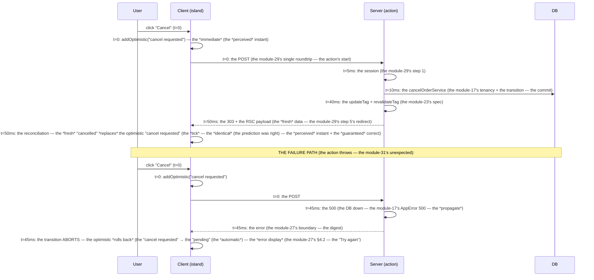

# Module 32 — Optimistic UI & Pending States: `useOptimistic`, `useFormStatus`, Rollback

**Phase 7: Server Functions / Actions · Module 32 of 101**

> **Where does this run?** Pending states are **`[CLIENT]`** (the hooks — `useFormStatus`, `useTransition`, `useOptimistic` — the islands' polish, module 30's "the island is the polish, never the gate"). The *rollback* is **`[BOTH — BOUNDARY]`**: the client *speculates* (the optimistic state), the server *decides* (the action's success/throw), and the framework *reconciles* (the transition's rollback on failure, the module-23 `updateTag`'s fresh data on success). **The client guesses; the server corrects; the user never sees the guess fail silently.**

---

## 1. Concept — The two problems, the two tools

**Problem 1 — The button does nothing visible** (the *perceived* latency): the action takes 20–100ms (module 29's number) + the re-render. A *dead* button during that window reads as *broken* (and invites the *double-click* — module 29's sequential dispatch + the double-mutation). **The tool: the pending state** — `useFormStatus` (the form's action, module 30's §4.2) / `useTransition` (the event-handler action, module 29's invocation #2) — the button *labels itself* ("Saving…", "Cancelling…") + *disables* (the *enhancement* gate — module 30's §4.2 rule: the `disabled` is the *polish*; the *correctness* is the server's idempotency, module 09-04).

**Problem 2 — The truth lags the click** (the *optimistic* gap): the user *cancels the order*; the *truth* (the DB) is updated 50ms later; the *server re-render* arrives 150ms later. For those 150ms, the UI shows the *old* truth ("pending") — the user *double-clicks* (the "it didn't work" reflex) or *distrusts* the UI. **The tool: the optimistic state** — `useOptimistic` (React 19.2, module 01's verified stack): the UI shows the *predicted* truth *immediately*; the server's response *replaces* it (success: the fresh data — module 23's `updateTag`'s re-render — the *tick*; failure: the *rollback* — the transition's abort *restores* the previous state automatically — the *framework's* job, not yours to code).

**The `useOptimistic` contract** (the official React model — `const [optimistic, addOptimistic] = useOptimistic(current, (state, action) => nextState)`):

1. `current` = the *server's* truth (the prop from the RSC payload — the module-12 wire format's down-channel).
2. The action *runs* (the `startTransition(async () => { await myAction(); addOptimistic(predicted) })` — the *optimistic update* is *inside* the transition — the *key* ordering: the `addOptimistic` is *after* the `await`? **No — the `addOptimistic` is *synchronous* (it *speculates* immediately); the `await` is the *server's* decision — the *official* pattern: `startTransition(() => { addOptimistic(predicted); void myAction() })` — the *speculation is instant* (the *before* the await — the *module-32's rule: the `addOptimistic` is *synchronous* (the *optimistic* is the *guess* (the *the* *the await is the *check* — the *two are separate* (the *module-12's wire format: the *down* (the truth) + the *up* (the action) — the *optimistic is the *client's* *in-between* (the *the* *the gap the *module-32 closes*)**.
3. **On success**: the action's *redirect/re-render* carries the *fresh* server data (the module-23's `updateTag`'s entry re-read) — the *new* `current` *replaces* the optimistic (the *reconciliation* — the *tick*: the user sees the *predicted* state, then the *confirmed* state — *identical* (the prediction was right) — the *perceived* instant + the *guaranteed* correct).
4. **On failure** (the action *throws* — the module-31's *unexpected* (the 500) *or* the *expected-as-throw* (the 409 that the action *didn't catch*) — the module-31's split, the *optimistic's* version): the *transition aborts* → React *rolls back* the optimistic state (the *previous* `current` *restores* — the *automatic* — the *module-32's rule: **the rollback is the framework's** (the `startTransition`'s abort → the optimistic *reverts*) — the *you* code the *error display* (the module-31's state / the module-27's boundary) — the *the* *the no manual rollback* (the *module-13's "don't manage state the framework manages" line*)**.

**The label discipline** (the module-32's *security-adjacent* UX rule — the *honesty* of the optimistic): the optimistic state is a **prediction** — the *label* must say so for *irreversible* mutations:

| Mutation type | The optimistic label | Why |
|---|---|---|
| **Reversible** (the *toggle*: the order's "hide" flag; the *cart add* (the *remove* is the undo)) | *"Hidden"* / *"Added"* (the *present* — the *prediction as truth*) | The *rollback* is *invisible* (the flag *un-hides* — the *user's* *mental model* is *the toggle* (the *module-13's* copy) — the *optimistic present is *honest* (the *the* *the the *rollback is *the toggle's natural state* (the *module-32's line: the *reversible → the present*)) |
| **Irreversible** (the *cancel order*; the *refund*; the *delete*) | *"Cancel requested"* / *"Refund processing"* (the *requested/processing* — the *prediction as *in-progress**) | The *rollback* is *visible* (the *"requested"* *reverts to "pending"* — the *user* *sees the *correction* (the *honest*) — the *optimistic present ("Cancelled") is *a lie* if the *server* *rejects* (the *module-29's create is not idempotent* line, the *cancel's* version: the *cancel is *idempotent* (the module-09-04's guard) — *but the *refund is not* (the *the* *the the *payment provider's* *refund is *one-shot* (the *module-29's bulk's *already-refunded* skip — the *refund's optimistic present is *the lie* (the *module-32's line: the *irreversible → the requested*)) |
| **Create** (the *product create*) | *No optimistic* (the *module-29's create is not idempotent* — the *optimistic "Created" is *the lie* if the *server* *rejects* (the *validation* — the module-31's state) — the *the* *the the *create's* *pending is *the "Creating…"* (the module-30's SubmitButton) — the *no optimistic* (the *module-32's decision table, the create's row: **no**)) | The *create's* *optimistic would be *a phantom* (the *the* *the the *UI shows a *product that doesn't exist* (the *the* *the the *re-render is *the redirect* (the *module-29's step 5) — the *no in-place state* to *optimistically update* (the *module-32's line: the *create → the no optimistic* (the *the* *the the *redirect is the *optimistic's* *replacement* (the *module-29's single roundtrip*)*) |

**The decision table** (the module-32's artifact — the *per-mutation* optimistic, the *module-29's inventory's* *adjacent* column):

```md
| Mutation (module-29's inventory) | Pending label | Optimistic? | The optimistic state (the predicted) | The rollback (the visible?) |
|---|---|---|---|---|
| createProduct | "Creating…" | **no** (the module-29's create) | — | — (the redirect) |
| updateProduct (the save) | "Saving…" | **yes** (the reversible edit — the *optimistic* is the *edited values* (the *the* *the the *form's* *values* (the *module-31's preserved* — the *optimistic is *the form's own state* (the *the* *the the *no separate optimistic* (the *the* *the the *form's values are *the optimistic* (the *module-31's useActionState's preserved values* — the *module-32's line: the *edit's optimistic is *the form's preserved state* (the *no addOptimistic* (the *module-31's state is the *optimistic*)) | — (the redirect) |
| delistProduct | "Delisting…" | **yes** (the reversible status — the *optimistic* is the *"delisted"* badge) | the badge = "delisted" | visible (the badge reverts to "active" — the *module-27's tick*) |
| cancelOrder | "Cancelling…" | **yes** (the *requested* label — the *optimistic* is the *"cancel requested"* status) | the status = "cancel requested" | visible (the status reverts to "pending" — the *honest*) |
| refundOrder | "Refunding…" | **no** (the irreversible — the *optimistic present is the lie* — the *pending label only*) | — | — |
| markShipped | "Shipping…" | **yes** (the *requested* — the *optimistic* is the *"shipping requested"*) | the status = "shipping requested" | visible (reverts to "pending") |
| inviteMember | "Sending…" | **no** (the *email is external* (the *module-21's email — the *invite's* *optimistic would be *a phantom member* (the *the* *the the *member's* *state is *pending* (the *module-11's membership — the *invite is *the pending* (the *module-29's inventory's row 7) — the *no optimistic* (the *module-32's line: the *invite → the no optimistic* (the *the* *the the *pending is the *truth* (the *module-11's membership state*)*) | — | — |
| removeMember | "Removing…" | **no** (the irreversible — the *session revocation* (the module-23's suspend pattern — the *optimistic would be *a phantom* (the *the* *the the *member's* *access is *the session's* (the *module-10-03's revocation) — the *no optimistic*) | — | — |
| updateOrgSettings | "Saving…" | **yes** (the reversible edit — the *optimistic* is the *edited settings*) | the settings = the edited | — (the redirect) |
| bulkRefund (the module-29's challenge) | "Processing N refunds…" | **no** (the irreversible ×N — the *module-29's challenge's line: the *no optimistic 100%* (the *the* *the the *honest label* (the *"Processing…"*) — the *result DTO is the truth* (the module-29's return)) | — | — |
```

## 2. Mental Model — The three clocks (the *optimistic's* timeline)



**The read:** the *success* path's *perceived* time is *t=0* (the optimistic) — the *real* time is *t=50ms* (the server) — the *gap is 50ms* (the *user never sees it* — the *optimistic is the *50ms* (the *module-32's line: the *optimistic is the gap-filler* (the *the* *the the *server's* *truth is the *reconciler* (the module-23's tick) — the *the* *the the *two are the *module-32's pair* (the *optimistic + the tick*)**. The *failure* path's *rollback is *automatic* (the transition's abort) — the *you* code the *error display* (the module-27's boundary) — the *no manual rollback* (the module-13's line).

## 3. Architecture — The capstone's optimistic islands (the *OrdersTable*'s cancel, complete)

The module-25's `OrdersTable` (the [CLIENT] island) gets the *cancel's* optimistic (the *module-32's decision table's row 4*: the *yes* — the *requested* label):

`FILE: src/features/order/components/orders-table.tsx` (production pattern — **[CLIENT]** — the *module-25's island* + the *module-32's optimistic*)

```tsx
'use client'

import { useOptimistic, useTransition } from 'react'
import { cancelOrder } from '../order-actions'   // the module-29's action (the *event-handler* invocation — the module-29's §3.2's #2)
import { OrderDto } from '@/services/orders'     // the module-17's DTO (the *prop* from the RSC payload — the module-12's wire format)

export function OrdersTable({ orders, nextCursor }: { orders: OrderDto[]; nextCursor: string | null }) {
  // the *current* = the server's truth (the module-12's down-channel — the *prop*):
  const statuses = new Map(orders.map((o) => [o.id, o.status]))
  const [optimisticStatus, addOptimisticStatus] = useOptimistic(statuses, (map, { id, status }) => {
    const next = new Map(map)
    next.set(id, status)   // the *prediction* (the *module-32's rule: the addOptimistic is *pure* (the *no side effects* (the module-13's line)))
    return next
  })

  const [isPending, startTransition] = useTransition()

  const onCancel = (id: string) => {
    startTransition(() => {
      addOptimisticStatus({ id, status: 'cancel-requested' })   // the *immediate* (the t=0 — the *module-32's label: the "cancel requested" (the *irreversible → the requested* (the module-1's table))
      void cancelOrder(id)   // the *check* (the t=0→50ms — the module-29's single roundtrip) — the *throw* (the failure) → the *rollback* (the automatic — the module-1's sequence diagram's failure path)
    })
  }

  return (
    <table className="w-full text-sm">
      <thead>
        <tr className="border-b text-left">
          <th className="py-2">Order</th><th>Status</th><th>Total</th><th />
        </tr>
      </thead>
      <tbody>
        {orders.map((o) => {
          const status = optimisticStatus.get(o.id) ?? o.status   // the *optimistic first* (the *the* *the the *fallback is the server's* (the module-12's truth) — the *module-32's line: the optimistic is the *overlay* (the *the* *the the *server's is the *base*))
          return (
            <tr key={o.id} className="border-b">
              <td className="py-2">{o.number}</td>
              <td>
                <span className={status === 'cancel-requested' ? 'text-amber-600' : status === 'cancelled' ? 'text-danger' : 'text-muted'}>
                  {STATUS_LABEL[status]}   // the module-13's copy (the "Cancel requested" — the *honest label* (the module-1's table))
                </span>
              </td>
              <td>${o.total.toFixed(2)}</td>
              <td>
                {o.status === 'pending' && (
                  <button onClick={() => onCancel(o.id)} disabled={isPending}
                          className="text-sm text-danger disabled:opacity-50">
                    {isPending ? 'Cancelling…' : 'Cancel'}   // the module-29's pending gate (the *enhancement* — the module-30's §4.2's rule)
                  </button>
                )}
              </td>
            </tr>
          )
        })}
      </tbody>
    </table>
  )
}
// the STATUS_LABEL (the module-13's design system — the copy):
const STATUS_LABEL: Record<string, string> = {
  'pending': 'Pending', 'paid': 'Paid', 'shipped': 'Shipped', 'cancelled': 'Cancelled',
  'cancel-requested': 'Cancel requested',   // the *optimistic's* label (the module-32's line: the *irreversible → the requested*)
  'shipping-requested': 'Shipping requested',
}
```

**The `useOptimistic`'s *key* contract** (the module-21's "the key is the contract," the *optimistic's* version): the *`current`* is the *Map* (the *statuses*) — the *`useOptimistic`'s* *identity* is the *`current`'s reference* (the *the* *the the *`new Map(…)`* *per render* — the *module-13's line: the *memoize the `current`* (the `useMemo` — the *no re-optimistic on every render* (the *module-32's performance note: the *`useOptimistic`'s re-initialization is the *Map's identity change* (the *the* *the the *`useMemo` on the `statuses`* (the module-13's React-19's compiler-assisted (the module-01's React Compiler — the *auto-memoization* (the module-13's line) — the *the* *the the *manual `useMemo` is the *pre-compiler* (the module-13's note)))**:

```tsx
  const statuses = useMemo(() => new Map(orders.map((o) => [o.id, o.status])), [orders])   // the *module-32's rule: the memoize the current (the no re-init per render)
  const [optimisticStatus, addOptimisticStatus] = useOptimistic(statuses, (map, { id, status }) => { … })
```

**The *form's* pending** (the *module-30's `SubmitButton`*, the *useFormStatus* — the *module-32's* *form's* version): the *module-30's §4.2's* `SubmitButton` is the *form's* pending (the *module-32's decision table's row 1/2: the create/update's pending label*) — the *no optimistic* for the *create* (the module-1's table) — the *edit's optimistic is the form's preserved state* (the module-31's `useActionState`'s values — the *module-32's line: the edit's optimistic is the form's state (the no `addOptimistic`) — the *two are separate* (the module-31's round-trip vs the module-32's optimistic — the module-33's matrix's row).

## 4. Production Code — The `delistProduct`'s optimistic (the *reversible* — the *present* label, the module-1's table's row)

The module-30's product form's *delist* button (the `formAction`) — the *optimistic* is the *badge* (the *reversible → the present*):

`FILE: src/features/catalog/components/delist-button.tsx` (production pattern — [CLIENT] — the *module-30's formAction's* *optimistic* version)

```tsx
'use client'
import { useOptimistic, useTransition } from 'react'
import { delistProduct } from '../product-actions'   // the module-29's action (the *event-handler* — the formAction's *client* version (the *the* *the the *module-30's formAction is the *native* (the *module-30's floor) — the *this is the *JS-on enhancement* (the *module-30's line: the floor is the formAction (the native) — the optimistic is the *JS-on* (the *the* *the the *no optimistic in the floor* (the module-30's §4.2's rule: the no island gates the floor — the *optimistic is the *enhancement*)

export function DelistButton({ slug, isDelisted }: { slug: string; isDelisted: boolean }) {
  // the *current* = the server's truth (the module-12's prop — the product's status):
  const [optimisticDelisted, addOptimisticDelisted] = useOptimistic(isDelisted, (prev, next) => next)
  const [, startTransition] = useTransition()

  if (isDelisted || optimisticDelisted) {
    return (
      <div className="flex items-center gap-2 text-sm">
        <span className="text-muted">Delisted</span>
        <button onClick={() => startTransition(() => {
          addOptimisticDelisted(false)   // the *re-list* (the *reversible* — the *present* (the module-1's table: the reversible → the present))
          void relistProduct(slug)   // the module-29's action (the *re-list* — the *module-29's inventory's adjacent*)
        })}>
          Re-list
        </button>
      </div>
    )
  }
  return (
    <button onClick={() => startTransition(() => {
      addOptimisticDelisted(true)   // the *immediate* (the *delisted badge* (the *reversible → the present* (the module-1's table))
      void delistProduct(slug)   // the *check* (the *throw* → the *rollback* (the automatic) — the badge reverts to "active" (the module-1's sequence diagram's failure path))
    })}>
      Delist product
    </button>
  )
}
```

**The *reversible vs irreversible* in code** (the *module-32's* *two examples*, the *contrast*): the *delist* (the *reversible* — the *optimistic present*: the *"Delisted"* badge — the *rollback is the badge's revert* (the *invisible* (the module-1's table: the reversible → the present))) vs the *cancel* (the *irreversible* — the *optimistic requested*: the *"Cancel requested"* — the *rollback is the status's revert* (the *visible* (the module-1's table: the irreversible → the requested))). The *same pattern* (the `useOptimistic` + the `startTransition`) — the *different label* (the *module-13's copy* — the *honesty* (the module-1's table's "why" column)).

## 5. Common Mistakes (the optimistic failures)

| Mistake | The symptom | Fix |
|---|---|---|
| **The optimistic present for the *irreversible*** (the *cancel's* *"Cancelled"* (the *module-1's table's violation*) — the *server rejects* (the 409 — the *already cancelled*) — the *rollback* is *visible* (the *"Cancelled" → "Pending"* — the *the* *the the *user sees the *lie* (the *the* *the the *distrust*) | The *perceived* bug: the *"it said cancelled, then it wasn't"* — the *module-32's line: the *irreversible → the requested* (the *module-1's table*) | The *module-1's table* (the *per-mutation* label: the *reversible → the present*; the *irreversible → the requested*; the *create → the no optimistic*) — the *module-13's copy review* (the *label's* *honesty* — the *module-32's standing line: the *optimistic label is the *honesty* (the *the* *the the *the user trusts the UI* (the *module-13's line*)*) |
| **The `addOptimistic` *after* the `await`** (the *module-1's rule's violation*: the `startTransition(async () => { await myAction(); addOptimistic(…) })`) | The *optimistic is *the server's time* (the *t=50ms* — the *no perceived instant* (the *module-32's line: the *optimistic is the *gap-filler* (the *t=0*) — the *after the await is *the server's* (the *no gap* (the *module-1's sequence diagram: the t=0's addOptimistic*) | The *module-1's rule*: the `addOptimistic` is *synchronous* (the *before* the await — the *the* *the the *speculation is the *client's* (the t=0) — the *check is the *server's* (the t=0→50ms) — the *two are separate* (the module-12's wire format: the up (the action) + the down (the truth) — the *optimistic is the in-between*)) |
| **The *manual* rollback** (the `catch` that *reverts* the optimistic (the `addOptimistic(previous)`) — the *module-13's line violated: the *don't manage state the framework manages*) | The *double-rollback* (the framework's automatic + the manual — the *the* *the the *flicker* (the *revert twice*) — the *the* *the the *race* (the manual's revert *before* the framework's (the *module-13's line: the *no manual rollback*) | The *module-1's sequence diagram's failure path*: the *rollback is the framework's* (the transition's abort) — the *you code the error display* (the module-27's boundary) — the *no manual rollback* (the module-13's line) |
| **The `useOptimistic` *without* the memoized `current`** (the *`new Map(…)`* per render — the *module-3's rule's violation*) | The *re-optimistic on every render* (the *the* *the the *Map's identity change* → the `useOptimistic` re-initializes → the *optimistic is lost on re-render* (the *module-32's performance note: the memoize the current*) | The *module-3's rule*: the `useMemo` on the `current` (the `statuses` — the `orders` dep) — the module-13's React-19's compiler-assisted (the module-01's React Compiler — the auto-memoization (the module-13's line)) |
| **The optimistic *on the create*** (the *module-1's table's violation* — the *"Created"* badge *before* the server confirms) | The *phantom product* (the *UI shows a product that doesn't exist* — the *the* *the the *server rejects* (the validation — the module-31's state) — the *the* *the the *phantom is the *lie* (the module-29's create is not idempotent) | The *module-1's table*: the *create → the no optimistic* (the *the* *the the *redirect is the replacement* (the module-29's single roundtrip) — the *the pending label only* (the module-30's SubmitButton)) |
| **The *double-click* without the pending gate** (the *module-29's* *double-mutation* — the *optimistic's* *version*: the *second click* *re-speculates* (the `addOptimistic` again) — the *the* *the the *optimistic is *the same* (the idempotent speculation) — the *the* *the the *real bug is the *second POST* (the module-29's sequential dispatch — the double-mutation) | The *double-mutation* (the module-29's — the *cancel twice* — the *409* — the *module-31's expected* (the "already cancelled") — the *the* *the the *optimistic is *the same* (the no harm) — the *harm is the *second POST* (the module-29's line) | The *module-29's pending gate* (the `disabled={isPending}` — the *module-30's §4.2*) — the *module-32's line: the pending gate is the *double-click's control* (the module-29's — the *optimistic is the *gap-filler* (the module-32's) — the *two are separate* (the module-33's matrix's row: the pending (the module-32's) + the idempotency (the module-09-04's) — the *no conflating*) |
| **The optimistic *outliving* the navigation** (the *optimistic state* *after* the user navigates *away* — the *module-13's line: the *optimistic is the *component's* (the *no global*) — the *the* *the the *navigating away* *unmounts* the island → the *optimistic is gone* (the *automatic*) — the *bug is the *optimistic in a *layout* (the *persistent* — the *the* *the the *layout's optimistic outlives the page* (the module-13's line: the *optimistic is the page's* (the no layout's optimistic*) | The *stale optimistic* (the *layout's* *optimistic shows on the *next page* (the *module-13's line: the *optimistic is the component's*)) | The *module-13's line*: the *optimistic is the page's island* (the *no layout's optimistic*) — the *the* *the the *navigation's unmount is the *cleanup* (the automatic) |

## 6. Security Notes

- **The optimistic is *never* the *security state*** (the *module-32's standing line*): the *optimistic is the *perception* (the *module-32's concept) — the *security is the *server's* (the module-29's action's checks — the *session/role/tenancy*) — the *optimistic *can't* be *the auth state* (the *module-10-05's request-scoped* — the *no optimistic session* (the *module-20's NOT-CACHED row: the *session is the *request-scoped* (the *no cache, no optimistic*) — the *module-32's line: the *optimistic is the *UI state* (the *no security state*)**.
- **The optimistic *label* is the *user-facing* (the module-13's copy)**: the *"Cancel requested"* is *rendered* (the module-14's escape — the *no HTML*) — the *module-19-03's "no internals"*: the *optimistic's label is the copy* (the *module-13's design system* — the *no "error: 409" in the label*) — the *module-32's line: the *optimistic label is the copy* (the *module-13's*) — the *the* *the the *server's error is the *module-31's state* (the *separate* (the module-33's matrix)).
- **The *optimistic* + the *CSRF* (the module-30's §6)**: the *optimistic is the *client's* — the *CSRF token is the *floor's* (the module-30's §6: the *hidden input* — the *no island owns the token*) — the *the* *the the *optimistic's island* *doesn't* *touch the token* (the *module-4.2's rule: the no island owns a floor-critical security value*) — the *module-32's line: the *optimistic is the UI* (the *no security value*)**.

## 7. Performance Notes

- **The *optimistic is the perceived instant*** (the *module-32's concept, the number*): the *perceived* time is *t=0* (the optimistic) — the *real* is *t=50ms* (the server) — the *gap is 50ms* (the *user never sees it*) — the *module-18-01's measurement: the *optimistic's* *perceived latency is 0* (the *t=0*) — the *real latency is the action's* (the module-29's 20–100ms) — the *the* *the the *optimistic is the *perceived* performance* (the module-29's §7's line: the pending feedback is the perceived — the *optimistic is the *perceived's* *version* (the *module-32's line: the *optimistic is the perceived instant* (the t=0)*)**.
- **The *reconciliation's* cost** (the *tick*): the *success's* re-render (the module-23's `updateTag`'s entry re-read) — the *RSC payload* (the module-12's wire format) — the *client's* reconciliation (the *diff* — the *module-13's React's reconciliation*) — the *the* *the the *tick's cost is the re-render* (the module-18-01's measurement — the *the* *the the *no perceptible cost* (the *the* *the the *payload is small* (the module-12's DTO) — the *module-32's line: the tick is the *re-render* (the no cost*)**.
- **The *rollback's* cost** (the *failure*): the *transition's abort* → the *optimistic's revert* (the *automatic*) — the *the* *the the *re-render* (the *revert*) + the *error display* (the module-27's boundary) — the *the* *the the *rollback's cost is the re-render* (the module-18-01's) — the *module-32's line: the rollback is the *re-render* (the no cost*) — the *the* *the the *the failure is the *rare* (the *module-17's AppError's expected — the *module-31's catch*) — the *the* *the the *the common is the success* (the *tick*)**.

## 8. Exercise

**Beginner.** Build the *OrdersTable's cancel* (the *module-3's complete island*) — the *stub* `cancelOrder` (the module-29's action — the `delay(300)` — the *module-28's stub*). **The optimistic test** (the *JS-on*): *click Cancel* → the *status* *immediately* shows *"Cancel requested"* (the t=0 — the *optimistic*) — the *button* shows *"Cancelling…"* (the pending) — *t=300ms*: the *re-render* (the *fresh* "cancelled" — the *tick* — the *identical* (the prediction was right)) — *screenshot the three* (the t=0's "Cancel requested," the pending's "Cancelling…," the t=300's "cancelled"). **The rollback test**: the *stub* *throws* (the 500 — the `delay(300)` + the `throw`) — *click Cancel* → the *"Cancel requested"* (the t=0) — *t=300ms*: the *rollback* (the *"Cancel requested" → "Pending"* (the *automatic*) + the *error* (the module-27's boundary — the "Try again") — *screenshot the rollback* (the *revert* + the error).

**Intermediate.** The *reversible vs irreversible* (the *module-4's delist* + the *module-3's cancel*): the *delist* (the *reversible* — the *optimistic present*: the *"Delisted"* badge) + the *cancel* (the *irreversible* — the *optimistic requested*: the *"Cancel requested"*) — *test both* (the *success* + the *failure*) — *document the contrast* (the *label's honesty* — the *module-1's table*) — the *artifact: the `docs/optimistic-matrix.md` (the *module-32's decision table* — the *per-mutation* *label* + the *rollback's visibility* — the *module-13's copy review*).

**Production.** The *optimistic's* *performance profile* (the *module-18-01's* *handoff*): the *stub's* *latency* (the 300ms) + the *real* (the module-25's service — the *50ms*) — the *measured*: the *perceived* (the t=0) + the *real* (the action's) + the *tick's cost* (the re-render) + the *rollback's cost* — the *two waterfalls* (the *stub's 300ms* vs the *real's 50ms*) — the *module-28's lab's protocol* (the tracer) — the *artifact: the `docs/optimistic-performance.md` (the *perceived* + the *real* + the *tick/rollback's cost* — the *module-18's* *baseline*) — the *module-32's standing line: the *optimistic is the perceived* (the t=0) — the *real is the action's* (the module-29's) — the *two are separate* (the module-18-01's measurement, the *optimistic's* row*).

## 9. Architecture Challenge

**Prompt:** The *cart's "add to cart"* (the *module-25's cart* — the *request-scoped* (the module-25's NOT-CACHED row) — the *add's* *optimistic*): the *product detail page* (the *module-24's SHAPE 2* — the *shell* + the *live stock badge* (the seconds-cached hole)) — the *"Add to cart"* button (the *client island* — the *module-13's*) — the *optimistic*: the *badge* (the *"Added to cart"* — the *cart count's increment* (the *header's cart icon* (the *layout's* — the *module-7's mistake: the *optimistic in the layout* (the *persistent*) — the *the* *the the *header's cart count is the *layout's* (the *module-13's line: the *optimistic is the page's* (the no layout's optimistic*)) — the *the* *the the *add's* *optimistic is the *button's* (the *"Added"*) — the *the* *the the *header's count is the *server's* (the *module-25's request-scoped* (the *no optimistic*) — the *module-32's line: the *add's optimistic is the button's* (the *"Added"*) — the *header's count is the server's* (the *module-25's request-scoped*) — the *two are separate* (the module-13's line: the no layout's optimistic*).

The *problems*: (1) the *header's cart count* is the *layout's* (the *module-13's line: the no layout's optimistic*) — the *add's* *optimistic can't update the header* (the *no layout's optimistic*) — the *the* *the the *header's count is the *server's* (the module-25's request-scoped) — the *the* *the the *add's* *re-render is the *page's* (the module-29's single roundtrip — the *redirect? no* (the *add is the *non-redirecting* (the module-29's §4's exception: the *return the DTO* (the *cart count*) — the *the* *the the *header's count is the *layout's* (the *no page's re-render updates the layout* (the module-12's wire format: the *down* (the page) — the *layout is the *up* (the no page→layout data*) — the *module-32's line: the *add's optimistic is the button's* (the *"Added"*) — the *header's count is the server's* (the *module-25's request-scoped*) — the *the* *the the *the user sees the *"Added"* (the button) + the *header's count is the *server's* (the *stale* (the *module-25's request-scoped* (the *no cache*) — the *the* *the the *header's count updates on the *next navigation* (the module-10's soft nav — the *the* *the the *layout's re-render* (the module-12's wire format: the *soft nav re-renders the layout* (the module-11's line) — the *module-32's line: the *add's optimistic is the button's* (the *"Added"*) — the *header's count is the server's* (the *module-25's request-scoped*) — the *the* *the the *the gap is the *navigation* (the module-10's soft nav) — the *module-32's standing line: the *optimistic is the page's* (the no layout's) — the *header's count is the server's* (the *module-25's request-scoped*) — the *two are separate* (the module-13's line*)**.

(2) the *add's* *optimistic* is the *button's* (the *"Added"*) — the *rollback* (the *server rejects* (the *out of stock* — the *module-24's live stock badge* (the seconds-cached hole) — the *the* *the the *stock is *live* (the *module-24's SHAPE 2* — the *the* *the the *add's* *optimistic is the *lie* if the *stock is *0* (the *module-24's live badge* — the *the* *the the *add's* *optimistic is the *button's* (the *"Added"*) — the *the* *the the *server's check is the *stock* (the module-24's live badge) — the *module-32's line: the *add's optimistic is the button's* (the *"Added"*) — the *server's check is the stock* (the module-24's live) — the *rollback is the *"Added" → "Out of stock"* (the *module-13's copy*) — the *module-32's standing line: the *add's optimistic is the button's* (the *"Added"*) — the *server's check is the stock* (the module-24's live) — the *two are separate*.

**Design**: the *button's* *optimistic* (the *"Added"*) + the *server's check* (the *stock* — the *module-24's live badge's* *data* (the *module-25's service's* *`getStockLevel`* (the seconds-cached hole)) — the *the* *the the *add's* *action is the *`addToCart`* (the module-29's action — the *non-redirecting* (the module-29's §4's exception: the *return the DTO* (the *cart count*) — the *the* *the the *action's check is the *stock* (the *module-24's live* — the *the* *the the *no optimistic for the *stock* (the *module-24's live badge is the *server's* (the *no optimistic*) — the *module-32's line: the *add's optimistic is the button's* (the *"Added"*) — the *stock is the server's* (the module-24's live) — the *two are separate*).

Produce: the *button* (the *module-3's pattern* — the *`useOptimistic`* + the *`useTransition`* — the *"Added"* label (the *reversible* (the *remove is the undo* — the *module-1's table: the reversible → the present*)) — the *rollback* (the *"Added" → "Out of stock"* (the module-13's copy) — the *visible* (the *module-1's sequence diagram's failure path*)) — the *action* (the module-29's five steps — the *non-redirecting* (the return the DTO (the cart count)) — the *check* (the stock — the *module-24's live*) — the *invalidation* (the *cart is request-scoped* (the module-25's NOT-CACHED) — the *no tag* (the module-20's five questions: the WHO invalidates is no one (the cart is the request-scoped))) — the *response* (the DTO (the cart count) — the *module-29's §4's exception*) — and the *why* (the *header's count is the server's* (the module-25's request-scoped) — the *no layout's optimistic* (the module-13's line) — the *the* *the the *add's optimistic is the button's* (the *"Added"*) — the *stock is the server's* (the module-24's live) — the *module-32's standing line: the *optimistic is the page's* (the no layout's) — the *header's count is the server's* (the module-25's request-scoped) — the *two are separate* (the module-13's line) — the *module-32's* *architecture* (the *add to cart's* pattern: the *button's optimistic* + the *server's stock check* + the *no layout's optimistic* — the *module-33's matrix's row: the *add to cart* (the *client-state-shaped* (the module-29's §3.3's line: the forms for form-shaped; the event-handler for client-state-shaped*) — the *add to cart is the *client-state-shaped* (the *the* *the the *button's click* (the *no form*) — the *module-29's invocation #2* (the event-handler) — the *module-33's matrix's row*).

<details>
<summary>Model answer</summary>
**The button** (the *module-3's pattern* — the *add to cart*):

```tsx
// src/features/cart/components/add-to-cart.tsx (the [CLIENT] island — the module-3's pattern):
'use client'
import { useOptimistic, useTransition } from 'react'
import { addToCart } from '../cart-actions'   // the module-29's action (the *event-handler* — the module-29's invocation #2)
import type { CartDto } from '@/services/cart'   // the module-25's DTO (the *prop* from the RSC payload — the module-12's wire format)

export function AddToCartButton({ productId, stock }: { productId: string; stock: number }) {
  // the *current* = the server's truth (the module-12's prop — the *in-cart* state (the *module-25's cart* (the request-scoped))):
  const [optimisticAdded, addOptimisticAdded] = useOptimistic(false, (prev, next) => next)
  const [isPending, startTransition] = useTransition()
  const [outOfStock, setOutOfStock] = useState(false)   // the *rollback's* state (the *module-13's copy: the "Out of stock"*)

  const onAdd = () => {
    setOutOfStock(false)
    startTransition(() => {
      addOptimisticAdded(true)   // the *immediate* (the t=0 — the *"Added"* (the *reversible → the present* (the module-1's table: the *remove is the undo*)
      void addToCart(productId).catch(() => {
        setOutOfStock(true)   // the *rollback's display* (the *module-13's copy: the "Out of stock"*) — the *the* *the the *optimistic's revert is the framework's* (the automatic — the module-1's sequence diagram) — the *the* *the the *outOfStock is the *error display* (the module-27's boundary's *inline* version (the *module-32's line: the *you code the error display* (the module-27's boundary — the *inline* here)
      })
    })
  }

  if (stock === 0) {
    return <button disabled className="…">Out of stock</button>   // the *module-24's live badge's* *data* (the *server's* — the *no optimistic* (the module-24's live))
  }
  return (
    <button onClick={onAdd} disabled={isPending || optimisticAdded}
            className={optimisticAdded ? '…added style…' : '…'}>
      {isPending ? 'Adding…' : optimisticAdded ? 'Added ✓' : outOfStock ? 'Out of stock — try again' : 'Add to cart'}
    </button>
  )
}
```

**The action** (the module-29's five steps — the *non-redirecting* (the return the DTO)):

```ts
// src/features/cart/cart-actions.ts (the [SERVER] — the module-29's template, the *non-redirecting*):
'use server'
// …imports (the module-29's template)
export async function addToCart(productId: string): Promise<{ count: number }> {
  // 1 — the SESSION gate (the module-29's step 1):
  const session = await auth.api.getSession({ headers: await headers() })
  if (!session?.organizationId) throw new AppError({ status: 401, code: 'unauthenticated', message: 'Sign in required' })

  // 2 — the VALIDATION (the module-29's step 2 — the productId's shape):
  const id = z.string().uuid().parse(productId)

  // 3 — the SERVICE (the module-29's step 3 — the *check is the stock* (the module-24's live) — the *module-17's home*):
  const cart = await addToCartService(session.user.id, id)   // the module-17's service (the *throws* the AppError 409 'out-of-stock' (the *module-24's live badge's data* — the *the* *the the *stock is the server's* (the module-24's live) — the *module-32's line: the *stock is the server's*)

  // 4 — the INVALIDATION (the module-29's step 4 — the *cart is request-scoped* (the module-25's NOT-CACHED) — the *no tag* (the module-20's five questions: the WHO invalidates is no one (the cart is the request-scoped))):
  // (no invalidation — the cart is the request-scoped (the module-25's line))

  // 5 — the RESPONSE (the module-29's step 5 — the *non-redirecting* (the module-29's §4's exception: the return the DTO (the cart count))):
  return { count: cart.count }   // the module-14's DTO (the plain-serializable) — the *module-29's line: the DTO, not the record*
}
```

**The why** (the *three* decisions, the *module's* lines):
1. **The header's count is the server's** (the *module-25's request-scoped* — the *no layout's optimistic* (the module-13's line)): the *header's cart count is the layout's* (the *module-12's wire format: the *no page→layout data* — the *the* *the the *add's* *re-render is the page's* (the *module-29's single roundtrip*) — the *the* *the the *header's count is the layout's* (the *no page's re-render updates the layout*) — the *module-32's line: the *add's optimistic is the button's* (the *"Added"*) — the *header's count is the server's* (the module-25's request-scoped) — the *two are separate* (the module-13's line: the no layout's optimistic) — the *the* *the the *the user sees the *"Added"* (the button) — the *header's count is the *server's* (the *stale* (the module-25's request-scoped (the no cache)) — the *header's count updates on the next navigation* (the module-10's soft nav — the layout's re-render (the module-11's line)) — the *module-32's standing line: the *optimistic is the page's* (the no layout's) — the *header's count is the server's* (the module-25's request-scoped) — the *two are separate* (the module-13's line*)**.
2. **The add's optimistic is the button's** (the *"Added"* — the *reversible → the present* (the module-1's table: the *remove is the undo*)) — the *rollback* (the *"Added" → "Out of stock"* (the module-13's copy) — the *visible* (the module-1's sequence diagram's failure path)) — the *server's check is the stock* (the module-24's live badge's data — the *the* *the the *no optimistic for the stock* (the module-24's live is the server's) — the *module-32's line: the *add's optimistic is the button's* (the *"Added"*) — the *stock is the server's* (the module-24's live) — the *two are separate*).
3. **The cart is request-scoped** (the module-25's NOT-CACHED row — the *no tag* (the module-20's five questions: the WHO invalidates is no one)) — the *module-32's line: the *cart is the request-scoped* (the module-25's) — the *no optimistic for the cart* (the *the* *the the *cart's state is the server's* (the request-scoped) — the *the* *the the *button's optimistic is the *perception* (the module-32's concept) — the *cart's truth is the server's* (the module-25's request-scoped) — the *two are separate*).
**The generalization** (the *add to cart's* pattern, the *module's* standing rule): **a *client-state-shaped* mutation (the *button's click* (the no form)) is *the button's optimistic* (the *perception* — the module-32's) + *the server's check* (the *truth* — the module-24's live stock) + *the no layout's optimistic* (the module-13's line: the no page→layout data) — the *the* *the the *cart is the request-scoped* (the module-25's NOT-CACHED) — the *module-32's standing line: the *optimistic is the page's* (the no layout's) — the *server's state is the server's* (the module-25's request-scoped) — the *two are separate* (the module-13's line) — the *module-33's matrix's row: the *add to cart* (the *client-state-shaped* (the module-29's §3.3's line: the forms for form-shaped; the event-handler for client-state-shaped*) — the *add to cart is the *client-state-shaped* (the *the* *the the *button's click* (the no form) — the *module-29's invocation #2* (the event-handler) — the *module-33's matrix's row*).
</details>

## 10. Official Documentation

- `useOptimistic` (the React 19 hook — the optimistic state): https://react.dev/reference/react/useOptimistic
- `useTransition` (the pending state, the startTransition): https://react.dev/reference/react/useTransition
- `useFormStatus` (the form's pending — module 30's §4.2): https://react.dev/reference/react-dom/useFormStatus
- `useActionState` (the round-trip — module 31's): https://react.dev/reference/react/useActionState
- Mutating Data (the Server Functions, the POST-only): https://nextjs.org/docs/app/getting-started/mutating-data
- Handling Errors (the error boundaries, the rollback's display): https://nextjs.org/docs/app/guides/handling-errors

## 11. What You Should Know Before Continuing (Phase 7's Module 32)

- [ ] I can state the *two problems, the two tools* (the pending state (the `useFormStatus`/`useTransition`) + the optimistic (the `useOptimistic`)) — the *module-1's concept*
- [ ] I know the *`useOptimistic`'s contract* (the `current` (the server's truth) + the `addOptimistic` (the prediction) + the *reconciliation* (the tick) + the *rollback* (the automatic — the transition's abort)) — the *module-1's mechanism's 4 steps*
- [ ] I know the *label discipline* (the *module-1's decision table*: the *reversible → the present*; the *irreversible → the requested*; the *create → the no optimistic*) — the *module-13's copy* (the *honesty*)
- [ ] I know the *module-13's line: the no layout's optimistic* (the *optimistic is the page's* — the *no page→layout data* (the module-12's wire format)) — the *the* *the the *header's count is the server's* (the module-25's request-scoped)
- [ ] I know the *no manual rollback* (the module-13's line: the *don't manage state the framework manages*) — the *you code the error display* (the module-27's boundary)
- [ ] I know the *optimistic is never the security state* (the module-32's standing line: the *optimistic is the UI* (the no security state) — the session/role/tenancy is the server's (the module-29's action's checks))
- [ ] I've done the *optimistic test* (the t=0's "Cancel requested," the pending, the tick) + the *rollback test* (the revert + the error) — the *screenshot the three*
- [ ] I've written the *optimistic matrix* (the *module-32's decision table* — the *per-mutation* label + the rollback's visibility) — the *module-13's copy review*

**Next:** Module 33 — Decision Matrix: Action vs Route Handler vs External API (the *10 scenarios* — the *correct choice* — the *module-33's matrix* — the *Phase 7's gate*).
