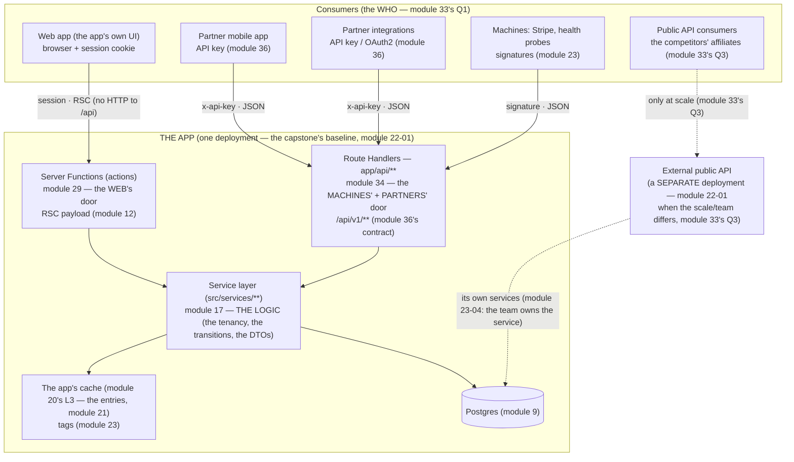
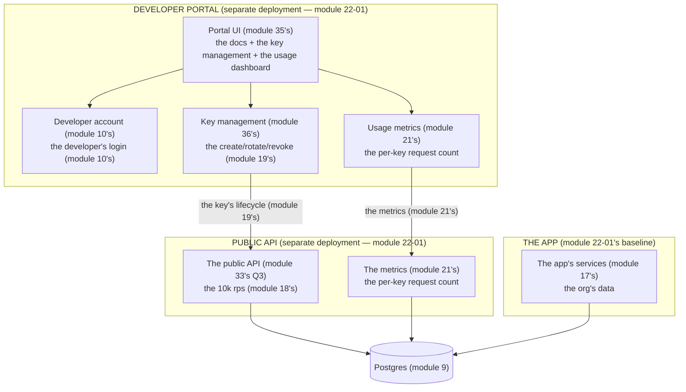

# Module 35 — BFF Architecture: The Layer You Add Only When Consumers Differ

**Phase 8: Route Handlers & BFF · Module 35 of 101**

> **Where does this run?** `[SERVER]` (the BFF is a *server* layer — the route handlers in the capstone, or a separate deployment, module 22-01). The BFF question is the course's standing anti-enterware check (module 01's philosophy, the user's "no folders to look enterprise" line): *does a layer earn its place by serving a consumer the app itself doesn't serve?* If not, it's the module-16 self-API in a trench coat.

---

## 1. Concept — What a BFF is, and the definition that kills 90% of them

**BFF (Backend for Frontend)**: *a server layer whose job is to reshape data **for a specific consumer's** needs — its data shape, its pagination, its auth, its freshness — where that consumer's needs differ from the app's own UI's needs.*

**The definition's kill-shot** (the module's first line, the course's anti-enterware check): in the **App Router world, the app's own UI already has a BFF** — *the app itself* (module 12's RSC: the server renders *exactly* what the UI needs — the DTO at the boundary, module 14; the service layer, module 17; the action's single roundtrip, module 29). The RSC payload **is** the BFF response (the module-12's wire format, the module-33's Q2: "the RSC re-render is the action's exclusive"). **A "BFF" layer *inside* the same app, serving the app's *own* UI (a `src/bff/` folder, a `/api/ui/*` the islands fetch) is the module-16 self-API with a brand** — the *third* hop (the island → the BFF → the service), the *duplicated* DTO (the BFF's + the RSC's), the *split* freshness (the BFF's cache ≠ the app's cache, module 20's layers). **The rule (module 35's thesis): the BFF layer is legitimate *only* when it serves a consumer the app's RSC path doesn't serve** — the mobile app, the partner integration, the public API, the CLI. *Serving your own UI = the action (module 29) + the RSC payload (module 12) — no layer.*

## 2. Mental Model — The topology (the capstone, drawn)



**Read the topology as the module's argument:**
1. **The WEB's arrow never touches `/api`** (the module-16 self-API *visually dead*): the web UI's mutations are *actions* (module 29) and its data is the *RSC payload* (module 12) — the "BFF for our own UI" is the *app itself* (module 1's kill-shot). The *only* web→`/api` edges in the capstone are the module-33's Q2 overrides (the *file/stream* the action can't deliver: the CSV export's download URL, the SSE stream — module 33's scenarios 6–7) — *two* edges, *documented*, not a *layer*.
2. **The MOBILE/PARTNER/MACHINE arrows share the service layer** (module 33's invariant, drawn: the door is the transport, the service is the logic): the mobile app's `GET /api/v1/orgs/:orgId/orders` and the web UI's `OrdersTable` read *the same* `listOrdersService` (module 17) — the *difference* is the *door's* reshaping (the module-36's envelope for the mobile's JSON; the RSC payload for the web) — *not* a *duplicated* path.
3. **The PUBLIC arrow is dotted to a separate deployment** (module 33's Q3, module 22-01's physics): the *in-app* `/api/v1` serves the mobile/partners *at the app's scale*; the *public* API (the competitors' affiliates, the 10k rps) is a *separate deployment* **when** the scale/team differs (module 33's scenario 4's tie-breaker) — *not* a folder, a *deployment* (module 22-01).

**The "when to add the layer" decision (module 35's gate, the 4 questions)** — a BFF layer (in-app route handlers *or* a separate deployment) is added **only if** at least one answers *yes*:

| # | Question | The capstone's answer |
|---|---|---|
| 1 | **Does a consumer exist that the RSC path can't serve?** (a native app, a partner, a CLI — no browser, no RSC) | **Yes** — the mobile app + the partners (the `/api/v1` route handlers) |
| 2 | **Does that consumer need a *different* data contract** (shape, pagination, fields) than the web UI? | **Yes** — the mobile's `orders` wants *flat* fields + cursor pagination (module 36); the web's `OrdersTable` wants the RSC DTO (module 17) — the *same service, two DTOs* (the module-17's DTO-at-boundary, *per consumer*) |
| 3 | **Does it need a *different* auth model?** (API keys/OAuth2 vs the session) | **Yes** — the module-36's keys/scopes |
| 4 | **Does it need a *different* scale/ops?** (10k rps vs 100; a different team) | **Only for the public API** (module 33's Q3 — the separate deployment, *later* — the capstone's stage 15, phase 23) |

**All four *no* → no layer** (the module-16 self-API — the deletion checklist, §5). The *in-app* `/api/v1` is *not* a "BFF" in the org-chart sense — it's the **machine's door** (module 34) *happening to* be a BFF *for* the mobile/partners (the module-35's line: **the route handlers are the BFF's implementation; the BFF is the *role* — "the layer for the consumer the app doesn't serve" — the capstone's `/api/v1` *is* that role, legitimately (Q1–Q3 yes)).

## 3. Architecture — The per-consumer DTO (the BFF's actual job, precisely)

The BFF's *only* legitimate work is the **consumer-specific reshaping** (the module-17's DTO rule, extended: the DTO is *per consumer*, not *one global*):

`FILE: src/services/orders.ts` (the *shared* logic — module 17's, unchanged by the BFF)

```ts
// THE SERVICE: one, for all consumers (module 33's invariant — the BFF adds NO logic here):
export async function listOrders(orgId: string, input: OrderListInput): Promise<OrderPage> {
  // the tenancy (module 17's rule 1), the cursor (module 40's), the DTO (module 17's rule 3):
  // → { items: OrderDto[], nextCursor: string | null }   (the CANONICAL DTO — the web's RSC + the base for the mobile's reshape)
}
```

`FILE: src/app/api/v1/orgs/[orgId]/orders/route.ts` (the **BFF's job** — module 34's handler, the *reshape* only)

```ts
// THE BFF RESHAPE (the mobile's contract, module 36's — the ONLY work this layer does):
export async function GET(request: Request, { params }: { params: Promise<{ orgId: string }> }) {
  const orgId = await requireApiKeyOrg(request, params)   // module 36's auth + tenancy (module 34's §3)
  const q = orderQuerySchema.parse(Object.fromEntries(new URL(request.url).searchParams))

  const page = await listOrders(orgId, q)                  // THE SERVICE (the logic — module 33's invariant)

  // the RESHAPE (the mobile's contract ≠ the web's RSC DTO — module 36's per-consumer):
  // the mobile wants: flat `total_cents` (integers — module 14's "ISO dates, integer money" line,
  // the mobile SDK's), `status` as a *string enum* (module 36's), NO `lineItems` (the mobile's
  // list view; the detail endpoint has them) — the web's RSC DTO keeps `total: number` (dollars,
  // server-formatted — module 14's) + the `lineItems` summary.
  const items = page.items.map((o) => ({
    id: o.id,
    number: o.number,
    status: o.status,
    total_cents: Math.round(o.total * 100),                // the mobile's integer money (module 36's)
    placed_at: o.placedAt,                                 // ISO (module 14's)
    line_item_count: o.lineItems.length,                   // the count, not the items (the mobile's list view)
  }))
  return NextResponse.json({ data: items, meta: { next_cursor: page.nextCursor } }, { headers: { 'Cache-Control': 'no-store' } })
}
```

**The two- DTO discipline** (module 35's rule, the module-14's wire protocol, per consumer):

| | The web's RSC DTO (`OrderDto`) | The mobile's BFF DTO (`/api/v1` item) |
|---|---|---|
| Money | `total: number` (dollars — module 14's server-formatted) | `total_cents: integer` (module 36's — the mobile SDK's integer money) |
| Date | `placedAt: string` (ISO) | `placed_at: string` (ISO — the *snake_case* is the *contract's* style, module 36's) |
| Line items | The `lineItems` summary (the web's row) | `line_item_count` (the count — the mobile's list) |
| Named by | The module-17's canonical DTO | The module-36's contract (the *documented* — the `docs/api-v1.md`) |
| **Source** | **The SAME service's canonical DTO, reshaped** (module 33's invariant — *one* query, *two* shapes — the *no second query* (module 18's N+1, the BFF's version: the reshape is *in-memory*, the *cheap* — the *no re-fetch*) |

**The BFF's *forbidden* work** (the 3 that turn it into a module-16 self-API): (1) *business logic* (the status transition in the handler — module 17's: the service) — (2) *a second data source* (the BFF's *own* cache/DB — module 20's: the *one* cache, the app's) — (3) *serving the web UI* (the module-1's kill-shot). **The BFF reshapes; it doesn't decide.**

## 4. Production Code — The mobile's full contract surface (the capstone's `/api/v1`)

`FILE: docs/api-v1.md` (the **contract document** — module 36's home, the BFF's *artifact*; the module-35's topology's *right side*, specified):

```md
# Partner API v1 (the mobile app + integrations)
Base: https://<origin>/api/v1 — Auth: `x-api-key` header (module 36) — the key's org = the URL's org (module 33's §4)

## GET /orgs/{orgId}/products          (module 36's public read — the capstone stage: "public API (products read)")
  query: cursor, limit (1–100, default 20), category?, q? (module 17's search — Phase 17)
  200: { data: ProductV1[], meta: { next_cursor } }        (module 36's envelope)
  401/403/422/429: the module-36's error envelope
## GET /orgs/{orgId}/products/{slug}   (the detail — the 404 = the not-in-org, module 11-03's no-leak)
## GET /orgs/{orgId}/orders            (the §3's reshape — the module-36's cursor)
## POST /orgs/{orgId}/orders/{id}/cancel    (module 33's door 2 — the 409 = the already-cancelled, module 09-04's)
## PUT /orgs/{orgId}/settings           (module 34's §2's PUT — the full replace)
## PATCH /orgs/{orgId}/products/{id}    (module 34's §2's PATCH — the delta)
## DELETE /orgs/{orgId}/products/{id}   (module 34's §2's DELETE — the SOFT delist, module 30's — the 404 on the second call)
## POST /orgs/{orgId}/products/import   (module 34's challenge — the 202 + the report)
## GET  /orgs/{orgId}/imports/{jobId}   (module 34's challenge's result)
## GET  /products                        (the PUBLIC catalog — the CDN-cacheable, module 36's s-maxage — the no orgId in the URL (the public))
## POST /webhooks/stripe                 (module 23's §3.3 — the signature, not the key)
```

**The document is the BFF's deliverable** (module 35's gate artifact): a BFF *without* a contract document is a *guessing game* for the consumer (the module-36's envelope/pagination/error format — the *documented*, the *versioned* — module 36's §4's versioning). The *web UI has no such document* (the RSC payload is *internal* — the module-12's wire format, the *module-35's line: the BFF's contract is *documented* (the consumer is *external* to the team) — the web's contract is the *code* (module 17's DTO) — the *two are different kinds of contracts* (module 35's line)).

## 5. The Deletion Checklist (module 16's, the BFF audit — the phase's *negative* gate)

Run on *any* codebase (the module-16's checklist, module 35's audit version) — a BFF layer (or a `/api/**` route) is **deleted** when:

1. **Its only caller is the web UI's islands** (grep: the `fetch('/api/…')` in `'use client'` files — the module-16's tell) → *replace with the action (module 29) + the RSC payload (module 12)*.
2. **It duplicates a service with no reshaping** (the handler calls the service and returns its DTO *unchanged*) → *the consumer gets the action/RSC; the handler is the module-33's mistake #1 (the self-API)*.
3. **It has its own cache/DB** (module 3's forbidden #2) → *the app's cache (module 20's L3) is the one cache; the BFF's tier is the module-20's *seventh* layer (the module-20's six, the *seventh* is the bug)*.
4. **It contains business logic** (the status transition, the tenancy check — module 17's) → *move to the service; the handler is the transport (module 34's 4-things-it-is-not)*.
5. **It exists "for the future mobile app"** (the *speculative* BFF — the user's "no folders to look enterprise" line, module 01's philosophy) → *delete; the module-35's 4 questions are answered *now* (Q1–Q4), not *later* — the *future consumer is the *module-23-04's architecture review's* decision (the review's row: "the BFF is added when the consumer exists")*.

**The audit's output** (the artifact): `docs/bff-audit.md` — per `/api/**` route: the *caller* (the consumer — Q1), the *reshape* (Q2 — the *documented* DTO), the *auth* (Q3), the *scale* (Q4), the *verdict* (keep/delete/convert-to-action). **Every route in the capstone survives the audit or is deleted** — the module-35's line: **the BFF audit is the *negative* phase gate (the *no* self-API) — the module-16's deletion checklist, the *BFF's* version.**

## 6. Common Mistakes (the BFF failures)

| Mistake | The tell | Fix |
|---|---|---|
| **The BFF for your own UI** (module 1's kill-shot: the `src/bff/` + the `/api/ui/*` the islands fetch) | The module-16 self-API's brand — the *third* hop (island → BFF → service) — the *duplicated* DTO — the *split* freshness (module 20's) | The *action (module 29) + the RSC payload (module 12)* — the *web UI's BFF is the app itself* (module 1) — the *deletion checklist's row 1* (§5) |
| **The forwarding BFF** (row 2: the handler returns the service's DTO *unchanged*) | The *no reshape* — the *consumer gets the canonical DTO* (the module-17's — the *mobile's contract* (module 36's) is *unmet* (the *dollars* not the *cents*) — the *BFF's job undone* | The *reshape* (§3's two-DTO discipline) — the *documented* contract (module 36's) — the *no forwarding* (module 35's line: the BFF reshapes; it doesn't forward) |
| **The BFF's own cache** (row 3: the `lru-cache` in the handler / the BFF's Redis) | The *seventh layer* (module 20's six + the *bug*) — the *split* freshness (the BFF's cache ≠ the app's L3 — the module-23's invalidation *misses* the BFF's tier — the *module-19's ticket, the BFF's version*: "the mobile sees stale, the web sees fresh") | The *app's L3* (module 20's) — the *one cache* — the *the* *the the *the BFF reads the *entries* (module 21's) — the *no BFF cache* (module 35's forbidden #2) |
| **The BFF's business logic** (row 4: the status transition in the handler) | The *module-17's rule violated* — the *tenancy* *missing* (the orgId *not derived*) — the *duplicated* logic (the action's service + the handler's inline) | The *service* (module 17's) — the *handler is the transport* (module 34's 4-things) — the *deletion checklist's row 4* (§5) |
| **The speculative BFF** (row 5: "for the future mobile app") | The *Q1–Q4 all no* (module 2's 4 questions) — the *folder to look enterprise* (the user's line, module 01's) | *Delete* — the *module-23-04's review's decision* (the *consumer exists* → the BFF) — the *no speculation* (module 35's line: the BFF is added when the consumer exists) |
| **The BFF per microservice** (the *enterprise sprawl* — a BFF *per service*) | The *N BFFs* for the *M services* — the *consumer faces the N* (the *module-33's Q1: the consumer is *one* (the mobile) — the *N BFFs is the *microservice sprawl* (module 23-04's anti-pattern) — the *module-35's line: the BFF is *per consumer*, not per service* (module 35's) | The *one BFF per consumer* (the mobile's `/api/v1` — the *module-35's topology's* *one* RH subgraph) — the *per service is the *microservice* (module 23-04's) — the *the capstone is *one app* (module 22-01's baseline) — the *one BFF* (module 35's line) |
| **The public API as a folder** (module 33's Q3 violated: the "public API" as a `src/public-api/` folder in the app) | The *scale* *wrong* (module 33's scenario 4's tie-breaker: the *public's* 10k rps *in the app's* deployment — the *module-22-01's physics* (the *app's* instances *serve* the *public's* traffic — the *module-18's* contention) — the *team* *wrong* (module 23-04's "the team owns the service" — the *public's* API is the *platform team's* (module 23-04's) — the *folder is the *deployment's* *lie*) | The *separate deployment* (module 33's Q3 — module 22-01's) — the *module-35's topology's dotted arrow* (the *PUBLIC → the EXT* — the *separate* — the *capstone's stage 15* (phase 23)) — the *no folder for a deployment* (module 35's line: the *scale/team* is a *deployment* (module 22-01's) — the *no folder*) |

## 7. Security & Performance Notes

- **The BFF's auth is the module-36's** (the key + the scope + the tenancy — module 33's §4): the *BFF is where the *partner's* trust is enforced* (the module-19's line: the *trust boundary* (module 33's door 3) — the *in-app* `/api/v1` is the *module-19's* *boundary* (the *app's* — the *key's* *scope* (module 11's RBAC) — the *module-35's line: the BFF's security is the module-36's* (the key + the scope + the tenancy) — the *module-19's threat model: the *partner's key is the *BFF's* *identity* (module 36's)*.
- **The BFF's performance is the *reshape's*** (the *in-memory* — the *cheap*): the *reshape is the *module-18's* *O(n)* (the *n* items) — the *no re-query* (module 18's N+1, the BFF's version: the *reshape is the *in-memory* (module 35's §3) — the *no second query*) — the *module-35's line: the BFF's performance is the reshape's* (the in-memory O(n)) — the *no re-query* (module 18's N+1).
- **The BFF's CDN** (module 36's `Cache-Control`): the *public* GETs are the *CDN-cacheable* (module 20's L2) — the *keyed* GETs are the *no-store* (module 36's header-vary) — the *module-35's line: the BFF's CDN is the module-36's policy* (module 36's) — the *public's CDN is the *BFF's* *performance* (module 20's L2).

## 8. Exercise

**Beginner.** *The BFF audit on the capstone* (module 5's deletion checklist): list *every* `app/api/**/route.ts` in the capstone (the *module-34's* webhook + the *module-33's* `/api/v1` + the *module-33's challenge's* SSE) — for *each*: the *caller* (Q1), the *reshape* (Q2), the *auth* (Q3), the *scale* (Q4), the *verdict* (keep/delete/convert) — *the artifact: the docs/bff-audit.md* — the *module-35's negative gate: the no self-API* (module 16's).

**Intermediate.** *The two-DTO discipline* (module 3's): the *mobile's* `GET /orgs/:orgId/orders` (module 35's §3) — the *canonical DTO* (the module-17's `OrderDto`) + the *mobile's reshape* (the `total_cents`, the `line_item_count`, the `snake_case`) — *build it* — the *test* (module 11-02's cross-tenant: the *org A's key* + the *org B's URL* → the 403) — the *the* *the the *the *reshape's* *test* (module 20's: the *`total_cents = total * 100* (module 35's §3) — the *ISO dates* (module 14's)) — the *artifact: the curl's output (the mobile's DTO) + the 403*.

**Production.** *The BFF's contract document* (module 4's `docs/api-v1.md`): the *full* `/api/v1` (module 4's table) — the *envelope* (module 36's) + the *error format* (module 36's) + the *pagination* (module 36's cursor) + the *auth* (module 36's) + the *versioning* (module 36's §4) — the *per-endpoint* spec (the *query params*, the *response shape*, the *status codes*, the *`Cache-Control`*) — the *artifact: the docs/api-v1.md* — the *module-35's gate: the BFF's contract is documented* (module 4's line) — the *module-36's home* (module 36's).

## 9. Architecture Challenge

**Prompt:** The *"the CEO wants a 'developer portal' for the public API"* (the *the public API's* *docs + the key management + the usage dashboard* — the *module-35's* *public API* (module 33's Q3 — the *separate deployment*) — the *portal is the *public API's* *UI* (module 35's line: the *public API's UI is the *portal* (module 35's) — the *the* *the the *portal is the *separate deployment's* UI* (module 22-01's) — the *module-35's line: the public API's portal is the *separate deployment's* UI* (module 22-01's) — the *no portal in the app* (module 33's Q3: the *scale/team* — the *public's* 10k rps *≠ the app's* 100) — the *module-35's line: the public API's portal is the separate deployment's UI* (module 22-01's) — the *no portal in the app* (module 33's Q3)*.

The *problems*: (1) the *portal's* *data* (the *usage dashboard* — the *per-key's* *request count* — the *module-21's analytics* — the *public API's* *metrics* (module 21's) — the *module-35's line: the portal's usage data is the *public API's* metrics* (module 21's) — the *no app's analytics* (module 21's — the *app's* usage ≠ the *public's* usage (module 33's Q3: the *scale*)) — the *module-35's line: the portal's usage is the public API's metrics* (module 21's) — the *separate*).

(2) the *key management* (the *module-36's API key* — the *create/rotate/revoke* — the *module-19's line: the key's rotation* (module 19's) — the *module-36's: the key's scopes* (module 11's RBAC) — the *portal's* *key management UI* (module 35's) — the *module-35's line: the portal's key management is the module-36's* (the key's lifecycle) — the *separate deployment's* (module 22-01's) — the *no key management in the app* (module 33's Q3: the *public's* key ≠ the *app's* session (module 10's) — the *two trust boundaries* (module 19's))*.

(3) the *portal's* *auth* (the *developer's* *login* — the *module-10's auth* — the *public API's* *developer account* (module 10's) — the *module-35's line: the portal's auth is the *developer account* (module 10's) — the *separate* (module 33's Q3: the *developer* ≠ the *org's member* (module 11's) — the *two user types* (module 10's) — the *module-35's line: the portal's auth is the developer account* (module 10's) — the *separate*).

**Design**: the *developer portal* (the *module-35's* *separate deployment* (module 22-01's) — the *module-33's Q3* — the *portal's UI* (module 35's) + the *key management* (module 36's) + the *usage dashboard* (module 21's) + the *developer account* (module 10's) — the *module-35's line: the developer portal is the separate deployment* (module 22-01's) — the *module-33's Q3: the scale/team* — the *no portal in the app* (module 33's Q3) — the *module-35's standing line: the public API's portal is the separate deployment's UI* (module 22-01's) — the *no portal in the app*).

Produce: the *portal's topology* (the *module-35's* *topology*, the *public API's* version — the *separate deployment* (module 22-01's) + the *portal's UI* (module 35's) + the *key management* (module 36's) + the *usage* (module 21's) + the *developer account* (module 10's)) — the *why* (the *scale* (module 33's Q3) + the *team* (module 23-04's) + the *trust boundary* (module 19's)) — and the *module-35's standing line: the public API's portal is the separate deployment's UI* (module 22-01's) — the *no portal in the app* (module 33's Q3).

<details>
<summary>Model answer</summary>
**The topology** (the module-35's topology, the public API's version):



**The why** (the *three* decisions, the *module's* lines):
1. **The portal is a separate deployment** (module 22-01's) — the *module-33's Q3: the scale/team* — the *public's* 10k rps ≠ the app's 100 (module 18's) — the *platform team* owns the public API (module 23-04's "the team owns the service") — the *module-35's line: the public API's portal is the separate deployment's UI* (module 22-01's) — the *no portal in the app* (module 33's Q3).
2. **The key management is the module-36's** (the key's lifecycle — the module-19's rotation) — the *portal's* UI for the key (module 35's) — the *separate deployment's* (module 22-01's) — the *no key management in the app* (module 33's Q3: the public's key ≠ the app's session (module 10's) — the two trust boundaries (module 19's)).
3. **The developer account is the module-10's** (the developer's login) — the *portal's* auth (module 35's) — the *separate* (module 33's Q3: the developer ≠ the org's member (module 11's) — the two user types (module 10's)) — the *module-35's line: the portal's auth is the developer account* (module 10's) — the *separate*.
**The generalization** (the *developer portal's* pattern, the *module's* standing rule): **a *public API's developer portal* is *a separate deployment* (module 22-01's) with *the portal UI* (module 35's) + *the key management* (module 36's) + *the usage metrics* (module 21's) + *the developer account* (module 10's) — the *module-33's Q3: the scale/team* — the *module-35's standing line: the public API's portal is the separate deployment's UI* (module 22-01's) — the *no portal in the app* (module 33's Q3) — the *module-23-04's architecture review's decision* (the *consumer exists* → the deployment) — the *no speculation* (module 35's line: the BFF/deployment is added when the consumer exists).
</details>

## 10. Official Documentation

- Route Handlers (the BFF's implementation — module 34's): https://nextjs.org/docs/app/building-your-application/routing/route-handlers
- Caching (the one cache — module 20's L3): https://nextjs.org/docs/app/getting-started/caching
- Server Functions (the web UI's door — module 29's): https://nextjs.org/docs/app/getting-started/mutating-data
- Deployment (the separate deployment — module 22-01's): https://nextjs.org/docs/app/building-your-application/deploying
- The BFF pattern (the architectural pattern — the course's definition, module 1's): *the layer for the consumer the app doesn't serve* (module 35's thesis)

## 11. What You Should Know Before Continuing

- [ ] I can state the *BFF's definition that kills 90% of them* (module 1's: *the layer for the consumer the app doesn't serve*) — the *the web UI's BFF is the app itself* (module 12's RSC)
- [ ] I can *draw the topology* (module 2's: the WEB → the action (no /api), the MOBILE/PARTNER/MACHINE → the RH → the service, the PUBLIC → the separate deployment) — the *module-16 self-API visually dead*
- [ ] I know the *4 questions* (module 2's: Q1 the consumer, Q2 the contract, Q3 the auth, Q4 the scale) — the *all no = no layer* (module 16's self-API)
- [ ] I know the *two-DTO discipline* (module 3's: the canonical DTO + the per-consumer reshape — the in-memory O(n) — the no re-query)
- [ ] I know the *3 forbidden works* (module 3's: the business logic, the second data source, the serving the web UI) — the *BFF reshapes; it doesn't decide*
- [ ] I know the *deletion checklist* (module 5's: the 5 rows — the caller, the reshape, the cache, the logic, the speculation) — the *negative phase gate* (module 16's)
- [ ] I've done the *BFF audit* (module 8's beginner: the docs/bff-audit.md) + the *two-DTO* (module 8's intermediate) + the *contract document* (module 8's production: the docs/api-v1.md)
- [ ] I know the *BFF's contract is documented* (module 4's line) — the *web's contract is the code* (module 17's DTO) — the *two are different kinds of contracts* (module 35's line)

**Next:** Module 36 — API Design & Response Contracts (the *module-36's envelope* — the *error format* — the *pagination* — the *auth for the public API* — the *versioning* — the *capstone stage: the public API (products read) + the webhook receiver + the CSV export stream*).
