# Module 38 — Schema Design & Migrations: The Capstone Data Model, as Constraints

**Phase 9: Database & ORM · Module 38 of 101**

> **Where does this run?** The schema is **`[SERVER]`** (the DB is server-only, module 37's guard). The schema's *role* is the module-2's 4-hop path's **last line**: the service checks tenancy *first* (module 17), the DB constraint enforces it *last* (module 19's defense in depth). A schema is **the data model as an enforceable promise** — and migrations are *that promise's history*.

---

## 1. Concept — Schema as the last line, migrations as the history

**The schema's job** (module 37's 4-hop path, hop 4): the service's checks (module 17's tenancy, module 11's RBAC) are the *first* line — fast, user-facing errors (module 17's `AppError`). The DB's **constraints** are the *last* line — they make the *violation impossible* (a cross-org write, a duplicate SKU, a negative price) even if a service bug slips through (module 19's line: **defense in depth — the service check is the *first*; the constraint is the *last*; the constraint is what makes the *first* check's bug a *500* instead of a *data breach***).

**The multi-tenancy schema pattern** (the capstone's *shared-schema, shared-rows* tenancy — module 11's decision, module 02's architecture): every tenant-owned row carries `org_id` (the FK → `organizations`) and the **tenancy composite unique** (the `(org_id, slug)`, the `(org_id, sku)` — module 11's "the SKU is unique *per org*" (module 31's 2b's `assertSkuUnique(orgId, sku)`, the schema version)). The *row-level* tenancy: every query *scopes* on `org_id` (module 17's rule 1: the `orgId`-first) — the *constraint* version: the *composite unique* + the *FK* (module 38's §3) make the *unscoped* write a *violation* (the *module-11-02's cross-tenant test*, the schema's version: the *org A's* `INSERT … org_id = B` for a *slug* that's *A's* → the *unique violation* (the *constraint* is the *last line*) — the *module-38's line: the tenancy is the *schema* (the `org_id` + the composite unique) — the *query's scoping is the first line* (module 17's) — the *constraint is the last* (module 19's)*.

**The migration's job** (module 38's §4): the schema's *history* (the *versioned* — the module-36's §4.3's *versioning*, the DB's version): the `drizzle-kit generate` (the schema → the *SQL diff*) + the `drizzle-kit migrate` (the *apply* + the *record* in the `__drizzle_migrations` table) — the *module-38's line: the migration is the *history* (module 38's §4) — the *push is the *no history* (module 38's §4) — the *prod is the *migrate* (module 38's §4) — the *dev is the *push* (module 38's §4)*.

## 2. Mental Model — The ER diagram (the capstone, drawn)

```mermaid
erDiagram
    organizations ||--o{ memberships : "has"
    users ||--o{ memberships : "holds"
    organizations ||--o{ products : "owns"
    organizations ||--o{ orders : "owns"
    orders ||--|{ order_items : "contains"
    products ||--o{ order_items : "snapshot-in"
    organizations ||--o{ api_keys : "issues"
    organizations ||--o{ idempotency_keys : "stores"
    organizations ||--o{ audit_events : "records"
    organizations ||--o{ analytics_daily : "measures"

    organizations {
        uuid id PK
        varchar name
        varchar slug UK
        varchar plan
        timestamptz created_at
    }
    users {
        uuid id PK
        varchar email UK
        varchar name
        timestamptz suspended_at
        timestamptz created_at
    }
    memberships {
        uuid user_id PK,FK
        uuid org_id PK,FK
        varchar role "owner|admin|member"
        timestamptz created_at
    }
    products {
        uuid id PK
        uuid org_id FK
        varchar slug "UK (org_id, slug)"
        varchar name
        text description
        int price_cents
        varchar sku "UK (org_id, sku) partial"
        varchar status "draft|active|delisted"
        uuid created_by FK
        timestamptz created_at
        timestamptz updated_at
    }
    orders {
        uuid id PK
        uuid org_id FK
        int number "UK (org_id, number)"
        varchar status "pending|paid|shipped|cancelled|refunded"
        varchar currency "USD"
        int total_cents
        timestamptz created_at
        timestamptz updated_at
    }
    order_items {
        uuid id PK
        uuid order_id FK
        uuid product_id FK
        varchar product_name "the snapshot (module 14's DTO rule, the DB version)"
        int quantity
        int unit_price_cents "the snapshot (the price at the order's time)"
    }
    api_keys {
        uuid id PK
        uuid org_id FK
        varchar label
        varchar key_hash "SHA-256 (module 36's §4.1) — the plain key NEVER stored"
        text scopes "text[]"
        timestamptz expires_at
        timestamptz last_used_at
        timestamptz created_at
    }
    idempotency_keys {
        uuid org_id PK,FK
        varchar key "UK (org_id, key) — module 36's §5.1"
        varchar response_hash
        uuid resource_id
        timestamptz created_at "the 24h window (module 36's §5.1)"
    }
    audit_events {
        uuid id PK
        uuid org_id FK
        uuid actor_user_id FK
        varchar action
        varchar entity_type
        uuid entity_id
        jsonb metadata
        timestamptz at
    }
    analytics_daily {
        uuid org_id PK,FK
        date day "UK (org_id, day) — module 25's write-time rollup (module 28's challenge, Fix 2)"
        int revenue_cents
        int orders_count
        int visitors
    }
```



**The diagram's 5 read-throughs** (the module-38's mental model):
1. **`org_id` on every tenant-owned table** (the `products`, `orders`, `api_keys`, `idempotency_keys`, `audit_events`, `analytics_daily`) — the *module-11's tenancy* (module 38's §1) — the *the `memberships` is the *user↔org* bridge (the *role* (module 11's RBAC) — the *the `orders`' `org_id` is the *org's* (the *order belongs to the org* (the *module-11's line: the *order is the org's* (module 11's) — the *the user's* *order is the *membership's* (module 11's) — the *the `orders.org_id` is the *org's* (the *module-17's rule 1: the `orgId`-first*)*.
2. **The composite unique is the tenancy's *constraint*** (the `(org_id, slug)`, the `(org_id, sku)`, the `(org_id, number)`, the `(org_id, day)`) — the *module-38's §1's line: the tenancy is the schema* (module 38's §1) — the *the composite unique is the *last line* (module 19's)*.
3. **The `order_items`' snapshots** (the `product_name`, the `unit_price_cents`) — the *module-14's DTO rule, the DB version* (module 38's §3.2: the *the order's* *truth is the *order's* (the *module-14's line: the *DTO is the wire protocol* (module 14's) — the *the order's* *snapshot is the *order's* (module 14's) — the *no order's* *reference to the product's* *current* (module 14's) — the *module-38's line: the order's snapshot is the order's* (module 14's) — the *no live reference* (module 14's)*.
4. **The `api_keys.key_hash`** (the *SHA-256* — the *module-36's §4.1: the plain key NEVER stored* (module 19's) — the *module-38's line: the key is the hash* (module 36's §4.1) — the *no plain* (module 19's)*.
5. **The `analytics_daily`' `(org_id, day)` unique** (the *module-28's challenge's Fix 2: the write-time rollup* (module 28's) — the *the `(org_id, day)` unique is the *rollup's* *constraint* (module 28's) — the *module-38's line: the analytics is the write-time rollup* (module 28's) — the *the `(org_id, day)` unique is the constraint* (module 28's)*.

## 3. Architecture — The Drizzle schema (the single source of truth)

`FILE: src/db/schema.ts` (production pattern — [SERVER] — the module-38's core artifact; the *complete* capstone schema)

```ts
// THE DRIZZLE SCHEMA (module 38's core — the single source of truth — the module-04's: the type flows to the query):
import {
  pgTable, pgEnum, uuid, varchar, text, integer, timestamp, date, jsonb, uniqueIndex, index, primaryKey, check,
} from 'drizzle-orm/pg-core'
import { relations } from 'drizzle-orm'

// — ENUMS (module 38's §3.1: the pgEnum is the TYPE + the DB's CHECK (module 38's §3.1's line: the enum is the type and the constraint (module 38's §3.1)) —):
export const productStatusEnum = pgEnum('product_status', ['draft', 'active', 'delisted'])
export const orderStatusEnum = pgEnum('order_status', ['pending', 'paid', 'shipped', 'cancelled', 'refunded'])
export const membershipRoleEnum = pgEnum('membership_role', ['owner', 'admin', 'member'])

// — ORGANIZATIONS (the tenant — module 11's):
export const organizations = pgTable('organizations', {
  id: uuid('id').primaryKey().defaultRandom(),          // the module-38's §3.1's line: the uuid is the defaultRandom() (PG's gen_random_uuid())
  name: varchar('name', { length: 120 }).notNull(),
  slug: varchar('slug', { length: 60 }).notNull(),      // the module-24's slug schema (the /^[a-z0-9-]+$/)
  plan: varchar('plan', { length: 20 }).notNull().default('free'),   // the module-11's plan (the 'limit-reached' (module 31's 2c) — the enum? the string (module 38's §3.1's line: the plan is the string (the plan's set is the product's, not the schema's) — the module-11's: the plan's constraint is the service's (module 17's) — the no pgEnum for the plan (module 38's §3.1's line))
  createdAt: timestamp('created_at', { withTimezone: true }).notNull().defaultNow(),   // the module-38's §3.1's line: the timestamptz (the always UTC)
})

// — USERS (the module-10's: the Better Auth's users table — the Phase 10's adapter maps to THIS (module 10's) — the column names match the Better Auth's expectations (module 10's)):
export const users = pgTable('users', {
  id: uuid('id').primaryKey().defaultRandom(),
  email: varchar('email', { length: 255 }).notNull(),
  name: varchar('name', { length: 120 }),
  image: varchar('image', { length: 500 }),
  suspendedAt: timestamp('suspended_at', { withTimezone: true }),     // the module-23's suspend challenge (the nullable = the active (module 23's))
  createdAt: timestamp('created_at', { withTimezone: true }).notNull().defaultNow(),
}).returning((t) => ({
  email: t.email,   // the module-38's §3.3's line: the unique is the .unique() (module 38's §3.3) — the RETURNING's type (module 04's)
}))

// the module-38's §3.3's line: the UNIQUE is the .unique() (module 38's §3.3) — the users.email:
// (the drizzle's .unique() — the module-38's §3.3: the uniqueIndex is the named, the .unique() is the inline (module 38's §3.3))
// → the users table's email: the .notNull().unique() (module 38's §3.3's line: the inline .unique() (module 38's §3.3))

// — MEMBERSHIPS (the user↔org bridge — module 11's RBAC — the composite PK (user_id, org_id)):
export const memberships = pgTable('memberships', {
  userId: uuid('user_id').notNull().references(() => users.id, { onDelete: 'cascade' }),   // the module-38's §3.1's line: the FK's onDelete (module 38's §3.1) — the cascade (the user's delete → the memberships' delete (module 38's §3.1))
  orgId: uuid('org_id').notNull().references(() => organizations.id, { onDelete: 'cascade' }),
  role: membershipRoleEnum('role').notNull().default('member'),
  createdAt: timestamp('created_at', { withTimezone: true }).notNull().defaultNow(),
}, (t) => [primaryKey({ columns: [t.userId, t.orgId] })])   // the module-38's §3.1's line: the composite PK (module 38's §3.1) — the no (user, org) duplicate (module 11's)

// — PRODUCTS (the tenant-owned — module 11's tenancy — the composite unique (org_id, slug) + (org_id, sku)):
export const products = pgTable('products', {
  id: uuid('id').primaryKey().defaultRandom(),
  orgId: uuid('org_id').notNull().references(() => organizations.id, { onDelete: 'cascade' }),   // the module-38's §3.1's line: the FK's cascade (the org's delete → the products' delete (module 38's §3.1) — the module-11's: the org's delete is the owner's (module 11's) — the cascade is the org's truth (module 11's))
  slug: varchar('slug', { length: 60 }).notNull(),          // the module-24's slug (the service's generation (module 17's) — the schema's constraint (module 38's §3.1))
  name: varchar('name', { length: 120 }).notNull(),
  description: text('description'),
  priceCents: integer('price_cents').notNull(),             // the module-38's §3.1's line: the integer cents (module 14's money rule) — the no float (module 14's)
  sku: varchar('sku', { length: 40 }),                       // the nullable (the module-31's 2a's .optional())
  status: productStatusEnum('status').notNull().default('draft'),
  createdBy: uuid('created_by').references(() => users.id, { onDelete: 'set null' }),   // the module-38's §3.1's line: the FK's set null (the creator's delete → the createdBy's null (module 38's §3.1) — the no cascade (the product's truth is the org's (module 11's))
  createdAt: timestamp('created_at', { withTimezone: true }).notNull().defaultNow(),
  updatedAt: timestamp('updated_at', { withTimezone: true }).notNull().defaultNow(),
}, (t) => [
  uniqueIndex('products_org_slug_uq').on(t.orgId, t.slug),   // the module-38's §1's line: the tenancy's constraint (module 38's §1) — the (org, slug) unique
  uniqueIndex('products_org_sku_uq').on(t.orgId, t.sku),     // the module-38's §1's line: the (org, sku) unique — the PARTIAL (the module-38's §3.1's line: the .where(sql`sku IS NOT NULL`) (module 38's §3.1) — the nullable sku's unique is the partial (module 38's §3.1))
  index('products_org_status_idx').on(t.orgId, t.status),    // the module-38's §3.1's line: the tenancy's index (module 38's §3.1) — the (org, status) is the list's query (module 17's)
])

// the module-38's §3.1's line: the partial unique (the nullable sku) — the drizzle's .where (module 38's §3.1):
// uniqueIndex('products_org_sku_uq').on(t.orgId, t.sku).where(sql`sku IS NOT NULL`)   (the module-38's §3.1's partial — the module-38's §3's code's note)

// — ORDERS (the tenant-owned — the composite unique (org_id, number)):
export const orders = pgTable('orders', {
  id: uuid('id').primaryKey().defaultRandom(),
  orgId: uuid('org_id').notNull().references(() => organizations.id, { onDelete: 'cascade' }),
  number: integer('number').notNull(),                       // the org-scoped sequence (the module-38's §3.2's line: the number is the org's (module 38's §3.2) — the service's generation (module 17's) — the schema's unique (module 38's §3.2))
  status: orderStatusEnum('status').notNull().default('pending'),
  currency: varchar('currency', { length: 3 }).notNull().default('USD'),   // the module-38's §3.1's line: the ISO-4217 (module 14's) — the 3-char (module 14's)
  totalCents: integer('total_cents').notNull(),              // the module-14's money (the integer cents)
  createdAt: timestamp('created_at', { withTimezone: true }).notNull().defaultNow(),
  updatedAt: timestamp('updated_at', { withTimezone: true }).notNull().defaultNow(),
}, (t) => [
  uniqueIndex('orders_org_number_uq').on(t.orgId, t.number),  // the module-38's §3.2's line: the (org, number) unique (module 38's §3.2)
  index('orders_org_created_idx').on(t.orgId, t.createdAt),   // the module-38's §3.2's line: the (org, created_at) is the list's query (module 17's) — the cursor's sort (module 36's §3)
])

// — ORDER_ITEMS (the snapshot — module 14's DTO rule, the DB version — module 38's §3.2):
export const orderItems = pgTable('order_items', {
  id: uuid('id').primaryKey().defaultRandom(),
  orderId: uuid('order_id').notNull().references(() => orders.id, { onDelete: 'cascade' }),
  productId: uuid('product_id').references(() => products.id, { onDelete: 'set null' }),   // the module-38's §3.2's line: the product's delete → the productId's null (the snapshot's name/price remain (module 38's §3.2) — the no cascade (the order's truth is the order's (module 14's)))
  productName: varchar('product_name', { length: 120 }).notNull(),   // the module-38's §3.2's snapshot (module 14's) — the product's name at the order's time
  quantity: integer('quantity').notNull(),
  unitPriceCents: integer('unit_price_cents').notNull(),   // the module-38's §3.2's snapshot (module 14's) — the price at the order's time (the module-12's "the price is recomputed at submit" (module 12's) — the DB's snapshot (module 38's §3.2))
}, (t) => [
  index('order_items_order_idx').on(t.orderId),   // the module-38's §3.2's line: the (order_id) is the order's items' query (module 17's)
])

// — API_KEYS (module 36's §4.1: the hash, the scopes, the rotation):
export const apiKeys = pgTable('api_keys', {
  id: uuid('id').primaryKey().defaultRandom(),
  orgId: uuid('org_id').notNull().references(() => organizations.id, { onDelete: 'cascade' }),
  label: varchar('label', { length: 60 }).notNull(),
  keyHash: varchar('key_hash', { length: 64 }).notNull(),   // the module-36's §4.1's SHA-256 (module 19's) — the 64 hex chars (module 36's §4.1)
  scopes: text('scopes').array().notNull().default([]),     // the module-36's §4.1's scopes (the text[] — module 36's §4.1)
  expiresAt: timestamp('expires_at', { withTimezone: true }),
  lastUsedAt: timestamp('last_used_at', { withTimezone: true }),
  createdAt: timestamp('created_at', { withTimezone: true }).notNull().defaultNow(),
}, (t) => [
  uniqueIndex('api_keys_org_hash_uq').on(t.orgId, t.keyHash),   // the module-36's §4.1's line: the (org, hash) unique (module 36's §4.1)
  index('api_keys_hash_idx').on(t.keyHash),                     // the module-36's §4.1's line: the (hash) is the lookup's index (module 36's §4.1) — the key's auth (module 34's §3.1)
])

// — IDEMPOTENCY_KEYS (module 36's §5.1: the (org, key) unique, the 24h window):
export const idempotencyKeys = pgTable('idempotency_keys', {
  orgId: uuid('org_id').notNull().references(() => organizations.id, { onDelete: 'cascade' }),
  key: varchar('key', { length: 120 }).notNull(),
  responseHash: varchar('response_hash', { length: 64 }).notNull(),
  resourceId: uuid('resource_id'),
  createdAt: timestamp('created_at', { withTimezone: true }).notNull().defaultNow(),   // the module-36's §5.1's 24h window (the service's prune (module 17's) — the module-23-04's job (Phase 23))
}, (t) => [
  primaryKey({ columns: [t.orgId, t.key] }),   // the module-36's §5.1's line: the (org, key) is the PK (module 36's §5.1)
])

// — AUDIT_EVENTS (module 17's audit row — the append-only):
export const auditEvents = pgTable('audit_events', {
  id: uuid('id').primaryKey().defaultRandom(),
  orgId: uuid('org_id').notNull().references(() => organizations.id, { onDelete: 'cascade' }),
  actorUserId: uuid('actor_user_id').references(() => users.id, { onDelete: 'set null' }),
  action: varchar('action', { length: 60 }).notNull(),     // the 'order.cancelled', the 'product.created' (module 17's)
  entityType: varchar('entity_type', { length: 40 }).notNull(),
  entityId: uuid('entity_id'),
  metadata: jsonb('metadata'),                               // the module-14's DTO (the jsonb — the module-38's §3.1's line: the jsonb is the flexible (module 38's §3.1) — the no table-per-metadata (module 38's §3.1))
  at: timestamp('at', { withTimezone: true }).notNull().defaultNow(),
}, (t) => [
  index('audit_events_org_at_idx').on(t.orgId, t.at),   // the module-17's audit's query (module 17's)
])

// — ANALYTICS_DAILY (module 28's challenge's Fix 2: the write-time rollup — the (org, day) unique):
export const analyticsDaily = pgTable('analytics_daily', {
  orgId: uuid('org_id').notNull().references(() => organizations.id, { onDelete: 'cascade' }),
  day: date('day').notNull(),
  revenueCents: integer('revenue_cents').notNull().default(0),
  ordersCount: integer('orders_count').notNull().default(0),
  visitors: integer('visitors').notNull().default(0),
}, (t) => [
  primaryKey({ columns: [t.orgId, t.day] }),   // the module-28's challenge's Fix 2's line: the (org, day) PK (module 28's)
])

// — RELATIONS (the module-39's: the typed relations — the preview):
export const productsRelations = relations(products, ({ many, one }) => ({
  organization: one(organizations, { fields: [products.orgId], references: [organizations.id] }),
  orderItems: many(orderItems),
}))
export const ordersRelations = relations(orders, ({ many, one }) => ({
  organization: one(organizations, { fields: [orders.orgId], references: [organizations.id] }),
  items: many(orderItems),
}))
export const orderItemsRelations = relations(orderItems, ({ one }) => ({
  order: one(orders, { fields: [orderItems.orderId], references: [orders.id] }),
  product: one(products, { fields: [orderItems.productId], references: [products.id] }),
}))
```

### 3.1 The column rules (module 38's §3's line, the table)

| Rule | The module-38's line | The example |
|---|---|---|
| **The ID is the `uuid().defaultRandom()`** | the *no serial* (module 38's §3.1) — the *the uuid is the stable* (module 36's §2.1: the "IDs = stable UUIDs" (module 36's)) — the *no DB serial in the wire* (module 19-03's: the serial leaks the row count (module 19-03's)) | the `uuid('id').primaryKey().defaultRandom()` |
| **The timestamp is the `timestamptz`** | the *always UTC* (module 38's §3.1) — the *the `timestamp` (no tz) is the *module-38's mistake* (module 38's §5) — the *module-14's date rule: the ISO-8601 UTC* (module 14's) | the `timestamp('created_at', { withTimezone: true })` |
| **The money is the `integer` (cents)** | the *no float* (module 14's) — the *no `numeric`* (module 38's §3.1's line: the `numeric(12,2)` is the *dollars* (module 14's) — the *the wire is the cents* (module 36's §2.1) — the *the DB is the cents* (module 38's §3.1) — the *module-14's line: the money is the integer cents* (module 14's)) | the `integer('price_cents')` |
| **The enum is the `pgEnum`** | the *the type + the constraint* (module 38's §3.1) — the *the `varchar` + the `CHECK` is the *module-38's alternative* (module 38's §3.1: the `pgEnum` is the *typed* (module 04's) — the `CHECK` is the *no type* (module 04's) — the *module-38's line: the enum is the `pgEnum`* (module 38's §3.1) — the *the `CHECK` is the *string* (module 04's))* | the `productStatusEnum('status')` |
| **The `varchar` has a length** | the *the no unbounded* (module 38's §3.1) — the *the `text` is the *unbounded* (module 38's §3.1: the `text` is the *description* (module 38's §3) — the *the `varchar` is the *bounded* (module 38's §3.1)) — the *module-38's line: the `varchar` is the bounded* (module 38's §3.1) — the *the `text` is the unbounded* (module 38's §3.1)* | the `varchar('name', { length: 120 })` + the `text('description')` |
| **The FK's `onDelete` is explicit** | the *the no implicit* (module 38's §3.1) — the *the `cascade` is the *org's* (the org's delete → the products' delete (module 38's §3.1)) — the *the `set null` is the *reference's* (the creator's delete → the `createdBy`'s null (module 38's §3.1)) — the *module-38's line: the FK's `onDelete` is explicit* (module 38's §3.1) — the *no implicit* (module 38's §3.1)* | the `references(() => organizations.id, { onDelete: 'cascade' })` |
| **The `jsonb` is the flexible** | the *the no table-per-metadata* (module 38's §3.1) — the *the `jsonb` is the *audit's* *metadata* (module 38's §3) — the *module-38's line: the `jsonb` is the flexible* (module 38's §3.1) — the *no table-per* (module 38's §3.1)* | the `jsonb('metadata')` |

### 3.2 The money + the number (module 38's §3.2's line, the detail)

- **The money is the `integer` cents** (module 38's §3.1): the *the wire is the cents* (module 36's §2.1) — the *the DB is the cents* (module 38's §3.1) — the *module-14's line: the money is the integer cents* (module 14's) — the *no `numeric`* (module 38's §3.1) — the *the `numeric(12,2)` is the *dollars* (module 14's) — the *the wire's contract is the *cents* (module 36's §2.1) — the *the DB's contract is the *cents* (module 38's §3.1) — the *module-38's line: the money is the integer cents* (module 38's §3.1) — the *no `numeric`* (module 38's §3.1)*.
- **The order's `number` is the org-scoped** (module 38's §3.2): the *the service's generation* (module 17's: the `SELECT COALESCE(MAX(number), 0) + 1 FROM orders WHERE org_id = $1 FOR UPDATE` (module 40's transaction (module 40's) — the *the `FOR UPDATE` is the *race* (module 40's) — the *module-38's line: the number is the service's (module 17's) — the schema's unique is the *last line* (module 19's) — the *the `(org_id, number)` unique is the constraint* (module 38's §3.2)) — the *module-40's* *deep-dive* (module 40's).

### 3.3 The unique (module 38's §3.3's line, the two forms)

- **The inline `.unique()`** (module 38's §3.3): the *the single column* (the `users.email`) — the *the drizzle's `.notNull().unique()`* (module 38's §3.3) — the *module-38's line: the inline `.unique()` is the single column* (module 38's §3.3).
- **The named `uniqueIndex`** (module 38's §3.3): the *the composite* (the `(org_id, slug)`) — the *the drizzle's `uniqueIndex('name').on(col1, col2)`* (module 38's §3.3) — the *module-38's line: the `uniqueIndex` is the composite* (module 38's §3.3) — the *the partial is the `.where`* (module 38's §3.1: the `uniqueIndex(…).on(t.orgId, t.sku).where(sql\`sku IS NOT NULL\`)` (module 38's §3.1)).

## 4. Production Code — The migration workflow (the `generate`/`migrate`/`push`)

### 4.1 The workflow (module 38's §4's line, the 3 commands)

| Command | The job | The env | The module-38's line |
|---|---|---|---|
| `drizzle-kit generate` | the schema → the *SQL diff* (the `./drizzle/0001_….sql`) | dev + CI | the *the generate is the *diff* (module 38's §4) — the *the SQL is the *auditable* (module 38's §4) — the *module-38's line: the generate is the diff* (module 38's §4)* |
| `drizzle-kit migrate` | the *apply* the migration + the *record* (the `__drizzle_migrations`) | dev + prod | the *the migrate is the *apply + record* (module 38's §4) — the *the prod is the migrate* (module 38's §4) — the *module-38's line: the migrate is the history* (module 38's §4)* |
| `drizzle-kit push` | the schema → the *DB directly* (the *no SQL*, the *no record*) | **dev ONLY** | the *the push is the *no history* (module 38's §4) — the *the dev is the push* (module 38's §4) — the *module-38's line: the push is the dev's truth* (module 38's §4) — the *no push in prod* (module 38's §4)* |

**The module-38's standing line:** the *generate is the diff* (module 38's §4) — the *migrate is the history* (module 38's §4) — the *push is the dev's truth* (module 38's §4) — the *no push in prod* (module 38's §4) — the *the prod is the migrate* (module 38's §4).

### 4.2 The migration's safety rules (module 38's §4.2's line, the module-23-04's review's row)

1. **The no destructive without the review** (module 23-04's line: the `DROP COLUMN`, the `DROP TABLE` — the *the module-23-04's architecture review's row* (module 23-04's) — the *module-38's line: the destructive is the review* (module 23-04's) — the *no destructive without the review* (module 23-04's)).
2. **The no `push` in prod** (module 38's §4's line) — the *the CI's check* (module 02's CI: the `drizzle-kit generate --strict` (module 38's §4.2's line: the `--strict` fails on the uncommitted migration (module 38's §4.2) — the *module-38's line: the CI's `--strict` is the guard* (module 38's §4.2) — the *no uncommitted migration* (module 38's §4.2)).
3. **The migration's SQL is the committed** (module 38's §4's line: the `./drizzle/0001_….sql` is the git-tracked (module 38's §4) — the *the module-38's line: the migration is the committed* (module 38's §4) — the *no generated-on-the-fly migration* (module 38's §4)).
4. **The backfill is the migration's** (module 38's §4.2's line: the `UPDATE` in the migration (module 38's §4.2) — the *the module-38's line: the backfill is the migration's* (module 38's §4.2) — the *the backfill is the service's* (module 17's) — the *no backfill in the service* (module 38's §4.2)) — the *the module-23-04's* *job* (Phase 23) is the *large* backfill (module 23-04's) — the *the migration's backfill is the *small* (module 38's §4.2)*.

### 4.3 The seed (module 38's §4.3's line, the dev's data)

`FILE: src/db/seed.ts` (simplified example — [SERVER] — the module-38's §4.3: the seed is the dev's truth)

```ts
// THE SEED (module 38's §4.3 — the dev's truth — the module-17's line: the seed is a SERVICE (module 17's rule 1) — the no seed in the db's index):
import 'server-only'   // the module-37's §1's guard (the no client import)
import { db } from './index'
import { organizations, users, memberships, products } from './schema'
import { randomUUID } from 'node:crypto'

export async function seed() {
  // the module-17's line: the seed is idempotent (the module-09-04's idempotency — the seed's re-run is the no-op (module 38's §4.3))
  const existing = await db.query.organizations.findFirst()   // the module-39's: the relation query (module 39's preview)
  if (existing) return console.log('seeded already')
  const orgId = randomUUID(), userId = randomUUID(), productId = randomUUID()
  await db.insert(organizations).values({ id: orgId, name: 'Acme', slug: 'acme' })
  await db.insert(users).values({ id: userId, email: 'dana@acme.test', name: 'Dana' })
  await db.insert(memberships).values({ userId, orgId, role: 'owner' })
  await db.insert(products).values({ id: productId, orgId, slug: 'aurora-stand', name: 'Aurora Stand', priceCents: 12900, status: 'active' })
  console.log('seeded', { orgId, userId, productId })
}
seed()
```

## 5. Common Mistakes (the schema failures)

| Mistake | The symptom | Fix |
|---|---|---|
| **The no `org_id`** (module 38's §1's line violated: the tenant-owned table without the `org_id`) | the *module-11-02's cross-tenant* (module 11-02's) — the *the tenancy is the *schema* (module 38's §1) — the *the `org_id` is the *tenancy* (module 38's §1) — the *module-38's line: the `org_id` is the tenancy* (module 38's §1) — the *no `org_id` is the cross-tenant* (module 11-02's)* | the *`org_id` on every tenant-owned table* (module 38's §1) + the *composite unique* (module 38's §1) — the *module-11-02's cross-tenant test* (module 11-02's) |
| **The float money** (module 38's §3.1's line violated: the `float`/`double precision`) | the *module-14's rounding bug* (module 14's) — the *the `0.1 + 0.2 ≠ 0.3` (module 14's) — the *module-38's line: the money is the integer cents* (module 38's §3.1) — the *no float* (module 14's)* | the *`integer('price_cents')`* (module 38's §3.1) — the *module-14's money rule* (module 14's) |
| **The `timestamp` (no tz)** (module 38's §3.1's line violated) | the *module-14's date bug* (module 14's) — the *the `timestamp` is the *local* (module 38's §3.1) — the *the `timestamptz` is the *UTC* (module 38's §3.1) — the *module-38's line: the timestamp is the `timestamptz`* (module 38's §3.1) — the *no `timestamp`* (module 38's §3.1)* | the *`timestamp(…, { withTimezone: true })`* (module 38's §3.1) — the *module-14's date rule* (module 14's) |
| **The `varchar` without length** (module 38's §3.1's line violated) | the *module-38's §3.1's line: the `varchar` is the bounded* (module 38's §3.1) — the *the no length is the *unbounded* (module 38's §3.1) — the *module-38's line: the `varchar` is the bounded* (module 38's §3.1) — the *the `text` is the unbounded* (module 38's §3.1)* | the *`varchar(…, { length: N })`* (module 38's §3.1) + the *`text` for the unbounded* (module 38's §3.1) |
| **The implicit `onDelete`** (module 38's §3.1's line violated: the FK without the `onDelete`) | the *module-38's §3.1's line: the FK's `onDelete` is explicit* (module 38's §3.1) — the *the implicit is the *restrict* (module 38's §3.1) — the *the org's delete is the *blocked* (module 38's §3.1) — the *module-38's line: the FK's `onDelete` is explicit* (module 38's §3.1) — the *no implicit* (module 38's §3.1)* | the *`references(…, { onDelete: 'cascade' })`* (module 38's §3.1) / the *`'set null'`* (module 38's §3.1) |
| **The `push` in prod** (module 38's §4's line violated) | the *module-38's line: the push is the dev's truth* (module 38's §4) — the *the prod is the migrate* (module 38's §4) — the *no push in prod* (module 38's §4)* | the *`drizzle-kit migrate`* (module 38's §4) — the *module-38's line: the prod is the migrate* (module 38's §4) |
| **The no composite unique** (module 38's §1's line violated: the `(org_id, slug)` without the unique) | the *module-11-02's cross-tenant* (module 11-02's) — the *the tenancy's constraint is the *composite unique* (module 38's §1) — the *module-38's line: the composite unique is the tenancy's constraint* (module 38's §1) — the *no composite unique is the cross-tenant* (module 11-02's)* | the *`uniqueIndex('products_org_slug_uq').on(t.orgId, t.slug)`* (module 38's §1) — the *module-11-02's cross-tenant test* (module 11-02's) |
| **The order's live reference to the product** (module 38's §3.2's snapshot violated: the `order_items` without the `product_name`/`unit_price_cents` snapshot) | the *module-14's DTO bug* (module 14's) — the *the product's price change is the *order's* *change* (module 14's) — the *module-38's line: the order's snapshot is the order's* (module 14's) — the *no live reference* (module 14's)* | the *`product_name` + the `unit_price_cents` snapshot* (module 38's §3.2) — the *module-14's DTO rule* (module 14's) |

## 6. Security Notes

- **The `org_id` is the tenancy** (module 38's §1): the *the no `org_id` is the cross-tenant* (module 11-02's) — the *module-38's line: the `org_id` is the tenancy* (module 38's §1) — the *module-11-02's cross-tenant test* (module 11-02's).
- **The `key_hash` is the hash** (module 36's §4.1): the *the no plain key* (module 19's) — the *module-38's line: the key is the hash* (module 36's §4.1) — the *the SHA-256* (module 19's).
- **The least-privilege** (module 37's §6): the *the app's user is the least* (module 19's) — the *the migration's user is the separate* (module 19's) — the *module-38's line: the app's user is the least* (module 37's §6) — the *the migration's user is the separate* (module 37's §6).
- **The `suspended_at` is the nullable** (module 23's suspend challenge): the *the `NULL` is the active* (module 23's) — the *the `SET` is the suspended* (module 23's) — the *module-38's line: the `suspended_at` is the nullable* (module 23's) — the *the `NULL` is the active* (module 23's).

## 7. Performance Notes

- **The index is the module-40's** (module 38's §3.1: the `index(…)` — the module-40's deep-dive): the *the `(org_id, created_at)` is the list's query* (module 17's) — the *the module-40's* *line: the index is the query's* (module 40's) — the *module-38's line: the index is the module-40's* (module 40's) — the *module-40's* *deep-dive* (module 40's).
- **The composite unique is the index** (module 38's §1): the *the `uniqueIndex` is the *index* (module 38's §1) — the *the tenancy's query is the *composite* (module 17's) — the *module-38's line: the composite unique is the index* (module 38's §1) — the *the tenancy's query is the composite* (module 17's).
- **The `EXPLAIN` is the module-18's** (module 39's): the *the module-39's* *line: the `EXPLAIN` is the module-18's* (module 18's) — the *module-38's line: the `EXPLAIN` is the module-18's* (module 18's) — the *module-39's* *deep-dive* (module 39's).

## 8. Exercise

**Beginner.** *The schema + the migration* (module 38's §3–4): the *`src/db/schema.ts`* (module 38's §3) + the *`drizzle-kit generate`* (module 38's §4) + the *`drizzle-kit migrate`* (module 38's §4) + the *seed* (module 38's §4.3) — *build it* — the *`drizzle-kit studio`* (module 38's §4) — the *the ER diagram* (module 38's §2) — the *artifact: the `./drizzle/0001_….sql`* (module 38's §4) + the *studio's screenshot* (module 20's).

**Intermediate.** *The tenancy's constraint* (module 38's §1): the *the composite unique* (the `(org_id, slug)`) — the *the module-11-02's cross-tenant test* (module 11-02's): the *org A's* `INSERT … org_id = B, slug = A's slug` → the *unique violation* (module 38's §1) — the *the org A's* `INSERT … org_id = A, slug = A's slug` → the *success* (module 38's §1) — the *artifact: the two `INSERT`'s outputs (the violation + the success)* (module 20's).

**Production.** *The migration's safety* (module 38's §4.2): the *the `drizzle-kit generate --strict`* (module 38's §4.2) — the *the CI's guard* (module 02's CI) — the *the destructive's review* (module 23-04's) — the *the backfill's migration* (module 38's §4.2) — the *artifact: the CI's log + the migration's SQL* (module 20's).

## 9. Architecture Challenge

**Prompt:** The *"the team wants to add a 'soft delete' to the products"* (the *the module-30's delist* (module 30's) — the *the `status = 'delisted'`* (module 38's §3's `productStatusEnum`) — the *module-38's line: the soft delete is the *status* (module 30's) — the *no `deleted_at`* (module 38's §9) — the *the module-30's* *line: the delist is the status* (module 30's) — the *module-38's line: the soft delete is the status* (module 30's) — the *no `deleted_at`* (module 38's §9)*.

The *problems*: (1) the *the soft delete is the *status* (module 30's) — the *the `deleted_at` is the *module-38's mistake* (module 38's §9) — the *module-38's line: the soft delete is the status* (module 30's) — the *no `deleted_at`* (module 38's §9)*.

(2) the *the `delisted` is the *module-36's §2.3's 404* (module 36's §2.3) — the *the public API's delist is the 404* (module 36's §2.3) — the *the org API's delist is the 200-with-status* (module 36's §2.3) — the *module-38's line: the delisted is the status* (module 36's §2.3) — the *the public's 404 is the status's filter* (module 36's §2.3)*.

(3) the *the `delisted` is the *module-38's §3.1's `pgEnum`* (module 38's §3.1) — the *the `productStatusEnum` is the `draft|active|delisted`* (module 38's §3) — the *module-38's line: the delisted is the enum* (module 38's §3.1) — the *no `deleted_at`* (module 38's §9)*.

**Design**: the *the soft delete* (the *module-38's line: the soft delete is the status* (module 30's) — the *the `delisted` is the enum* (module 38's §3.1) — the *the public's 404 is the status's filter* (module 36's §2.3) — the *the org's 200-with-status is the status's read* (module 36's §2.3) — the *module-38's standing line: the soft delete is the status* (module 30's) — the *no `deleted_at`* (module 38's §9)).

Produce: the *the soft delete* (the *module-38's §3.1's `pgEnum`* (module 38's §3.1) + the *module-36's §2.3's 404* (module 36's §2.3) + the *module-30's delist* (module 30's) — the *module-38's line: the soft delete is the status* (module 30's) — the *the `delisted` is the enum* (module 38's §3.1) — the *the public's 404 is the status's filter* (module 36's §2.3)) — and the *module-38's standing line: the soft delete is the status* (module 30's) — the *no `deleted_at`* (module 38's §9).

<details>
<summary>Model answer</summary>
**The soft delete** (the *module-38's §3.1's `pgEnum`* + the *module-36's §2.3's 404* + the *module-30's delist*):
1. **The soft delete is the status** (module 30's): the *the `productStatusEnum` is the `draft|active|delisted`* (module 38's §3) — the *module-38's line: the soft delete is the status* (module 30's) — the *no `deleted_at`* (module 38's §9).
2. **The public's 404 is the status's filter** (module 36's §2.3): the *the public API's `GET /products` filters on `status='active'`* (module 36's §2.3) — the *the `delisted` is the 404* (module 36's §2.3) — the *module-36's line: the public's 404 is the status's filter* (module 36's §2.3).
3. **The org's 200-with-status is the status's read** (module 36's §2.3): the *the org API's `GET /orgs/:orgId/products` returns the `status`* (module 36's §2.3) — the *module-36's line: the org's 200-with-status is the status's read* (module 36's §2.3).
**The generalization** (the *soft delete's* pattern, the *module's* standing rule): **the *soft delete is the status* (module 30's) — the *the `delisted` is the enum* (module 38's §3.1) — the *the public's 404 is the status's filter* (module 36's §2.3) — the *the org's 200-with-status is the status's read* (module 36's §2.3) — the *no `deleted_at`* (module 38's §9) — the *module-38's standing line: the soft delete is the status* (module 30's)*.
</details>

## 10. Official Documentation

- Drizzle: Schema (Postgres): https://orm.drizzle.team/docs/schema
- Drizzle: Migrations: https://orm.drizzle.team/docs/migrations/overview
- Drizzle: Relations: https://orm.drizzle.team/docs/relationships
- PostgreSQL 18: Data Types: https://www.postgresql.org/docs/18/datatype.html
- PostgreSQL 18: Indexing: https://www.postgresql.org/docs/18/indexes.html
- The `pgEnum` (the module-38's §3.1): https://orm.drizzle.team/docs/schema/pg-enum

## 11. What You Should Know Before Continuing

- [ ] I can state the *schema's job* (module 1's: the last line — the module-19's defense in depth) — the *the service's check is the first; the constraint is the last* (module 1's line)
- [ ] I know the *multi-tenancy schema pattern* (module 1's: the `org_id` + the composite unique) — the *the tenancy is the schema* (module 1's line)
- [ ] I can draw the *ER diagram* (module 2's) — the *5 read-throughs* (module 2's)
- [ ] I know the *column rules* (module 3.1's table: the uuid, the timestamptz, the integer cents, the pgEnum, the varchar's length, the FK's onDelete, the jsonb)
- [ ] I know the *migration workflow* (module 4.1's table: the generate/migrate/push) — the *the prod is the migrate* (module 4's line) — the *the push is the dev's truth* (module 4's line)
- [ ] I know the *migration's safety rules* (module 4.2's: the no destructive without the review, the CI's `--strict`, the committed SQL, the backfill's migration)
- [ ] I've done the *schema + the migration* (module 8's beginner) + the *tenancy's constraint* (module 8's intermediate) + the *migration's safety* (module 8's production) — the *artifacts* (module 20's)
- [ ] I know the *module-40's index* is the *next module* (module 7's line: the index is the module-40's) — the *module-40's deep-dive* (module 40's)

**Next:** Module 39 — Queries & Relations (the *Drizzle's queries* (the `select`/`where`/`eq`) — the *joins* — the *typed relations* (the module-38's §3's relations) — the *N+1* (module 18's) — the *the service's query patterns* (module 17's)).
