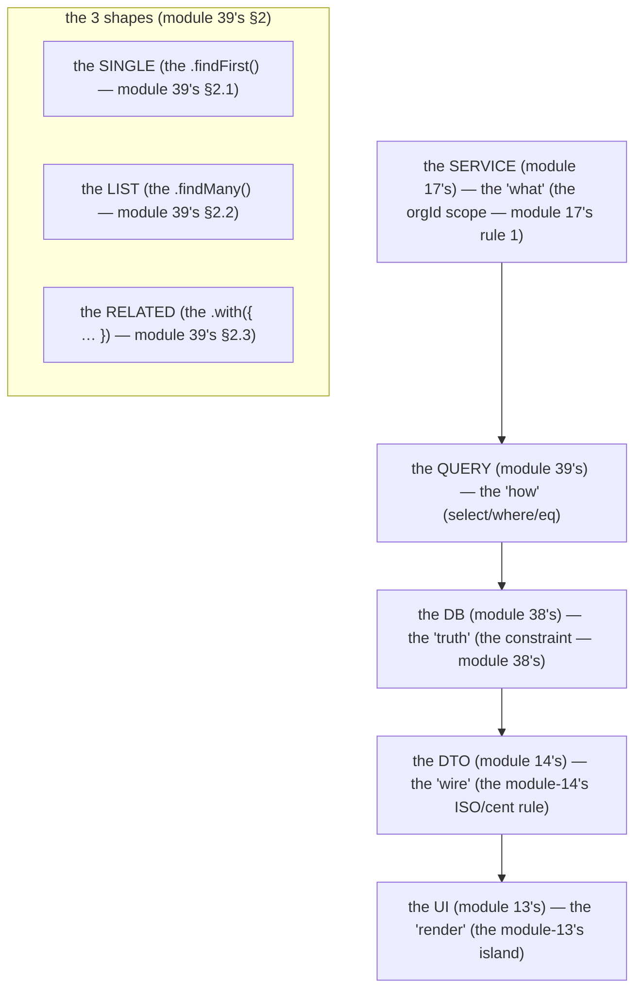

# Module 39 — Queries & Relations: Where the Data Comes Back (and the N+1 Trap)

**Phase 9: Database & ORM · Module 39 of 101**

> **Where does this run?** The query is **`[SERVER]`** (the DB is server-only, module 37's guard). The *result* is a **`[BOTH / BOUNDARY]`** DTO (module 14's wire protocol). The query is **the 4-hop path's middle** (module 37's §1): the *service* decides *what* (module 17), the *query* asks *how* (module 39), the *DB* answers *what's true* (module 38's constraint). A query is **a question, not a dump** — and the N+1 trap is **a topology bug wearing a query's face** (module 18's line, module 39's §4).

---

## 1. Concept — The query is a question (the 4-hop path's middle)

**The query's job** (module 37's 4-hop path, hop 2): the *service* (module 17) decides *what* to ask (the *tenancy scope* — the `orgId`, module 17's rule 1) — the *query* (module 39) asks *how* (the `select`/`where`/`eq`) — the *DB* (module 38) answers *what's true* (the *constraint* (module 38's) — the *module-39's line: the query is the *question* (module 39's §1) — the *the service is the *what* (module 17's) — the *the DB is the *truth* (module 38's)*.

**The tenancy scope is the query's *first* clause** (module 17's rule 1, module 38's §1): the *`eq(products.orgId, orgId)`* (module 17's) — the *module-39's line: the tenancy scope is the query's *first* clause* (module 17's rule 1) — the *no unscoped query* (module 17's rule 1) — the *the service's check is the first line (module 17's) — the query's scope is the second line (module 39's) — the constraint is the last line (module 38's)*.

**The relation is the typed join** (module 39's §2): the *the `db.query.products.findMany({ with: { orderItems: true } })`* (module 39's §2) — the *module-39's line: the relation is the typed join* (module 39's §2) — the *no raw SQL join* (module 39's §2) — the *the `with` is the N+1's guard* (module 39's §4).

**The N+1 is the topology bug** (module 18's line, module 39's §4): the *the `N+1` is the *N* reads where the *1* read suffices* (module 18's) — the *module-39's line: the N+1 is the topology bug* (module 18's) — the *the `with` is the fix* (module 39's §4) — the *the `inArray` is the batch* (module 39's §4).

## 2. Mental Model — The query's 3 shapes



**The 3 shapes** (the module-39's mental model):
1. **The single** (module 39's §2.1): the *`.findFirst()`* (module 39's §2.1) — the *the `WHERE org_id = $1 AND id = $2`* (module 17's rule 1) — the *module-39's line: the single is the `.findFirst()`* (module 39's §2.1).
2. **The list** (module 39's §2.2): the *`.findMany()`* (module 39's §2.2) — the *the `WHERE org_id = $1`* (module 17's rule 1) + the *the `LIMIT`/`OFFSET`* (module 40's) — the *module-39's line: the list is the `.findMany()`* (module 39's §2.2).
3. **The related** (module 39's §2.3): the *`.with({ … })`* (module 39's §2.3) — the *the typed join* (module 39's §2.3) — the *module-39's line: the related is the `.with()`* (module 39's §2.3) — the *the N+1's guard* (module 39's §4).

## 3. Architecture — The query (the 3 shapes, the code)

### 3.1 The single (module 39's §2.1 — the `findFirst`)

`FILE: src/services/products.ts` (production pattern — [SERVER] — the module-39's §3.1: the single, the tenancy scope first)

```ts
// THE SINGLE (module 39's §2.1 — the .findFirst() — the tenancy scope is the FIRST clause (module 17's rule 1)):
import 'server-only'
import { db } from '@/db'
import { products } from '@/db/schema'
import { and, eq } from 'drizzle-orm'
import { AppError } from '@/lib/errors'

export async function getProduct(orgId: string, id: string) {
  // THE TENANCY SCOPE IS THE FIRST CLAUSE (module 17's rule 1 — the module-39's line: the orgId is the first, the id is the second):
  const row = await db.query.products.findFirst({
    where: and(eq(products.orgId, orgId), eq(products.id, id)),   // the and() (module 39's §3.1) — the eq() (module 39's §3.1)
  })
  if (!row) throw new AppError({ status: 404, code: 'product.not_found', message: 'Not found' })   // the module-17's AppError (module 17's)
  return toProductDto(row)   // the module-14's DTO (module 14's) — the module-39's line: the row is the service's, the DTO is the wire (module 14's)
}
```

**The module-39's line:** the *tenancy scope is the first clause* (module 17's rule 1) — the *no unscoped query* (module 17's rule 1) — the *the `and()` is the clause's* (module 39's §3.1).

### 3.2 The list (module 39's §2.2 — the `findMany`)

`FILE: src/services/products.ts` (production pattern — [SERVER] — the module-39's §3.2: the list, the tenancy scope + the filter)

```ts
// THE LIST (module 39's §2.2 — the .findMany() — the tenancy scope + the status filter (module 30's delist)):
export async function listProducts(orgId: string, opts: { status?: string }) {
  // THE TENANCY SCOPE IS THE FIRST CLAUSE (module 17's rule 1) + the status filter (module 30's):
  return db.query.products.findMany({
    where: and(eq(products.orgId, orgId), opts.status ? eq(products.status, opts.status) : undefined),
    orderBy: [products.createdAt.desc(), products.id.desc()],   // the module-36's §3's cursor sort (module 36's) — the (created_at DESC, id DESC) (module 36's §3)
  })
}
```

**The module-39's line:** the *tenancy scope is the first clause* (module 17's rule 1) + the *filter is the second* (module 30's) — the *the `orderBy` is the cursor's* (module 36's §3).

### 3.3 The related (module 39's §2.3 — the `with`)

`FILE: src/services/orders.ts` (production pattern — [SERVER] — the module-39's §3.3: the related, the typed join)

```ts
// THE RELATED (module 39's §2.3 — the .with({ … }) — the typed join (module 39's §2.3)):
import { orders, orderItems, products } from '@/db/schema'
import { and, eq } from 'drizzle-orm'

export async function getOrderWithItems(orgId: string, id: string) {
  // THE TYPED JOIN (module 39's §2.3) — the .with({ items: { with: { product: true } } }) (module 39's §3.3):
  const row = await db.query.orders.findFirst({
    where: and(eq(orders.orgId, orgId), eq(orders.id, id)),   // the module-17's rule 1 (module 17's)
    with: {
      items: {
        with: { product: true },   // the module-39's §3.3's line: the nested with (module 39's §3.3) — the typed (module 04's)
      },
    },
  })
  if (!row) throw new AppError({ status: 404, code: 'order.not_found', message: 'Not found' })
  return toOrderDto(row)   // the module-14's DTO (module 14's)
}
```

**The module-39's line:** the *`.with()` is the typed join* (module 39's §2.3) — the *the nested `with` is the deep* (module 39's §3.3) — the *no raw SQL join* (module 39's §2.3).

### 3.4 The operators (module 39's §3.4's line, the table)

| Operator | The job | The module-39's line |
|---|---|---|
| **`eq(a, b)`** | the `=` (module 39's §3.4) | the *the `eq` is the `=`* (module 39's §3.4) — the *the tenancy scope is the `eq`* (module 17's rule 1) |
| **`and(…)`** | the `AND` (module 39's §3.4) | the *the `and` is the clause's* (module 39's §3.1) |
| **`or(…)`** | the `OR` (module 39's §3.4) | the *the `or` is the *rare* (module 39's §3.4) — the *the tenancy scope is never in an `or`* (module 17's rule 1) — the *module-39's line: the tenancy scope is never in an `or`* (module 17's rule 1)* |
| **`inArray(col, […])`** | the `IN (…)` (module 39's §3.4) | the *the `inArray` is the batch* (module 39's §4) — the *the N+1's fix* (module 39's §4) |
| **`notInArray(…)`** | the `NOT IN (…)` (module 39's §3.4) | the *the `notInArray` is the *exclude* (module 39's §3.4) — the *the module-30's delist's filter* (module 30's)* |
| **`gte`/`lte`** | the `>=`/`<=` (module 39's §3.4) | the *the `gte`/`lte` is the range* (module 39's §3.4) — the *the module-25's analytics's range* (module 25's)* |
| **`isNotNull`/`isNull`** | the `IS NOT NULL` (module 39's §3.4) | the *the `isNotNull` is the *partial* (module 38's §3.1's partial unique) — the *the module-38's §3.1's line: the partial is the `where`* (module 38's §3.1)* |
| **`like`** | the `LIKE` (module 39's §3.4) | the *the `like` is the *search* (module 16's) — the *the module-16's* *line: the search is the module-16's* (module 16's) — the *module-39's line: the `like` is the module-16's* (module 16's) — the *module-16's* *deep-dive* (module 16's)* |
| **`desc()`/`asc()`** | the `ORDER BY` (module 39's §3.4) | the *the `desc()`/`asc()` is the sort* (module 39's §3.4) — the *the module-36's §3's cursor sort* (module 36's §3)* |

**The module-39's line:** the *`eq` is the `=`* (module 39's §3.4) — the *the tenancy scope is the `eq`* (module 17's rule 1) — the *the tenancy scope is never in an `or`* (module 17's rule 1) — the *the `inArray` is the batch* (module 39's §4).

## 4. Production Code — The N+1 (the trap + the fix)

### 4.1 The trap (module 39's §4.1 — the N+1, the code)

`FILE: src/services/orders.ts` (the *mistake* — the N+1, the module-39's §4.1)

```ts
// THE N+1 (module 39's §4.1 — the TRAP — the module-18's topology bug (module 18's)):
export async function listOrderItemsNplus1(orgId: string) {
  const orderIds = (await db.query.orders.findMany({ where: eq(orders.orgId, orgId) })).map(o => o.id)
  // THE N+1 (module 39's §4.1): the LOOP is the N (module 18's) — the .findMany() inside the loop is the +1 per N (module 39's §4.1):
  const allItems = []
  for (const oid of orderIds) {                       // THE N (module 18's)
    allItems.push(...(await db.query.orderItems.findMany({ where: eq(orderItems.orderId, oid) })))   // THE +1 (module 39's §4.1)
  }
  return allItems
}
```

**The N+1** (module 39's §4.1): the *the `1`* (the `findMany` for the `orderIds`) + the *the `N`* (the `findMany` inside the `for`) — the *module-18's line: the N+1 is the N reads where the 1 read suffices* (module 18's) — the *module-39's line: the N+1 is the topology bug* (module 18's) — the *the loop is the N* (module 39's §4.1).

### 4.2 The fix (module 39's §4.2 — the batch, the `inArray`)

`FILE: src/services/orders.ts` (the *fix* — the batch, the module-39's §4.2)

```ts
// THE FIX (module 39's §4.2 — the BATCH — the inArray() is the 1 read (module 39's §4.2)):
export async function listOrderItemsBatched(orgId: string) {
  const orderIds = (await db.query.orders.findMany({ where: eq(orders.orgId, orgId) })).map(o => o.id)
  if (orderIds.length === 0) return []
  // THE 1 READ (module 39's §4.2): the inArray() is the batch (module 39's §3.4) — the N+1's fix (module 39's §4.2):
  return db.query.orderItems.findMany({ where: inArray(orderItems.orderId, orderIds) })   // THE 1 (module 39's §4.2)
}
```

**The fix** (module 39's §4.2): the *the `inArray(orderItems.orderId, orderIds)`* (module 39's §3.4) — the *the `1` read* (module 39's §4.2) — the *module-18's line: the N+1 is the N reads where the 1 read suffices* (module 18's) — the *module-39's line: the `inArray` is the batch* (module 39's §4) — the *the N+1's fix is the batch* (module 39's §4.2).

### 4.3 The `with` as the N+1's guard (module 39's §4.3)

`FILE: src/services/orders.ts` (the *best fix* — the `with`, the module-39's §4.3)

```ts
// THE BEST FIX (module 39's §4.3 — the .with({ items: true }) is the typed batch (module 39's §2.3)):
export async function listOrdersWithItems(orgId: string) {
  // THE TYPED BATCH (module 39's §4.3): the .with({ items: true }) is the 1 read (module 39's §4.3) — the typed (module 04's):
  return db.query.orders.findMany({
    where: eq(orders.orgId, orgId),
    with: { items: true },   // THE TYPED BATCH (module 39's §4.3) — the N+1's guard (module 39's §4)
  })
}
```

**The module-39's line:** the *`.with()` is the N+1's guard* (module 39's §4) — the *the typed batch is the best fix* (module 39's §4.3) — the *the `inArray` is the batch* (module 39's §4.2) — the *the loop is the N+1's trap* (module 39's §4.1).

### 4.4 The detection (module 39's §4.4 — the operation)

- **The dev server's log** (module 18's): the *the `Render`'s timing* (module 18's) + the *the query's count* (module 39's §4.4) — the *the module-39's line: the query's count is the N+1's* (module 39's §4.4) — the *the `N+1` is the `N` queries where the `1` suffices* (module 18's).
- **The `EXPLAIN` is the module-72's** (module 18's file 04, the deep-dive): the *the `EXPLAIN ANALYZE`* (module 72's) — the *module-39's line: the `EXPLAIN` is the module-72's* (module 72's) — the *module-72's* *deep-dive* (module 72's) — the *module-39's* *line: the N+1 is the topology* (module 18's) — the *module-72's* *line: the `EXPLAIN` is the *plan* (module 72's)*.

## 5. Common Mistakes (the query failures)

| Mistake | The symptom | Fix |
|---|---|---|
| **The no `orgId` scope** (module 17's rule 1 violated) | the *module-11-02's cross-tenant* (module 11-02's) — the *module-39's line: the tenancy scope is the first clause* (module 17's rule 1) — the *no unscoped query* (module 17's rule 1)* | the *`eq(products.orgId, orgId)`* (module 17's rule 1) — the *module-11-02's cross-tenant test* (module 11-02's) |
| **The tenancy scope in an `or`** (module 17's rule 1 violated) | the *module-39's line: the tenancy scope is never in an `or`* (module 17's rule 1) — the *the `or(eq(orgId, A), eq(status, 'active'))` is the cross-tenant* (module 11-02's) — the *module-39's line: the tenancy scope is never in an `or`* (module 17's rule 1)* | the *`and(eq(orgId, A), or(…))`* (module 17's rule 1) — the *module-39's line: the tenancy scope is the `and`'s first* (module 17's rule 1)* |
| **The N+1 loop** (module 39's §4.1) | the *module-18's topology bug* (module 18's) — the *module-39's line: the N+1 is the topology bug* (module 18's) — the *the loop is the N* (module 39's §4.1)* | the *the `inArray`* (module 39's §4.2) / the *the `.with()`* (module 39's §4.3) — the *module-18's line: the N+1 is the N reads where the 1 read suffices* (module 18's)* |
| **The raw SQL join** (module 39's §2.3 violated) | the *module-39's line: the relation is the typed join* (module 39's §2.3) — the *the raw SQL join is the *untyped* (module 04's) — the *module-39's line: the `.with()` is the typed join* (module 39's §2.3) — the *no raw SQL join* (module 39's §2.3)* | the *the `.with({ … })`* (module 39's §2.3) — the *module-04's typed* (module 04's) |
| **The no `orderBy` on the list** (module 36's §3's cursor violated) | the *module-36's §3's cursor bug* (module 36's §3) — the *the no `orderBy` is the *unstable* (module 36's §3) — the *module-36's line: the cursor is the stable sort* (module 36's §3) — the *module-39's line: the `orderBy` is the cursor's* (module 36's §3)* | the *`orderBy: [createdAt.desc(), id.desc()]`* (module 36's §3) — the *module-36's §3's cursor* (module 36's §3) |
| **The `SELECT *`** (module 39's §5's line: the no column selection) | the *module-39's line: the query is the question, not the dump* (module 39's §1) — the *the `SELECT *` is the *dump* (module 39's §1) — the *module-39's line: the query is the question* (module 39's §1) — the *no `SELECT *`* (module 39's §1)* | the *the `.select({ … })`* (module 39's §5) — the *module-39's line: the query is the question* (module 39's §1) |
| **The no `.limit` on the list** (module 40's) | the *module-40's pagination* (module 40's) — the *the no `.limit` is the *unbounded* (module 40's) — the *module-40's line: the list is the bounded* (module 40's) — the *module-39's line: the `.limit` is the module-40's* (module 40's)* | the *the `.limit(N)`* (module 40's) — the *module-40's pagination* (module 40's) |
| **The row to the UI** (module 14's DTO violated) | the *module-14's DTO bug* (module 14's) — the *module-14's line: the DTO is the wire* (module 14's) — the *module-39's line: the row is the service's, the DTO is the wire* (module 14's) — the *no row to the UI* (module 14's)* | the *the `toProductDto(row)`* (module 14's) — the *module-14's DTO* (module 14's) |

## 6. Security Notes

- **The tenancy scope is the first clause** (module 17's rule 1): the *the no `orgId` is the cross-tenant* (module 11-02's) — the *module-39's line: the tenancy scope is the first clause* (module 17's rule 1) — the *module-11-02's cross-tenant test* (module 11-02's).
- **The tenancy scope is never in an `or`** (module 17's rule 1): the *the `or` is the cross-tenant* (module 11-02's) — the *module-39's line: the tenancy scope is never in an `or`* (module 17's rule 1).
- **The row is not the wire** (module 14's): the *the row's `key_hash` is the *secret* (module 36's §4.1) — the *module-14's line: the DTO is the wire* (module 14's) — the *module-39's line: the row is the service's, the DTO is the wire* (module 14's) — the *no row to the UI* (module 14's)).
- **The `like` is the module-16's** (module 16's): the *the `like`'s injection is the *module-16's* (module 16's) — the *module-39's line: the `like` is the module-16's* (module 16's) — the *module-16's* *deep-dive* (module 16's)).

## 7. Performance Notes

- **The N+1 is the topology bug** (module 18's): the *module-18's line: the N+1 is the N reads where the 1 read suffices* (module 18's) — the *module-39's line: the N+1 is the topology bug* (module 18's) — the *the `inArray`/the `.with()` is the fix* (module 39's §4).
- **The `SELECT *` is the dump** (module 39's §1): the *module-39's line: the query is the question* (module 39's §1) — the *the `.select({ … })` is the question* (module 39's §5) — the *no `SELECT *`* (module 39's §1).
- **The index is the module-40's** (module 40's): the *module-40's line: the index is the query's* (module 40's) — the *module-39's line: the index is the module-40's* (module 40's) — the *module-40's* *deep-dive* (module 40's).
- **The `EXPLAIN` is the module-72's** (module 72's): the *module-72's line: the `EXPLAIN` is the plan* (module 72's) — the *module-39's line: the `EXPLAIN` is the module-72's* (module 72's) — the *module-72's* *deep-dive* (module 72's).

## 8. Exercise

**Beginner.** *The 3 shapes* (module 39's §2–3): the *the single* (module 39's §3.1) + the *the list* (module 39's §3.2) + the *the related* (module 39's §3.3) — *build it* — the *`drizzle-kit studio`* (module 38's §4) — the *the query's log* (module 18's) — the *artifact: the 3 queries' outputs* (module 20's).

**Intermediate.** *The N+1* (module 39's §4): the *the N+1's trap* (module 39's §4.1) + the *the `inArray`'s fix* (module 39's §4.2) + the *the `.with()`'s fix* (module 39's §4.3) — the *the query's count* (module 39's §4.4) — the *artifact: the `N` queries vs the `1` query's log* (module 20's).

**Production.** *The tenancy scope* (module 17's rule 1): the *the no `orgId`* (module 11-02's) + the *the `or`'s scope* (module 11-02's) + the *the `.select({ … })`* (module 39's §5) — the *module-11-02's cross-tenant test* (module 11-02's) — the *artifact: the cross-tenant's output + the `select`'s query* (module 20's).

## 9. Architecture Challenge

**Prompt:** The *"the partner's mobile app needs the order's items, but the org's orders list is 500 orders"* (the *module-36's* *public API* — the *module-39's* *related* — the *module-18's* *N+1* (module 18's) — the *module-39's line: the related is the typed join* (module 39's §2.3) — the *module-18's line: the N+1 is the topology bug* (module 18's) — the *module-39's standing line: the related is the typed join* (module 39's §2.3) — the *the N+1 is the topology bug* (module 18's)).

The *problems*: (1) the *the related* (the *`.with({ items: true })`* (module 39's §4.3) — the *module-39's line: the related is the typed join* (module 39's §2.3) — the *the N+1's guard* (module 39's §4) — the *module-39's standing line: the related is the typed join* (module 39's §2.3)*.

(2) the *the 500 orders* (the *the module-40's pagination* (module 40's) — the *the module-36's §3's cursor* (module 36's §3) — the *module-40's line: the list is the bounded* (module 40's) — the *module-36's line: the cursor is the stable sort* (module 36's §3) — the *module-39's line: the 500 is the pagination's* (module 40's) — the *the `.limit` is the module-40's* (module 40's)).

**Design**: the *the related* (the *`.with({ items: true })`* (module 39's §4.3) + the *the module-40's pagination* (module 40's) + the *the module-36's §3's cursor* (module 36's §3) — the *module-39's line: the related is the typed join* (module 39's §2.3) — the *the N+1's guard* (module 39's §4) — the *the pagination is the bounded* (module 40's)).

Produce: the *the related* (the *`.with({ items: true })`* (module 39's §4.3) + the *the module-40's pagination* (module 40's) + the *the module-36's §3's cursor* (module 36's §3) — the *module-39's line: the related is the typed join* (module 39's §2.3) — the *the N+1's guard* (module 39's §4) — the *the pagination is the bounded* (module 40's)).

<details>
<summary>Model answer</summary>
**The related + the pagination** (module 39's §4.3 + module 40's):
1. **The related is the typed join** (module 39's §2.3): the *`.with({ items: true })`* (module 39's §4.3) — the *module-39's line: the related is the typed join* (module 39's §2.3) — the *the N+1's guard* (module 39's §4).
2. **The pagination is the bounded** (module 40's): the *the `.limit(50)`* (module 40's) + the *the module-36's §3's cursor* (module 36's §3) — the *module-40's line: the list is the bounded* (module 40's) — the *module-36's line: the cursor is the stable sort* (module 36's §3).
**The generalization** (the *related + pagination's* pattern, the *module's* standing rule): **the *related is the typed join* (module 39's §2.3) — the *the N+1's guard is the `.with()`* (module 39's §4) — the *the pagination is the bounded* (module 40's) — the *module-39's standing line: the related is the typed join + the pagination is the bounded* (module 39's §2.3 + module 40's)*.
</details>

## 10. Official Documentation

- Drizzle: Queries: https://orm.drizzle.team/docs/queries
- Drizzle: Select: https://orm.drizzle.team/docs/select
- Drizzle: Operators: https://orm.drizzle.team/docs/operators
- Drizzle: Relations: https://orm.drizzle.team/docs/relations
- PostgreSQL 18: WHERE: https://www.postgresql.org/docs/18/sql-where.html
- The N+1 (the module-72's deep-dive): the module-18-04 (the phase-18's file-04, the `EXPLAIN`'s deep-dive)

## 11. What You Should Know Before Continuing

- [ ] I can state the *query's job* (module 1's: the question — the 4-hop path's middle) — the *the service is the what; the query is the how; the DB is the truth* (module 1's line)
- [ ] I know the *3 shapes* (module 2's: the single/list/related) — the *`.findFirst()`/`.findMany()`/`.with()`* (module 2's)
- [ ] I know the *tenancy scope is the first clause* (module 17's rule 1) — the *no unscoped query* (module 17's rule 1) — the *the tenancy scope is never in an `or`* (module 17's rule 1)
- [ ] I know the *operators* (module 3.4's table: the `eq`/`and`/`or`/`inArray`/`notInArray`/`gte`/`lte`/`like`/`desc`)
- [ ] I can *find the N+1* (module 4.4's: the query's count) — the *the loop is the N* (module 4.1) — the *the `inArray`/the `.with()` is the fix* (module 4.2–4.3)
- [ ] I know the *row is not the wire* (module 14's) — the *the DTO is the wire* (module 14's)
- [ ] I know the *index is the module-40's* + the *`EXPLAIN` is the module-72's* (module 7's line) — the *module-40's/72's deep-dive* (module 40's/72's)
- [ ] I've done the *3 shapes* (module 8's beginner) + the *N+1* (module 8's intermediate) + the *tenancy scope* (module 8's production) — the *artifacts* (module 20's)

**Next:** Module 40 — Transactions, Pagination & Indexes (the *`db.transaction`* — the *the atomic write* — the *module-12's checkout* — the *pagination's `LIMIT`/`OFFSET` + the cursor* — the *index's `CREATE INDEX`* — the *the module-40's line: the atomic is the transaction* (module 40's)).
