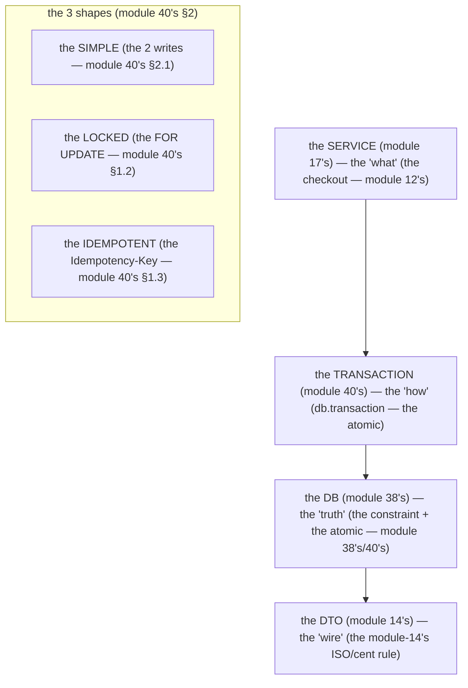

# Module 40 — Transactions, Pagination & Indexes: The Atomic Write, the Page, the Index

**Phase 9: Database & ORM · Module 40 of 101**

> **Where does this run?** The transaction is **`[SERVER]`** (the DB is server-only, module 37's guard). The *pagination cursor* is a **`[BOTH / BOUNDARY]`** (the opaque base64, module 36's §3 — the *server* encodes, the *client* carries). The index is **`[SERVER]`** (the DB's, module 38's §3.1). A transaction is **the atomic write** (module 40's §1) — the *multiple* statements that must be **one** (module 12's checkout, module 40's §1); pagination is **the page, not the dump** (module 40's §2) — the *cursor* (module 36's §3) is the *stable* page; the index is **the query's speed** (module 40's §3) — the *module-38's* *line: the index is the query's* (module 40's §3).

---

## 1. Concept — The transaction is the atomic write (the 4-hop path's *write*)

**The transaction's job** (module 40's §1): the *the `db.transaction` is the *atomic* (module 40's §1) — the *the multiple statements that must be *one* (module 12's checkout) — the *module-40's line: the transaction is the atomic write* (module 40's §1) — the *no partial write* (module 40's §1) — the *the `BEGIN`/`COMMIT` is the atomic* (module 40's §1) — the *the `ROLLBACK` is the atomic's failure* (module 40's §1).

**The 4-hop path's *write*** (module 37's §1, module 40's §1): the *the service* (module 17) *decides* *what* (the *checkout* (module 12's)) — the *transaction* (module 40) *asks* *how* (the `db.transaction`) — the *DB* (module 38) *answers* *what's true* (the *constraint* (module 38's) + the *transaction's atomic* (module 40's §1)) — the *module-40's line: the transaction is the 4-hop path's write* (module 37's §1) — the *the service is the what (module 17's) — the transaction is the how (module 40's) — the DB is the truth (module 38's)*.

**The status-transition guard** (module 40's §1.2): the *the order's `status` is the *state machine* (module 40's §1.2) — the *the `FOR UPDATE` is the *lock* (module 40's §1.2) — the *module-40's line: the status-transition is the guard* (module 40's §1.2) — the *the `FOR UPDATE` is the race's* (module 40's §1.2) — the *no lost update* (module 40's §1.2).

**The idempotency is the service's** (module 36's §5, module 40's §1.3): the *the `Idempotency-Key` is the *partner's* (module 36's §5) — the *the service's check is the *idempotency* (module 40's §1.3) — the *module-40's line: the idempotency is the service's* (module 36's §5) — the *the `idempotency_keys` is the DB's* (module 38's) — the *no duplicate write* (module 40's §1.3).

## 2. Mental Model — The transaction's 3 shapes



**The 3 shapes** (the module-40's mental model):
1. **The simple** (module 40's §2.1): the *the `db.transaction(async (tx) => { … })`* (module 40's §2.1) — the *the 2 writes that must be one* (module 12's) — the *module-40's line: the simple is the `db.transaction`* (module 40's §2.1).
2. **The locked** (module 40's §1.2): the *the `tx.query.….findFirst({ for: { of: orders } })`* (module 40's §1.2) — the *the `FOR UPDATE` is the lock* (module 40's §1.2) — the *module-40's line: the locked is the `FOR UPDATE`* (module 40's §1.2).
3. **The idempotent** (module 40's §1.3): the *the `idempotency_keys` check + write* (module 40's §1.3) — the *the `Idempotency-Key` is the partner's* (module 36's §5) — the *module-40's line: the idempotent is the `Idempotency-Key`* (module 40's §1.3).

## 3. Architecture — The transaction (the atomic write, the code)

### 3.1 The simple transaction (module 40's §2.1 — the `db.transaction`)

`FILE: src/services/orders.ts` (production pattern — [SERVER] — the module-40's §3.1: the simple, the checkout's atomic)

```ts
// THE SIMPLE TRANSACTION (module 40's §2.1 — the db.transaction — the atomic (module 40's §1)):
import { db } from '@/db'
import { orders, orderItems } from '@/db/schema'

export async function createOrderWithItems(orgId: string, input: OrderInput) {
  // THE ATOMIC (module 40's §1): the 2 writes (the order + the items) that must be ONE (module 12's checkout):
  return db.transaction(async (tx) => {
    const [order] = await tx.insert(orders).values({
      orgId, number: input.number, status: 'pending', currency: 'USD', totalCents: input.totalCents,
    }).returning()
    if (input.items.length > 0) {
      await tx.insert(orderItems).values(input.items.map(i => ({
        orderId: order.id, productId: i.productId, productName: i.productName,
        quantity: i.quantity, unitPriceCents: i.unitPriceCents,
      })))
    }
    return order   // the module-14's DTO (module 14's) — the module-40's line: the row is the service's, the DTO is the wire (module 14's)
  })
  // THE ROLLBACK (module 40's §1): the items' insert fails → the order's insert is ROLLED BACK (module 40's §1) — the no partial (module 40's §1)
}
```

**The module-40's line:** the *transaction is the atomic* (module 40's §1) — the *the 2 writes that must be one* (module 12's) — the *the `ROLLBACK` is the atomic's failure* (module 40's §1) — the *no partial write* (module 40's §1).

### 3.2 The locked transaction (module 40's §1.2 — the `FOR UPDATE`, the status-transition)

`FILE: src/services/orders.ts` (production pattern — [SERVER] — the module-40's §3.2: the locked, the status-transition guard)

```ts
// THE LOCKED TRANSACTION (module 40's §1.2 — the FOR UPDATE — the status-transition guard (module 40's §1.2)):
const ORDER_TRANSITIONS: Record<string, string[]> = {   // the state machine (module 40's §1.2)
  pending: ['paid', 'cancelled'],
  paid: ['shipped', 'refunded'],
  shipped: ['refunded'],
  cancelled: [],
  refunded: [],
}

export async function transitionOrder(orgId: string, id: string, to: string) {
  return db.transaction(async (tx) => {
    // THE FOR UPDATE (module 40's §1.2): the LOCK is the race's guard (module 40's §1.2) — the no lost update (module 40's §1.2):
    const [order] = await tx.query.orders.findFirst({
      where: and(eq(orders.orgId, orgId), eq(orders.id, id)),
      for: { of: orders },   // THE FOR UPDATE (module 40's §1.2) — the row lock (module 40's §1.2)
    })
    if (!order) throw new AppError({ status: 404, code: 'order.not_found', message: 'Not found' })
    // THE STATUS-TRANSITION GUARD (module 40's §1.2): the state machine (module 40's §1.2):
    if (!ORDER_TRANSITIONS[order.status]?.includes(to)) {
      throw new AppError({ status: 409, code: 'order.invalid_transition', message: `Cannot go ${order.status} → ${to}` })
    }
    const [updated] = await tx.update(orders).set({ status: to as never, updatedAt: new Date() })
      .where(and(eq(orders.orgId, orgId), eq(orders.id, id))).returning()
    return updated
  })
}
```

**The module-40's line:** the *`FOR UPDATE` is the lock* (module 40's §1.2) — the *the status-transition is the guard* (module 40's §1.2) — the *the state machine is the transition's* (module 40's §1.2) — the *no lost update* (module 40's §1.2).

### 3.3 The idempotent write (module 40's §1.3 — the `Idempotency-Key`)

`FILE: src/services/orders.ts` (production pattern — [SERVER] — the module-40's §3.3: the idempotent, the partner's retry)

```ts
// THE IDEMPOTENT WRITE (module 40's §1.3 — the Idempotency-Key — the partner's retry (module 36's §5)):
import { createHash } from 'node:crypto'
import { idempotencyKeys } from '@/db/schema'

export async function createOrderIdempotent(orgId: string, idempotencyKey: string, input: OrderInput) {
  // THE IDEMPOTENCY CHECK (module 40's §1.3): the (org, key) is the PK (module 38's) — the no duplicate write (module 40's §1.3):
  const existing = await db.query.idempotencyKeys.findFirst({
    where: and(eq(idempotencyKeys.orgId, orgId), eq(idempotencyKeys.key, idempotencyKey)),
  })
  if (existing) {
    // THE REPLAY (module 36's §5): the return the stored response (module 36's §5) — the no re-write (module 40's §1.3):
    return { replay: true, resourceId: existing.resourceId }
  }
  // THE ATOMIC WRITE + THE RECORD (module 40's §1.3): the order + the idempotency_key are ONE (module 40's §1):
  return db.transaction(async (tx) => {
    const order = await tx.insert(orders).values({ orgId, number: input.number, status: 'pending', currency: 'USD', totalCents: input.totalCents }).returning()[0]
    await tx.insert(idempotencyKeys).values({
      orgId, key: idempotencyKey,
      responseHash: createHash('sha256').update(order.id).digest('hex'),
      resourceId: order.id,
    })
    return { replay: false, resourceId: order.id }
  })
}
```

**The module-40's line:** the *idempotency is the service's* (module 36's §5) — the *the `(org, key)` is the PK* (module 38's) — the *the no duplicate write* (module 40's §1.3) — the *the replay is the stored response* (module 36's §5).

## 4. Production Code — The pagination (the page, the cursor)

### 4.1 The cursor's encoding (module 36's §3, module 40's §4.1)

`FILE: src/lib/pagination.ts` (production pattern — [BOTH / BOUNDARY] — the module-40's §4.1: the cursor's opaque base64)

```ts
// THE CURSOR'S ENCODING (module 36's §3 — the module-40's §4.1: the opaque base64 — the server encodes, the client carries):
import { Buffer } from 'node:buffer'

type Cursor = { createdAt: string; id: string }   // the module-36's §3's cursor (module 36's) — the (created_at, id) (module 36's §3)

export function encodeCursor(c: Cursor): string {
  // THE OPAQUE BASE64 (module 36's §3): the cursor is the OPAQUE (module 36's §3) — the no guess (module 36's §3):
  return Buffer.from(JSON.stringify(c)).toString('base64url')   // the module-36's §3's line: the opaque base64 (module 36's §3)
}

export function decodeCursor(cursor: string): Cursor {
  // THE DECODE (module 40's §4.1): the server decodes (module 40's §4.1) — the no client's trust (module 36's §3):
  const c = JSON.parse(Buffer.from(cursor, 'base64url').toString('utf8'))
  if (!c.createdAt || !c.id) throw new AppError({ status: 400, code: 'pagination.bad_cursor', message: 'Bad cursor' })
  return c   // the module-36's §3's line: the cursor is the (created_at, id) (module 36's §3)
}
```

**The module-40's line:** the *cursor is the opaque base64* (module 36's §3) — the *the server encodes, the client carries* (module 36's §3) — the *the no guess* (module 36's §3).

### 4.2 The over-fetch-by-1 (module 36's §3, module 40's §4.2)

`FILE: src/services/products.ts` (production pattern — [SERVER] — the module-40's §4.2: the over-fetch-by-1, the `hasMore`)

```ts
// THE OVER-FETCH-BY-1 (module 36's §3 — the module-40's §4.2: the limit+1 → the hasMore):
import { desc, sql, gt, and, eq } from 'drizzle-orm'

export async function listProductsPaginated(orgId: string, opts: { cursor?: string; limit?: number }) {
  const limit = Math.min(opts.limit ?? 20, 100)   // the module-40's §4.2's line: the limit is the bounded (module 40's) — the no unbounded (module 40's)
  // THE OVER-FETCH (module 40's §4.2): the limit+1 → the hasMore (module 36's §3) — the no extra query (module 40's §4.2):
  const rows = await db.query.products.findMany({
    where: and(
      eq(products.orgId, orgId),   // the module-17's rule 1 (module 17's) — the tenancy scope is the first (module 17's rule 1)
      opts.cursor ? sql`(${products.createdAt}, ${products.id}) < (${decodeCursor(opts.cursor).createdAt}::timestamptz, ${decodeCursor(opts.cursor).id}::uuid)` : undefined,
    ),
    orderBy: [desc(products.createdAt), desc(products.id)],   // the module-36's §3's stable sort (module 36's §3) — the (created_at DESC, id DESC) (module 36's §3)
    limit: limit + 1,   // THE OVER-FETCH (module 40's §4.2): the limit+1 (module 36's §3)
  })
  // THE HAS-MORE (module 40's §4.2): the rows.length > limit → the hasMore (module 36's §3):
  const hasMore = rows.length > limit
  const page = rows.slice(0, limit)   // the module-40's §4.2's line: the page is the limit (module 40's) — the no +1 (module 40's §4.2)
  return {
    data: page.map(toProductDto),
    meta: {
      next_cursor: hasMore ? encodeCursor({ createdAt: page[page.length - 1].createdAt.toISOString(), id: page[page.length - 1].id }) : null,   // the module-36's §3's line: the nullable next_cursor = the hasMore (module 36's §3)
    },
  }
}
```

**The module-40's line:** the *over-fetch-by-1 is the `hasMore`'s* (module 36's §3) — the *the no extra query* (module 40's §4.2) — the *the `limit+1` → the `hasMore`* (module 36's §3) — the *the `limit` is the bounded* (module 40's) — the *the stable sort is the cursor's* (module 36's §3).

### 4.3 The offset's alternative (module 40's §4.3 — the *wrong* choice)

`FILE: src/services/products.ts` (the *mistake* — the offset, the module-40's §4.3)

```ts
// THE OFFSET (module 40's §4.3 — the MISTAKE — the no stable (module 36's §3)):
export async function listProductsOffset(orgId: string, page: number, pageSize = 20) {
  // THE OFFSET (module 40's §4.3): the LIMIT/OFFSET is the UNSTABLE (module 36's §3) — the no cursor (module 36's §3):
  return db.query.products.findMany({
    where: eq(products.orgId, orgId),
    orderBy: [desc(products.createdAt), desc(products.id)],
    limit: pageSize,
    offset: (page - 1) * pageSize,   // THE OFFSET (module 40's §4.3) — the no stable (module 36's §3)
  })
}
```

**The module-40's line:** the *offset is the unstable* (module 36's §3) — the *the cursor is the stable* (module 36's §3) — the *the no offset for the public API* (module 36's §3).

## 5. Common Mistakes (the transaction/pagination failures)

| Mistake | The symptom | Fix |
|---|---|---|
| **The no transaction** (module 40's §1's line violated: the 2 writes without the `db.transaction`) | the *module-40's line: the transaction is the atomic* (module 40's §1) — the *the no transaction is the *partial* (module 40's §1) — the *module-40's line: the transaction is the atomic* (module 40's §1) — the *no partial write* (module 40's §1)* | the *the `db.transaction(async (tx) => { … })`* (module 40's §2.1) — the *module-40's line: the transaction is the atomic* (module 40's §1)* |
| **The no `FOR UPDATE`** (module 40's §1.2's line violated: the status-transition without the lock) | the *module-40's line: the `FOR UPDATE` is the lock* (module 40's §1.2) — the *the no `FOR UPDATE` is the *lost update* (module 40's §1.2) — the *module-40's line: the `FOR UPDATE` is the race's* (module 40's §1.2) — the *no lost update* (module 40's §1.2)* | the *the `for: { of: orders }`* (module 40's §1.2) — the *module-40's line: the `FOR UPDATE` is the lock* (module 40's §1.2)* |
| **The no idempotency** (module 40's §1.3's line violated: the partner's retry without the `Idempotency-Key`) | the *module-40's line: the idempotency is the service's* (module 36's §5) — the *the no idempotency is the *duplicate write* (module 40's §1.3) — the *module-40's line: the no duplicate write* (module 40's §1.3) — the *the `Idempotency-Key` is the partner's* (module 36's §5)* | the *the `Idempotency-Key`* (module 36's §5) + the *the `idempotency_keys` check* (module 40's §1.3) — the *module-40's line: the idempotency is the service's* (module 36's §5)* |
| **The offset for the public API** (module 36's §3's line violated) | the *module-36's line: the cursor is the stable* (module 36's §3) — the *the offset is the *unstable* (module 36's §3) — the *module-40's line: the offset is the unstable* (module 36's §3) — the *no offset for the public API* (module 36's §3)* | the *the cursor* (module 36's §3) — the *module-36's line: the cursor is the stable* (module 36's §3)* |
| **The no over-fetch** (module 36's §3's line violated: the `hasMore` without the `limit+1`) | the *module-36's line: the over-fetch-by-1 is the `hasMore`'s* (module 36's §3) — the *the no over-fetch is the *extra query* (module 40's §4.2) — the *module-40's line: the no extra query* (module 40's §4.2) — the *the `limit+1` → the `hasMore`* (module 36's §3)* | the *the `limit: limit + 1`* (module 36's §3) — the *module-36's line: the over-fetch-by-1 is the `hasMore`'s* (module 36's §3)* |
| **The no `limit`** (module 40's line violated: the unbounded list) | the *module-40's line: the list is the bounded* (module 40's) — the *the no `limit` is the *unbounded* (module 40's) — the *module-40's line: the list is the bounded* (module 40's) — the *no unbounded list* (module 40's)* | the *the `limit: N`* (module 40's) — the *module-40's line: the list is the bounded* (module 40's)* |
| **The no stable sort** (module 36's §3's line violated: the cursor without the `ORDER BY (created_at, id)`) | the *module-36's line: the cursor is the stable sort* (module 36's §3) — the *the no stable sort is the *duplicate/skip* (module 36's §3) — the *module-40's line: the stable sort is the cursor's* (module 36's §3) — the *the `(created_at DESC, id DESC)` is the stable* (module 36's §3)* | the *`orderBy: [desc(createdAt), desc(id)]`* (module 36's §3) — the *module-36's line: the cursor is the stable sort* (module 36's §3)* |
| **The index is missing** (module 40's §3's line: the no index for the query) | the *module-40's line: the index is the query's* (module 40's §3) — the *the no index is the *seq scan* (module 40's §3) — the *module-40's line: the index is the query's* (module 40's §3) — the *no seq scan* (module 40's §3)* | the *the `CREATE INDEX`* (module 40's §3) — the *module-40's line: the index is the query's* (module 40's §3)* |

## 6. Security Notes

- **The tenancy scope is the first clause** (module 17's rule 1): the *the no `orgId` is the cross-tenant* (module 11-02's) — the *module-40's line: the tenancy scope is the first clause* (module 17's rule 1) — the *module-11-02's cross-tenant test* (module 11-02's).
- **The idempotency is the service's** (module 36's §5): the *the no idempotency is the duplicate write* (module 40's §1.3) — the *module-40's line: the idempotency is the service's* (module 36's §5) — the *the `Idempotency-Key` is the partner's* (module 36's §5).
- **The cursor is the opaque** (module 36's §3): the *the no opaque is the guess* (module 36's §3) — the *module-40's line: the cursor is the opaque* (module 36's §3) — the *the no client's trust* (module 36's §3).
- **The `FOR UPDATE` is the lock** (module 40's §1.2): the *the no lock is the lost update* (module 40's §1.2) — the *module-40's line: the `FOR UPDATE` is the lock* (module 40's §1.2) — the *no lost update* (module 40's §1.2).

## 7. Performance Notes

- **The transaction is the atomic** (module 40's §1): the *module-40's line: the transaction is the atomic* (module 40's §1) — the *the no partial write* (module 40's §1) — the *the `ROLLBACK` is the atomic's failure* (module 40's §1).
- **The over-fetch-by-1 is the no-extra-query** (module 40's §4.2): the *module-40's line: the no extra query* (module 40's §4.2) — the *the `limit+1` → the `hasMore`* (module 36's §3) — the *the no offset* (module 36's §3).
- **The index is the query's speed** (module 40's §3): the *module-40's line: the index is the query's* (module 40's §3) — the *the `CREATE INDEX` is the speed* (module 40's §3) — the *module-72's deep-dive* (module 72's).
- **The `FOR UPDATE` is the lock** (module 40's §1.2): the *module-40's line: the `FOR UPDATE` is the lock* (module 40's §1.2) — the *the lock is the race's* (module 40's §1.2) — the *module-72's deep-dive* (module 72's).

## 8. Exercise

**Beginner.** *The transaction* (module 40's §3.1): the *the `db.transaction`* (module 40's §2.1) + the *the 2 writes* (module 12's) — *build it* — the *the `ROLLBACK`'s test* (module 40's §1) — the *artifact: the 2 writes' atomic + the ROLLBACK's output* (module 20's).

**Intermediate.** *The pagination* (module 40's §4): the *the cursor's encoding* (module 40's §4.1) + the *the over-fetch-by-1* (module 40's §4.2) + the *the offset's alternative* (module 40's §4.3) — the *the `hasMore`'s* (module 36's §3) — the *artifact: the cursor's page + the offset's page* (module 20's).

**Production.** *The locked + the idempotent* (module 40's §3.2–3.3): the *the `FOR UPDATE`* (module 40's §1.2) + the *the status-transition* (module 40's §1.2) + the *the `Idempotency-Key`* (module 40's §1.3) — the *the race's test* (module 40's §1.2) — the *the retry's test* (module 40's §1.3) — the *artifact: the race's output + the retry's output* (module 20's).

## 9. Architecture Challenge

**Prompt:** The *"the partner's webhook retries the order-create, but the org's order list is 500 orders"* (the *module-36's* *public API* — the *module-40's* *transaction* — the *module-36's* *pagination* (module 36's §3) — the *module-40's line: the transaction is the atomic* (module 40's §1) — the *module-36's line: the cursor is the stable* (module 36's §3) — the *module-40's standing line: the transaction is the atomic + the cursor is the stable* (module 40's §1 + module 36's §3)).

The *problems*: (1) the *the transaction* (the *`db.transaction`* (module 40's §2.1) — the *module-40's line: the transaction is the atomic* (module 40's §1) — the *the no partial write* (module 40's §1) — the *module-40's standing line: the transaction is the atomic* (module 40's §1)).

(2) the *the 500 orders* (the *the module-36's §3's cursor* (module 36's §3) — the *the module-40's §4.2's over-fetch* (module 40's §4.2) — the *module-36's line: the cursor is the stable* (module 36's §3) — the *module-40's line: the list is the bounded* (module 40's) — the *module-40's standing line: the cursor is the stable + the list is the bounded* (module 36's §3 + module 40's)).

(3) the *the retry* (the *the module-40's §1.3's idempotency* (module 40's §1.3) — the *the module-36's §5's `Idempotency-Key`* (module 36's §5) — the *module-40's line: the idempotency is the service's* (module 36's §5) — the *the no duplicate write* (module 40's §1.3) — the *module-40's standing line: the idempotency is the service's + the no duplicate write* (module 36's §5 + module 40's §1.3)).

**Design**: the *the transaction + the pagination + the idempotency* (the *`db.transaction`* (module 40's §2.1) + the *the module-36's §3's cursor* (module 36's §3) + the *the module-40's §1.3's idempotency* (module 40's §1.3) — the *module-40's line: the transaction is the atomic + the cursor is the stable + the idempotency is the service's* (module 40's §1 + module 36's §3 + module 40's §1.3) — the *module-40's standing line: the transaction is the atomic + the cursor is the stable + the idempotency is the service's* (module 40's §1 + module 36's §3 + module 40's §1.3)).

Produce: the *the transaction* (the *`db.transaction`* (module 40's §2.1) + the *the `FOR UPDATE`* (module 40's §1.2) + the *the status-transition* (module 40's §1.2) — the *module-40's line: the transaction is the atomic* (module 40's §1)) — the *the pagination* (the *the module-36's §3's cursor* (module 36's §3) + the *the over-fetch-by-1* (module 40's §4.2) — the *module-36's line: the cursor is the stable* (module 36's §3)) — the *the idempotency* (the *the module-40's §1.3's `Idempotency-Key`* (module 40's §1.3) + the *the `idempotency_keys` check* (module 40's §1.3) — the *module-40's line: the idempotency is the service's* (module 36's §5)).

<details>
<summary>Model answer</summary>
**The transaction + the pagination + the idempotency** (module 40's §1 + module 36's §3 + module 40's §1.3):
1. **The transaction is the atomic** (module 40's §1): the *`db.transaction`* (module 40's §2.1) + the *the `FOR UPDATE`* (module 40's §1.2) + the *the status-transition* (module 40's §1.2) — the *module-40's line: the transaction is the atomic* (module 40's §1).
2. **The cursor is the stable** (module 36's §3): the *the module-36's §3's cursor* (module 36's §3) + the *the over-fetch-by-1* (module 40's §4.2) — the *module-36's line: the cursor is the stable* (module 36's §3).
3. **The idempotency is the service's** (module 36's §5): the *the module-40's §1.3's `Idempotency-Key`* (module 40's §1.3) + the *the `idempotency_keys` check* (module 40's §1.3) — the *module-40's line: the idempotency is the service's* (module 36's §5).
**The generalization** (the *transaction + pagination + idempotency's* pattern, the *module's* standing rule): **the *transaction is the atomic* (module 40's §1) — the *the cursor is the stable* (module 36's §3) — the *the idempotency is the service's* (module 36's §5) — the *module-40's standing line: the transaction is the atomic + the cursor is the stable + the idempotency is the service's* (module 40's §1 + module 36's §3 + module 40's §1.3)*.
</details>

## 10. Official Documentation

- Drizzle: Transactions: https://orm.drizzle.team/docs/transactions
- Drizzle: Row Locking (FOR UPDATE): https://orm.drizzle.team/docs/row-locking
- Drizzle: Limit/Offset: https://orm.drizzle.team/docs/limit
- PostgreSQL 18: Transactions: https://www.postgresql.org/docs/18/transactions.html
- PostgreSQL 18: Locking: https://www.postgresql.org/docs/18/explicit-locking.html
- The index (the module-72's deep-dive): the module-18-04 (the phase-18's file-04, the `EXPLAIN`'s deep-dive)

## 11. What You Should Know Before Continuing

- [ ] I can state the *transaction's job* (module 1's: the atomic write — the 4-hop path's write) — the *the service is the what; the transaction is the how; the DB is the truth* (module 1's line)
- [ ] I know the *3 shapes* (module 2's: the simple/locked/idempotent) — the *`db.transaction`/`FOR UPDATE`/`Idempotency-Key`* (module 2's)
- [ ] I know the *status-transition guard* (module 1.2's: the state machine + the `FOR UPDATE`) — the *no lost update* (module 1.2's line)
- [ ] I know the *idempotency is the service's* (module 1.3's: the `Idempotency-Key` + the `idempotency_keys` check) — the *no duplicate write* (module 1.3's line)
- [ ] I know the *pagination's cursor* (module 4's: the opaque base64 + the over-fetch-by-1 + the stable sort) — the *no offset for the public API* (module 36's §3)
- [ ] I know the *index is the query's speed* (module 7's line) — the *module-72's deep-dive* (module 72's)
- [ ] I've done the *transaction* (module 8's beginner) + the *pagination* (module 8's intermediate) + the *locked + the idempotent* (module 8's production) — the *artifacts* (module 20's)

**Next:** Module 41 — Connections & Serverless Pooling (the *the `pg` Pool's* *size* — the *the module-37's §5's* *pool* — the *the serverless's* *connection limit* — the *module-41's line: the pool is the connection's* (module 41's) — the *the serverless's* *physics* (module 22's)).
