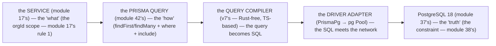

# Module 42 — Prisma 7: The Same App on the Alternative ORM (⚡)

**Phase 9: Database & ORM · Module 42 of 101**

> **Where does this run?** Everything in this module is **`[SERVER]`** — exactly as module 37's. The Prisma client (even v7's Rust-free one) belongs in `src/db/` behind the `import 'server-only'` guard, and only `src/services/**` may touch it. v7's query compiler *can* run in edge runtimes (that's a real capability — the official driver-adapters page exists precisely for it), but this course's rule doesn't change: **the ORM is server-only; the boundary is a build error, not a convention** (module 37's one rule).

---

## 1. Concept — Why this module exists, and what "Prisma 7" actually is now

**The README's decision** (the decision matrix, this row): the course's *primary* ORM is **Drizzle v1** (modules 37–41) — typed end-to-end in TypeScript, SQL-visible, migrations as plain SQL. The *alternative* is **Prisma 7**: this ⚡ module's gate is one sentence — **you can maintain or build the same app on Prisma**. That's the whole job: when a team, an employer, or an acquisition brings you a Prisma codebase, you should be able to read it, extend it, and — critically — spot its mistakes (the same tenancy mistakes, the same N+1s, the same pool mistakes, wearing a different syntax).

**Prisma 7 is a generational change, not a version bump** (all of this verified against the official Prisma docs, the `/orm/v7` line — September 2026; the docs' banner itself says *Prisma ORM 8 is in release candidate and the 7 docs live at `/orm/v7`*):

| Area | v6 and earlier (what most tutorials show) | **v7 (this module)** |
|---|---|---|
| Query engine | A bundled **Rust binary** (Node-API library, downloaded to `node_modules/@prisma/engines`) | **Rust-free by default** — queries compile to SQL with a **TypeScript-based query compiler** (no engine binary in your generated code); `PRISMA_CLIENT_ENGINE_TYPE` / `engineType` no longer exist |
| Database connection | Built into the engine; pool tuning via **connection-string query parameters** (`?connection_limit=20`) | **Driver adapters are required** for every database — for PostgreSQL, `@prisma/adapter-pg` (`PrismaPg`); pool tuning moves to the **adapter's options** |
| Generator | `prisma-client-js` → generated into `node_modules/.prisma`, imported from `@prisma/client` | `prisma-client` → `output` is **required** and points **into your repo** (e.g. `../generated/prisma`); you import from **the generated path** |
| Config | `package.json` ("prisma": { "seed" }) + `.env` only | **`prisma.config.ts`** (seed config moves here; auto-seeding is removed) |
| Client middleware | `prisma.$use(...)` | **Removed** — Client Extensions (`prisma.$extends`) |

**The version reality (September 2026):** the stable line you build on is **Prisma 7.x (7.10 current)**. **Prisma 8 is in release candidate** — its RCs are still accumulating breaking changes between releases, and as of this writing `npm install prisma` can resolve the `latest` dist-tag to the **8.0.0-rc** line instead of 7.x. **Pin explicitly: `prisma@7`, `@prisma/client@7`, `@prisma/adapter-pg@7`**, and verify with `npm view prisma version` / `npm ls prisma` after install. New-project-on-8 vs. migrate-7-to-8 is a *team* decision (Prisma's own guidance: 7 receives security updates for 18 months after 8.0.0 final; 7.10 ships an `@prisma/prisma7` compatibility package so 7 and 8 can coexist during an incremental migration) — but **this course teaches the stable line**: 7.

---

## 2. Mental Model — The 4 hops, unchanged



**The doctrine is ORM-agnostic — the syntax is not.** Every rule from modules 37–41 survives the switch, one-to-one:

1. **The service is the only code that touches the ORM** (module 37's one rule) — `src/services/**` imports `src/db/`, never the reverse; the `server-only` guard is identical.
2. **The tenancy scope is the query's first clause** (module 17's rule 1) — `where: { orgId, ... }` comes *before* any other filter; the no-unscoped-query rule (module 49's `or()` anti-pattern) applies with exactly the same force.
3. **The DB is the truth** (module 38's line) — the unique `(org, slug)`, `(org, sku)`, `(org, number)` constraints live in the schema exactly as in module 38's Drizzle version; Prisma's DSL is a *different spelling* of the same Postgres.
4. **Migrations are still the contract** (module 38's) — `prisma migrate` writes **SQL files** to `prisma/migrations/` (auditable, diff-able, reviewed in the PR — the module-38's "no black box" line holds in v7; that's the historical strength Prisma shares with Drizzle).
5. **The money rule, the ID rule, the time rule** (modules 14/38's) — integer cents, UUIDs, `Timestamptz` (always UTC) — unchanged.

**The one genuinely different mental model:** in v6-era Prisma, the generated client was a *product* (a black box in `node_modules` you imported by package name). In v7 it's a *build artifact of your repo* — generated into `src/generated/prisma` (committed-or-not is a team choice; this course: **gitignore it**, generate in CI, the module-38's "generated code is not source" line), and it compiles queries with TypeScript you can read. The client is closer to what Drizzle always was — which is why the two ORMs feel more alike than their tutorials suggest.

---

## 3. Architecture — The folders, and what changed in the tree

```
prisma/
  schema.prisma            ← THE SCHEMA (module 38's Drizzle schema.prisma equivalent — the single source of truth)
  migrations/              ← SQL migration files (module 38's — auditable, reviewed)
src/
  db/
    client.ts              ← THE v7 CLIENT (adapter + generated client + server-only guard — module 37's guard, module 42's §4.2)
  generated/prisma/        ← v7 GENERATOR OUTPUT (gitignored — CI runs `prisma generate` — module 38's "generated ≠ source")
  services/                ← unchanged (module 37's one rule)
  ...
prisma.config.ts           ← v7 CONFIG (module 42's §4.3 — seed + schema location)
.env                       ← DATABASE_URL (module 37's — server-only secret, never NEXT_PUBLIC_)
```

**What is NOT in the tree:** `node_modules/.prisma` (the v6-era runtime engine — gone in v7), `@prisma/engines` (no Rust engine download), a `package.json` seed block (moved to `prisma.config.ts`).

**The dependency set** (pinned — §1's version-reality rule):

```bash
# runtime:
npm install @prisma/client@7 @prisma/adapter-pg@7
# dev (the CLI — note the pin; 'latest' may be the 8.0.0-rc line as of September 2026):
npm install -D prisma@7
```

---

## 4. Production Code — The same domain, the v7 spelling

### 4.1 The schema — module 38's domain in `schema.prisma`

`FILE: prisma/schema.prisma` (production pattern — the module-42's §4.1: the full tenant domain; the same tables, the same constraints as module 38's Drizzle schema)

```prisma
// THE PRISMA 7 SCHEMA (module 38's domain — the same tables, the same constraints — the module-38's line: the schema is the single source of truth):

generator client {
  provider = "prisma-client"        // v7's generator (NOT the v6-era "prisma-client-js")
  output   = "../generated/prisma"  // REQUIRED in v7 — into the repo, not node_modules
}

datasource db {
  provider = "postgresql"
  url      = env("DATABASE_URL")    // read by the CLI for `prisma migrate` (module 37's .env — server-only)
}

// — ENUMS (module 38's §3.1's line: the enum is the type and the constraint — Prisma emits real Postgres enums):
enum ProductStatus  { DRAFT ACTIVE DELISTED }
enum OrderStatus    { PENDING PAID SHIPPED CANCELLED REFUNDED }
enum MembershipRole { OWNER ADMIN MEMBER }

// — ORGANIZATIONS (the tenant — module 11's):
model Organization {
  id        String   @id @default(uuid()) @db.Uuid
  name      String   @db.VarChar(120)
  slug      String   @db.VarChar(60)                       // the module-24's slug (the service's generation — the schema's constraint)
  plan      String   @default("free") @db.VarChar(20)      // module 38's §3.1's line: the plan is the string (the plan's set is the product's, not the schema's)
  createdAt DateTime @default(now()) @db.Timestamptz(6)    // module 38's §3.1's line: timestamptz (always UTC)

  memberships Membership[]
  products    Product[]
  orders      Order[]
  @@map("organizations")
}

// — USERS (the module-10's: the Better Auth users table — the Phase 10 adapter maps to THIS):
model User {
  id          String    @id @default(uuid()) @db.Uuid
  email       String    @unique @db.VarChar(255)           // module 38's §3.3's line: the UNIQUE is the constraint (inline, here)
  name        String?   @db.VarChar(120)
  image       String?   @db.VarChar(500)
  suspendedAt DateTime? @db.Timestamptz(6)                 // the module-23's suspend challenge (nullable = active)
  createdAt   DateTime  @default(now()) @db.Timestamptz(6)

  memberships Membership[]
  @@map("users")
}

// — MEMBERSHIPS (user↔org — module 11's RBAC — the composite PK (user_id, org_id)):
model Membership {
  userId    String         @db.Uuid
  orgId     String         @db.Uuid
  role      MembershipRole @default(MEMBER)
  createdAt DateTime       @default(now()) @db.Timestamptz(6)

  user User         @relation(fields: [userId], references: [id], onDelete: Cascade)  // module 38's §3.1's line: the FK's cascade
  org  Organization @relation(fields: [orgId], references: [id], onDelete: Cascade)
  @@id([userId, orgId])                                                       // the composite PK (the no (user, org) duplicate — module 11's)
  @@map("memberships")
}

// — PRODUCTS (the tenant-owned — module 11's tenancy — the same three constraints as module 38's):
model Product {
  id          String        @id @default(uuid()) @db.Uuid
  orgId       String        @db.Uuid
  slug        String        @db.VarChar(60)
  name        String        @db.VarChar(120)
  description String?
  priceCents  Int                                        // module 38's §3.1's line: the integer cents (module 14's money rule) — the no float
  sku         String?       @db.VarChar(40)              // the nullable (module 31's 2a)
  status      ProductStatus @default(DRAFT)
  createdBy   String?       @db.Uuid
  createdAt   DateTime      @default(now()) @db.Timestamptz(6)
  updatedAt   DateTime      @default(now()) @updatedAt @db.Timestamptz(6)

  org       Organization   @relation(fields: [orgId], references: [id], onDelete: Cascade)
  creator   User?          @relation(fields: [createdBy], references: [id], onDelete: SetNull)
  orderItems OrderItem[]

  @@unique([orgId, slug])                                  // the module-38's §1's line: the tenancy's constraint — the (org, slug) unique
  @@unique([orgId, sku]) where: (sku != null)              // the PARTIAL unique (module 38's §3.1's line: the nullable sku — Prisma's `where:` = Drizzle's `.where()`)
  @@index([orgId, status])                                 // the tenancy's index (the list's query — module 17's)
  @@map("products")
}

// — ORDERS + ORDER_ITEMS (the snapshot — module 38's §3.2; see the course repo's module 38 for the full Drizzle version):
model Order {
  id         String      @id @default(uuid()) @db.Uuid
  orgId      String      @db.Uuid
  number     Int         // the org-scoped number (module 38's §3.2 — the service's generation)
  status     OrderStatus @default(PENDING)
  currency   String      @default("USD") @db.VarChar(3)   // module 14's ISO-4217
  totalCents Int
  createdAt  DateTime    @default(now()) @db.Timestamptz(6)
  updatedAt  DateTime    @default(now()) @updatedAt @db.Timestamptz(6)

  org   Organization @relation(fields: [orgId], references: [id], onDelete: Cascade)
  items OrderItem[]

  @@unique([orgId, number])            // the module-38's §3.2's line: the (org, number) unique
  @@index([orgId, createdAt(sort: Desc)])  // the cursor's sort (module 40's keyset — the module-36's §3's list query)
  @@map("orders")
}

model OrderItem {
  id             String  @id @default(uuid()) @db.Uuid
  orderId        String  @db.Uuid
  productId      String? @db.Uuid           // the module-38's §3.2's line: the set-null (the snapshot's name/price remain)
  productName    String  @db.VarChar(120)   // the module-38's §3.2's snapshot (module 14's DTO rule, the DB version)
  quantity       Int
  unitPriceCents Int

  order   Order    @relation(fields: [orderId], references: [id], onDelete: Cascade)
  product Product? @relation(fields: [productId], references: [id], onDelete: SetNull)

  @@index([orderId])
  @@map("order_items")
}
```

**The API-key / idempotency / audit / analytics tables** (module 36's/17's/28's) map the same way — `text[]` becomes `String[]` (Postgres native arrays Prisma types directly), `jsonb` becomes `Json?`, composite PKs become `@@id([...])`. The exercise's production tier is to complete that mapping.

### 4.2 The client — the v7 three-piece (adapter + generated client + guard)

`FILE: src/db/client.ts` (production pattern — the module-42's §4.2: the v7 client is built from the adapter — the module-37's guard, intact)

```ts
import 'server-only'   // module 37's guard — the boundary is a build error, not a convention

import { PrismaPg } from '@prisma/adapter-pg'
import { PrismaClient } from '../generated/prisma/client'   // v7: import the GENERATED path — NOT '@prisma/client'

// THE DRIVER ADAPTER (module 42's §1's table, row 2 — required in v7 for every database):
// the pg Pool options (max, idleTimeoutMillis, ...) are passed HERE — module 41's pool tuning,
// which in v6-era Prisma lived in the connection string's query parameters, lives on the adapter (module 42's §7):
const adapter = new PrismaPg({
  connectionString: process.env.DATABASE_URL!,   // module 37's: the server-only secret
  max: 20,   // module 41's app-pool size — behind PgBouncer's 6432 (module 41's §3)
})

// THE v7 CLIENT (no engine binary — the TypeScript query compiler sits in your generated code):
export const prisma = new PrismaClient({ adapter })
```

`FILE: .gitignore` (production pattern — add the line):

```gitignore
src/generated/prisma/   # generated in CI (`prisma generate`) and in predev — module 38's "generated ≠ source"
```

`FILE: package.json` (scripts — the module-38's lifecycle, the v7 spelling):

```json
{
  "scripts": {
    "db:generate": "prisma generate",
    "db:migrate":  "prisma migrate dev",
    "db:deploy":   "prisma migrate deploy"
  }
}
```

### 4.3 The config — `prisma.config.ts` (v7's home for CLI config)

`FILE: prisma.config.ts` (production pattern — the module-42's §4.3: v6's `package.json` seed block is gone — auto-seeding was removed in v7, the config lives here)

```ts
import 'dotenv/config'   // the config file loads before .env is auto-read — load it explicitly
import { defineConfig } from 'prisma/config'

export default defineConfig({
  schema: 'prisma/schema.prisma',
  migrations: {
    seed: 'tsx prisma/seed.ts',   // the module-38's seed (module 10's fixture users) — declared HERE now
  },
})
```

### 4.4 The queries — module 39's three shapes, the Prisma spelling

`FILE: src/services/products.ts` (production pattern — the module-17's one rule: the service is the only caller; the module-39's doctrine, unchanged)

```ts
import { prisma } from '../db/client'
import { AppError } from '../lib/errors'   // module 17's AppError — the doctrine is ORM-agnostic

// THE SINGLE (module 39's §2.1 — the tenancy scope is the FIRST clause — module 17's rule 1):
export async function getProduct(orgId: string, id: string) {
  const product = await prisma.product.findFirst({
    where: { orgId, id },          // orgId first, id second — the module-39's line, the Prisma spelling
  })
  if (!product) throw new AppError('not-found', 404)   // module 49's cross-tenant = 404 (never 403)
  return product
}

// THE LIST (module 39's §2.2 — the cursor from module 40's keyset pagination — Prisma's cursor form):
export async function listProducts(orgId: string, limit: number, cursor?: string) {
  return prisma.product.findMany({
    where: { orgId, status: 'ACTIVE' },
    orderBy: { createdAt: 'desc' },
    ...(cursor ? { cursor: { id: cursor }, skip: 1 } : {}),   // keyset: `limit+1` detection is the caller's (module 40's)
    take: limit,
  })
}

// THE N+1, FIXED (module 39's §4 — Drizzle's `inArray`/explicit join becomes Prisma's `include` — the relation is typed end-to-end):
export async function listOrdersWithItems(orgId: string, limit: number) {
  return prisma.order.findMany({
    where: { orgId },
    orderBy: { createdAt: 'desc' },
    take: limit,
    include: { items: true },   // ONE `orders` + ONE `order_items WHERE order_id IN (...)` — the 51→2 (module 39's §4)
  })
}
```

### 4.5 The transaction — module 40's order placement, the interactive form

`FILE: src/services/orders.ts` (production pattern — module 40's atomic order: one unit of work, all-or-nothing; module 49's row lock via parameterized raw SQL)

```ts
import { prisma } from '../db/client'
import { AppError } from '../lib/errors'

// THE INTERACTIVE TRANSACTION (module 40's — Prisma's `$transaction(fn)` — the fn gets a CLIENT bound to the same connection):
export async function placeOrder(input: PlaceOrderInput, orgId: string) {
  return prisma.$transaction(async (tx) => {
    // module 49's tenancy race: lock the product rows BEFORE reading (Drizzle: `.forUpdate()` — Prisma: parameterized raw — the $ tagged template binds parameters, never string-interpolates — module 75's SQLi rule):
    const locked = await tx.$queryRaw`
      SELECT id, price_cents FROM products
      WHERE org_id = ${orgId} AND id = ANY(${input.productIds})
      FOR UPDATE
    `
    // ... recompute totalCents from the LOCKED rows (module 12's "the price is recomputed at submit" — never trust the client's cents):
    const totalCents = /* recompute from locked rows (module 40's §2) */ 0

    const order = await tx.order.create({
      data: {
        orgId, number: nextNumber, status: 'PENDING', currency: 'USD', totalCents,
        items: { create: input.items.map((i) => ({
          productName: i.productName, quantity: i.quantity, unitPriceCents: i.unitPriceCents,
        })) },
      },
      include: { items: true },
    })

    await tx.auditEvent.create({ data: { orgId, action: 'order.created', entityType: 'order', entityId: order.id } })
    return order
  })
}
```

**Note the `FOR UPDATE`** — Prisma's query builder has no `.forUpdate()`; the course's answer is **`$queryRaw` with the tagged template** (parameters bound by the driver — module 75's SQLi defense holds exactly as in Drizzle). This is the one place the Prisma version is *more explicit SQL* than the Drizzle version — and the module-38's "SQL-visible" line says that's a feature, not a regression.

---

## 5. Common Mistakes

| Mistake | The symptom | Fix |
|---|---|---|
| **Importing `@prisma/client` in v7** (module 42's §1's table, row 3) | `Cannot find module` or the v6-era types — the import changed when the generator left `node_modules` | Import **the generated path** (`../generated/prisma/client`) — and make CI run `prisma generate` before typecheck (module 42's §4.2) |
| **`npm install prisma` unpinned in September 2026** (module 42's §1's version-reality) | `npm ls prisma` shows **8.0.0-rc** — RC-line breaking changes mid-project (module 42's §10's v8 note) | Pin `prisma@7`, `@prisma/client@7`, `@prisma/adapter-pg@7`; verify after every install |
| **v6-era pool config** (`?connection_limit=20` in the URL) | "Works locally" — the pool knob silently ignored in v7 (the tuning moved to the adapter's options) | Pass pool options to `new PrismaPg({ max: 20, ... })` (module 42's §7) |
| **The unscoped query** (`where: { id }` without `orgId`) | The cross-tenant read — the module-49's `or()` anti-pattern, the Prisma spelling | The tenancy scope is the **first** clause, every time (module 17's rule 1) — the code-review gate (module 89's) is ORM-agnostic |
| **`$use` middleware from a v6 tutorial** | `prisma.$use is not a function` (removed in v7) | Client Extensions: `prisma.$extends({ query: { ... } })` — or better, keep the doctrine: the tenancy lives in the service's query, not a global hook |
| **Committing `src/generated/prisma/`** | Generated code in review diffs — the module-38's "generated ≠ source" violated | Gitignore it; generate in CI and predev (module 42's §4.2) |
| **`prisma db push` in production** | Schema drift without a migration record — the module-38's "migrations are the contract" violated | `prisma migrate deploy` only (module 42's §4.3's scripts) |

---

## 6. Security Notes

- **The `server-only` guard is identical** (module 37's) — `src/db/client.ts` imports `server-only`; any client-file import of the Prisma client is a **build error**.
- **`$queryRaw`/`$executeRaw` are parameterized by construction** — the tagged template (`tx.$queryRaw\`... ${orgId} ...\``) binds values as driver parameters; **string-interpolating SQL is the module-75's SQLi anti-pattern in both ORMs, equally fatal**.
- **The tenancy constraints are the same Postgres constraints** (module 38's §1) — the `(org, slug)`/`(org, number)` uniques and the `orgId` indexes don't care which ORM built them; the DB is the truth (module 38's line).
- **`DATABASE_URL` stays a server-only secret** (module 37's) — it appears in the `datasource` block only as `env("DATABASE_URL")` (the module-76's no-`NEXT_PUBLIC_` rule); the schema file contains no credentials.
- **Cross-tenant = 404, never 403** (module 49's) — `findFirst({ where: { orgId, id } })` returning null *is* the cross-tenant case; throw the `not-found` `AppError`, module 17's.

## 7. Performance Notes

- **v7's Rust-free compiler changes the serverless math** (module 41's serverless section, updated): no engine binary to download/cold-start per function, a smaller generated client, and (per the Prisma team's published benchmarks) materially faster query compilation — the module-84's constraint #2 (cold start) is lighter with v7 than with any v6-era codebase you inherit.
- **The pool knob moved, the topology didn't** (module 41's §3): app pool **20** (now on the adapter: `new PrismaPg({ max: 20 })`) behind **PgBouncer at 6432** in *transaction mode* — the module-41's "why serverless breaks naive pools" argument applies to `pg` (the adapter's driver) exactly as to Drizzle's `node-postgres` dialect.
- **N+1 → `include`** (module 39's §4) — Prisma's `include` is typed (the module-39's "the type flows to the query" line holds); verify with `log: ['query']` (module 39's) that it's the 51→2.
- **`$transaction(interactive)` holds one connection** (module 40's) — keep interactive transactions *short* (the module-40's "the transaction is the unit of work, not the workflow" line); batch writes with `createMany` inside it.
- **Indexes are schema, not ORM** (module 40's §3) — `@@index([orgId, status])` and the `DESC` cursor index (module 40's keyset) must exist in `prisma/migrations/` SQL; `EXPLAIN` (module 39's §5) is ORM-agnostic.

## 8. Exercise

**Beginner.** *The schema's migration*: take module 38's Drizzle schema in your head; write the **full** `schema.prisma` (all ten tables, every constraint) from module 38's code; run `prisma migrate dev --name init` against a local Postgres 18 (module 41's docker-compose); verify the emitted SQL in `prisma/migrations/` contains the `(org_id, slug)` and `(org_id, sku) WHERE (sku IS NOT NULL)` constraints. — *Artifact: `prisma/schema.prisma` + the migration's SQL diff.*

**Intermediate.** *The service rewrite*: rewrite module 39's three query shapes (single/list/N+1-fixed) and module 40's order transaction in Prisma **exactly as §4.4–§4.5 spell them**, keeping the service signatures identical (the module-17's contract: the services are the interface — the ORM is behind it); turn on `log: ['query']` and prove the N+1 fix (51→2) and the `FOR UPDATE` lock. — *Artifact: `src/services/*` on Prisma + the query log evidence.*

**Production.** *The audit*: given a v6-era Prisma codebase (write a 5-file fake yourself: `prisma-client-js` generator, `?connection_limit` in the URL, `$use` middleware doing tenancy scoping, `@prisma/client` imports, `package.json` seed), produce the **v7 migration plan**: the pin decision (§1's version-reality), the generator+output change, the adapter setup with pool options, the middleware→extension (or doctrine: tenancy into the services) decision, the CI `prisma generate` gate, and the 8-check audit (module 89's §1.4's checklist) run over the result. — *Artifact: `docs/prisma7-migration-plan.md`.*

## 9. Architecture Challenge

**Prompt:** *"Your team runs a production SaaS on Prisma 6 with the Rust engine, `?connection_limit=100` in the URL (no pooler), tenancy enforced by a `$use` middleware, and `prisma db push` in the deploy pipeline. The CTO asks: 'move us to Prisma 7 — and tell me what's actually broken.'"* (the *module-42's* migration — the *module-41's* pooling — the *module-49's* tenancy — the *module-38's* contract).

The *problems*: (1) the *pool topology* — 100 direct connections per instance, no PgBouncer (the *module-41's §3* — the *Postgres 18 `max_connections`* (module 37's) — the *module-41's line: the pool is the topology, not the number*).

(2) the *tenancy in middleware* — a global `$use` that injects `orgId` (the *module-49's* — the *no hidden scope* (module 49's) — the *module-17's rule 1: the service's check is the first line*).

**Design**: the *the v7 remediation* (the *the pin + generator + adapter* (module 42's §1 + §4) + the *the PgBouncer topology* (module 41's §3) + the *the tenancy-into-services* (module 49's) + the *the migrate-deploy pipeline* (module 38's) — the *module-42's line: the doctrine is ORM-agnostic — the syntax is not* (module 42's §2)).

Produce: the *the v7 remediation* (the *the 4-part plan* (module 42's §1 + module 41's §3 + module 49's + module 38's) + the *the 8-check audit* (module 89's §1.4) — the *module-42's standing line: the doctrine survives the switch — the syntax is what you learn* (module 42's §2)).

<details>
<summary>Model answer</summary>
**The v7 remediation** (module 42's §1 + module 41's + module 49's):
1. **The pin + generator + adapter** (module 42's §1 + §4): pin `prisma@7`/`@prisma/client@7`/`@prisma/adapter-pg@7` (the §1's version-reality); switch the generator to `prisma-client` with `output = "../generated/prisma"` (gitignored, CI-gated); replace the URL's `?connection_limit=100` with `new PrismaPg({ max: 20 })` — and put **PgBouncer (transaction mode, 6432)** in front (module 41's §3's topology) — the 100-direct-connections is a Postgres-`max_connections` incident waiting for its traffic spike (module 41's).
2. **The tenancy-into-services** (module 49's): delete the `$use` middleware (removed in v7 anyway); the `orgId` becomes the **first clause of every service query** (module 17's rule 1) — the middleware was a *hidden* scope (the module-49's no-hidden-scope line): a query that forgot the injection was a cross-tenant read; an explicit first clause is reviewable, greppable, and the 8-check audit (module 89's §1.4) can enforce it.
3. **The migrate-deploy pipeline** (module 38's): `prisma db push` **out of production forever** — `prisma migrate deploy` only; migrations are the contract (module 38's line); seed config moves to `prisma.config.ts` (module 42's §4.3).
**The generalization** (the *alternative-ORM's* pattern, the *module's* standing rule): **the *doctrine* (module 42's §2: service-only, tenancy-first, DB-is-truth, migrations-as-contract) — the *syntax* (the §4's spelling) — the *version* (the §1's pin) — the *module-42's standing line: the doctrine survives the switch — the syntax is what you learn* (module 42's §2)*.
</details>

## 10. Official Documentation

- Prisma ORM (v7 line — the banner notes v8 is RC; 7 docs live here): https://www.prisma.io/docs/orm/v7
- Database drivers (driver adapters — required in v7; `@prisma/adapter-pg`; pool tuning on the adapter): https://www.prisma.io/docs/orm/v7/core-concepts/supported-databases/database-drivers
- PostgreSQL + driver adapters: https://www.prisma.io/docs/orm/v7/core-concepts/supported-databases/postgresql
- Prisma ORM without Rust engines (the v7 query compiler): https://www.prisma.io/docs/orm/v7/more/internals/engines
- Migrations: https://www.prisma.io/docs/orm/v7/operations/prisma-migrate
- `prisma.config.ts`: https://www.prisma.io/docs/orm/v7/reference/prisma-config
- Client Extensions (the `$use` replacement): https://www.prisma.io/docs/orm/v7/reference/tools-and-utilities/prisma-client-extension
- Raw queries (`$queryRaw`/`$executeRaw`): https://www.prisma.io/docs/orm/v7/reference/prisma-client-reference
- Upgrading v6 → v7 (the breaking-change recipe): https://www.prisma.io/docs/orm/v7/more/upgrade-guides/upgrading-versions/upgrading-to-prisma-7
- The releases (the 8.0.0-rc line's changelog — read before any 7→8 decision): https://github.com/prisma/orm/releases
- The course's primary track: modules 37–41 (Drizzle) — `09-database/01..05`

## 11. What You Should Know Before Continuing

- [ ] I can state *why this module exists* — the gate: *maintain/build the same app on Prisma* (module 1's)
- [ ] I know the *5 v7 differences* (module 1's table: Rust-free compiler / mandatory driver adapters / `prisma-client` generator + `output` / `prisma.config.ts` / `$use` removed) — *verified at the `/orm/v7` docs*
- [ ] I know the *version-reality* — 7.10 stable, **8.0.0-rc on `latest`**, pin `@7` explicitly, `@prisma/prisma7` coexistence package, 18-month 7.x security line (module 1's)
- [ ] I can write the *v7 three-piece client* (module 4's §4.2: `PrismaPg` adapter + generated-path import + `server-only` guard)
- [ ] I can spell *module 38's domain* in `schema.prisma` — including the *partial unique* (`@@unique([orgId, sku]) where: (sku != null)`) and the *DESC cursor index* (module 4's §4.1)
- [ ] I know the *tenancy scope is the first clause* in `findFirst({ where: { orgId, id } })` — and *cross-tenant = 404* (module 4's §4.4 + module 49's)
- [ ] I know the *N+1 → `include`* and the *interactive `$transaction`* with the *`FOR UPDATE` via parameterized `$queryRaw`* (module 4's §4.4–§4.5)
- [ ] I know the *pool moved* — `new PrismaPg({ max: 20 })` behind PgBouncer's 6432, transaction mode (module 7's + module 41's §3)
- [ ] I've done the *schema's migration* (module 8's beginner) + the *service rewrite with query-log evidence* (module 8's intermediate) + the *v6→v7 audit plan* (module 8's production) — the *artifacts* (module 20's)

**Next:** Module 43 — Identity / Authentication Concepts (Phase 10 begins — the *module-43's line: the session is the server's truth* (module 43's)).
