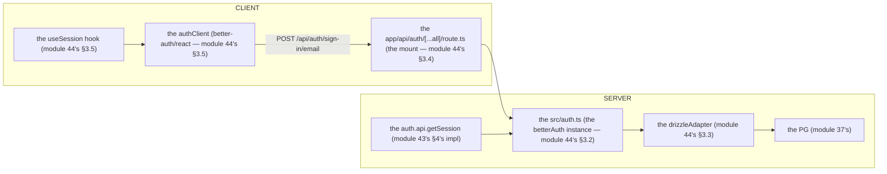

# Module 44 — Better Auth: Architecture & Setup (The Auth Is One File, One Route, One Client)

**Phase 10: Authentication · Module 44 of 101**

> **Where does this run?** The `auth.ts` instance and the mount route are **`[SERVER]`**; the `authClient` is **`[CLIENT]`**; `auth.api.getSession` is **`[SERVER]`** (the module-43's single entry point, now implemented). The course's verified decision (module 01-verified-stack): **Better Auth is primary** (2026's dominant maintained library; Auth.js is in maintenance mode) — module 42's "evaluate, don't assume" applies to ORMs and state, but the *course* pins Better Auth as the auth layer, for the reasons in module 44's §1.

---

## 1. Concept — The auth is one file, one route, one client

**Why Better Auth** (module 44's §1): the *the 2026 landscape* (module 01-verified-stack's decision: the *Better Auth* is the *dominant maintained* library — the *Auth.js* is the *maintenance mode* (module 01-verified-stack) — the *module-44's line: the Better Auth is the course's auth* (module 01-verified-stack) — the *the no re-learn* (module 44's §1)).

**The 3 artifacts** (module 44's §1.1): the *the `src/auth.ts`* (the *server instance* — module 44's §3.2) — the *the `app/api/auth/[...all]/route.ts`* (the *mount* — module 44's §3.4) — the *the `src/lib/auth-client.ts`* (the *client* — module 44's §3.5) — the *module-44's line: the auth is the 3 artifacts* (module 44's §1.1) — the *the no 10 files* (module 44's §1.1).

**The `auth.api` is the server's door** (module 44's §1.2): the *the `auth.api.<endpoint>` is the *every endpoint as a function* (module 44's §1.2) — the *module-44's line: the `auth.api` is the server's door* (module 44's §1.2) — the *the no HTTP in the service* (module 17's) — the *the `auth.api.getSession` is the module-43's single entry point* (module 43's §4).

## 2. Mental Model — The 3 artifacts (drawn)



**The 3 artifacts** (the module-44's mental model):
1. **The instance** (module 44's §3.2): the *the `betterAuth({ … })`* — the *the config* (module 44's §3.2).
2. **The mount** (module 44's §3.4): the *the `toNextJsHandler(auth)`* — the *the HTTP* (module 44's §3.4).
3. **The client** (module 44's §3.5): the *the `createAuthClient()`* — the *the browser's* (module 44's §3.5).

## 3. Architecture — The setup (the 3 artifacts, the code)

### 3.1 The env (module 44's §3.1 — the secret + the URL)

`FILE: src/env.ts` (production pattern — [SERVER] — the module-44's §3.1: the `BETTER_AUTH_SECRET` + the `BETTER_AUTH_URL`, the module-37's §3's Zod's boot parse)

```ts
// THE ENV (module 44's §3.1 — the module-37's §3's Zod's boot parse (module 37's §3)):
import { z } from 'zod'

const serverEnv = z.object({
  DATABASE_URL: z.string().url(),          // the module-37's §3 (module 37's)
  DB_POOL_MAX: z.coerce.number().int().positive().default(10),   // the module-41's §3.1 (module 41's)
  BETTER_AUTH_SECRET: z.string().min(32),  // the module-44's §3.1's line: the 32+ chars (module 44's §3.1) — the `openssl rand -base64 32` (module 44's §3.1)
  BETTER_AUTH_URL: z.string().url(),       // the module-44's §3.1's line: the base URL (module 44's §3.1) — the `http://localhost:3000` (dev) (module 44's §3.1)
})
// THE NO NEXT_PUBLIC (module 44's §6): the BETTER_AUTH_SECRET is the SERVER-ONLY (module 44's §3.1) — the no NEXT_PUBLIC_ (module 44's §3.1)

export const env = serverEnv.parse(process.env)   // the module-37's §3 (module 37's)
```

**The module-44's line:** the *secret is the 32+ chars* (module 44's §3.1) — the *the server-only* (module 44's §3.1) — the *the no `NEXT_PUBLIC_`* (module 44's §3.1).

### 3.2 The instance (module 44's §3.2 — the `src/auth.ts`)

`FILE: src/auth.ts` (production pattern — [SERVER] — the module-44's §3.2: the `betterAuth` + the `drizzleAdapter` + the `nextCookies`)

```ts
// THE INSTANCE (module 44's §3.2 — the betterAuth + the drizzleAdapter + the nextCookies (module 44's §3.2)):
import { betterAuth } from 'better-auth'
import { drizzleAdapter } from 'better-auth/adapters/drizzle'
import { nextCookies } from 'better-auth/next-js'
import { db } from '@/db'
import { env } from '@/env'

export const auth = betterAuth({
  database: drizzleAdapter(db, { provider: 'pg' }),   // the module-44's §3.3 (module 44's §3.3) — the the module-37's db (module 37's)
  secret: env.BETTER_AUTH_SECRET,                      // the module-44's §3.1 (module 44's §3.1)
  baseURL: env.BETTER_AUTH_URL,                        // the module-44's §3.1 (module 44's §3.1)
  emailAndPassword: {
    enabled: true,   // the module-46's flows (module 46's) — the email/password (module 44's §3.2)
  },
  // the module-49's (Phase 11): the organization() plugin (module 49's) — added there
  plugins: [nextCookies()],   // THE NEXTCOOKIES (module 44's §3.2): the server action's cookie (module 44's §4.1) — the LAST plugin (module 44's §3.2)
})
```

**The module-44's line:** the *`drizzleAdapter` is the bridge* (module 44's §3.3) — the *the `nextCookies` is the server action's cookie* (module 44's §3.2) — the *the LAST plugin* (module 44's §3.2).

### 3.3 The schema (module 44's §3.3 — the 4 core tables)

`FILE: the 4 core tables (the shape — [SERVER] — the module-44's §3.3: the `npx auth@latest generate`'s output)` (simplified example)

```bash
# THE SCHEMA (module 44's §3.3 — the npx auth@latest generate (module 44's §3.3) — the the Drizzle's schema (module 38's)):
npx auth@latest generate
```

**The 4 core tables** (the module-44's §3.3's line): the *`user`* (the *who* — module 43's §3) — the *`session`* (the *handle* — module 43's §3) — the *`account`* (the *social's link* — module 44's §9) — the *`verification`* (the *email's proof* — module 46's) — the *module-44's line: the 4 core tables are the user/session/account/verification* (module 44's §3.3) — the *the `npx auth@latest generate` is the Drizzle's schema* (module 44's §3.3) — the *the Phase 9's migration* (module 38's §4) — the *module-44's line: the 4 tables are the Phase 9's migration* (module 38's §4).

**The module-44's line:** the *the 4 core tables are the user/session/account/verification* (module 44's §3.3) — the *the `npx auth@latest generate` is the Drizzle's schema* (module 44's §3.3) — the *the Phase 9's migration* (module 38's §4).

### 3.4 The mount (module 44's §3.4 — the route handler)

`FILE: app/api/auth/[...all]/route.ts` (production pattern — [SERVER] — the module-44's §3.4: the `toNextJsHandler`)

```ts
// THE MOUNT (module 44's §3.4 — the toNextJsHandler (module 44's §3.4) — the the /api/auth/* (module 44's §3.4)):
import { auth } from '@/auth'
import { toNextJsHandler } from 'better-auth/next-js'

export const { GET, POST } = toNextJsHandler(auth)   // the module-44's line: the mount is the toNextJsHandler (module 44's §3.4)
```

**The module-44's line:** the *mount is the `toNextJsHandler`* (module 44's §3.4) — the *the `/api/auth/*`* (module 44's §3.4).

### 3.5 The client (module 44's §3.5 — the `authClient`)

`FILE: src/lib/auth-client.ts` (production pattern — [CLIENT] — the module-44's §3.5: the `createAuthClient`)

```ts
// THE CLIENT (module 44's §3.5 — the createAuthClient (module 44's §3.5) — the the same domain (module 44's §3.5)):
import { createAuthClient } from 'better-auth/react'

export const authClient = createAuthClient()   // the module-44's line: the client is the createAuthClient (module 44's §3.5) — the the no baseURL (module 44's §3.5) — the the same domain (module 44's §3.5)
// the module-44's line: the useSession hook is the reactive (module 44's §3.5) — the the nano-store (module 44's §3.5)
// export const { signIn, signUp, useSession } = createAuthClient()   // the module-44's line: the destructured (module 44's §3.5)
```

**The module-44's line:** the *client is the `createAuthClient`* (module 44's §3.5) — the *the same domain* (module 44's §3.5) — the *the `useSession` is the reactive* (module 44's §3.5).

### 3.6 The session read (module 43's §4's impl)

`FILE: src/lib/session.ts` (production pattern — [SERVER] — the module-43's §4's impl: the `auth.api.getSession`)

```ts
// THE SESSION READ (module 43's §4's impl — the auth.api.getSession (module 44's §3.6)):
import 'server-only'
import { headers } from 'next/headers'
import { auth } from '@/auth'

export type Session = {
  userId: string      // the module-43's §3's truth (module 43's §3)
  email: string       // the module-43's §3 (module 43's §3)
  name: string | null // the module-43's §3 (module 43's §3)
  expiresAt: Date     // the module-43's §3's when (module 43's §3)
} | null

export async function getSession(): Promise<Session> {
  // THE NARROW DTO (module 43's §4): the the session's read is the ONE function (module 43's §4) — the the no raw's session (module 43's §4):
  const s = await auth.api.getSession({ headers: await headers() })   // the module-44's line: the auth.api.getSession is the server's door (module 44's §1.2)
  if (!s) return null
  return { userId: s.user.id, email: s.user.email, name: s.user.name, expiresAt: s.session.expiresAt }   // the module-43's §3's narrow (module 43's §3)
}
```

**The module-44's line:** the *session read is the ONE function* (module 43's §4) — the *the `auth.api.getSession` is the impl* (module 44's §3.6) — the *the narrow DTO* (module 43's §4).

## 4. Production Code — The proxy (the Next 16's `proxy.ts`)

`FILE: proxy.ts` (production pattern — [SERVER] — the module-44's §4: the two modes, the module-22's deployment's)

```ts
// THE PROXY (module 44's §4 — the two modes (module 44's §4) — the the Next 16's proxy.ts (module 22's)):
import { NextRequest, NextResponse } from 'next/server'
import { auth } from '@/auth'
import { getSessionCookie } from 'better-auth/cookies'

// THE MODE 1 (module 44's §4.1): the full check (the DB's) — the NODE runtime (module 44's §4.1) — the the SLOW (module 44's §4.1):
export async function proxy(request: NextRequest) {
  const session = await auth.api.getSession({ headers: request.headers })   // the module-44's line: the full check is the DB's (module 44's §4.1)
  if (!session) return NextResponse.redirect(new URL('/login', request.url))   // the module-43's §2.5's 401 (module 43's)
  return NextResponse.next()
}

// THE MODE 2 (module 44's §4.2): the cookie-only (the fast) — the the OPTIMISTIC (module 44's §4.2) — the the NOT SECURE (module 44's §4.2):
export async function proxyFast(request: NextRequest) {
  const cookie = getSessionCookie(request)   // the module-44's line: the cookie-only is the fast (module 44's §4.2)
  if (!cookie) return NextResponse.redirect(new URL('/login', request.url))   // the module-44's line: the optimistic is the NOT SECURE (module 44's §4.2)
  return NextResponse.next()   // the module-44's line: the ENFORCEMENT is the PAGE (module 44's §4.2) — the the no proxy's enforcement (module 44's §4.2)
}

export const config = { matcher: ['/dashboard/:path*'] }   // the module-44's line: the matcher is the route's (module 44's §4)
```

**The module-44's line:** the *proxy is the 2 modes* (module 44's §4) — the *the full check is the DB's* (module 44's §4.1) — the *the cookie-only is the fast* (module 44's §4.2) — the *the enforcement is the PAGE* (module 44's §4.2) — the *the no proxy's enforcement* (module 44's §4.2).

## 5. Common Mistakes (the setup failures)

| Mistake | The symptom | Fix |
|---|---|---|
| **The client method in the server** (module 44's §3.5's line violated) | the *module-44's line: the client is the browser's* (module 44's §3.5) — the *the client method in the server is the *no* (module 44's §3.5) — the *module-44's line: the client is the browser's* (module 44's §3.5) — the *no client method in the server* (module 44's §3.5)* | the *the `auth.api`* (module 44's §1.2) — the *module-44's line: the `auth.api` is the server's door* (module 44's §1.2)* |
| **The no `nextCookies`** (module 44's §3.2's line violated) | the *module-44's line: the `nextCookies` is the server action's cookie* (module 44's §3.2) — the *the no `nextCookies` is the *no cookie in the server action* (module 44's §3.2) — the *module-44's line: the `nextCookies` is the server action's cookie* (module 44's §3.2) — the *no cookie in the server action* (module 44's §3.2)* | the *the `nextCookies()` plugin* (module 44's §3.2) — the *the LAST plugin* (module 44's §3.2) |
| **The secret in the `NEXT_PUBLIC_`** (module 44's §3.1's line violated) | the *module-44's line: the no `NEXT_PUBLIC_`* (module 44's §3.1) — the *the `NEXT_PUBLIC_` is the *client's* (module 44's §3.1) — the *module-44's line: the no `NEXT_PUBLIC_`* (module 44's §3.1) — the *no secret in the client* (module 44's §3.1)* | the *the server-only's env* (module 37's §3) — the *module-44's line: the no `NEXT_PUBLIC_`* (module 44's §3.1)* |
| **The edge proxy's DB check** (module 44's §4.1's line violated) | the *module-44's line: the full check is the DB's* (module 44's §4.1) — the *the edge's DB is the *no* (module 44's §4.1) — the *module-44's line: the full check is the DB's* (module 44's §4.1) — the *no edge's DB check* (module 44's §4.1)* | the *the Node runtime* (module 44's §4.1) / the *the cookie-only* (module 44's §4.2) |
| **The session read inline** (module 43's §4's line violated) | the *module-43's line: the session's read is the ONE function* (module 43's §4) — the *the inline's cookie's read is the *drift* (module 43's §4) — the *module-43's line: the session's read is the ONE function* (module 43's §4) — the *no inline's cookie's read* (module 43's §4)* | the *the `getSession()`* (module 43's §4) — the *module-43's line: the session's read is the ONE function* (module 43's §4)* |
| **The raw session to the client** (module 43's §4's line violated) | the *module-43's line: the narrow DTO* (module 43's §4) — the *the raw's session is the *leak* (module 43's §4) — the *module-43's line: the narrow DTO* (module 43's §4) — the *no raw's session to the client* (module 43's §4)* | the *the narrow's DTO* (module 43's §4) — the *module-43's line: the narrow DTO* (module 43's §4)* |
| **The no schema check** (module 44's §3.3's line violated) | the *module-44's line: the `npx auth@latest check schema`* (module 44's §3.3) — the *the no schema check is the *drift* (module 44's §3.3) — the *module-44's line: the `npx auth@latest check schema`* (module 44's §3.3) — the *no schema drift* (module 44's §3.3)* | the *the `npx auth@latest check schema`* (module 44's §3.3) — the *module-44's line: the `npx auth@latest check schema`* (module 44's §3.3)* |

## 6. Security Notes

- **The secret is the 32+ chars** (module 44's §3.1): the *module-44's line: the secret is the 32+ chars* (module 44's §3.1) — the *the `openssl rand -base64 32`* (module 44's §3.1) — the *the no `NEXT_PUBLIC_`* (module 44's §3.1).
- **The rotation is the `BETTER_AUTH_SECRETS`** (module 44's §6.1): the *module-44's line: the `BETTER_AUTH_SECRETS` is the rotation's* (module 44's §6.1) — the *the no secret's invalidation* (module 44's §6.1) — the *module-44's line: the `BETTER_AUTH_SECRETS` is the rotation's* (module 44's §6.1).
- **The `trustedOrigins` is the CSRF's** (module 44's §6.2): the *module-44's line: the `trustedOrigins` is the CSRF's* (module 44's §6.2) — the *module-45's* *the CSRF's* (module 45's) — the *module-45's deep-dive* (module 45's).
- **The enforcement is the PAGE** (module 44's §4.2): the *module-44's line: the enforcement is the PAGE* (module 44's §4.2) — the *the no proxy's enforcement* (module 44's §4.2) — the *module-43's §1's line: the enforcement is the server's* (module 43's §1).
- **The least-privilege** (module 37's §6): the *module-37's line: the app's user is the least* (module 37's §6) — the *module-44's line: the app's user is the least* (module 37's §6) — the *module-37's* *deep-dive* (module 37's).

## 7. Performance Notes

- **The session lookup is the per-request** (module 43's §2.2): the *module-43's line: the session lookup is the per-request* (module 43's §2.2) — the *the cache's* (module 20's L3) — the *module-20's* *deep-dive* (module 20's).
- **The proxy's cookie-only is the fast** (module 44's §4.2): the *module-44's line: the cookie-only is the fast* (module 44's §4.2) — the *module-22's* *the TTFB's* (module 22's) — the *module-22's* *deep-dive* (module 22's).
- **The Redis's secondary storage is the optional** (module 44's §7.1): the *module-44's line: the Redis's secondary storage is the optional* (module 44's §7.1) — the *the `@better-auth/redis-storage`* (module 44's §7.1) — the *module-23-04's* *the job's* (module 23-04's) — the *module-23-04's* *deep-dive* (module 23-04's).
- **The `use cache: private` is the session's** (module 47's): the *module-47's line: the `use cache: private` is the session's* (module 47's) — the *module-43's line: the `use cache: private` is the session's* (module 47's) — the *module-47's* *deep-dive* (module 47's).

## 8. Exercise

**Beginner.** *The setup* (module 44's §3): the *the `src/auth.ts`* (module 3.2) + the *the `app/api/auth/[...all]/route.ts`* (module 3.4) + the *the `src/lib/auth-client.ts`* (module 3.5) + the *the `src/lib/session.ts`* (module 3.6) — *build it* — the *the login's* (module 46's) — the *artifact: the 4 files + the login's log* (module 20's).

**Intermediate.** *The schema* (module 44's §3.3): the *the `npx auth@latest generate`* (module 3.3) + the *the Phase 9's migration* (module 38's §4) + the *the `npx auth@latest check schema`* (module 3.3) — the *artifact: the 4 tables' migration + the check's log* (module 20's).

**Production.** *The proxy* (module 44's §4): the *the 2 modes* (module 4's) + the *the `matcher`* (module 4's) + the *the enforcement's page* (module 4.2's) — the *artifact: the `proxy.ts` + the enforcement's page* (module 20's).

## 9. Architecture Challenge

**Prompt:** The *"the partner asks for the Google SSO, and the SAML's enterprise later"* (the *module-44's* *social's* — the *module-44's* *plugin's* — the *module-44's line: the `auth.api` is the server's door* (module 44's §1.2) — the *module-44's standing line: the `auth.api` is the server's door + the plugin's is the extension* (module 44's §1.2)).

The *problems*: (1) the *the social's SSO* (the *the `socialProviders`* (module 44's §9) — the *module-44's line: the `socialProviders` is the SSO's* (module 44's §9) — the *module-44's standing line: the `socialProviders` is the SSO's* (module 44's §9)).

(2) the *the SAML's enterprise* (the *the plugin's* (module 44's §9) — the *module-44's line: the plugin's is the extension* (module 44's §1.2) — the *module-44's standing line: the plugin's is the extension* (module 44's §1.2)).

**Design**: the *the split* (the *the `socialProviders`* (module 44's §9) + the *the plugin's* (module 44's §9) + the *the no re-learn* (module 44's §1) — the *module-44's line: the `auth.api` is the server's door* (module 44's §1.2) — the *module-44's standing line: the `socialProviders` is the SSO's + the plugin's is the extension + the no re-learn* (module 44's §9 + module 44's §1)).

Produce: the *the split* (the *the `socialProviders`* (module 44's §9) + the *the plugin's* (module 44's §9) + the *the no re-learn* (module 44's §1) — the *module-44's line: the `auth.api` is the server's door* (module 44's §1.2) — the *module-44's standing line: the `socialProviders` is the SSO's + the plugin's is the extension + the no re-learn* (module 44's §9 + module 44's §1)).

<details>
<summary>Model answer</summary>
**The split** (module 44's §9 + module 44's §1):
1. **The social's SSO** (module 44's §9): the *the `socialProviders`* (module 44's §9) — the *module-44's line: the `socialProviders` is the SSO's* (module 44's §9).
2. **The SAML's enterprise** (module 44's §9): the *the plugin's* (module 44's §9) — the *module-44's line: the plugin's is the extension* (module 44's §1.2).
**The generalization** (the *split's* pattern, the *module's* standing rule): **the *`socialProviders` is the SSO's* (module 44's §9) — the *the plugin's is the extension* (module 44's §1.2) — the *the no re-learn* (module 44's §1) — the *module-44's standing line: the `socialProviders` is the SSO's + the plugin's is the extension + the no re-learn* (module 44's §9 + module 44's §1)*.
</details>

## 10. Official Documentation

- Better Auth: Installation: https://www.better-auth.com/docs/installation
- Better Auth: Next.js integration: https://www.better-auth.com/docs/integrations/next
- Better Auth: Database (core schema): https://www.better-auth.com/docs/concepts/database
- Better Auth: Session management: https://www.better-auth.com/docs/concepts/session-management
- The module-43's concepts: the module-43 (the phase-10's file-01)

## 11. What You Should Know Before Continuing

- [ ] I can state the *auth is the 3 artifacts* (module 1's: the instance/mount/client) — the *the no 10 files* (module 1's line)
- [ ] I know the *`betterAuth` + the `drizzleAdapter` + the `nextCookies`* (module 3.2's) — the *the `nextCookies` is the server action's cookie* (module 3.2's line)
- [ ] I know the *4 core tables* (module 3.3's: the user/session/account/verification) — the *the `npx auth@latest generate`* (module 3.3's line)
- [ ] I know the *mount is the `toNextJsHandler`* (module 3.4's) — the *the `/api/auth/*`* (module 3.4's)
- [ ] I know the *client is the `createAuthClient`* (module 3.5's) — the *the same domain* (module 3.5's) — the *the `useSession` is the reactive* (module 3.5's)
- [ ] I know the *session read is the ONE function* (module 43's §4) — the *the `auth.api.getSession` is the impl* (module 3.6's)
- [ ] I know the *proxy is the 2 modes* (module 4's) — the *the full check is the DB's* (module 4.1's) — the *the cookie-only is the fast* (module 4.2's) — the *the enforcement is the PAGE* (module 4.2's)
- [ ] I've done the *setup* (module 8's beginner) + the *schema* (module 8's intermediate) + the *proxy* (module 8's production) — the *artifacts* (module 20's)

**Next:** Module 45 — Sessions & Cookie Security (the *the `HttpOnly`* — the *the `Secure`* — the *the `SameSite=Lax`* — the *the rotation* — the *the revocation* — the *module-45's line: the cookie is the secure's* (module 45's)).
