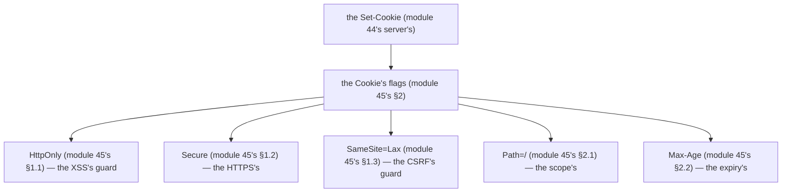

# Module 45 — Sessions & Cookie Security: HttpOnly, Secure, SameSite, Rotation, Revocation

**Phase 10: Authentication · Module 45 of 101**

> **Where does this run?** The cookie *setting* is **`[SERVER]`** (the `Set-Cookie`), the cookie *carrying* is **`[CLIENT]`** (the browser, automatic), the cookie *reading* is **`[SERVER]`** (the per-request lookup, module 43's §2.2). The 3 flags (`HttpOnly`/`Secure`/`SameSite`) are **the browser's contract** (module 45's §2) — set them wrong and the browser enforces nothing (module 45's §2). The module-43's standing rule, now *enforced*: **the session is a pointer to a server-side fact, carried in an `HttpOnly` cookie, never in `localStorage`** (module 43's §1 + module 45's §5).

---

## 1. Concept — The 3 flags are the browser's contract

**The `HttpOnly`** (module 45's §1.1): the *the browser's JS can't read the cookie* (module 45's §1.1) — the *the `document.cookie` is the *no* (module 45's §1.1) — the *module-45's line: the `HttpOnly` is the XSS's guard* (module 45's §1.1) — the *module-19-02's XSS* (module 75's) — the *the `localStorage` is the *XSS's* (module 43's §5) — the *module-45's line: the `HttpOnly` is the XSS's guard* (module 45's §1.1)).

**The `Secure`** (module 45's §1.2): the *the cookie is the *HTTPS only* (module 45's §1.2) — the *the no HTTP's send* (module 45's §1.2) — the *module-45's line: the `Secure` is the HTTPS's* (module 45's §1.2) — the *module-19-02's MITM* (module 75's) — the *module-45's line: the `Secure` is the HTTPS's* (module 45's §1.2).

**The `SameSite=Lax`** (module 45's §1.3): the *the cross-site's request is the *no cookie* (module 45's §1.3) — the *the `SameSite=Lax` is the *CSRF's guard* (module 45's §1.3) — the *module-45's line: the `SameSite=Lax` is the CSRF's guard* (module 45's §1.3) — the *module-19-02's CSRF* (module 75's) — the *module-45's line: the `SameSite=Lax` is the CSRF's guard* (module 45's §1.3).

## 2. Mental Model — The cookie's flags (the table, drawn)



**The 5 flags** (the module-45's mental model):
1. **The `HttpOnly`** (module 45's §1.1): the *the XSS's guard* — the *module-45's line: the `HttpOnly` is the XSS's guard* (module 45's §1.1).
2. **The `Secure`** (module 45's §1.2): the *the HTTPS's* — the *module-45's line: the `Secure` is the HTTPS's* (module 45's §1.2).
3. **The `SameSite=Lax`** (module 45's §1.3): the *the CSRF's guard* — the *module-45's line: the `SameSite=Lax` is the CSRF's guard* (module 45's §1.3).
4. **The `Path=/`** (module 45's §2.1): the *the scope's* — the *module-45's line: the `Path=/` is the scope's* (module 45's §2.1).
5. **The `Max-Age`** (module 45's §2.2): the *the expiry's* — the *module-45's line: the `Max-Age` is the expiry's* (module 45's §2.2).

## 3. Architecture — The cookie's config (the Better Auth's, the code)

`FILE: src/auth.ts` (production pattern — [SERVER] — the module-45's §3: the `cookies` option, the 3 flags)

```ts
// THE COOKIE'S CONFIG (module 45's §3 — the cookies option (module 45's §3) — the the 3 flags (module 45's §1)):
export const auth = betterAuth({
  // ... (module 44's §3.2's config)
  cookies: {
    sessionToken: {
      httpOnly: true,        // the module-45's §1.1 (module 45's §1.1) — the XSS's guard
      secure: true,          // the module-45's §1.2 (module 45's §1.2) — the HTTPS's
      sameSite: 'lax',       // the module-45's §1.3 (module 45's §1.3) — the CSRF's guard
      path: '/',             // the module-45's §2.1 (module 45's §2.1) — the scope's
    },
  },
  // the module-45's §3.1's line: the session's lifetime (module 45's §3.1) — the expiresIn + the updateAge (module 45's §3.1):
  session: {
    expiresIn: 60 * 60 * 24 * 7,   // the module-45's §3.1's line: the 7d (module 45's §3.1) — the default (module 45's §3.1)
    updateAge: 0.6,                // the module-45's §3.1's line: the 60% (module 45's §3.1) — the sliding's (module 45's §2.3)
  },
})
```

**The module-45's line:** the *3 flags are the browser's contract* (module 45's §1) — the *the `cookies` option is the Better Auth's* (module 45's §3) — the *the `session.expiresIn` is the lifetime's* (module 45's §3.1) — the *the `session.updateAge` is the sliding's* (module 45's §3.1).

### 3.1 The session's lifetime (module 45's §3.1 — the `expiresIn` + the `updateAge`)

- **The `expiresIn`** (module 45's §3.1): the *the session's *absolute* expiry* (module 45's §3.1) — the *the `7d` is the *default* (module 45's §3.1) — the *module-45's line: the `expiresIn` is the absolute's* (module 45's §3.1) — the *module-43's §3's line: the no infinite session* (module 43's §3).
- **The `updateAge`** (module 45's §3.1): the *the session's *sliding* expiry* (module 45's §3.1) — the *the `0.6` is the *60%* (module 45's §3.1) — the *the activity's refresh* (module 45's §3.1) — the *module-45's line: the `updateAge` is the sliding's* (module 45's §3.1) — the *module-43's §2.3's line: the refresh is the sliding's* (module 43's §2.3).

**The module-45's line:** the *`expiresIn` is the absolute's* (module 45's §3.1) + the *`updateAge` is the sliding's* (module 45's §3.1) — the *the no infinite session* (module 43's §3).

## 4. Production Code — The rotation + the revocation (the Better Auth's, the code)

### 4.1 The rotation (module 45's §4.1 — the sliding's)

`FILE: src/lib/session.ts` (the rotation's read — [SERVER] — the module-45's §4.1: the `expiresAt`'s check)

```ts
// THE ROTATION (module 45's §4.1 — the sliding's — the the expiresAt's check (module 45's §4.1)):
export async function getSession(): Promise<Session> {
  const s = await auth.api.getSession({ headers: await headers() })   // the module-44's §3.6 (module 44's)
  if (!s) return null
  // THE ROTATION (module 45's §4.1): the the Better Auth's updateAge is the sliding's (module 45's §3.1) — the the expiresAt's check (module 45's §4.1):
  if (s.session.expiresAt < new Date()) return null   // the module-45's line: the expiresAt's check is the rotation's (module 45's §4.1)
  return { userId: s.user.id, email: s.user.email, name: s.user.name, expiresAt: s.session.expiresAt }
}
```

**The module-45's line:** the *rotation is the sliding's* (module 45's §4.1) — the *the `expiresAt`'s check is the rotation's* (module 45's §4.1) — the *the Better Auth's `updateAge` is the impl* (module 45's §3.1).

### 4.2 The revocation (module 45's §4.2 — the `revokeSession` + the `revokeSessionsForUser`)

`FILE: src/services/sessions.ts` (production pattern — [SERVER] — the module-45's §4.2: the revocation's 2 APIs)

```ts
// THE REVOCATION (module 45's §4.2 — the 2 APIs (module 45's §4.2) — the the module-43's §2.5's no-logout (module 43's §2.5)):
import 'server-only'
import { auth } from '@/auth'

// THE SELF'S REVOKE (module 45's §4.2): the the logout (module 43's §2.4) — the the no-logout (module 43's §2.5):
export async function revokeCurrentSession(headers: Headers) {
  await auth.api.revokeSession({ headers })   // the module-45's line: the revokeSession is the self's (module 45's §4.2)
}

// THE ADMIN'S REVOKE (module 45's §4.2): the the incident's (module 43's §2.5) — the the no-logout (module 43's §2.5):
export async function revokeAllSessionsForUser(userId: string) {
  await auth.api.revokeSessionsForUser({ body: { userId } })   // the module-45's line: the revokeSessionsForUser is the admin's (module 45's §4.2)
}

// THE LIST (module 45's §4.2): the the active's sessions (module 45's §4.2) — the the anomaly's (module 43's §3's ip/ua):
export async function listUserSessions(headers: Headers) {
  return auth.api.listSessions({ headers })   // the module-45's line: the listSessions is the active's (module 45's §4.2)
}
```

**The module-45's line:** the *revocation is the 2 APIs* (module 45's §4.2) — the *the `revokeSession` is the self's* (module 45's §4.2) — the *the `revokeSessionsForUser` is the admin's* (module 45's §4.2) — the *the `listSessions` is the active's* (module 45's §4.2).

## 5. Common Mistakes (the cookie failures)

| Mistake | The symptom | Fix |
|---|---|---|
| **The `localStorage` token** (module 43's §5's line violated) | the *module-43's line: the `localStorage` is the XSS's* (module 43's §5) — the *module-19-02's XSS* (module 75's) — the *module-45's line: the `HttpOnly` is the XSS's guard* (module 45's §1.1) — the *no `localStorage` token* (module 43's §5)* | the *the `HttpOnly` cookie* (module 45's §1.1) — the *module-45's line: the `HttpOnly` is the XSS's guard* (module 45's §1.1)* |
| **The no `HttpOnly`** (module 45's §1.1's line violated) | the *module-45's line: the `HttpOnly` is the XSS's guard* (module 45's §1.1) — the *the no `HttpOnly` is the *XSS's* (module 45's §1.1) — the *module-45's line: the `HttpOnly` is the XSS's guard* (module 45's §1.1) — the *no XSS's* (module 45's §1.1)* | the *the `httpOnly: true`* (module 45's §3) — the *module-45's line: the `HttpOnly` is the XSS's guard* (module 45's §1.1)* |
| **The no `Secure`** (module 45's §1.2's line violated) | the *module-45's line: the `Secure` is the HTTPS's* (module 45's §1.2) — the *the no `Secure` is the *MITM's* (module 45's §1.2) — the *module-45's line: the `Secure` is the HTTPS's* (module 45's §1.2) — the *no MITM's* (module 45's §1.2)* | the *the `secure: true`* (module 45's §3) — the *module-45's line: the `Secure` is the HTTPS's* (module 45's §1.2)* |
| **The no `SameSite=Lax`** (module 45's §1.3's line violated) | the *module-45's line: the `SameSite=Lax` is the CSRF's guard* (module 45's §1.3) — the *the no `SameSite` is the *CSRF's* (module 45's §1.3) — the *module-45's line: the `SameSite=Lax` is the CSRF's guard* (module 45's §1.3) — the *no CSRF's* (module 45's §1.3)* | the *the `sameSite: 'lax'`* (module 45's §3) — the *module-45's line: the `SameSite=Lax` is the CSRF's guard* (module 45's §1.3)* |
| **The `SameSite=None`** (module 45's §1.3's line violated: the no `Lax`) | the *module-45's line: the `SameSite=None` is the *cross-site's* (module 45's §1.3) — the *the `None` is the *CSRF's* (module 45's §1.3) — the *module-45's line: the `SameSite=None` is the CSRF's* (module 45's §1.3) — the *no `None`* (module 45's §1.3)* | the *the `sameSite: 'lax'`* (module 45's §3) — the *module-45's line: the `SameSite=Lax` is the CSRF's guard* (module 45's §1.3)* |
| **The no revocation** (module 43's §2.5's line violated) | the *module-43's line: the revoke is the no-logout logout* (module 43's §2.5) — the *the no revocation is the *stolen handle's forever* (module 43's §2.5) — the *module-45's line: the revocation is the 2 APIs* (module 45's §4.2) — the *no stolen handle's forever* (module 43's §2.5)* | the *the `revokeSessionsForUser`* (module 45's §4.2) — the *module-45's line: the revocation is the 2 APIs* (module 45's §4.2)* |
| **The no `expiresAt`'s check** (module 45's §4.1's line violated) | the *module-45's line: the `expiresAt`'s check is the rotation's* (module 45's §4.1) — the *the no check is the *stale's* (module 45's §4.1) — the *module-45's line: the `expiresAt`'s check is the rotation's* (module 45's §4.1) — the *no stale's* (module 45's §4.1)* | the *the `s.session.expiresAt < new Date()`* (module 45's §4.1) — the *module-45's line: the `expiresAt`'s check is the rotation's* (module 45's §4.1)* |
| **The `rememberMe`'s no** (module 45's §5.1's line: the no explicit's) | the *module-45's line: the `rememberMe` is the explicit's* (module 45's §5.1) — the *the no `rememberMe` is the *default's* (module 45's §5.1) — the *module-45's line: the `rememberMe` is the explicit's* (module 45's §5.1) — the *no default's* (module 45's §5.1)* | the *the `rememberMe: true/false`* (module 45's §5.1) — the *module-45's line: the `rememberMe` is the explicit's* (module 45's §5.1)* |

## 6. Security Notes

- **The `HttpOnly` is the XSS's guard** (module 45's §1.1): the *module-45's line: the `HttpOnly` is the XSS's guard* (module 45's §1.1) — the *module-19-02's XSS* (module 75's).
- **The `Secure` is the HTTPS's** (module 45's §1.2): the *module-45's line: the `Secure` is the HTTPS's* (module 45's §1.2) — the *module-19-02's MITM* (module 75's).
- **The `SameSite=Lax` is the CSRF's guard** (module 45's §1.3): the *module-45's line: the `SameSite=Lax` is the CSRF's guard* (module 45's §1.3) — the *module-19-02's CSRF* (module 75's).
- **The CSRF token is the Better Auth's** (module 45's §6.1): the *module-45's line: the CSRF token is the Better Auth's* (module 45's §6.1) — the *the `csrfToken` cookie* (module 45's §6.1) — the *module-45's line: the CSRF token is the Better Auth's* (module 45's §6.1).
- **The revocation is the incident's** (module 43's §2.5): the *module-43's line: the revoke is the no-logout logout* (module 43's §2.5) — the *module-45's line: the revocation is the 2 APIs* (module 45's §4.2).
- **The `ip_address`/`user_agent` is the anomaly's** (module 43's §3): the *module-43's line: the `ip_address` is the where* (module 43's §3) — the *the anomaly's signal* (module 43's §3) — the *module-75's* *attack's* (module 75's).

## 7. Performance Notes

- **The session lookup is the per-request** (module 43's §2.2): the *module-43's line: the session lookup is the per-request* (module 43's §2.2) — the *the cache's* (module 20's L3) — the *module-20's* *deep-dive* (module 20's).
- **The `SameSite=Lax` is the fast** (module 45's §1.3): the *module-45's line: the `SameSite=Lax` is the fast* (module 45's §1.3) — the *module-22's* *the TTFB's* (module 22's).
- **The Redis's secondary storage is the optional** (module 44's §7.1): the *module-44's line: the Redis's secondary storage is the optional* (module 44's §7.1) — the *the `@better-auth/redis-storage`* (module 44's §7.1) — the *module-23-04's* *deep-dive* (module 23-04's).

## 8. Exercise

**Beginner.** *The flags* (module 45's §1–3): the *the 3 flags* (module 2's) — the *the `cookies` option* (module 3's) — *build it* — the *the cookie's log* (module 20's) — the *artifact: the 3 flags' `Set-Cookie`* (module 20's).

**Intermediate.** *The rotation + the revocation* (module 45's §4): the *the `expiresAt`'s check* (module 4.1's) + the *the `revokeSession`* (module 4.2's) + the *the `revokeSessionsForUser`* (module 4.2's) — the *artifact: the rotation's log + the revocation's log* (module 20's).

**Production.** *The anomaly's* (module 45's §4.2 + module 43's §3): the *the `listSessions`* (module 4.2's) + the *the `ip_address`/`user_agent`'s check* (module 43's §3) — the *artifact: the anomaly's dashboard* (module 20's).

## 9. Architecture Challenge

**Prompt:** The *"the team wants to put the session in the `localStorage` for the PWA's offline"* (the *module-43's* *stateful* — the *module-43's §5's line: the no self-contained token in the cookie* — the *module-19-02's XSS* (module 75's) — the *module-43's line: the stateful is the web default* (module 43's §1.1) — the *module-45's standing line: the `HttpOnly` is the XSS's guard* (module 45's §1.1)).

The *problems*: (1) the *the `localStorage` is the XSS's* (module 43's §5): the *module-43's line: the `localStorage` is the XSS's* (module 43's §5) — the *module-19-02's XSS* (module 75's) — the *module-45's line: the `HttpOnly` is the XSS's guard* (module 45's §1.1) — the *module-45's standing line: the `HttpOnly` is the XSS's guard* (module 45's §1.1).

(2) the *the PWA's offline is the no-auth's* (module 45's §9): the *module-45's line: the PWA's offline is the no-auth's* (module 45's §9) — the *the offline's data is the *cached* (module 45's §9) — the *module-45's standing line: the PWA's offline is the no-auth's* (module 45's §9).

**Design**: the *the split* (the *the web's `HttpOnly`* (module 45's §1.1) + the *the PWA's offline's no-auth* (module 45's §9) + the *the no `localStorage`* (module 43's §5) — the *module-45's line: the `HttpOnly` is the XSS's guard* (module 45's §1.1) — the *module-45's standing line: the `HttpOnly` is the XSS's guard + the PWA's offline is the no-auth's + the no `localStorage`* (module 45's §1.1 + module 45's §9 + module 43's §5)).

Produce: the *the split* (the *the web's `HttpOnly`* (module 45's §1.1) + the *the PWA's offline's no-auth* (module 45's §9) + the *the no `localStorage`* (module 43's §5) — the *module-45's line: the `HttpOnly` is the XSS's guard* (module 45's §1.1) — the *module-45's standing line: the `HttpOnly` is the XSS's guard + the PWA's offline is the no-auth's + the no `localStorage`* (module 45's §1.1 + module 45's §9 + module 43's §5)).

<details>
<summary>Model answer</summary>
**The split** (module 45's §1.1 + module 45's §9 + module 43's §5):
1. **The web's `HttpOnly`** (module 45's §1.1): the *the `httpOnly: true`* (module 45's §3) — the *module-45's line: the `HttpOnly` is the XSS's guard* (module 45's §1.1).
2. **The PWA's offline's no-auth** (module 45's §9): the *the offline's data is the *cached* (module 45's §9) — the *the no-auth's offline* (module 45's §9) — the *module-45's line: the PWA's offline is the no-auth's* (module 45's §9).
**The generalization** (the *split's* pattern, the *module's* standing rule): **the *`HttpOnly` is the XSS's guard* (module 45's §1.1) — the *the PWA's offline is the no-auth's* (module 45's §9) — the *the no `localStorage`* (module 43's §5) — the *module-45's standing line: the `HttpOnly` is the XSS's guard + the PWA's offline is the no-auth's + the no `localStorage`* (module 45's §1.1 + module 45's §9 + module 43's §5)*.
</details>

## 10. Official Documentation

- Better Auth: Session management: https://www.better-auth.com/docs/concepts/session-management
- Better Auth: Options (cookies): https://www.better-auth.com/docs/reference/options
- The OWASP Session Management Cheat Sheet: https://cheatsheetseries.owasp.org/cheatsheets/Session_Management_Cheat_Sheet.html
- The MDN: Cookie: https://developer.mozilla.org/en-US/docs/Web/HTTP/Cookies
- The module-43's concepts: the module-43 (the phase-10's file-01)

## 11. What You Should Know Before Continuing

- [ ] I can state the *3 flags are the browser's contract* (module 1's: the `HttpOnly`/`Secure`/`SameSite`) — the *module-45's line: the 3 flags are the browser's contract* (module 1's)
- [ ] I know the *`HttpOnly` is the XSS's guard* (module 1.1's) — the *the `Secure` is the HTTPS's* (module 1.2's) — the *the `SameSite=Lax` is the CSRF's guard* (module 1.3's)
- [ ] I know the *`expiresIn` is the absolute's* + the *`updateAge` is the sliding's* (module 3.1's) — the *the no infinite session* (module 43's §3)
- [ ] I know the *revocation is the 2 APIs* (module 4.2's: the `revokeSession`/`revokeSessionsForUser`) — the *the `listSessions` is the active's* (module 4.2's)
- [ ] I know the *the `localStorage` is the XSS's* (module 43's §5) — the *the no `localStorage` token* (module 43's §5)
- [ ] I've done the *flags* (module 8's beginner) + the *rotation + the revocation* (module 8's intermediate) + the *anomaly's* (module 8's production) — the *artifacts* (module 20's)

**Next:** Module 46 — Core Flows (the *the login* — the *the register* — the *the logout* — the *the password reset* — the *the email verification* — the *the MFA (the TOTP's concept)* — the *module-46's line: the flow is the 5-step's* (module 46's)).
