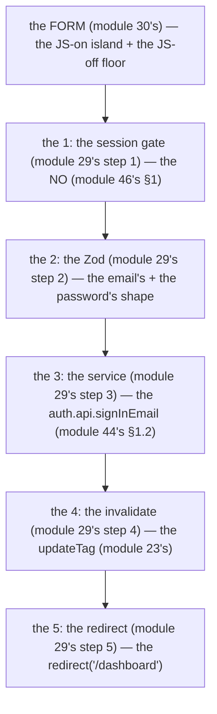

# Module 46 — Core Flows: Login, Register, Logout, Reset, Verify, MFA

**Phase 10: Authentication · Module 46 of 101**

> **Where does this run?** Every flow is **`[SERVER]`** for the *truth* (the credential check, the session row, the token) and **`[BOTH / BOUNDARY]`** for the *form* (the module-30's progressive enhancement: the JS-on island + the JS-off floor). The module-46's standing rule: **the flow is the module-29's 5-step** (the session gate → the Zod → the service → the invalidate → the `redirect`) — adapted: login has *no* session gate (the user is *not* authenticated yet) but has *all* the other steps (module 46's §1).

---

## 1. Concept — The flow is the 5-step (adapted)

**The 5-step, adapted** (module 29's pattern, module 46's §1): the *the session gate* (module 29's step 1) — the *login's* *no* (module 46's §1: the *the user is the *not* authenticated* (module 46's §1)) — the *the Zod* (module 29's step 2) — the *the service* (module 29's step 3) — the *the invalidate* (module 29's step 4) — the *the `redirect`* (module 29's step 5) — the *module-46's line: the flow is the 5-step* (module 29's) — the *the login's no session gate* (module 46's §1).

**The 6 flows** (module 46's §1.1): the *the login* (module 46's §2) — the *the register* (module 46's §3) — the *the logout* (module 46's §4) — the *the password reset* (module 46's §5) — the *the email verification* (module 46's §6) — the *the MFA* (module 46's §7) — the *module-46's line: the 6 flows are the login/register/logout/reset/verify/MFA* (module 46's §1.1).

**The 2 implementations** (module 46's §1.2): the *the client's* (the `authClient` — module 44's §3.5) — the *the server's* (the `auth.api` + the `nextCookies` — module 44's §3.2) — the *module-46's line: the 2 implementations are the client's + the server's* (module 46's §1.2) — the *the JS-on is the client's* (module 46's §1.2) — the *the JS-off is the server's* (module 46's §1.2).

## 2. Mental Model — The login (the 5-step, drawn)



**The 5-step, adapted** (the module-46's mental model):
1. **The session gate** (module 29's step 1): the *the NO* (module 46's §1) — the *the user is the *not* authenticated* (module 46's §1).
2. **The Zod** (module 29's step 2): the *the email's + the password's shape* (module 46's §2).
3. **The service** (module 29's step 3): the *the `auth.api.signInEmail`* (module 44's §1.2).
4. **The invalidate** (module 29's step 4): the *the `updateTag`* (module 23's).
5. **The redirect** (module 29's step 5): the *the `redirect('/dashboard')`* (module 46's §2).

## 3. Architecture — The login (the 2 implementations, the code)

### 3.1 The server's login (module 46's §3.1 — the `auth.api.signInEmail` + the `nextCookies`)

`FILE: src/app/(auth)/login/actions.ts` (production pattern — [SERVER] — the module-46's §3.1: the JS-off floor's login)

```ts
// THE SERVER'S LOGIN (module 46's §3.1 — the 5-step (module 29's) — the the nextCookies (module 44's §3.2)):
'use server'
import { z } from 'zod'
import { redirect } from 'next/navigation'
import { auth } from '@/auth'
import { AppError } from '@/lib/errors'
import { updateTag } from 'next/cache'

const loginSchema = z.object({
  email: z.string().email(),              // the module-29's step 2 (module 29's) — the shape (module 29's)
  password: z.string().min(8),            // the module-29's step 2 (module 29's) — the shape (module 29's)
})

export async function login(formData: FormData) {
  // THE 2: THE ZOD (module 29's step 2) — the shape (module 29's):
  const parsed = loginSchema.safeParse({
    email: formData.get('email'),
    password: formData.get('password'),
  })
  if (!parsed.success) {
    throw new AppError({ status: 422, code: 'login.invalid', message: 'Invalid credentials', fieldErrors: parsed.error.flatten().fieldErrors })   // the module-29's step 2 (module 29's)
  }
  // THE 3: THE SERVICE (module 29's step 3) — the auth.api.signInEmail (module 44's §1.2):
  const { error } = await auth.api.signInEmail({
    body: { email: parsed.data.email, password: parsed.data.password },   // the module-46's line: the auth.api.signInEmail is the service's (module 44's §1.2)
  })
  if (error) {
    // THE NO LEAK (module 46's §3.1): the the error's message is the GENERIC (module 46's §3.1) — the the no "email not found" (module 46's §3.1):
    throw new AppError({ status: 401, code: 'login.failed', message: 'Invalid email or password' })   // the module-46's line: the error's message is the GENERIC (module 46's §3.1)
  }
  // THE 4: THE INVALIDATE (module 29's step 4) — the updateTag (module 23's):
  updateTag('session')   // the module-23's line: the updateTag is the actor's (module 23's) — the the session's tag (module 46's §3.1)
  // THE 5: THE REDIRECT (module 29's step 5) — the redirect('/dashboard') (module 29's):
  redirect('/dashboard')   // the module-29's line: the successful form action MUST end in redirect() (module 29's)
}
```

**The module-46's line:** the *login is the 5-step* (module 29's) — the *the no session gate* (module 46's §1) — the *the `auth.api.signInEmail` is the service's* (module 44's §1.2) — the *the error's message is the GENERIC* (module 46's §3.1) — the *the `redirect` is the 5th* (module 29's).

### 3.2 The client's login (module 46's §3.2 — the `authClient.signIn.email`)

`FILE: src/app/(auth)/login/login-form.tsx` (production pattern — [CLIENT] — the module-46's §3.2: the JS-on island's login)

```tsx
// THE CLIENT'S LOGIN (module 46's §3.2 — the authClient.signIn.email (module 44's §3.5) — the the JS-on island (module 30's)):
'use client'
import { useState } from 'react'
import { authClient } from '@/lib/auth-client'
import { useRouter } from 'next/navigation'

export function LoginForm() {
  const router = useRouter()
  const [pending, setPending] = useState(false)
  const [error, setError] = useState<string | null>(null)

  async function onSubmit(e: React.FormEvent<HTMLFormElement>) {
    e.preventDefault()   // the module-30's line: the JS-on's preventDefault (module 30's)
    setPending(true); setError(null)
    const form = new FormData(e.currentTarget)
    const { error: authError } = await authClient.signIn.email({
      email: String(form.get('email')),       // the module-46's line: the authClient.signIn.email is the client's (module 44's §3.5)
      password: String(form.get('password')),
    })
    setPending(false)
    if (authError) { setError('Invalid email or password'); return }   // the module-46's line: the GENERIC (module 46's §3.1)
    router.push('/dashboard')   // the module-46's line: the JS-on's redirect (module 30's)
  }

  return (
    <form action={login} onSubmit={onSubmit} noValidate>   // the module-30's line: the action is the JS-off floor (module 30's) — the onSubmit is the JS-on (module 30's)
      <input name="email" type="email" required autoComplete="email" />
      <input name="password" type="password" required autoComplete="current-password" />
      {error && <p role="alert">{error}</p>}
      <button type="submit" disabled={pending}>{pending ? 'Signing in…' : 'Sign in'}</button>
    </form>
  )
}
```

**The module-46's line:** the *login is the 2 implementations* (module 46's §1.2) — the *the JS-on is the client's* (module 46's §1.2) — the *the JS-off is the server's* (module 46's §1.2) — the *the `action={login}` is the JS-off floor* (module 30's) — the *the `onSubmit` is the JS-on* (module 30's).

## 4. Production Code — The 5 other flows (the code)

### 4.1 The register (module 46's §4.1 — the `auth.api.signUpEmail`)

`FILE: src/app/(auth)/register/actions.ts` (production pattern — [SERVER] — the module-46's §4.1)

```ts
// THE REGISTER (module 46's §4.1 — the 5-step (module 29's) — the the auth.api.signUpEmail (module 44's §1.2)):
'use server'
import { z } from 'zod'
import { redirect } from 'next/navigation'
import { auth } from '@/auth'
import { AppError } from '@/lib/errors'

const registerSchema = z.object({
  name: z.string().min(1).max(120),        // the module-29's step 2 (module 29's)
  email: z.string().email(),
  password: z.string().min(8),              // the module-46's line: the 8+ chars (module 46's §4.1) — the default (module 44's §1's)
})

export async function register(formData: FormData) {
  const parsed = registerSchema.safeParse({ name: formData.get('name'), email: formData.get('email'), password: formData.get('password') })
  if (!parsed.success) throw new AppError({ status: 422, code: 'register.invalid', message: 'Invalid input', fieldErrors: parsed.error.flatten().fieldErrors })
  const { error } = await auth.api.signUpEmail({
    body: { name: parsed.data.name, email: parsed.data.email, password: parsed.data.password },   // the module-46's line: the auth.api.signUpEmail is the service's (module 44's §1.2)
  })
  if (error) throw new AppError({ status: 401, code: 'register.failed', message: 'Could not create account' })   // the module-46's line: the GENERIC (module 46's §3.1)
  redirect('/dashboard')   // the module-29's step 5 (module 29's)
}
```

**The module-46's line:** the *register is the 5-step* (module 29's) — the *the `auth.api.signUpEmail` is the service's* (module 44's §1.2) — the *the GENERIC* (module 46's §3.1).

### 4.2 The logout (module 46's §4.2 — the `auth.api.signOut`)

`FILE: src/app/dashboard/actions.ts` (production pattern — [SERVER] — the module-46's §4.2)

```ts
// THE LOGOUT (module 46's §4.2 — the 5-step (module 29's) — the the auth.api.signOut (module 44's §1.2)):
'use server'
import { headers } from 'next/headers'
import { redirect } from 'next/navigation'
import { auth } from '@/auth'

export async function logout() {
  await auth.api.signOut({ headers: await headers() })   // the module-46's line: the auth.api.signOut is the service's (module 44's §1.2) — the the module-43's §2.4's forget (module 43's §2.4)
  redirect('/login')   // the module-29's step 5 (module 29's)
}
```

**The module-46's line:** the *logout is the 5-step* (module 29's) — the *the `auth.api.signOut` is the service's* (module 44's §1.2) — the *the module-43's §2.4's forget* (module 43's §2.4).

### 4.3 The password reset (module 46's §4.3 — the `forgetPassword` + the `resetPassword`)

`FILE: src/app/(auth)/forgot-password/actions.ts` (production pattern — [SERVER] — the module-46's §4.3)

```ts
// THE PASSWORD RESET (module 46's §4.3 — the 2 steps (module 46's §4.3) — the the forgetPassword + the resetPassword (module 44's §1.2)):
'use server'
import { z } from 'zod'
import { redirect } from 'next/navigation'
import { auth } from '@/auth'
import { AppError } from '@/lib/errors'

// THE STEP 1 (module 46's §4.3): the the forgetPassword (module 46's §4.3) — the the email's token (module 46's §4.3):
export async function forgetPassword(formData: FormData) {
  const parsed = z.object({ email: z.string().email() }).safeParse({ email: formData.get('email') })
  if (!parsed.success) throw new AppError({ status: 422, code: 'reset.invalid', message: 'Invalid email' })
  await auth.api.forgetPassword({
    body: { email: parsed.data.email, redirectTo: '/reset-password' },   // the module-46's line: the forgetPassword is the token's (module 46's §4.3)
  })
  redirect('/check-your-email')   // the module-46's line: the GENERIC (module 46's §3.1) — the the no "email not found" (module 46's §3.1)
}

// THE STEP 2 (module 46's §4.3): the the resetPassword (module 46's §4.3) — the the token's check (module 46's §4.3):
const resetSchema = z.object({
  token: z.string().min(1),             // the module-46's line: the token's (module 46's §4.3) — the the URL's query (module 46's §4.3)
  newPassword: z.string().min(8),
})

export async function resetPassword(formData: FormData) {
  const parsed = resetSchema.safeParse({ token: formData.get('token'), newPassword: formData.get('newPassword') })
  if (!parsed.success) throw new AppError({ status: 422, code: 'reset.invalid', message: 'Invalid input' })
  const { error } = await auth.api.resetPassword({
    body: { token: parsed.data.token, newPassword: parsed.data.newPassword },   // the module-46's line: the resetPassword is the token's check (module 46's §4.3)
  })
  if (error) throw new AppError({ status: 401, code: 'reset.failed', message: 'Invalid or expired token' })   // the module-46's line: the GENERIC (module 46's §3.1)
  redirect('/login')   // the module-29's step 5 (module 29's)
}
```

**The module-46's line:** the *password reset is the 2 steps* (module 46's §4.3) — the *the `forgetPassword` is the token's* (module 46's §4.3) — the *the `resetPassword` is the token's check* (module 46's §4.3) — the *the GENERIC* (module 46's §3.1).

### 4.4 The email verification (module 46's §4.4 — the `verifyEmail`)

`FILE: src/auth.ts` (production pattern — [SERVER] — the module-46's §4.4: the `requiresEmailVerification`)

```ts
// THE EMAIL VERIFICATION (module 46's §4.4 — the requiresEmailVerification (module 46's §4.4)):
export const auth = betterAuth({
  // ... (module 44's §3.2's config)
  emailAndPassword: {
    enabled: true,
    requiresEmailVerification: true,   // the module-46's line: the requiresEmailVerification is the gate (module 46's §4.4)
  },
})
```

`FILE: the verify-email's route (the GET's — [SERVER] — the module-46's §4.4)`

```ts
// THE VERIFY-EMAIL'S ROUTE (module 46's §4.4 — the the GET's (module 46's §4.4) — the the token's check (module 46's §4.4)):
// the the GET /verify-email?token=... (module 46's §4.4) — the the auth.api.verifyEmail (module 44's §1.2):
export async function GET(request: Request) {
  const { searchParams } = new URL(request.url)
  const token = searchParams.get('token')
  if (!token) return new Response('Invalid token', { status: 400 })
  const { error } = await auth.api.verifyEmail({ asResponse: true, headers: request.headers, body: { token } })   // the module-46's line: the verifyEmail is the token's check (module 46's §4.4)
  if (error) return new Response('Invalid or expired token', { status: 401 })
  return new Response('Email verified — you can sign in now.')
}
```

**The module-46's line:** the *email verification is the gate* (module 46's §4.4) — the *the `requiresEmailVerification` is the config's* (module 46's §4.4) — the *the `verifyEmail` is the token's check* (module 46's §4.4).

### 4.5 The MFA (module 46's §4.5 — the `twoFactor` plugin's TOTP)

`FILE: src/auth.ts` (production pattern — [SERVER] — the module-46's §4.5: the `twoFactor` plugin)

```ts
// THE MFA (module 46's §4.5 — the twoFactor plugin (module 46's §4.5) — the the TOTP's (module 46's §7)):
import { twoFactor } from 'better-auth/plugins'

export const auth = betterAuth({
  // ... (module 44's §3.2's config)
  appName: 'SaaS Platform',   // the module-46's line: the appName is the TOTP's issuer (module 46's §4.5)
  plugins: [twoFactor(), nextCookies()],   // the module-46's line: the twoFactor is the MFA's (module 46's §4.5) — the the nextCookies is the LAST (module 44's §3.2)
})
```

`FILE: src/lib/auth-client.ts` (production pattern — [CLIENT] — the module-46's §4.5: the `twoFactorClient`)

```ts
// THE MFA'S CLIENT (module 46's §4.5 — the twoFactorClient (module 46's §4.5)):
import { createAuthClient } from 'better-auth/react'
import { twoFactorClient } from 'better-auth/client/plugins'

export const authClient = createAuthClient({
  plugins: [twoFactorClient({
    onTwoFactorRedirect({ twoFactorMethods }) {   // the module-46's line: the onTwoFactorRedirect is the 2FA's UI (module 46's §7)
      // the the twoFactorMethods is the ["totp"] / the ["totp", "otp"] (module 46's §7)
    },
  })],
})
```

**The module-46's line:** the *MFA is the `twoFactor` plugin* (module 46's §4.5) — the *the `appName` is the TOTP's issuer* (module 46's §4.5) — the *the `twoFactorClient` is the client's* (module 46's §4.5) — the *the `onTwoFactorRedirect` is the 2FA's UI* (module 46's §7).

## 5. Common Mistakes (the flow failures)

| Mistake | The symptom | Fix |
|---|---|---|
| **The no `nextCookies`** (module 44's §3.2's line violated) | the *module-44's line: the `nextCookies` is the server action's cookie* (module 44's §3.2) — the *the no `nextCookies` is the *no cookie in the server action* (module 44's §3.2) — the *module-46's line: the `nextCookies` is the server action's cookie* (module 44's §3.2) — the *no cookie in the server action* (module 44's §3.2)* | the *the `nextCookies()` plugin* (module 44's §3.2) — the *module-44's line: the `nextCookies` is the server action's cookie* (module 44's §3.2)* |
| **The error's leak** (module 46's §3.1's line violated) | the *module-46's line: the error's message is the GENERIC* (module 46's §3.1) — the *the error's leak is the *user enumeration* (module 46's §3.1) — the *module-19-02's user enumeration* (module 75's) — the *module-46's line: the error's message is the GENERIC* (module 46's §3.1) — the *no error's leak* (module 46's §3.1)* | the *the GENERIC's message* (module 46's §3.1) — the *module-46's line: the error's message is the GENERIC* (module 46's §3.1)* |
| **The no `redirect`** (module 29's step 5's line violated) | the *module-29's line: the successful form action MUST end in `redirect()`* (module 29's) — the *the no `redirect` is the *the form's re-render* (module 29's) — the *module-46's line: the `redirect` is the 5th* (module 29's) — the *no form's re-render* (module 29's)* | the *the `redirect('/dashboard')`* (module 29's) — the *module-29's line: the successful form action MUST end in `redirect()`* (module 29's)* |
| **The JS-on only** (module 30's line violated: the no JS-off floor) | the *module-30's line: the JS-off floor is the 303* (module 30's) — the *the JS-on only is the *no JS-off* (module 30's) — the *module-46's line: the JS-off is the server's* (module 46's §1.2) — the *no JS-off* (module 30's)* | the *the `action={login}`* (module 30's) — the *module-30's line: the JS-off floor is the 303* (module 30's)* |
| **The no `requiresEmailVerification`** (module 46's §4.4's line violated) | the *module-46's line: the `requiresEmailVerification` is the gate* (module 46's §4.4) — the *the no `requiresEmailVerification` is the *no verification* (module 46's §4.4) — the *module-46's line: the `requiresEmailVerification` is the gate* (module 46's §4.4) — the *no verification* (module 46's §4.4)* | the *the `requiresEmailVerification: true`* (module 46's §4.4) — the *module-46's line: the `requiresEmailVerification` is the gate* (module 46's §4.4)* |
| **The MFA's no** (module 46's §4.5's line violated: the no `twoFactor`) | the *module-46's line: the MFA is the `twoFactor` plugin* (module 46's §4.5) — the *the no MFA is the *no 2FA* (module 46's §4.5) — the *module-46's line: the MFA is the `twoFactor` plugin* (module 46's §4.5) — the *no 2FA* (module 46's §4.5)* | the *the `twoFactor()` plugin* (module 46's §4.5) — the *module-46's line: the MFA is the `twoFactor` plugin* (module 46's §4.5)* |
| **The 2FA's session's read** (module 46's §7's line violated: the `newSession`'s null) | the *module-46's line: the 2FA's session's read is the *null-check* (module 46's §7) — the *the no null-check is the *the 2FA's crash* (module 46's §7) — the *module-46's line: the 2FA's session's read is the null-check* (module 46's §7) — the *no 2FA's crash* (module 46's §7)* | the *the `newSession`'s null-check* (module 46's §7) — the *module-46's line: the 2FA's session's read is the null-check* (module 46's §7)* |

## 6. Security Notes

- **The error's message is the GENERIC** (module 46's §3.1): the *module-46's line: the error's message is the GENERIC* (module 46's §3.1) — the *module-19-02's user enumeration* (module 75's) — the *the no "email not found"* (module 46's §3.1).
- **The password reset's token is the single-use** (module 46's §4.3): the *module-46's line: the token is the single-use* (module 46's §4.3) — the *module-19-02's token's* (module 75's) — the *the no token's reuse* (module 46's §4.3).
- **The MFA's TOTP is the 2nd factor** (module 46's §7): the *module-46's line: the TOTP is the 2nd factor* (module 46's §7) — the *module-19-02's 2FA's* (module 75's) — the *the no 2FA's* (module 46's §7).
- **The email verification is the gate** (module 46's §4.4): the *module-46's line: the `requiresEmailVerification` is the gate* (module 46's §4.4) — the *the no verification is the *the spoof's email* (module 46's §4.4) — the *module-19-02's email spoof* (module 75's)*.
- **The `trustedOrigins` is the CSRF's** (module 44's §6.2): the *module-44's line: the `trustedOrigins` is the CSRF's* (module 44's §6.2) — the *module-45's* *the CSRF's* (module 45's).
- **The revocation is the incident's** (module 43's §2.5): the *module-43's line: the revoke is the no-logout logout* (module 43's §2.5) — the *module-45's line: the revocation is the 2 APIs* (module 45's §4.2).

## 7. Performance Notes

- **The 2FA's challenge is the no-session's** (module 46's §7.1): the *module-46's line: the 2FA's challenge is the no-session's* (module 46's §7.1) — the *the `newSession` is the null* (module 46's §7.1) — the *module-22's* *the TTFB's* (module 22's).
- **The password reset's email is the async's** (module 46's §4.3): the *module-46's line: the email is the async's* (module 46's §4.3) — the *module-23-04's* *the job's* (module 23-04's) — the *module-23-04's* *deep-dive* (module 23-04's).
- **The session lookup is the per-request** (module 43's §2.2): the *module-43's line: the session lookup is the per-request* (module 43's §2.2) — the *module-20's* *deep-dive* (module 20's).

## 8. Exercise

**Beginner.** *The login* (module 46's §3): the *the server's login* (module 3.1's) + the *the client's login* (module 3.2's) — *build it* — the *the login's log* (module 20's) — the *artifact: the 2 logins + the log* (module 20's).

**Intermediate.** *The 5 other flows* (module 46's §4): the *the register* (module 4.1's) + the *the logout* (module 4.2's) + the *the password reset* (module 4.3's) + the *the email verification* (module 4.4's) — the *artifact: the 5 flows' logs* (module 20's).

**Production.** *The MFA* (module 46's §4.5 + §7): the *the `twoFactor` plugin* (module 4.5's) + the *the `twoFactorClient`* (module 4.5's) + the *the TOTP's enroll* (module 7's) — the *artifact: the MFA's log + the TOTP's QR* (module 20's).

## 9. Architecture Challenge

**Prompt:** The *"the partner asks for the SSO's 2FA: the Google's OAuth + the TOTP's MFA"* (the *module-44's* *social's* — the *module-46's* *MFA's* — the *module-44's line: the `socialProviders` is the SSO's* (module 44's §9) — the *module-46's line: the MFA is the `twoFactor` plugin* (module 46's §4.5) — the *module-46's standing line: the SSO is the social's + the MFA is the twoFactor's* (module 44's §9 + module 46's §4.5)).

The *problems*: (1) the *the SSO's* (the *the `socialProviders`* (module 44's §9) — the *module-44's line: the `socialProviders` is the SSO's* (module 44's §9) — the *module-46's standing line: the SSO is the social's* (module 44's §9)).

(2) the *the MFA's* (the *the `twoFactor` plugin* (module 46's §4.5) — the *module-46's line: the MFA is the `twoFactor` plugin* (module 46's §4.5) — the *module-46's standing line: the MFA is the twoFactor's* (module 46's §4.5)).

**Design**: the *the combination* (the *the `socialProviders`* (module 44's §9) + the *the `twoFactor` plugin* (module 46's §4.5) + the *the no re-learn* (module 44's §1) — the *module-46's line: the SSO is the social's + the MFA is the twoFactor's* (module 44's §9 + module 46's §4.5) — the *module-46's standing line: the SSO is the social's + the MFA is the twoFactor's + the no re-learn* (module 44's §9 + module 46's §4.5 + module 44's §1)).

Produce: the *the combination* (the *the `socialProviders`* (module 44's §9) + the *the `twoFactor` plugin* (module 46's §4.5) + the *the no re-learn* (module 44's §1) — the *module-46's line: the SSO is the social's + the MFA is the twoFactor's* (module 44's §9 + module 46's §4.5) — the *module-46's standing line: the SSO is the social's + the MFA is the twoFactor's + the no re-learn* (module 44's §9 + module 46's §4.5 + module 44's §1)).

<details>
<summary>Model answer</summary>
**The combination** (module 44's §9 + module 46's §4.5 + module 44's §1):
1. **The SSO's** (module 44's §9): the *the `socialProviders`* (module 44's §9) — the *module-44's line: the `socialProviders` is the SSO's* (module 44's §9).
2. **The MFA's** (module 46's §4.5): the *the `twoFactor` plugin* (module 46's §4.5) — the *module-46's line: the MFA is the `twoFactor` plugin* (module 46's §4.5).
**The generalization** (the *combination's* pattern, the *module's* standing rule): **the *SSO is the social's* (module 44's §9) — the *the MFA is the twoFactor's* (module 46's §4.5) — the *the no re-learn* (module 44's §1) — the *module-46's standing line: the SSO is the social's + the MFA is the twoFactor's + the no re-learn* (module 44's §9 + module 46's §4.5 + module 44's §1)*.
</details>

## 10. Official Documentation

- Better Auth: Basic usage: https://www.better-auth.com/docs/basic-usage
- Better Auth: Two-Factor Authentication (2FA): https://www.better-auth.com/docs/plugins/2fa
- Better Auth: Email verification: https://www.better-auth.com/docs/concepts/email-verification
- Better Auth: Password reset: https://www.better-auth.com/docs/concepts/password-reset
- The Next.js Authentication guide: https://nextjs.org/docs/app/guides/authentication
- The module-44's setup: the module-44 (the phase-10's file-02)

## 11. What You Should Know Before Continuing

- [ ] I can state the *flow is the 5-step* (module 1's: the 5-step, adapted) — the *the login's no session gate* (module 1's line)
- [ ] I know the *2 implementations* (module 1.2's: the client's + the server's) — the *the JS-on is the client's* (module 1.2's) — the *the JS-off is the server's* (module 1.2's)
- [ ] I know the *login is the 5-step* (module 3's) — the *the `auth.api.signInEmail` is the service's* (module 3.1's) — the *the `nextCookies` is the server action's cookie* (module 44's §3.2)
- [ ] I know the *5 other flows* (module 4's: the register/logout/reset/verify/MFA) — the *the GENERIC's message* (module 3.1's)
- [ ] I know the *MFA is the `twoFactor` plugin* (module 4.5's) — the *the `appName` is the TOTP's issuer* (module 4.5's) — the *the `twoFactorClient` is the client's* (module 4.5's)
- [ ] I know the *error's message is the GENERIC* (module 3.1's) — the *the no error's leak* (module 3.1's)
- [ ] I've done the *login* (module 8's beginner) + the *5 other flows* (module 8's intermediate) + the *MFA* (module 8's production) — the *artifacts* (module 20's)

**Next:** Module 47 — Auth with Cache Components (the *the `use cache: private`* — the *the session's read is the request-time* — the *the `use cache`'s derived's* — the *module-47's line: the session is the `use cache: private`* (module 47's)).
