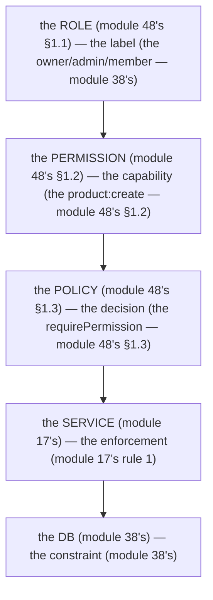

# Module 48 — RBAC: Roles Are Labels, Permissions Are Capabilities, Policies Are Decisions

**Phase 11: Authorization & RBAC · Module 48 of 101**

> **Where does this run?** The RBAC check is **`[SERVER]`** (the service, module 17's rule 1 — the authZ gate, module 02's two-gate model). The *role* is a **`[SERVER]`** fact (the `memberships` row, module 38's schema); the *UI affordance* is **`[CLIENT]`** (a signal, never enforcement, module 50's). The module-48's standing rule (module 02's two-gate model, now implemented): **authN (401, module 43-47) is the first gate — authZ (403, module 48) is the second gate — the UI hides, the service enforces** (module 48's §1).

---

## 1. Concept — The 3 nouns (the label, the capability, the decision)

**The role** (module 48's §1.1): the *the label* (module 48's §1.1) — the *the `owner`/`admin`/`member`* (module 38's `membershipRoleEnum`) — the *module-48's line: the role is the label* (module 48's §1.1) — the *the no logic in the role* (module 48's §1.1).

**The permission** (module 48's §1.2): the *the capability* (module 48's §1.2) — the *the `product:create`* (module 48's §1.2) — the *module-48's line: the permission is the capability* (module 48's §1.2) — the *the no permission in the UI* (module 48's §1.2).

**The policy** (module 48's §1.3): the *the decision* (module 48's §1.3) — the *the `requirePermission`* (module 48's §1.3) — the *module-48's line: the policy is the decision* (module 48's §1.3) — the *the no policy in the client* (module 48's §1.3).

**The 2-gate model** (module 02's, module 48's §1.4): the *the authN (the 401) is the first gate* (module 43-47's) — the *the authZ (the 403) is the second gate* (module 48's) — the *module-48's line: the authN is the first, the authZ is the second* (module 02's) — the *module-02's line: the 2 gates are the authN + the authZ* (module 02's).

## 2. Mental Model — The role → permission → policy (drawn)



**The 4 steps** (the module-48's mental model):
1. **The role** (module 48's §1.1): the *the label* — the *module-48's line: the role is the label* (module 48's §1.1).
2. **The permission** (module 48's §1.2): the *the capability* — the *module-48's line: the permission is the capability* (module 48's §1.2).
3. **The policy** (module 48's §1.3): the *the decision* — the *module-48's line: the policy is the decision* (module 48's §1.3).
4. **The enforcement** (module 17's rule 1): the *the service* — the *module-48's line: the enforcement is the service's* (module 17's rule 1).

## 3. Architecture — The RBAC (the code)

### 3.1 The permission map (module 48's §3.1 — the `PERMISSIONS` constant)

`FILE: src/lib/rbac.ts` (production pattern — [SERVER] — the module-48's §3.1: the role → permission's map)

```ts
// THE PERMISSION MAP (module 48's §3.1 — the role → permission's map (module 48's §3.1)):
import 'server-only'

// THE PERMISSIONS (module 48's §3.1): the the capability's set (module 48's §1.2):
export const PERMISSIONS = {
  'product:read': true,      // the module-48's line: the product's read (module 48's §3.1)
  'product:create': true,    // the module-48's line: the product's create (module 48's §3.1)
  'product:update': true,    // the module-48's line: the product's update (module 48's §3.1)
  'product:delete': true,    // the module-48's line: the product's delete (module 48's §3.1)
  'order:read': true,        // the module-48's line: the order's read (module 48's §3.1)
  'order:cancel': true,      // the module-48's line: the order's cancel (module 48's §3.1)
  'member:invite': true,     // the module-48's line: the member's invite (module 48's §3.1)
  'member:remove': true,     // the module-48's line: the member's remove (module 48's §3.1)
  'apikey:create': true,     // the module-48's line: the apikey's create (module 48's §3.1)
  'apikey:revoke': true,     // the module-48's line: the apikey's revoke (module 48's §3.1)
  'org:settings': true,      // the module-48's line: the org's settings (module 48's §3.1)
  'org:delete': true,        // the module-48's line: the org's delete (module 48's §3.1)
} as const
export type Permission = keyof typeof PERMISSIONS   // the module-04's line: the type is the constant's (module 04's)

// THE ROLE → PERMISSION'S MAP (module 48's §3.1): the the label's → the capability's (module 48's §1.1 → module 48's §1.2):
const ROLE_PERMISSIONS: Record<string, Permission[]> = {
  owner: Object.keys(PERMISSIONS) as Permission[],   // the module-48's line: the owner is the all (module 48's §3.1)
  admin: ['product:read','product:create','product:update','product:delete','order:read','order:cancel','member:invite','member:remove','apikey:create','apikey:revoke','org:settings'],   // the module-48's line: the admin is the no org:delete (module 48's §3.1)
  member: ['product:read','order:read'],             // the module-48's line: the member is the read-only (module 48's §3.1)
}   // the module-48's line: the role's → the permission's map is the policy's (module 48's §1.3)
```

**The module-48's line:** the *permission map is the capability's set* (module 48's §3.1) — the *role → permission is the policy's* (module 48's §1.3) — the *the owner is the all* (module 48's §3.1) — the *the admin is the no org:delete* (module 48's §3.1) — the *the member is the read-only* (module 48's §3.1).

### 3.2 The role lookup (module 48's §3.2 — the `getRole`)

`FILE: src/lib/rbac.ts` (production pattern — [SERVER] — the module-48's §3.2: the `getRole`, the membership's read)

```ts
// THE ROLE LOOKUP (module 48's §3.2 — the getRole (module 48's §3.2) — the the membership's read (module 38's)):
import { db } from '@/db'
import { memberships } from '@/db/schema'
import { eq, and } from 'drizzle-orm'

export type Role = 'owner' | 'admin' | 'member'   // the module-38's membershipRoleEnum (module 38's)

export async function getRole(userId: string, orgId: string): Promise<Role | null> {
  // THE TENANCY'S SCOPE (module 17's rule 1): the the (user, org) is the composite (module 38's) — the the no unscoped (module 17's rule 1):
  const row = await db.query.memberships.findFirst({
    where: and(eq(memberships.userId, userId), eq(memberships.orgId, orgId)),   // the module-48's line: the (user, org) is the composite (module 38's)
  })
  return row ? row.role : null   // the module-48's line: the no membership is the null (module 48's §3.2) — the the 403's (module 50's)
}
```

**The module-48's line:** the *role lookup is the membership's read* (module 48's §3.2) — the *the (user, org) is the composite* (module 38's) — the *the no membership is the null* (module 48's §3.2) — the *the 403's* (module 50's).

### 3.3 The policy check (module 48's §3.3 — the `requirePermission`)

`FILE: src/lib/rbac.ts` (production pattern — [SERVER] — the module-48's §3.3: the `requirePermission`, the 403's)

```ts
// THE POLICY CHECK (module 48's §3.3 — the requirePermission (module 48's §3.3) — the the 403's (module 50's)):
import { AppError } from '@/lib/errors'   // the module-19's AppError (module 19's)

export async function requirePermission(userId: string, orgId: string, permission: Permission) {
  const role = await getRole(userId, orgId)   // the module-48's §3.2 (module 48's §3.2)
  if (!role) throw new AppError({ status: 403, code: 'authz.no_membership', message: 'Not a member of this organization' })   // the module-50's line: the 403 is the authZ's (module 50's)
  if (!ROLE_PERMISSIONS[role]?.includes(permission)) {
    throw new AppError({ status: 403, code: 'authz.forbidden', message: `Requires ${permission}` })   // the module-50's line: the 403 is the authZ's (module 50's)
  }
  // THE AUDIT (module 17's): the the permission's grant (module 17's audit's) — the the no audit's (module 48's §3.3):
  // (the module-17's audit_events' insert (module 17's) — the the action's 'authz.granted' (module 17's))
}
```

**The module-48's line:** the *policy check is the `requirePermission`* (module 48's §3.3) — the *the 403 is the authZ's* (module 50's) — the *the no membership is the 403* (module 48's §3.2) — the *the no permission is the 403* (module 48's §3.3).

### 3.4 The service's use (module 48's §3.4 — the enforcement)

`FILE: src/services/products.ts` (production pattern — [SERVER] — the module-48's §3.4: the service's `requirePermission`)

```ts
// THE SERVICE'S USE (module 48's §3.4 — the enforcement (module 17's rule 1) — the the module-48's line: the enforcement is the service's (module 17's rule 1)):
import { requirePermission } from '@/lib/rbac'

export async function createProduct(session: { userId: string }, orgId: string, input: CreateProductInput) {
  // THE 2nd STEP (module 29's 5-step, module 48's): the the authZ's gate (module 48's §3.3) — the the no unscoped (module 17's rule 1):
  await requirePermission(session.userId, orgId, 'product:create')   // the module-48's line: the enforcement is the service's (module 17's rule 1) — the the 403's (module 50's)
  // ... (module 17's service's logic — the the tenancy's scope (module 17's rule 1))
}
```

**The module-48's line:** the *service's use is the enforcement* (module 48's §3.4) — the *the 2nd step is the authZ's gate* (module 48's §3.3) — the *the no unscoped* (module 17's rule 1).

## 4. Production Code — The UI affordance (the signal, not the enforcement)

`FILE: src/components/product-actions.tsx` (production pattern — [CLIENT] — the module-48's §4: the affordance's hide)

```tsx
// THE UI AFFORDANCE (module 48's §4 — the signal (module 50's) — the the no enforcement (module 50's)):
'use client'
// THE HIDE (module 48's §4): the the no permission is the no button (module 48's §4) — the the no 403's UX (module 50's):
export function ProductActions({ canEdit, canDelete }: { canEdit: boolean; canDelete: boolean }) {
  return (
    <div>
      {canEdit && <button>Edit</button>}   // the module-48's line: the no permission is the no button (module 48's §4)
      {canDelete && <button>Delete</button>}   // the module-48's line: the no permission is the no button (module 48's §4)
    </div>
  )
}
```

**The module-48's line:** the *affordance is the signal* (module 50's) — the *the no permission is the no button* (module 48's §4) — the *the no enforcement* (module 50's).

## 5. Common Mistakes (the RBAC failures)

| Mistake | The symptom | Fix |
|---|---|---|
| **The role in the UI** (module 48's §1.1's line violated) | the *module-48's line: the role is the label* (module 48's §1.1) — the *the role in the UI is the *spoof* (module 48's §1.1) — the *module-19-02's spoof* (module 75's) — the *module-48's line: the role is the label* (module 48's §1.1) — the *no role in the UI* (module 48's §1.1)* | the *the service's `getRole`* (module 48's §3.2) — the *module-48's line: the role is the label* (module 48's §1.1)* |
| **The permission in the client** (module 48's §1.2's line violated) | the *module-48's line: the permission is the capability* (module 48's §1.2) — the *the permission in the client is the *no* (module 48's §1.2) — the *module-48's line: the permission is the capability* (module 48's §1.2) — the *no permission in the client* (module 48's §1.2)* | the *the service's `requirePermission`* (module 48's §3.3) — the *module-48's line: the permission is the capability* (module 48's §1.2)* |
| **The no `requirePermission`** (module 48's §3.4's line violated) | the *module-48's line: the enforcement is the service's* (module 17's rule 1) — the *the no `requirePermission` is the *no authZ* (module 48's §3.4) — the *module-48's line: the enforcement is the service's* (module 17's rule 1) — the *no authZ* (module 48's §3.4)* | the *the `requirePermission`* (module 48's §3.3) — the *module-48's line: the enforcement is the service's* (module 17's rule 1)* |
| **The role's hardcode** (module 48's §3.1's line violated) | the *module-48's line: the role's → the permission's map is the policy's* (module 48's §1.3) — the *the role's hardcode is the *drift* (module 48's §3.1) — the *module-48's line: the role's → the permission's map is the policy's* (module 48's §1.3) — the *no hardcode* (module 48's §3.1)* | the *the `ROLE_PERMISSIONS`* (module 48's §3.1) — the *module-48's line: the role's → the permission's map is the policy's* (module 48's §1.3)* |
| **The global role** (module 48's §3.2's line violated: the no org's scope) | the *module-48's line: the (user, org) is the composite* (module 38's) — the *the global role is the *cross-tenant* (module 11-02's) — the *module-48's line: the (user, org) is the composite* (module 38's) — the *no global role* (module 48's §3.2)* | the *the `getRole(userId, orgId)`* (module 48's §3.2) — the *module-48's line: the (user, org) is the composite* (module 38's)* |
| **The no audit** (module 17's line violated) | the *module-17's line: the audit is the service's* (module 17's) — the *the no audit is the *no trace* (module 17's) — the *module-48's line: the audit is the service's* (module 17's) — the *no audit* (module 17's)* | the *the `audit_events`' insert* (module 17's) — the *module-17's line: the audit is the service's* (module 17's)* |
| **The 401 vs 403's confusion** (module 50's) | the *module-50's line: the 401 is the who, the 403 is the what* (module 50's) — the *module-48's line: the 401 is the who, the 403 is the what* (module 50's) — the *module-50's* *deep-dive* (module 50's)* | the *module-50's* *the 401/403* (module 50's) — the *module-50's deep-dive* (module 50's) |

## 6. Security Notes

- **The role is the server's** (module 48's §1.1): the *module-48's line: the role is the label* (module 48's §1.1) — the *module-19-02's spoof* (module 75's) — the *the no role in the UI* (module 48's §1.1).
- **The permission is the server's** (module 48's §1.2): the *module-48's line: the permission is the capability* (module 48's §1.2) — the *module-19-02's spoof* (module 75's) — the *the no permission in the client* (module 48's §1.2).
- **The 403 is the authZ's** (module 50's): the *module-50's line: the 403 is the authZ's* (module 50's) — the *module-48's line: the 403 is the authZ's* (module 50's) — the *module-50's* *deep-dive* (module 50's).
- **The audit is the service's** (module 17's): the *module-17's line: the audit is the service's* (module 17's) — the *module-48's line: the audit is the service's* (module 17's) — the *the 403's audit* (module 17's).
- **The least-privilege** (module 37's §6): the *module-37's line: the app's user is the least* (module 37's §6) — the *module-48's line: the member is the read-only* (module 48's §3.1) — the *module-37's* *deep-dive* (module 37's).
- **The no role escalation** (module 48's §6.1): the *module-48's line: the no role escalation* (module 48's §6.1) — the *module-19-02's privilege escalation* (module 75's) — the *module-48's line: the no role escalation* (module 48's §6.1).

## 7. Performance Notes

- **The role lookup is the per-request** (module 48's §7.1): the *module-48's line: the role lookup is the per-request* (module 48's §7.1) — the *module-20's* *the cache's* (module 20's) — the *module-20's* *deep-dive* (module 20's).
- **The `use cache: private` is the session's** (module 47's): the *module-47's line: the `use cache: private` is the session's* (module 47's) — the *module-48's line: the role's read is the session's read* (module 47's) — the *module-47's* *deep-dive* (module 47's).
- **The N+1's role** (module 39's): the *module-39's line: the N+1 is the topology's* (module 39's) — the *module-48's line: the role's N+1 is the list's* (module 39's) — the *module-39's* *deep-dive* (module 39's).

## 8. Exercise

**Beginner.** *The permission map* (module 48's §3.1): the *the `PERMISSIONS`* (module 3.1's) + the *the `ROLE_PERMISSIONS`* (module 3.1's) — *build it* — the *artifact: the 2 constants* (module 20's).

**Intermediate.** *The policy check* (module 48's §3.2–3.4): the *the `getRole`* (module 3.2's) + the *the `requirePermission`* (module 3.3's) + the *the service's use* (module 3.4's) — the *artifact: the 3 functions + the service's log* (module 20's).

**Production.** *The audit + the UI* (module 48's §4 + module 17's): the *the `audit_events`' insert* (module 17's) + the *the affordance's hide* (module 4's) — the *artifact: the audit's log + the UI's hide* (module 20's).

## 9. Architecture Challenge

**Prompt:** The *"the team wants to add a 'billing' role: the no product's, the no order's, the only the invoice's"* (the *module-48's* *role's* — the *module-48's* *permission's* — the *module-48's line: the role is the label* (module 48's §1.1) — the *module-48's line: the permission is the capability* (module 48's §1.2) — the *module-48's standing line: the role is the label + the permission is the capability* (module 48's §1.1 + module 48's §1.2)).

The *problems*: (1) the *the role's label* (the *the `billing`* (module 48's §9) — the *module-48's line: the role is the label* (module 48's §1.1) — the *module-48's standing line: the role is the label* (module 48's §1.1)).

(2) the *the permission's capability* (the *the `invoice:read`* (module 48's §9) — the *module-48's line: the permission is the capability* (module 48's §1.2) — the *module-48's standing line: the permission is the capability* (module 48's §1.2)).

**Design**: the *the addition* (the *the `billing` role* (module 48's §9) + the *the `invoice:read` permission* (module 48's §9) + the *the no re-learn* (module 48's §1) — the *module-48's line: the role is the label + the permission is the capability* (module 48's §1.1 + module 48's §1.2) — the *module-48's standing line: the role is the label + the permission is the capability + the no re-learn* (module 48's §1.1 + module 48's §1.2 + module 48's §1)).

Produce: the *the addition* (the *the `billing` role* (module 48's §9) + the *the `invoice:read` permission* (module 48's §9) + the *the no re-learn* (module 48's §1) — the *module-48's line: the role is the label + the permission is the capability* (module 48's §1.1 + module 48's §1.2) — the *module-48's standing line: the role is the label + the permission is the capability + the no re-learn* (module 48's §1.1 + module 48's §1.2 + module 48's §1)).

<details>
<summary>Model answer</summary>
**The addition** (module 48's §9):
1. **The role's label** (module 48's §1.1): the *the `billing`* (module 48's §9) — the *module-48's line: the role is the label* (module 48's §1.1).
2. **The permission's capability** (module 48's §1.2): the *the `invoice:read`* (module 48's §9) — the *module-48's line: the permission is the capability* (module 48's §1.2).
**The generalization** (the *addition's* pattern, the *module's* standing rule): **the *role is the label* (module 48's §1.1) — the *the permission is the capability* (module 48's §1.2) — the *the no re-learn* (module 48's §1) — the *module-48's standing line: the role is the label + the permission is the capability + the no re-learn* (module 48's §1.1 + module 48's §1.2 + module 48's §1)*.
</details>

## 10. Official Documentation

- The OWASP Access Control Cheat Sheet: https://cheatsheetseries.owasp.org/cheatsheets/Access_Control_Cheat_Sheet.html
- Better Auth: Organization plugin (the module-49's): https://www.better-auth.com/docs/plugins/organization
- The module-02's two-gate model: the module-02 (the 00-overview's file-02)
- The module-50's 401/403: the module-50 (the phase-11's file-03)

## 11. What You Should Know Before Continuing

- [ ] I can state the *3 nouns* (module 1's: the role/permission/policy) — the *the role is the label, the permission is the capability, the policy is the decision* (module 1's line)
- [ ] I know the *permission map* (module 3.1's: the `PERMISSIONS` + the `ROLE_PERMISSIONS`) — the *the owner is the all, the admin is the no org:delete, the member is the read-only* (module 3.1's line)
- [ ] I know the *role lookup is the membership's read* (module 3.2's) — the *the (user, org) is the composite* (module 38's) — the *the no membership is the null* (module 3.2's)
- [ ] I know the *policy check is the `requirePermission`* (module 3.3's) — the *the 403 is the authZ's* (module 50's)
- [ ] I know the *affordance is the signal* (module 50's) — the *the no permission is the no button* (module 4's) — the *the no enforcement* (module 50's)
- [ ] I know the *401 is the who, the 403 is the what* (module 50's) — the *module-50's deep-dive* (module 50's)
- [ ] I've done the *permission map* (module 8's beginner) + the *policy check* (module 8's intermediate) + the *audit + the UI* (module 8's production) — the *artifacts* (module 20's)

**Next:** Module 49 — Multi-tenancy (the *the org's* *membership's* *role's* — the *the cross-tenant's* *prevention* — the *module-49's line: the tenancy is the org's* (module 49's)).
