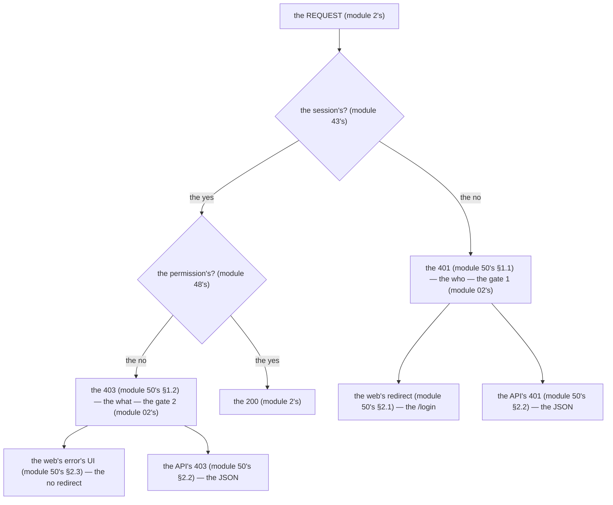

# Module 50 — Boundaries: 401 Is the Who, 403 Is the What (and the UI Hides, the Server Enforces)

**Phase 11: Authorization & RBAC · Module 50 of 101**

> **Where does this run?** The *decision* is **`[SERVER]`** (the service, module 48's/49's); the *code* is a **`[BOTH / BOUNDARY]`** (the server sends it, the client acts on it — the redirect or the error UI). This module is the **anchor for `module 11-03`** — the 401-vs-403 line every other module cites (module 29's action matrix, module 33's API-key mismatch, module 49's no-leak 404). The module-50's standing rule (module 02's two-gate model, stated as HTTP): **401 = you are not who you claim (authN, gate 1) — 403 = you are who you are, and you may not do that (authZ, gate 2) — the UI hides affordances, the service enforces, and the code is the floor** (module 50's §1).

---

## 1. Concept — The 2 codes (the who, the what)

**The 401** (module 50's §1.1): the *the who* (module 50's §1.1) — the *the no valid session* (module 43's) — the *module-50's line: the 401 is the who* (module 50's §1.1) — the *module-02's line: the authN is the first gate* (module 02's).

**The 403** (module 50's §1.2): the *the what* (module 50's §1.2) — the *the valid session, the no permission* (module 48's) — the *module-50's line: the 403 is the what* (module 50's §1.2) — the *module-02's line: the authZ is the second gate* (module 02's).

**The 404's no-leak** (module 50's §1.3): the *the capstone's choice* (module 49's §4) — the *the cross-tenant's resource is the 404* (module 50's §1.3) — the *module-50's line: the 404 is the no leak* (module 50's §1.3) — the *module-19-02's IDOR* (module 75's) — the *the no 403's leak* (module 50's §1.3).

**The UI's hide** (module 50's §1.4): the *the affordance's hide* (module 48's §4) — the *module-50's line: the UI hides, the server enforces* (module 50's §1.4) — the *module-48's line: the affordance is the signal* (module 48's §4) — the *module-50's line: the code is the floor* (module 50's §1.4).

## 2. Mental Model — The decision's table (drawn)



**The 2 gates** (the module-50's mental model):
1. **The gate 1** (module 02's): the *the session's?* — the *the 401* (module 50's §1.1).
2. **The gate 2** (module 02's): the *the permission's?* — the *the 403* (module 50's §1.2).

## 3. Architecture — The codes (the table, the code)

### 3.1 The decision's table (module 50's §3.1 — the canonical)

| The input | The web's (the HTML) | The API's (the JSON) | The module-50's line |
|---|---|---|---|
| **The no session** (module 43's) | the redirect to the /login (module 50's §2.1) | the 401 (module 50's §2.2) | the *the 401 is the who* (module 50's §1.1) |
| **The session, the no membership** (module 49's) | the 404's page (module 50's §2.3) — the no leak (module 50's §1.3) | the 404 (module 50's §1.3) — the no leak (module 50's §1.3) | the *the 404 is the no leak* (module 50's §1.3) |
| **The session, the membership, the no permission** (module 48's) | the error's UI (module 50's §2.3) — the no redirect (module 50's §2.3) | the 403 (module 50's §2.2) | the *the 403 is the what* (module 50's §1.2) |
| **The session, the membership, the permission** (module 48's) | the 200 (module 2's) | the 200 (module 2's) | the *the 200 is the ok* (module 50's §3.1) |

**The module-50's line:** the *decision's table is the 4 rows* (module 50's §3.1) — the *the 401 is the who* (module 50's §1.1) — the *the 404 is the no leak* (module 50's §1.3) — the *the 403 is the what* (module 50's §1.2).

### 3.2 The AppError's codes (module 50's §3.2 — the module-19's)

`FILE: src/lib/errors.ts` (production pattern — [SERVER] — the module-50's §3.2: the 3 codes)

```ts
// THE APPERROR'S CODES (module 50's §3.2 — the module-19's AppError (module 19's) — the the 3 codes (module 50's §3.2)):
// THE 401 (module 50's §1.1): the the authN's (module 43's) — the the code's 'authn.*' (module 50's §3.2):
//   new AppError({ status: 401, code: 'authn.required', message: 'Sign in to continue' })

// THE 403 (module 50's §1.2): the the authZ's (module 48's) — the the code's 'authz.*' (module 50's §3.2):
//   new AppError({ status: 403, code: 'authz.forbidden', message: 'You do not have permission to do that' })

// THE 404 (module 50's §1.3): the the no leak's (module 49's) — the the code's '*.not_found' (module 50's §3.2):
//   new AppError({ status: 404, code: 'org.not_found', message: 'Organization not found' })   // the module-49's §3.3 (module 49's §3.3)
```

**The module-50's line:** the *AppError's codes are the 3* (module 50's §3.2) — the *the 401 is the `authn.*`* (module 50's §3.2) — the *the 403 is the `authz.*`* (module 50's §3.2) — the *the 404 is the `*.not_found`* (module 50's §3.2).

## 4. Production Code — The 2 surfaces (the web's redirect, the API's JSON)

### 4.1 The web's redirect (module 50's §2.1 — the 401's HTML)

`FILE: proxy.ts` (production pattern — [SERVER] — the module-50's §4.1: the 401's redirect)

```ts
// THE WEB'S REDIRECT (module 50's §2.1 — the 401's HTML (module 50's §2.1) — the the proxy's (module 44's §4)):
import { NextRequest, NextResponse } from 'next/server'
import { auth } from '@/auth'

export async function proxy(request: NextRequest) {
  const session = await auth.api.getSession({ headers: request.headers })   // the module-44's §4.1 (module 44's §4.1)
  if (!session) return NextResponse.redirect(new URL('/login', request.url))   // the module-50's line: the web's 401 is the redirect (module 50's §2.1)
  return NextResponse.next()
}
```

**The module-50's line:** the *web's 401 is the redirect* (module 50's §2.1) — the *the proxy's* (module 44's §4) — the *module-44's line: the enforcement is the PAGE* (module 44's §4.2).

### 4.2 The API's JSON (module 50's §2.2 — the 401/403's envelope)

`FILE: src/lib/api-contract.ts` (production pattern — [SERVER] — the module-50's §4.2: the 401/403's JSON)

```ts
// THE API'S JSON (module 50's §2.2 — the 401/403's envelope (module 36's §2) — the the module-50's line: the API's 401 is the JSON (module 50's §2.2)):
// THE 401 (module 50's §1.1): the the authN's (module 43's):
//   apiError(new AppError({ status: 401, code: 'authn.required', message: 'Authentication required' }))   // the module-36's §2's envelope (module 36's §2)

// THE 403 (module 50's §1.2): the the authZ's (module 48's):
//   apiError(new AppError({ status: 403, code: 'authz.forbidden', message: 'Forbidden' }))   // the module-36's §2's envelope (module 36's §2)
```

**The module-50's line:** the *API's 401/403 is the JSON* (module 50's §2.2) — the *module-36's §2's envelope* (module 36's §2) — the *module-36's line: the envelope is the API's* (module 36's §2).

## 5. Common Mistakes (the code's failures)

| Mistake | The symptom | Fix |
|---|---|---|
| **The 401's what** (module 50's §1.2's line violated) | the *module-50's line: the 401 is the who* (module 50's §1.1) — the *the 401's what is the *confusion* (module 50's §1.2) — the *module-50's line: the 401 is the who* (module 50's §1.1) — the *no 401's what* (module 50's §1.2)* | the *the 403* (module 50's §1.2) — the *module-50's line: the 403 is the what* (module 50's §1.2)* |
| **The 403's who** (module 50's §1.1's line violated) | the *module-50's line: the 403 is the what* (module 50's §1.2) — the *the 403's who is the *confusion* (module 50's §1.1) — the *module-50's line: the 403 is the what* (module 50's §1.2) — the *no 403's who* (module 50's §1.1)* | the *the 401* (module 50's §1.1) — the *module-50's line: the 401 is the who* (module 50's §1.1)* |
| **The 403's leak** (module 50's §1.3's line violated) | the *module-50's line: the 404 is the no leak* (module 50's §1.3) — the *the 403's leak is the *existence* (module 50's §1.3) — the *module-50's line: the 404 is the no leak* (module 50's §1.3) — the *no 403's leak* (module 50's §1.3)* | the *the 404* (module 50's §1.3) — the *module-50's line: the 404 is the no leak* (module 50's §1.3)* |
| **The web's 403's redirect** (module 50's §2.3's line violated) | the *module-50's line: the web's 403 is the error's UI* (module 50's §2.3) — the *the web's 403's redirect is the *no* (module 50's §2.3) — the *module-50's line: the web's 403 is the error's UI* (module 50's §2.3) — the *no redirect on the 403* (module 50's §2.3)* | the *the error's UI* (module 50's §2.3) — the *module-50's line: the web's 403 is the error's UI* (module 50's §2.3)* |
| **The UI's enforcement** (module 50's §1.4's line violated) | the *module-50's line: the UI hides, the server enforces* (module 50's §1.4) — the *the UI's enforcement is the *no* (module 50's §1.4) — the *module-50's line: the UI hides, the server enforces* (module 50's §1.4) — the *no UI's enforcement* (module 50's §1.4)* | the *the service's enforcement* (module 48's §3.4) — the *module-50's line: the UI hides, the server enforces* (module 50's §1.4)* |
| **The no code** (module 50's §3.2's line violated) | the *module-50's line: the AppError's codes are the 3* (module 50's §3.2) — the *the no code is the *no trace* (module 50's §3.2) — the *module-50's line: the AppError's codes are the 3* (module 50's §3.2) — the *no code* (module 50's §3.2)* | the *the `authn.*`/`authz.*`/`*.not_found`* (module 50's §3.2) — the *module-50's line: the AppError's codes are the 3* (module 50's §3.2)* |
| **The 200's no permission** (module 48's §3.4's line violated) | the *module-48's line: the enforcement is the service's* (module 17's rule 1) — the *the 200's no permission is the *leak* (module 48's §3.4) — the *module-50's line: the 200 is the ok* (module 50's §3.1) — the *no 200's no permission* (module 48's §3.4)* | the *the `requirePermission`* (module 48's §3.3) — the *module-48's line: the enforcement is the service's* (module 17's rule 1)* |

## 6. Security Notes

- **The 401 is the who** (module 50's §1.1): the *module-50's line: the 401 is the who* (module 50's §1.1) — the *module-19-02's authN* (module 75's) — the *module-02's line: the authN is the first gate* (module 02's).
- **The 403 is the what** (module 50's §1.2): the *module-50's line: the 403 is the what* (module 50's §1.2) — the *module-19-02's authZ* (module 75's) — the *module-02's line: the authZ is the second gate* (module 02's).
- **The 404 is the no leak** (module 50's §1.3): the *module-50's line: the 404 is the no leak* (module 50's §1.3) — the *module-19-02's IDOR* (module 75's) — the *the no 403's leak* (module 50's §1.3).
- **The UI hides, the server enforces** (module 50's §1.4): the *module-50's line: the UI hides, the server enforces* (module 50's §1.4) — the *module-19-02's spoof* (module 75's) — the *module-48's line: the affordance is the signal* (module 48's §4).
- **The audit is the 403's** (module 17's): the *module-17's line: the audit is the service's* (module 17's) — the *module-50's line: the audit is the 403's* (module 17's) — the *the 403's audit* (module 17's).
- **The least-privilege** (module 37's §6): the *module-37's line: the app's user is the least* (module 37's §6) — the *module-50's line: the least-privilege is the 403's default* (module 50's §6.1) — the *module-37's* *deep-dive* (module 37's).

## 7. Performance Notes

- **The 401's proxy is the fast** (module 44's §4.1): the *module-44's line: the full check is the DB's* (module 44's §4.1) — the *module-50's line: the 401's proxy is the fast* (module 44's §4.1) — the *module-44's* *deep-dive* (module 44's).
- **The 403's service is the slow** (module 48's §3.4): the *module-48's line: the enforcement is the service's* (module 17's rule 1) — the *module-50's line: the 403's service is the slow* (module 48's §3.4) — the *module-48's* *deep-dive* (module 48's).
- **The 404's no leak is the fast** (module 50's §7.1): the *module-50's line: the 404's no leak is the fast* (module 50's §7.1) — the *module-49's line: the 404 is the no leak* (module 50's §1.3) — the *module-49's* *deep-dive* (module 49's).

## 8. Exercise

**Beginner.** *The decision's table* (module 50's §3.1): the *the 4 rows* (module 3.1's) — the *the web's + the API's* (module 3.1's) — *build it* — the *artifact: the 4 rows' outputs* (module 20's).

**Intermediate.** *The AppError's codes* (module 50's §3.2): the *the `authn.*`* + the *the `authz.*`* + the *the `*.not_found`* (module 3.2's) — *build it* — the *artifact: the 3 codes' outputs* (module 20's).

**Production.** *The no-leak's audit* (module 50's §1.3 + module 17's): the *the 404's no leak* (module 1.3's) + the *the 403's audit* (module 17's) — the *artifact: the 404's output + the 403's audit's log* (module 20's).

## 9. Architecture Challenge

**Prompt:** The *"the partner complains: 'our mobile app gets a 403 on the /orders/:id, but the order exists'"* (the *module-50's* *403's* — the *module-49's* *cross-tenant's* — the *module-50's line: the 403 is the what* (module 50's §1.2) — the *module-49's line: the 404 is the no leak* (module 50's §1.3) — the *module-50's standing line: the 403 is the what + the 404 is the no leak* (module 50's §1.2 + module 50's §1.3)).

The *problems*: (1) the *the 403's what* (the *module-50's §1.2* (module 50's §1.2) — the *module-50's line: the 403 is the what* (module 50's §1.2) — the *module-50's standing line: the 403 is the what* (module 50's §1.2)).

(2) the *the 404's no leak* (the *module-50's §1.3* (module 50's §1.3) — the *module-50's line: the 404 is the no leak* (module 50's §1.3) — the *module-50's standing line: the 404 is the no leak* (module 50's §1.3)).

**Design**: the *the explanation* (the *the 403 is the what* (module 50's §1.2) + the *the 404 is the no leak* (module 50's §1.3) + the *the mobile's fix* (module 50's §9) — the *module-50's line: the 403 is the what + the 404 is the no leak* (module 50's §1.2 + module 50's §1.3) — the *module-50's standing line: the 403 is the what + the 404 is the no leak + the mobile's fix* (module 50's §1.2 + module 50's §1.3 + module 50's §9)).

Produce: the *the explanation* (the *the 403 is the what* (module 50's §1.2) + the *the 404 is the no leak* (module 50's §1.3) + the *the mobile's fix* (module 50's §9) — the *module-50's line: the 403 is the what + the 404 is the no leak* (module 50's §1.2 + module 50's §1.3) — the *module-50's standing line: the 403 is the what + the 404 is the no leak + the mobile's fix* (module 50's §1.2 + module 50's §1.3 + module 50's §9)).

<details>
<summary>Model answer</summary>
**The explanation** (module 50's §1.2 + module 50's §1.3 + module 50's §9):
1. **The 403 is the what** (module 50's §1.2): the *the 403 is the authZ's* (module 50's §1.2) — the *module-50's line: the 403 is the what* (module 50's §1.2).
2. **The 404 is the no leak** (module 50's §1.3): the *the 404 is the capstone's choice* (module 49's §4) — the *module-50's line: the 404 is the no leak* (module 50's §1.3).
**The generalization** (the *explanation's* pattern, the *module's* standing rule): **the *403 is the what* (module 50's §1.2) — the *the 404 is the no leak* (module 50's §1.3) — the *the mobile's fix* (module 50's §9) — the *module-50's standing line: the 403 is the what + the 404 is the no leak + the mobile's fix* (module 50's §1.2 + module 50's §1.3 + module 50's §9)*.
</details>

## 10. Official Documentation

- RFC 9110: 401 Unauthorized: https://www.rfc-editor.org/rfc/rfc9110.html#name-401-unauthorized
- RFC 9110: 403 Forbidden: https://www.rfc-editor.org/rfc/rfc9110.html#name-403-forbidden
- The OWASP Access Control Cheat Sheet: https://cheatsheetseries.owasp.org/cheatsheets/Access_Control_Cheat_Sheet.html
- The module-48's RBAC: the module-48 (the phase-11's file-01)
- The module-49's multi-tenancy: the module-49 (the phase-11's file-02)

## 11. What You Should Know Before Continuing

- [ ] I can state the *2 codes* (module 1's: the 401 is the who, the 403 is the what) — the *module-50's line: the 401 is the who, the 403 is the what* (module 1's)
- [ ] I know the *404's no-leak* (module 1.3's) — the *the capstone's choice* (module 49's §4) — the *the no 403's leak* (module 1.3's)
- [ ] I know the *decision's table* (module 3.1's: the 4 rows) — the *the web's + the API's* (module 3.1's)
- [ ] I know the *AppError's codes* (module 3.2's: the `authn.*`/`authz.*`/`*.not_found`) — the *module-19's AppError* (module 19's)
- [ ] I know the *web's 401 is the redirect* (module 2.1's) — the *the web's 403 is the error's UI* (module 2.3's) — the *the no redirect on the 403* (module 2.3's)
- [ ] I know the *UI hides, the server enforces* (module 1.4's) — the *the code is the floor* (module 1.4's)
- [ ] I've done the *decision's table* (module 8's beginner) + the *AppError's codes* (module 8's intermediate) + the *no-leak's audit* (module 8's production) — the *artifacts* (module 20's)

**Phase 11 complete.** Next: Phase 12 — Forms & Validation (module 51: the forms' deep dive — module 52: the RHF + the Zod — module 53: the server's round-trip — module 54: the advanced's forms).
