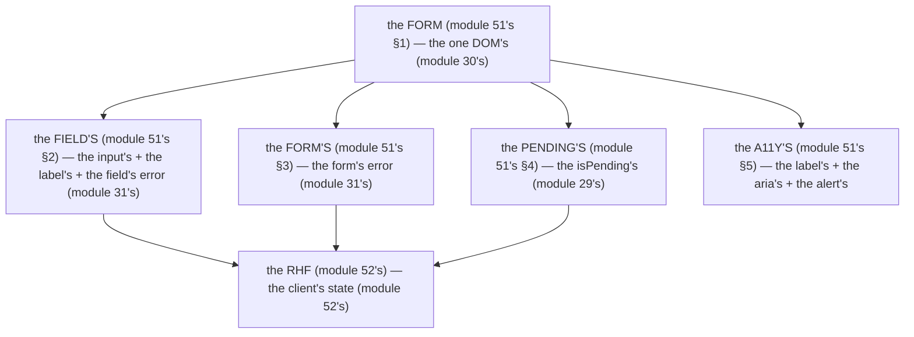

# Module 51 — Forms Deep Dive: Field Errors, Form Errors, Pending, Duplication, A11y

**Phase 12: Forms & Validation · Module 51 of 101**

> **Where does this run?** The form is **`[BOTH / BOUNDARY]`** — the *fields* are `[CLIENT]` (the input, the RHF state, module 52's), the *submission* is **`[SERVER]`** (the Server Function, module 29's), the *errors* travel **`[BOTH]`** (the `fieldErrors` DTO, module 31's). The module-51's standing rule (module 30's/31's, now the form-UX level): **the form is one DOM `<form>` with one `action` — the JS-on path is the RHF's fast path (module 52's), the JS-off path is the `action`'s floor (module 30's) — errors are the server's truth, rendered as field errors or a form error (module 31's)** (module 51's §1).

---

## 1. Concept — The form is one DOM element (the 4 concerns)

**The 4 concerns** (module 51's §1): the *the field's* (module 51's §2) — the *the form's* (module 51's §3) — the *the pending's* (module 51's §4) — the *the a11y's* (module 51's §5) — the *module-51's line: the form is the 4 concerns* (module 51's §1).

**The field's error** (module 51's §2): the *the `fieldErrors`* (module 31's) — the *module-51's line: the field's error is the `fieldErrors`* (module 31's) — the *the no form-level's* (module 51's §2) — the *module-31's line: the field's error is the field's* (module 31's).

**The form's error** (module 51's §3): the *the `formError`* (module 31's) — the *module-51's line: the form's error is the `formError`* (module 31's) — the *the no field's* (module 51's §3) — the *module-31's line: the form's error is the form's* (module 31's).

**The pending's** (module 51's §4): the *the `useActionState`'s `isPending`* (module 29's) — the *module-51's line: the pending's is the `isPending`* (module 29's) — the *the no `setTimeout`'s* (module 51's §4) — the *module-29's line: the pending's is the state's* (module 29's).

**The a11y's** (module 51's §5): the *the `<label>`'s* + the *the `aria-describedby`'s* + the *the `role="alert"`'s* (module 51's §5) — the *module-51's line: the a11y's is the 3's* (module 51's §5) — the *the no `title`'s* (module 51's §5) — the *module-51's line: the a11y's is the 3's* (module 51's §5).

## 2. Mental Model — The form's anatomy (drawn)



**The 4 concerns** (the module-51's mental model):
1. **The field's** (module 51's §2): the *the input's + the label's + the field's error* — the *module-51's line: the field's is the 3's* (module 51's §2).
2. **The form's** (module 51's §3): the *the form's error* — the *module-51's line: the form's is the error's* (module 51's §3).
3. **The pending's** (module 51's §4): the *the `isPending`* — the *module-51's line: the pending's is the `isPending`* (module 29's).
4. **The a11y's** (module 51's §5): the *the label's + the aria's + the alert's* — the *module-51's line: the a11y's is the 3's* (module 51's §5).

## 3. Architecture — The form's anatomy (the code)

### 3.1 The field (module 51's §2 — the input + the label + the error)

`FILE: src/components/field.tsx` (production pattern — [CLIENT] — the module-51's §3.1: the field's 3 parts)

```tsx
// THE FIELD (module 51's §2 — the 3 parts (module 51's §3.1) — the the input's + the label's + the error's (module 51's §3.1)):
// 'use client'
export function Field({ id, label, error, children }: {
  id: string
  label: string
  error?: string
  children: React.ReactNode
}) {
  return (
    <div>
      <label htmlFor={id}>{label}</label>   // the module-51's line: the label's htmlFor is the a11y's (module 51's §5)
      {children}   // the the input's (module 51's §2)
      {error && (
        <p id={`${id}-error`} role="alert" className="text-sm text-red-600">{error}</p>   // the module-51's line: the error's role="alert" is the a11y's (module 51's §5)
      )}
    </div>
  )
}
// THE INPUT'S aria (module 51's §5): the the aria-describedby is the error's id (module 51's §5):
// <input id="email" aria-describedby={error ? 'email-error' : undefined} aria-invalid={!!error} />
```

**The module-51's line:** the *field is the 3's* (module 51's §2) — the *the label's `htmlFor` is the a11y's* (module 51's §5) — the *the error's `role="alert"` is the a11y's* (module 51's §5) — the *the `aria-describedby` is the error's id* (module 51's §5).

### 3.2 The form's error (module 51's §3 — the form-level)

`FILE: src/components/form-error.tsx` (production pattern — [CLIENT] — the module-51's §3.2)

```tsx
// THE FORM'S ERROR (module 51's §3 — the form-level (module 51's §3.2) — the the no field's (module 51's §3)):
// 'use client'
export function FormError({ error }: { error?: string }) {
  if (!error) return null
  return <p role="alert" className="text-sm text-red-600">{error}</p>   // the module-51's line: the form's error is the role="alert" (module 51's §5)
}
```

**The module-51's line:** the *form's error is the form-level* (module 51's §3) — the *the no field's* (module 51's §3) — the *the `role="alert"`* (module 51's §5).

### 3.3 The pending (module 51's §4 — the `useActionState`)

`FILE: src/app/(auth)/login/login-form.tsx` (production pattern — [CLIENT] — the module-51's §3.3: the `useActionState`'s `isPending`)

```tsx
// THE PENDING (module 51's §4 — the useActionState's isPending (module 29's) — the the no setTimeout's (module 51's §4)):
// 'use client'
import { useActionState } from 'react'
import { login } from './actions'   // the module-29's Server Function (module 29's)

export function LoginForm() {
  const [state, formAction, isPending] = useActionState(login, null)   // the module-51's line: the useActionState is the pending's (module 29's)
  return (
    <form action={formAction}>   // the module-30's line: the action is the JS-off floor (module 30's)
      <input name="email" type="email" required aria-describedby={state?.fieldErrors?.email ? 'email-error' : undefined} aria-invalid={!!state?.fieldErrors?.email} />
      {state?.fieldErrors?.email && <p id="email-error" role="alert">{state.fieldErrors.email}</p>}   // the module-51's line: the field's error is the field's (module 31's)
      <input name="password" type="password" required />
      <FormError error={state?.error} />   // the module-51's line: the form's error is the form's (module 31's)
      <button type="submit" disabled={isPending}>{isPending ? 'Signing in…' : 'Sign in'}</button>   // the module-51's line: the pending's is the button's (module 51's §4)
    </form>
  )
}
```

**The module-51's line:** the *pending is the `useActionState`'s `isPending`* (module 29's) — the *the no `setTimeout`* (module 51's §4) — the *the button's `disabled` is the pending's* (module 51's §4).

### 3.4 The duplicate submission (module 51's §4.1 — the guard)

- **The `disabled`** (module 51's §4.1): the *the button's `disabled={isPending}`* (module 51's §4) — the *module-51's line: the `disabled` is the guard* (module 51's §4.1) — the *the no double's* (module 51's §4.1).
- **The server's guard** (module 51's §4.2): the *the Server Function's idempotency* (module 40's §1.3) — the *module-51's line: the server's guard is the idempotency's* (module 40's §1.3) — the *the no double's* (module 40's §1.3).

**The module-51's line:** the *duplicate is the 2 guards* (module 51's §4) — the *the client's `disabled`* (module 51's §4.1) — the *the server's idempotency* (module 40's §1.3).

### 3.5 The a11y (module 51's §5 — the 3 rules)

| Rule | The why | The module-51's line |
|---|---|---|
| **The `<label htmlFor>`** (module 51's §5.1) | the *the screen reader's name* (module 51's §5.1) | the *the label's `htmlFor` is the a11y's* (module 51's §5) |
| **The `aria-describedby`** (module 51's §5.2) | the *the error's association* (module 51's §5.2) | the *the `aria-describedby` is the error's id* (module 51's §5) |
| **The `role="alert"`** (module 51's §5.3) | the *the error's announcement* (module 51's §5.3) | the *the error's `role="alert"` is the a11y's* (module 51's §5) |
| **The no `title`'s** (module 51's §5.4) | the *the tooltip's no a11y* (module 51's §5.4) | the *the no `title`'s* (module 51's §5) |

**The module-51's line:** the *a11y is the 4 rules* (module 51's §5) — the *the label's* + the *the `aria-describedby`'s* + the *the `role="alert"`'s* + the *the no `title`'s* (module 51's §5).

## 4. Production Code — The RHF's form (the module-52's preview)

`FILE: src/components/product-form.tsx` (production pattern — [CLIENT] — the module-51's §4: the RHF's + the `useActionState`'s)

```tsx
// THE RHF'S FORM (module 51's §4 — the module-52's RHF (module 52's) + the useActionState's (module 29's)):
// 'use client'
import { useForm } from 'react-hook-form'
import { useActionState } from 'react'
import { zodResolver } from '@hookform/resolvers/zod'
import { productSchema } from '@/schemas/product'   // the module-52's line: the shared schema (module 52's)
import { createProduct } from './actions'   // the module-29's Server Function (module 29's)

export function ProductForm() {
  const { register, handleSubmit, formState: { errors } } = useForm({
    resolver: zodResolver(productSchema),   // the module-52's line: the zodResolver is the client's (module 52's)
  })
  const [state, formAction, isPending] = useActionState(createProduct, null)   // the module-51's line: the useActionState is the pending's (module 29's)

  return (
    <form action={formAction} onSubmit={handleSubmit((data) => { /* the RHF's validation (module 52's) */ })} noValidate>   // the module-30's line: the action is the JS-off floor (module 30's)
      <Field id="name" label="Name" error={errors.name?.message as string}>
        <input {...register('name')} id="name" aria-describedby={errors.name ? 'name-error' : undefined} aria-invalid={!!errors.name} />
      </Field>
      <Field id="price" label="Price (cents)" error={errors.price?.message as string}>
        <input {...register('price')} id="price" type="number" min={0} aria-describedby={errors.price ? 'price-error' : undefined} aria-invalid={!!errors.price} />
      </Field>
      {state?.fieldErrors?.name && <p id="name-error" role="alert">{state.fieldErrors.name}</p>}   // the module-51's line: the server's field's error (module 31's)
      <FormError error={state?.error} />
      <button type="submit" disabled={isPending}>{isPending ? 'Saving…' : 'Save'}</button>
    </form>
  )
}
```

**The module-51's line:** the *RHF's form is the 3's* (module 51's §4) — the *the `zodResolver` is the client's* (module 52's) — the *the `useActionState` is the pending's* (module 29's) — the *the server's field's error is the `fieldErrors`* (module 31's).

## 5. Common Mistakes (the form failures)

| Mistake | The symptom | Fix |
|---|---|---|
| **The no `<label htmlFor>`** (module 51's §5.1's line violated) | the *module-51's line: the label's `htmlFor` is the a11y's* (module 51's §5) — the *the no `htmlFor` is the *no name* (module 51's §5.1) — the *module-51's line: the label's `htmlFor` is the a11y's* (module 51's §5) — the *no `htmlFor`* (module 51's §5.1)* | the *the `<label htmlFor={id}>`* (module 51's §5.1) — the *module-51's line: the label's `htmlFor` is the a11y's* (module 51's §5)* |
| **The no `role="alert"`** (module 51's §5.3's line violated) | the *module-51's line: the error's `role="alert"` is the a11y's* (module 51's §5) — the *the no `role="alert"` is the *no announcement* (module 51's §5.3) — the *module-51's line: the error's `role="alert"` is the a11y's* (module 51's §5) — the *no `role="alert"`* (module 51's §5.3)* | the *the `role="alert"`* (module 51's §5.3) — the *module-51's line: the error's `role="alert"` is the a11y's* (module 51's §5)* |
| **The no `disabled`** (module 51's §4.1's line violated) | the *module-51's line: the `disabled` is the guard* (module 51's §4.1) — the *the no `disabled` is the *double's* (module 51's §4.1) — the *module-51's line: the `disabled` is the guard* (module 51's §4.1) — the *no `disabled`* (module 51's §4.1)* | the *the `disabled={isPending}`* (module 51's §4.1) — the *module-51's line: the `disabled` is the guard* (module 51's §4.1)* |
| **The field's error as form's** (module 51's §2's line violated) | the *module-51's line: the field's error is the field's* (module 31's) — the *the field's as form's is the *no focus* (module 51's §2) — the *module-51's line: the field's error is the field's* (module 31's) — the *no field's as form's* (module 51's §2)* | the *the `fieldErrors`* (module 31's) — the *module-51's line: the field's error is the field's* (module 31's)* |
| **The form's error as field's** (module 51's §3's line violated) | the *module-51's line: the form's error is the form's* (module 31's) — the *the form's as field's is the *no* (module 51's §3) — the *module-51's line: the form's error is the form's* (module 31's) — the *no form's as field's* (module 51's §3)* | the *the `formError`* (module 31's) — the *module-51's line: the form's error is the form's* (module 31's)* |
| **The `setTimeout`'s pending** (module 51's §4's line violated) | the *module-51's line: the no `setTimeout`'s* (module 51's §4) — the *the `setTimeout`'s is the *no state* (module 51's §4) — the *module-51's line: the pending's is the state's* (module 29's) — the *no `setTimeout`'s* (module 51's §4)* | the *the `useActionState`'s `isPending`* (module 29's) — the *module-51's line: the pending's is the state's* (module 29's)* |
| **The no server's guard** (module 51's §4.2's line violated) | the *module-51's line: the server's guard is the idempotency's* (module 40's §1.3) — the *the no server's guard is the *double's* (module 51's §4.2) — the *module-51's line: the server's guard is the idempotency's* (module 40's §1.3) — the *no server's guard* (module 51's §4.2)* | the *the `Idempotency-Key`* (module 40's §1.3) — the *module-51's line: the server's guard is the idempotency's* (module 40's §1.3)* |

## 6. Security Notes

- **The server's truth** (module 31's): the *module-31's line: the server's is the truth* (module 31's) — the *module-51's line: the server's is the truth* (module 31's) — the *module-31's* *deep-dive* (module 31's).
- **The no client's trust** (module 29's): the *module-29's line: the no client's trust* (module 29's) — the *module-51's line: the no client's trust* (module 29's) — the *module-29's* *deep-dive* (module 29's).
- **The a11y's** (module 51's §5): the *module-51's line: the a11y's is the 4 rules* (module 51's §5) — the *module-19's a11y's* (module 19's) — the *module-19's* *deep-dive* (module 19's).
- **The duplicate's guard** (module 51's §4): the *module-51's line: the duplicate is the 2 guards* (module 51's §4) — the *module-40's idempotency* (module 40's §1.3) — the *module-40's* *deep-dive* (module 40's).

## 7. Performance Notes

- **The pending's is the fast** (module 51's §4): the *module-51's line: the pending's is the state's* (module 29's) — the *module-29's* *deep-dive* (module 29's).
- **The RHF's is the fast** (module 52's): the *module-52's line: the RHF's is the fast* (module 52's) — the *module-52's* *deep-dive* (module 52's).
- **The a11y's is the no cost** (module 51's §5): the *module-51's line: the a11y's is the no cost* (module 51's §5) — the *module-19's* *deep-dive* (module 19's).

## 8. Exercise

**Beginner.** *The field's* (module 51's §2–3.1): the *the `Field`* (module 3.1's) + the *the `FormError`* (module 3.2's) — *build it* — the *artifact: the 2 components* (module 20's).

**Intermediate.** *The pending's* (module 51's §3.3): the *the `useActionState`* (module 3.3's) + the *the `disabled`* (module 4.1's) — *build it* — the *artifact: the pending's log* (module 20's).

**Production.** *The a11y's* (module 51's §5): the *the 4 rules* (module 5's) + the *the screen reader's test* (module 5's) — the *artifact: the a11y's report* (module 20's).

## 9. Architecture Challenge

**Prompt:** The *"the team wants to add a 'multi-step' checkout: the 3 steps, the no submit until the 3rd"* (the *module-51's* *form's* — the *module-54's* *checkout's* — the *module-51's line: the form is the 4 concerns* (module 51's §1) — the *module-54's line: the checkout is the 3 steps* (module 54's) — the *module-51's standing line: the form is the 4 concerns + the checkout is the 3 steps* (module 51's §1 + module 54's)).

The *problems*: (1) the *the multi-step's* (the *the 3 steps* (module 54's) — the *module-51's line: the form is the 4 concerns* (module 51's §1) — the *module-54's standing line: the checkout is the 3 steps* (module 54's)).

(2) the *the no submit's* (the *the no submit until the 3rd* (module 54's) — the *module-51's line: the form is the 4 concerns* (module 51's §1) — the *module-54's standing line: the no submit until the 3rd* (module 54's)).

**Design**: the *the multi-step's* (the *the 3 steps* (module 54's) + the *the no submit until the 3rd* (module 54's) + the *the 4 concerns* (module 51's §1) — the *module-51's line: the form is the 4 concerns* (module 51's §1) — the *module-54's line: the checkout is the 3 steps* (module 54's) — the *module-51's standing line: the form is the 4 concerns + the checkout is the 3 steps + the no submit until the 3rd* (module 51's §1 + module 54's)).

Produce: the *the multi-step's* (the *the 3 steps* (module 54's) + the *the no submit until the 3rd* (module 54's) + the *the 4 concerns* (module 51's §1) — the *module-51's line: the form is the 4 concerns* (module 51's §1) — the *module-54's line: the checkout is the 3 steps* (module 54's) — the *module-51's standing line: the form is the 4 concerns + the checkout is the 3 steps + the no submit until the 3rd* (module 51's §1 + module 54's)).

<details>
<summary>Model answer</summary>
**The multi-step's** (module 54's + module 51's §1):
1. **The 3 steps** (module 54's): the *the cart's* + the *the shipping's* + the *the payment's* (module 54's) — the *module-54's line: the checkout is the 3 steps* (module 54's).
2. **The no submit until the 3rd** (module 54's): the *the no submit's* (module 54's) — the *module-54's line: the no submit until the 3rd* (module 54's).
**The generalization** (the *multi-step's* pattern, the *module's* standing rule): **the *form is the 4 concerns* (module 51's §1) — the *the checkout is the 3 steps* (module 54's) — the *the no submit until the 3rd* (module 54's) — the *module-51's standing line: the form is the 4 concerns + the checkout is the 3 steps + the no submit until the 3rd* (module 51's §1 + module 54's)*.
</details>

## 10. Official Documentation

- React: useActionState: https://react.dev/reference/react/useActionState
- MDN: Form: https://developer.mozilla.org/en-US/docs/Web/HTML/Element/form
- MDN: Label: https://developer.mozilla.org/en-US/docs/Web/HTML/Element/label
- MDN: ARIA role: https://developer.mozilla.org/en-US/docs/Web/Accessibility/ARIA/Roles
- The module-30's progressive enhancement: the module-30 (the phase-7's file-02)
- The module-31's validation: the module-31 (the phase-7's file-03)

## 11. What You Should Know Before Continuing

- [ ] I can state the *form is the 4 concerns* (module 1's: the field's/form's/pending's/a11y's) — the *module-51's line: the form is the 4 concerns* (module 1's)
- [ ] I know the *field's 3 parts* (module 2's: the input's/label's/error's) — the *the label's `htmlFor` is the a11y's* (module 5's)
- [ ] I know the *form's error is the form-level* (module 3's) — the *the no field's* (module 3's)
- [ ] I know the *pending is the `useActionState`'s `isPending`* (module 4's) — the *the no `setTimeout`'s* (module 4's)
- [ ] I know the *duplicate is the 2 guards* (module 4's: the client's `disabled` + the server's idempotency)
- [ ] I know the *a11y is the 4 rules* (module 5's) — the *the label's + the `aria-describedby`'s + the `role="alert"`'s + the no `title`'s* (module 5's)
- [ ] I've done the *field's* (module 8's beginner) + the *pending's* (module 8's intermediate) + the *a11y's* (module 8's production) — the *artifacts* (module 20's)

**Next:** Module 52 — React Hook Form + Zod (the *the RHF's* — the *the Zod's* — the *the shared schema* — the *module-52's line: the RHF's is the fast* (module 52's)).
