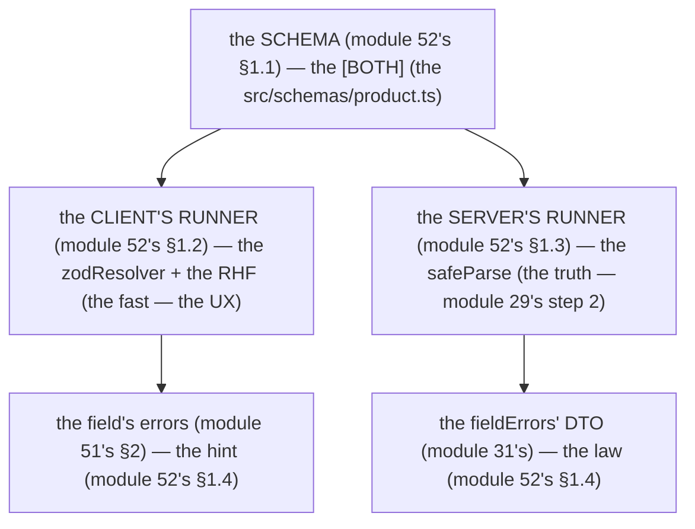

# Module 52 — React Hook Form + Zod: One Schema, Two Runners (the Client's Speed, the Server's Truth)

**Phase 12: Forms & Validation · Module 52 of 101**

> **Where does this run?** The schema is **`[BOTH]`** (the `src/schemas/`, imported by the client *and* the server — the module-52's core decision); the RHF state is **`[CLIENT]`**; the `safeParse` in the Server Function is **`[SERVER]`**. The module-52's standing rule (module 31's, now with the form stack): **one Zod schema in `src/schemas/` — the client runs it through `zodResolver` (fast, UX), the server runs it with `safeParse` (truth, module 29's step 2) — the client's pass is a hint, the server's pass is the law** (module 52's §1).

---

## 1. Concept — One schema, two runners

**The schema is the [BOTH]** (module 52's §1.1): the *the `src/schemas/`* (module 52's §1.1) — the *the no client's schema + the server's schema* (module 52's §1.1) — the *module-52's line: the schema is the [BOTH]* (module 52's §1.1) — the *module-31's line: the shared schema is the 1's* (module 31's).

**The client's runner** (module 52's §1.2): the *the `zodResolver`* (module 52's §1.2) — the *the RHF's* (module 52's §1.2) — the *module-52's line: the client's runner is the `zodResolver`* (module 52's §1.2) — the *module-52's line: the RHF's is the fast* (module 52's §1.2).

**The server's runner** (module 52's §1.3): the *the `safeParse`* (module 52's §1.3) — the *module-29's step 2* (module 29's) — the *module-52's line: the server's runner is the `safeParse`* (module 52's §1.3) — the *module-29's line: the Zod is the 2nd* (module 29's).

**The hint vs the law** (module 52's §1.4): the *the client's pass is the hint* (module 52's §1.4) — the *the server's pass is the law* (module 52's §1.4) — the *module-52's line: the client's is the hint, the server's is the law* (module 52's §1.4) — the *module-31's line: the server's is the truth* (module 31's).

## 2. Mental Model — The 2 runners (drawn)



**The 2 runners** (the module-52's mental model):
1. **The client's runner** (module 52's §1.2): the *the `zodResolver` + the RHF* — the *the fast, the UX* (module 52's §1.2).
2. **The server's runner** (module 52's §1.3): the *the `safeParse`* — the *the truth, module 29's step 2* (module 52's §1.3).

## 3. Architecture — The shared schema (the code)

### 3.1 The schema (module 52's §3.1 — the `src/schemas/product.ts`)

`FILE: src/schemas/product.ts` (production pattern — [BOTH] — the module-52's §3.1: the shared schema)

```ts
// THE SHARED SCHEMA (module 52's §3.1 — the [BOTH] (module 52's §1.1) — the the no 'server-only' (module 52's §3.1)):
import { z } from 'zod'

export const productSchema = z.object({
  name: z.string().min(1, 'Name is required').max(120, 'Name must be 120 characters or less'),   // the module-52's line: the error's message is the schema's (module 52's §3.1)
  description: z.string().max(5000).optional().or(z.literal('')),   // the module-52's line: the optional's is the .or(literal('')) (module 52's §3.1)
  price_cents: z.coerce.number().int('Price must be an integer').min(0, 'Price must be 0 or more'),   // the module-14's line: the money is the integer cents (module 14's)
  slug: z.string().min(1).max(60).regex(/^[a-z0-9]+(?:-[a-z0-9]+)*$/, 'Slug must be kebab-case'),   // the module-24's line: the slug's (module 24's)
  sku: z.string().max(40).optional().or(z.literal('')),   // the module-31's 2a (module 31's)
  status: z.enum(['draft', 'active', 'delisted']).default('draft'),   // the module-38's line: the enum is the pgEnum's (module 38's §3.1)
})
export type ProductInput = z.infer<typeof productSchema>   // the module-04's line: the type is the schema's (module 04's)
```

**The module-52's line:** the *schema is the [BOTH]* (module 52's §1.1) — the *the no `'server-only'`* (module 52's §3.1) — the *the error's message is the schema's* (module 52's §3.1) — the *the `z.infer` is the type's* (module 04's).

### 3.2 The client's runner (module 52's §3.2 — the `useForm` + the `zodResolver`)

`FILE: src/components/product-form.tsx` (production pattern — [CLIENT] — the module-52's §3.2)

```tsx
// THE CLIENT'S RUNNER (module 52's §3.2 — the useForm + the zodResolver (module 52's §1.2)):
// 'use client'
import { useForm } from 'react-hook-form'
import { zodResolver } from '@hookform/resolvers/zod'
import { productSchema, type ProductInput } from '@/schemas/product'

export function useProductForm(defaults?: Partial<ProductInput>) {
  return useForm<ProductInput>({
    resolver: zodResolver(productSchema),   // the module-52's line: the zodResolver is the client's runner (module 52's §1.2)
    defaultValues: defaults,                 // the module-52's line: the defaultValues is the edit's (module 52's §3.2.1)
    mode: 'onTouched',                        // the module-52's line: the mode is the onTouched (module 52's §3.2.2)
  })
}
```

**The module-52's line:** the *client's runner is the `zodResolver`* (module 52's §1.2) — the *the `defaultValues` is the edit's* (module 52's §3.2.1) — the *the `mode` is the `onTouched`* (module 52's §3.2.2).

### 3.3 The server's runner (module 52's §3.3 — the `safeParse`)

`FILE: src/app/dashboard/products/actions.ts` (production pattern — [SERVER] — the module-52's §3.3)

```ts
// THE SERVER'S RUNNER (module 52's §3.3 — the safeParse (module 52's §1.3) — the the module-29's step 2 (module 29's)):
'use server'
import { z } from 'zod'
import { productSchema } from '@/schemas/product'   // the module-52's line: the same schema (module 52's §1.1)
import { AppError } from '@/lib/errors'
import { getCurrentUser } from '@/lib/session'

export async function createProduct(formData: FormData) {
  // THE 1: THE SESSION'S GATE (module 29's step 1):
  const user = await getCurrentUser()
  if (!user) redirect('/login')
  // THE 2: THE ZOD (module 29's step 2) — the same schema (module 52's §1.1) — the the safeParse (module 52's §3.3):
  const parsed = productSchema.safeParse({
    name: formData.get('name'),
    description: formData.get('description') ?? '',
    price_cents: formData.get('price_cents'),
    slug: formData.get('slug'),
    sku: formData.get('sku') || undefined,
    status: formData.get('status') ?? 'draft',
  })
  if (!parsed.success) {
    // THE FIELD'S ERRORS (module 31's): the the safeParse's issues (module 52's §3.3):
    const fieldErrors: Record<string, string> = {}
    for (const issue of parsed.error.issues) {
      const key = String(issue.path[0] ?? '_form')   // the module-52's line: the issue's path is the field's (module 52's §3.3)
      if (!fieldErrors[key]) fieldErrors[key] = issue.message   // the module-52's line: the first's message is the field's (module 52's §3.3)
    }
    return { error: null, fieldErrors }   // the module-31's line: the field's errors is the DTO's (module 31's)
  }
  // THE 3: THE SERVICE (module 29's step 3) — the the orgId's scope (module 17's rule 1):
  // ...
  redirect('/dashboard/products')   // the module-29's step 5 (module 29's)
}
```

**The module-52's line:** the *server's runner is the `safeParse`* (module 52's §1.3) — the *the same schema* (module 52's §1.1) — the *the `issue.path` is the field's* (module 52's §3.3) — the *the first's message is the field's* (module 52's §3.3).

## 4. Production Code — The RHF's controls (the code)

### 4.1 The `register` (module 52's §4.1 — the simple)

`FILE: src/components/product-form.tsx` (production pattern — [CLIENT] — the module-52's §4.1)

```tsx
// THE REGISTER (module 52's §4.1 — the simple's (module 52's §4.1) — the the no re-render (module 52's §4.1.1)):
export function ProductForm() {
  const { register, handleSubmit, formState: { errors } } = useProductForm()
  return (
    <form action={createProduct} onSubmit={handleSubmit(() => {})} noValidate>
      <input {...register('name')} id="name" aria-invalid={!!errors.name} />   // the module-52's line: the register is the simple's (module 52's §4.1)
      <input {...register('price_cents')} id="price_cents" type="number" min={0} aria-invalid={!!errors.price_cents} />
      <button type="submit">Save</button>
    </form>
  )
}
```

**The module-52's line:** the *`register` is the simple's* (module 52's §4.1) — the *the no re-render* (module 52's §4.1.1) — the *module-52's line: the RHF's is the fast* (module 52's §1.2).

### 4.2 The `Controller` (module 52's §4.2 — the complex)

`FILE: src/components/product-form.tsx` (production pattern — [CLIENT] — the module-52's §4.2)

```tsx
// THE CONTROLLER (module 52's §4.2 — the complex's (module 52's §4.2) — the the shadcn's Select (module 52's §4.2.1)):
import { Controller } from 'react-hook-form'
import { Select, SelectContent, SelectItem, SelectTrigger, SelectValue } from '@/components/ui/select'

export function StatusSelect({ control }: { control: UseFormControl<ProductInput> }) {
  return (
    <Controller
      control={control}
      name="status"
      render={({ field }) => (
        <Select value={field.value} onValueChange={field.onChange} defaultValue={field.value}>
          <SelectTrigger><SelectValue /></SelectTrigger>
          <SelectContent>
            <SelectItem value="draft">Draft</SelectItem>
            <SelectItem value="active">Active</SelectItem>
            <SelectItem value="delisted">Delisted</SelectItem>
          </SelectContent>
        </Select>
      )}
    />
  )
}
```

**The module-52's line:** the *`Controller` is the complex's* (module 52's §4.2) — the *the shadcn's Select* (module 52's §4.2.1) — the *module-52's line: the `Controller` is the complex's* (module 52's §4.2).

### 4.3 The `watch` + the `setValue` (module 52's §4.3 — the dependent)

`FILE: src/components/product-form.tsx` (production pattern — [CLIENT] — the module-52's §4.3)

```tsx
// THE WATCH + THE SETVALUE (module 52's §4.3 — the dependent's (module 52's §4.3) — the the status's → the description's required (module 52's §4.3.1)):
export function ProductForm() {
  const { watch, control } = useProductForm()
  const status = watch('status')   // the module-52's line: the watch is the dependent's (module 52's §4.3)
  return (
    <div>
      <StatusSelect control={control} />
      {status === 'active' && <p>A description is required for active products.</p>}   // the module-52's line: the watch is the UX's (module 52's §4.3)
    </div>
  )
}
```

**The module-52's line:** the *`watch` is the dependent's* (module 52's §4.3) — the *the `setValue` is the program's* (module 52's §4.3.2) — the *module-52's line: the `watch` is the UX's* (module 52's §4.3).

## 5. Common Mistakes (the RHF's failures)

| Mistake | The symptom | Fix |
|---|---|---|
| **The 2 schemas** (module 52's §1.1's line violated) | the *module-52's line: the schema is the [BOTH]* (module 52's §1.1) — the *the 2 schemas is the *drift* (module 52's §1.1) — the *module-52's line: the schema is the [BOTH]* (module 52's §1.1) — the *no 2 schemas* (module 52's §1.1)* | the *the 1 schema* (module 52's §1.1) — the *module-52's line: the schema is the [BOTH]* (module 52's §1.1)* |
| **The no `zodResolver`** (module 52's §1.2's line violated) | the *module-52's line: the client's runner is the `zodResolver`* (module 52's §1.2) — the *the no `zodResolver` is the *no client's validation* (module 52's §1.2) — the *module-52's line: the client's runner is the `zodResolver`* (module 52's §1.2) — the *no `zodResolver`* (module 52's §1.2)* | the *the `zodResolver`* (module 52's §1.2) — the *module-52's line: the client's runner is the `zodResolver`* (module 52's §1.2)* |
| **The client's trust** (module 52's §1.4's line violated) | the *module-52's line: the client's is the hint, the server's is the law* (module 52's §1.4) — the *the client's trust is the *no* (module 52's §1.4) — the *module-52's line: the client's is the hint, the server's is the law* (module 52's §1.4) — the *no client's trust* (module 52's §1.4)* | the *the server's `safeParse`* (module 52's §1.3) — the *module-52's line: the client's is the hint, the server's is the law* (module 52's §1.4)* |
| **The no `defaultValues`** (module 52's §3.2.1's line violated) | the *module-52's line: the `defaultValues` is the edit's* (module 52's §3.2.1) — the *the no `defaultValues` is the *empty's edit* (module 52's §3.2.1) — the *module-52's line: the `defaultValues` is the edit's* (module 52's §3.2.1) — the *no `defaultValues`* (module 52's §3.2.1)* | the *the `defaultValues`* (module 52's §3.2.1) — the *module-52's line: the `defaultValues` is the edit's* (module 52's §3.2.1)* |
| **The `register`'s complex** (module 52's §4.2's line violated) | the *module-52's line: the `Controller` is the complex's* (module 52's §4.2) — the *the `register`'s complex is the *no* (module 52's §4.2) — the *module-52's line: the `Controller` is the complex's* (module 52's §4.2) — the *no `register`'s complex* (module 52's §4.2)* | the *the `Controller`* (module 52's §4.2) — the *module-52's line: the `Controller` is the complex's* (module 52's §4.2)* |
| **The `mode`'s `onChange`** (module 52's §3.2.2's line violated) | the *module-52's line: the `mode` is the `onTouched`* (module 52's §3.2.2) — the *the `onChange` is the *too early* (module 52's §3.2.2) — the *module-52's line: the `mode` is the `onTouched`* (module 52's §3.2.2) — the *no `onChange`* (module 52's §3.2.2)* | the *the `mode: 'onTouched'`* (module 52's §3.2.2) — the *module-52's line: the `mode` is the `onTouched`* (module 52's §3.2.2)* |
| **The no server's guard** (module 29's step 2's line violated) | the *module-29's line: the Zod is the 2nd* (module 29's) — the *the no server's guard is the *no* (module 29's) — the *module-52's line: the server's runner is the `safeParse`* (module 52's §1.3) — the *no server's guard* (module 29's)* | the *the `safeParse`* (module 52's §1.3) — the *module-52's line: the server's runner is the `safeParse`* (module 52's §1.3)* |

## 6. Security Notes

- **The server's is the law** (module 52's §1.4): the *module-52's line: the client's is the hint, the server's is the law* (module 52's §1.4) — the *module-31's line: the server's is the truth* (module 31's) — the *module-31's* *deep-dive* (module 31's).
- **The no client's trust** (module 29's): the *module-29's line: the no client's trust* (module 29's) — the *module-52's line: the no client's trust* (module 29's) — the *module-29's* *deep-dive* (module 29's).
- **The `price_cents`'s coerce** (module 52's §3.1): the *module-52's line: the `coerce` is the number's* (module 52's §3.1) — the *module-14's line: the money is the integer cents* (module 14's) — the *module-14's* *deep-dive* (module 14's).
- **The slug's regex** (module 24's): the *module-24's line: the slug's* (module 24's) — the *module-52's line: the slug's is the regex's* (module 52's §3.1) — the *module-24's* *deep-dive* (module 24's).

## 7. Performance Notes

- **The RHF's is the fast** (module 52's §1.2): the *module-52's line: the RHF's is the fast* (module 52's §1.2) — the *module-52's line: the RHF's is the fast* (module 52's §1.2) — the *the no re-render* (module 52's §4.1.1).
- **The `onTouched` is the fast** (module 52's §3.2.2): the *module-52's line: the `mode` is the `onTouched`* (module 52's §3.2.2) — the *module-52's line: the `onTouched` is the fast* (module 52's §3.2.2).
- **The `zodResolver` is the fast** (module 52's §1.2): the *module-52's line: the `zodResolver` is the client's runner* (module 52's §1.2) — the *module-52's line: the `zodResolver` is the fast* (module 52's §1.2).

## 8. Exercise

**Beginner.** *The shared schema* (module 52's §3.1): the *the `productSchema`* (module 3.1's) + the *the `z.infer`* (module 04's) — *build it* — the *artifact: the schema + the type* (module 20's).

**Intermediate.** *The 2 runners* (module 52's §3.2–3.3): the *the `zodResolver`* (module 3.2's) + the *the `safeParse`* (module 3.3's) — *build it* — the *artifact: the 2 runners' logs* (module 20's).

**Production.** *The `Controller` + the `watch`* (module 52's §4.2–4.3): the *the `Controller`* (module 4.2's) + the *the `watch`* (module 4.3's) — the *artifact: the `Controller`'s + the `watch`'s logs* (module 20's).

## 9. Architecture Challenge

**Prompt:** The *"the team wants to add a 'dynamic fields': the the product's 'variants' — the the color's + the size's, the the no fixed's count"* (the *module-52's* *schema's* — the *module-52's* *RHF's* — the *module-52's line: the schema is the [BOTH]* (module 52's §1.1) — the *module-52's line: the RHF's is the fast* (module 52's §1.2) — the *module-52's standing line: the schema is the [BOTH] + the RHF's is the fast* (module 52's §1.1 + module 52's §1.2)).

The *problems*: (1) the *the dynamic's fields* (the *the `z.array`'s* (module 52's §9) — the *module-52's line: the dynamic's is the `z.array`'s* (module 52's §9) — the *module-52's standing line: the dynamic's is the `z.array`'s* (module 52's §9)).

(2) the *the RHF's `useFieldArray`* (the *the `useFieldArray`* (module 52's §9) — the *module-52's line: the RHF's dynamic's is the `useFieldArray`* (module 52's §9) — the *module-52's standing line: the RHF's dynamic's is the `useFieldArray`* (module 52's §9)).

**Design**: the *the dynamic's* (the *the `z.array`* (module 52's §9) + the *the `useFieldArray`* (module 52's §9) + the *the 2 runners* (module 52's §1) — the *module-52's line: the schema is the [BOTH] + the RHF's is the fast* (module 52's §1.1 + module 52's §1.2) — the *module-52's standing line: the dynamic's is the `z.array`'s + the RHF's dynamic's is the `useFieldArray` + the 2 runners* (module 52's §9 + module 52's §1)).

Produce: the *the dynamic's* (the *the `z.array`* (module 52's §9) + the *the `useFieldArray`* (module 52's §9) + the *the 2 runners* (module 52's §1) — the *module-52's line: the schema is the [BOTH] + the RHF's is the fast* (module 52's §1.1 + module 52's §1.2) — the *module-52's standing line: the dynamic's is the `z.array`'s + the RHF's dynamic's is the `useFieldArray` + the 2 runners* (module 52's §9 + module 52's §1)).

<details>
<summary>Model answer</summary>
**The dynamic's** (module 52's §9 + module 52's §1):
1. **The `z.array`** (module 52's §9): the *the `z.array(z.object({ color: z.string(), size: z.enum(['S','M','L']) }))`* (module 52's §9) — the *module-52's line: the dynamic's is the `z.array`'s* (module 52's §9).
2. **The `useFieldArray`** (module 52's §9): the *the RHF's dynamic's* (module 52's §9) — the *module-52's line: the RHF's dynamic's is the `useFieldArray`* (module 52's §9).
**The generalization** (the *dynamic's* pattern, the *module's* standing rule): **the *dynamic's is the `z.array`'s* (module 52's §9) — the *the RHF's dynamic's is the `useFieldArray`* (module 52's §9) — the *the 2 runners* (module 52's §1) — the *module-52's standing line: the dynamic's is the `z.array`'s + the RHF's dynamic's is the `useFieldArray` + the 2 runners* (module 52's §9 + module 52's §1)*.
</details>

## 10. Official Documentation

- React Hook Form: https://react-hook-form.com/
- @hookform/resolvers: Zod: https://react-hook-form.com/advanced-guide/zod
- Zod 4: https://zod.dev/
- shadcn/ui: Form: https://ui.shadcn.com/docs/components/form
- The module-31's validation: the module-31 (the phase-7's file-03)
- The module-51's form anatomy: the module-51 (the phase-12's file-01)

## 11. What You Should Know Before Continuing

- [ ] I can state the *1 schema, 2 runners* (module 1's) — the *module-52's line: the schema is the [BOTH], the client's is the hint, the server's is the law* (module 1's)
- [ ] I know the *schema is the [BOTH]* (module 1.1's) — the *the no `'server-only'`* (module 3.1's) — the *the `z.infer` is the type's* (module 04's)
- [ ] I know the *client's runner is the `zodResolver`* (module 1.2's) — the *the `defaultValues` is the edit's* (module 3.2.1's) — the *the `mode` is the `onTouched`* (module 3.2.2's)
- [ ] I know the *server's runner is the `safeParse`* (module 1.3's) — the *the `issue.path` is the field's* (module 3.3's)
- [ ] I know the *`register` is the simple's* (module 4.1's) — the *the `Controller` is the complex's* (module 4.2's) — the *the `watch` is the dependent's* (module 4.3's)
- [ ] I know the *no client's trust* (module 1.4's) — the *module-31's line: the server's is the truth* (module 31's)
- [ ] I've done the *shared schema* (module 8's beginner) + the *2 runners* (module 8's intermediate) + the *`Controller` + the `watch`* (module 8's production) — the *artifacts* (module 20's)

**Next:** Module 53 — Server Validation Round-Trip (the *the client's invalid* → the *the server's invalid* → the *the reset with the field's errors* — the *module-53's line: the round-trip is the 3's* (module 53's)).
