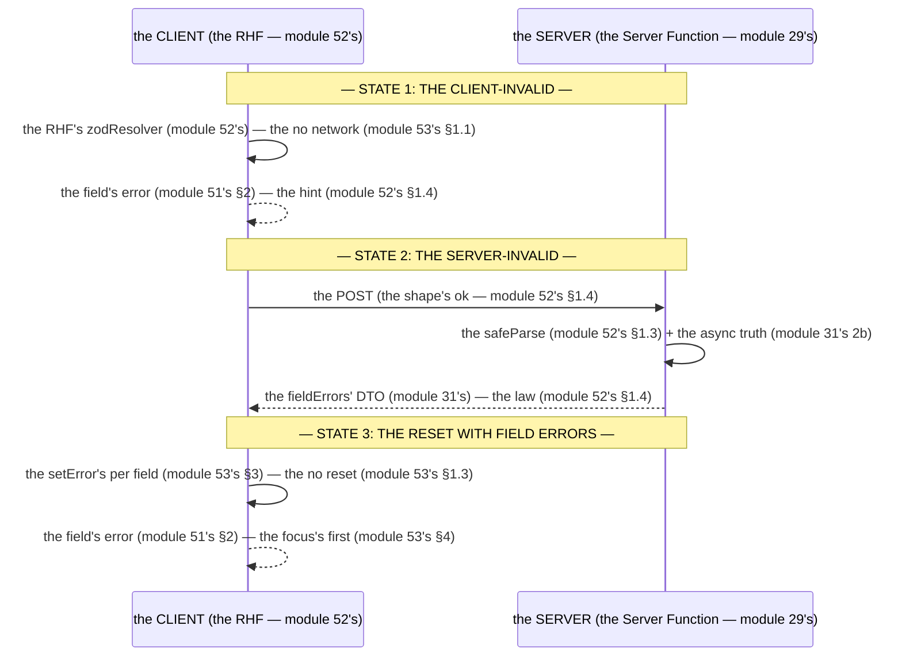

# Module 53 — Server Validation Round-Trip: Client-Invalid → Server-Invalid → Reset With Field Errors

**Phase 12: Forms & Validation · Module 53 of 101**

> **Where does this run?** The round-trip is **`[BOTH / BOUNDARY]`** end to end: the *client-invalid* is `[CLIENT]` (the RHF, module 52's), the *server-invalid* is `[SERVER]` (the `safeParse` + the async truth, module 31's 2b), the *field errors* travel back as a **`[BOTH]`** DTO (the `fieldErrors`, module 31's) that the client *re-renders* (the `setError`, module 53's §3). The module-53's standing rule (module 31's, now the full loop): **the client validates the shape fast; the server validates the shape *and* the truth; the server's field errors come back over the wire and *replace* the client's — never merge — and the user's input is preserved (never cleared on an error)** (module 53's §1).

---

## 1. Concept — The round-trip is the 3 states

**The client-invalid** (module 53's §1.1): the *the RHF's block* (module 52's) — the *the no network* (module 53's §1.1) — the *module-53's line: the client-invalid is the block* (module 53's §1.1) — the *module-52's line: the RHF's is the fast* (module 52's).

**The server-invalid** (module 53's §1.2): the *the `safeParse`'s fail* (module 52's §1.3) + the *the async truth's fail* (module 31's 2b) — the *module-53's line: the server-invalid is the fail* (module 53's §1.2) — the *module-31's line: the async truth is the service's* (module 31's 2b).

**The reset with field errors** (module 53's §1.3): the *the `fieldErrors`' DTO* (module 31's) + the *the `setError`'s* (module 53's §3) + the *the no `reset`* (module 53's §1.3) — the *module-53's line: the reset is the `setError`'s, not the `reset`* (module 53's §1.3) — the *module-31's line: the field's errors is the DTO's* (module 31's).

## 2. Mental Model — The 3 states (drawn)



**The 3 states** (the module-53's mental model):
1. **The client-invalid** (module 53's §1.1): the *the RHF's block* — the *the no network* (module 53's §1.1).
2. **The server-invalid** (module 53's §1.2): the *the `safeParse`'s fail* + the *the async truth's fail* (module 53's §1.2).
3. **The reset with field errors** (module 53's §1.3): the *the `setError`'s* — the *the no `reset`* (module 53's §1.3).

## 3. Architecture — The state's shape (the code)

### 3.1 The state's shape (module 53's §3.1 — the `FormState`)

`FILE: src/types/form-state.ts` (production pattern — [BOTH] — the module-53's §3.1: the `FormState`)

```ts
// THE FORM'S STATE (module 53's §3.1 — the [BOTH] (module 31's) — the the module-31's line: the field's errors is the DTO's (module 31's)):
export type FormState = {
  error?: string | null           // the module-51's line: the form's error is the form's (module 31's)
  fieldErrors?: Record<string, string> | null   // the module-51's line: the field's error is the field's (module 31's)
} | null
```

**The module-53's line:** the *form state is the 2's* (module 53's §3.1) — the *the `error` is the form's* (module 31's) — the *the `fieldErrors` is the field's* (module 31's).

### 3.2 The server's action (module 53's §3.2 — the `safeParse` + the async truth)

`FILE: src/app/dashboard/products/actions.ts` (production pattern — [SERVER] — the module-53's §3.2)

```ts
// THE SERVER'S ACTION (module 53's §3.2 — the 5-step (module 29's) — the the server-invalid's (module 53's §1.2)):
'use server'
import { productSchema } from '@/schemas/product'   // the module-52's line: the same schema (module 52's §1.1)
import { getCurrentUser } from '@/lib/session'
import { createProduct } from '@/services/products'   // the module-17's service (module 17's) — the the async truth (module 31's 2b)

export async function createProduct(prev: FormState, formData: FormData): Promise<FormState> {
  const user = await getCurrentUser()
  if (!user) redirect('/login')   // the module-29's step 1 (module 29's)

  // THE 2: THE ZOD (module 29's step 2) — the shape's (module 52's §1.3):
  const parsed = productSchema.safeParse({
    name: formData.get('name'), description: formData.get('description') ?? '',
    price_cents: formData.get('price_cents'), slug: formData.get('slug'),
    sku: formData.get('sku') || undefined, status: formData.get('status') ?? 'draft',
  })
  if (!parsed.success) {
    return { error: null, fieldErrors: toFieldErrors(parsed.error) }   // the module-53's line: the server-invalid is the fail (module 53's §1.2)
  }

  // THE 3: THE SERVICE (module 29's step 3) — the async truth (module 31's 2b) — the the AppError's (module 19's):
  try {
    await createProduct(user, orgId, parsed.data)   // the module-17's service (module 17's) — the the assertSkuUnique (module 31's 2b)
  } catch (e) {
    if (e instanceof AppError) {
      return { error: e.fieldErrors ? null : e.message, fieldErrors: e.fieldErrors ?? null }   // the module-53's line: the AppError's is the form's (module 19's)
    }
    throw e   // the module-19's line: the no swallow (module 19's)
  }
  redirect('/dashboard/products')   // the module-29's step 5 (module 29's)
}

function toFieldErrors(error: z.ZodError): Record<string, string> {
  const fieldErrors: Record<string, string> = {}
  for (const issue of error.issues) {
    const key = String(issue.path[0] ?? '_form')
    if (!fieldErrors[key]) fieldErrors[key] = issue.message
  }
  return fieldErrors
}
```

**The module-53's line:** the *server's action is the 5-step* (module 29's) — the *the server-invalid is the fail* (module 53's §1.2) — the *the AppError's is the form's* (module 19's) — the *the no swallow* (module 19's).

### 3.3 The client's sync (module 53's §3.3 — the `setError`'s per field)

`FILE: src/components/product-form.tsx` (production pattern — [CLIENT] — the module-53's §3.3: the `useEffect`'s sync)

```tsx
// THE CLIENT'S SYNC (module 53's §3.3 — the setError's per field (module 53's §3.3) — the the no reset (module 53's §1.3)):
// 'use client'
import { useEffect } from 'react'
import { useForm } from 'react-hook-form'
import { useActionState } from 'react'
import { createProduct } from './actions'
import type { FormState } from '@/types/form-state'

export function ProductForm() {
  const { setError, clearErrors } = useFormContext()   // the module-52's line: the RHF's (module 52's)
  const [state, formAction, isPending] = useActionState<FormState, FormData>(createProduct, null)   // the module-51's line: the useActionState is the pending's (module 29's)

  // THE SYNC (module 53's §3.3): the the server's fieldErrors → the RHF's setError (module 53's §3.3):
  useEffect(() => {
    if (state?.fieldErrors) {
      Object.entries(state.fieldErrors).forEach(([field, message]) => {
        setError(field, { type: 'server', message })   // the module-53's line: the setError's per field is the sync (module 53's §3.3)
      })
    } else {
      clearErrors()   // the module-53's line: the clearErrors is the success's (module 53's §3.3)
    }
  }, [state?.fieldErrors])

  return (/* the form (module 51's §4) — the the no reset on the error (module 53's §1.3) */)
}
```

**The module-53's line:** the *client's sync is the `setError`'s per field* (module 53's §3.3) — the *the no `reset` on the error* (module 53's §1.3) — the *the `clearErrors` is the success's* (module 53's §3.3).

## 4. Production Code — The focus's first (module 53's §4)

`FILE: src/components/product-form.tsx` (production pattern — [CLIENT] — the module-53's §4: the focus's first invalid)

```tsx
// THE FOCUS'S FIRST (module 53's §4 — the a11y's (module 51's §5) — the the no scroll's (module 53's §4.1)):
// 'use client'
import { useRef } from 'react'

export function ProductForm() {
  const formRef = useRef<HTMLFormElement>(null)
  // ... (module 53's §3.3's)
  useEffect(() => {
    if (state?.fieldErrors) {
      const first = Object.keys(state.fieldErrors)[0]
      const el = formRef.current?.querySelector<HTMLElement>(`[name="${first}"]`)
      el?.focus()   // the module-53's line: the focus's first is the a11y's (module 53's §4)
    }
  }, [state?.fieldErrors])
}
```

**The module-53's line:** the *focus's first is the a11y's* (module 53's §4) — the *module-51's line: the a11y's is the 4 rules* (module 51's §5).

## 5. Common Mistakes (the round-trip's failures)

| Mistake | The symptom | Fix |
|---|---|---|
| **The `reset` on the error** (module 53's §1.3's line violated) | the *module-53's line: the reset is the `setError`'s, not the `reset`* (module 53's §1.3) — the *the `reset` on the error is the *no input* (module 53's §1.3) — the *module-53's line: the no `reset` on the error* (module 53's §1.3) — the *no input's loss* (module 53's §1.3)* | the *the `setError`'s per field* (module 53's §3.3) — the *module-53's line: the reset is the `setError`'s, not the `reset`* (module 53's §1.3)* |
| **The client's merge** (module 53's §1.4's line violated) | the *module-53's line: the server's replaces, the no merge* (module 53's §1.4) — the *the client's merge is the *stale* (module 53's §1.4) — the *module-53's line: the server's replaces* (module 53's §1.4) — the *no merge* (module 53's §1.4)* | the *the `clearErrors` + the `setError`* (module 53's §3.3) — the *module-53's line: the server's replaces* (module 53's §1.4)* |
| **The no async truth** (module 31's 2b's line violated) | the *module-31's line: the async truth is the service's* (module 31's 2b) — the *the no async truth is the *no SKU's check* (module 31's 2b) — the *module-53's line: the server-invalid is the fail* (module 53's §1.2) — the *no async truth* (module 31's 2b)* | the *the `assertSkuUnique`* (module 31's 2b) — the *module-31's line: the async truth is the service's* (module 31's 2b)* |
| **The no `fieldErrors`' DTO** (module 31's line violated) | the *module-31's line: the field's errors is the DTO's* (module 31's) — the *the no `fieldErrors` is the *no round-trip* (module 31's) — the *module-53's line: the `fieldErrors` is the DTO's* (module 31's) — the *no `fieldErrors`* (module 31's)* | the *the `fieldErrors`' DTO* (module 31's) — the *module-31's line: the field's errors is the DTO's* (module 31's)* |
| **The no focus's first** (module 53's §4's line violated) | the *module-53's line: the focus's first is the a11y's* (module 53's §4) — the *the no focus's first is the *no a11y* (module 53's §4) — the *module-53's line: the focus's first is the a11y's* (module 53's §4) — the *no focus's first* (module 53's §4)* | the *the `el?.focus()`* (module 53's §4) — the *module-53's line: the focus's first is the a11y's* (module 53's §4)* |
| **The swallow's** (module 19's line violated) | the *module-19's line: the no swallow* (module 19's) — the *the swallow's is the *no 500* (module 19's) — the *module-53's line: the no swallow* (module 19's) — the *no swallow* (module 19's)* | the *the `throw e`* (module 19's) — the *module-19's line: the no swallow* (module 19's)* |
| **The client's trust** (module 52's §1.4's line violated) | the *module-52's line: the client's is the hint, the server's is the law* (module 52's §1.4) — the *the client's trust is the *no* (module 52's §1.4) — the *module-53's line: the server's is the law* (module 52's §1.4) — the *no client's trust* (module 52's §1.4)* | the *the server's `safeParse`* (module 52's §1.3) — the *module-52's line: the client's is the hint, the server's is the law* (module 52's §1.4)* |

## 6. Security Notes

- **The server's is the law** (module 52's §1.4): the *module-52's line: the client's is the hint, the server's is the law* (module 52's §1.4) — the *module-31's line: the server's is the truth* (module 31's).
- **The async truth is the service's** (module 31's 2b): the *module-31's line: the async truth is the service's* (module 31's 2b) — the *module-17's line: the tenancy's scope is the first* (module 17's rule 1) — the *module-17's* *deep-dive* (module 17's).
- **The no client's trust** (module 29's): the *module-29's line: the no client's trust* (module 29's) — the *module-53's line: the no client's trust* (module 29's).
- **The AppError's field** (module 19's): the *module-19's line: the AppError's* (module 19's) — the *module-53's line: the AppError's is the form's* (module 19's).
- **The a11y's** (module 51's §5): the *module-51's line: the a11y's is the 4 rules* (module 51's §5) — the *module-19's* *deep-dive* (module 19's).

## 7. Performance Notes

- **The client's fast** (module 52's §1.2): the *module-52's line: the RHF's is the fast* (module 52's) — the *module-53's line: the client-invalid is the block* (module 53's §1.1).
- **The server's truth** (module 53's §1.2): the *module-53's line: the server-invalid is the fail* (module 53's §1.2) — the *module-31's line: the async truth is the service's* (module 31's 2b).
- **The no double's** (module 51's §4): the *module-51's line: the duplicate is the 2 guards* (module 51's §4) — the *module-40's idempotency* (module 40's §1.3).

## 8. Exercise

**Beginner.** *The state's shape* (module 53's §3.1): the *the `FormState`* (module 3.1's) + the *the `toFieldErrors`* (module 3.2's) — *build it* — the *artifact: the 2's* (module 20's).

**Intermediate.** *The round-trip* (module 53's §3.2–3.3): the *the server's action* (module 3.2's) + the *the client's sync* (module 3.3's) — *build it* — the *artifact: the round-trip's log* (module 20's).

**Production.** *The focus's first* (module 53's §4): the *the `el?.focus()`* (module 4's) + the *the screen reader's test* (module 51's §5) — the *artifact: the a11y's report* (module 20's).

## 9. Architecture Challenge

**Prompt:** The *"the team wants to add a 'server's debounce': the the SKU's check on the type's"* (the *module-53's* *async truth's* — the *module-31's* *2b's* — the *module-31's line: the async truth is the service's* (module 31's 2b) — the *module-53's line: the server-invalid is the fail* (module 53's §1.2) — the *module-53's standing line: the async truth is the service's + the server-invalid is the fail* (module 31's 2b + module 53's §1.2)).

The *problems*: (1) the *the debounce's* (the *the client's debounce* (module 53's §9) — the *module-53's line: the debounce is the client's* (module 53's §9) — the *module-53's standing line: the debounce is the client's* (module 53's §9)).

(2) the *the async truth's* (the *the `assertSkuUnique`* (module 31's 2b) — the *module-31's line: the async truth is the service's* (module 31's 2b) — the *module-53's standing line: the async truth is the service's* (module 31's 2b)).

**Design**: the *the split* (the *the client's debounce* (module 53's §9) + the *the server's `assertSkuUnique`* (module 31's 2b) + the *the no client's trust* (module 29's) — the *module-53's line: the async truth is the service's + the server-invalid is the fail* (module 31's 2b + module 53's §1.2) — the *module-53's standing line: the debounce is the client's + the async truth is the service's + the no client's trust* (module 53's §9 + module 31's 2b + module 29's)).

Produce: the *the split* (the *the client's debounce* (module 53's §9) + the *the server's `assertSkuUnique`* (module 31's 2b) + the *the no client's trust* (module 29's) — the *module-53's line: the async truth is the service's + the server-invalid is the fail* (module 31's 2b + module 53's §1.2) — the *module-53's standing line: the debounce is the client's + the async truth is the service's + the no client's trust* (module 53's §9 + module 31's 2b + module 29's)).

<details>
<summary>Model answer</summary>
**The split** (module 53's §9 + module 31's 2b + module 29's):
1. **The client's debounce** (module 53's §9): the *the client's debounce's* (module 53's §9) — the *module-53's line: the debounce is the client's* (module 53's §9).
2. **The server's `assertSkuUnique`** (module 31's 2b): the *the service's check* (module 31's 2b) — the *module-31's line: the async truth is the service's* (module 31's 2b).
**The generalization** (the *split's* pattern, the *module's* standing rule): **the *debounce is the client's* (module 53's §9) — the *the async truth is the service's* (module 31's 2b) — the *the no client's trust* (module 29's) — the *module-53's standing line: the debounce is the client's + the async truth is the service's + the no client's trust* (module 53's §9 + module 31's 2b + module 29's)*.
</details>

## 10. Official Documentation

- React: useActionState: https://react.dev/reference/react/useActionState
- React Hook Form: setError: https://react-hook-form.com/faq#setError
- Zod 4: https://zod.dev/
- The module-31's validation: the module-31 (the phase-7's file-03)
- The module-52's RHF + Zod: the module-52 (the phase-12's file-02)

## 11. What You Should Know Before Continuing

- [ ] I can state the *round-trip is the 3 states* (module 1's) — the *module-53's line: the round-trip is the 3's* (module 1's)
- [ ] I know the *client-invalid is the block* (module 1.1's) — the *the no network* (module 1.1's)
- [ ] I know the *server-invalid is the fail* (module 1.2's) — the *the `safeParse`'s* + the *the async truth's* (module 1.2's)
- [ ] I know the *reset is the `setError`'s, not the `reset`* (module 1.3's) — the *the no input's loss* (module 1.3's)
- [ ] I know the *state's shape is the 2's* (module 3.1's) — the *the `error` is the form's* + the *the `fieldErrors` is the field's* (module 3.1's)
- [ ] I know the *focus's first is the a11y's* (module 4's)
- [ ] I've done the *state's shape* (module 8's beginner) + the *round-trip* (module 8's intermediate) + the *focus's first* (module 8's production) — the *artifacts* (module 20's)

**Next:** Module 54 — Advanced Forms (the *the checkout's* — the *the product's create/edit* — the *the admin's user's* — the *module-54's line: the advanced's is the 3's* (module 54's)).
