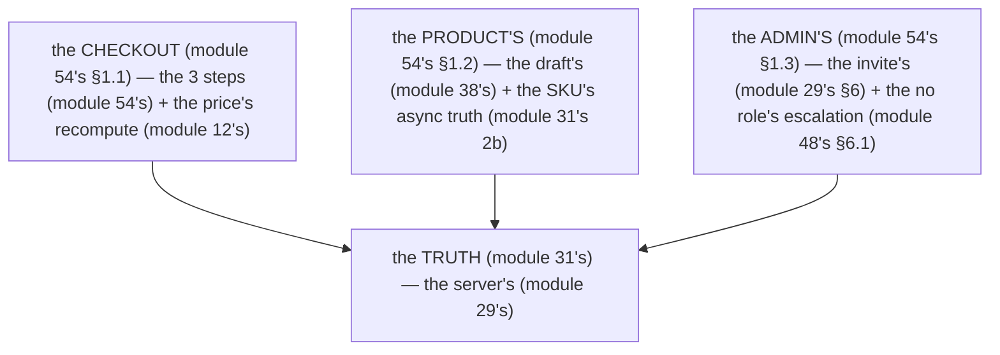

# Module 54 — Advanced Forms: Checkout, Product Create/Edit, Admin User Management

**Phase 12: Forms & Validation · Module 54 of 101**

> **Where does this run?** Every advanced form is **`[BOTH / BOUNDARY]`** (the RHF's client state, the Server Function's truth — module 52's/53's). The *money* is **`[SERVER]`** (the server recomputes, module 12's); the *role* is **`[SERVER]`** (the server re-checks, module 29's §6); the *order* is **`[SERVER]`** (the transaction + the idempotency, module 40's). The module-54's standing rule (module 31's, now the 3 advanced patterns): **the form's fields are the client's; the action's checks are the truth — price recomputed server-side, role re-checked server-side, order created transactionally + idempotently** (module 54's §1).

---

## 1. Concept — The 3 advanced patterns

**The checkout** (module 54's §1.1): the *the 3 steps* (module 54's §1.1) — the *the price's recompute* (module 12's) — the *module-54's line: the checkout is the 3 steps + the price's recompute* (module 54's §1.1) — the *module-12's line: the price is the server's* (module 12's).

**The product's create/edit** (module 54's §1.2): the *the draft's status* (module 38's `productStatusEnum`) — the *the SKU's async truth* (module 31's 2b) — the *module-54's line: the product's is the draft's + the SKU's async truth* (module 54's §1.2) — the *module-31's line: the async truth is the service's* (module 31's 2b).

**The admin's user's** (module 54's §1.3): the *the invite's role* (module 29's §6) — the *the no role's escalation* (module 48's §6.1) — the *module-54's line: the admin's is the invite's + the no role's escalation* (module 54's §1.3) — the *module-29's line: the role is the server's* (module 29's §6).

## 2. Mental Model — The 3 patterns (drawn)



**The 3 patterns** (the module-54's mental model):
1. **The checkout** (module 54's §1.1): the *the 3 steps + the price's recompute* (module 54's §1.1).
2. **The product's** (module 54's §1.2): the *the draft's + the SKU's async truth* (module 54's §1.2).
3. **The admin's** (module 54's §1.3): the *the invite's + the no role's escalation* (module 54's §1.3).

## 3. Architecture — The checkout (module 54's §3.1)

### 3.1 The 3 steps (module 54's §3.1.1 — the cart → the shipping → the payment)

`FILE: src/app/checkout/page.tsx` (production pattern — [SERVER] — the module-54's §3.1.1: the 3 steps)

```tsx
// THE 3 STEPS (module 54's §3.1.1 — the cart → the shipping → the payment (module 54's §3.1.1)):
import { Suspense } from 'react'
import { getCurrentUser } from '@/lib/session'
import { getCart } from '@/services/cart'   // the module-12's cart (module 12's)

export default function CheckoutPage() {
  return (
    <Suspense fallback={<p>Loading checkout…</p>}>
      <CheckoutSteps />   // the module-54's line: the checkout is the 3 steps (module 54's §1.1)
    </Suspense>
  )
}

async function CheckoutSteps() {
  const user = await getCurrentUser()   // the module-47's line: the session's read is the private (module 47's §1.1)
  if (!user) redirect('/login')
  const cart = await getCart(user)   // the module-12's line: the cart is the server's (module 12's)
  return (
    <div>
      <CartStep cart={cart} />   // the module-54's line: the step 1 is the cart's (module 54's §3.1.1)
      <ShippingStep />           // the module-54's line: the step 2 is the shipping's (module 54's §3.1.1)
      <PaymentStep cart={cart} /> // the module-54's line: the step 3 is the payment's (module 54's §3.1.1)
    </div>
  )
}
```

**The module-54's line:** the *checkout is the 3 steps* (module 54's §1.1) — the *the cart's* + the *the shipping's* + the *the payment's* (module 54's §3.1.1).

### 3.2 The price's recompute (module 54's §3.1.2 — the server's)

`FILE: src/services/checkout.ts` (production pattern — [SERVER] — the module-54's §3.1.2: the price's recompute)

```ts
// THE PRICE'S RECOMPUTE (module 54's §3.1.2 — the module-12's line: the price is the server's (module 12's)):
import 'server-only'
import { db } from '@/db'
import { products } from '@/db/schema'
import { eq, inArray } from 'drizzle-orm'
import { AppError } from '@/lib/errors'

export async function computeCartTotal(orgId: string, cart: { productId: string; quantity: number }[]) {
  // THE RECOMPUTE (module 54's §3.1.2): the the no client's total (module 12's) — the the price's from the DB (module 12's):
  const ids = cart.map(c => c.productId)
  const rows = await db.query.products.findMany({ where: inArray(products.id, ids) })   // the module-39's line: the inArray is the batch (module 39's §4)
  const map = new Map(rows.map(r => [r.id, r]))
  let total = 0
  for (const item of cart) {
    const p = map.get(item.productId)
    if (!p || p.orgId !== orgId) throw new AppError({ status: 400, code: 'cart.invalid', message: 'Invalid cart item' })   // the module-54's line: the cart's item is the org's (module 17's rule 1)
    total += p.priceCents * item.quantity   // the module-14's line: the money is the integer cents (module 14's)
  }
  return total   // the module-54's line: the total is the server's (module 12's)
}
```

**The module-54's line:** the *price is the server's* (module 12's) — the *the no client's total* (module 12's) — the *the cart's item is the org's* (module 17's rule 1).

### 3.3 The order's create (module 54's §3.1.3 — the transaction + the idempotency)

`FILE: src/app/checkout/actions.ts` (production pattern — [SERVER] — the module-54's §3.1.3: the order's create)

```ts
// THE ORDER'S CREATE (module 54's §3.1.3 — the 5-step (module 29's) + the transaction (module 40's) + the idempotency (module 40's §1.3)):
'use server'
import { redirect } from 'next/navigation'
import { getCurrentUser } from '@/lib/session'
import { createOrder } from '@/services/checkout'   // the module-54's §3.1.2 (module 54's §3.1.2) — the the module-40's §3.1's transaction (module 40's §3.1)

export async function placeOrder(formData: FormData) {
  const user = await getCurrentUser()
  if (!user) redirect('/login')   // the module-29's step 1 (module 29's)
  const idempotencyKey = String(formData.get('idempotencyKey') ?? '')   // the module-40's line: the idempotency is the service's (module 40's §1.3)
  const order = await createOrder(user, idempotencyKey)   // the module-54's line: the order is the transaction's + the idempotency's (module 40's)
  redirect(`/orders/${order.id}`)   // the module-29's step 5 (module 29's)
}
```

**The module-54's line:** the *order is the transaction's + the idempotency's* (module 40's) — the *module-40's line: the transaction is the atomic* (module 40's §1) — the *module-40's line: the idempotency is the service's* (module 40's §1.3).

## 4. Production Code — The product's create/edit (module 54's §4)

`FILE: src/components/product-form.tsx` (production pattern — [CLIENT] — the module-54's §4: the edit's `defaultValues`)

```tsx
// THE PRODUCT'S EDIT (module 54's §4 — the edit's defaultValues (module 52's §3.2.1) + the SKU's async truth (module 31's 2b)):
// 'use client'
import { useProductForm } from './use-product-form'   // the module-52's line: the RHF's (module 52's)
import type { ProductDto } from '@/lib/dto'   // the module-14's line: the DTO is the wire (module 14's)

export function ProductEditForm({ product }: { product: ProductDto }) {
  const form = useProductForm({   // the module-54's line: the edit's is the defaultValues (module 52's §3.2.1)
    name: product.name, description: product.description, price_cents: product.price_cents,
    slug: product.slug, sku: product.sku ?? '', status: product.status,
  })
  return (/* the form (module 51's §4) — the the action={updateProduct} (module 54's §4.1) */)
}
```

**The module-54's line:** the *edit's is the `defaultValues`* (module 52's §3.2.1) — the *the SKU's async truth is the service's* (module 31's 2b) — the *module-31's line: the async truth is the service's* (module 31's 2b).

### 4.1 The update's action (module 54's §4.1 — the RBAC + the async truth)

`FILE: src/app/dashboard/products/actions.ts` (production pattern — [SERVER] — the module-54's §4.1)

```ts
// THE UPDATE'S ACTION (module 54's §4.1 — the 5-step (module 29's) + the RBAC (module 48's) + the async truth (module 31's 2b)):
'use server'
import { productSchema } from '@/schemas/product'
import { getCurrentUser } from '@/lib/session'
import { updateProduct } from '@/services/products'   // the module-17's service (module 17's) — the the assertSkuUnique (module 31's 2b)

export async function updateProduct(prev: FormState, formData: FormData): Promise<FormState> {
  const user = await getCurrentUser()
  if (!user) redirect('/login')
  const parsed = productSchema.safeParse({ /* the same (module 52's §1.1) */ })
  if (!parsed.success) return { error: null, fieldErrors: toFieldErrors(parsed.error) }   // the module-53's line: the server-invalid is the fail (module 53's §1.2)
  try {
    await updateProduct(user, orgId, String(formData.get('id')), parsed.data)   // the module-48's line: the RBAC is the service's (module 48's §3.4) — the the requirePermission (module 48's §3.3)
  } catch (e) {
    if (e instanceof AppError) return { error: e.fieldErrors ? null : e.message, fieldErrors: e.fieldErrors ?? null }   // the module-53's line: the AppError's is the form's (module 19's)
    throw e
  }
  redirect('/dashboard/products')
}
```

**The module-54's line:** the *update's is the 5-step + the RBAC + the async truth* (module 54's §4.1) — the *module-48's line: the enforcement is the service's* (module 17's rule 1).

## 5. Architecture — The admin's user's (module 54's §5)

### 5.1 The invite's form (module 54's §5.1 — the role's select)

`FILE: src/components/invite-form.tsx` (production pattern — [CLIENT] — the module-54's §5.1: the role's select)

```tsx
// THE INVITE'S FORM (module 54's §5.1 — the role's select (module 29's §6) — the the no role's escalation (module 48's §6.1)):
// 'use client'
import { useForm, Controller } from 'react-hook-form'
import { z } from 'zod'
import { useActionState } from 'react'
import { inviteMember } from './actions'   // the module-29's §6 (module 29's §6)

const inviteSchema = z.object({
  email: z.string().email(),
  role: z.enum(['admin', 'member']),   // the module-54's line: the role's is the enum's (module 54's §5.1) — the the no owner's (module 48's §6.1)
})

export function InviteForm() {
  const { control, handleSubmit } = useForm<z.infer<typeof inviteSchema>>({ mode: 'onTouched' })
  const [state, formAction, isPending] = useActionState(inviteMember, null)   // the module-51's line: the useActionState is the pending's (module 29's)
  return (
    <form action={formAction} onSubmit={handleSubmit(() => {})} noValidate>
      <input name="email" type="email" required />
      <Controller control={control} name="role" render={({ field }) => (
        <select {...field} defaultValue="member">
          <option value="member">Member</option>
          <option value="admin">Admin</option>   // the module-54's line: the no owner's (module 48's §6.1)
        </select>
      )} />
      {state?.fieldErrors?.role && <p role="alert">{state.fieldErrors.role}</p>}   // the module-31's line: the RBAC's error is a field (module 31's)
      <button type="submit" disabled={isPending}>Invite</button>
    </form>
  )
}
```

**The module-54's line:** the *invite's is the role's select* (module 29's §6) — the *the no owner's* (module 48's §6.1) — the *the RBAC's error is a field* (module 31's).

### 5.2 The invite's action (module 54's §5.2 — the RBAC's re-check)

`FILE: src/app/dashboard/members/actions.ts` (production pattern — [SERVER] — the module-54's §5.2)

```ts
// THE INVITE'S ACTION (module 54's §5.2 — the 5-step (module 29's) + the RBAC's re-check (module 29's §6) + the no role's escalation (module 48's §6.1)):
'use server'
import { z } from 'zod'
import { getCurrentUser } from '@/lib/session'
import { getRole } from '@/lib/rbac'   // the module-48's §3.2 (module 48's §3.2)
import { inviteMember } from '@/services/members'   // the module-17's service (module 17's)
import { AppError } from '@/lib/errors'

export async function inviteMember(prev: FormState, formData: FormData): Promise<FormState> {
  const user = await getCurrentUser()
  if (!user) redirect('/login')
  const parsed = z.object({ email: z.string().email(), role: z.enum(['admin', 'member']) }).safeParse({ email: formData.get('email'), role: formData.get('role') })
  if (!parsed.success) return { error: null, fieldErrors: toFieldErrors(parsed.error) }
  // THE RBAC'S RE-CHECK (module 29's §6): the the role is the server's (module 29's §6) — the the no client's trust (module 29's):
  const inviterRole = await getRole(user.userId, orgId)   // the module-48's §3.2 (module 48's §3.2)
  if (parsed.data.role === 'admin' && inviterRole !== 'owner') {
    return { error: null, fieldErrors: { role: 'Only an owner can invite an admin' } }   // the module-54's line: the no role's escalation (module 48's §6.1) — the the field's error (module 31's)
  }
  await inviteMember(user, orgId, parsed.data)   // the module-17's service (module 17's)
  redirect('/dashboard/members')
}
```

**The module-54's line:** the *invite's is the 5-step + the RBAC's re-check + the no role's escalation* (module 54's §5.2) — the *module-29's line: the role is the server's* (module 29's §6) — the *module-48's line: the no role's escalation* (module 48's §6.1).

### 5.3 The member's remove (module 54's §5.3 — the row's action)

`FILE: src/app/dashboard/members/members-table.tsx` (production pattern — [CLIENT] — the module-54's §5.3: the row's form)

```tsx
// THE MEMBER'S REMOVE (module 54's §5.3 — the row's form (module 54's §5.3.1) — the the no dialog's (module 54's §5.3.2)):
// 'use client'
import { useActionState } from 'react'
import { removeMember } from './actions'   // the module-17's service (module 17's)

export function MemberRow({ memberId, email }: { memberId: string; email: string }) {
  const [state, formAction, isPending] = useActionState(removeMember, null)   // the module-51's line: the useActionState is the pending's (module 29's)
  return (
    <tr>
      <td>{email}</td>
      <td>
        <form action={formAction} onSubmit={(e) => { if (!confirm('Remove this member?')) e.preventDefault() }}>   // the module-54's line: the confirm's is the UX's (module 54's §5.3.1)
          <input type="hidden" name="memberId" value={memberId} />   // the module-54's line: the memberId is the hidden's (module 54's §5.3.1) — the the no client's trust (module 29's)
          <button type="submit" disabled={isPending}>Remove</button>
        </form>
      </td>
    </tr>
  )
}
```

**The module-54's line:** the *remove's is the row's form* (module 54's §5.3.1) — the *the `memberId` is the hidden's* (module 54's §5.3.1) — the *the no client's trust* (module 29's) — the *module-49's line: the orgId is the session's* (module 49's §1).

## 6. Common Mistakes (the advanced's failures)

| Mistake | The symptom | Fix |
|---|---|---|
| **The client's total** (module 12's line violated) | the *module-12's line: the price is the server's* (module 12's) — the *the client's total is the *spoof* (module 12's) — the *module-54's line: the total is the server's* (module 12's) — the *no client's total* (module 12's)* | the *the `computeCartTotal`* (module 54's §3.1.2) — the *module-12's line: the price is the server's* (module 12's)* |
| **The no idempotency** (module 40's §1.3's line violated) | the *module-40's line: the idempotency is the service's* (module 40's §1.3) — the *the no idempotency is the *double's order* (module 40's §1.3) — the *module-54's line: the order is the idempotency's* (module 40's §1.3) — the *no double's order* (module 40's §1.3)* | the *the `Idempotency-Key`* (module 40's §1.3) — the *module-40's line: the idempotency is the service's* (module 40's §1.3)* |
| **The role's client's** (module 29's §6's line violated) | the *module-29's line: the role is the server's* (module 29's §6) — the *the role's client's is the *escalation* (module 29's §6) — the *module-54's line: the no role's escalation* (module 48's §6.1) — the *no role's escalation* (module 48's §6.1)* | the *the RBAC's re-check* (module 54's §5.2) — the *module-29's line: the role is the server's* (module 29's §6)* |
| **The owner's invite** (module 48's §6.1's line violated) | the *module-48's line: the no role's escalation* (module 48's §6.1) — the *the owner's invite is the *escalation* (module 48's §6.1) — the *module-54's line: the no owner's* (module 48's §6.1) — the *no owner's invite* (module 48's §6.1)* | the *the `z.enum(['admin', 'member'])`* (module 54's §5.1) — the *module-54's line: the no owner's* (module 48's §6.1)* |
| **The cart's no scope** (module 17's rule 1's line violated) | the *module-17's line: the tenancy's scope is the first* (module 17's rule 1) — the *the cart's no scope is the *cross-tenant* (module 17's rule 1) — the *module-54's line: the cart's item is the org's* (module 17's rule 1) — the *no cart's no scope* (module 17's rule 1)* | the *the `p.orgId !== orgId`'s check* (module 54's §3.1.2) — the *module-17's line: the tenancy's scope is the first* (module 17's rule 1)* |
| **The `reset` on the error** (module 53's §1.3's line violated) | the *module-53's line: the no `reset` on the error* (module 53's §1.3) — the *the `reset` on the error is the *no input* (module 53's §1.3) — the *module-54's line: the no `reset` on the error* (module 53's §1.3) — the *no input's loss* (module 53's §1.3)* | the *the `setError`'s per field* (module 53's §3.3) — the *module-53's line: the reset is the `setError`'s, not the `reset`* (module 53's §1.3)* |
| **The no confirm's** (module 54's §5.3.1's line violated) | the *module-54's line: the confirm's is the UX's* (module 54's §5.3.1) — the *the no confirm's is the *no guard* (module 54's §5.3.1) — the *module-54's line: the confirm's is the UX's* (module 54's §5.3.1) — the *no confirm's* (module 54's §5.3.1)* | the *the `confirm`* (module 54's §5.3.1) — the *module-54's line: the confirm's is the UX's* (module 54's §5.3.1)* |

## 7. Security Notes

- **The price is the server's** (module 12's): the *module-12's line: the price is the server's* (module 12's) — the *module-19-02's price's spoof* (module 75's) — the *the no client's total* (module 12's).
- **The order is the idempotency's** (module 40's §1.3): the *module-40's line: the idempotency is the service's* (module 40's §1.3) — the *module-19-02's double's* (module 75's) — the *the no double's order* (module 40's §1.3).
- **The role is the server's** (module 29's §6): the *module-29's line: the role is the server's* (module 29's §6) — the *module-19-02's escalation* (module 75's) — the *the no role's escalation* (module 48's §6.1).
- **The cart's item is the org's** (module 17's rule 1): the *module-17's line: the tenancy's scope is the first* (module 17's rule 1) — the *module-11-02's cross-tenant* (module 49's §4) — the *the no cart's no scope* (module 17's rule 1).
- **The no client's trust** (module 29's): the *module-29's line: the no client's trust* (module 29's) — the *module-54's line: the no client's trust* (module 29's).
- **The a11y's** (module 51's §5): the *module-51's line: the a11y's is the 4 rules* (module 51's §5) — the *module-19's* *deep-dive* (module 19's).

## 8. Performance Notes

- **The checkout's recompute is the batch** (module 39's): the *module-39's line: the inArray is the batch* (module 39's §4) — the *module-54's line: the recompute is the batch* (module 39's §4).
- **The idempotency is the no double's** (module 40's §1.3): the *module-40's line: the idempotency is the service's* (module 40's §1.3) — the *module-54's line: the idempotency is the no double's* (module 40's §1.3).
- **The RHF's is the fast** (module 52's): the *module-52's line: the RHF's is the fast* (module 52's) — the *module-54's line: the RHF's is the fast* (module 52's).

## 9. Exercise

**Beginner.** *The checkout's 3 steps* (module 54's §3.1.1): the *the `CheckoutSteps`* (module 3.1.1's) + the *the `CartStep`/`ShippingStep`/`PaymentStep`* (module 3.1.1's) — *build it* — the *artifact: the 3 steps' HTML* (module 20's).

**Intermediate.** *The product's edit* (module 54's §4): the *the `defaultValues`* (module 4's) + the *the `updateProduct`* (module 4.1's) — *build it* — the *artifact: the edit's log* (module 20's).

**Production.** *The admin's invite* (module 54's §5): the *the `InviteForm`* (module 5.1's) + the *the `inviteMember`* (module 5.2's) + the *the `removeMember`* (module 5.3's) — the *artifact: the invite's log + the remove's log* (module 20's).

## 10. Official Documentation

- React Hook Form: https://react-hook-form.com/
- React: useActionState: https://react.dev/reference/react/useActionState
- Zod 4: https://zod.dev/
- The module-12's checkout (price computed at submit): the module-12 (the phase-3's file-01)
- The module-31's validation: the module-31 (the phase-7's file-03)
- The module-40's transaction: the module-40 (the phase-9's file-04)

## 11. What You Should Know Before Continuing

- [ ] I can state the *3 advanced patterns* (module 1's) — the *module-54's line: the advanced's is the 3's* (module 1's)
- [ ] I know the *checkout is the 3 steps + the price's recompute* (module 1.1's) — the *the no client's total* (module 12's)
- [ ] I know the *order is the transaction's + the idempotency's* (module 3.1.3's) — the *module-40's line: the transaction is the atomic* (module 40's §1)
- [ ] I know the *product's edit is the `defaultValues`* (module 4's) — the *the SKU's async truth is the service's* (module 31's 2b)
- [ ] I know the *admin's invite is the role's select + the RBAC's re-check + the no role's escalation* (module 5's) — the *module-29's line: the role is the server's* (module 29's §6)
- [ ] I know the *remove's is the row's form + the `memberId` is the hidden's + the confirm's* (module 5.3's)
- [ ] I've done the *checkout's 3 steps* (module 8's beginner) + the *product's edit* (module 8's intermediate) + the *admin's invite* (module 8's production) — the *artifacts* (module 20's)

**Phase 12 complete.** Next: Phase 13 — UI & Design System (module 55: the Tailwind v4 — module 56: the shadcn/ui — module 57: the animation — module 58: the state's ladder).
