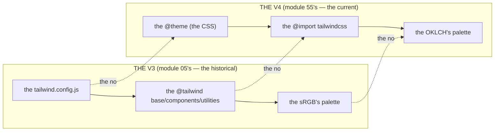

# Module 55 — Tailwind v4: The Config Is CSS, Not JavaScript

**Phase 13: UI & Design System · Module 55 of 101**

> **Where does this run?** The CSS is **`[BOTH]`** (the `globals.css` is imported in the `root layout` — the `[SERVER]` SSR produces the HTML with the classes, the `[CLIENT]` browser applies the stylesheet); the *theme* is a **`[BOTH]`** decision (the `@theme` block, module 57's). The module-55's standing rule (module 05's old-vs-modern, now the CSS): **v3's `tailwind.config.js` is a historical artifact — v4's config is CSS (`@theme` in `globals.css`), the directives are gone (`@import "tailwindcss"`), the palette is OKLCH, and the `dark:` variant is class-based only if you say so (`@custom-variant`)** (module 55's §1).

---

## 1. Concept — The config is CSS (the 5 changes from v3)

**The `@theme`** (module 55's §1.1): the *the config is the CSS* (module 55's §1.1) — the *the no `tailwind.config.js`* (module 55's §1.1) — the *module-55's line: the config is CSS* (module 55's §1.1) — the *module-05's line: the old-vs-modern* (module 05's).

**The `@import "tailwindcss"`** (module 55's §1.2): the *the no `@tailwind base`/`components`/`utilities`* (module 55's §1.2) — the *module-55's line: the `@import` is the v4's* (module 55's §1.2) — the *module-05's line: the old-vs-modern* (module 05's).

**The OKLCH** (module 55's §1.3): the *the palette is the OKLCH* (module 55's §1.3) — the *module-55's line: the palette is the OKLCH* (module 55's §1.3) — the *module-60's line: the a11y's contrast* (module 60's).

**The `@custom-variant`** (module 55's §1.4): the *the `dark:` is the class's* (module 55's §1.4) — the *the no media's default* (module 55's §1.4) — the *module-55's line: the `dark:` is the class's* (module 55's §1.4) — the *module-57's line: the dark's is the token's* (module 57's).

**The `@utility`** (module 55's §1.5): the *the custom's is the `@utility`* (module 55's §1.5) — the *module-55's line: the custom's is the `@utility`* (module 55's §1.5) — the *module-05's line: the old-vs-modern* (module 05's).

## 2. Mental Model — The 5 changes (drawn)



**The 5 changes** (the module-55's mental model):
1. **The `@theme`** (module 55's §1.1): the *the config is the CSS* — the *module-55's line: the config is CSS* (module 55's §1.1).
2. **The `@import`** (module 55's §1.2): the *the no `@tailwind`* (module 55's §1.2).
3. **The OKLCH** (module 55's §1.3): the *the palette is the OKLCH* (module 55's §1.3).
4. **The `@custom-variant`** (module 55's §1.4): the *the `dark:` is the class's* (module 55's §1.4).
5. **The `@utility`** (module 55's §1.5): the *the custom's is the `@utility`* (module 55's §1.5).

## 3. Architecture — The v4's setup (the code)

### 3.1 The `globals.css` (module 55's §3.1 — the `@import` + the `@theme`)

`FILE: app/globals.css` (production pattern — [BOTH] — the module-55's §3.1: the v4's)

```css
/* THE V4'S (module 55's §3.1 — the @import + the @theme (module 55's §1.1–1.2)) */
@import "tailwindcss";   /* the module-55's line: the @import is the v4's (module 55's §1.2) — the the no @tailwind's (module 55's §1.2) */

/* THE @THEME (module 55's §1.1) — the the config is the CSS (module 55's §1.1) — the the module-57's tokens (module 57's): */
@theme {
  --color-background: var(--background);        /* the module-57's line: the token is the CSS variable (module 57's) */
  --color-foreground: var(--foreground);
  --color-primary: var(--primary);
  --color-primary-foreground: var(--primary-foreground);
  --color-muted: var(--muted);
  --color-muted-foreground: var(--muted-foreground);
  --color-border: var(--border);
  --color-ring: var(--ring);
  --radius-sm: calc(var(--radius) - 4px);
  --radius-md: calc(var(--radius) - 2px);
  --radius-lg: var(--radius);
  --font-sans: var(--font-geist-sans);          /* the module-15's line: the font is the next/font's (module 15's) */
}

/* THE DARK'S (module 55's §1.4) — the the class's (module 55's §1.4) — the the no media's (module 55's §1.4): */
@custom-variant dark (&:where(.dark, .dark *));   /* the module-55's line: the dark: is the class's (module 55's §1.4) */
```

**The module-55's line:** the *v4's is the `@import` + the `@theme`* (module 55's §3.1) — the *the config is the CSS* (module 55's §1.1) — the *the `dark:` is the class's* (module 55's §1.4).

### 3.2 The `root layout` (module 55's §3.2 — the import)

`FILE: app/layout.tsx` (production pattern — [SERVER] — the module-55's §3.2)

```tsx
// THE ROOT LAYOUT (module 55's §3.2 — the globals.css's import (module 55's §3.2) — the the [SERVER] (module 55's §1)):
import type { Metadata } from 'next'
import { Geist } from 'next/font/google'   // the module-15's line: the font is the next/font's (module 15's)
import './globals.css'   // the module-55's line: the globals.css is the root's (module 55's §3.2)

const geistSans = Geist({ subsets: ['latin'], variable: '--font-geist-sans' })   // the module-57's line: the font is the token's (module 57's)

export const metadata: Metadata = { title: 'SaaS Platform' }

export default function RootLayout({ children }: { children: React.ReactNode }) {
  return (
    <html lang="en" suppressHydrationWarning>   // the module-57's line: the suppressHydrationWarning is the dark's (module 57's)
      <body className={geistSans.variable}>   // the module-55's line: the variable is the body's (module 55's §3.2)
        {children}
      </body>
    </html>
  )
}
```

**The module-55's line:** the *globals.css is the root's* (module 55's §3.2) — the *the font is the `next/font`'s* (module 15's) — the *the `suppressHydrationWarning` is the dark's* (module 57's).

### 3.3 The `@utility` (module 55's §3.3 — the custom's)

`FILE: app/globals.css` (production pattern — [BOTH] — the module-55's §3.3)

```css
/* THE @UTILITY (module 55's §1.5) — the the custom's (module 55's §3.3) — the the no v3's plugin (module 05's): */
@utility text-balance {
  text-wrap: balance;   /* the module-55's line: the custom's is the @utility (module 55's §1.5) */
}
```

**The module-55's line:** the *custom's is the `@utility`* (module 55's §1.5) — the *the no v3's plugin* (module 05's).

## 4. Production Code — The dark's toggle (module 55's §4)

`FILE: src/components/theme-toggle.tsx` (production pattern — [CLIENT] — the module-55's §4: the class's toggle)

```tsx
// THE DARK'S TOGGLE (module 55's §4 — the class's toggle (module 55's §1.4) — the the no localStorage's (module 43's §5)):
// 'use client'
import { useTheme } from 'next-themes'   // the module-57's line: the next-themes is the dark's (module 57's)

export function ThemeToggle() {
  const { resolvedTheme, setTheme } = useTheme()   // the module-55's line: the useTheme is the dark's (module 57's)
  return (
    <button
      onClick={() => setTheme(resolvedTheme === 'dark' ? 'light' : 'dark')}   // the module-55's line: the setTheme is the class's (module 55's §1.4)
      aria-label="Toggle theme"   // the module-60's line: the a11y's (module 60's)
    >
      {resolvedTheme === 'dark' ? 'Light' : 'Dark'}
    </button>
  )
}
```

**The module-55's line:** the *dark's toggle is the class's* (module 55's §1.4) — the *the `next-themes` is the dark's* (module 57's) — the *the no `localStorage`* (module 43's §5).

## 5. Common Mistakes (the v4's failures)

| Mistake | The symptom | Fix |
|---|---|---|
| **The `@tailwind`'s directive** (module 55's §1.2's line violated) | the *module-55's line: the `@import` is the v4's* (module 55's §1.2) — the *the `@tailwind`'s is the *v3's* (module 55's §1.2) — the *module-55's line: the `@import` is the v4's* (module 55's §1.2) — the *no `@tailwind`'s* (module 55's §1.2)* | the *the `@import "tailwindcss"`* (module 55's §1.2) — the *module-55's line: the `@import` is the v4's* (module 55's §1.2)* |
| **The `tailwind.config.js`** (module 55's §1.1's line violated) | the *module-55's line: the config is CSS* (module 55's §1.1) — the *the `tailwind.config.js` is the *v3's* (module 55's §1.1) — the *module-55's line: the config is CSS* (module 55's §1.1) — the *no `tailwind.config.js`* (module 55's §1.1)* | the *the `@theme`* (module 55's §1.1) — the *module-55's line: the config is CSS* (module 55's §1.1)* |
| **The `dark:`'s media's** (module 55's §1.4's line violated) | the *module-55's line: the `dark:` is the class's* (module 55's §1.4) — the *the `dark:`'s media's is the *v4's default* (module 55's §1.4) — the *module-55's line: the `dark:` is the class's* (module 55's §1.4) — the *no media's* (module 55's §1.4)* | the *the `@custom-variant dark`* (module 55's §1.4) — the *module-55's line: the `dark:` is the class's* (module 55's §1.4)* |
| **The `safelist`'s** (module 55's §5.1's line violated) | the *module-55's line: the `@source inline(...)` is the v4's* (module 55's §5.1) — the *the `safelist`'s is the *v3's* (module 55's §5.1) — the *module-55's line: the `@source inline(...)` is the v4's* (module 55's §5.1) — the *no `safelist`'s* (module 55's §5.1)* | the *the `@source inline(...)`* (module 55's §5.1) — the *module-55's line: the `@source inline(...)` is the v4's* (module 55's §5.1)* |
| **The `content`'s** (module 55's §5.2's line violated) | the *module-55's line: the no `content`'s* (module 55's §5.2) — the *the `content`'s is the *v3's* (module 55's §5.2) — the *module-55's line: the no `content`'s* (module 55's §5.2) — the *no `content`'s* (module 55's §5.2)* | the *the auto's detection* (module 55's §5.2) — the *module-55's line: the no `content`'s* (module 55's §5.2)* |
| **The sRGB's** (module 55's §1.3's line violated) | the *module-55's line: the palette is the OKLCH* (module 55's §1.3) — the *the sRGB's is the *v3's* (module 55's §1.3) — the *module-55's line: the palette is the OKLCH* (module 55's §1.3) — the *no sRGB's* (module 55's §1.3)* | the *the OKLCH* (module 55's §1.3) — the *module-55's line: the palette is the OKLCH* (module 55's §1.3)* |

## 6. Security Notes

- **The no `localStorage`** (module 43's §5): the *module-43's line: the no `localStorage`'s* (module 43's §5) — the *module-55's line: the no `localStorage`* (module 43's §5) — the *module-43's* *deep-dive* (module 43's).
- **The a11y's** (module 60's): the *module-60's line: the a11y's is the 4 rules* (module 60's) — the *module-55's line: the a11y's* (module 60's) — the *module-60's* *deep-dive* (module 60's).
- **The contrast's** (module 60's): the *module-60's line: the contrast's is the a11y's* (module 60's) — the *module-55's line: the contrast's* (module 60's) — the *module-60's* *deep-dive* (module 60's).

## 7. Performance Notes

- **The v4's is the fast** (module 55's §7.1): the *module-55's line: the v4's is the fast* (module 55's §7.1) — the *the Rust's engine* (module 55's §7.1) — the *the no runtime* (module 55's §7.1).
- **The OKLCH's is the fast** (module 55's §1.3): the *module-55's line: the OKLCH's is the fast* (module 55's §1.3) — the *the browser's* (module 55's §1.3).
- **The `next/font`'s is the fast** (module 15's): the *module-15's line: the font is the `next/font`'s* (module 15's) — the *module-55's line: the font is the `next/font`'s* (module 15's) — the *module-15's* *deep-dive* (module 15's).

## 8. Exercise

**Beginner.** *The v4's setup* (module 55's §3.1–3.2): the *the `globals.css`* (module 3.1's) + the *the `root layout`* (module 3.2's) — *build it* — the *artifact: the 2's* (module 20's).

**Intermediate.** *The dark's* (module 55's §1.4 + §4): the *the `@custom-variant`* (module 1.4's) + the *the `ThemeToggle`* (module 4's) — *build it* — the *artifact: the dark's log* (module 20's).

**Production.** *The `@utility`'s* (module 55's §3.3): the *the `@utility`* (module 3.3's) + the *the `@source inline(...)`* (module 5.1's) — the *artifact: the custom's log* (module 20's).

## 9. Architecture Challenge

**Prompt:** The *"the team wants to migrate a v3's app to the v4's"* (the *module-55's* *v4's* — the *module-05's* *old-vs-modern* — the *module-55's line: the config is CSS* (module 55's §1.1) — the *module-05's line: the old-vs-modern* (module 05's) — the *module-55's standing line: the config is CSS + the old-vs-modern* (module 55's §1.1 + module 05's)).

The *problems*: (1) the *the `tailwind.config.js`'s* (the *the no `tailwind.config.js`* (module 55's §1.1) — the *module-55's line: the config is CSS* (module 55's §1.1) — the *module-55's standing line: the config is CSS* (module 55's §1.1)).

(2) the *the `@tailwind`'s* (the *the no `@tailwind`'s* (module 55's §1.2) — the *module-55's line: the `@import` is the v4's* (module 55's §1.2) — the *module-55's standing line: the `@import` is the v4's* (module 55's §1.2)).

**Design**: the *the migration's* (the *the `@theme`* (module 55's §1.1) + the *the `@import "tailwindcss"`* (module 55's §1.2) + the *the `@custom-variant`* (module 55's §1.4) — the *module-55's line: the config is CSS* (module 55's §1.1) — the *module-05's line: the old-vs-modern* (module 05's) — the *module-55's standing line: the config is CSS + the `@import` is the v4's + the `dark:` is the class's + the old-vs-modern* (module 55's §1.1 + module 55's §1.2 + module 55's §1.4 + module 05's)).

Produce: the *the migration's* (the *the `@theme`* (module 55's §1.1) + the *the `@import "tailwindcss"`* (module 55's §1.2) + the *the `@custom-variant`* (module 55's §1.4) — the *module-55's line: the config is CSS* (module 55's §1.1) — the *module-05's line: the old-vs-modern* (module 05's) — the *module-55's standing line: the config is CSS + the `@import` is the v4's + the `dark:` is the class's + the old-vs-modern* (module 55's §1.1 + module 55's §1.2 + module 55's §1.4 + module 05's)).

<details>
<summary>Model answer</summary>
**The migration's** (module 55's §1.1 + module 55's §1.2 + module 55's §1.4 + module 05's):
1. **The `@theme`** (module 55's §1.1): the *the config is the CSS* (module 55's §1.1) — the *module-55's line: the config is CSS* (module 55's §1.1).
2. **The `@import`** (module 55's §1.2): the *the no `@tailwind`'s* (module 55's §1.2) — the *module-55's line: the `@import` is the v4's* (module 55's §1.2).
**The generalization** (the *migration's* pattern, the *module's* standing rule): **the *config is CSS* (module 55's §1.1) — the *the `@import` is the v4's* (module 55's §1.2) — the *the `dark:` is the class's* (module 55's §1.4) — the *the old-vs-modern* (module 05's) — the *module-55's standing line: the config is CSS + the `@import` is the v4's + the `dark:` is the class's + the old-vs-modern* (module 55's §1.1 + module 55's §1.2 + module 55's §1.4 + module 05's)*.
</details>

## 10. Official Documentation

- Tailwind CSS v4: https://tailwindcss.com/docs
- Tailwind v4: Theme: https://tailwindcss.com/docs/theme
- Tailwind v4: Dark mode: https://tailwindcss.com/docs/dark-mode
- Tailwind v4: Upgrading from v3: https://tailwindcss.com/docs/upgrade-guide
- next-themes: https://github.com/pacocoursey/next-themes
- The module-57's tokens: the module-57 (the phase-13's file-03)

## 11. What You Should Know Before Continuing

- [ ] I can state the *5 changes from v3* (module 1's: the `@theme`/`@import`/OKLCH/`@custom-variant`/`@utility`) — the *module-55's line: the config is CSS* (module 1's)
- [ ] I know the *v4's setup* (module 3.1's: the `@import` + the `@theme`) — the *the no `@tailwind`'s* (module 3.1's)
- [ ] I know the *dark's is the class's* (module 1.4's) — the *the `@custom-variant`* (module 1.4's) — the *the no media's* (module 1.4's)
- [ ] I know the *OKLCH's is the palette's* (module 1.3's)
- [ ] I know the *custom's is the `@utility`* (module 1.5's) — the *the no v3's plugin* (module 05's)
- [ ] I know the *no `localStorage`* (module 43's §5) — the *module-43's line: the no `localStorage`'s* (module 43's §5)
- [ ] I've done the *v4's setup* (module 8's beginner) + the *dark's* (module 8's intermediate) + the *`@utility`'s* (module 8's production) — the *artifacts* (module 20's)

**Next:** Module 56 — shadcn/ui Architecture (the *the registry's* — the *the CVA's* — the *the Radix's* — the *module-56's line: the shadcn's is the source's* (module 56's)).
