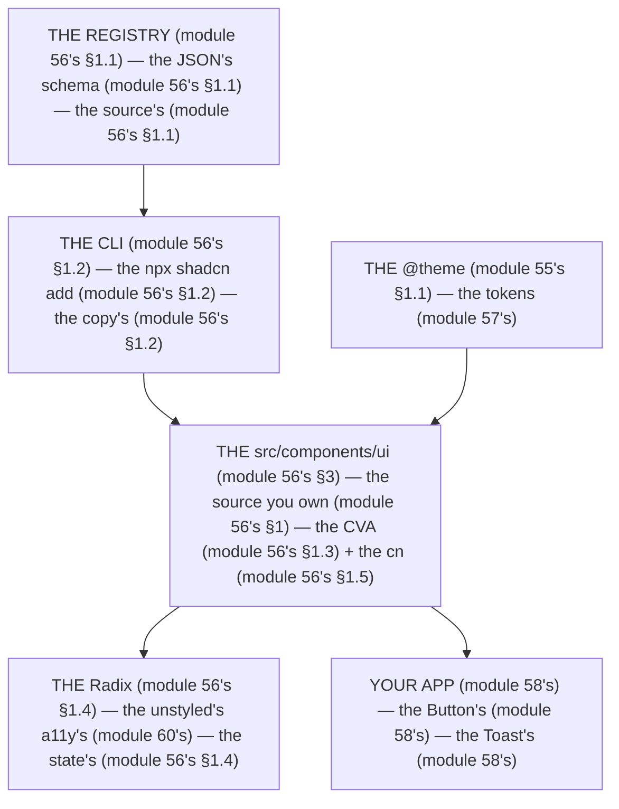

# Module 56 — shadcn/ui Architecture: Read the Source, Own the Code

**Phase 13: UI & Design System · Module 56 of 101**

> **Where does this run?** The components are **`[CLIENT]`** (the interactive `Button`, `Dialog`, `Select` — the Radix state, the DOM events); the *styles* are **`[BOTH]`** (the `@theme` tokens, module 55's, are `[SERVER]`-rendered and `[CLIENT]`-applied); the *registry* is a **build-time** tool (the CLI copies source into your repo — it is **not** an npm dependency you `import` at runtime, module 56's §1). The module-56's standing rule (module 55's, now the distribution level): **shadcn/ui is not a component *library* you depend on — it is a component *distribution* model: a `registry` of source, a CLI that copies it into `src/components/ui/`, and Radix primitives underneath that you own and can extend (module 56's §1)** (module 56's §1).

---

## 1. Concept — Distribution, not dependency (the 4 pieces)

**The registry** (module 56's §1.1): the *the JSON's schema* (module 56's §1.1) — the *the `registry:ui`/`registry:block`/`registry:lib`/`registry:hook`* (module 56's §1.1) — the *module-56's line: the registry is the source's* (module 56's §1.1) — the *module-55's line: the v4's is the `@theme`* (module 55's §1.1).

**The CLI** (module 56's §1.2): the *the `npx shadcn@latest init`/`add`/`apply`* (module 56's §1.2) — the *the `--diff`/`--dry-run`'s* (module 56's §1.2) — the *module-56's line: the CLI copies the source* (module 56's §1.2) — the *module-05's line: the old-vs-modern* (module 05's).

**The CVA** (module 56's §1.3): the *the `cva`'s* (module 56's §1.3) — the *the variants' is the type's* (module 56's §1.3) — the *module-56's line: the CVA is the variant's* (module 56's §1.3).

**The Radix** (module 56's §1.4): the *the `@radix-ui/react-*`'s* (module 56's §1.4) — the *the a11y's is the Radix's* (module 60's) — the *module-56's line: the Radix is the a11y's* (module 60's) — the *module-60's line: the a11y's is the 4 rules* (module 60's).

**The `cn()`** (module 56's §1.5): the *the `clsx` + the `tailwind-merge`'s* (module 56's §1.5) — the *module-56's line: the `cn` is the class's composition* (module 56's §1.5) — the *the no `!important`'s* (module 56's §1.5).

## 2. Mental Model — The 4 layers (drawn)



**The 4 layers** (the module-56's mental model):
1. **The registry** (module 56's §1.1): the *the JSON's schema* — the *module-56's line: the registry is the source's* (module 56's §1.1).
2. **The CLI** (module 56's §1.2): the *the copy's* — the *module-56's line: the CLI copies the source* (module 56's §1.2) — the *the `--diff`'s* (module 56's §1.2).
3. **The `src/components/ui`** (module 56's §3): the *the source you own* — the *the CVA + the `cn`* (module 56's §1.3 + §1.5).
4. **The Radix** (module 56's §1.4): the *the unstyled's a11y's* — the *module-60's line: the a11y's is the 4 rules* (module 60's).

## 3. Architecture — Read the source (the anatomy)

### 3.1 The install (module 56's §1.2 — the CLI's copy)

`FILE: terminal` (production pattern — the module-56's §3.1: the CLI's)

```bash
# THE INIT (module 56's §3.1 — the v4's (module 55's) — the the Radix's preset (module 56's §1.4)):
npx shadcn@latest init          # the module-56's line: the init generates the v4's (module 55's §1.2) — the the Radix's (module 56's §1.4)
# THE ADD (module 56's §3.1 — the copy's (module 56's §1.2)):
npx shadcn@latest add button dialog select toast   # the module-56's line: the CLI copies into src/components/ui (module 56's §1.2)
# THE DIFF (module 56's §3.1 — the the preview's (module 56's §1.2)):
npx shadcn@latest add button --diff button.tsx     # the module-56's line: the --diff is the preview's (module 56's §1.2)
# THE REGISTRY (module 56's §3.1 — the third-party's (module 56's §1.1)):
npx shadcn@latest add @magicui/shimmer-button      # the module-56's line: the @<registry>/<component> is the third-party's (module 56's §1.1)
```

**The module-56's line:** the *CLI copies the source* (module 56's §1.2) — the *the `--diff` is the preview's* (module 56's §1.2) — the *the `@<registry>/<component>` is the third-party's* (module 56's §1.1).

### 3.2 The Button's anatomy (module 56's §3.2 — the CVA + the cn + the Radix)

`FILE: src/components/ui/button.tsx` (production pattern — [CLIENT] — the module-56's §3.2: the source you own)

```tsx
// THE BUTTON (module 56's §3.2 — the CVA (module 56's §1.3) + the cn (module 56's §1.5) — the the Radix's Slot (module 56's §1.4)):
import { Slot } from '@radix-ui/react-slot'   // the module-56's line: the Slot is the Radix's (module 56's §1.4) — the the asChild (module 56's §1.4)
import { cva, type VariantProps } from 'class-variance-authority'   // the module-56's line: the cva is the variant's (module 56's §1.3)
import { cn } from '@/lib/utils'   // the module-56's line: the cn is the class's composition (module 56's §1.5)

// THE CVAR (module 56's §1.3) — the the variants' is the type's (module 56's §1.3):
const buttonVariants = cva(
  "inline-flex items-center justify-center gap-2 rounded-md text-sm font-medium transition-colors focus-visible:outline-none focus-visible:ring-2 focus-visible:ring-ring disabled:pointer-events-none disabled:opacity-50",   // the module-58's line: the states is the class's (module 58's)
  {
    variants: {   // the module-56's line: the variants' is the CVA's (module 56's §1.3)
      variant: {   // the module-58's line: the variant's is the 4's (module 58's)
        default: "bg-primary text-primary-foreground hover:bg-primary/90",
        destructive: "bg-destructive text-destructive-foreground hover:bg-destructive/90",
        outline: "border border-border bg-background hover:bg-accent",
        ghost: "hover:bg-accent hover:text-accent-foreground",
        link: "text-primary underline-offset-4 hover:underline",
      },
      size: {   // the module-58's line: the size's is the 3's (module 58's)
        sm: "h-9 px-3",
        default: "h-10 px-4",
        lg: "h-11 px-8",
      },
    },
    defaultVariants: { variant: "default", size: "default" },   // the module-56's line: the default's is the CVA's (module 56's §1.3)
  },
)

export interface ButtonProps extends React.ButtonHTMLAttributes<HTMLButtonElement>, VariantProps<typeof buttonVariants> {
  asChild?: boolean   // the module-56's line: the asChild is the Slot's (module 56's §1.4)
}

const Button = React.forwardRef<HTMLButtonElement, ButtonProps>(
  ({ className, variant, size, asChild = false, ...props }, ref) => {
    const Comp = asChild ? Slot : 'button'   // the module-56's line: the asChild is the Slot's (module 56's §1.4) — the the no double's <button> (module 56's §1.4)
    return <Comp className={cn(buttonVariants({ variant, size }), className)} ref={ref} {...props} />   // the module-56's line: the cn is the class's composition (module 56's §1.5)
  },
)
Button.displayName = 'Button'
export { Button, buttonVariants }
```

**The module-56's line:** the *CVA is the variant's* (module 56's §1.3) — the *the `cn` is the class's composition* (module 56's §1.5) — the *the `Slot` is the Radix's* (module 56's §1.4) — the *the `asChild` is the no double's `<button>`* (module 56's §1.4).

### 3.3 The `cn()` (module 56's §1.5 — the class's composition)

`FILE: src/lib/utils.ts` (production pattern — [CLIENT] — the module-56's §3.3)

```ts
// THE CN (module 56's §1.5 — the the clsx + the tailwind-merge (module 56's §1.5) — the the no !important (module 56's §1.5)):
import { clsx, type ClassValue } from 'clsx'
import { twMerge } from 'tailwind-merge'
export function cn(...inputs: ClassValue[]) {
  return twMerge(clsx(inputs))   // the module-56's line: the tailwind-merge is the conflict's (module 56's §1.5) — the the no !important (module 56's §1.5)
)
}
```

**The module-56's line:** the *`cn` = `clsx` + `tailwind-merge`* (module 56's §1.5) — the *the no `!important`* (module 56's §1.5) — the *the `tailwind-merge` resolves the conflict by order* (module 56's §1.5).

## 4. Production Code — Extend a component (module 56's §4)

`FILE: src/components/ui/button.tsx` (production pattern — [CLIENT] — the module-56's §4: the extend's)

```tsx
// THE EXTEND (module 56's §4 — the the variant's (module 56's §1.3) — the the no fork's (module 56's §1)):
// 1) ADD A VARIANT (module 56's §4) — the the variant's is the CVA's (module 56's §1.3):
//   Add "subtle" to the variant object (module 56's §1.3) — the module-56's line: the extend is the variant's (module 56's §1.3)
// 2) ADD A PROP (module 56's §4) — the the loading's (module 58's):
//   Add `loading?: boolean` to ButtonProps (module 58's) — the module-56's line: the loading is the state's (module 58's)
// 3) THE LOADING'S (module 58's) — the the no setTimeout's (module 51's §4):
//   <Button loading>...</Button> renders the spinner + the disabled (module 58's + module 51's §4) — the module-56's line: the loading is the state's (module 58's)
```

**The module-56's line:** the *extend is the variant's* (module 56's §1.3) — the *the no fork's* (module 56's §1) — the *the `loading` is the state's* (module 58's).

## 5. Common Mistakes (the distribution's failures)

| Mistake | The symptom | Fix |
|---|---|---|
| **The `import`'s** (module 56's §1's line violated) | the *module-56's line: the registry is the source's* (module 56's §1.1) — the *the `import { Button } from 'shadcn'` is the *no's* (module 56's §1) — the *module-56's line: the no import's* (module 56's §1) — the *no `import`'s* (module 56's §1)* | the *the `import { Button } from '@/components/ui/button'`* (module 56's §1) — the *module-56's line: the import is the local's* (module 56's §1)* |
| **The fork's** (module 56's §4's line violated) | the *module-56's line: the extend is the variant's* (module 56's §1.3) — the *the fork's is the *no's* (module 56's §4) — the *module-56's line: the no fork's* (module 56's §4) — the *no fork's* (module 56's §4)* | the *the variant's (module 56's §1.3) + the prop's (module 56's §4)* (module 56's §4) — the *module-56's line: the extend is the variant's* (module 56's §1.3)* |
| **The `!important`'s** (module 56's §1.5's line violated) | the *module-56's line: the no `!important`'s* (module 56's §1.5) — the *the `!important`'s is the *no's* (module 56's §1.5) — the *module-56's line: the no `!important`'s* (module 56's §1.5) — the *no `!important`'s* (module 56's §1.5)* | the *the `cn`'s (module 56's §1.5) + the variant's (module 56's §1.3)* (module 56's §1.5) — the *module-56's line: the `cn` is the class's composition* (module 56's §1.5)* |
| **The third-party's** (module 56's §1.1's line violated) | the *module-56's line: the registry is the source's* (module 56's §1.1) — the *the third-party's is the *the read's* (module 56's §1.1) — the *module-56's line: the read the source* (module 56's §1.1) — the *no read's* (module 56's §1.1)* | the *the read the source before the `add`* (module 56's §1.1) — the *module-56's line: the read the source* (module 56's §1.1)* |
| **The drift's** (module 56's §1.2's line violated) | the *module-56's line: the CLI copies the source* (module 56's §1.2) — the *the drift's is the *the `--diff`'s* (module 56's §1.2) — the *module-56's line: the `--diff` is the preview's* (module 56's §1.2) — the *no `--diff`'s* (module 56's §1.2)* | the *the `--diff`/`--dry-run` before the `add`* (module 56's §1.2) — the *module-56's line: the `--diff` is the preview's* (module 56's §1.2)* |

## 6. Security Notes

- **The read the source** (module 56's §1.1): the *module-56's line: the read the source before the `add`* (module 56's §1.1) — the *the third-party's is the supply-chain's* (module 56's §1.1) — the *module-75's* *deep-dive* (module 75's).
- **The no `import`'s** (module 56's §1): the *module-56's line: the no import's* (module 56's §1) — the *the supply-chain's is the no's* (module 56's §1) — the *module-75's* *deep-dive* (module 75's).
- **The a11y's** (module 60's): the *module-60's line: the a11y's is the 4 rules* (module 60's) — the *module-56's line: the a11y's is the Radix's* (module 60's) — the *module-60's* *deep-dive* (module 60's).

## 7. Performance Notes

- **The zero runtime** (module 56's §7.1): the *module-56's line: the no runtime's dependency* (module 56's §7.1) — the *the source's is the tree's* (module 56's §7.1).
- **The no CSS-in-JS** (module 56's §7.2): the *module-56's line: the no CSS-in-JS* (module 56's §7.2) — the *the `@theme`'s is the static's* (module 55's §1.1).
- **The `tailwind-merge`'s is the fast** (module 56's §1.5): the *module-56's line: the `tailwind-merge` is the fast* (module 56's §1.5) — the *the O(n)'s* (module 56's §1.5).

## 8. Exercise

**Beginner.** *The install's* (module 56's §3.1): the *the `init`* (module 3.1's) + the *the `add button`* (module 3.1's) — *read the source* (module 3.2's) — the *artifact: the Button's* (module 3.2's).

**Intermediate.** *The extend's* (module 56's §4): the *the variant's* (module 1.3's) + the *the `loading`'s* (module 58's) — *build it* — the *artifact: the extended's Button* (module 4's).

**Production.** *The registry's* (module 56's §1.1): the *the third-party's* (module 1.1's) + the *the `--diff`'s* (module 1.2's) — *read the source before the `add`* (module 1.1's) — the *artifact: the registry's log* (module 20's).

## 9. Architecture Challenge

**Prompt:** The *"the team wants to build a custom design system on top of shadcn/ui"* (the *module-56's* *design-system* — the *module-57's* *tokens* — the *module-56's line: the registry is the source's* (module 56's §1.1) — the *module-57's line: the token's is the CSS's* (module 57's) — the *module-56's standing line: the registry is the source's + the token's is the CSS's* (module 56's §1.1 + module 57's)).

The *problems*: (1) the *the token's* (the *the `@theme`* (module 55's §1.1) — the *module-57's line: the token's is the CSS's* (module 57's) — the *module-56's standing line: the token's is the CSS's* (module 57's)).

(2) the *the component's* (the *the CVA's* (module 56's §1.3) + the *the `cn`'s* (module 56's §1.5) — the *module-56's line: the CVA is the variant's* (module 56's §1.3) — the *module-56's standing line: the CVA is the variant's + the `cn` is the class's* (module 56's §1.3 + module 56's §1.5)).

**Design**: the *the design-system's* (the *the `@theme`* (module 55's §1.1) + the *the CVA's* (module 56's §1.3) + the *the `cn`'s* (module 56's §1.5) + the *the registry's* (module 56's §1.1) — the *module-56's line: the registry is the source's* (module 56's §1.1) — the *module-57's line: the token's is the CSS's* (module 57's) — the *module-56's standing line: the registry is the source's + the token's is the CSS's + the CVA is the variant's + the `cn` is the class's* (module 56's §1.1 + module 57's + module 56's §1.3 + module 56's §1.5)).

Produce: the *the design-system's* (the *the `@theme`* (module 55's §1.1) + the *the CVA's* (module 56's §1.3) + the *the `cn`'s* (module 56's §1.5) + the *the registry's* (module 56's §1.1) — the *module-56's line: the registry is the source's* (module 56's §1.1) — the *module-57's line: the token's is the CSS's* (module 57's) — the *module-56's standing line: the registry is the source's + the token's is the CSS's + the CVA is the variant's + the `cn` is the class's* (module 56's §1.1 + module 57's + module 56's §1.3 + module 56's §1.5)).

<details>
<summary>Model answer</summary>
**The design-system's** (module 56's §1.1 + module 57's + module 56's §1.3 + module 56's §1.5):
1. **The token's** (module 57's): the *the `@theme` is the CSS's* (module 55's §1.1) — the *module-57's line: the token's is the CSS's* (module 57's).
2. **The component's** (module 56's §1.3 + §1.5): the *the CVA is the variant's* (module 56's §1.3) — the *the `cn` is the class's* (module 56's §1.5).
**The generalization** (the *design-system's* pattern, the *module's* standing rule): **the *registry is the source's* (module 56's §1.1) — the *the token's is the CSS's* (module 57's) — the *the CVA is the variant's* (module 56's §1.3) — the *the `cn` is the class's* (module 56's §1.5) — the *module-56's standing line: the registry is the source's + the token's is the CSS's + the CVA is the variant's + the `cn` is the class's* (module 56's §1.1 + module 57's + module 56's §1.3 + module 56's §1.5)*.
</details>

## 10. Official Documentation

- shadcn/ui: https://ui.shadcn.com/docs
- shadcn/ui Registry: https://ui.shadcn.com/docs/registry
- shadcn/ui Registry Directory: https://ui.shadcn.com/docs/directory
- class-variance-authority: https://github.com/jamiebuilds/class-variance-authority
- Radix UI: https://www.radix-ui.com/docs
- tailwind-merge: https://github.com/dcastil/tailwind-merge
- The module-55's Tailwind: the module-55 (the phase-13's file-01)

## 11. What You Should Know Before Continuing

- [ ] I can state the *4 pieces* (module 1's: the registry/CLI/CVA/Radix + the `cn`) — the *module-56's line: the distribution's is the 4's* (module 1's)
- [ ] I know the *CLI copies the source* (module 1.2's) — the *the no `import`'s* (module 1's)
- [ ] I can *read the Button's source* (module 3.2's: the CVA + the `cn` + the `Slot`) — the *the `asChild` is the `Slot`'s* (module 1.4's)
- [ ] I know the *extend is the variant's* (module 4's) — the *the no fork's* (module 1's)
- [ ] I know the *`cn` = `clsx` + `tailwind-merge`* (module 1.5's) — the *the no `!important`'s* (module 1.5's)
- [ ] I know the *read the source before the `add`* (module 1.1's) — the *the third-party's is the supply-chain's* (module 1.1's)
- [ ] I've done the *install's* (module 8's beginner) + the *extend's* (module 8's intermediate) + the *registry's* (module 8's production) — the *artifacts* (module 20's)

**Next:** Module 57 — Design Tokens & Theming (the *the token's* — the *the dark's* — the *module-57's line: the token's is the CSS's* (module 57's)).
