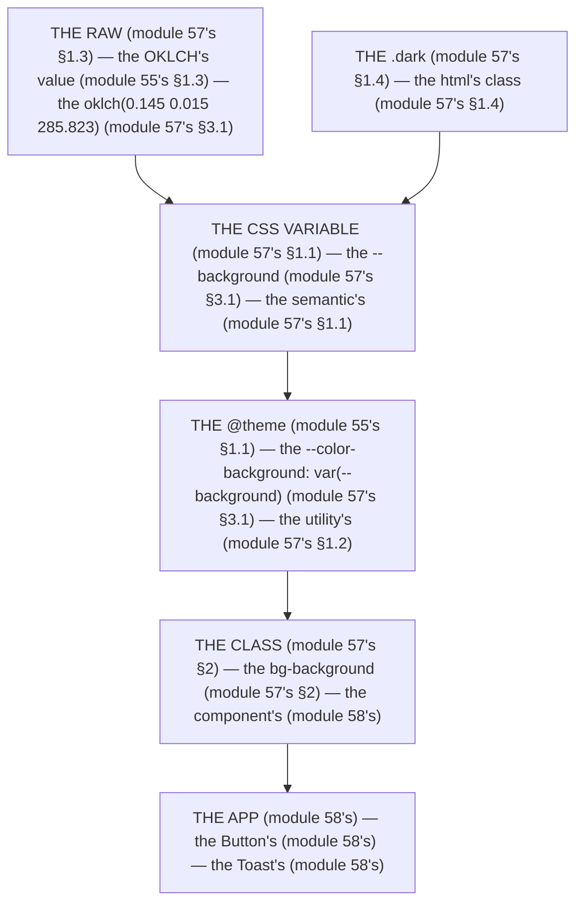

# Module 57 — Design Tokens & Theming: The Token Is the Single Source of Truth

**Phase 13: UI & Design System · Module 57 of 101**

> **Where does this run?** The tokens are **`[BOTH]`** (the `@theme` block in `globals.css` — the `[SERVER]` SSR renders the classes, the `[CLIENT]` applies the stylesheet, module 55's); the *dark switch* is **`[CLIENT]`** (the `next-themes` toggle, module 55's §4) but the *`.dark` class it sets* is read **`[BOTH]`** (the `@custom-variant dark`, module 55's §1.4). The module-57's standing rule (module 55's/56's, now the token level): **the token is a CSS variable in `@theme` — a *semantic* name (`--color-background`, never a raw hex in a component) — dark mode is a *class* on `<html>` (`@custom-variant dark`), never a media query the app cannot control (module 55's §1.4, module 57's §1)** (module 57's §1).

---

## 1. Concept — The token is the single source of truth (the 5 rules)

**The semantic's** (module 57's §1.1): the *the `--color-background`'s* (module 57's §1.1) — the *the no raw hex's* (module 57's §1.1) — the *module-57's line: the token is the semantic's* (module 57's §1.1) — the *module-55's line: the `@theme` is the CSS's* (module 55's §1.1).

**The 5 groups** (module 57's §1.2): the *the color's* — the *the spacing's* — the *the typography's* — the *the radius's* — the *the shadow's* (module 57's §1.2) — the *module-57's line: the token's is the 5 groups* (module 57's §1.2).

**The OKLCH's** (module 57's §1.3): the *the OKLCH's is the color's space* (module 55's §1.3) — the *module-57's line: the color's is the OKLCH's* (module 57's §1.3) — the *module-55's line: the palette is the OKLCH* (module 55's §1.3).

**The dark's** (module 57's §1.4): the *the `.dark` class's on `<html>`* (module 55's §1.4) — the *the no media's* (module 55's §1.4) — the *module-57's line: the dark's is the class's* (module 57's §1.4) — the *module-55's line: the `dark:` is the class's* (module 55's §1.4).

**The breakpoint's** (module 57's §1.5): the *the `--breakpoint-*`'s* (module 57's §1.5) — the *the no arbitrary's* (module 57's §1.5) — the *module-57's line: the breakpoint's is the token's* (module 57's §1.5).

## 2. Mental Model — The token's pyramid (drawn)



**The token's pyramid** (the module-57's mental model):
1. **The raw** (module 57's §1.3): the *the OKLCH's value* — the *module-57's line: the color's is the OKLCH's* (module 57's §1.3).
2. **The CSS variable** (module 57's §1.1): the *the `--background`* — the *the semantic's* (module 57's §1.1).
3. **The `@theme`** (module 55's §1.1): the *the `--color-background: var(--background)`* — the *the utility's* (module 57's §1.2).
4. **The class** (module 57's §2): the *the `bg-background`* — the *the component's* (module 58's).
5. **The `.dark`** (module 57's §1.4): the *the `html`'s class* — the *the no media's* (module 55's §1.4).

## 3. Architecture — The full token set (the code)

### 3.1 The `globals.css` (module 57's §3.1 — the 5 groups + the dark's)

`FILE: app/globals.css` (production pattern — [BOTH] — the module-57's §3.1: the token's single source)

```css
/* THE @THEME (module 55's §1.1) — the the 5 groups (module 57's §1.2) — the the semantic's (module 57's §1.1) */
@import "tailwindcss";

/* THE LIGHT'S (module 57's §1.4) — the the :root's (module 57's §3.1) */
:root {
  --background: oklch(1 0 0);                          /* the module-57's line: the semantic's is the OKLCH's (module 57's §1.1 + module 57's §1.3) */
  --foreground: oklch(0.145 0 0);
  --card: oklch(1 0 0);
  --card-foreground: oklch(0.145 0 0);
  --primary: oklch(0.205 0 0);
  --primary-foreground: oklch(0.985 0 0);
  --secondary: oklch(0.97 0 0);
  --secondary-foreground: oklch(0.205 0 0);
  --muted: oklch(0.97 0 0);
  --muted-foreground: oklch(0.556 0 0);
  --accent: oklch(0.97 0 0);
  --accent-foreground: oklch(0.205 0 0);
  --destructive: oklch(0.577 0.245 27.325);            /* the module-58's line: the destructive's is the state's (module 58's) */
  --destructive-foreground: oklch(0.985 0 0);
  --border: oklch(0.922 0 0);
  --input: oklch(0.922 0 0);
  --ring: oklch(0.708 0 0);
  --radius: 0.625rem;                                   /* the module-57's line: the radius's is the token's (module 57's §1.2) */
}

/* THE DARK'S (module 57's §1.4) — the the .dark's (module 57's §1.4) — the the no media's (module 55's §1.4) */
.dark {
  --background: oklch(0.145 0 0);
  --foreground: oklch(0.985 0 0);
  --card: oklch(0.205 0 0);
  --card-foreground: oklch(0.985 0 0);
  --primary: oklch(0.922 0 0);
  --primary-foreground: oklch(0.205 0 0);
  --secondary: oklch(0.269 0 0);
  --secondary-foreground: oklch(0.985 0 0);
  --muted: oklch(0.269 0 0);
  --muted-foreground: oklch(0.708 0 0);
  --accent: oklch(0.269 0 0);
  --accent-foreground: oklch(0.985 0 0);
  --destructive: oklch(0.704 0.191 22.216);
  --destructive-foreground: oklch(0.985 0 0);
  --border: oklch(1 0 0 / 10%);
  --input: oklch(1 0 0 / 15%);
  --ring: oklch(0.556 0 0);
}

/* THE @THEME (module 55's §1.1) — the the var's (module 57's §1.1) — the the utility's (module 57's §1.2) */
@theme inline {
  --color-background: var(--background);       /* the module-57's line: the token's is the CSS's (module 57's §1.1) */
  --color-foreground: var(--foreground);
  --color-card: var(--card);
  --color-card-foreground: var(--card-foreground);
  --color-primary: var(--primary);
  --color-primary-foreground: var(--primary-foreground);
  --color-secondary: var(--secondary);
  --color-secondary-foreground: var(--secondary-foreground);
  --color-muted: var(--muted);
  --color-muted-foreground: var(--muted-foreground);
  --color-accent: var(--accent);
  --color-accent-foreground: var(--accent-foreground);
  --color-destructive: var(--destructive);
  --color-destructive-foreground: var(--destructive-foreground);
  --color-border: var(--border);
  --color-input: var(--input);
  --color-ring: var(--ring);
  --radius-sm: calc(var(--radius) - 4px);      /* the module-57's line: the radius's is the token's (module 57's §1.2) */
  --radius-md: calc(var(--radius) - 2px);
  --radius-lg: var(--radius);
  --radius-xl: calc(var(--radius) + 4px);
  --font-sans: var(--font-geist-sans);         /* the module-55's line: the font is the next/font's (module 15's) */
}

/* THE BASE'S (module 57's §3.1) — the the border's + the body's (module 57's §3.1) */
@layer base {
  * { @apply border-border outline-ring/50; }   /* the module-57's line: the border's is the token's (module 57's §1.2) */
  body { @apply bg-background text-foreground; }   /* the module-57's line: the body's is the token's (module 57's §1.1) */
}

/* THE DARK'S VARIANT (module 55's §1.4) — the the class's (module 55's §1.4) — the the no media's (module 55's §1.4) */
@custom-variant dark (&:where(.dark, .dark *));
```

**The module-57's line:** the *semantic's is the OKLCH's* (module 57's §1.1 + §1.3) — the *the `@theme inline` maps the var's* (module 55's §1.1) — the *the dark's is the class's* (module 57's §1.4) — the *the no media's* (module 55's §1.4).

### 3.2 The `root layout` (module 57's §3.2 — the dark's bootstrap)

`FILE: app/layout.tsx` (production pattern — [SERVER] — the module-57's §3.2: the no flash's)

```tsx
// THE ROOT LAYOUT (module 57's §3.2 — the suppressHydrationWarning's (module 57's §1.4) — the the no flash's (module 57's §3.2)):
import { ThemeProvider } from 'next-themes'   // the module-55's line: the next-themes is the dark's (module 55's §4)

export default function RootLayout({ children }: { children: React.ReactNode }) {
  return (
    <html lang="en" suppressHydrationWarning>   // the module-57's line: the suppressHydrationWarning is the dark's (module 57's §1.4) — the the no flash's (module 57's §3.2)
      <body className={font.variable}>
        <ThemeProvider attribute="class" defaultTheme="system" enableSystem>   // the module-57's line: the attribute="class" is the dark's (module 57's §1.4) — the the no media's (module 55's §1.4)
          {children}
        </ThemeProvider>
      </body>
    </html>
  )
}
```

**The module-57's line:** the *`attribute="class"` is the dark's* (module 57's §1.4) — the *the `suppressHydrationWarning` is the no flash's* (module 57's §3.2) — the *the `next-themes` is the dark's* (module 55's §4).

### 3.3 The toggle (module 57's §3.3 — the no `localStorage`'s read)

`FILE: src/components/theme-toggle.tsx` (production pattern — [CLIENT] — the module-57's §3.3)

```tsx
// THE TOGGLE (module 57's §3.3 — the the setTheme's (module 55's §4) — the the no localStorage's read (module 43's §5)):
'use client'
import { useTheme } from 'next-themes'
import { Button } from '@/components/ui/button'   // the module-56's line: the import is the local's (module 56's §1)

export function ThemeToggle() {
  const { resolvedTheme, setTheme } = useTheme()   // the module-55's line: the useTheme is the dark's (module 55's §4)
  return (
    <Button variant="ghost" size="sm" onClick={() => setTheme(resolvedTheme === 'dark' ? 'light' : 'dark')} aria-label="Toggle theme">   // the module-60's line: the a11y's is the 4 rules (module 60's)
      {resolvedTheme === 'dark' ? 'Light' : 'Dark'}
    </Button>
  )
}
```

**The module-57's line:** the *`setTheme` is the class's* (module 55's §4) — the *the no `localStorage`'s read* (module 43's §5) — the *the `useTheme` is the dark's* (module 55's §4).

## 4. Production Code — Add a token (module 57's §4)

`FILE: app/globals.css` (production pattern — [BOTH] — the module-57's §4: the add's)

```css
/* THE ADD'S TOKEN (module 57's §4 — the the semantic's (module 57's §1.1) — the the no raw hex's (module 57's §1.1)):
   1) :root { --success: oklch(0.723 0.219 149.579); }      (module 57's §1.3)
   2) .dark { --success: oklch(0.723 0.219 149.579); }      (module 57's §1.4)
   3) @theme inline { --color-success: var(--success); }    (module 55's §1.1)
   4) USE: <div className="bg-success text-white">...</div> (module 57's §2) */
```

**The module-57's line:** the *add's token is the 4's* (module 57's §4) — the *the no raw hex's* (module 57's §1.1) — the *the semantic's* (module 57's §1.1).

## 5. Common Mistakes (the token's failures)

| Mistake | The symptom | Fix |
|---|---|---|
| **The raw hex's** (module 57's §1.1's line violated) | the *module-57's line: the token is the semantic's* (module 57's §1.1) — the *the raw hex's is the *no's* (module 57's §1.1) — the *module-57's line: the no raw hex's* (module 57's §1.1) — the *no raw hex's* (module 57's §1.1)* | the *the `bg-background`'s (module 57's §1.1) — the *module-57's line: the token is the semantic's* (module 57's §1.1)* |
| **The media's** (module 57's §1.4's line violated) | the *module-57's line: the dark's is the class's* (module 57's §1.4) — the *the media's is the *no's* (module 57's §1.4) — the *module-57's line: the no media's* (module 55's §1.4) — the *no media's* (module 55's §1.4)* | the *the `@custom-variant dark`'s (module 55's §1.4) — the *module-57's line: the dark's is the class's* (module 57's §1.4)* |
| **The flash's** (module 57's §3.2's line violated) | the *module-57's line: the no flash's* (module 57's §3.2) — the *the flash's is the *the `suppressHydrationWarning`'s* (module 57's §3.2) — the *module-57's line: the `suppressHydrationWarning` is the no flash's* (module 57's §3.2) — the *no `suppressHydrationWarning`'s* (module 57's §3.2)* | the *the `suppressHydrationWarning`'s (module 57's §3.2) + the `attribute="class"`'s (module 57's §1.4)* — the *module-57's line: the no flash's* (module 57's §3.2)* |
| **The `localStorage`'s** (module 43's §5's line violated) | the *module-43's line: the no `localStorage`'s* (module 43's §5) — the *the `localStorage`'s is the *no's* (module 43's §5) — the *module-57's line: the no `localStorage`'s* (module 43's §5) — the *no `localStorage`'s* (module 43's §5)* | the *the `next-themes`'s (module 55's §4) — the *module-57's line: the `next-themes` is the dark's* (module 55's §4)* |
| **The `!`'s color's** (module 57's §1.3's line violated) | the *module-57's line: the color's is the OKLCH's* (module 57's §1.3) — the *the `!`'s is the *no's* (module 57's §1.3) — the *module-57's line: the color's is the OKLCH's* (module 57's §1.3) — the *no `!`'s* (module 57's §1.3)* | the *the OKLCH's (module 57's §1.3) — the *module-57's line: the color's is the OKLCH's* (module 57's §1.3)* |

## 6. Security Notes

- **The no `localStorage`** (module 43's §5): the *module-43's line: the no `localStorage`'s* (module 43's §5) — the *module-57's line: the no `localStorage`'s* (module 43's §5) — the *module-43's* *deep-dive* (module 43's).
- **The contrast's** (module 60's): the *module-60's line: the contrast's is the a11y's* (module 60's) — the *module-57's line: the OKLCH's is the contrast's* (module 60's) — the *module-60's* *deep-dive* (module 60's).
- **The no flash's** (module 57's §3.2): the *module-57's line: the no flash's* (module 57's §3.2) — the *the XSS's is the no's* (module 75's) — the *module-75's* *deep-dive* (module 75's).

## 7. Performance Notes

- **The token's is the static** (module 57's §7.1): the *module-57's line: the token's is the static's* (module 57's §7.1) — the *the no runtime's* (module 57's §7.1).
- **The OKLCH's is the fast** (module 55's §1.3): the *module-55's line: the OKLCH's is the fast* (module 55's §1.3) — the *the browser's* (module 55's §1.3).
- **The no flash's is the UX's** (module 57's §3.2): the *module-57's line: the no flash's* (module 57's §3.2) — the *the TTFB's is the no flash's* (module 57's §3.2).

## 8. Exercise

**Beginner.** *The token's set* (module 57's §3.1): the *the `:root`'s* + the *the `.dark`'s* + the *the `@theme inline`'s* — *build it* — the *artifact: the 3's* (module 20's).

**Intermediate.** *The dark's* (module 57's §3.2 + §3.3): the *the `ThemeProvider`'s* + the *the `ThemeToggle`'s* — *build it* — the *artifact: the dark's log* (module 20's).

**Production.** *The add's token* (module 57's §4): the *the 4's* (module 4's: `:root`/`.dark`/`@theme`/use) — *build it* — the *artifact: the token's log* (module 20's).

## 9. Architecture Challenge

**Prompt:** The *"the design team wants a brand token system with 3 themes (light/dark/high-contrast)"* (the *module-57's* *theming* — the *module-55's* *Tailwind* — the *module-57's line: the token is the semantic's* (module 57's §1.1) — the *module-55's line: the `@theme` is the CSS's* (module 55's §1.1) — the *module-57's standing line: the token is the semantic's + the dark's is the class's* (module 57's §1.1 + module 57's §1.4)).

The *problems*: (1) the *the theme's* (the *the `:root`/`.dark`'s* (module 57's §3.1) — the *module-57's line: the theme's is the class's* (module 57's §1.4) — the *module-57's standing line: the theme's is the class's* (module 57's §1.4)).

(2) the *the high-contrast's* (the *the `.contrast`'s (module 57's §1.4) — the *module-60's line: the contrast's is the a11y's* (module 60's) — the *module-57's standing line: the high-contrast's is the class's* (module 57's §1.4)).

**Design**: the *the 3-themes's* (the *the `:root`/`.dark`/`.contrast`'s* (module 57's §3.1) + the *the `@custom-variant`'s* (module 55's §1.4) — the *module-57's line: the theme's is the class's* (module 57's §1.4) — the *module-60's line: the contrast's is the a11y's* (module 60's) — the *module-57's standing line: the theme's is the class's + the high-contrast's is the a11y's* (module 57's §1.4 + module 60's)).

Produce: the *the 3-themes's* (the *the `:root`/`.dark`/`.contrast`'s* (module 57's §3.1) + the *the `@custom-variant`'s* (module 55's §1.4) — the *module-57's line: the theme's is the class's* (module 57's §1.4) — the *module-60's line: the contrast's is the a11y's* (module 60's) — the *module-57's standing line: the theme's is the class's + the high-contrast's is the a11y's* (module 57's §1.4 + module 60's)).

<details>
<summary>Model answer</summary>
**The 3-themes's** (module 57's §3.1 + module 55's §1.4 + module 60's):
1. **The theme's** (module 57's §1.4): the *the class's is the theme's* — the *module-57's line: the theme's is the class's* (module 57's §1.4).
2. **The high-contrast's** (module 60's): the *the `.contrast`'s is the a11y's* — the *module-60's line: the contrast's is the a11y's* (module 60's).
**The generalization** (the *3-themes's* pattern, the *module's* standing rule): **the *theme's is the class's* (module 57's §1.4) — the *the high-contrast's is the a11y's* (module 60's) — the *module-57's standing line: the theme's is the class's + the high-contrast's is the a11y's* (module 57's §1.4 + module 60's)*.
</details>

## 10. Official Documentation

- Tailwind v4: Dark mode: https://tailwindcss.com/docs/dark-mode
- Tailwind v4: Theme: https://tailwindcss.com/docs/theme
- Tailwind v4: Colors: https://tailwindcss.com/docs/color
- next-themes: https://github.com/pacocoursey/next-themes
- OKLCH: https://developer.mozilla.org/en-US/docs/Web/CSS/color_value/oklch
- The module-55's Tailwind: the module-55 (the phase-13's file-01)
- The module-56's shadcn: the module-56 (the phase-13's file-02)

## 11. What You Should Know Before Continuing

- [ ] I can state the *5 rules* (module 1's: the semantic's/5 groups/OKLCH/dark's/breakpoint's) — the *module-57's line: the token's is the 5's* (module 1's)
- [ ] I know the *token's pyramid* (module 2's: the raw → the var → the `@theme` → the class → the `.dark`) — the *the no raw hex's* (module 1.1's)
- [ ] I know the *dark's is the class's* (module 1.4's) — the *the no media's* (module 55's §1.4)
- [ ] I know the *no flash's* (module 3.2's) — the *the `suppressHydrationWarning`'s + the `attribute="class"`'s* (module 3.2's)
- [ ] I know the *no `localStorage`'s* (module 43's §5) — the *the `next-themes` is the dark's* (module 55's §4)
- [ ] I know the *add's token is the 4's* (module 4's) — the *the no raw hex's* (module 1.1's)
- [ ] I've done the *token's set* (module 8's beginner) + the *dark's* (module 8's intermediate) + the *add's token* (module 8's production) — the *artifacts* (module 20's)

**Next:** Module 58 — Component Patterns & States (the *the Button's* — the *the Toast's* — the *module-58's line: the state's is the 7's* (module 58's)).
