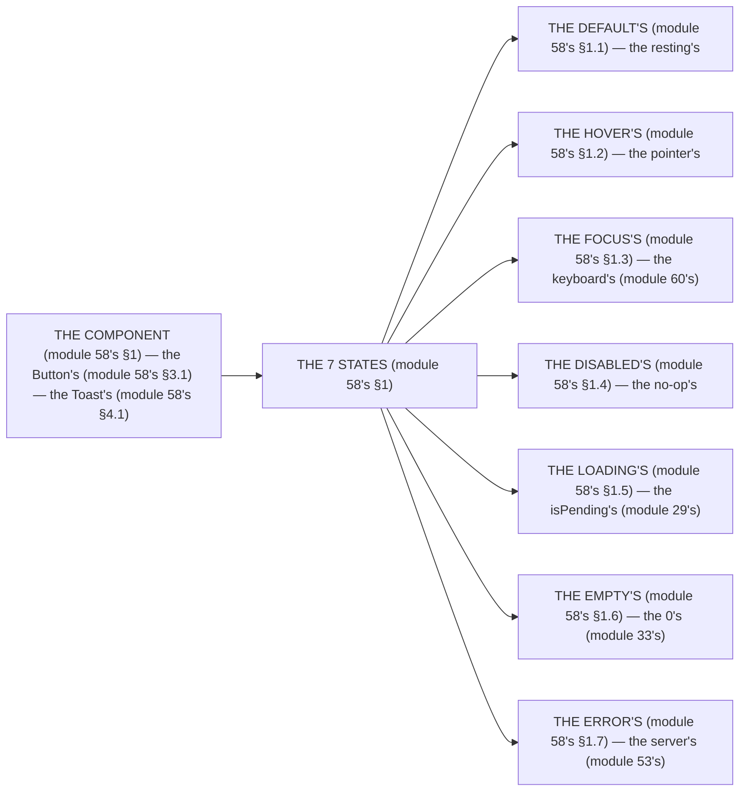

# Module 58 — Component Patterns & States: Every Component Has the 7 States

**Phase 13: UI & Design System · Module 58 of 101**

> **Where does this run?** The components are **`[CLIENT]`** (the `Button`, `Toast`, the RHF wiring from module 52's); the *state the server sends* (the `formError`, module 53's) is **`[BOTH]`** (the DTO travels, the component renders it). The module-58's standing rule (module 51's/53's, now the component level): **every component has the 7 states — default / hover / focus / disabled / loading / empty / error — and a component that ships without all 7 is *not* done (module 58's §1); the `loading` is the real `isPending` (module 29's), never a `setTimeout` (module 51's §4)** (module 58's §1).

---

## 1. Concept — The 7 states (the completeness rule)

**The default's** (module 58's §1.1): the *the resting's* (module 58's §1.1) — the *module-58's line: the default's is the resting's* (module 58's §1.1).

**The hover's** (module 58's §1.2): the *the pointer's* (module 58's §1.2) — the *module-58's line: the hover's is the pointer's* (module 58's §1.2) — the *module-60's line: the hover's is the no focus's* (module 60's).

**The focus's** (module 58's §1.3): the *the keyboard's* (module 60's) — the *module-58's line: the focus's is the keyboard's* (module 60's) — the *module-60's line: the focus's is the ring's* (module 60's).

**The disabled's** (module 58's §1.4): the *the no-op's* (module 58's §1.4) — the *module-58's line: the disabled's is the no-op's* (module 58's §1.4) — the *module-60's line: the disabled's is the a11y's* (module 60's).

**The loading's** (module 58's §1.5): the *the `isPending`'s* (module 29's) — the *the no `setTimeout`'s* (module 51's §4) — the *module-58's line: the loading's is the `isPending`'s* (module 29's).

**The empty's** (module 58's §1.6): the *the 0's row's* (module 58's §1.6) — the *module-58's line: the empty's is the 0's* (module 58's §1.6) — the *module-33's line: the empty's is the state's* (module 33's).

**The error's** (module 58's §1.7): the *the `formError`/`fieldError`'s* (module 53's) — the *module-58's line: the error's is the server's* (module 53's) — the *module-31's line: the error's is the truth's* (module 31's).

## 2. Mental Model — The state's matrix (drawn)



**The state's matrix** (the module-58's mental model): a component is a *function of state* (module 58's §1) — the 7 states are the *domain* (module 58's §1) — the class is the *codomain* (module 58's §2).

## 3. Architecture — The Button's 7 states (the code)

### 3.1 The Button (module 58's §3.1 — the 7 states on one component)

`FILE: src/components/ui/button.tsx` (production pattern — [CLIENT] — the module-58's §3.1: the state's class)

```tsx
// THE BUTTON (module 58's §3.1 — the 7 states (module 58's §1) — the the cva's (module 56's §1.3)):
const buttonVariants = cva(
  /* THE DEFAULT'S (module 58's §1.1) — the resting's (module 58's §1.1) */
  "inline-flex items-center justify-center gap-2 rounded-md text-sm font-medium",
  /* THE FOCUS'S (module 58's §1.3) — the keyboard's (module 60's) — the the ring's (module 60's) */
  "focus-visible:outline-none focus-visible:ring-2 focus-visible:ring-ring focus-visible:ring-offset-2",
  /* THE HOVER'S (module 58's §1.2) — the pointer's (module 58's §1.2) — the the transition's (module 59's) */
  "transition-colors",
  /* THE DISABLED'S (module 58's §1.4) — the no-op's (module 58's §1.4) */
  "disabled:pointer-events-none disabled:opacity-50",
  {
    variants: {
      variant: {
        default: "bg-primary text-primary-foreground hover:bg-primary/90",      // the module-58's line: the hover's is the /90 (module 58's §1.2)
        destructive: "bg-destructive text-destructive-foreground hover:bg-destructive/90",
        outline: "border border-input bg-background hover:bg-accent hover:text-accent-foreground",
        ghost: "hover:bg-accent hover:text-accent-foreground",
        secondary: "bg-secondary text-secondary-foreground hover:bg-secondary/80",
        link: "text-primary underline-offset-4 hover:underline",
      },
      size: {
        default: "h-10 px-4 py-2",
        sm: "h-9 rounded-md px-3",
        lg: "h-11 rounded-md px-8",
        icon: "h-10 w-10",
      },
      loading: {   // THE LOADING'S (module 58's §1.5) — the the isPending's (module 29's) — the the no setTimeout's (module 51's §4)
        true: "relative pointer-events-none opacity-70",   // the module-58's line: the loading's is the pointer-events-none (module 58's §1.5)
      },
    },
    defaultVariants: { variant: "default", size: "default", loading: false },
  },
)
```

**The module-58's line:** the *state's is the class's* (module 58's §3.1) — the *the `focus-visible` is the keyboard's* (module 60's) — the *the `loading` is the `isPending`'s* (module 29's).

### 3.2 The Button's render (module 58's §3.2 — the spinner + the disabled's merge)

`FILE: src/components/ui/button.tsx` (production pattern — [CLIENT] — the module-58's §3.2)

```tsx
// THE RENDER (module 58's §3.2 — the spinner's (module 58's §1.5) — the the loading's + the disabled's (module 58's §1.4)):
export interface ButtonProps extends React.ButtonHTMLAttributes<HTMLButtonElement>, VariantProps<typeof buttonVariants> {
  asChild?: boolean
  loading?: boolean   // the module-58's line: the loading's is the prop's (module 58's §1.5)
}

const Button = React.forwardRef<HTMLButtonElement, ButtonProps>(
  ({ className, variant, size, asChild = false, loading = false, disabled, children, ...props }, ref) => {
    const Comp = asChild ? Slot : 'button'
    return (
      <Comp
        className={cn(buttonVariants({ variant, size, loading }), className)}
        ref={ref}
        disabled={disabled || loading}   // the module-58's line: the loading's is the disabled's (module 58's §1.4 + module 58's §1.5) — the the no double-click's (module 51's §4)
        aria-busy={loading || undefined}   // the module-60's line: the aria-busy is the loading's (module 60's)
        aria-disabled={disabled || undefined}   // the module-60's line: the aria-disabled is the disabled's (module 60's)
        {...props}
      >
        {loading && <LoaderCircle className="size-4 animate-spin" aria-hidden="true" />}   // the module-58's line: the spinner's is the aria-hidden (module 60's)
        {children}
      </Comp>
    )
  },
)
```

**The module-58's line:** the *`disabled || loading` is the no double-click's* (module 51's §4) — the *the `aria-busy` is the loading's* (module 60's) — the *the spinner's is the `aria-hidden`* (module 60's).

### 3.3 The empty's (module 58's §1.6 — the 0's state)

`FILE: src/components/empty-state.tsx` (production pattern — [CLIENT] — the module-58's §3.3)

```tsx
// THE EMPTY'S (module 58's §1.6 — the the 0's row (module 58's §1.6) — the the no table's (module 58's §1.6)):
export function EmptyState({ title, description, action }: { title: string; description?: string; action?: React.ReactNode }) {
  return (
    <div className="flex flex-col items-center justify-center gap-2 py-12 text-center">
      <h3 className="text-sm font-medium">{title}</h3>   // the module-58's line: the empty's is the title's (module 58's §1.6)
      {description && <p className="text-sm text-muted-foreground">{description}</p>}
      {action}   // the module-58's line: the empty's is the CTA's (module 58's §1.6) — the the no dead-end's (module 58's §1.6)
    </div>
  )
}
// USE: <EmptyState title="No products yet" description="Add your first product to get started." action={<Button onClick={...}>Add product</Button>} />
```

**The module-58's line:** the *empty's is the CTA's* (module 58's §1.6) — the *the no dead-end's* (module 58's §1.6).

## 4. Production Code — The Toast's (module 58's §4)

`FILE: src/components/ui/toast.tsx` (production pattern — [CLIENT] — the module-58's §4.1: the success's + the error's)

```tsx
// THE TOAST (module 58's §4.1 — the the success's (module 58's §4.1) — the the error's (module 53's) — the the auto-dismiss's (module 58's §4.2)):
'use client'
import { cva } from 'class-variance-authority'
import { cn } from '@/lib/utils'   // the module-56's line: the cn is the class's (module 56's §1.5)
import { useToast } from '@/components/ui/use-toast'   // the module-58's line: the toast's is the context's (module 58's §4.3)

const toastVariants = cva(
  "pointer-events-auto rounded-lg border p-4 shadow-lg",
  { variants: { variant: { default: "bg-background text-foreground", destructive: "bg-destructive text-destructive-foreground" } } },   // the module-58's line: the variant's is the success's + the error's (module 58's §4.1)
)

export function Toaster() {   // THE MOUNT'S (module 58's §4.3) — the the root's (module 58's §4.3)
  const { toasts } = useToast()
  return (
    <div aria-live="polite" aria-atomic="true" className="fixed bottom-0 right-0 z-50 flex max-h-screen w-full flex-col gap-2 p-4 sm:w-96">   // the module-60's line: the aria-live is the toast's (module 60's)
      {toasts.map(({ id, title, description, variant }) => (
        <div key={id} className={cn(toastVariants({ variant }), 'animate-in slide-in-from-bottom-2')} role={variant === 'destructive' ? 'alert' : 'status'}>   // the module-60's line: the role=alert is the error's (module 60's)
          <div className="grid gap-1">
            <p className="text-sm font-semibold">{title}</p>
            {description && <p className="text-sm opacity-90">{description}</p>}
          </div>
        </div>
      ))}
    </div>
  )
}
// THE CALL (module 58's §4.1) — the the success's (module 58's §4.1):
// toast({ title: 'Product created', variant: 'default' })   // the module-58's line: the success's is the toast's (module 58's §4.1)
// THE CALL (module 58's §4.1) — the the error's (module 53's):
// toast({ title: 'Create failed', description: formError, variant: 'destructive' })   // the module-58's line: the error's is the server's (module 53's)
```

**The module-58's line:** the *toast's is the `aria-live`'s* (module 60's) — the *the `role=alert` is the error's* (module 60's) — the *the success's is the `default`'s variant* (module 58's §4.1).

### 4.2 The toast's provider (module 58's §4.3 — the context's)

`FILE: src/components/ui/toaster.tsx` + `src/components/ui/use-toast.ts` (production pattern — [CLIENT] — the module-58's §4.3)

```tsx
// THE PROVIDER'S (module 58's §4.3) — the the context's (module 58's §4.3) — the the no localStorage's (module 43's §5):
// 'use client'
// - ToasterProvider holds the toasts[] state (module 58's §4.3) — the the add/remove/auto-dismiss (module 58's §4.2)
// - useToast() returns { toasts, toast, dismiss } (module 58's §4.3) — the the caller's (module 58's §4.1)
// MOUNT in the root layout [CLIENT boundary]: <Toaster /> (module 58's §4.3)
```

**The module-58's line:** the *provider's is the context's* (module 58's §4.3) — the *the no `localStorage`'s* (module 43's §5) — the *the mount's is the root's* (module 58's §4.3).

## 5. Common Mistakes (the state's failures)

| Mistake | The symptom | Fix |
|---|---|---|
| **The `setTimeout`'s** (module 58's §1.5's line violated) | the *module-58's line: the loading's is the `isPending`'s* (module 29's) — the *the `setTimeout`'s is the *no's* (module 51's §4) — the *module-58's line: the no `setTimeout`'s* (module 51's §4) — the *no `setTimeout`'s* (module 51's §4)* | the *the `useActionState`'s `isPending` (module 29's) — the *module-58's line: the loading's is the `isPending`'s* (module 29's)* |
| **The `hover`'s no `focus`** (module 58's §1.3's line violated) | the *module-58's line: the focus's is the keyboard's* (module 60's) — the *the `hover`'s is the *the `focus-visible`'s* (module 58's §1.3) — the *module-58's line: the focus's is the ring's* (module 60's) — the *no `focus-visible`'s* (module 58's §1.3)* | the *the `focus-visible:ring-2`'s (module 58's §1.3) — the *module-58's line: the focus's is the ring's* (module 60's)* |
| **The dead-end's** (module 58's §1.6's line violated) | the *module-58's line: the empty's is the CTA's* (module 58's §1.6) — the *the dead-end's is the *no's* (module 58's §1.6) — the *module-58's line: the no dead-end's* (module 58's §1.6) — the *no dead-end's* (module 58's §1.6)* | the *the `EmptyState`'s action's (module 58's §1.6) — the *module-58's line: the empty's is the CTA's* (module 58's §1.6)* |
| **The double-click's** (module 58's §1.5's line violated) | the *module-58's line: the loading's is the disabled's* (module 58's §1.4 + §1.5) — the *the double-click's is the *no's* (module 51's §4) — the *module-58's line: the no double-click's* (module 51's §4) — the *no double-click's* (module 51's §4)* | the *the `disabled={disabled || loading}`'s (module 58's §1.5) — the *module-58's line: the loading's is the disabled's* (module 58's §1.5)* |
| **The `role`'s** (module 58's §4.1's line violated) | the *module-60's line: the `aria-live` is the toast's* (module 60's) — the *the `role`'s is the *no's* (module 60's) — the *module-58's line: the `role=alert` is the error's* (module 60's) — the *no `role`'s* (module 60's)* | the *the `role={destructive ? 'alert' : 'status'}`'s (module 58's §4.1) — the *module-60's line: the `role=alert` is the error's* (module 60's)* |

## 6. Security Notes

- **The no `localStorage`** (module 43's §5): the *module-43's line: the no `localStorage`'s* (module 43's §5) — the *module-58's line: the no `localStorage`'s* (module 43's §5) — the *module-43's* *deep-dive* (module 43's).
- **The XSS's** (module 75's): the *module-75's line: the XSS's is the no `dangerouslySetInnerHTML`'s* (module 75's) — the *module-58's line: the toast's is the no `dangerouslySetInnerHTML`'s* (module 75's) — the *module-75's* *deep-dive* (module 75's).
- **The a11y's** (module 60's): the *module-60's line: the a11y's is the 4 rules* (module 60's) — the *module-58's line: the state's is the a11y's* (module 60's) — the *module-60's* *deep-dive* (module 60's).

## 7. Performance Notes

- **The state's is the class's** (module 58's §7.1): the *module-58's line: the state's is the class's* (module 58's §7.1) — the *the no runtime's reflow's* (module 58's §7.1).
- **The `transition`'s is the GPU's** (module 59's): the *module-59's line: the transition's is the GPU's* (module 59's) — the *module-58's line: the transition's is the `transition-colors`'s* (module 58's §1.2).
- **The toast's is the fixed's** (module 58's §4.1): the *module-58's line: the toast's is the fixed's* (module 58's §4.1) — the *the no layout-shift's* (module 58's §4.1).

## 8. Exercise

**Beginner.** *The Button's 7 states* (module 58's §3.1–3.2): the *the cva's* (module 56's §1.3) + the *the `loading`'s* (module 58's §1.5) — *build it* — the *artifact: the Button's* (module 3.1's).

**Intermediate.** *The empty's* (module 58's §3.3): the *the `EmptyState`'s* (module 3.3's) + the *the CTA's* (module 1.6's) — *build it* — the *artifact: the empty's* (module 3.3's).

**Production.** *The Toast's* (module 58's §4): the *the provider's* (module 4.3's) + the *the `aria-live`'s* (module 60's) + the *the success's/error's* (module 58's §4.1) — *build it* — the *artifact: the Toast's* (module 4.1's).

## 9. Architecture Challenge

**Prompt:** The *"the team says a data table has no loading, empty, or error state"* (the *module-58's* *states* — the *module-33's* *skeleton* — the *module-58's line: the state's is the 7's* (module 58's §1) — the *module-33's line: the empty's is the state's* (module 33's) — the *module-58's standing line: the state's is the 7's* (module 58's §1)).

The *problems*: (1) the *the loading's* (the *the `isPending`'s* (module 29's) — the *module-58's line: the loading's is the `isPending`'s* (module 29's) — the *module-58's standing line: the loading's is the `isPending`'s* (module 29's)).

(2) the *the error's* (the *the `formError`'s* (module 53's) — the *module-58's line: the error's is the server's* (module 53's) — the *module-58's standing line: the error's is the server's* (module 53's)).

**Design**: the *the table's 7 states* (the *the `Skeleton`'s* (module 33's) + the *the `EmptyState`'s* (module 58's §1.6) + the *the `FormError`'s* (module 53's) — the *module-58's line: the state's is the 7's* (module 58's §1) — the *module-33's line: the empty's is the state's* (module 33's) — the *module-58's standing line: the state's is the 7's* (module 58's §1)).

Produce: the *the table's 7 states* (the *the `Skeleton`'s* (module 33's) + the *the `EmptyState`'s* (module 58's §1.6) + the *the `FormError`'s* (module 53's) — the *module-58's line: the state's is the 7's* (module 58's §1) — the *module-33's line: the empty's is the state's* (module 33's) — the *module-58's standing line: the state's is the 7's* (module 58's §1)).

<details>
<summary>Model answer</summary>
**The table's 7 states** (module 33's + module 58's §1.6 + module 53's):
1. **The loading's** (module 29's): the *the `isPending`'s is the loading's* — the *module-58's line: the loading's is the `isPending`'s* (module 29's).
2. **The empty's** (module 33's): the *the `EmptyState`'s is the 0's* — the *module-33's line: the empty's is the state's* (module 33's).
3. **The error's** (module 53's): the *the `FormError`'s is the server's* — the *module-58's line: the error's is the server's* (module 53's).
**The generalization** (the *7-states* pattern, the *module's* standing rule): **the *state's is the 7's* (module 58's §1) — the *module-58's standing line: the state's is the 7's* (module 58's §1)*.
</details>

## 10. Official Documentation

- shadcn/ui Button: https://ui.shadcn.com/docs/components/radix/button
- shadcn/ui Toast: https://ui.shadcn.com/docs/components/radix/toast
- Tailwind v4: Focus variants: https://tailwindcss.com/docs/focus
- WAI-ARIA `aria-live`: https://developer.mozilla.org/en-US/docs/Web/Accessibility/ARIA/ARIA_Live_Regions
- The module-56's shadcn: the module-56 (the phase-13's file-02)
- The module-57's tokens: the module-57 (the phase-13's file-03)

## 11. What You Should Know Before Continuing

- [ ] I can state the *7 states* (module 1's: default/hover/focus/disabled/loading/empty/error) — the *module-58's line: the state's is the 7's* (module 1's)
- [ ] I know the *loading's is the `isPending`'s* (module 1.5's) — the *the no `setTimeout`'s* (module 51's §4)
- [ ] I know the *focus's is the `focus-visible`'s* (module 1.3's) — the *the ring's* (module 60's)
- [ ] I know the *empty's is the CTA's* (module 1.6's) — the *the no dead-end's* (module 1.6's)
- [ ] I know the *toast's is the `aria-live`'s* (module 4.1's) — the *the `role=alert` is the error's* (module 60's)
- [ ] I know the *`disabled || loading` is the no double-click's* (module 3.2's) — the *module-51's line: the pending's is the state's* (module 51's §4)
- [ ] I've done the *Button's 7 states* (module 8's beginner) + the *empty's* (module 8's intermediate) + the *Toast's* (module 8's production) — the *artifacts* (module 20's)

**Next:** Module 59 — Animation (the *the Motion's* — the *the View Transitions'* — the *module-59's line: the animation's is the reduced-motion's* (module 59's)).
