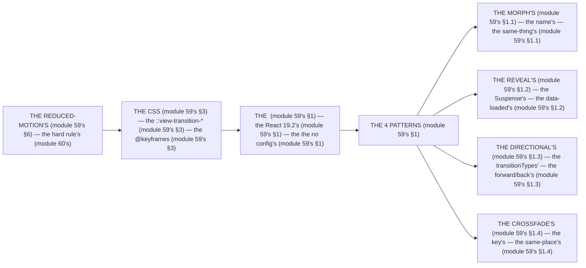

# Module 59 — Animation: Motion, View Transitions, and Reduced Motion

**Phase 13: UI & Design System · Module 59 of 101**

> **Where does this run?** The wrappers are **`[BOTH]`** (the `<ViewTransition>` is declared in `page.tsx` — the `[SERVER]` component — but the animation itself runs **`[CLIENT]`**, in the browser's compositor, module 59's §1); the CSS is **`[BOTH]`** (the `@keyframes` in `globals.css` — module 55's). The module-59's standing rule (module 58's/60's, now the motion level): **animation is *meaning*, not decoration — the 4 patterns each answer a different user question (morph = "same thing, going deeper", reveal = "data loaded", directional = "forward/back", crossfade = "same place, different content"), and `prefers-reduced-motion` is a hard rule, not a nicety (module 59's §1, §6)** (module 59's §1).

---

## 1. Concept — Animation is meaning (the 4 patterns)

**The morph's** (module 59's §1.1): the *the `name`'s identity* (module 59's §1.1) — the *module-59's line: the morph's is the same-thing's* (module 59's §1.1) — the *the no library's* (module 59's §1.1).

**The reveal's** (module 59's §1.2): the *the `Suspense`'s handoff* (module 59's §1.2) — the *module-59's line: the reveal's is the data-loaded's* (module 59's §1.2) — the *module-33's line: the skeleton's is the loading's* (module 33's).

**The directional's** (module 59's §1.3): the *the `transitionTypes`'s* (module 59's §1.3) — the *module-59's line: the directional's is the forward/back's* (module 59's §1.3) — the *the browser-back's is the no-type's* (module 59's §1.3).

**The crossfade's** (module 59's §1.4): the *the `key`'s swap* (module 59's §1.4) — the *module-59's line: the crossfade's is the same-place's* (module 59's §1.4).

**The reduced-motion's** (module 59's §6): the *the `@media (prefers-reduced-motion: reduce)`'s* (module 59's §6) — the *module-59's line: the reduced-motion's is the hard rule's* (module 60's) — the *module-60's line: the a11y's is the 4 rules* (module 60's).

## 2. Mental Model — The 4 patterns (drawn)



**The 4 patterns** (the module-59's mental model):
1. **The morph's** (module 59's §1.1): the *the `name`'s* — the *module-59's line: the morph's is the same-thing's* (module 59's §1.1).
2. **The reveal's** (module 59's §1.2): the *the `Suspense`'s* — the *module-59's line: the reveal's is the data-loaded's* (module 59's §1.2).
3. **The directional's** (module 59's §1.3): the *the `transitionTypes`'s* — the *module-59's line: the directional's is the forward/back's* (module 59's §1.3).
4. **The crossfade's** (module 59's §1.4): the *the `key`'s* — the *module-59's line: the crossfade's is the same-place's* (module 59's §1.4).

## 3. Architecture — The 4 patterns (the code)

### 3.1 The morph (module 59's §1.1 — the shared element)

`FILE: src/components/product-card.tsx` + `FILE: app/products/[id]/page.tsx` (production pattern — [BOTH] — the module-59's §3.1: the identity's)

```tsx
// THE MORPH (module 59's §1.1 — the the name's (module 59's §1.1) — the the no library's (module 59's §1.1)):
// 'use client'
import { ViewTransition } from 'react'   // the module-59's line: the ViewTransition is the React 19.2's (module 59's §1) — the the no config's (module 59's §1)
import Image from 'next/image'
import Link from 'next/link'

// THE GRID (module 59's §3.1) — the the name's is the id's (module 59's §1.1):
export function ProductCard({ product }: { product: { id: string; image: string; name: string } }) {
  return (
    <Link href={`/products/${product.id}`}>
      <ViewTransition name={`product-${product.id}`} share="morph" default="none">   // the module-59's line: the share="morph" is the customize's (module 59's §1.1) — the the default="none" is the no-unrelated's (module 59's §1.1)
        <Image src={product.image} alt={product.name} width={400} height={300} />
      </ViewTransition>
    </Link>
  )
}

// THE DETAIL (module 59's §3.1) — the the SAME name's (module 59's §1.1) — the the morph's (module 59's §1.1):
export default function ProductPage({ params }: { params: Promise<{ id: string }> }) {
  const { id } = React.use(params)   // the module-03's line: the params is the Promise (module 3's)
  return (
    <ViewTransition name={`product-${id}`} share="morph" default="none">   // the module-59's line: the same name's is the morph's (module 59's §1.1)
      {/* the hero image (module 59's §3.1) */}
    </ViewTransition>
  )
}
```

```css
/* THE MORPH'S CSS (module 59's §3.1) — the the ::view-transition-image-pair (module 59's §1.1) */
::view-transition-group(.morph) {
  animation-duration: 400ms;   /* the module-59's line: the 400ms is the soft's (module 59's §1.1) */
}
::view-transition-image-pair(.morph) {
  animation-name: via-blur;   /* the module-59's line: the blur is the artifact's (module 59's §1.1) */
}
@keyframes via-blur {
  30% { filter: blur(3px); }   /* the module-59's line: the blur hides the pixel's (module 59's §1.1) */
}
```

**The module-59's line:** the *`name` is the identity's* (module 59's §1.1) — the *the `share="morph"` is the customize's* (module 59's §1.1) — the *the `default="none"` is the no-unrelated's* (module 59's §1.1) — the *the no library's* (module 59's §1.1).

### 3.2 The reveal (module 59's §1.2 — the Suspense's handoff)

`FILE: app/products/[id]/page.tsx` (production pattern — [BOTH] — the module-59's §3.2: the asymmetric's timing)

```tsx
// THE REVEAL (module 59's §1.2 — the the Suspense's (module 59's §1.2) — the the exit's + the enter's (module 59's §1.2)):
import { Suspense, ViewTransition } from 'react'

export default function ProductPage({ params }: { params: Promise<{ id: string }> }) {
  const { id } = React.use(params)
  return (
    <Suspense
      fallback={
        <ViewTransition exit="slide-down" default="none">   // the module-59's line: the exit's is the fast's (module 59's §1.2) — the the 150ms (module 59's §3.3)
          <ProductSkeleton />   /* the module-33's line: the skeleton's is the loading's (module 33's) */
        </ViewTransition>
      }
    >
      <ViewTransition enter="slide-up" default="none">   // the module-59's line: the enter's is the gentle's (module 59's §1.2) — the the 400ms (module 59's §3.3)
        <ProductContent id={id} />
      </ViewTransition>
    </Suspense>
  )
}
```

**The module-59's line:** the *exit's is the fast's* (module 59's §1.2) — the *the enter's is the gentle's* (module 59's §1.2) — the *the `default="none"` is the no-unrelated's* (module 59's §1.1).

### 3.3 The CSS's timing (module 59's §3.3 — the asymmetric's)

`FILE: app/globals.css` (production pattern — [BOTH] — the module-59's §3.3)

```css
:root {
  --duration-exit: 150ms;      /* the module-59's line: the exit's is the fast's (module 59's §1.2) */
  --duration-enter: 210ms;     /* the module-59's line: the enter's fade is the delayed's (module 59's §1.2) */
  --duration-move: 400ms;      /* the module-59's line: the enter's move is the longer's (module 59's §1.2) */
}

::view-transition-old(.slide-down) {   /* the module-59's line: the old's is the exit's (module 59's §1.2) */
  animation: var(--duration-exit) ease-out both fade reverse, var(--duration-exit) ease-out both slide-y reverse;
}
::view-transition-new(.slide-up) {     /* the module-59's line: the new's is the enter's (module 59's §1.2) — the the delay's (module 59's §3.3) */
  animation: var(--duration-enter) ease-in var(--duration-exit) both fade, var(--duration-move) ease-in both slide-y;
}
@keyframes fade {
  from { filter: blur(3px); opacity: 0; }
  to { filter: blur(0); opacity: 1; }
}
@keyframes slide-y {
  from { transform: translateY(10px); }
  to { transform: translateY(0); }
}
```

**The module-59's line:** the *asymmetric's timing* (module 59's §3.3) — the *the `var(--duration-exit)` delay on the enter fade* (module 59's §3.3) — the *the old leaves before the new arrives* (module 59's §1.2).

### 3.4 The directional (module 59's §1.3 — the `transitionTypes`'s)

`FILE: src/components/nav.tsx` + `FILE: app/products/[id]/page.tsx` (production pattern — [BOTH] — the module-59's §3.4)

```tsx
// THE DIRECTIONAL (module 59's §1.3 — the the transitionTypes' (module 59's §1.3) — the the page.tsx's (module 59's §3.4) — the the no layout's (module 59's §3.4)):
// THE LINK'S (module 59's §3.4) — the the nav-forward's (module 59's §1.3):
<Link href={`/products/${product.id}`} transitionTypes={['nav-forward']}>   {/* the module-59's line: the transitionTypes is the tag's (module 59's §1.3) */}

// THE BACK'S (module 59's §3.4) — the the nav-back's (module 59's §1.3):
<Link href="/products" transitionTypes={['nav-back']}>← Products</Link>   {/* the module-59's line: the nav-back is the back's (module 59's §1.3) */}

// THE PAGE'S WRAPPER (module 59's §3.4) — the the page.tsx's (module 59's §3.4) — the the no layout's (module 59's §3.4):
<ViewTransition
  enter={{ 'nav-forward': 'nav-forward', 'nav-back': 'nav-back', default: 'none' }}   {/* the module-59's line: the enter's is the type's map (module 59's §1.3) */}
  exit={{ 'nav-forward': 'nav-forward', 'nav-back': 'nav-back', default: 'none' }}
  default="none"
>
  {/* the page content (module 59's §3.4) */}
</ViewTransition>
```

```css
/* THE DIRECTIONAL'S CSS (module 59's §3.4) — the the slide's (module 59's §1.3) */
::view-transition-old(.nav-forward) { --slide-offset: -60px; animation: 150ms ease-in both fade reverse, 400ms ease-in-out both slide reverse; }
::view-transition-new(.nav-forward) { --slide-offset: 60px; animation: 210ms ease-out 150ms both fade, 400ms ease-in-out both slide; }
::view-transition-old(.nav-back) { --slide-offset: 60px; animation: 150ms ease-in both fade reverse, 400ms ease-in-out both slide reverse; }
::view-transition-new(.nav-back) { --slide-offset: -60px; animation: 210ms ease-out 150ms both fade, 400ms ease-in-out both slide; }
@keyframes slide {
  from { translate: var(--slide-offset); }
  to { translate: 0; }
}
```

**The module-59's line:** the *`transitionTypes` is the tag's* (module 59's §1.3) — the *the wrapper is the `page.tsx`'s* (module 59's §3.4) — the *the no layout's* (module 59's §3.4) — the *the browser-back's is the no-type's* (module 59's §1.3).

### 3.5 The crossfade (module 59's §1.4 — the same-route's)

`FILE: app/collection/[slug]/page.tsx` (production pattern — [BOTH] — the module-59's §3.5)

```tsx
// THE CROSSFADE (module 59's §1.4 — the the key's (module 59's §1.4) — the the share="auto" (module 59's §1.4)):
import { Suspense, ViewTransition } from 'react'

export default function CollectionPage({ params }: { params: Promise<{ slug: string }> }) {
  const { slug } = React.use(params)
  return (
    <Suspense fallback={<CollectionSkeleton />}>
      <ViewTransition
        key={slug}   /* the module-59's line: the key's is the swap's (module 59's §1.4) */
        name="collection-content"
        share="auto"   /* the module-59's line: the share="auto" is the crossfade's (module 59's §1.4) */
        enter="auto"
        default="none"
      >
        <CollectionGrid slug={slug} />
      </ViewTransition>
    </Suspense>
  )
}
```

**The module-59's line:** the *`key` is the swap's* (module 59's §1.4) — the *the `share="auto"` is the crossfade's* (module 59's §1.4) — the *the same-place's* (module 59's §1.4).

### 3.6 The anchor + the interactivity (module 59's §3.6 — the header's + the pointer's)

`FILE: src/components/header.tsx` + `FILE: app/globals.css` (production pattern — [BOTH] — the module-59's §3.6)

```tsx
// THE ANCHOR'S (module 59's §3.6) — the the viewTransitionName's (module 59's §3.6) — the the no-move's (module 59's §3.6):
<header style={{ viewTransitionName: 'site-header' }}>   {/* the module-59's line: the header's is the anchor's (module 59's §3.6) */}
```

```css
/* THE ANCHOR'S CSS (module 59's §3.6) — the the no-move's (module 59's §3.6) */
::view-transition-group(site-header) { animation: none; z-index: 100; }   /* the module-59's line: the header's is the z-100 (module 59's §3.6) */
::view-transition-old(site-header) { display: none; }   /* the module-59's line: the old's is the no-flash's (module 59's §3.6) */
::view-transition-new(site-header) { animation: none; }

/* THE INTERACTIVITY'S (module 59's §3.6) — the the pointer's (module 59's §3.6) */
::view-transition { pointer-events: none; }   /* the module-59's line: the pointer's is the pass-through's (module 59's §3.6) */
```

**The module-59's line:** the *header's is the anchor's* (module 59's §3.6) — the *the `pointer-events: none` is the pass-through's* (module 59's §3.6) — the *the keep-it-short's* (module 59's §3.6).

## 4. Production Code — The micro-interactions (module 59's §4)

`FILE: app/globals.css` (production pattern — [BOTH] — the module-59's §4: the `tw-animate-css`'s + the `transition`'s)

```css
/* THE TW-ANIMATE-CSI (module 59's §4.1) — the the shadcn's (module 56's) — the the animate-in's (module 59's §4.1):
   @import "tw-animate-css";   (module 59's §4.1) — the the no @tailwindcss/animate's (module 59's §4.1) */

/* THE HOVER'S (module 59's §4.2) — the the transition-colors' (module 58's §1.2) — the the GPU's (module 59's §7):
   .card { transition: transform 200ms ease, box-shadow 200ms ease; }   (module 59's §4.2)
   .card:hover { transform: translateY(-2px); }   (module 59's §4.2) — the the no layout's (module 59's §4.2) */

/* THE @STARTING-STYLE (module 59's §4.3) — the the enter's (module 59's §4.3) — the the no keyframe's (module 59's §4.3):
   .toast { @starting-style { opacity: 0; transform: translateY(10px); } }   (module 59's §4.3)
   .toast { opacity: 1; transform: translateY(0); transition: opacity 150ms ease, transform 150ms ease; }   (module 59's §4.3) */
```

**The module-59's line:** the *`tw-animate-css` is the shadcn's* (module 56's) — the *the `transform` is the GPU's* (module 59's §7) — the *the `@starting-style` is the enter's* (module 59's §4.3).

## 5. Common Mistakes (the motion's failures)

| Mistake | The symptom | Fix |
|---|---|---|
| **The library's** (module 59's §1.1's line violated) | the *module-59's line: the no library's* (module 59's §1.1) — the *the library's is the *no's* (module 59's §1.1) — the *module-59's line: the no library's* (module 59's §1.1) — the *no library's* (module 59's §1.1)* | the *the `<ViewTransition>`'s (module 59's §1) — the *module-59's line: the no library's* (module 59's §1.1)* |
| **The layout's** (module 59's §3.4's line violated) | the *module-59's line: the wrapper is the `page.tsx`'s* (module 59's §3.4) — the *the layout's is the *no's* (module 59's §3.4) — the *module-59's line: the no layout's* (module 59's §3.4) — the *no layout's* (module 59's §3.4)* | the *the `page.tsx`'s wrapper (module 59's §3.4) — the *module-59's line: the wrapper is the `page.tsx`'s* (module 59's §3.4)* |
| **The reduced-motion's** (module 59's §6's line violated) | the *module-59's line: the reduced-motion's is the hard rule's* (module 60's) — the *the reduced-motion's is the *no's* (module 59's §6) — the *module-59's line: the no reduced-motion's* (module 59's §6) — the *no reduced-motion's* (module 59's §6)* | the *the `@media (prefers-reduced-motion: reduce)`'s (module 59's §6) — the *module-59's line: the reduced-motion's is the hard rule's* (module 60's)* |
| **The pointer's** (module 59's §3.6's line violated) | the *module-59's line: the pointer's is the pass-through's* (module 59's §3.6) — the *the pointer's is the *no's* (module 59's §3.6) — the *module-59's line: the no pointer's* (module 59's §3.6) — the *no pointer's* (module 59's §3.6)* | the *the `::view-transition { pointer-events: none }`'s (module 59's §3.6) — the *module-59's line: the pointer's is the pass-through's* (module 59's §3.6)* |
| **The `default`'s** (module 59's §1.1's line violated) | the *module-59's line: the `default="none"` is the no-unrelated's* (module 59's §1.1) — the *the `default`'s is the *no's* (module 59's §1.1) — the *module-59's line: the no `default`'s* (module 59's §1.1) — the *no `default`'s* (module 59's §1.1)* | the *the `default="none"`'s (module 59's §1.1) — the *module-59's line: the `default="none"` is the no-unrelated's* (module 59's §1.1)* |
| **The `transform`'s layout's** (module 59's §4.2's line violated) | the *module-59's line: the `transform` is the GPU's* (module 59's §7) — the *the layout's is the *no's* (module 59's §4.2) — the *module-59's line: the no layout's* (module 59's §4.2) — the *no layout's* (module 59's §4.2)* | the *the `transform`'s (module 59's §4.2) — the *module-59's line: the `transform` is the GPU's* (module 59's §7)* |

## 6. Security Notes

- **The reduced-motion's** (module 60's): the *module-60's line: the a11y's is the 4 rules* (module 60's) — the *module-59's line: the reduced-motion's is the hard rule's* (module 60's) — the *module-60's* *deep-dive* (module 60's).
- **The no JS's** (module 59's §1.1): the *module-59's line: the no library's* (module 59's §1.1) — the *the XSS's is the no's* (module 75's) — the *module-75's* *deep-dive* (module 75's).

## 7. Performance Notes

- **The `transform`'s is the GPU's** (module 59's §7.1): the *module-59's line: the `transform` is the GPU's* (module 59's §7.1) — the *the no layout's* (module 59's §7.1).
- **The `opacity`'s is the GPU's** (module 59's §7.2): the *module-59's line: the `opacity` is the GPU's* (module 59's §7.2) — the *the no reflow's* (module 59's §7.2).
- **The no library's** (module 59's §1.1): the *module-59's line: the no library's* (module 59's §1.1) — the *the 3KB's* (module 59's §1.1).

## 8. Exercise

**Beginner.** *The morph's* (module 59's §3.1): the *the `name`'s* (module 3.1's) + the *the `share="morph"`'s* (module 3.1's) — *build it* — the *artifact: the morph's* (module 3.1's).

**Intermediate.** *The reveal's + the directional's* (module 59's §3.2 + §3.4): the *the `Suspense`'s* (module 3.2's) + the *the `transitionTypes`'s* (module 3.4's) — *build it* — the *artifact: the reveal's + the directional's* (module 3.2's + module 3.4's).

**Production.** *The crossfade's + the reduced-motion's* (module 59's §3.5 + §6): the *the `key`'s* (module 3.5's) + the *the `@media (prefers-reduced-motion: reduce)`'s* (module 6's) — *build it* — the *artifact: the crossfade's + the reduced-motion's* (module 3.5's + module 6's).

## 9. Architecture Challenge

**Prompt:** The *"the team wants a cinematic product-detail experience (morph + reveal + directional) without a 100KB animation library"* (the *module-59's* *animation* — the *module-58's* *states* — the *module-59's line: the no library's* (module 59's §1.1) — the *module-58's line: the state's is the 7's* (module 58's §1) — the *module-59's standing line: the no library's + the reduced-motion's* (module 59's §1.1 + module 59's §6)).

The *problems*: (1) the *the morph's* (the *the `name`'s* (module 59's §1.1) — the *module-59's line: the morph's is the same-thing's* (module 59's §1.1) — the *module-59's standing line: the morph's is the same-thing's* (module 59's §1.1)).

(2) the *the reduced-motion's* (the *the `@media`'s* (module 59's §6) — the *module-59's line: the reduced-motion's is the hard rule's* (module 60's) — the *module-59's standing line: the reduced-motion's is the hard rule's* (module 60's)).

**Design**: the *the cinematic's* (the *the morph's* (module 59's §1.1) + the *the reveal's* (module 59's §1.2) + the *the directional's* (module 59's §1.3) + the *the reduced-motion's* (module 59's §6) — the *module-59's line: the no library's* (module 59's §1.1) — the *module-59's standing line: the no library's + the reduced-motion's* (module 59's §1.1 + module 59's §6)).

Produce: the *the cinematic's* (the *the morph's* (module 59's §1.1) + the *the reveal's* (module 59's §1.2) + the *the directional's* (module 59's §1.3) + the *the reduced-motion's* (module 59's §6) — the *module-59's line: the no library's* (module 59's §1.1) — the *module-59's standing line: the no library's + the reduced-motion's* (module 59's §1.1 + module 59's §6)).

<details>
<summary>Model answer</summary>
**The cinematic's** (module 59's §1.1 + module 59's §1.2 + module 59's §1.3 + module 59's §6):
1. **The morph's** (module 59's §1.1): the *the `name`'s is the same-thing's* — the *module-59's line: the morph's is the same-thing's* (module 59's §1.1).
2. **The reveal's** (module 59's §1.2): the *the `Suspense`'s is the data-loaded's* — the *module-59's line: the reveal's is the data-loaded's* (module 59's §1.2).
3. **The reduced-motion's** (module 59's §6): the *the `@media`'s is the hard rule's* — the *module-59's line: the reduced-motion's is the hard rule's* (module 60's).
**The generalization** (the *cinematic's* pattern, the *module's* standing rule): **the *no library's* (module 59's §1.1) — the *the reduced-motion's is the hard rule's* (module 60's) — the *module-59's standing line: the no library's + the reduced-motion's* (module 59's §1.1 + module 59's §6)*.
</details>

## 10. Official Documentation

- Next.js: View Transitions: https://nextjs.org/docs/app/guides/view-transitions
- React: `ViewTransition`: https://react.dev/reference/react/ViewTransition
- Next.js: `Link` `transitionTypes`: https://nextjs.org/docs/app/api-reference/components/link#transitiontypes
- MDN: View Transitions API: https://developer.mozilla.org/en-US/docs/Web/API/View_Transition_API
- MDN: `prefers-reduced-motion`: https://developer.mozilla.org/en-US/docs/Web/CSS/@media/prefers-reduced-motion
- tw-animate-css: https://github.com/wombosvideo/tw-animate-css
- The module-58's states: the module-58 (the phase-13's file-04)

## 11. What You Should Know Before Continuing

- [ ] I can state the *4 patterns* (module 1's: the morph's/reveal's/directional's/crossfade's) — the *module-59's line: the pattern's is the 4's* (module 1's)
- [ ] I know the *`name` is the identity's* (module 1.1's) — the *the no library's* (module 1.1's)
- [ ] I know the *`default="none"` is the no-unrelated's* (module 1.1's)
- [ ] I know the *wrapper is the `page.tsx`'s* (module 3.4's) — the *the no layout's* (module 3.4's)
- [ ] I know the *`transitionTypes` is the tag's* (module 1.3's) — the *the browser-back's is the no-type's* (module 1.3's)
- [ ] I know the *reduced-motion's is the hard rule's* (module 6's) — the *the `@media`'s* (module 6's)
- [ ] I know the *`transform` is the GPU's* (module 7.1's) — the *the no layout's* (module 7.1's)
- [ ] I've done the *morph's* (module 8's beginner) + the *reveal's/directional's* (module 8's intermediate) + the *crossfade's/reduced-motion's* (module 8's production) — the *artifacts* (module 20's)

**Next:** Module 60 — Accessibility (the *the keyboard's* — the *the focus's* — the *module-60's line: the a11y's is the 4 rules* (module 60's)).
