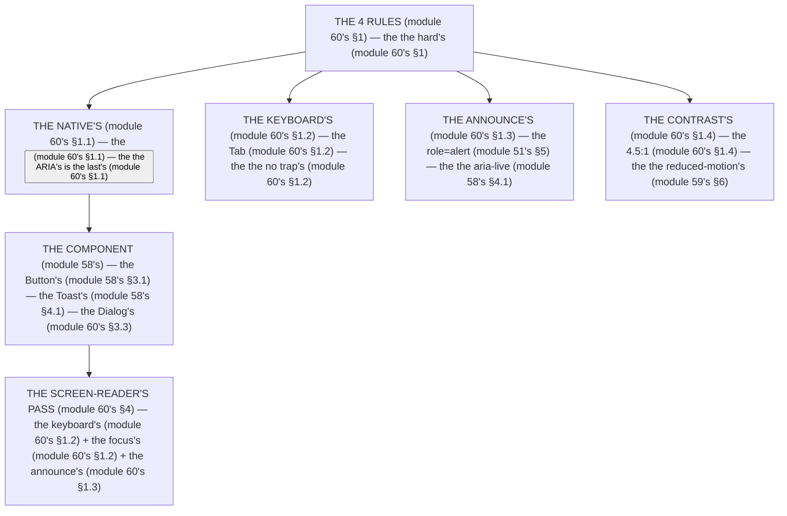

# Module 60 — Accessibility: The 4 Rules, and the Screen-Reader Pass

**Phase 13: UI & Design System · Module 60 of 101**

> **Where does this run?** The a11y is **`[CLIENT]`** (the DOM, the focus, the ARIA — the browser's rendering) but the *server's truth* (the `formError`, module 53's) is **`[BOTH]`** (the DTO travels, the `role="alert"` announces it). The module-60's standing rule (module 51's/58's, now the a11y level): **the 4 rules — (1) native first, ARIA only when native cannot do it; (2) every interactive element is keyboard-reachable with a visible focus; (3) every dynamic state (error, loading, toast, empty) is announced (`role="alert"` / `aria-live`); (4) contrast ≥ 4.5:1 and `prefers-reduced-motion` respected (module 60's §1)** (module 60's §1).

---

## 1. Concept — The 4 rules (the completeness rule)

**The native's** (module 60's §1.1): the *the `<button>`'s over the `<div onClick>`* (module 60's §1.1) — the *module-60's line: the native's is the first's* (module 60's §1.1) — the *the ARIA's is the last's* (module 60's §1.1).

**The keyboard's** (module 60's §1.2): the *the Tab's* + the *the Enter's* + the *the Esc's* (module 60's §1.2) — the *module-60's line: the keyboard's is the reachable's* (module 60's §1.2) — the *the no trap's* (module 60's §1.2).

**The announce's** (module 60's §1.3): the *the `role="alert"`'s* (module 51's §5) + the *the `aria-live`'s* (module 58's §4.1) + the *the `aria-busy`'s* (module 58's §3.2) — the *module-60's line: the announce's is the state's* (module 60's §1.3) — the *module-53's line: the error's is the truth's* (module 53's).

**The contrast's** (module 60's §1.4): the *the 4.5:1's* (module 60's §1.4) — the *module-60's line: the contrast's is the 4.5's* (module 60's §1.4) — the *module-57's line: the OKLCH's is the contrast's* (module 57's §1.3).

## 2. Mental Model — The a11y's pyramid (drawn)



**The a11y's pyramid** (the module-60's mental model):
1. **The native's** (module 60's §1.1): the *the `<button>`* — the *module-60's line: the native's is the first's* (module 60's §1.1).
2. **The keyboard's** (module 60's §1.2): the *the Tab/Enter/Esc* — the *the no trap's* (module 60's §1.2).
3. **The announce's** (module 60's §1.3): the *the `role="alert"`/`aria-live`* — the *module-60's line: the announce's is the state's* (module 60's §1.3).
4. **The contrast's** (module 60's §1.4): the *the 4.5:1* — the *the reduced-motion's* (module 59's §6).

## 3. Architecture — The 4 rules (the code)

### 3.1 The native's (module 60's §1.1 — the `<button>`'s)

`FILE: src/components/confirm-button.tsx` (production pattern — [CLIENT] — the module-60's §3.1)

```tsx
// THE NATIVE'S (module 60's §1.1 — the the <button> (module 60's §1.1) — the the no <div onClick>'s (module 60's §1.1)):
// ✅ CORRECT (module 60's §3.1) — the the native's (module 60's §1.1):
<button type="button" onClick={handleConfirm} aria-label="Confirm order">Confirm</button>   /* the module-60's line: the <button> is the native's (module 60's §1.1) */

// ❌ WRONG (module 60's §3.1) — the the <div onClick>'s (module 60's §1.1):
// <div onClick={handleConfirm}>Confirm</div>   /* the module-60's line: the no <div onClick>'s (module 60's §1.1) — the the no keyboard's (module 60's §1.2) */

// ✅ THE RADIX'S (module 60's §3.1) — the the Radix's is the native's + the ARIA's (module 56's §1.4):
// <Dialog> from shadcn (module 56's) — the the Radix's Dialog (module 56's §1.4) — the the focus-trap's (module 60's §3.3) — the the Esc's (module 60's §1.2)
```

**The module-60's line:** the *`<button>` is the native's* (module 60's §1.1) — the *the no `<div onClick>`'s* (module 60's §1.1) — the *the Radix's is the native's + the ARIA's* (module 56's §1.4).

### 3.2 The keyboard's (module 60's §1.2 — the Tab's + the focus's)

`FILE: src/components/keyboard-demo.tsx` (production pattern — [CLIENT] — the module-60's §3.2)

```tsx
// THE KEYBOARD'S (module 60's §1.2 — the the Tab's (module 60's §1.2) — the the focus-visible's (module 58's §1.3)):
// THE FOCUS'S RING (module 58's §1.3) — the the focus-visible's (module 58's §1.3) — the the no outline-none's (module 60's §1.2):
// className="focus-visible:outline-none focus-visible:ring-2 focus-visible:ring-ring focus-visible:ring-offset-2"   (module 58's §1.3)
// THE NO TRAP'S (module 60's §1.2) — the the Esc's (module 60's §1.2) — the the focus-restore's (module 60's §3.2):
// - The Dialog's (module 56's §1.4) traps focus + restores it on close (module 60's §3.2)
// - The <input> is Tab-reachable (module 60's §1.2) — the the no tabIndex={-1} on the form's (module 60's §1.2)
// - The Enter's submits the <form> (module 51's) — the the no onClick-only's (module 60's §1.2)
```

**The module-60's line:** the *`focus-visible` is the ring's* (module 58's §1.3) — the *the no trap's* (module 60's §1.2) — the *the focus-restore's* (module 60's §3.2) — the *the Enter's submits the `<form>`* (module 51's).

### 3.3 The dialog's (module 60's §3.3 — the focus-trap's + the restore's)

`FILE: src/components/ui/dialog.tsx` (production pattern — [CLIENT] — the module-60's §3.3: the Radix's)

```tsx
// THE DIALOG'S (module 60's §3.3 — the the Radix's (module 56's §1.4) — the the focus-trap's (module 60's §3.3) — the the aria-modal's (module 60's §1.3)):
// 'use client'
// import * as DialogPrimitive from '@radix-ui/react-dialog'   (module 56's §1.4)
// - <DialogPrimitive.Root> — the the open/onOpenChange (module 60's §3.3)
// - <DialogPrimitive.Portal> — the the teleport's (module 60's §3.3)
// - <DialogPrimitive.Overlay> — the the backdrop's (module 60's §3.3) — the the aria-hidden (module 60's §1.3)
// - <DialogPrimitive.Content> — the the aria-modal="true" (module 60's §1.3) — the the focus-trap's (module 60's §3.3) — the the Esc's (module 60's §1.2) — the the focus-restore's (module 60's §3.2)
// - <DialogPrimitive.Title> — the the heading's (module 60's §1.3) — the the no empty's <Title> (module 60's §3.3)
// - <DialogPrimitive.Close> — the the close's (module 60's §1.2)
// THE RULE (module 60's §3.3): the the <Title> is REQUIRED (module 60's §3.3) — the the screen-reader's (module 60's §1.3)
```

**The module-60's line:** the *Radix's is the focus-trap's* (module 60's §3.3) — the *the `aria-modal="true"`'s* (module 60's §1.3) — the *the `<Title>` is the required's* (module 60's §3.3) — the *the focus-restore's* (module 60's §3.2).

### 3.4 The announce's (module 60's §1.3 — the `role="alert"`'s)

`FILE: src/components/form-error.tsx` (production pattern — [CLIENT] — the module-60's §3.4: the 3 announces)

```tsx
// THE ANNOUNCE'S (module 60's §1.3 — the the role="alert" (module 51's §5) — the the aria-live (module 58's §4.1) — the the aria-busy (module 58's §3.2)):
// 1) THE ERROR'S (module 51's §5) — the the role="alert" (module 60's §1.3):
<p id="email-error" role="alert" className="text-sm text-destructive">{error}</p>   /* the module-60's line: the role="alert" is the error's (module 60's §1.3) */

// 2) THE TOAST'S (module 58's §4.1) — the the aria-live (module 60's §1.3):
<div aria-live="polite" aria-atomic="true">   {/* the module-60's line: the aria-live is the toast's (module 60's §1.3) */}

// 3) THE LOADING'S (module 58's §3.2) — the the aria-busy (module 60's §1.3):
<button aria-busy={loading || undefined}>   {/* the module-60's line: the aria-busy is the loading's (module 60's §1.3) */}

// THE FIELD'S (module 51's §5) — the the aria-describedby (module 60's §1.3):
<input id="email" aria-invalid={!!error} aria-describedby={error ? 'email-error' : undefined} />   /* the module-60's line: the aria-describedby is the error's id (module 60's §1.3) */
```

**The module-60's line:** the *`role="alert"` is the error's* (module 60's §1.3) — the *the `aria-live` is the toast's* (module 60's §1.3) — the *the `aria-busy` is the loading's* (module 60's §1.3) — the *the `aria-describedby` is the error's id* (module 60's §1.3).

### 3.5 The contrast's (module 60's §1.4 — the 4.5:1's)

`FILE: app/globals.css` (production pattern — [BOTH] — the module-60's §3.5: the token's + the check's)

```css
/* THE CONTRAST'S (module 60's §1.4 — the the 4.5:1 (module 60's §1.4) — the the OKLCH's (module 57's §1.3)):
   1) THE TOKEN'S (module 57's §1.1) — the the semantic's (module 57's §1.1):
      --foreground: oklch(0.145 0 0);   (module 57's §3.1) — the the 4.5:1 on the --background (module 60's §1.4)
   2) THE MUTED'S (module 60's §1.4) — the the muted-foreground's (module 57's §3.1) — the the 4.5:1's (module 60's §1.4):
      --muted-foreground: oklch(0.556 0 0);   (module 57's §3.1) — the the 4.5:1 on the --muted (module 60's §1.4)
   3) THE CHECK'S (module 60's §1.4) — the the WebAIM's (module 60's §1.4) — the the Lighthouse's (module 60's §1.4) */
```

**The module-60's line:** the *4.5:1 is the contrast's* (module 60's §1.4) — the *the `muted-foreground` is the 4.5:1's* (module 60's §1.4) — the *the OKLCH's is the contrast's* (module 57's §1.3).

## 4. Production Code — The screen-reader's pass (module 60's §4)

`FILE: docs/a11y-pass.md` (production pattern — the module-60's §4: the checklist's)

```md
## THE SCREEN-READER'S PASS (module 60's §4 — the the 4's (module 60's §4))

1. **THE KEYBOARD'S** (module 60's §1.2): the the Tab's through every element — the the no trap's (module 60's §1.2) — the the Esc's closes (module 60's §1.2)
2. **THE FOCUS'S** (module 58's §1.3): the the visible ring's (module 58's §1.3) — the the no outline-none's (module 60's §1.2)
3. **THE ANNOUNCE'S** (module 60's §1.3): the the role="alert"'s (module 60's §1.3) + the the aria-live's (module 60's §1.3) + the the aria-busy's (module 60's §1.3)
4. **THE CONTRAST'S** (module 60's §1.4): the the 4.5:1's (module 60's §1.4) — the the reduced-motion's (module 59's §6)
```

**The module-60's line:** the *pass's is the 4's* (module 60's §4) — the *the keyboard's* (module 60's §1.2) — the *the focus's* (module 58's §1.3) — the *the announce's* (module 60's §1.3) — the *the contrast's* (module 60's §1.4).

## 5. Common Mistakes (the a11y's failures)

| Mistake | The symptom | Fix |
|---|---|---|
| **The `<div onClick>`'s** (module 60's §1.1's line violated) | the *module-60's line: the native's is the first's* (module 60's §1.1) — the *the `<div onClick>`'s is the *no's* (module 60's §1.1) — the *module-60's line: the no `<div onClick>`'s* (module 60's §1.1) — the *no `<div onClick>`'s* (module 60's §1.1)* | the *the `<button>`'s (module 60's §1.1) — the *module-60's line: the native's is the first's* (module 60's §1.1)* |
| **The `outline-none`'s** (module 60's §1.2's line violated) | the *module-60's line: the focus's is the ring's* (module 58's §1.3) — the *the `outline-none`'s is the *no's* (module 60's §1.2) — the *module-60's line: the no `outline-none`'s* (module 60's §1.2) — the *no `outline-none`'s* (module 60's §1.2)* | the *the `focus-visible:ring-2`'s (module 58's §1.3) — the *module-60's line: the focus's is the ring's* (module 58's §1.3)* |
| **The no `role`'s** (module 60's §1.3's line violated) | the *module-60's line: the announce's is the state's* (module 60's §1.3) — the *the no `role`'s is the *no's* (module 60's §1.3) — the *module-60's line: the no `role`'s* (module 60's §1.3) — the *no `role`'s* (module 60's §1.3)* | the *the `role="alert"`'s (module 60's §1.3) — the *module-60's line: the announce's is the state's* (module 60's §1.3)* |
| **The contrast's** (module 60's §1.4's line violated) | the *module-60's line: the contrast's is the 4.5's* (module 60's §1.4) — the *the contrast's is the *no's* (module 60's §1.4) — the *module-60's line: the no contrast's* (module 60's §1.4) — the *no contrast's* (module 60's §1.4)* | the *the OKLCH's (module 57's §1.3) + the 4.5:1's (module 60's §1.4) — the *module-60's line: the contrast's is the 4.5's* (module 60's §1.4)* |
| **The `title`'s** (module 51's §5's line violated) | the *module-51's line: the a11y's is the 3's* (module 51's §5) — the *the `title`'s is the *no's* (module 51's §5) — the *module-60's line: the no `title`'s* (module 51's §5) — the *no `title`'s* (module 51's §5)* | the *the `aria-label`'s (module 60's §1.3) — the *module-60's line: the native's is the first's* (module 60's §1.1)* |
| **The reduced-motion's** (module 59's §6's line violated) | the *module-59's line: the reduced-motion's is the hard rule's* (module 60's) — the *the reduced-motion's is the *no's* (module 59's §6) — the *module-60's line: the no reduced-motion's* (module 59's §6) — the *no reduced-motion's* (module 59's §6)* | the *the `@media (prefers-reduced-motion: reduce)`'s (module 59's §6) — the *module-59's line: the reduced-motion's is the hard rule's* (module 60's)* |

## 6. Security Notes

- **The a11y's is the security's** (module 60's §6.1): the *module-60's line: the a11y's is the security's* (module 60's §6.1) — the *the no JS's is the a11y's* (module 60's §6.1) — the *module-75's* *deep-dive* (module 75's).
- **The no `localStorage`** (module 43's §5): the *module-43's line: the no `localStorage`'s* (module 43's §5) — the *module-60's line: the no `localStorage`'s* (module 43's §5) — the *module-43's* *deep-dive* (module 43's).

## 7. Performance Notes

- **The native's is the fast's** (module 60's §7.1): the *module-60's line: the native's is the fast's* (module 60's §7.1) — the *the no JS's* (module 60's §7.1).
- **The ARIA's is the no-op's** (module 60's §7.2): the *module-60's line: the ARIA's is the no-op's* (module 60's §7.2) — the *the no reflow's* (module 60's §7.2).
- **The reduced-motion's is the UX's** (module 59's §6): the *module-59's line: the reduced-motion's is the hard rule's* (module 60's) — the *module-60's line: the reduced-motion's* (module 59's §6).

## 8. Exercise

**Beginner.** *The native's* (module 60's §3.1): the *the `<button>`'s* (module 3.1's) + the *the no `<div onClick>`'s* (module 3.1's) — *build it* — the *artifact: the native's* (module 3.1's).

**Intermediate.** *The announce's* (module 60's §3.4): the *the `role="alert"`'s* (module 3.4's) + the *the `aria-live`'s* (module 3.4's) + the *the `aria-busy`'s* (module 3.4's) — *build it* — the *artifact: the announce's* (module 3.4's).

**Production.** *The screen-reader's pass* (module 60's §4): the *the 4's* (module 4's: the keyboard's/focus's/announce's/contrast's) — *do it on every component* — the *artifact: the pass's* (module 4's).

## 9. Architecture Challenge

**Prompt:** The *"the team's dashboard has 12 custom widgets, 4 of which are `<div onClick>` with no keyboard or ARIA"* (the *module-60's* *a11y* — the *module-58's* *states* — the *module-60's line: the a11y's is the 4 rules* (module 60's §1) — the *module-58's line: the state's is the 7's* (module 58's §1) — the *module-60's standing line: the a11y's is the 4 rules* (module 60's §1)).

The *problems*: (1) the *the `<div onClick>`'s* (the *the no native's* (module 60's §1.1) — the *module-60's line: the native's is the first's* (module 60's §1.1) — the *module-60's standing line: the native's is the first's* (module 60's §1.1)).

(2) the *the no announce's* (the *the no `role`'s* (module 60's §1.3) — the *module-60's line: the announce's is the state's* (module 60's §1.3) — the *module-60's standing line: the announce's is the state's* (module 60's §1.3)).

**Design**: the *the a11y's remediation* (the *the `<button>`'s* (module 60's §1.1) + the *the `role="alert"`'s* (module 60's §1.3) + the *the `focus-visible`'s* (module 58's §1.3) — the *module-60's line: the a11y's is the 4 rules* (module 60's §1) — the *module-60's standing line: the a11y's is the 4 rules* (module 60's §1)).

Produce: the *the a11y's remediation* (the *the `<button>`'s* (module 60's §1.1) + the *the `role="alert"`'s* (module 60's §1.3) + the *the `focus-visible`'s* (module 58's §1.3) — the *module-60's line: the a11y's is the 4 rules* (module 60's §1) — the *module-60's standing line: the a11y's is the 4 rules* (module 60's §1)).

<details>
<summary>Model answer</summary>
**The a11y's remediation** (module 60's §1.1 + module 60's §1.3 + module 58's §1.3):
1. **The native's** (module 60's §1.1): the *the `<button>`'s replaces the `<div onClick>`'s* — the *module-60's line: the native's is the first's* (module 60's §1.1).
2. **The announce's** (module 60's §1.3): the *the `role="alert"`'s + the `aria-live`'s* — the *module-60's line: the announce's is the state's* (module 60's §1.3).
3. **The focus's** (module 58's §1.3): the *the `focus-visible:ring-2`'s* — the *module-58's line: the focus's is the ring's* (module 58's §1.3).
**The generalization** (the *a11y's* pattern, the *module's* standing rule): **the *a11y's is the 4 rules* (module 60's §1) — the *module-60's standing line: the a11y's is the 4 rules* (module 60's §1)*.
</details>

## 10. Official Documentation

- MDN: ARIA: https://developer.mozilla.org/en-US/docs/Web/Accessibility/ARIA
- MDN: `role`: https://developer.mozilla.org/en-US/docs/Web/Accessibility/ARIA/ARIA_Roles
- MDN: `aria-live`: https://developer.mozilla.org/en-US/docs/Web/Accessibility/ARIA/ARIA_Live_Regions
- WAI-ARIA Authoring Practices: https://www.w3.org/WAI/ARIA/apg/
- WCAG 2.2: https://www.w3.org/TR/WCAG22/
- WebAIM Contrast Checker: https://webaim.org/resources/contrastchecker/
- Lighthouse Accessibility: https://developer.chrome.com/docs/lighthouse/accessibility/scoring
- The module-58's states: the module-58 (the phase-13's file-04)
- The module-59's animation: the module-59 (the phase-13's file-05)

## 11. What You Should Know Before Continuing

- [ ] I can state the *4 rules* (module 1's: the native's/keyboard's/announce's/contrast's) — the *module-60's line: the a11y's is the 4 rules* (module 1's)
- [ ] I know the *native's is the first's* (module 1.1's) — the *the ARIA's is the last's* (module 1.1's)
- [ ] I know the *keyboard's is the reachable's* (module 1.2's) — the *the no trap's* (module 1.2's)
- [ ] I know the *announce's is the state's* (module 1.3's) — the *the `role="alert"`'s* (module 1.3's)
- [ ] I know the *contrast's is the 4.5:1's* (module 1.4's) — the *the reduced-motion's* (module 59's §6)
- [ ] I know the *Radix's is the focus-trap's* (module 3.3's) — the *the `<Title>` is the required's* (module 3.3's)
- [ ] I've done the *native's* (module 8's beginner) + the *announce's* (module 8's intermediate) + the *screen-reader's pass* (module 8's production) — the *artifacts* (module 20's)

**Phase 13 complete.** The design system is the app's skeleton — the Button's 7 states, the Toast's, the dark's, the animation's, the a11y's.

**Next:** Module 61 — Phase 14 (the *the capstone's stage 3's* — the *module-61's line: the design-system's is the skeleton's* (module 61's)).
