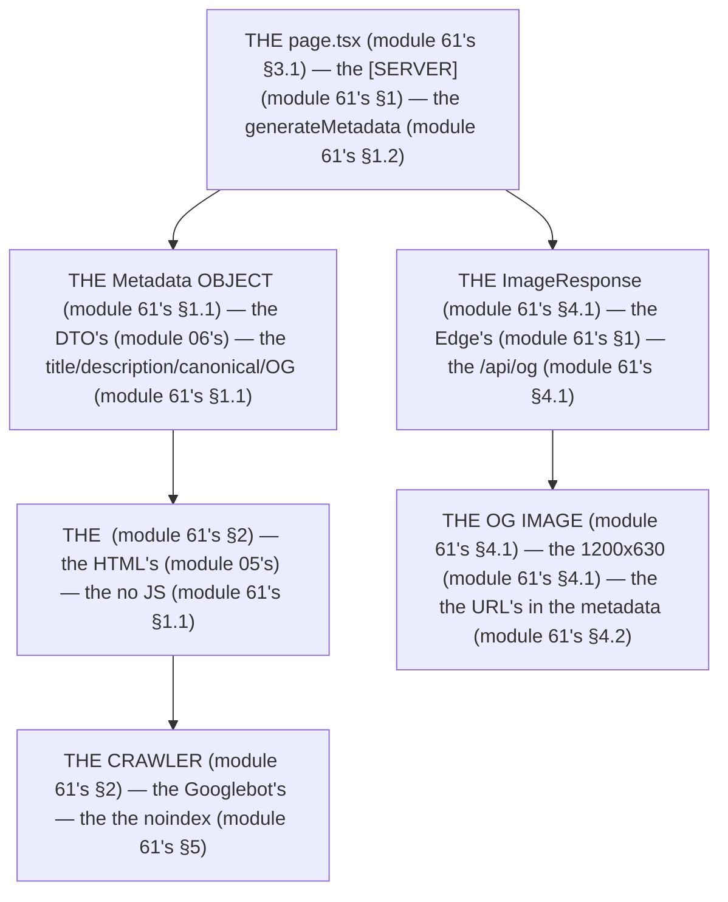

# Module 61 — The Metadata System: `generateMetadata`, Canonical, OG Images

**Phase 14: SEO · Module 61 of 101**

> **Where does this run?** The metadata is **`[SERVER]`** (the `Metadata` object is resolved in the Server Component tree, serialized into the `<head>` HTML the browser receives — it never touches `[CLIENT]` JS); the *OG image generation* (`ImageResponse`) runs **`[SERVER]`** on the **Edge runtime** (or Node) in a Route Handler, module 61's §4. The module-61's standing rule (module 06's wire + module 20's cache, now the head level): **the `<head>` is the server's wire — the `Metadata` object is a DTO, `generateMetadata` is the fetch, `metadataBase` is the origin — and *private* pages (the dashboard, module 43's) are `noindex`, never indexed (module 61's §1, §5)** (module 61's §1).

---

## 1. Concept — The head is the wire (the 4 pieces)

**The `Metadata`'s** (module 61's §1.1): the *the object's DTO* (module 06's) — the *module-61's line: the `Metadata` is the DTO's* (module 06's) — the *the no `document`'s* (module 61's §1.1).

**The `generateMetadata`'s** (module 61's §1.2): the *the async's fetch* (module 20's) — the *module-61's line: the `generateMetadata` is the fetch's* (module 20's) — the *the no client's* (module 61's §1.2).

**The `metadataBase`'s** (module 61's §1.3): the *the origin's* (module 61's §1.3) — the *module-61's line: the `metadataBase` is the origin's* (module 61's §1.3) — the *the no relative's* (module 61's §1.3).

**The `viewport`'s** (module 61's §1.4): the *the separate's export* (module 61's §1.4) — the *module-61's line: the `viewport` is the separate's* (module 61's §1.4) — the *the no `themeColor` in the `metadata`'s* (module 61's §1.4).

## 2. Mental Model — The metadata's flow (drawn)



**The metadata's flow** (the module-61's mental model):
1. **The `Metadata`** (module 61's §1.1): the *the DTO's* — the *module-61's line: the `Metadata` is the DTO's* (module 06's).
2. **The `generateMetadata`** (module 61's §1.2): the *the fetch's* — the *module-61's line: the `generateMetadata` is the fetch's* (module 20's).
3. **The `<head>`** (module 61's §2): the *the HTML's* — the *the no JS* (module 61's §1.1).
4. **The `ImageResponse`** (module 61's §4.1): the *the Edge's* — the *the 1200x630* (module 61's §4.1).

## 3. Architecture — The metadata's (the code)

### 3.1 The static + the `generateMetadata` (module 61's §3.1 — the 2 modes)

`FILE: app/layout.tsx` + `FILE: app/products/page.tsx` (production pattern — [SERVER] — the module-61's §3.1)

```tsx
// THE LAYOUT'S METADATA (module 61's §3.1) — the the static's (module 61's §1.2) — the the metadataBase's (module 61's §1.3):
import type { Metadata, Viewport } from 'next'

export const metadata: Metadata = {
  metadataBase: new URL(process.env.NEXT_PUBLIC_SITE_URL!),   /* the module-61's line: the metadataBase is the origin's (module 61's §1.3) — the the no relative's (module 61's §1.3) */
  title: {
    default: 'SaaS Commerce Platform',
    template: '%s | SaaS Commerce Platform',   /* the module-61's line: the template's is the page's (module 61's §3.1) */
  },
  description: 'Multi-tenant commerce and operations platform.',
  openGraph: {
    type: 'website',
    siteName: 'SaaS Commerce Platform',
    locale: 'en_US',
    images: [{ url: '/og/default.png', width: 1200, height: 630, alt: 'SaaS Commerce Platform' }],   /* the module-61's line: the OG's is the 1200x630 (module 61's §4.1) */
  },
  twitter: { card: 'summary_large_image' },
  robots: { index: true, follow: true },
}

// THE VIEWPORT'S (module 61's §1.4) — the the separate's export (module 61's §1.4) — the the no themeColor in the metadata (module 61's §1.4):
export const viewport: Viewport = {
  themeColor: [
    { media: '(prefers-color-scheme: light)', color: '#ffffff' },   /* the module-57's line: the themeColor is the token's (module 57's §1.4) */
    { media: '(prefers-color-scheme: dark)', color: '#0a0a0a' },
  ],
  width: 'device-width',
  initialScale: 1,
}
```

```tsx
// THE DYNAMIC'S (module 61's §1.2) — the the generateMetadata's (module 61's §1.2) — the the [SERVER] (module 61's §1):
// 'use server' is NOT needed — generateMetadata runs on the server (module 61's §1.2)
import type { Metadata } from 'next'
import { getProduct } from '@/services/products'   /* the module-05's line: the service is the ORM's (module 5's) */

export async function generateMetadata({ params }: { params: Promise<{ id: string }> }): Promise<Metadata> {
  const { id } = await params   /* the module-03's line: the params is the Promise (module 3's) */
  const product = await getProduct(id)   /* the module-20's line: the fetch's (module 20's) — the the cacheTag's (module 20's) */
  if (!product) return { title: 'Product not found' }   /* the module-61's line: the 404's metadata (module 61's §3.1) */
  return {
    title: product.name,   /* the module-61's line: the template's fills it (module 61's §3.1) */
    description: product.description,
    alternates: { canonical: `/products/${product.slug}` },   /* the module-61's line: the canonical is the relative's (module 61's §3.1) — the the metadataBase's resolves it (module 61's §1.3) */
    openGraph: {
      type: 'website',
      url: `/products/${product.slug}`,
      title: product.name,
      description: product.description,
      images: [{ url: `/api/og?title=${encodeURIComponent(product.name)}`, width: 1200, height: 630, alt: product.name }],   /* the module-61's line: the OG image's is the dynamic's (module 61's §4.1) */
    },
    other: {
      /* the module-62's line: the JSON-LD's is the other's (module 62's) — the the Product's (module 62's §3.1) */
    },
  }
}
```

**The module-61's line:** the *`metadataBase` is the origin's* (module 61's §1.3) — the *the `template` is the page's* (module 61's §3.1) — the *the `canonical` is the relative's* (module 61's §3.1) — the *the `viewport` is the separate's* (module 61's §1.4).

### 3.2 The `notFound`'s + the `noindex` (module 61's §3.2 — the 404's + the private's)

`FILE: app/products/[id]/page.tsx` + `FILE: app/(dashboard)/layout.tsx` (production pattern — [SERVER] — the module-61's §3.2)

```tsx
// THE 404'S (module 61's §3.2) — the the notFound's (module 61's §3.2) — the the 404's page (module 06's):
export async function generateMetadata({ params }: { params: Promise<{ id: string }> }): Promise<Metadata> {
  const { id } = await params
  const product = await getProduct(id)
  if (!product) notFound()   /* the module-61's line: the notFound's is the 404's (module 61's §3.2) — the the 404's HTML (module 6's) */
  /* ... (module 61's §3.1) */
}
```

```tsx
// THE PRIVATE'S (module 61's §5) — the the noindex's (module 61's §5) — the the dashboard's (module 43's):
// 'use server' is NOT needed — the layout's metadata is the [SERVER] (module 61's §1)
import type { Metadata } from 'next'

export const metadata: Metadata = {
  robots: { index: false, follow: true },   /* the module-61's line: the noindex is the private's (module 61's §5) — the the dashboard's (module 43's) */
}
/* THE RULE (module 61's §5): the the private's pages are the noindex's (module 61's §5) — the the crawler's is the no-auth's (module 43's) */
```

**The module-61's line:** the *`notFound` is the 404's* (module 61's §3.2) — the *the `noindex` is the private's* (module 61's §5) — the *the `robots: { index: false }` is the dashboard's* (module 61's §5).

### 3.3 The `generateStaticParams` (module 61's §3.3 — the prerender's)

`FILE: app/products/[slug]/page.tsx` (production pattern — [SERVER] — the module-61's §3.3)

```tsx
// THE PRERENDER'S (module 61's §3.3) — the the generateStaticParams's (module 61's §3.3) — the the build-time's (module 20's):
import { listProductSlugs } from '@/services/products'   /* the module-05's line: the service is the ORM's (module 5's) */

export async function generateStaticParams() {
  const slugs = await listProductSlugs()   /* the module-20's line: the fetch's (module 20's) */
  return slugs.map((slug) => ({ slug }))   /* the module-61's line: the slug's is the key's (module 61's §3.3) */
}
/* THE RULE (module 61's §3.3): the the generateStaticParams's is the build-time's (module 61's §3.3) — the the dynamic's is the runtime's (module 20's) */
```

**The module-61's line:** the *`generateStaticParams` is the build-time's* (module 61's §3.3) — the *the `slug` is the key's* (module 61's §3.3).

## 4. Production Code — The OG image (module 61's §4)

`FILE: app/api/og/route.tsx` (production pattern — [SERVER] — the module-61's §4.1: the `ImageResponse`'s)

```tsx
// THE OG IMAGE (module 61's §4.1) — the the ImageResponse's (module 61's §4.1) — the the Edge's (module 61's §1):
import { ImageResponse } from 'next/og'   /* the module-61's line: the ImageResponse is the Edge's (module 61's §4.1) */

export const runtime = 'edge'   /* the module-61's line: the runtime is the Edge's (module 61's §4.1) — the the no DB (module 61's §4.1) */
export const revalidate = 3600   /* the module-20's line: the revalidate is the 1h's (module 20's) — the the no per-request (module 61's §4.1) */

export async function GET(request: Request) {
  const { searchParams } = new URL(request.url)
  const title = searchParams.get('title') ?? 'SaaS Commerce Platform'

  return new ImageResponse(   /* the module-61's line: the ImageResponse is the 1200x630 (module 61's §4.1) */
    <div style={{ width: '100%', height: '100%', display: 'flex', flexDirection: 'column', justifyContent: 'center', alignItems: 'center', background: '#0a0a0a', color: '#fff', fontFamily: 'sans-serif' }}>
      <div style={{ fontSize: 64, fontWeight: 700 }}>{title}</div>   /* the module-61's line: the title's is the 64px (module 61's §4.1) */
      <div style={{ fontSize: 32, opacity: 0.7 }}>SaaS Commerce Platform</div>
    </div>,
    { width: 1200, height: 630 },   /* the module-61's line: the 1200x630 is the OG's (module 61's §4.1) */
  )
}
```

**The module-61's line:** the *`ImageResponse` is the Edge's* (module 61's §4.1) — the *the `runtime = 'edge'`'s* (module 61's §4.1) — the *the `revalidate` is the 1h's* (module 20's) — the *the 1200x630's* (module 61's §4.1).

### 4.2 The OG image's URL (module 61's §4.2 — the metadata's reference)

`FILE: app/products/[id]/page.tsx` (production pattern — [SERVER] — the module-61's §4.2)

```tsx
// THE OG IMAGE'S URL (module 61's §4.2) — the the metadataBase's resolves it (module 61's §1.3):
openGraph: {
  images: [{
    url: `/api/og?title=${encodeURIComponent(product.name)}`,   /* the module-61's line: the url is the relative's (module 61's §4.2) — the the metadataBase's (module 61's §1.3) */
    width: 1200,
    height: 630,
    alt: product.name,
  }],
}
/* THE RULE (module 61's §4.2): the the OG image's URL is the relative's (module 61's §4.2) — the the metadataBase's resolves it to the absolute's (module 61's §1.3) */
```

**The module-61's line:** the *OG image's URL is the relative's* (module 61's §4.2) — the *the `metadataBase` resolves it* (module 61's §1.3).

## 5. Common Mistakes (the metadata's failures)

| Mistake | The symptom | Fix |
|---|---|---|
| **The no `metadataBase`** (module 61's §1.3's line violated) | the *module-61's line: the `metadataBase` is the origin's* (module 61's §1.3) — the *the no `metadataBase`'s is the *no's* (module 61's §1.3) — the *module-61's line: the no `metadataBase`'s* (module 61's §1.3) — the *no `metadataBase`'s* (module 61's §1.3)* | the *the `metadataBase: new URL(...)`'s (module 61's §1.3) — the *module-61's line: the `metadataBase` is the origin's* (module 61's §1.3)* |
| **The `themeColor` in the `metadata`** (module 61's §1.4's line violated) | the *module-61's line: the `viewport` is the separate's* (module 61's §1.4) — the *the `themeColor`'s is the *no's* (module 61's §1.4) — the *module-61's line: the no `themeColor` in the `metadata`'s* (module 61's §1.4) — the *no `themeColor` in the `metadata`'s* (module 61's §1.4)* | the *the `export const viewport`'s (module 61's §1.4) — the *module-61's line: the `viewport` is the separate's* (module 61's §1.4)* |
| **The `document`'s** (module 61's §1.1's line violated) | the *module-61's line: the `Metadata` is the DTO's* (module 06's) — the *the `document`'s is the *no's* (module 61's §1.1) — the *module-61's line: the no `document`'s* (module 61's §1.1) — the *no `document`'s* (module 61's §1.1)* | the *the `Metadata` object's (module 61's §1.1) — the *module-61's line: the `Metadata` is the DTO's* (module 06's)* |
| **The private's indexed** (module 61's §5's line violated) | the *module-61's line: the noindex is the private's* (module 61's §5) — the *the private's indexed's is the *no's* (module 61's §5) — the *module-61's line: the no private's indexed's* (module 61's §5) — the *no private's indexed's* (module 61's §5)* | the *the `robots: { index: false }`'s (module 61's §5) — the *module-61's line: the noindex is the private's* (module 61's §5)* |
| **The OG image on the main's** (module 61's §4.1's line violated) | the *module-61's line: the OG image's is the separate's route* (module 61's §4.1) — the *the OG image on the main's is the *no's* (module 61's §4.1) — the *module-61's line: the no OG image on the main's* (module 61's §4.1) — the *no OG image on the main's* (module 61's §4.1)* | the *the `/api/og`'s route (module 61's §4.1) — the *module-61's line: the OG image's is the separate's route* (module 61's §4.1)* |
| **The relative's canonical** (module 61's §3.1's line violated — without the `metadataBase`'s) | the *module-61's line: the `metadataBase` is the origin's* (module 61's §1.3) — the *the relative's canonical's is the *no's* (module 61's §3.1) — the *module-61's line: the no relative's canonical's* (module 61's §3.1) — the *no relative's canonical's* (module 61's §3.1)* | the *the `metadataBase`'s + the relative's canonical (module 61's §1.3 + module 61's §3.1) — the *module-61's line: the `metadataBase` is the origin's* (module 61's §1.3)* |

## 6. Security Notes

- **The no private's** (module 61's §5): the *module-61's line: the noindex is the private's* (module 61's §5) — the *the no-auth's is the crawler's* (module 43's) — the *module-43's* *deep-dive* (module 43's).
- **The OG image's XSS** (module 75's): the *module-75's line: the XSS's is the no `dangerouslySetInnerHTML`'s* (module 75's) — the *module-61's line: the OG image's is the no `dangerouslySetInnerHTML`'s* (module 75's) — the *module-75's* *deep-dive* (module 75's).
- **The `encodeURIComponent`** (module 61's §4.2): the *module-61's line: the `encodeURIComponent` is the injection's no* (module 61's §4.2) — the *module-75's* *deep-dive* (module 75's).

## 7. Performance Notes

- **The OG image's is the separate's** (module 61's §4.1): the *module-61's line: the OG image's is the separate's route* (module 61's §4.1) — the *the no blocking's* (module 61's §4.1).
- **The `revalidate`'s is the 1h's** (module 61's §4.1): the *module-20's line: the revalidate is the 1h's* (module 20's) — the *module-61's line: the `revalidate` is the 1h's* (module 61's §4.1).
- **The `generateStaticParams`'s is the build-time's** (module 61's §3.3): the *module-61's line: the `generateStaticParams` is the build-time's* (module 61's §3.3) — the *the no per-request's* (module 61's §3.3).

## 8. Exercise

**Beginner.** *The `metadataBase`'s + the `template`'s* (module 61's §3.1): the *the `layout.tsx`'s `metadata`* (module 3.1's) + the *the `viewport`'s* (module 3.1's) — *build it* — the *artifact: the 2's* (module 20's).

**Intermediate.** *The `generateMetadata`'s + the `noindex`'s* (module 61's §3.1 + §3.2): the *the `product`'s `generateMetadata`* (module 3.1's) + the *the `dashboard`'s `noindex`* (module 3.2's) — *build it* — the *artifact: the 2's* (module 20's).

**Production.** *The OG image's* (module 61's §4): the *the `/api/og`'s route* (module 4.1's) + the *the `ImageResponse`'s* (module 4.1's) + the *the `revalidate`'s* (module 4.1's) — *build it* — the *artifact: the OG image's* (module 4.1's).

## 9. Architecture Challenge

**Prompt:** The *"the team's 500-product catalog has no OG images, no canonical, and the dashboard is indexed"* (the *module-61's* *metadata* — the *module-20's* *cache* — the *module-61's line: the `Metadata` is the DTO's* (module 06's) — the *module-20's line: the fetch's* (module 20's) — the *module-61's standing line: the `Metadata` is the DTO's + the `metadataBase` is the origin's + the noindex is the private's* (module 61's §1.1 + module 61's §1.3 + module 61's §5)).

The *problems*: (1) the *the no OG's* (the *the no `ImageResponse`'s* (module 61's §4.1) — the *module-61's line: the OG image's is the separate's route* (module 61's §4.1) — the *module-61's standing line: the OG image's is the separate's route* (module 61's §4.1)).

(2) the *the dashboard's indexed* (the *the no `noindex`'s* (module 61's §5) — the *module-61's line: the noindex is the private's* (module 61's §5) — the *module-61's standing line: the noindex is the private's* (module 61's §5)).

**Design**: the *the SEO's remediation* (the *the `/api/og`'s route* (module 61's §4.1) + the *the `metadataBase`'s* (module 61's §1.3) + the *the `canonical`'s* (module 61's §3.1) + the *the `noindex`'s* (module 61's §5) — the *module-61's line: the `Metadata` is the DTO's* (module 06's) — the *module-61's standing line: the `Metadata` is the DTO's + the `metadataBase` is the origin's + the noindex is the private's* (module 61's §1.1 + module 61's §1.3 + module 61's §5)).

Produce: the *the SEO's remediation* (the *the `/api/og`'s route* (module 61's §4.1) + the *the `metadataBase`'s* (module 61's §1.3) + the *the `canonical`'s* (module 61's §3.1) + the *the `noindex`'s* (module 61's §5) — the *module-61's line: the `Metadata` is the DTO's* (module 06's) — the *module-61's standing line: the `Metadata` is the DTO's + the `metadataBase` is the origin's + the noindex is the private's* (module 61's §1.1 + module 61's §1.3 + module 61's §5)).

<details>
<summary>Model answer</summary>
**The SEO's remediation** (module 61's §4.1 + module 61's §1.3 + module 61's §3.1 + module 61's §5):
1. **The OG's** (module 61's §4.1): the *the `/api/og`'s route is the `ImageResponse`'s* — the *module-61's line: the OG image's is the separate's route* (module 61's §4.1).
2. **The `metadataBase`'s** (module 61's §1.3): the *the `new URL(...)`'s is the origin's* — the *module-61's line: the `metadataBase` is the origin's* (module 61's §1.3).
3. **The `canonical`'s** (module 61's §3.1): the *the relative's is the canonical's* — the *module-61's line: the `canonical` is the relative's* (module 61's §3.1).
4. **The `noindex`'s** (module 61's §5): the *the `robots: { index: false }`'s is the private's* — the *module-61's line: the noindex is the private's* (module 61's §5).
**The generalization** (the *SEO's* pattern, the *module's* standing rule): **the *`Metadata` is the DTO's* (module 06's) — the *the `metadataBase` is the origin's* (module 61's §1.3) — the *the noindex is the private's* (module 61's §5) — the *module-61's standing line: the `Metadata` is the DTO's + the `metadataBase` is the origin's + the noindex is the private's* (module 61's §1.1 + module 61's §1.3 + module 61's §5)*.
</details>

## 10. Official Documentation

- Next.js: Metadata: https://nextjs.org/docs/app/api-reference/file-conventions/metadata
- Next.js: `generateMetadata`: https://nextjs.org/docs/app/api-reference/file-conventions/metadata-metadata#generatemetadata
- Next.js: `ImageResponse`: https://nextjs.org/docs/app/api-reference/functions/image-response
- Next.js: `generateStaticParams`: https://nextjs.org/docs/app/api-reference/file-conventions/page#generate-static-params
- Google: Open Graph: https://developers.facebook.com/docs/sharing/opengraph
- Twitter: Cards: https://developer.twitter.com/en/docs/twitter-for-websites/cards/guides/getting-started
- The module-20's cache: the module-20 (the phase-4's file-04)

## 11. What You Should Know Before Continuing

- [ ] I can state the *4 pieces* (module 1's: the `Metadata`/`generateMetadata`/`metadataBase`/`viewport`) — the *module-61's line: the `Metadata` is the DTO's* (module 1's)
- [ ] I know the *`metadataBase` is the origin's* (module 1.3's) — the *the no relative's* (module 1.3's)
- [ ] I know the *`viewport` is the separate's* (module 1.4's) — the *the no `themeColor` in the `metadata`'s* (module 1.4's)
- [ ] I know the *`generateMetadata` is the fetch's* (module 1.2's) — the *the no client's* (module 1.2's)
- [ ] I know the *`noindex` is the private's* (module 5's) — the *the `robots: { index: false }`'s* (module 5's)
- [ ] I know the *OG image's is the separate's route* (module 4.1's) — the *the `runtime = 'edge'`'s* (module 4.1's)
- [ ] I've done the *`metadataBase`/`template`* (module 8's beginner) + the *`generateMetadata`/`noindex`* (module 8's intermediate) + the *OG image's* (module 8's production) — the *artifacts* (module 20's)

**Next:** Module 62 — Structured Data, Sitemap, Robots (the *the JSON-LD's* — the *the `sitemap.ts`'s* — the *module-62's line: the structured's is the JSON-LD's* (module 62's)).
