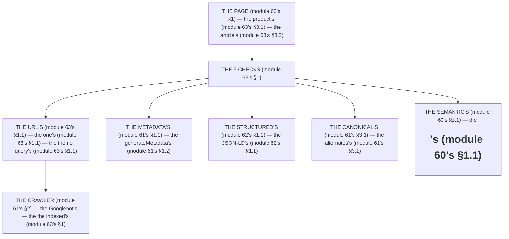

# Module 63 — SEO Case Studies: The Product Page and the Article Page, Fully Optimized

**Phase 14: SEO · Module 63 of 101**

> **Where does this run?** The pages are **`[SERVER]`** (the RSC that fetches, the `generateMetadata`, the JSON-LD — module 61's/62's); the *crawlers* are the consumers (the Googlebot, module 61's §2). The module-63's standing rule (module 61's/62's, now the synthesis level): **a page is SEO-complete when it has (1) the metadata (module 61's), (2) the structured data (module 62's), (3) the canonical URL (module 61's §3.1), (4) the semantic HTML (module 60's §1.1), and (5) the *one* URL per piece of content (module 63's §1) — the URL strategy is the decision, the rest is the execution (module 63's §1)** (module 63's §1).

---

## 1. Concept — The URL strategy is the decision (the 5 checks)

**The URL's** (module 63's §1.1): the *the one's per content* (module 63's §1.1) — the *module-63's line: the URL's is the one's* (module 63's §1.1) — the *the no query's* (module 63's §1.1).

**The metadata's** (module 61's §1.1): the *the `generateMetadata`'s* (module 61's §1.2) — the *module-63's line: the metadata's is the `generateMetadata`'s* (module 61's §1.2).

**The structured's** (module 62's §1.1): the *the JSON-LD's* (module 62's §1.1) — the *module-63's line: the structured's is the JSON-LD's* (module 62's §1.1).

**The canonical's** (module 61's §3.1): the *the `alternates`'s* (module 61's §3.1) — the *module-63's line: the canonical's is the `alternates`'s* (module 61's §3.1).

**The semantic's** (module 60's §1.1): the *the `<h1>`'s* + the *the `<article>`'s* (module 60's §1.1) — the *module-63's line: the semantic's is the `<h1>`'s* (module 60's §1.1).

## 2. Mental Model — The 5 checks (drawn)



**The 5 checks** (the module-63's mental model):
1. **The URL's** (module 63's §1.1): the *the one's* — the *module-63's line: the URL's is the one's* (module 63's §1.1).
2. **The metadata's** (module 61's §1.1): the *the `generateMetadata`'s* — the *module-63's line: the metadata's is the `generateMetadata`'s* (module 61's §1.2).
3. **The structured's** (module 62's §1.1): the *the JSON-LD's* — the *module-63's line: the structured's is the JSON-LD's* (module 62's §1.1).
4. **The canonical's** (module 61's §3.1): the *the `alternates`'s* — the *module-63's line: the canonical's is the `alternates`'s* (module 61's §3.1).
5. **The semantic's** (module 60's §1.1): the *the `<h1>`'s* — the *module-63's line: the semantic's is the `<h1>`'s* (module 60's §1.1).

## 3. Architecture — The 2 case studies (the code)

### 3.1 The product's page (module 63's §3.1 — the 5 checks on one page)

`FILE: app/products/[slug]/page.tsx` (production pattern — [SERVER] — the module-63's §3.1: the full's)

```tsx
// THE PRODUCT'S PAGE (module 63's §3.1) — the the 5 checks (module 63's §1) — the the [SERVER] (module 63's §1):
import type { Metadata } from 'next'
import { notFound } from 'next'
import { getProductBySlug } from '@/services/products'   /* the module-5's line: the service is the ORM's (module 5's) */
import { productJsonLd } from '@/lib/jsonld'   /* the module-62's line: the JSON-LD's (module 62's §3.1) */
import { cache, cacheTag, cacheLife } from 'react'   /* the module-20's line: the cache's (module 20's) */

/* THE URL'S (module 63's §1.1) — the the slug's (module 63's §1.1) — the the no query's (module 63's §1.1):
   /products/{slug} — the the one's per content (module 63's §1.1) */

/* THE METADATA'S (module 61's §1.2) — the the generateMetadata's (module 61's §1.2): */
export async function generateMetadata({ params }: { params: Promise<{ slug: string }> }): Promise<Metadata> {
  const { slug } = await params
  const product = await getProductBySlug(slug)   /* the module-20's line: the fetch's (module 20's) — the the cacheTag's (module 20's) */
  if (!product) return { title: 'Product not found' }
  return {
    title: product.name,
    description: product.description,
    alternates: { canonical: `/products/${product.slug}` },   /* the module-63's line: the canonical's is the slug's (module 63's §3.1) — the the no id's (module 63's §3.1) */
    openGraph: {
      type: 'website',
      url: `/products/${product.slug}`,
      title: product.name,
      description: product.description,
      images: [{ url: `/api/og?title=${encodeURIComponent(product.name)}`, width: 1200, height: 630 }],   /* the module-61's line: the OG image's is the dynamic's (module 61's §4.1) */
    },
  }
}

/* THE PAGE'S (module 63's §3.1) — the the semantic's (module 60's §1.1) + the structured's (module 62's §1.1): */
export default async function ProductPage({ params }: { params: Promise<{ slug: string }> }) {
  const { slug } = await params
  const product = await getProductBySlug(slug)
  if (!product) notFound()   /* the module-61's line: the notFound's is the 404's (module 61's §3.2) */
  const baseUrl = process.env.NEXT_PUBLIC_SITE_URL!
  return (
    <>
      <script type="application/ld+json" dangerouslySetInnerHTML={{ __html: JSON.stringify(productJsonLd(product, baseUrl)) }} />   /* the module-62's line: the structured's is the JSON-LD's (module 62's §1.1) */
      <article>   /* the module-63's line: the <article> is the semantic's (module 60's §1.1) */
        <h1>{product.name}</h1>   /* the module-63's line: the <h1> is the semantic's (module 60's §1.1) — the the one's (module 63's §3.1) */
        <p className="text-muted-foreground">{product.description}</p>
        {/* the price's (module 37's) + the CTA's (module 58's) */}
      </article>
    </>
  )
}
```

**The module-63's line:** the *URL's is the slug's* (module 63's §3.1) — the *the `canonical` is the slug's* (module 63's §3.1) — the *the `<h1>` is the one's* (module 63's §3.1) — the *the `<article>` is the semantic's* (module 60's §1.1).

### 3.2 The article's page (module 63's §3.2 — the 5 checks on one page)

`FILE: app/blog/[slug]/page.tsx` (production pattern — [SERVER] — the module-63's §3.2)

```tsx
// THE ARTICLE'S PAGE (module 63's §3.2) — the the 5 checks (module 63's §1) — the the [SERVER] (module 63's §1):
import type { Metadata } from 'next'
import { notFound } from 'next'
import { getArticleBySlug } from '@/services/articles'   /* the module-5's line: the service is the ORM's (module 5's) */
import { articleJsonLd } from '@/lib/jsonld'   /* the module-62's line: the JSON-LD's (module 62's §3.4) */

/* THE URL'S (module 63's §1.1) — the the slug's (module 63's §1.1):
   /blog/{slug} — the the one's per content (module 63's §1.1) */

/* THE METADATA'S (module 61's §1.2) — the the generateMetadata's (module 61's §1.2): */
export async function generateMetadata({ params }: { params: Promise<{ slug: string }> }): Promise<Metadata> {
  const { slug } = await params
  const article = await getArticleBySlug(slug)
  if (!article) return { title: 'Article not found' }
  return {
    title: article.title,
    description: article.description,
    alternates: { canonical: `/blog/${article.slug}` },   /* the module-63's line: the canonical's is the slug's (module 63's §3.2) */
    openGraph: {
      type: 'article',   /* the module-63's line: the type is the article's (module 63's §3.2) */
      url: `/blog/${article.slug}`,
      title: article.title,
      description: article.description,
      publishedTime: article.datePublished,   /* the module-37's line: the date is the ISO's (module 37's) */
      authors: [article.author],
    },
  }
}

/* THE PAGE'S (module 63's §3.2) — the the semantic's (module 60's §1.1) + the structured's (module 62's §1.1): */
export default async function ArticlePage({ params }: { params: Promise<{ slug: string }> }) {
  const { slug } = await params
  const article = await getArticleBySlug(slug)
  if (!article) notFound()   /* the module-61's line: the notFound's is the 404's (module 61's §3.2) */
  const baseUrl = process.env.NEXT_PUBLIC_SITE_URL!
  return (
    <>
      <script type="application/ld+json" dangerouslySetInnerHTML={{ __html: JSON.stringify(articleJsonLd(article, baseUrl)) }} />   /* the module-62's line: the structured's is the JSON-LD's (module 62's §1.1) */
      <article>   /* the module-63's line: the <article> is the semantic's (module 60's §1.1) */
        <header>
          <h1>{article.title}</h1>   /* the module-63's line: the <h1> is the semantic's (module 60's §1.1) — the the one's (module 63's §3.2) */
          <time dateTime={article.datePublished}>{article.datePublished}</time>   /* the module-63's line: the <time> is the semantic's (module 60's §1.1) — the the ISO's (module 37's) */
        </header>
        <div>{article.body}</div>   /* the module-63's line: the body's is the content's (module 63's §3.2) */
      </article>
    </>
  )
}
```

**The module-63's line:** the *URL's is the slug's* (module 63's §3.2) — the *the `type` is the `article`'s* (module 63's §3.2) — the *the `<time>` is the ISO's* (module 37's) — the *the `<h1>` is the one's* (module 63's §3.2).

### 3.3 The URL strategy (module 63's §3.3 — the decision's)

`FILE: docs/url-strategy.md` (production pattern — the module-63's §3.3: the 4 rules)

```md
## THE URL STRATEGY (module 63's §3.3 — the the 4 rules (module 63's §3.3))

1. **THE ONE'S** (module 63's §1.1): the the one's URL per content — the the no query's (module 63's §1.1)
2. **THE SLUG'S** (module 63's §1.1): the the slug's is the human's (module 63's §1.1) — the the no id's (module 63's §3.1)
3. **THE LOWERCASE'S** (module 63's §1.1): the the lowercase's (module 63's §1.1) — the the no `-`'s (module 63's §1.1)
4. **THE NO TRAILING'S** (module 63's §1.1): the the no trailing's slash (module 63's §1.1) — the the 301's (module 63's §3.3)
```

**The module-63's line:** the *one's per content* (module 63's §3.3) — the *the `slug` is the human's* (module 63's §3.3) — the *the lowercase's* (module 63's §3.3) — the *the no trailing's* (module 63's §3.3).

## 4. Production Code — The 301's redirect (module 63's §4)

`FILE: src/app/products/[oldSlug]/page.tsx` (production pattern — [SERVER] — the module-63's §4: the migration's)

```tsx
// THE 301'S (module 63's §4) — the the migration's (module 63's §4) — the the no 200's (module 63's §4):
import { redirect } from 'next/navigation'   /* the module-30's line: the redirect's is the 301's (module 30's) */

export default function OldProductPage({ params }: { params: Promise<{ oldSlug: string }> }) {
  redirect(`/products/new-slug`)   /* the module-63's line: the 301's is the migration's (module 63's §4) — the the no 200's (module 63's §4) */
}
/* THE RULE (module 63's §4): the the 301's is the migration's (module 63's §4) — the the no 200's (module 63's §4) — the the 301's preserves the rank's (module 63's §4) */
```

**The module-63's line:** the *301's is the migration's* (module 63's §4) — the *the no 200's* (module 63's §4) — the *the 301's preserves the rank's* (module 63's §4).

## 5. Common Mistakes (the case's failures)

| Mistake | The symptom | Fix |
|---|---|---|
| **The query's URL** (module 63's §1.1's line violated) | the *module-63's line: the URL's is the one's* (module 63's §1.1) — the *the query's URL's is the *no's* (module 63's §1.1) — the *module-63's line: the no query's* (module 63's §1.1) — the *no query's* (module 63's §1.1)* | the *the `slug`'s URL (module 63's §1.1) — the *module-63's line: the URL's is the one's* (module 63's §1.1)* |
| **The `<h1>`'s missing** (module 63's §3.1's line violated) | the *module-63's line: the semantic's is the `<h1>`'s* (module 60's §1.1) — the *the `<h1>`'s missing is the *no's* (module 63's §3.1) — the *module-63's line: the no `<h1>`'s* (module 63's §3.1) — the *no `<h1>`'s* (module 63's §3.1)* | the *the `<h1>{product.name}</h1>`'s (module 63's §3.1) — the *module-63's line: the semantic's is the `<h1>`'s* (module 60's §1.1)* |
| **The 200's redirect** (module 63's §4's line violated) | the *module-63's line: the 301's is the migration's* (module 63's §4) — the *the 200's redirect's is the *no's* (module 63's §4) — the *module-63's line: the no 200's* (module 63's §4) — the *no 200's* (module 63's §4)* | the *the `redirect()`'s 301 (module 63's §4) — the *module-63's line: the 301's is the migration's* (module 63's §4)* |
| **The `id` in the URL** (module 63's §3.1's line violated) | the *module-63's line: the `slug` is the human's* (module 63's §3.3) — the *the `id` in the URL's is the *no's* (module 63's §3.1) — the *module-63's line: the no `id` in the URL's* (module 63's §3.1) — the *no `id` in the URL's* (module 63's §3.1)* | the *the `slug`'s (module 63's §3.3) — the *module-63's line: the `slug` is the human's* (module 63's §3.3)* |
| **The `type`'s wrong** (module 63's §3.2's line violated) | the *module-63's line: the `type` is the `article`'s* (module 63's §3.2) — the *the `type`'s wrong is the *no's* (module 63's §3.2) — the *module-63's line: the no `type`'s wrong* (module 63's §3.2) — the *no `type`'s wrong* (module 63's §3.2)* | the *the `type: 'article'`'s (module 63's §3.2) — the *module-63's line: the `type` is the `article`'s* (module 63's §3.2)* |
| **The `publishedTime`'s missing** (module 63's §3.2's line violated) | the *module-63's line: the `publishedTime` is the ISO's* (module 37's) — the *the `publishedTime`'s missing is the *no's* (module 63's §3.2) — the *module-63's line: the no `publishedTime`'s* (module 63's §3.2) — the *no `publishedTime`'s* (module 63's §3.2)* | the *the `publishedTime: article.datePublished`'s (module 63's §3.2) — the *module-63's line: the `publishedTime` is the ISO's* (module 37's)* |

## 6. Security Notes

- **The no user-input** (module 75's): the *module-62's line: the `JSON.stringify` is the no-injection's* (module 62's §3.1) — the *module-63's line: the JSON-LD's is the no user-input* (module 75's) — the *module-75's* *deep-dive* (module 75's).
- **The private's noindex** (module 61's §5): the *module-61's line: the noindex is the private's* (module 61's §5) — the *module-63's line: the private's is the noindex's* (module 61's §5) — the *module-43's* *deep-dive* (module 43's).
- **The `slug`'s injection** (module 75's): the *module-75's line: the injection's is the no's* (module 75's) — the *module-63's line: the `slug`'s is the no injection* (module 75's) — the *module-75's* *deep-dive* (module 75's).

## 7. Performance Notes

- **The `generateMetadata`'s is the fetch's** (module 61's §1.2): the *module-61's line: the `generateMetadata` is the fetch's* (module 61's §1.2) — the *the no per-render's* (module 63's §7.1).
- **The JSON-LD's is the small's** (module 62's §7.2): the *module-62's line: the JSON-LD's is the small's* (module 62's §7.2) — the *the no bloat's* (module 63's §7.1).
- **The 301's is the fast's** (module 63's §4): the *module-63's line: the 301's is the fast's* (module 63's §4) — the *the no 200's* (module 63's §4).

## 8. Exercise

**Beginner.** *The product's page* (module 63's §3.1): the *the `generateMetadata`'s* (module 3.1's) + the *the `<h1>`'s* (module 3.1's) + the *the JSON-LD's* (module 3.1's) — *build it* — the *artifact: the product's page* (module 3.1's).

**Intermediate.** *The article's page* (module 63's §3.2): the *the `generateMetadata`'s* (module 3.2's) + the *the `<article>`'s* (module 3.2's) + the *the `articleJsonLd`'s* (module 3.2's) — *build it* — the *artifact: the article's page* (module 3.2's).

**Production.** *The URL strategy's + the 301's* (module 63's §3.3 + §4): the *the 4 rules' (module 3.3's) + the `redirect()`'s 301 (module 4's) — *build it* — the *artifact: the URL strategy's* (module 3.3's).

## 9. Architecture Challenge

**Prompt:** The *"the team's legacy site has 2,000 product URLs with query strings (`/product?id=...`), no canonical, and the dashboard is indexed"* (the *module-63's* *case's* — the *module-61's* *metadata* — the *module-62's* *machine's* — the *module-63's line: the case's is the full's* (module 63's §1) — the *module-61's line: the `Metadata` is the DTO's* (module 06's) — the *module-63's standing line: the URL's is the one's + the canonical's is the `alternates`'s + the noindex is the private's* (module 63's §1.1 + module 61's §3.1 + module 61's §5)).

The *problems*: (1) the *the query's URL's* (the *the no `slug`'s* (module 63's §1.1) — the *module-63's line: the URL's is the one's* (module 63's §1.1) — the *module-63's standing line: the URL's is the one's* (module 63's §1.1)).

(2) the *the dashboard's indexed* (the *the no `noindex`'s* (module 61's §5) — the *module-61's line: the noindex is the private's* (module 61's §5) — the *module-63's standing line: the noindex is the private's* (module 61's §5)).

**Design**: the *the migration's* (the *the `slug`'s URL (module 63's §1.1) + the `301`'s redirect (module 63's §4) + the `canonical`'s (module 61's §3.1) + the `noindex`'s (module 61's §5) — the *module-63's line: the case's is the full's* (module 63's §1) — the *module-63's standing line: the URL's is the one's + the canonical's is the `alternates`'s + the noindex is the private's* (module 63's §1.1 + module 61's §3.1 + module 61's §5)).

Produce: the *the migration's* (the *the `slug`'s URL (module 63's §1.1) + the `301`'s redirect (module 63's §4) + the `canonical`'s (module 61's §3.1) + the `noindex`'s (module 61's §5) — the *module-63's line: the case's is the full's* (module 63's §1) — the *module-63's standing line: the URL's is the one's + the canonical's is the `alternates`'s + the noindex is the private's* (module 63's §1.1 + module 61's §3.1 + module 61's §5)).

<details>
<summary>Model answer</summary>
**The migration's** (module 63's §1.1 + module 63's §4 + module 61's §3.1 + module 61's §5):
1. **The URL's** (module 63's §1.1): the *the `slug`'s replaces the query's* — the *module-63's line: the URL's is the one's* (module 63's §1.1).
2. **The 301's** (module 63's §4): the *the `redirect()`'s 301 preserves the rank's* — the *module-63's line: the 301's is the migration's* (module 63's §4).
3. **The `canonical`'s** (module 61's §3.1): the *the `alternates`'s is the slug's* — the *module-63's line: the canonical's is the `alternates`'s* (module 61's §3.1).
4. **The `noindex`'s** (module 61's §5): the *the `robots: { index: false }`'s is the private's* — the *module-61's line: the noindex is the private's* (module 61's §5).
**The generalization** (the *migration's* pattern, the *module's* standing rule): **the *URL's is the one's* (module 63's §1.1) — the *the `canonical`'s is the `alternates`'s* (module 61's §3.1) — the *the noindex is the private's* (module 61's §5) — the *module-63's standing line: the URL's is the one's + the canonical's is the `alternates`'s + the noindex is the private's* (module 63's §1.1 + module 61's §3.1 + module 61's §5)*.
</details>

## 10. Official Documentation

- Next.js: Metadata: https://nextjs.org/docs/app/api-reference/file-conventions/metadata
- Next.js: `generateMetadata`: https://nextjs.org/docs/app/api-reference/file-conventions/metadata-metadata#generatemetadata
- Next.js: `sitemap.ts`: https://nextjs.org/docs/app/api-reference/file-conventions/metadata/route
- Next.js: `robots.ts`: https://nextjs.org/docs/app/api-reference/file-conventions/metadata/route
- Google: Search Console: https://search.google.com/search-console
- Google: Canonical: https://developers.google.com/search/docs/crawling-indexing/canonical-tags
- The module-61's metadata: the module-61 (the phase-14's file-01)
- The module-62's machine: the module-62 (the phase-14's file-02)

## 11. What You Should Know Before Continuing

- [ ] I can state the *5 checks* (module 1's: the URL's/metadata's/structured's/canonical's/semantic's) — the *module-63's line: the case's is the full's* (module 1's)
- [ ] I know the *URL's is the one's* (module 1.1's) — the *the no query's* (module 1.1's)
- [ ] I know the *`slug` is the human's* (module 3.3's) — the *the no `id` in the URL's* (module 3.1's)
- [ ] I know the *`<h1>` is the one's* (module 3.1's) — the *the `<article>` is the semantic's* (module 60's §1.1)
- [ ] I know the *301's is the migration's* (module 4's) — the *the no 200's* (module 4's)
- [ ] I know the *`type` is the `article`'s* (module 3.2's) — the *the `publishedTime` is the ISO's* (module 37's)
- [ ] I've done the *product's page* (module 8's beginner) + the *article's page* (module 8's intermediate) + the *URL strategy's/301's* (module 8's production) — the *artifacts* (module 20's)

**Phase 14 complete.** SEO is the machine's head — the metadata, the structured data, the sitemap, the robots, the URL strategy.

**Next:** Module 64 — Phase 15 (the *the `next/image`'s deep dive* — the *module-64's line: the image's is the responsive's* (module 64's)).
