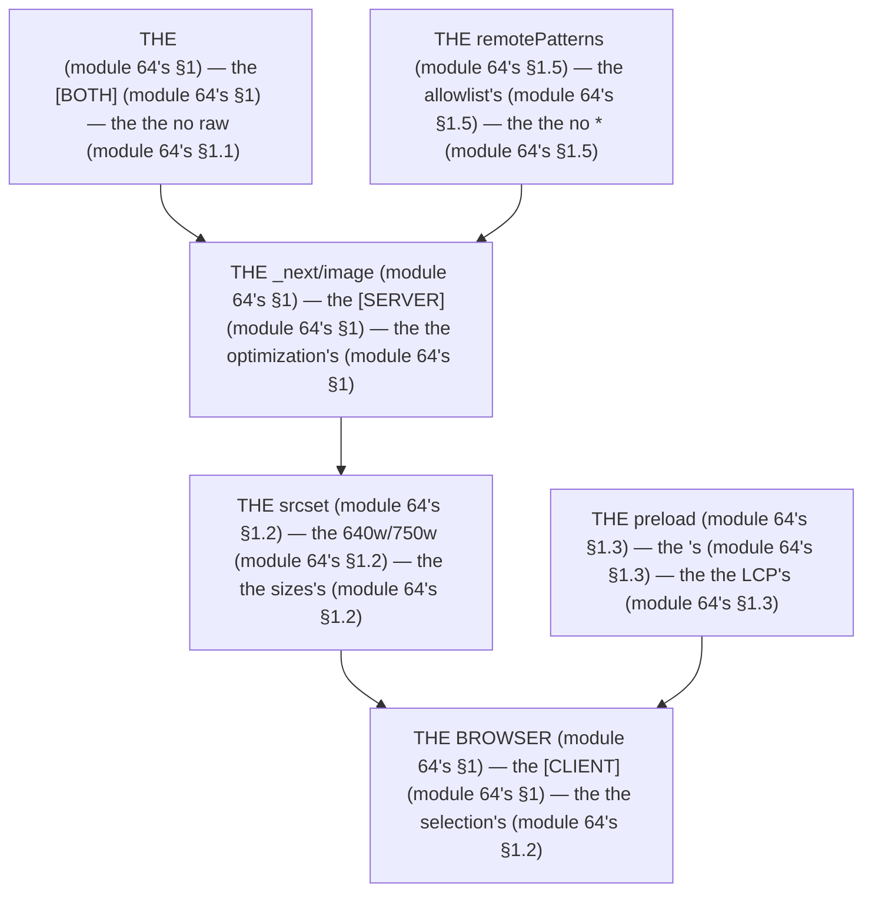

# Module 64 — `next/image` Deep Dive: Responsive, Remote, LCP, and When NOT to Use It

**Phase 15: Images & Fonts · Module 64 of 101**

> **Where does this run?** The `<Image>` component is **`[BOTH]`** (it renders in `[SERVER]` and `[CLIENT]` components; the optimized asset is served by the **`[SERVER]`** Image Optimization route, `_next/image`); the *browser's `srcset` selection* is **`[CLIENT]`**. The module-64's standing rule (module 05's old-vs-modern, now the image level): **`next/image` is the *only* image in the app — raw `` is a bug — and in Next 16, `priority` is *deprecated* in favor of `preload` (the `<link>` in `<head>`), `onLoadingComplete` is *deprecated* in favor of `onLoad`, and the default `loading` is `lazy` (module 64's §1)** (module 64's §1).

---

## 1. Concept — The image is the LCP (the 5 decisions)

**The `src`'s** (module 64's §1.1): the *the internal's* + the *the remote's* (module 64's §1.1) + the *the static import's* (module 64's §1.1) — the *module-64's line: the `src` is the 3's* (module 64's §1.1) — the *the no raw ``'s* (module 64's §1.1).

**The `fill`'s + the `sizes`'s** (module 64's §1.2): the *the responsive's* (module 64's §1.2) — the *module-64's line: the `fill` is the parent's* (module 64's §1.2) — the *the no `100vw`'s* (module 64's §1.2).

**The `preload`'s** (module 64's §1.3): the *the LCP's* (module 64's §1.3) — the *module-64's line: the `preload` is the `<link>`'s* (module 64's §1.3) — the *the no `priority`'s* (module 64's §1.3) — the *the no multiple's* (module 64's §1.3).

**The `loading`'s** (module 64's §1.4): the *the `lazy`'s default* (module 64's §1.4) — the *module-64's line: the `loading` is the `lazy`'s* (module 64's §1.4) — the *the `eager`'s is the LCP's* (module 64's §1.4).

**The `remotePatterns`'s** (module 64's §1.5): the *the allowlist's* (module 64's §1.5) — the *module-64's line: the `remotePatterns` is the allowlist's* (module 64's §1.5) — the *the no `*`'s* (module 64's §1.5).

## 2. Mental Model — The image's pipeline (drawn)



**The image's pipeline** (the module-64's mental model):
1. **The `src`** (module 64's §1.1): the *the 3's* — the *module-64's line: the `src` is the 3's* (module 64's §1.1).
2. **The `_next/image`** (module 64's §1): the *the optimization's* — the *the `[SERVER]`* (module 64's §1).
3. **The `srcset`** (module 64's §1.2): the *the `sizes`'s* — the *module-64's line: the `fill` is the parent's* (module 64's §1.2).
4. **The `remotePatterns`** (module 64's §1.5): the *the allowlist's* — the *module-64's line: the `remotePatterns` is the allowlist's* (module 64's §1.5).
5. **The `preload`** (module 64's §1.3): the *the LCP's* — the *module-64's line: the `preload` is the `<link>`'s* (module 64's §1.3).

## 3. Architecture — The 5 decisions (the code)

### 3.1 The `src`'s (module 64's §1.1 — the 3 modes)

`FILE: src/components/product-image.tsx` (production pattern — [BOTH] — the module-64's §3.1)

```tsx
// THE SRC'S (module 64's §1.1) — the the 3's (module 64's §1.1) — the the no raw  (module 64's §1.1):
// 1) THE INTERNAL'S (module 64's §3.1) — the the /public's (module 64's §1.1):
<Image src="/logo.png" width={500} height={500} alt="SaaS Platform logo" />   /* the module-64's line: the width/height is the aspect's (module 64's §3.1) */

// 2) THE STATIC IMPORT'S (module 64's §3.1) — the the blurDataURL's auto (module 64's §3.1):
import hero from '@/public/hero.png'
<Image src={hero} width={1200} height={630} alt="Hero" />   /* the module-64's line: the blurDataURL is the auto's (module 64's §3.1) */

// 3) THE REMOTE'S (module 64's §3.1) — the the remotePatterns's (module 64's §1.5):
<Image src="https://cdn.example.com/products/1.png" width={800} height={600} alt="Product" />   /* the module-64's line: the remote's is the allowlist's (module 64's §1.5) */
```

**The module-64's line:** the *`src` is the 3's* (module 64's §1.1) — the *the `width`/`height` is the aspect's* (module 64's §3.1) — the *the no raw ``'s* (module 64's §1.1).

### 3.2 The `fill`'s + the `sizes`'s (module 64's §1.2 — the responsive's)

`FILE: src/components/gallery-image.tsx` (production pattern — [BOTH] — the module-64's §3.2)

```tsx
// THE FILL'S (module 64's §1.2) — the the parent's (module 64's §1.2) — the the relative's (module 64's §3.2):
<Image
  fill
  src="/products/1.png"
  sizes="(max-width: 768px) 100vw, (max-width: 1200px) 50vw, 33vw"   /* the module-64's line: the sizes is the responsive's (module 64's §1.2) — the the no 100vw's (module 64's §1.2) */
  style={{ objectFit: 'cover' }}   /* the module-64's line: the objectFit is the cover's (module 64's §1.2) */
  alt="Product in gallery"
  loading="lazy"   /* the module-64's line: the loading is the lazy's (module 64's §1.4) */
/>
/* THE PARENT (module 64's §3.2) — the the relative's (module 64's §1.2):
   <div className="relative aspect-[4/3]">
     <Image fill ... />
   </div>   (module 64's §3.2) */
```

**The module-64's line:** the *`fill` is the parent's* (module 64's §1.2) — the *the `sizes` is the responsive's* (module 64's §1.2) — the *the no `100vw`'s* (module 64's §1.2) — the *the `objectFit` is the `cover`'s* (module 64's §1.2).

### 3.3 The `preload`'s (module 64's §1.3 — the LCP's)

`FILE: src/components/hero-image.tsx` (production pattern — [BOTH] — the module-64's §3.3)

```tsx
// THE PRELOAD'S (module 64's §1.3) — the the LCP's (module 64's §1.3) — the the no priority's (module 64's §1.3):
<Image
  src="/hero.png"
  width={1200}
  height={630}
  alt="Hero"
  preload   /* the module-64's line: the preload is the <link>'s (module 64's §1.3) — the the no priority's (module 64's §1.3) */
/>
/* THE RULE (module 64's §3.3): the the preload is the LCP's (module 64's §1.3) — the the no multiple's (module 64's §1.3) — the the no loading's (module 64's §1.3) — the the no fetchPriority's (module 64's §1.3) */
/* THE OLD (module 5's) — the the priority's (module 64's §1.3):
   <Image priority />   (module 64's §1.3) — the the DEPRECATED (module 64's §1.3) — the the no priority's (module 64's §1.3) */
/* THE ALTERNATIVE (module 64's §3.3) — the the loading="eager" (module 64's §1.4) — the the fetchPriority="high" (module 64's §1.4):
   <Image loading="eager" fetchPriority="high" />   (module 64's §3.3) — the the no preload's (module 64's §1.3) */
```

**The module-64's line:** the *`preload` is the LCP's* (module 64's §1.3) — the *the no `priority`'s* (module 64's §1.3) — the *the no multiple's* (module 64's §1.3) — the *the `loading="eager"` is the alternative's* (module 64's §3.3).

### 3.4 The `remotePatterns`'s (module 64's §1.5 — the allowlist's)

`FILE: next.config.ts` (production pattern — the module-64's §3.4: the config's)

```ts
// THE REMOTEPATTERNS (module 64's §1.5) — the the allowlist's (module 64's §1.5) — the the no *'s (module 64's §1.5):
import type { NextConfig } from 'next'

const nextConfig: NextConfig = {
  images: {
    remotePatterns: [   /* the module-64's line: the remotePatterns is the allowlist's (module 64's §1.5) */
      {
        protocol: 'https',
        hostname: 'cdn.example.com',   /* the module-64's line: the hostname is the specific's (module 64's §1.5) — the the no *'s (module 64's §1.5) */
        pathname: '/products/**',   /* the module-64's line: the pathname is the glob's (module 64's §1.5) */
      },
      {
        protocol: 'https',
        hostname: 'images.unsplash.com',
      },
    ],
    formats: ['image/avif', 'image/webp'],   /* the module-64's line: the formats is the modern's (module 64's §3.4) */
    quality: 75,   /* the module-64's line: the quality is the 75's (module 64's §1.4) */
  },
}

export default nextConfig
```

**The module-64's line:** the *`remotePatterns` is the allowlist's* (module 64's §1.5) — the *the no `*`'s* (module 64's §1.5) — the *the `formats` is the `avif`/`webp`'s* (module 64's §3.4) — the *the `quality` is the 75's* (module 64's §1.4).

### 3.5 The `unoptimized`'s (module 64's §3.5 — the auth's)

`FILE: src/components/protected-image.tsx` (production pattern — [BOTH] — the module-64's §3.5)

```tsx
// THE UNOPTIMIZED (module 64's §3.5) — the the auth's (module 64's §3.5) — the the no headers' (module 64's §3.5):
<Image
  src="/protected/invoice.png"
  width={800}
  height={600}
  alt="Invoice"
  unoptimized   /* the module-64's line: the unoptimized is the auth's (module 64's §3.5) — the the no headers' (module 64's §3.5) */
/>
/* THE RULE (module 64's §3.5): the the default loader does NOT forward headers (module 64's §3.5) — the the unoptimized is the auth's (module 64's §3.5) */
```

**The module-64's line:** the *`unoptimized` is the auth's* (module 64's §3.5) — the *the no headers'* (module 64's §3.5).

## 4. Production Code — The `loader`'s (module 64's §4)

`FILE: next.config.ts` + `FILE: src/lib/image-loader.ts` (production pattern — the module-64's §4: the custom's)

```ts
// THE LOADER'S (module 64's §4) — the the loaderFile's (module 64's §4) — the the no per-instance's (module 64's §4):
// 'use client'
// export default function imageLoader({ src, width, quality }) {   (module 64's §4)
//   return `https://cdn.example.com/${src}?w=${width}&q=${quality || 75}`   (module 64's §4) — the the Cloudinary's (module 64's §4)
// }
// const nextConfig: NextConfig = {
//   images: { loaderFile: './src/lib/image-loader.ts' },   (module 64's §4) — the the no per-instance's (module 64's §4)
// }
```

**The module-64's line:** the *`loaderFile` is the app's* (module 64's §4) — the *the no per-instance's* (module 64's §4).

## 5. Common Mistakes (the image's failures)

| Mistake | The symptom | Fix |
|---|---|---|
| **The raw ``** (module 64's §1.1's line violated) | the *module-64's line: the no raw ``'s* (module 64's §1.1) — the *the raw ``'s is the *no's* (module 64's §1.1) — the *module-64's line: the no raw ``'s* (module 64's §1.1) — the *no raw ``'s* (module 64's §1.1)* | the *the `<Image>`'s (module 64's §1.1) — the *module-64's line: the no raw ``'s* (module 64's §1.1)* |
| **The `priority`'s** (module 64's §1.3's line violated) | the *module-64's line: the no `priority`'s* (module 64's §1.3) — the *the `priority`'s is the *no's* (module 64's §1.3) — the *module-64's line: the no `priority`'s* (module 64's §1.3) — the *no `priority`'s* (module 64's §1.3)* | the *the `preload`'s (module 64's §1.3) — the *module-64's line: the `preload` is the `<link>`'s* (module 64's §1.3)* |
| **The no `sizes`** (module 64's §1.2's line violated) | the *module-64's line: the `sizes` is the responsive's* (module 64's §1.2) — the *the no `sizes`'s is the *no's* (module 64's §1.2) — the *module-64's line: the no `sizes`'s* (module 64's §1.2) — the *no `sizes`'s* (module 64's §1.2)* | the *the `sizes="(max-width: 768px) 100vw, ..."`'s (module 64's §1.2) — the *module-64's line: the `sizes` is the responsive's* (module 64's §1.2)* |
| **The `*` in the `remotePatterns`** (module 64's §1.5's line violated) | the *module-64's line: the no `*`'s* (module 64's §1.5) — the *the `*` in the `remotePatterns`'s is the *no's* (module 64's §1.5) — the *module-64's line: the no `*`'s* (module 64's §1.5) — the *no `*`'s* (module 64's §1.5)* | the *the specific's `hostname` (module 64's §1.5) — the *module-64's line: the `remotePatterns` is the allowlist's* (module 64's §1.5)* |
| **The `onLoadingComplete`** (module 64's §1's line violated) | the *module-64's line: the no `onLoadingComplete`'s* (module 64's §1) — the *the `onLoadingComplete`'s is the *no's* (module 64's §1) — the *module-64's line: the no `onLoadingComplete`'s* (module 64's §1) — the *no `onLoadingComplete`'s* (module 64's §1)* | the *the `onLoad`'s (module 64's §1) — the *module-64's line: the no `onLoadingComplete`'s* (module 64's §1)* |
| **The `100vw`** (module 64's §1.2's line violated) | the *module-64's line: the no `100vw`'s* (module 64's §1.2) — the *the `100vw`'s is the *no's* (module 64's §1.2) — the *module-64's line: the no `100vw`'s* (module 64's §1.2) — the *no `100vw`'s* (module 64's §1.2)* | the *the `sizes`'s (module 64's §1.2) — the *module-64's line: the `sizes` is the responsive's* (module 64's §1.2)* |

## 6. Security Notes

- **The `remotePatterns`'s is the allowlist's** (module 64's §1.5): the *module-64's line: the `remotePatterns` is the allowlist's* (module 64's §1.5) — the *module-75's* *deep-dive* (module 75's).
- **The `unoptimized`'s is the auth's** (module 64's §3.5): the *module-64's line: the `unoptimized` is the auth's* (module 64's §3.5) — the *module-43's* *deep-dive* (module 43's).
- **The `alt`'s is the a11y's** (module 60's §1.1): the *module-60's line: the a11y's is the 4 rules* (module 60's) — the *module-64's line: the `alt` is the a11y's* (module 60's) — the *module-60's* *deep-dive* (module 60's).

## 7. Performance Notes

- **The `avif`/`webp`'s** (module 64's §3.4): the *module-64's line: the `formats` is the modern's* (module 64's §3.4) — the *the no `png`'s* (module 64's §3.4).
- **The `lazy`'s** (module 64's §1.4): the *module-64's line: the `loading` is the `lazy`'s* (module 64's §1.4) — the *the no above-fold's* (module 64's §1.4).
- **The `preload`'s is the LCP's** (module 64's §1.3): the *module-64's line: the `preload` is the `<link>`'s* (module 64's §1.3) — the *the no CLS's* (module 64's §3.1).

## 8. Exercise

**Beginner.** *The `src`'s 3 modes* (module 64's §3.1): the *the internal's* (module 3.1's) + the *the static import's* (module 3.1's) + the *the remote's* (module 3.1's) — *build it* — the *artifact: the 3's* (module 20's).

**Intermediate.** *The `fill`'s + the `sizes`'s* (module 64's §3.2): the *the `fill`'s* (module 3.2's) + the *the `sizes`'s* (module 3.2's) + the *the `objectFit`'s* (module 3.2's) — *build it* — the *artifact: the responsive's* (module 3.2's).

**Production.** *The `preload`'s + the `remotePatterns`'s* (module 64's §3.3 + §3.4): the *the `preload`'s* (module 3.3's) + the *the `remotePatterns`'s* (module 3.4's) + the *the `unoptimized`'s* (module 3.5's) — *build it* — the *artifact: the LCP's* (module 3.3's).

## 9. Architecture Challenge

**Prompt:** The *"the team's product gallery uses raw ``, the LCP is 4s, and the remote CDN is not in the `remotePatterns`"* (the *module-64's* *image* — the *module-64's line: the no raw ``'s* (module 64's §1.1) — the *module-64's line: the `preload` is the `<link>`'s* (module 64's §1.3) — the *module-64's standing line: the no raw ``'s + the `preload` is the LCP's + the `remotePatterns` is the allowlist's* (module 64's §1.1 + module 64's §1.3 + module 64's §1.5)).

The *problems*: (1) the *the raw ``'s* (the *the no `<Image>`'s* (module 64's §1.1) — the *module-64's line: the no raw ``'s* (module 64's §1.1) — the *module-64's standing line: the no raw ``'s* (module 64's §1.1)).

(2) the *the no `remotePatterns`'s* (the *the no allowlist's* (module 64's §1.5) — the *module-64's line: the `remotePatterns` is the allowlist's* (module 64's §1.5) — the *module-64's standing line: the `remotePatterns` is the allowlist's* (module 64's §1.5)).

**Design**: the *the image's remediation* (the *the `<Image>`'s* (module 64's §1.1) + the *the `preload`'s* (module 64's §1.3) + the *the `remotePatterns`'s* (module 64's §1.5) + the *the `sizes`'s* (module 64's §1.2) — the *module-64's line: the no raw ``'s* (module 64's §1.1) — the *module-64's standing line: the no raw ``'s + the `preload` is the LCP's + the `remotePatterns` is the allowlist's* (module 64's §1.1 + module 64's §1.3 + module 64's §1.5)).

Produce: the *the image's remediation* (the *the `<Image>`'s* (module 64's §1.1) + the *the `preload`'s* (module 64's §1.3) + the *the `remotePatterns`'s* (module 64's §1.5) + the *the `sizes`'s* (module 64's §1.2) — the *module-64's line: the no raw ``'s* (module 64's §1.1) — the *module-64's standing line: the no raw ``'s + the `preload` is the LCP's + the `remotePatterns` is the allowlist's* (module 64's §1.1 + module 64's §1.3 + module 64's §1.5)).

<details>
<summary>Model answer</summary>
**The image's remediation** (module 64's §1.1 + module 64's §1.3 + module 64's §1.5 + module 64's §1.2):
1. **The `<Image>`'s** (module 64's §1.1): the *the `<Image>` replaces the raw ``'s* — the *module-64's line: the no raw ``'s* (module 64's §1.1).
2. **The `preload`'s** (module 64's §1.3): the *the `preload` is the LCP's* — the *module-64's line: the `preload` is the `<link>`'s* (module 64's §1.3).
3. **The `remotePatterns`'s** (module 64's §1.5): the *the allowlist's is the CDN's* — the *module-64's line: the `remotePatterns` is the allowlist's* (module 64's §1.5).
4. **The `sizes`'s** (module 64's §1.2): the *the `sizes` is the responsive's* — the *module-64's line: the `sizes` is the responsive's* (module 64's §1.2).
**The generalization** (the *image's* pattern, the *module's* standing rule): **the *no raw ``'s* (module 64's §1.1) — the *the `preload` is the LCP's* (module 64's §1.3) — the *the `remotePatterns` is the allowlist's* (module 64's §1.5) — the *module-64's standing line: the no raw ``'s + the `preload` is the LCP's + the `remotePatterns` is the allowlist's* (module 64's §1.1 + module 64's §1.3 + module 64's §1.5)*.
</details>

## 10. Official Documentation

- Next.js: `next/image`: https://nextjs.org/docs/app/api-reference/components/image
- Next.js: `remotePatterns`: https://nextjs.org/docs/app/api-reference/components/image#remotepatterns
- Next.js: `ImageResponse`: https://nextjs.org/docs/app/api-reference/functions/image-response
- web.dev: Responsive images: https://web.dev/learn/design/responsive-images/
- web.dev: Preload: https://web.dev/preload-responsive-images/
- The module-65's fonts: the module-65 (the phase-15's file-02)

## 11. What You Should Know Before Continuing

- [ ] I can state the *5 decisions* (module 1's: the `src`/`fill`/`preload`/`loading`/`remotePatterns`) — the *module-64's line: the image's is the 5's* (module 1's)
- [ ] I know the *no raw ``'s* (module 1.1's)
- [ ] I know the *`preload` is the `<link>`'s* (module 1.3's) — the *the no `priority`'s* (module 1.3's)
- [ ] I know the *`sizes` is the responsive's* (module 1.2's) — the *the no `100vw`'s* (module 1.2's)
- [ ] I know the *`remotePatterns` is the allowlist's* (module 1.5's) — the *the no `*`'s* (module 1.5's)
- [ ] I know the *`unoptimized` is the auth's* (module 3.5's) — the *the no headers'* (module 3.5's)
- [ ] I know the *no `onLoadingComplete`'s* (module 1's) — the *the `onLoad`'s* (module 1's)
- [ ] I've done the *`src`'s 3 modes* (module 8's beginner) + the *`fill`/`sizes`* (module 8's intermediate) + the *`preload`/`remotePatterns`* (module 8's production) — the *artifacts* (module 20's)

**Next:** Module 65 — `next/font` Deep Dive (the *the `Google`'s vs the `local`'s* — the *the `display`'s* — the *module-65's line: the font is the self-hosted's* (module 65's)).
