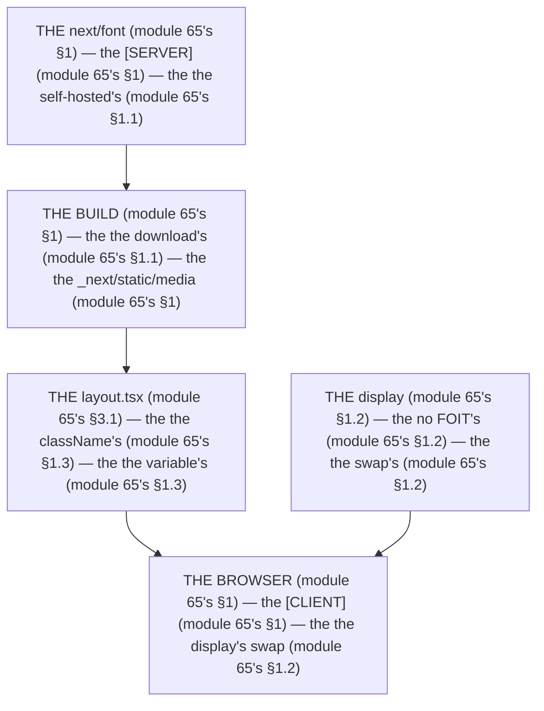

# Module 65 — `next/font` Deep Dive: Self-Hosting, `display`, and the Typography Scale

**Phase 15: Images & Fonts · Module 65 of 101**

> **Where does this run?** The `next/font` config is **`[SERVER]`** (the `layout.tsx`'s `className` — the `[SERVER]` renders the font's CSS variables into the HTML); the *font files* are served **`[SERVER]`** (the `_next/static/media` route); the *browser's font rendering* is **`[CLIENT]`. The module-65's standing rule (module 64's, now the font level): **`next/font` is *self-hosting* by default — the font is downloaded at *build time*, served from *your* origin, and the `display` swap is the FOIT's no (module 65's §1); a `<link>` to Google Fonts is the *old* way (module 65's §1)** (module 65's §1).

---

## 1. Concept — The font is self-hosted (the 4 decisions)

**The `google`'s vs the `local`'s** (module 65's §1.1): the *the `next/font/google`'s* (module 65's §1.1) + the *the `next/font/local`'s* (module 65's §1.1) — the *module-65's line: the font is the self-hosted's* (module 65's §1.1) — the *the no `<link>`'s* (module 65's §1.1).

**The `display`'s** (module 65's §1.2): the *the `swap`'s* (module 65's §1.2) — the *module-65's line: the `display` is the `swap`'s* (module 65's §1.2) — the *the no FOIT's* (module 65's §1.2).

**The `variable`'s** (module 65's §1.3): the *the CSS variable's* (module 65's §1.3) — the *module-65's line: the `variable` is the CSS's* (module 65's §1.3) — the *module-57's line: the font is the token's* (module 57's §1.2).

**The `adjustFontFallback`'s** (module 65's §1.4): the *the metric's match* (module 65's §1.4) — the *module-65's line: the `adjustFontFallback` is the no-CLS's* (module 65's §1.4) — the *the no shift's* (module 65's §1.4).

## 2. Mental Model — The font's pipeline (drawn)



**The font's pipeline** (the module-65's mental model):
1. **The `next/font`** (module 65's §1.1): the *the self-hosted's* — the *module-65's line: the font is the self-hosted's* (module 65's §1.1).
2. **The build** (module 65's §1.1): the *the download's* — the *the `_next/static/media`* (module 65's §1).
3. **The `layout.tsx`** (module 65's §3.1): the *the `className`'s* — the *module-65's line: the `variable` is the CSS's* (module 65's §1.3).
4. **The `display`** (module 65's §1.2): the *the `swap`'s* — the *module-65's line: the no FOIT's* (module 65's §1.2).

## 3. Architecture — The 4 decisions (the code)

### 3.1 The `google`'s (module 65's §1.1 — the `Geist`'s)

`FILE: app/layout.tsx` (production pattern — [SERVER] — the module-65's §3.1: the self-hosted's)

```tsx
// THE GOOGLE'S (module 65's §1.1) — the the self-hosted's (module 65's §1.1) — the the no <link>'s (module 65's §1.1):
import { Geist, Geist_Mono } from 'next/font/google'   /* the module-65's line: the font is the next/font's (module 65's §1.1) */

const geistSans = Geist({
  subsets: ['latin'],   /* the module-65's line: the subsets is the latin's (module 65's §1.1) */
  variable: '--font-geist-sans',   /* the module-65's line: the variable is the CSS's (module 65's §1.3) — the module-57's line: the font is the token's (module 57's §1.2) */
  display: 'swap',   /* the module-65's line: the display is the swap's (module 65's §1.2) — the the no FOIT's (module 65's §1.2) */
})

const geistMono = Geist_Mono({
  subsets: ['latin'],
  variable: '--font-geist-mono',   /* the module-65's line: the variable is the CSS's (module 65's §1.3) */
  display: 'swap',   /* the module-65's line: the display is the swap's (module 65's §1.2) */
})

export default function RootLayout({ children }: { children: React.ReactNode }) {
  return (
    <html lang="en" suppressHydrationWarning>   /* the module-57's line: the suppressHydrationWarning is the dark's (module 57's §1.4) */
      <body className={`${geistSans.variable} ${geistMono.variable}`}>   /* the module-65's line: the variable is the body's (module 65's §1.3) */
        {children}
      </body>
    </html>
  )
}
```

```css
/* THE TOKEN'S (module 57's §1.2) — the the font's is the token's (module 57's §1.2): */
@theme inline {
  --font-sans: var(--font-geist-sans);   /* the module-65's line: the font is the token's (module 57's §1.2) */
  --font-mono: var(--font-geist-mono);   /* the module-65's line: the font is the token's (module 57's §1.2) */
}
```

**The module-65's line:** the *font is the self-hosted's* (module 65's §1.1) — the *the `variable` is the CSS's* (module 65's §1.3) — the *the `display` is the `swap`'s* (module 65's §1.2) — the *the no `<link>`'s* (module 65's §1.1).

### 3.2 The `local`'s (module 65's §1.1 — the self-hosted's file)

`FILE: src/fonts/Inter.ts` + `FILE: app/layout.tsx` (production pattern — [SERVER] — the module-65's §3.2: the file's)

```ts
// THE LOCAL'S (module 65's §1.1) — the the self-hosted's file (module 65's §3.2) — the the no google's (module 65's §1.1):
import { Inter } from 'next/font/google'   /* THE EXAMPLE (module 65's §3.2) — the the google's (module 65's §1.1) */
/* THE LOCAL'S (module 65's §3.2) — the the next/font/local (module 65's §1.1): */
// import localFont from 'next/font/local'
// const inter = localFont({
//   src: [
//     { path: './Inter-Regular.woff2', weight: '400', style: 'normal' },   /* the module-65's line: the src is the file's (module 65's §3.2) */
//     { path: './Inter-Bold.woff2', weight: '700', style: 'normal' },
//   ],
//   variable: '--font-inter',   /* the module-65's line: the variable is the CSS's (module 65's §1.3) */
//   display: 'swap',   /* the module-65's line: the display is the swap's (module 65's §1.2) */
// })
/* THE RULE (module 65's §3.2): the the local is the self-hosted's (module 65's §1.1) — the the no google's (module 65's §1.1) — the the woff2's (module 65's §3.2) */
```

**The module-65's line:** the *`local` is the self-hosted's* (module 65's §1.1) — the *the `src` is the file's* (module 65's §3.2) — the *the `woff2`'s* (module 65's §3.2).

### 3.3 The `display`'s (module 65's §1.2 — the `swap`'s)

`FILE: app/layout.tsx` (production pattern — [SERVER] — the module-65's §3.3: the FOIT's no)

```tsx
// THE DISPLAY'S (module 65's §1.2) — the the swap's (module 65's §1.2) — the the no FOIT's (module 65's §1.2):
// display: 'swap'   /* the module-65's line: the swap is the no FOIT's (module 65's §1.2) — the the fallback's (module 65's §1.2) */
// display: 'block'   /* the module-65's line: the block is the FOIT's (module 65's §1.2) — the the no swap's (module 65's §1.2) */
// display: 'optional'   /* the module-65's line: the optional is the LCP's (module 65's §1.2) — the the no swap's (module 65's §1.2) */
// THE RULE (module 65's §3.3): the the swap is the no FOIT's (module 65's §1.2) — the the block is the FOIT's (module 65's §1.2) — the the optional is the LCP's (module 65's §1.2)
```

**The module-65's line:** the *`swap` is the no FOIT's* (module 65's §1.2) — the *the `block` is the FOIT's* (module 65's §1.2) — the *the `optional` is the LCP's* (module 65's §1.2).

### 3.4 The `adjustFontFallback`'s (module 65's §1.4 — the no-CLS's)

`FILE: app/layout.tsx` (production pattern — [SERVER] — the module-65's §3.4: the metric's)

```tsx
// THE ADJUSTFONTFALLBACK (module 65's §1.4) — the the metric's match (module 65's §1.4) — the the no shift's (module 65's §1.4):
const geistSans = Geist({
  subsets: ['latin'],
  variable: '--font-geist-sans',
  display: 'swap',
  adjustFontFallback: true,   /* the module-65's line: the adjustFontFallback is the no-CLS's (module 65's §1.4) — the the no shift's (module 65's §1.4) */
})
/* THE RULE (module 65's §3.4): the the adjustFontFallback is the no-CLS's (module 65's §1.4) — the the no shift's (module 65's §1.4) */
```

**The module-65's line:** the *`adjustFontFallback` is the no-CLS's* (module 65's §1.4) — the *the no shift's* (module 65's §1.4).

### 3.5 The typography scale (module 65's §3.5 — the token's)

`FILE: app/globals.css` (production pattern — [BOTH] — the module-65's §3.5: the scale's)

```css
/* THE TYPOGRAPHY'S SCALE (module 65's §3.5) — the the token's (module 57's §1.2) — the the no arbitrary's (module 65's §3.5): */
@theme inline {
  --font-sans: var(--font-geist-sans);   /* the module-65's line: the font is the token's (module 57's §1.2) */
  --text-xs: 0.75rem;   /* the module-65's line: the text-xs is the 0.75rem (module 65's §3.5) */
  --text-sm: 0.875rem;   /* the module-65's line: the text-sm is the 0.875rem (module 65's §3.5) */
  --text-base: 1rem;   /* the module-65's line: the text-base is the 1rem (module 65's §3.5) */
  --text-lg: 1.125rem;   /* the module-65's line: the text-lg is the 1.125rem (module 65's §3.5) */
  --text-xl: 1.25rem;   /* the module-65's line: the text-xl is the 1.25rem (module 65's §3.5) */
  --text-2xl: 1.5rem;   /* the module-65's line: the text-2xl is the 1.5rem (module 65's §3.5) */
  --text-3xl: 1.875rem;   /* the module-65's line: the text-3xl is the 1.875rem (module 65's §3.5) */
  --leading-tight: 1.25;   /* the module-65's line: the leading-tight is the 1.25 (module 65's §3.5) */
  --leading-normal: 1.5;   /* the module-65's line: the leading-normal is the 1.5 (module 65's §3.5) */
}
/* THE RULE (module 65's §3.5): the the scale is the token's (module 57's §1.2) — the the no arbitrary's (module 65's §3.5) */
```

**The module-65's line:** the *scale is the token's* (module 57's §1.2) — the *the no arbitrary's* (module 65's §3.5).

## 4. Production Code — The `preload`'s (module 65's §4)

`FILE: app/layout.tsx` (production pattern — [SERVER] — the module-65's §4: the critical's)

```tsx
// THE PRELOAD'S (module 65's §4) — the the critical's (module 65's §4) — the the no lazy's (module 65's §4):
const geistSans = Geist({
  subsets: ['latin'],
  variable: '--font-geist-sans',
  display: 'swap',
  preload: true,   /* the module-65's line: the preload is the critical's (module 65's §4) — the the no lazy's (module 65's §4) */
})
/* THE RULE (module 65's §4): the the preload is the critical's (module 65's §4) — the the no lazy's (module 65's §4) */
```

**The module-65's line:** the *`preload` is the critical's* (module 65's §4) — the *the no lazy's* (module 65's §4).

## 5. Common Mistakes (the font's failures)

| Mistake | The symptom | Fix |
|---|---|---|
| **The `<link>`'s** (module 65's §1.1's line violated) | the *module-65's line: the no `<link>`'s* (module 65's §1.1) — the *the `<link>`'s is the *no's* (module 65's §1.1) — the *module-65's line: the no `<link>`'s* (module 65's §1.1) — the *no `<link>`'s* (module 65's §1.1)* | the *the `next/font`'s (module 65's §1.1) — the *module-65's line: the font is the self-hosted's* (module 65's §1.1)* |
| **The `block`'s** (module 65's §1.2's line violated) | the *module-65's line: the no FOIT's* (module 65's §1.2) — the *the `block`'s is the *no's* (module 65's §1.2) — the *module-65's line: the no `block`'s* (module 65's §1.2) — the *no `block`'s* (module 65's §1.2)* | the *the `swap`'s (module 65's §1.2) — the *module-65's line: the `display` is the `swap`'s* (module 65's §1.2)* |
| **The no `variable`** (module 65's §1.3's line violated) | the *module-65's line: the `variable` is the CSS's* (module 65's §1.3) — the *the no `variable`'s is the *no's* (module 65's §1.3) — the *module-65's line: the no `variable`'s* (module 65's §1.3) — the *no `variable`'s* (module 65's §1.3)* | the *the `variable: '--font-geist-sans'`'s (module 65's §1.3) — the *module-65's line: the `variable` is the CSS's* (module 65's §1.3)* |
| **The no `adjustFontFallback`** (module 65's §1.4's line violated) | the *module-65's line: the no-CLS's* (module 65's §1.4) — the *the no `adjustFontFallback`'s is the *no's* (module 65's §1.4) — the *module-65's line: the no `adjustFontFallback`'s* (module 65's §1.4) — the *no `adjustFontFallback`'s* (module 65's §1.4)* | the *the `adjustFontFallback: true`'s (module 65's §1.4) — the *module-65's line: the `adjustFontFallback` is the no-CLS's* (module 65's §1.4)* |
| **The arbitrary's size** (module 65's §3.5's line violated) | the *module-65's line: the no arbitrary's* (module 65's §3.5) — the *the arbitrary's size's is the *no's* (module 65's §3.5) — the *module-65's line: the no arbitrary's* (module 65's §3.5) — the *no arbitrary's* (module 65's §3.5)* | the *the `text-sm`'s (module 65's §3.5) — the *module-65's line: the no arbitrary's* (module 65's §3.5)* |
| **The `ttf`'s** (module 65's §3.2's line violated) | the *module-65's line: the `woff2`'s* (module 65's §3.2) — the *the `ttf`'s is the *no's* (module 65's §3.2) — the *module-65's line: the no `ttf`'s* (module 65's §3.2) — the *no `ttf`'s* (module 65's §3.2)* | the *the `woff2`'s (module 65's §3.2) — the *module-65's line: the `woff2`'s* (module 65's §3.2)* |

## 6. Security Notes

- **The self-hosted's** (module 65's §1.1): the *module-65's line: the font is the self-hosted's* (module 65's §1.1) — the *module-75's* *deep-dive* (module 75's).
- **The no `<link>`'s** (module 65's §1.1): the *module-65's line: the no `<link>`'s* (module 65's §1.1) — the *module-75's* *deep-dive* (module 75's).
- **The `preload`'s** (module 65's §4): the *module-65's line: the `preload` is the critical's* (module 65's §4) — the *module-64's* *deep-dive* (module 64's).

## 7. Performance Notes

- **The `woff2`'s** (module 65's §3.2): the *module-65's line: the `woff2`'s* (module 65's §3.2) — the *the no `ttf`'s* (module 65's §3.2).
- **The `swap`'s** (module 65's §1.2): the *module-65's line: the `display` is the `swap`'s* (module 65's §1.2) — the *the no FOIT's* (module 65's §1.2).
- **The `adjustFontFallback`'s** (module 65's §1.4): the *module-65's line: the `adjustFontFallback` is the no-CLS's* (module 65's §1.4) — the *the no shift's* (module 65's §1.4).

## 8. Exercise

**Beginner.** *The `google`'s + the `variable`'s* (module 65's §3.1): the *the `Geist`'s* (module 3.1's) + the *the `variable`'s* (module 3.1's) + the *the `@theme`'s* (module 3.1's) — *build it* — the *artifact: the font's* (module 3.1's).

**Intermediate.** *The `display`'s + the `adjustFontFallback`'s* (module 65's §3.3 + §3.4): the *the `swap`'s* (module 3.3's) + the *the `adjustFontFallback`'s* (module 3.4's) — *build it* — the *artifact: the no-FOIT's* (module 3.3's).

**Production.** *The `local`'s + the typography scale's* (module 65's §3.2 + §3.5): the *the `localFont`'s* (module 3.2's) + the *the `@theme`'s scale* (module 3.5's) — *build it* — the *artifact: the self-hosted's* (module 3.2's).

## 9. Architecture Challenge

**Prompt:** The *"the team's site uses a `<link>` to Google Fonts, the LCP is 3s, and there's a visible FOIT flash on every page load"* (the *module-65's* *font* — the *module-64's* *image* — the *module-65's line: the font is the self-hosted's* (module 65's §1.1) — the *module-64's line: the `preload` is the LCP's* (module 64's §1.3) — the *module-65's standing line: the font is the self-hosted's + the `display` is the `swap`'s + the no `<link>`'s* (module 65's §1.1 + module 65's §1.2)).

The *problems*: (1) the *the `<link>`'s* (the *the no `next/font`'s* (module 65's §1.1) — the *module-65's line: the no `<link>`'s* (module 65's §1.1) — the *module-65's standing line: the no `<link>`'s* (module 65's §1.1)).

(2) the *the FOIT's* (the *the no `swap`'s* (module 65's §1.2) — the *module-65's line: the no FOIT's* (module 65's §1.2) — the *module-65's standing line: the no FOIT's* (module 65's §1.2)).

**Design**: the *the font's remediation* (the *the `next/font/google`'s* (module 65's §1.1) + the *the `display: 'swap'`'s* (module 65's §1.2) + the *the `adjustFontFallback`'s* (module 65's §1.4) — the *module-65's line: the font is the self-hosted's* (module 65's §1.1) — the *module-65's standing line: the font is the self-hosted's + the `display` is the `swap`'s + the no `<link>`'s* (module 65's §1.1 + module 65's §1.2)).

Produce: the *the font's remediation* (the *the `next/font/google`'s* (module 65's §1.1) + the *the `display: 'swap'`'s* (module 65's §1.2) + the *the `adjustFontFallback`'s* (module 65's §1.4) — the *module-65's line: the font is the self-hosted's* (module 65's §1.1) — the *module-65's standing line: the font is the self-hosted's + the `display` is the `swap`'s + the no `<link>`'s* (module 65's §1.1 + module 65's §1.2)).

<details>
<summary>Model answer</summary>
**The font's remediation** (module 65's §1.1 + module 65's §1.2 + module 65's §1.4):
1. **The `next/font`'s** (module 65's §1.1): the *the `next/font/google` replaces the `<link>`'s* — the *module-65's line: the font is the self-hosted's* (module 65's §1.1).
2. **The `display`'s** (module 65's §1.2): the *the `swap` is the no FOIT's* — the *module-65's line: the `display` is the `swap`'s* (module 65's §1.2).
3. **The `adjustFontFallback`'s** (module 65's §1.4): the *the `adjustFontFallback` is the no-CLS's* — the *module-65's line: the `adjustFontFallback` is the no-CLS's* (module 65's §1.4).
**The generalization** (the *font's* pattern, the *module's* standing rule): **the *font is the self-hosted's* (module 65's §1.1) — the *the `display` is the `swap`'s* (module 65's §1.2) — the *the no `<link>`'s* (module 65's §1.1) — the *module-65's standing line: the font is the self-hosted's + the `display` is the `swap`'s + the no `<link>`'s* (module 65's §1.1 + module 65's §1.2)*.
</details>

## 10. Official Documentation

- Next.js: `next/font`: https://nextjs.org/docs/app/building-your-application/optimizing/fonts
- Next.js: `next/font/google`: https://nextjs.org/docs/app/building-your-application/optimizing/fonts#using-a-font-from-google
- Next.js: `next/font/local`: https://nextjs.org/docs/app/building-your-application/optimizing/fonts#using-a-local-font
- MDN: `font-display`: https://developer.mozilla.org/en-US/docs/Web/CSS/font-display
- web.dev: Font Loading: https://web.dev/articles/font-loading-strategies
- The module-64's images: the module-64 (the phase-15's file-01)

## 11. What You Should Know Before Continuing

- [ ] I can state the *4 decisions* (module 1's: the `google`/`display`/`variable`/`adjustFontFallback`) — the *module-65's line: the font is the self-hosted's* (module 1's)
- [ ] I know the *no `<link>`'s* (module 1.1's)
- [ ] I know the *`display` is the `swap`'s* (module 1.2's) — the *the no FOIT's* (module 1.2's)
- [ ] I know the *`variable` is the CSS's* (module 1.3's) — the *module-57's line: the font is the token's* (module 57's §1.2)
- [ ] I know the *`adjustFontFallback` is the no-CLS's* (module 1.4's)
- [ ] I know the *`woff2`'s* (module 3.2's) — the *the no `ttf`'s* (module 3.2's)
- [ ] I've done the *`google`/`variable`* (module 8's beginner) + the *`display`/`adjustFontFallback`* (module 8's intermediate) + the *`local`/scale* (module 8's production) — the *artifacts* (module 20's)

**Phase 15 complete.** Images + Fonts — the `next/image`'s responsive + LCP, the `next/font`'s self-hosted + typography scale.

**Next:** Module 66 — Phase 16 (the *the uploads' deep dive* — the *module-66's line: the upload is the multipart's* (module 66's)).
