# Module 66 — File Uploads: Multipart, Validation, Object Storage, and the Security Rules

**Phase 16: File Uploads · Module 66 of 101**

> **Where does this run?** The *upload* is **`[BOTH / BOUNDARY]`** (the `<form>` with `accept` + the client's size hint are `[CLIENT]`, module 51's; the `Server Function` that reads the `FormData` is **`[SERVER]`**, module 29's); the *storage* is **`[SERVER]`** (the object store, the S3 presigned URL); the *public URL* the app later serves is **`[SERVER]`** (the CDN or the storage's public bucket). The module-66's standing rule (module 29's five-step + module 37's tenancy, now the file level): **the server is the only validator — the client's `accept`/`size` is a *hint*, the server re-checks size + MIME + magic bytes; the file name is a `uuid` (module 37's), never the user's; the path is org-scoped (`{orgId}/{uuid}`, module 49's), never caller-supplied (module 66's §1)** (module 66's §1).

---

## 1. Concept — The server is the only validator (the 5 rules)

**The size's** (module 66's §1.1): the *the server's `file.size`'s* (module 66's §1.1) — the *module-66's line: the size is the server's* (module 66's §1.1) — the *the no client's* (module 66's §1.1) — the *the `bodySizeLimit`'s* (module 66's §1.1).

**The MIME's** (module 66's §1.2): the *the `file.type`'s* + the *the magic bytes'* (module 66's §1.2) — the *module-66's line: the MIME is the magic's* (module 66's §1.2) — the *the no extension's* (module 66's §1.2).

**The name's** (module 66's §1.3): the *the `uuid`'s* (module 37's) — the *module-66's line: the name is the uuid's* (module 37's) — the *the no user's* (module 66's §1.3).

**The path's** (module 66's §1.4): the *the `{orgId}/{uuid}`'s* (module 49's) — the *module-66's line: the path is the org's* (module 49's) — the *the no caller's* (module 66's §1.4) — the *module-49's line: the orgId is the session's* (module 49's).

**The storage's** (module 66's §1.5): the *the object store's* (module 66's §1.5) — the *module-66's line: the storage is the S3's* (module 66's §1.5) — the *the no `public/`'s* (module 66's §1.5).

## 2. Mental Model — The upload's pipeline (drawn)

```mermaid
flowchart TD
    A["THE <form> (module 51's) — the [CLIENT] (module 66's §1) — the accept's + the size's hint (module 66's §1.1)"] --> B["THE Server Function (module 29's) — the [SERVER] (module 66's §1) — the FormData's (module 66's §2.1)"]
    B --> C["THE VALIDATION (module 66's §2.1) — the size's (module 66's §1.1) + the MIME's (module 66's §1.2) + the magic bytes (module 66's §1.2)"]
    C --> D["THE STORE (module 66's §1.5) — the S3's (module 66's §1.5) — the orgId/uuid (module 66's §1.4)"]
    D --> E["THE DB (module 37's) — the file's row (module 66's §2.2) — the orgId's FK (module 49's)"]
    E --> F["THE PUBLIC URL (module 66's §1.5) — the CDN's (module 66's §1.5) — the no bucket's path (module 66's §1.5)"]
```



**The upload's pipeline** (the module-66's mental model):
1. **The `<form>`** (module 51's): the *the hint's* — the *module-66's line: the size is the server's* (module 66's §1.1).
2. **The `Server Function`** (module 29's): the *the `FormData`'s* — the *module-66's line: the validation is the server's* (module 66's §2.1).
3. **The store** (module 66's §1.5): the *the S3's* — the *module-66's line: the storage is the S3's* (module 66's §1.5).
4. **The DB** (module 37's): the *the file's row* — the *module-49's line: the orgId is the session's* (module 49's).
5. **The public URL** (module 66's §1.5): the *the CDN's* — the *module-66's line: the no bucket's path* (module 66's §1.5).

## 3. Architecture — The upload's (the code)

### 3.1 The action (module 66's §2.1 — the five-step's)

`FILE: src/actions/uploads.ts` (production pattern — [SERVER] — the module-66's §3.1: the five-step's)

```ts
// THE UPLOAD'S ACTION (module 66's §2.1) — the the five-step's (module 29's) — the the [SERVER] (module 66's §1):
'use server'

import { headers } from 'next/headers'
import { auth } from '@/auth'   /* the module-43's line: the auth is the session's (module 43's) */
import { requirePermission } from '@/auth/permissions'   /* the module-48's line: the RBAC is the 403's (module 48's) */
import { requireOrgMember } from '@/auth/org'   /* the module-49's line: the orgId is the session's (module 49's) */
import { db } from '@/db'
import { files } from '@/db/schema'   /* the module-37's line: the table is the orgId's FK (module 37's) */
import { randomUUID } from 'crypto'   /* the module-37's line: the uuid's (module 37's) */
import { AppError } from '@/lib/errors'   /* the module-5's line: the AppError's (module 5's) */

const MAX_SIZE = 5 * 1024 * 1024   /* the module-66's line: the size is the 5MB's (module 66's §1.1) — the the server's (module 66's §1.1) */
const ALLOWED_TYPES = new Set(['image/png', 'image/jpeg', 'image/webp'])   /* the module-66's line: the MIME is the allowlist's (module 66's §1.2) */

export async function uploadProductImage(formData: FormData) {
  /* STEP 1: THE SESSION (module 43's) — the the getSession's (module 43's): */
  const session = await auth.api.getSession({ headers: await headers() })
  if (!session) throw new AppError('UNAUTHENTICATED', 401)   /* the module-48's line: the 401 is the who's (module 48's) */

  /* STEP 2: THE SHAPE (module 29's) — the the file's (module 66's §1.1 + module 66's §1.2): */
  const file = formData.get('file') as File | null
  if (!file) throw new AppError('FILE_REQUIRED', 400)   /* the module-66's line: the file is the required's (module 66's §1.1) */
  if (file.size > MAX_SIZE) throw new AppError('FILE_TOO_LARGE', 413)   /* the module-66's line: the size is the server's (module 66's §1.1) */
  if (!ALLOWED_TYPES.has(file.type)) throw new AppError('FILE_TYPE_NOT_ALLOWED', 415)   /* the module-66's line: the MIME is the server's (module 66's §1.2) */
  /* THE MAGIC BYTES (module 66's §1.2) — the the no extension's (module 66's §1.2):
     const buf = Buffer.from(await file.slice(0, 8).arrayBuffer())
     if (!isPng(buf) && !isJpeg(buf) && !isWebp(buf)) throw new AppError('FILE_MAGIC_MISMATCH', 415)   (module 66's §1.2) */

  /* STEP 3: THE RBAC (module 48's) — the the orgId's (module 49's): */
  const orgId = requireOrgMember(session.user.id)   /* the module-49's line: the orgId is the session's (module 49's) — the the 404's no-leak (module 49's) */
  requirePermission(session, 'products:write')   /* the module-48's line: the 403 is the what's (module 48's) */

  /* STEP 4: THE TRUTH (module 29's) — the the uuid's (module 37's) + the orgId's path (module 66's §1.4): */
  const key = randomUUID()   /* the module-66's line: the name is the uuid's (module 37's) — the the no user's (module 66's §1.3) */
  const storageKey = `${orgId}/products/${key}${extensionFor(file.type)}`   /* the module-66's line: the path is the org's (module 49's) — the the no caller's (module 66's §1.4) */
  /* THE STORE (module 66's §1.5) — the the S3's (module 66's §1.5) — the the no public/'s (module 66's §1.5):
     await s3.upload({ Bucket: process.env.S3_BUCKET!, Key: storageKey, Body: Buffer.from(await file.arrayBuffer()), ContentType: file.type })   (module 66's §1.5) */

  /* STEP 5: THE DB (module 29's) — the the file's row (module 66's §2.2): */
  const [row] = await db.insert(files).values({
    orgId,   /* the module-49's line: the orgId is the session's (module 49's) */
    key: storageKey,   /* the module-66's line: the key is the orgId/uuid's (module 66's §1.4) */
    name: key,   /* the module-66's line: the name is the uuid's (module 37's) */
    type: file.type,   /* the module-66's line: the type is the server's (module 66's §1.2) */
    size: file.size,   /* the module-66's line: the size is the server's (module 66's §1.1) */
  }).returning()

  /* THE REDIRECT (module 29's) — the the 303's (module 30's):
     redirect(`/org/${orgId}/products?uploaded=${row.id}`)   (module 30's) */
}
```

**The module-66's line:** the *five-step's* (module 29's) — the *size is the server's* (module 66's §1.1) — the *MIME is the magic's* (module 66's §1.2) — the *name is the uuid's* (module 37's) — the *path is the org's* (module 49's).

### 3.2 The DB's row (module 66's §2.2 — the file's table)

`FILE: src/db/schema.ts` (production pattern — [SERVER] — the module-66's §3.2: the tenancy's)

```ts
// THE FILE'S TABLE (module 66's §2.2) — the the orgId's FK (module 37's) — the the uuid's (module 37's):
import { pgTable, uuid, text, integer, timestamp, index } from 'drizzle-orm/pg-core'

export const files = pgTable('files', {
  id: uuid('id').primaryKey().defaultRandom(),   /* the module-37's line: the uuid's (module 37's) */
  orgId: uuid('org_id').notNull().references(() => orgs.id, { onDelete: 'cascade' }),   /* the module-49's line: the orgId is the FK's (module 49's) */
  key: text('key').notNull().unique(),   /* the module-66's line: the key is the orgId/uuid's (module 66's §1.4) — the the no user's (module 66's §1.3) */
  name: text('name').notNull(),   /* the module-66's line: the name is the uuid's (module 37's) */
  type: text('type').notNull(),   /* the module-66's line: the type is the server's (module 66's §1.2) */
  size: integer('size').notNull(),   /* the module-66's line: the size is the server's (module 66's §1.1) */
  createdAt: timestamp('created_at', { withTimezone: true }).notNull().defaultNow(),   /* the module-37's line: the timestamptz's (module 37's) */
}, (t) => [
  index('files_org_idx').on(t.orgId),   /* the module-37's line: the tenancy's index (module 37's) */
])
/* THE RULE (module 66's §3.2): the the orgId is the FK's (module 49's) — the the key is the unique's (module 66's §1.4) — the the no user's name (module 66's §1.3) */
```

**The module-66's line:** the *`orgId` is the FK's* (module 49's) — the *the `key` is the unique's* (module 66's §1.4) — the *the no user's name* (module 66's §1.3).

### 3.3 The presigned URL (module 66's §2.3 — the direct's upload)

`FILE: src/actions/uploads.ts` (production pattern — [SERVER] — the module-66's §3.3: the no server's body)

```ts
// THE PRESIGNED'S (module 66's §2.3) — the the direct's (module 66's §2.3) — the the no server's body (module 66's §2.3):
export async function getPresignedUploadUrl() {
  const session = await auth.api.getSession({ headers: await headers() })
  if (!session) throw new AppError('UNAUTHENTICATED', 401)
  const orgId = requireOrgMember(session.user.id)   /* the module-49's line: the orgId is the session's (module 49's) */
  requirePermission(session, 'products:write')   /* the module-48's line: the 403 is the what's (module 48's) */

  const key = randomUUID()   /* the module-66's line: the name is the uuid's (module 37's) */
  const storageKey = `${orgId}/products/${key}`   /* the module-66's line: the path is the org's (module 49's) */

  /* THE PRESIGNED'S (module 66's §2.3) — the the S3's (module 66's §1.5) — the the 15min's (module 66's §2.3):
     const { url } = await getSignedUrl(s3, new PutObjectCommand({ Bucket: process.env.S3_BUCKET!, Key: storageKey }), { expiresIn: 900 })   (module 66's §2.3) */
  return { url, key: storageKey }   /* the module-66's line: the url is the presigned's (module 66's §2.3) — the the no bucket's path (module 66's §1.5) */
}
/* THE RULE (module 66's §2.3): the the presigned is the direct's (module 66's §2.3) — the the no server's body (module 66's §2.3) — the the 15min's (module 66's §2.3) — the the key is the uuid's (module 37's) */
```

**The module-66's line:** the *presigned is the direct's* (module 66's §2.3) — the *the no server's body* (module 66's §2.3) — the *the 15min's* (module 66's §2.3).

## 4. Production Code — The client's hint (module 66's §4)

`FILE: src/components/upload-form.tsx` (production pattern — [CLIENT] — the module-66's §4: the hint's)

```tsx
// THE CLIENT'S HINT (module 66's §4) — the the accept's (module 66's §1.1) — the the no validation's (module 66's §1.1):
'use client'
import { useActionState } from 'react'   /* the module-29's line: the useActionState's (module 29's) */
import { uploadProductImage } from '@/actions/uploads'
import { Button } from '@/components/ui/button'   /* the module-58's line: the state's is the 7's (module 58's §1) */
import { FormError } from '@/components/form-error'   /* the module-51's line: the error's is the server's (module 53's) */

export function UploadForm() {
  const [state, formAction, isPending] = useActionState(uploadProductImage, null)   /* the module-29's line: the pending's is the state's (module 29's) */
  return (
    <form action={formAction} className="space-y-4">
      <input
        type="file"
        name="file"
        accept="image/png,image/jpeg,image/webp"   /* the module-66's line: the accept is the hint's (module 66's §1.1) — the the no validation's (module 66's §1.1) */
        className="block w-full text-sm"
      />
      {state?.error && <FormError error={state.error} />}   /* the module-53's line: the error's is the server's (module 53's) */
      <Button type="submit" loading={isPending}>Upload</Button>   /* the module-58's line: the loading's is the isPending's (module 58's §1.5) */
    </form>
  )
}
```

**The module-66's line:** the *`accept` is the hint's* (module 66's §1.1) — the *the no validation's* (module 66's §1.1) — the *the `loading` is the `isPending`'s* (module 58's §1.5).

## 5. Common Mistakes (the upload's failures)

| Mistake | The symptom | Fix |
|---|---|---|
| **The client's validation** (module 66's §1.1's line violated) | the *module-66's line: the size is the server's* (module 66's §1.1) — the *the client's validation's is the *no's* (module 66's §1.1) — the *module-66's line: the no client's* (module 66's §1.1) — the *no client's* (module 66's §1.1)* | the *the server's `file.size` (module 66's §1.1) — the *module-66's line: the size is the server's* (module 66's §1.1)* |
| **The extension's** (module 66's §1.2's line violated) | the *module-66's line: the no extension's* (module 66's §1.2) — the *the extension's is the *no's* (module 66's §1.2) — the *module-66's line: the no extension's* (module 66's §1.2) — the *no extension's* (module 66's §1.2)* | the *the `file.type` + the magic bytes (module 66's §1.2) — the *module-66's line: the MIME is the magic's* (module 66's §1.2)* |
| **The user's name** (module 66's §1.3's line violated) | the *module-66's line: the name is the uuid's* (module 37's) — the *the user's name's is the *no's* (module 66's §1.3) — the *module-66's line: the no user's* (module 66's §1.3) — the *no user's* (module 66's §1.3)* | the *the `randomUUID()`'s (module 37's) — the *module-66's line: the name is the uuid's* (module 37's)* |
| **The caller's path** (module 66's §1.4's line violated) | the *module-66's line: the path is the org's* (module 49's) — the *the caller's path's is the *no's* (module 66's §1.4) — the *module-66's line: the no caller's* (module 66's §1.4) — the *no caller's* (module 66's §1.4)* | the *the `${orgId}/...`'s (module 49's) — the *module-66's line: the path is the org's* (module 49's)* |
| **The `public/`'s** (module 66's §1.5's line violated) | the *module-66's line: the no `public/`'s* (module 66's §1.5) — the *the `public/`'s is the *no's* (module 66's §1.5) — the *module-66's line: the no `public/`'s* (module 66's §1.5) — the *no `public/`'s* (module 66's §1.5)* | the *the S3's (module 66's §1.5) — the *module-66's line: the storage is the S3's* (module 66's §1.5)* |
| **The no `bodySizeLimit`** (module 66's §1.1's line violated) | the *module-66's line: the `bodySizeLimit`'s* (module 66's §1.1) — the *the no `bodySizeLimit`'s is the *no's* (module 66's §1.1) — the *module-66's line: the no `bodySizeLimit`'s* (module 66's §1.1) — the *no `bodySizeLimit`'s* (module 66's §1.1)* | the *the `next.config.ts`'s `bodySizeLimit` (module 66's §1.1) — the *module-66's line: the `bodySizeLimit`'s* (module 66's §1.1)* |

## 6. Security Notes

- **The magic bytes** (module 66's §1.2): the *module-66's line: the MIME is the magic's* (module 66's §1.2) — the *module-75's* *deep-dive* (module 75's).
- **The no caller's path** (module 66's §1.4): the *module-66's line: the no caller's* (module 66's §1.4) — the *module-75's* *deep-dive* (module 75's).
- **The org's scope** (module 49's): the *module-49's line: the orgId is the session's* (module 49's) — the *module-66's line: the path is the org's* (module 49's) — the *module-49's* *deep-dive* (module 49's).
- **The virus's** (module 66's §6.1): the *module-66's line: the virus scan's is the production's* (module 66's §6.1) — the *module-75's* *deep-dive* (module 75's).

## 7. Performance Notes

- **The presigned's** (module 66's §2.3): the *module-66's line: the presigned is the direct's* (module 66's §2.3) — the *the no server's body* (module 66's §2.3).
- **The `bodySizeLimit`** (module 66's §1.1): the *module-66's line: the `bodySizeLimit`'s* (module 66's §1.1) — the *the no OOM's* (module 66's §1.1).
- **The CDN's** (module 66's §1.5): the *module-66's line: the no bucket's path* (module 66's §1.5) — the *the no origin's* (module 66's §1.5).

## 8. Exercise

**Beginner.** *The action's five-step* (module 66's §3.1): the *the `session`'s* (module 3.1's) + the *the `size`'s* (module 3.1's) + the *the `MIME`'s* (module 3.1's) + the *the `uuid`'s* (module 3.1's) + the *the `orgId`'s* (module 3.1's) — *build it* — the *artifact: the action's* (module 3.1's).

**Intermediate.** *The DB's row + the presigned's* (module 66's §3.2 + §3.3): the *the `files`'s table* (module 3.2's) + the *the `getPresignedUploadUrl`'s* (module 3.3's) — *build it* — the *artifact: the 2's* (module 20's).

**Production.** *The client's hint + the magic bytes'* (module 66's §4 + §1.2): the *the `<form>`'s `accept`* (module 4's) + the *the `magic bytes`'s check* (module 1.2's) — *build it* — the *artifact: the form's* (module 4's).

## 9. Architecture Challenge

**Prompt:** The *"the team's upload form accepts any file, stores it in `public/uploads/` with the user's file name, and has no size limit"* (the *module-66's* *upload* — the *module-75's* *security* — the *module-66's line: the server is the only validator* (module 66's §1) — the *module-49's line: the orgId is the session's* (module 49's) — the *module-66's standing line: the size is the server's + the MIME is the magic's + the name is the uuid's + the path is the org's + the no `public/`'s* (module 66's §1.1 + module 66's §1.2 + module 66's §1.3 + module 66's §1.4 + module 66's §1.5)).

The *problems*: (1) the *the no validation's* (the *the no server's check* (module 66's §1.1) — the *module-66's line: the server is the only validator* (module 66's §1) — the *module-66's standing line: the size is the server's + the MIME is the magic's* (module 66's §1.1 + module 66's §1.2)).

(2) the *the `public/`'s* (the *the no S3's* (module 66's §1.5) — the *module-66's line: the no `public/`'s* (module 66's §1.5) — the *module-66's standing line: the no `public/`'s* (module 66's §1.5)).

**Design**: the *the upload's remediation* (the *the server's size/MIME/magic's* (module 66's §1.1 + module 66's §1.2) + the *the `uuid`'s name* (module 66's §1.3) + the *the `orgId`'s path* (module 66's §1.4) + the *the S3's* (module 66's §1.5) — the *module-66's line: the server is the only validator* (module 66's §1) — the *module-66's standing line: the size is the server's + the MIME is the magic's + the name is the uuid's + the path is the org's + the no `public/`'s* (module 66's §1.1 + module 66's §1.2 + module 66's §1.3 + module 66's §1.4 + module 66's §1.5)).

Produce: the *the upload's remediation* (the *the server's size/MIME/magic's* (module 66's §1.1 + module 66's §1.2) + the *the `uuid`'s name* (module 66's §1.3) + the *the `orgId`'s path* (module 66's §1.4) + the *the S3's* (module 66's §1.5) — the *module-66's line: the server is the only validator* (module 66's §1) — the *module-66's standing line: the size is the server's + the MIME is the magic's + the name is the uuid's + the path is the org's + the no `public/`'s* (module 66's §1.1 + module 66's §1.2 + module 66's §1.3 + module 66's §1.4 + module 66's §1.5)).

<details>
<summary>Model answer</summary>
**The upload's remediation** (module 66's §1.1 + module 66's §1.2 + module 66's §1.3 + module 66's §1.4 + module 66's §1.5):
1. **The validation's** (module 66's §1.1 + module 66's §1.2): the *the server's `size` + `MIME` + `magic bytes`* — the *module-66's line: the server is the only validator* (module 66's §1).
2. **The name's** (module 66's §1.3): the *the `randomUUID()`'s replaces the user's* — the *module-66's line: the name is the uuid's* (module 37's).
3. **The path's** (module 66's §1.4): the *the `${orgId}/...`'s replaces the caller's* — the *module-66's line: the path is the org's* (module 49's).
4. **The storage's** (module 66's §1.5): the *the S3's replaces the `public/`'s* — the *module-66's line: the no `public/`'s* (module 66's §1.5).
**The generalization** (the *upload's* pattern, the *module's* standing rule): **the *size is the server's* (module 66's §1.1) — the *the MIME is the magic's* (module 66's §1.2) — the *the name is the uuid's* (module 37's) — the *the path is the org's* (module 49's) — the *the no `public/`'s* (module 66's §1.5) — the *module-66's standing line: the size is the server's + the MIME is the magic's + the name is the uuid's + the path is the org's + the no `public/`'s* (module 66's §1.1 + module 66's §1.2 + module 66's §1.3 + module 66's §1.4 + module 66's §1.5)*.
</details>

## 10. Official Documentation

- Next.js: Server Actions (mutating data): https://nextjs.org/docs/app/getting-started/mutating-data
- Next.js: `bodySizeLimit`: https://nextjs.org/docs/app/api-reference/next-config-js/body-size-limit
- AWS S3: Presigned URLs: https://docs.aws.amazon.com/AmazonS3/latest/dev/ShareObjectPreSignedURL.html
- MDN: `File` API: https://developer.mozilla.org/en-US/docs/Web/API/File
- The module-29's actions: the module-29 (the phase-6's file-01)
- The module-49's tenancy: the module-49 (the phase-11's file-02)
- The module-75's security: the module-75 (the phase-19's file-01)

## 11. What You Should Know Before Continuing

- [ ] I can state the *5 rules* (module 1's: the size/MIME/name/path/storage) — the *module-66's line: the server is the only validator* (module 1's)
- [ ] I know the *size is the server's* (module 1.1's) — the *the no client's* (module 1.1's)
- [ ] I know the *MIME is the magic's* (module 1.2's) — the *the no extension's* (module 1.2's)
- [ ] I know the *name is the uuid's* (module 1.3's) — the *the no user's* (module 1.3's)
- [ ] I know the *path is the org's* (module 1.4's) — the *the no caller's* (module 1.4's)
- [ ] I know the *no `public/`'s* (module 1.5's) — the *the S3's* (module 1.5's)
- [ ] I know the *presigned is the direct's* (module 2.3's) — the *the no server's body* (module 2.3's)
- [ ] I've done the *action's five-step* (module 8's beginner) + the *DB/presigned* (module 8's intermediate) + the *client's hint/magic* (module 8's production) — the *artifacts* (module 20's)

**Phase 16 complete.** File Uploads — the server's validation, the uuid's name, the org's path, the S3's storage.

**Next:** Module 67 — Phase 17 (the *the data-screens'* search/filter/sort/pagination — the *module-67's line: the data is the URL's* (module 67's)).
