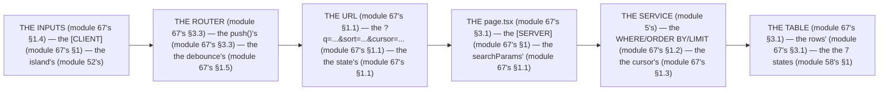

# Module 67 — Search / Filter / Sort / Pagination: The URL Is the State

**Phase 17: Data-Heavy Screens · Module 67 of 101**

> **Where does this run?** The *table* is **`[SERVER]`** (the `page.tsx` reads `searchParams`, the service queries the DB, the rows render); the *inputs* are **`[CLIENT]`** islands (the `<input>`, the `<select>`, the debounce — module 52's RHF or plain state); the *URL* is **`[BOTH]`** (the `[SERVER]` reads `searchParams`, the `[CLIENT]` writes them via `Link`/`router.push`). The module-67's standing rule (module 34's BFF + module 06's wire, now the screen level): **the URL is the state — every filter, sort, and page is a `searchParam` (module 67's §1); the DB does the search/filter/sort/pagination (never the client, module 67's §1); the client only *renders* and *writes the URL* (module 67's §1)** (module 67's §1).

---

## 1. Concept — The URL is the state (the 5 rules)

**The URL's** (module 67's §1.1): the *the `searchParams`'s* (module 67's §1.1) — the *module-67's line: the URL is the state's* (module 67's §1.1) — the *the no client's state* (module 67's §1.1).

**The DB's** (module 67's §1.2): the *the `WHERE`/`ORDER BY`/`LIMIT`'s* (module 67's §1.2) — the *module-67's line: the DB is the filter's* (module 67's §1.2) — the *the no client's* (module 67's §1.2).

**The cursor's** (module 67's §1.3): the *the `cursor`'s param* (module 34's) — the *module-67's line: the cursor is the page's* (module 34's) — the *the no offset's drift* (module 67's §1.3).

**The input's** (module 67's §1.4): the *the `[CLIENT]`'s island* (module 52's) — the *module-67's line: the input is the island's* (module 52's) — the *the no `<form>`'s reload* (module 67's §1.4).

**The debounce's** (module 67's §1.5): the *the 500ms's* (module 67's §1.5) — the *module-67's line: the debounce is the 500ms's* (module 67's §1.5) — the *the no per-keystroke's* (module 67's §1.5).

## 2. Mental Model — The data screen's loop (drawn)



**The data screen's loop** (the module-67's mental model):
1. **The URL** (module 67's §1.1): the *the state's* — the *module-67's line: the URL is the state's* (module 67's §1.1).
2. **The `page.tsx`** (module 67's §3.1): the *the `searchParams`'s* — the *the `[SERVER]`* (module 67's §1).
3. **The service** (module 5's): the *the `WHERE`/`ORDER BY`/`LIMIT`'s* — the *module-67's line: the DB is the filter's* (module 67's §1.2).
4. **The inputs** (module 67's §1.4): the *the island's* — the *module-67's line: the input is the island's* (module 52's).
5. **The router** (module 67's §3.3): the *the `push()`'s* — the *module-67's line: the debounce is the 500ms's* (module 67's §1.5).

## 3. Architecture — The data screen's (the code)

### 3.1 The `page.tsx` (module 67's §3.1 — the `searchParams`'s)

`FILE: app/org/[orgId]/products/page.tsx` (production pattern — [SERVER] — the module-67's §3.1: the 5 params)

```tsx
// THE PAGE (module 67's §3.1) — the the searchParams' (module 67's §1.1) — the the [SERVER] (module 67's §1):
import type { Metadata } from 'next'
import { requireOrgMember } from '@/auth/org'   /* the module-49's line: the orgId is the session's (module 49's) */
import { listProducts } from '@/services/products'   /* the module-5's line: the service is the ORM's (module 5's) */
import { ProductTable } from '@/components/product-table'   /* the module-58's line: the state's is the 7's (module 58's §1) */
import { ProductFilters } from '@/components/product-filters'   /* the module-67's line: the input is the island's (module 67's §1.4) */
import { notFound } from 'next'

export const metadata: Metadata = { title: 'Products', robots: { index: false } }   /* the module-61's line: the noindex is the private's (module 61's §5) */

export default async function ProductsPage({ params }: { params: Promise<{ orgId: string; searchParams: Record<string, string | string[] | undefined> }> }) {
  const { orgId, searchParams } = await params   /* the module-67's line: the searchParams is the Promise's (module 67's §3.1) — the the Next 15+ (module 3's) */
  const session = await requireOrgMember(orgId)   /* the module-49's line: the 404's no-leak (module 49's) */

  /* THE 5 PARAMS (module 67's §3.1) — the the URL is the state's (module 67's §1.1): */
  const q = typeof searchParams.q === 'string' ? searchParams.q : ''   /* the module-67's line: the q is the search's (module 67's §3.1) */
  const status = typeof searchParams.status === 'string' ? searchParams.status : 'all'   /* the module-67's line: the status is the filter's (module 67's §3.1) */
  const sort = typeof searchParams.sort === 'string' ? searchParams.sort : 'created_at:desc'   /* the module-67's line: the sort is the param's (module 67's §3.1) */
  const cursor = typeof searchParams.cursor === 'string' ? searchParams.cursor : undefined   /* the module-67's line: the cursor is the page's (module 34's) */
  const limit = 50   /* the module-67's line: the limit is the 50's (module 67's §3.1) — the the no unbounded (module 67's §1.2) */

  /* THE DB'S (module 67's §1.2) — the the WHERE/ORDER BY/LIMIT (module 67's §1.2) — the the no client's (module 67's §1.2): */
  const { items, nextCursor } = await listProducts({ orgId, q, status, sort, cursor, limit })   /* the module-5's line: the service is the ORM's (module 5's) */

  return (
    <>
      <ProductFilters q={q} status={status} sort={sort} />   /* the module-67's line: the input is the island's (module 67's §1.4) — the the [CLIENT] (module 67's §1) */
      <ProductTable items={items} nextCursor={nextCursor} sort={sort} q={q} status={status} />   /* the module-58's line: the state's is the 7's (module 58's §1) */
    </>
  )
}
```

**The module-67's line:** the *URL is the state's* (module 67's §1.1) — the *`searchParams` is the Promise's* (module 67's §3.1) — the *DB is the filter's* (module 67's §1.2) — the *limit is the 50's* (module 67's §3.1).

### 3.2 The service (module 67's §3.2 — the `WHERE`/`ORDER BY`/`LIMIT`'s)

`FILE: src/services/products.ts` (production pattern — [SERVER] — the module-67's §3.2: the cursor's)

```ts
// THE SERVICE (module 67's §3.2) — the the WHERE/ORDER BY/LIMIT (module 67's §1.2) — the the cursor's (module 67's §1.3):
import { db } from '@/db'
import { products } from '@/db/schema'   /* the module-37's line: the table is the orgId's FK (module 37's) */
import { and, desc, asc, eq, ilike, or, gte, lt } from 'drizzle-orm'

const SORT_COLUMNS: Record<string, (dir: 'asc' | 'desc') => import('drizzle-orm').SQL> = {   /* the module-67's line: the sort is the allowlist's (module 67's §1.2) */
  'created_at': (d) => (d === 'asc' ? asc(products.createdAt) : desc(products.createdAt)),
  'name': (d) => (d === 'asc' ? asc(products.name) : desc(products.name)),
  'price': (d) => (d === 'asc' ? asc(products.price) : desc(products.price)),
}

export async function listProducts(opts: { orgId: string; q?: string; status?: string; sort?: string; cursor?: string; limit?: number }) {
  const { orgId, q = '', status = 'all', sort = 'created_at:desc', cursor, limit = 50 } = opts

  const [sortKey, dir] = sort.includes(':') ? sort.split(':') as [string, 'asc' | 'desc'] : [sort, 'desc' as const]
  const sortFn = SORT_COLUMNS[sortKey] ?? SORT_COLUMNS['created_at']   /* the module-67's line: the no injection's (module 67's §1.2) — the the allowlist (module 67's §1.2) */

  const conditions = [
    eq(products.orgId, orgId),   /* the module-37's line: the tenancy is the first's (module 37's) */
    q ? or(ilike(products.name, `%${q}%`), ilike(products.sku, `%${q}%`)) : undefined,   /* the module-67's line: the q is the ilike's (module 67's §1.2) */
    status !== 'all' ? eq(products.status, status as never) : undefined,
    cursor ? lt(products.createdAt, new Date(cursor)) : undefined,   /* the module-67's line: the cursor is the lt's (module 34's) — the the keyset's (module 34's) */
  ]

  const items = await db.select().from(products)
    .where(and(...conditions.filter(Boolean)))
    .orderBy(sortFn(dir!))
    .limit(limit + 1)   /* the module-67's line: the limit+1 is the hasMore's (module 34's) */

  const hasMore = items.length > limit
  return { items: items.slice(0, limit), nextCursor: hasMore ? items[items.length - 1].createdAt.toISOString() : null }   /* the module-34's line: the cursor is the DTO's (module 34's) */
}
```

**The module-67's line:** the *sort is the allowlist's* (module 67's §1.2) — the *`q` is the `ilike`'s* (module 67's §1.2) — the *cursor is the keyset's* (module 34's) — the *`limit + 1` is the `hasMore`'s* (module 34's).

### 3.3 The filters (module 67's §3.3 — the island's)

`FILE: src/components/product-filters.tsx` (production pattern — [CLIENT] — the module-67's §3.3: the `router.push`'s + the debounce's)

```tsx
// THE FILTERS (module 67's §3.3) — the the island's (module 52's) — the the router.push's (module 67's §3.3) — the the debounce's (module 67's §1.5):
'use client'
import { usePathname, useRouter } from 'next/navigation'
import { useTransition } from 'react'
import { useEffect, useState } from 'react'
import { Input } from '@/components/ui/input'
import { Select, SelectContent, SelectItem, SelectTrigger, SelectValue } from '@/components/ui/select'

export function ProductFilters({ q, status, sort }: { q: string; status: string; sort: string }) {
  const pathname = usePathname()
  const router = useRouter()
  const [isPending, startTransition] = useTransition()   /* the module-67's line: the pending's is the state's (module 67's §3.3) */
  const [localQ, setLocalQ] = useState(q)   /* the module-67's line: the localQ is the input's (module 67's §1.4) — the the no URL's per-keystroke (module 67's §1.5) */

  /* THE DEBOUNCE (module 67's §1.5) — the the 500ms's (module 67's §1.5) — the the no per-keystroke's (module 67's §1.5): */
  useEffect(() => {
    const t = setTimeout(() => {
      if (localQ !== q) pushParams({ q: localQ })   /* the module-67's line: the 500ms is the debounce's (module 67's §1.5) */
    }, 500)
    return () => clearTimeout(t)
  }, [localQ, q])   /* eslint-disable-line react-hooks/exhaustive-deps */

  /* THE PUSH (module 67's §3.3) — the the scroll: false (module 67's §3.3) — the the no reload's (module 67's §1.4): */
  function pushParams(patch: Record<string, string | undefined>) {
    const params = new URLSearchParams()
    const current = new URLSearchParams(window.location.search)
    for (const [k, v] of current) if (!(k in patch)) params.set(k, v)
    for (const [k, v] of Object.entries(patch)) if (v) params.set(k, v)
    const qs = params.toString()
    startTransition(() => router.push(qs ? `${pathname}?${qs}` : pathname, { scroll: false }))   /* the module-67's line: the scroll is the false's (module 67's §3.3) — the the no scroll's (module 67's §3.3) */
  }

  return (
    <div className="flex gap-2">
      <Input value={localQ} onChange={(e) => setLocalQ(e.target.value)} placeholder="Search by name or SKU..." aria-label="Search products" disabled={isPending} />   /* the module-60's line: the aria-label is the a11y's (module 60's §1.3) */
      <Select value={status} onValueChange={(v) => pushParams({ status: v === 'all' ? undefined : v })}>
        <SelectTrigger><SelectValue /></SelectTrigger>
        <SelectContent>
          <SelectItem value="all">All</SelectItem>
          <SelectItem value="active">Active</SelectItem>
          <SelectItem value="archived">Archived</SelectItem>
        </SelectContent>
      </Select>
      <Select value={sort} onValueChange={(v) => pushParams({ sort: v === 'created_at:desc' ? undefined : v })}>
        <SelectTrigger><SelectValue /></SelectTrigger>
        <SelectContent>
          <SelectItem value="created_at:desc">Newest</SelectItem>
          <SelectItem value="name:asc">Name A–Z</SelectItem>
          <SelectItem value="price:desc">Price high</SelectItem>
        </SelectContent>
      </Select>
    </div>
  )
}
```

**The module-67's line:** the *input is the island's* (module 67's §1.4) — the *`localQ` is the input's* (module 67's §1.4) — the *500ms is the debounce's* (module 67's §1.5) — the *`scroll: false`'s* (module 67's §3.3).

### 3.4 The pagination (module 67's §3.4 — the cursor's link)

`FILE: src/components/product-table.tsx` (production pattern — [SERVER] — the module-67's §3.4: the `next` link)

```tsx
// THE PAGINATION (module 67's §3.4) — the the cursor's link (module 34's) — the the no offset's (module 67's §1.3):
export function TablePagination({ nextCursor, currentQs }: { nextCursor: string | null; currentQs: string }) {
  if (!nextCursor) return null   /* the module-67's line: the no next's (module 67's §3.4) */
  const params = new URLSearchParams(currentQs)
  params.set('cursor', nextCursor)   /* the module-67's line: the cursor is the param's (module 34's) */
  return (
    <Link href={`?${params.toString()}`} className="text-sm text-primary">Load more →</Link>   /* the module-67's line: the Link is the URL's (module 67's §1.1) — the the no JS's (module 67's §3.4) */
  )
}
/* THE RULE (module 67's §3.4): the the cursor is the link's (module 34's) — the the no offset's drift (module 67's §1.3) — the the JS-off's (module 67's §3.4) */
```

**The module-67's line:** the *cursor is the link's* (module 34's) — the *the no offset's* (module 67's §1.3) — the *the JS-off's* (module 67's §3.4).

## 4. Production Code — The 7 states (module 67's §4)

`FILE: src/components/product-table.tsx` (production pattern — [SERVER] — the module-67's §4: the empty's + the error's)

```tsx
// THE 7 STATES (module 58's §1) — the the empty's (module 58's §1.6) — the the error's (module 53's):
export function ProductTable({ items, nextCursor, q, status, sort }: { items: Product[]; nextCursor: string | null; q: string; status: string; sort: string }) {
  if (items.length === 0) {
    return <EmptyState title={q || status !== 'all' ? 'No matching products' : 'No products yet'} description={q ? `Nothing matches "${q}".` : 'Add your first product to get started.'} action={<Link href="/org/x/products/new"><Button>Add product</Button></Link>} />   /* the module-58's line: the empty's is the CTA's (module 58's §1.6) */
  }
  return (
    <div className="overflow-x-auto rounded-md border">
      <table className="w-full text-sm">
        <thead>
          <tr><th>SKU</th><th>Name</th><th>Price</th><th>Status</th></tr>
        </thead>
        <tbody>
          {items.map((p) => (
            <tr key={p.id} className="border-t">
              <td className="font-mono">{p.sku}</td>
              <td><Link href={`/org/x/products/${p.id}`} className="text-primary">{p.name}</Link></td>
              <td>{formatCents(p.price, 'USD')}</td>   /* the module-37's line: the cents is the format's (module 37's) */
              <td><Badge>{p.status}</Badge></td>
            </tr>
          ))}
        </tbody>
      </table>
      <TablePagination nextCursor={nextCursor} currentQs={`${q ? `q=${q}&` : ''}${status !== 'all' ? `status=${status}&` : ''}${sort !== 'created_at:desc' ? `sort=${sort}&` : ''}`} />
    </div>
  )
}
```

**The module-67's line:** the *empty's is the CTA's* (module 58's §1.6) — the *the `formatCents`'s* (module 37's) — the *the `Badge`'s* (module 58's).

## 5. Common Mistakes (the data screen's failures)

| Mistake | The symptom | Fix |
|---|---|---|
| **The client's state** (module 67's §1.1's line violated) | the *module-67's line: the URL is the state's* (module 67's §1.1) — the *the client's state's is the *no's* (module 67's §1.1) — the *module-67's line: the no client's state* (module 67's §1.1) — the *no client's state* (module 67's §1.1)* | the *the `searchParams`'s (module 67's §1.1) — the *module-67's line: the URL is the state's* (module 67's §1.1)* |
| **The client's filter** (module 67's §1.2's line violated) | the *module-67's line: the DB is the filter's* (module 67's §1.2) — the *the client's filter's is the *no's* (module 67's §1.2) — the *module-67's line: the no client's filter* (module 67's §1.2) — the *no client's filter* (module 67's §1.2)* | the *the service's `WHERE` (module 67's §1.2) — the *module-67's line: the DB is the filter's* (module 67's §1.2)* |
| **The offset's drift** (module 67's §1.3's line violated) | the *module-67's line: the no offset's drift* (module 67's §1.3) — the *the offset's drift's is the *no's* (module 67's §1.3) — the *module-67's line: the no offset's drift* (module 67's §1.3) — the *no offset's drift* (module 67's §1.3)* | the *the cursor's (module 34's) — the *module-67's line: the cursor is the page's* (module 34's)* |
| **The per-keystroke's** (module 67's §1.5's line violated) | the *module-67's line: the no per-keystroke's* (module 67's §1.5) — the *the per-keystroke's is the *no's* (module 67's §1.5) — the *module-67's line: the no per-keystroke's* (module 67's §1.5) — the *no per-keystroke's* (module 67's §1.5)* | the *the 500ms's debounce (module 67's §1.5) — the *module-67's line: the debounce is the 500ms's* (module 67's §1.5)* |
| **The unbounded's** (module 67's §1.2's line violated) | the *module-67's line: the no unbounded* (module 67's §1.2) — the *the unbounded's is the *no's* (module 67's §1.2) — the *module-67's line: the no unbounded* (module 67's §1.2) — the *no unbounded* (module 67's §1.2)* | the *the `limit`'s (module 67's §3.1) — the *module-67's line: the limit is the 50's* (module 67's §3.1)* |
| **The `scroll: true`** (module 67's §3.3's line violated) | the *module-67's line: the no scroll's* (module 67's §3.3) — the *the `scroll: true`'s is the *no's* (module 67's §3.3) — the *module-67's line: the no scroll's* (module 67's §3.3) — the *no scroll's* (module 67's §3.3)* | the *the `scroll: false`'s (module 67's §3.3) — the *module-67's line: the scroll is the false's* (module 67's §3.3)* |

## 6. Security Notes

- **The sort's allowlist** (module 67's §1.2): the *module-67's line: the no injection's* (module 67's §1.2) — the *module-75's* *deep-dive* (module 75's).
- **The tenancy's** (module 37's): the *module-37's line: the tenancy is the first's* (module 37's) — the *module-67's line: the `orgId` is the `WHERE`'s first* (module 67's §1.2) — the *module-37's* *deep-dive* (module 37's).
- **The `noindex`** (module 61's §5): the *module-61's line: the noindex is the private's* (module 61's §5) — the *module-67's line: the data screen is the `noindex`'s* (module 61's §5) — the *module-61's* *deep-dive* (module 61's).

## 7. Performance Notes

- **The DB's** (module 67's §1.2): the *module-67's line: the DB is the filter's* (module 67's §1.2) — the *the no 10k rows' client* (module 67's §1.2).
- **The cursor's** (module 34's): the *module-67's line: the cursor is the keyset's* (module 34's) — the *the no `OFFSET`'s* (module 67's §1.3).
- **The `limit + 1`** (module 34's): the *module-67's line: the `limit + 1` is the `hasMore`'s* (module 34's) — the *the no `COUNT(*)`'s* (module 67's §3.2).

## 8. Exercise

**Beginner.** *The `page.tsx`'s* (module 67's §3.1): the *the `searchParams`'s* (module 3.1's) + the *the `listProducts`'s* (module 3.2's) + the *the `ProductTable`'s* (module 3.1's) — *build it* — the *artifact: the table's* (module 3.1's).

**Intermediate.** *The `ProductFilters`'s* (module 67's §3.3): the *the `localQ`'s* (module 3.3's) + the *the `debounce`'s* (module 3.3's) + the *the `router.push`'s* (module 3.3's) — *build it* — the *artifact: the filters' (module 3.3's)*.

**Production.** *The cursor's pagination's* (module 67's §3.4): the *the `limit + 1`'s* (module 3.2's) + the *the `nextCursor`'s* (module 3.2's) + the *the `Link`'s* (module 3.4's) — *build it* — the *artifact: the pagination's* (module 3.4's).

## 9. Architecture Challenge

**Prompt:** The *"the team's 50k-product table loads all rows client-side, filters in JS, and loses state on refresh"* (the *module-67's* *data screen* — the *module-34's* *BFF* — the *module-67's line: the URL is the state's* (module 67's §1.1) — the *module-34's line: the cursor is the page's* (module 34's) — the *module-67's standing line: the URL is the state's + the DB is the filter's + the cursor is the page's* (module 67's §1.1 + module 67's §1.2 + module 67's §1.3)).

The *problems*: (1) the *the client's filter's* (the *the no DB's `WHERE`* (module 67's §1.2) — the *module-67's line: the DB is the filter's* (module 67's §1.2) — the *module-67's standing line: the DB is the filter's* (module 67's §1.2)).

(2) the *the no URL's state* (the *the no `searchParams`'s* (module 67's §1.1) — the *module-67's line: the URL is the state's* (module 67's §1.1) — the *module-67's standing line: the URL is the state's* (module 67's §1.1)).

**Design**: the *the data screen's remediation* (the *the `searchParams`'s* (module 67's §1.1) + the *the service's `WHERE`/`ORDER BY`/`LIMIT`* (module 67's §1.2) + the *the cursor's* (module 34's) — the *module-67's line: the URL is the state's* (module 67's §1.1) — the *module-67's standing line: the URL is the state's + the DB is the filter's + the cursor is the page's* (module 67's §1.1 + module 67's §1.2 + module 67's §1.3)).

Produce: the *the data screen's remediation* (the *the `searchParams`'s* (module 67's §1.1) + the *the service's `WHERE`/`ORDER BY`/`LIMIT`* (module 67's §1.2) + the *the cursor's* (module 34's) — the *module-67's line: the URL is the state's* (module 67's §1.1) — the *module-67's standing line: the URL is the state's + the DB is the filter's + the cursor is the page's* (module 67's §1.1 + module 67's §1.2 + module 67's §1.3)).

<details>
<summary>Model answer</summary>
**The data screen's remediation** (module 67's §1.1 + module 67's §1.2 + module 34's):
1. **The URL's** (module 67's §1.1): the *the `searchParams` replaces the client's state* — the *module-67's line: the URL is the state's* (module 67's §1.1).
2. **The DB's** (module 67's §1.2): the *the service's `WHERE`/`ORDER BY`/`LIMIT` replaces the client's filter* — the *module-67's line: the DB is the filter's* (module 67's §1.2).
3. **The cursor's** (module 34's): the *the cursor replaces the offset's* — the *module-67's line: the cursor is the page's* (module 34's).
**The generalization** (the *data screen's* pattern, the *module's* standing rule): **the *URL is the state's* (module 67's §1.1) — the *the DB is the filter's* (module 67's §1.2) — the *the cursor is the page's* (module 34's) — the *module-67's standing line: the URL is the state's + the DB is the filter's + the cursor is the page's* (module 67's §1.1 + module 67's §1.2 + module 67's §1.3)*.
</details>

## 10. Official Documentation

- Next.js: `searchParams`: https://nextjs.org/docs/app/api-reference/file-conventions/page#searchparams
- Next.js: `useRouter`: https://nextjs.org/docs/app/api-reference/functions/use-router
- Next.js: `useTransition`: https://react.dev/reference/react/useTransition
- web.dev: Keyset pagination: https://web.dev/articles/infinite-scroll (cursor-based)
- The module-34's BFF: the module-34 (the phase-7's file-05)
- The module-58's states: the module-58 (the phase-13's file-04)

## 11. What You Should Know Before Continuing

- [ ] I can state the *5 rules* (module 1's: the URL/DB/cursor/input/debounce) — the *module-67's line: the URL is the state's* (module 1's)
- [ ] I know the *URL is the state's* (module 1.1's) — the *the no client's state* (module 1.1's)
- [ ] I know the *DB is the filter's* (module 1.2's) — the *the no client's filter* (module 1.2's)
- [ ] I know the *cursor is the page's* (module 1.3's) — the *the no offset's drift* (module 1.3's)
- [ ] I know the *input is the island's* (module 1.4's) — the *the no `<form>`'s reload* (module 1.4's)
- [ ] I know the *debounce is the 500ms's* (module 1.5's) — the *the no per-keystroke's* (module 1.5's)
- [ ] I know the *`limit + 1` is the `hasMore`'s* (module 3.2's) — the *the no `COUNT(*)`'s* (module 3.2's)
- [ ] I've done the *`page.tsx`'s* (module 8's beginner) + the *`ProductFilters`'s* (module 8's intermediate) + the *cursor's pagination's* (module 8's production) — the *artifacts* (module 20's)

**Next:** Module 68 — Dashboard Architecture (the *the SC/CC split* — the *module-68's line: the dashboard is the server's* (module 68's)).
