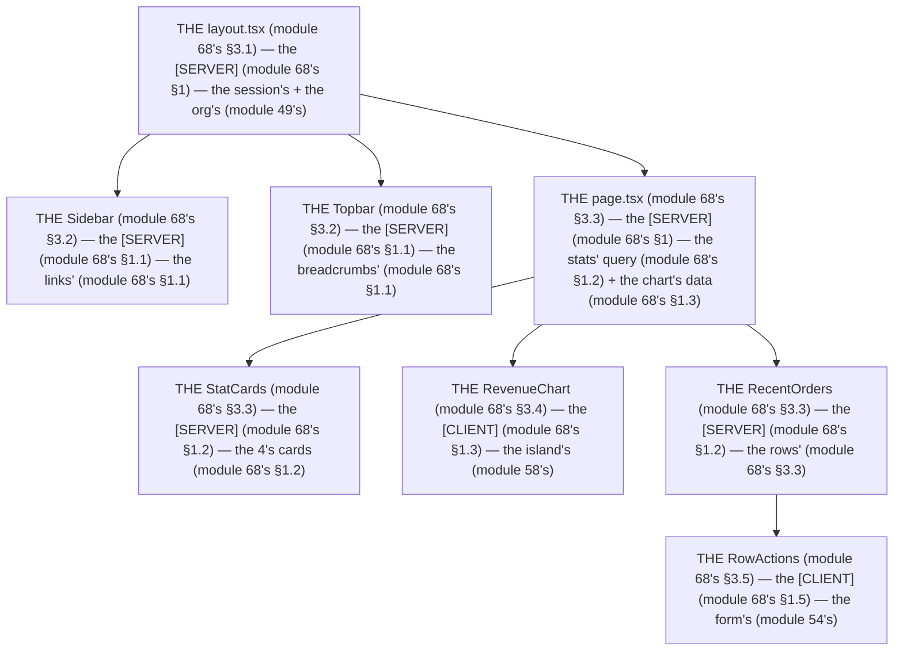

# Module 68 — Dashboard Architecture: The Server/Client Split, Defended

**Phase 17: Data-Heavy Screens · Module 68 of 101**

> **Where does this run?** The *dashboard* is **`[SERVER]`** (the `layout.tsx` + `page.tsx` fetch the session, the org's stats, the chart data — module 20's cache); the *islands* are **`[CLIENT]`** (the chart, the date-range picker, the per-row actions — module 58's); the *shell* (sidebar, topbar, breadcrumbs) is **`[SERVER]`** with a **`[CLIENT]`** sliver (the active-link state). The module-68's standing rule (module 05's island contract + module 20's cache, now the screen level): **the dashboard is a Server Component by default — every `[CLIENT]` component must justify itself with a reason (interactivity, browser API, RHF), and data flows *down* as plain props (the DTO, module 06's), never as a fetch from the client (module 68's §1)** (module 68's §1).

---

## 1. Concept — The dashboard is the server's (the 5 pieces)

**The shell's** (module 68's §1.1): the *the sidebar/topbar/breadcrumbs'* (module 68's §1.1) — the *module-68's line: the shell is the server's* (module 68's §1.1) — the *the active-link's is the sliver's* (module 68's §1.1).

**The stats's** (module 68's §1.2): the *the 4 cards' single query* (module 68's §1.2) — the *module-68's line: the stats is the 1's query* (module 68's §1.2) — the *the no 4's queries* (module 68's §1.2).

**The chart's** (module 68's §1.3): the *the `[CLIENT]`'s island* (module 58's) — the *module-68's line: the chart is the island's* (module 58's) — the *the DTO's is the prop's* (module 06's).

**The date-range's** (module 68's §1.4): the *the URL's param* (module 67's §1.1) — the *module-68's line: the date-range is the URL's* (module 67's §1.1) — the *the no client's state* (module 68's §1.4).

**The actions's** (module 68's §1.5): the *the per-row's form* (module 54's) — the *module-68's line: the action is the form's* (module 54's) — the *the hidden's orgId* (module 49's).

## 2. Mental Model — The dashboard's tree (drawn)



**The dashboard's tree** (the module-68's mental model):
1. **The shell** (module 68's §1.1): the *the sidebar/topbar/breadcrumbs'* — the *module-68's line: the shell is the server's* (module 68's §1.1).
2. **The stats** (module 68's §1.2): the *the 1's query* — the *module-68's line: the stats is the 1's query* (module 68's §1.2).
3. **The chart** (module 68's §1.3): the *the island's* — the *module-68's line: the chart is the island's* (module 58's).
4. **The date-range** (module 68's §1.4): the *the URL's* — the *module-68's line: the date-range is the URL's* (module 67's §1.1).
5. **The actions** (module 68's §1.5): the *the form's* — the *module-68's line: the action is the form's* (module 54's).

## 3. Architecture — The dashboard's (the code)

### 3.1 The `layout.tsx` (module 68's §3.1 — the shell's)

`FILE: app/org/[orgId]/layout.tsx` (production pattern — [SERVER] — the module-68's §3.1: the session's + the org's)

```tsx
// THE LAYOUT (module 68's §3.1) — the the session's (module 43's) + the org's (module 49's) — the the [SERVER] (module 68's §1):
import { headers } from 'next/headers'
import { auth } from '@/auth'
import { requireOrgMember, getActiveOrg } from '@/auth/org'   /* the module-49's line: the orgId is the session's (module 49's) */
import { Sidebar } from '@/components/sidebar'   /* the module-68's line: the shell is the server's (module 68's §1.1) */
import { Topbar } from '@/components/topbar'   /* the module-68's line: the shell is the server's (module 68's §1.1) */
import { notFound } from 'next'

export default async function OrgLayout({ children, params }: { children: React.ReactNode; params: Promise<{ orgId: string }> }) {
  const { orgId } = await params
  const session = await auth.api.getSession({ headers: await headers() })
  if (!session) redirect('/login')   /* the module-48's line: the 401 is the who's (module 48's) — the the web's redirect (module 48's) */
  const org = await requireOrgMember(session.user.id, orgId)   /* the module-49's line: the 404's no-leak (module 49's) */

  return (
    <div className="flex min-h-screen">
      <Sidebar orgId={org.id} role={org.role} />   /* the module-68's line: the shell is the server's (module 68's §1.1) — the the role's is the nav's (module 48's) */
      <div className="flex-1 flex flex-col">
        <Topbar orgId={org.id} orgName={org.name} user={session.user.name} />   /* the module-68's line: the shell is the server's (module 68's §1.1) */
        <main className="flex-1 p-6">{children}</main>   /* the module-68's line: the main is the children's (module 68's §3.1) */
      </div>
    </div>
  )
}
```

**The module-68's line:** the *layout is the server's* (module 68's §3.1) — the *session is the 401's* (module 48's) — the *org is the 404's* (module 49's) — the *role is the nav's* (module 48's).

### 3.2 The sidebar + the topbar (module 68's §3.2 — the server's shell)

`FILE: src/components/sidebar.tsx` (production pattern — [SERVER] — the module-68's §3.2: the `usePathname`'s sliver)

```tsx
// THE SIDEBAR (module 68's §3.2) — the the server's (module 68's §1.1) — the the links' (module 68's §1.1) — the the active's is the sliver's (module 68's §1.1):
import Link from 'next/link'
import { ActiveLinks } from '@/components/active-links'   /* the module-68's line: the active's is the sliver's (module 68's §1.1) — the the [CLIENT] (module 68's §1.1) */

export function Sidebar({ orgId, role }: { orgId: string; role: string }) {
  const items = [
    { href: `/org/${orgId}`, label: 'Overview' },
    { href: `/org/${orgId}/products`, label: 'Products', permission: 'products:read' },
    { href: `/org/${orgId}/orders`, label: 'Orders', permission: 'orders:read' },
    { href: `/org/${orgId}/members`, label: 'Members', permission: 'members:read', adminOnly: true },   /* the module-48's line: the adminOnly's is the nav's (module 48's) */
  ]
  return (
    <aside className="w-60 border-r p-4">
      <ActiveLinks>   /* the module-68's line: the active's is the sliver's (module 68's §1.1) — the the usePathname's (module 68's §3.2) */
        <nav className="space-y-1">
          {items
            .filter((i) => !i.adminOnly || role === 'owner' || role === 'admin')   /* the module-48's line: the role is the nav's (module 48's) */
            .map((i) => (
              <Link key={i.href} href={i.href} data-nav className="block rounded-md px-3 py-2 text-sm hover:bg-accent">
                {i.label}
              </Link>
            ))}
        </nav>
      </ActiveLinks>
    </aside>
  )
}
```

```tsx
// THE ACTIVE-LINKS (module 68's §3.2) — the the sliver's (module 68's §1.1) — the the usePathname's (module 68's §3.2):
'use client'
import { usePathname } from 'next/navigation'
export function ActiveLinks({ children }: { children: React.ReactNode }) {
  const pathname = usePathname()   /* the module-68's line: the usePathname is the active's (module 68's §3.2) — the the no server's (module 68's §1.1) */
  return <div data-active={pathname}>{children}</div>   /* the module-68's line: the data-active is the CSS's (module 68's §3.2) */
}
/* THE CSS (module 68's §3.2) — the the active's (module 68's §3.2):
   [data-active] a[href$="var(--active)"] { ... }   (module 68's §3.2) */
```

**The module-68's line:** the *shell is the server's* (module 68's §1.1) — the *active's is the sliver's* (module 68's §1.1) — the *`usePathname` is the active's* (module 68's §3.2) — the *role is the nav's* (module 48's).

### 3.3 The `page.tsx` (module 68's §3.3 — the stats's + the chart's data)

`FILE: app/org/[orgId]/page.tsx` (production pattern — [SERVER] — the module-68's §3.3: the 1's query)

```tsx
// THE DASHBOARD'S PAGE (module 68's §3.3) — the the stats' query (module 68's §1.2) + the chart's data (module 68's §1.3) — the the [SERVER] (module 68's §1):
import { getDashboardStats } from '@/services/dashboard'   /* the module-5's line: the service is the ORM's (module 5's) */
import { StatCards } from '@/components/stat-cards'   /* the module-68's line: the stats is the server's (module 68's §1.2) */
import { RevenueChart } from '@/components/revenue-chart'   /* the module-68's line: the chart is the island's (module 68's §1.3) */
import { RecentOrders } from '@/components/recent-orders'   /* the module-68's line: the rows is the server's (module 68's §3.3) */
import { DateRangePicker } from '@/components/date-range-picker'   /* the module-68's line: the date-range is the URL's (module 68's §1.4) — the the [CLIENT] (module 68's §1.4) */

export default async function DashboardPage({ params }: { params: Promise<{ orgId: string; searchParams: Record<string, string | string[] | undefined> }> }) {
  const { orgId, searchParams } = await params
  const range = typeof searchParams.range === 'string' ? searchParams.range : '30d'   /* the module-68's line: the date-range is the URL's (module 67's §1.1) */

  /* THE 1'S QUERY (module 68's §1.2) — the the no 4's queries (module 68's §1.2): */
  const { revenue, orders, products, avgOrderValue, series, recent } = await getDashboardStats(orgId, range)   /* the module-5's line: the service is the ORM's (module 5's) — the the cacheTag's (module 20's) */

  return (
    <div className="space-y-6">
      <DateRangePicker value={range} />   /* the module-68's line: the date-range is the URL's (module 68's §1.4) — the the [CLIENT] (module 68's §1.4) */
      <StatCards revenue={revenue} orders={orders} products={products} avgOrderValue={avgOrderValue} />   /* the module-68's line: the stats is the server's (module 68's §1.2) — the the DTO's (module 06's) */
      <RevenueChart data={series} />   /* the module-68's line: the chart is the island's (module 68's §1.3) — the the DTO's is the prop's (module 06's) */
      <RecentOrders orders={recent} orgId={orgId} />   /* the module-68's line: the rows is the server's (module 68's §3.3) */
    </div>
  )
}
```

**The module-68's line:** the *page is the server's* (module 68's §3.3) — the *stats is the 1's query* (module 68's §1.2) — the *chart is the island's* (module 68's §1.3) — the *date-range is the URL's* (module 68's §1.4).

### 3.4 The chart (module 68's §3.4 — the island's)

`FILE: src/components/revenue-chart.tsx` (production pattern — [CLIENT] — the module-68's §3.4: the DTO's prop)

```tsx
// THE CHART (module 68's §3.4) — the the island's (module 58's) — the the DTO's is the prop's (module 06's):
'use client'
import { Bar, BarChart, CartesianGrid, XAxis } from 'recharts'   /* the module-68's line: the recharts is the chart's (module 68's §3.4) */

export function RevenueChart({ data }: { data: { date: string; revenue: number }[] }) {   /* the module-68's line: the data is the DTO's (module 06's) — the the no fetch's (module 68's §1) */
  return (
    <div className="rounded-md border p-4" role="img" aria-label="Revenue by day">   /* the module-60's line: the aria-label is the a11y's (module 60's §1.3) */
      <BarChart width={720} height={240} data={data}>
        <CartesianGrid strokeDasharray="3 3" />
        <XAxis dataKey="date" />
        <Bar dataKey="revenue" fill="hsl(var(--primary))" />
      </BarChart>
    </div>
  )
}
/* THE RULE (module 68's §3.4): the the data is the DTO's (module 06's) — the the no fetch's (module 68's §1) — the the no client's DB (module 68's §1) */
```

**The module-68's line:** the *chart is the island's* (module 58's) — the *data is the DTO's* (module 06's) — the *the no fetch's* (module 68's §1).

### 3.5 The row's actions (module 68's §3.5 — the form's)

`FILE: src/components/recent-orders.tsx` (production pattern — [SERVER] + [CLIENT] — the module-68's §3.5: the hidden's)

```tsx
// THE ROW'S ACTIONS (module 68's §3.5) — the the form's (module 54's) — the the hidden's orgId (module 49's):
export function RecentOrders({ orders, orgId }: { orders: Order[]; orgId: string }) {
  return (
    <div className="overflow-x-auto rounded-md border">
      <table className="w-full text-sm">
        <thead><tr><th>Order</th><th>Total</th><th>Status</th><th /></tr></thead>
        <tbody>
          {orders.map((o) => (
            <tr key={o.id} className="border-t">
              <td><Link href={`/org/${orgId}/orders/${o.id}`} className="text-primary">{o.number}</Link></td>
              <td>{formatCents(o.total, 'USD')}</td>   /* the module-37's line: the cents is the format's (module 37's) */
              <td><Badge>{o.status}</Badge></td>
              <td><OrderRowActions orderId={o.id} orgId={orgId} /></td>   /* the module-68's line: the action is the form's (module 54's) — the the [CLIENT] (module 68's §1.5) */
            </tr>
          ))}
        </tbody>
      </table>
    </div>
  )
}
```

```tsx
// THE ORDER-ROW-ACTIONS (module 68's §3.5) — the the form's (module 54's) — the the hidden's orgId (module 49's):
'use client'
import { useActionState } from 'react'
import { refundOrder } from '@/actions/orders'   /* the module-29's line: the action is the 5-step's (module 29's) */
import { Button } from '@/components/ui/button'

export function OrderRowActions({ orderId, orgId }: { orderId: string; orgId: string }) {
  const [state, formAction, isPending] = useActionState(refundOrder, null)   /* the module-29's line: the pending's is the state's (module 29's) */
  return (
    <form action={formAction} className="flex items-center gap-2">
      <input type="hidden" name="orderId" value={orderId} />   /* the module-54's line: the hidden's is the id's (module 54's) — the the server re-checks (module 29's) */
      <input type="hidden" name="orgId" value={orgId} />   /* the module-49's line: the hidden's orgId is the server re-check's (module 49's) — the the no caller's (module 49's) */
      <Button type="submit" variant="outline" size="sm" loading={isPending}>Refund</Button>   /* the module-58's line: the loading's is the isPending's (module 58's §1.5) */
      {state?.error && <p role="alert" className="text-sm text-destructive">{state.error}</p>}   /* the module-60's line: the role=alert is the error's (module 60's §1.3) */
    </form>
  )
}
```

**The module-68's line:** the *action is the form's* (module 54's) — the *hidden's `orgId` is the server re-check's* (module 49's) — the *loading is the `isPending`'s* (module 58's §1.5).

## 4. Production Code — Defending the split (module 68's §4)

`FILE: docs/sc-cc-audit.md` (production pattern — the module-68's §4: the 3 questions)

```md
## THE SC/CC AUDIT (module 68's §4 — the the 3 questions (module 68's §4))

For every `[CLIENT]` component, answer:
1. **WHY?** (module 68's §4.1): the the interactivity's (module 68's §4.1) — the the browser's API (module 68's §4.1) — the the RHF's (module 52's)
2. **COULD IT BE SERVER?** (module 68's §4.2): the the no (module 68's §4.2) — the the reason's (module 68's §4.2)
3. **IS THE DATA A DTO?** (module 68's §4.3): the the yes (module 68's §4.3) — the the no fetch's (module 68's §1)
```

**The module-68's line:** the *audit is the 3's questions* (module 68's §4) — the *why's* (module 68's §4.1) — the *could-it-be-server's* (module 68's §4.2) — the *is-the-data-a-DTO's* (module 68's §4.3).

## 5. Common Mistakes (the dashboard's failures)

| Mistake | The symptom | Fix |
|---|---|---|
| **The client's fetch** (module 68's §1's line violated) | the *module-68's line: the no fetch's* (module 68's §1) — the *the client's fetch's is the *no's* (module 68's §1) — the *module-68's line: the no client's fetch* (module 68's §1) — the *no client's fetch* (module 68's §1)* | the *the server's fetch (module 68's §3.3) — the *module-68's line: the data flows down* (module 68's §1)* |
| **The 4's queries** (module 68's §1.2's line violated) | the *module-68's line: the stats is the 1's query* (module 68's §1.2) — the *the 4's queries' is the *no's* (module 68's §1.2) — the *module-68's line: the no 4's queries* (module 68's §1.2) — the *no 4's queries* (module 68's §1.2)* | the *the 1's query (module 68's §1.2) — the *module-68's line: the stats is the 1's query* (module 68's §1.2)* |
| **The client's date-range** (module 68's §1.4's line violated) | the *module-68's line: the date-range is the URL's* (module 67's §1.1) — the *the client's date-range's is the *no's* (module 68's §1.4) — the *module-68's line: the no client's state* (module 68's §1.4) — the *no client's state* (module 68's §1.4)* | the *the URL's `range` (module 67's §1.1) — the *module-68's line: the date-range is the URL's* (module 67's §1.1)* |
| **The `usePathname` on the server** (module 68's §1.1's line violated) | the *module-68's line: the active's is the sliver's* (module 68's §1.1) — the *the `usePathname` on the server's is the *no's* (module 68's §1.1) — the *module-68's line: the no `usePathname` on the server* (module 68's §1.1) — the *no `usePathname` on the server* (module 68's §1.1)* | the *the sliver's (module 68's §3.2) — the *module-68's line: the active's is the sliver's* (module 68's §1.1)* |
| **The no hidden's orgId** (module 68's §1.5's line violated) | the *module-68's line: the hidden's orgId is the server re-check's* (module 49's) — the *the no hidden's orgId's is the *no's* (module 68's §1.5) — the *module-68's line: the no hidden's orgId* (module 68's §1.5) — the *no hidden's orgId* (module 68's §1.5)* | the *the `<input type="hidden" name="orgId">`'s (module 68's §1.5) — the *module-68's line: the hidden's orgId is the server re-check's* (module 49's)* |
| **The chart's fetch** (module 68's §1.3's line violated) | the *module-68's line: the data is the DTO's* (module 06's) — the *the chart's fetch's is the *no's* (module 68's §1.3) — the *module-68's line: the no chart's fetch* (module 68's §1.3) — the *no chart's fetch* (module 68's §1.3)* | the *the server's `series` prop (module 68's §3.4) — the *module-68's line: the data is the DTO's* (module 06's)* |

## 6. Security Notes

- **The hidden's orgId** (module 49's): the *module-49's line: the orgId is the session's* (module 49's) — the *module-68's line: the hidden's orgId is the server re-check's* (module 49's) — the *module-49's* *deep-dive* (module 49's).
- **The no client's fetch** (module 68's §1): the *module-68's line: the no fetch's* (module 68's §1) — the *module-75's* *deep-dive* (module 75's).
- **The RBAC's nav** (module 48's): the *module-48's line: the 403 is the what's* (module 48's) — the *module-68's line: the role is the nav's* (module 48's) — the *module-48's* *deep-dive* (module 48's).

## 7. Performance Notes

- **The 1's query** (module 68's §1.2): the *module-68's line: the stats is the 1's query* (module 68's §1.2) — the *the no N+1's* (module 37's).
- **The DTO's** (module 06's): the *module-68's line: the data is the DTO's* (module 06's) — the *the no row's JSON* (module 68's §1).
- **The island's small** (module 58's): the *module-68's line: the island is the small's* (module 58's) — the *the no 100KB's* (module 68's §1.3).

## 8. Exercise

**Beginner.** *The `layout.tsx`'s* (module 68's §3.1): the *the `session`'s* (module 3.1's) + the *the `requireOrgMember`'s* (module 3.1's) + the *the `Sidebar`/`Topbar`'s* (module 3.1's) — *build it* — the *artifact: the shell's* (module 3.1's).

**Intermediate.** *The `page.tsx`'s* (module 68's §3.3): the *the `getDashboardStats`'s 1's query* (module 3.3's) + the *the `StatCards`'s* (module 3.3's) + the *the `DateRangePicker`'s URL's* (module 3.3's) — *build it* — the *artifact: the dashboard's* (module 3.3's).

**Production.** *The `RevenueChart`'s + the `OrderRowActions`'s* (module 68's §3.4 + §3.5): the *the DTO's prop* (module 3.4's) + the *the hidden's orgId* (module 3.5's) + the *the SC/CC audit's* (module 4's) — *build it* — the *artifact: the islands'* (module 3.4's + module 3.5's).

## 9. Architecture Challenge

**Prompt:** The *"the team's dashboard is one giant Client Component that fetches 6 endpoints in `useEffect`"* (the *module-68's* *dashboard* — the *module-20's* *cache* — the *module-68's line: the dashboard is the server's* (module 68's §1) — the *module-20's line: the fetch's is the server's* (module 20's) — the *module-68's standing line: the dashboard is the server's + the data flows down* (module 68's §1)).

The *problems*: (1) the *the client's fetch's* (the *the no server's fetch* (module 68's §1) — the *module-68's line: the no fetch's* (module 68's §1) — the *module-68's standing line: the no client's fetch* (module 68's §1)).

(2) the *the 6's endpoints* (the *the no 1's query* (module 68's §1.2) — the *module-68's line: the stats is the 1's query* (module 68's §1.2) — the *module-68's standing line: the no 6's endpoints* (module 68's §1.2)).

**Design**: the *the dashboard's remediation* (the *the server's `layout.tsx` + `page.tsx`* (module 68's §3.1 + module 68's §3.3) + the *the 1's query's* (module 68's §1.2) + the *the island's chart* (module 68's §1.3) + the *the SC/CC audit's* (module 68's §4) — the *module-68's line: the dashboard is the server's* (module 68's §1) — the *module-68's standing line: the dashboard is the server's + the data flows down* (module 68's §1)).

Produce: the *the dashboard's remediation* (the *the server's `layout.tsx` + `page.tsx`* (module 68's §3.1 + module 68's §3.3) + the *the 1's query's* (module 68's §1.2) + the *the island's chart* (module 68's §1.3) + the *the SC/CC audit's* (module 68's §4) — the *module-68's line: the dashboard is the server's* (module 68's §1) — the *module-68's standing line: the dashboard is the server's + the data flows down* (module 68's §1)).

<details>
<summary>Model answer</summary>
**The dashboard's remediation** (module 68's §3.1 + module 68's §3.3 + module 68's §1.2 + module 68's §1.3 + module 68's §4):
1. **The server's** (module 68's §3.1 + module 68's §3.3): the *the `layout.tsx` + `page.tsx` replace the client's fetch* — the *module-68's line: the dashboard is the server's* (module 68's §1).
2. **The 1's query's** (module 68's §1.2): the *the `getDashboardStats` replaces the 6's endpoints* — the *module-68's line: the stats is the 1's query* (module 68's §1.2).
3. **The island's chart's** (module 68's §1.3): the *the `RevenueChart` receives the DTO's prop* — the *module-68's line: the data is the DTO's* (module 06's).
4. **The SC/CC audit's** (module 68's §4): the *the 3's questions are the gate* — the *module-68's line: the audit is the 3's questions* (module 68's §4).
**The generalization** (the *dashboard's* pattern, the *module's* standing rule): **the *dashboard is the server's* (module 68's §1) — the *the data flows down* (module 68's §1) — the *module-68's standing line: the dashboard is the server's + the data flows down* (module 68's §1)*.
</details>

## 10. Official Documentation

- Next.js: Server Components: https://nextjs.org/docs/app/getting-started/server-and-client-components
- Next.js: `usePathname`: https://nextjs.org/docs/app/api-reference/functions/use-pathname
- Next.js: `useRouter`: https://nextjs.org/docs/app/api-reference/functions/use-router
- Recharts: https://recharts.org/en-US/
- The module-05's island: the module-05 (the phase-1's file-05)
- The module-20's cache: the module-20 (the phase-4's file-04)
- The module-58's states: the module-58 (the phase-13's file-04)

## 11. What You Should Know Before Continuing

- [ ] I can state the *5 pieces* (module 1's: the shell/stats/chart/date-range/actions) — the *module-68's line: the dashboard is the server's* (module 1's)
- [ ] I know the *shell is the server's* (module 1.1's) — the *the active's is the sliver's* (module 1.1's)
- [ ] I know the *stats is the 1's query* (module 1.2's) — the *the no 4's queries* (module 1.2's)
- [ ] I know the *chart is the island's* (module 1.3's) — the *the DTO's is the prop's* (module 06's)
- [ ] I know the *date-range is the URL's* (module 1.4's) — the *the no client's state* (module 1.4's)
- [ ] I know the *action is the form's* (module 1.5's) — the *the hidden's orgId* (module 49's)
- [ ] I know the *audit is the 3's questions* (module 4's) — the *why's/could-it-be-server's/is-the-data-a-DTO's* (module 4's)
- [ ] I've done the *`layout.tsx`'s* (module 8's beginner) + the *`page.tsx`'s* (module 8's intermediate) + the *islands'* (module 8's production) — the *artifacts* (module 20's)

**Phase 17 complete.** Data-Heavy Screens — the URL is the state, the DB is the filter, the dashboard is the server's.

**Next:** Module 69 — Phase 18 (the *the performance's measure first* — the *module-69's line: the performance is the measure's* (module 69's)).
