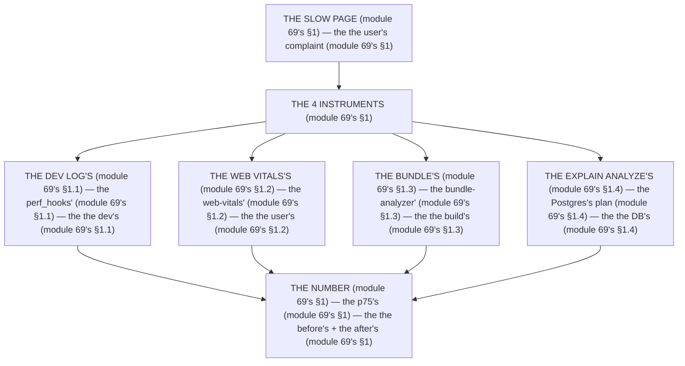

# Module 69 — Measure First: Dev Logs, Web Vitals, Bundle Reports, `EXPLAIN ANALYZE`

**Phase 18: Performance · Module 69 of 101**

> **Where does this run?** The *measurement* is **`[SERVER]`** (the `instrumentation.ts`, the request logs, the `EXPLAIN ANALYZE` — module 69's §1); the *Web Vitals* are **`[CLIENT]`** (the `web-vitals` package reads the browser's paint/input, the report travels to the **`[SERVER]`** route, module 69's §1); the *bundle report* is a **build-time** tool (the `@next/bundle-analyzer`). The module-69's standing rule (module 06's wire, now the measurement level): **no optimization without a measurement — the number comes from *this* system, *this* page, *this* p75, before and after the change (module 69's §1); a fast dev laptop is not the user's slow phone on 4G (module 69's §1)** (module 69's §1).

---

## 1. Concept — The number is the change (the 4 instruments)

**The dev log's** (module 69's §1.1): the *the `perf_hooks`'s* + the *the `Date.now()`'s* (module 69's §1.1) — the *module-69's line: the log is the dev's* (module 69's §1.1) — the *the no prod's guess* (module 69's §1.1).

**The Web Vitals's** (module 69's §1.2): the *the `web-vitals`'s package* (module 69's §1.2) — the *module-69's line: the vitals are the user's* (module 69's §1.2) — the *the no lab's* (module 69's §1.2).

**The bundle's** (module 69's §1.3): the *the `@next/bundle-analyzer`'s* (module 69's §1.3) — the *module-69's line: the bundle is the build's* (module 69's §1.3) — the *the no guess's* (module 69's §1.3).

**The `EXPLAIN ANALYZE`'s** (module 69's §1.4): the *the Postgres's plan* (module 69's §1.4) — the *module-69's line: the plan is the DB's* (module 69's §1.4) — the *the no query's guess* (module 69's §1.4).

## 2. Mental Model — The 4 instruments (drawn)



**The 4 instruments** (the module-69's mental model):
1. **The dev log** (module 69's §1.1): the *the dev's* — the *module-69's line: the log is the dev's* (module 69's §1.1).
2. **The Web Vitals** (module 69's §1.2): the *the user's* — the *module-69's line: the vitals are the user's* (module 69's §1.2).
3. **The bundle** (module 69's §1.3): the *the build's* — the *module-69's line: the bundle is the build's* (module 69's §1.3).
4. **The `EXPLAIN ANALYZE`** (module 69's §1.4): the *the DB's* — the *module-69's line: the plan is the DB's* (module 69's §1.4).

## 3. Architecture — The 4 instruments (the code)

### 3.1 The dev log (module 69's §1.1 — the request's timing)

`FILE: src/instrumentation.ts` + `FILE: src/middleware.ts` (production pattern — [SERVER] — the module-69's §3.1: the log's)

```ts
// THE INSTRUMENTATION (module 69's §3.1) — the the register's (module 69's §3.1) — the the [SERVER] (module 69's §1):
export async function register() {
  if (process.env.NEXT_RUNTIME === 'nodejs') {   /* the module-69's line: the nodejs's is the server's (module 69's §3.1) */
    await import('./instrumentation.node')   /* the module-69's line: the node's is the server's (module 69's §3.1) */
  }
}
```

```ts
// THE NODE'S INSTRUMENTATION (module 69's §3.1) — the the perf_hooks' (module 69's §1.1):
// 'use node'
import { performance } from 'perf_hooks'   /* the module-69's line: the perf_hooks is the node's (module 69's §1.1) */

export function logRequestTiming() {   /* the module-69's line: the log is the dev's (module 69's §1.1) */
  const start = performance.now()
  return () => {
    const ms = Math.round(performance.now() - start)
    if (ms > 500) console.warn(`[SLOW] ${ms}ms`)   /* the module-69's line: the 500ms is the threshold's (module 69's §3.1) */
  }
}
```

```ts
// THE MIDDLEWARE (module 69's §3.1) — the the log's (module 69's §3.1) — the the [SERVER] (module 69's §1):
// 'use edge'
import { NextResponse, type NextRequest } from 'next/server'
export function middleware(req: NextRequest) {
  const start = Date.now()   /* the module-69's line: the Date.now is the edge's (module 69's §1.1) — the the no perf_hooks (module 69's §1.1) */
  const res = NextResponse.next()
  res.headers.set('x-ms', String(Date.now() - start))   /* the module-69's line: the x-ms is the log's (module 69's §3.1) */
  return res
}
```

**The module-69's line:** the *log is the dev's* (module 69's §1.1) — the *`perf_hooks` is the node's* (module 69's §1.1) — the *the `x-ms` is the log's* (module 69's §3.1) — the *the 500ms is the threshold's* (module 69's §3.1).

### 3.2 The Web Vitals (module 69's §1.2 — the user's)

`FILE: src/components/web-vitals.tsx` + `FILE: app/api/metrics/route.ts` (production pattern — [CLIENT] + [SERVER] — the module-69's §3.2: the field's data)

```tsx
// THE WEB VITALS (module 69's §3.2) — the the web-vitals' (module 69's §1.2) — the the [CLIENT] (module 69's §1.2):
'use client'
import { onCLS, onINP, onLCP, onTTFB, onFCP } from 'web-vitals'   /* the module-69's line: the web-vitals is the user's (module 69's §1.2) */
import { useEffect } from 'react'

export function WebVitals() {
  useEffect(() => {
    const send = (metric: { name: string; value: number }) => {
      navigator.sendBeacon('/api/metrics', JSON.stringify({ ...metric, url: location.pathname, ts: Date.now() }))   /* the module-69's line: the sendBeacon is the no-block's (module 69's §3.2) */
    }
    onLCP(send)   /* the module-69's line: the LCP is the 2.5s (module 73's) */
    onINP(send)   /* the module-69's line: the INP is the 200ms (module 73's) */
    onCLS(send)   /* the module-69's line: the CLS is the 0.1 (module 73's) */
    onTTFB(send)   /* the module-69's line: the TTFB is the 800ms (module 70's) */
    onFCP(send)   /* the module-69's line: the FCP is the 1.8s (module 73's) */
  }, [])
  return null   /* the module-69's line: the no render's (module 69's §3.2) */
}
```

```ts
// THE METRICS' ROUTE (module 69's §3.2) — the the [SERVER] (module 69's §1.2) — the the no auth's (module 69's §3.2):
import { NextResponse } from 'next/server'

export async function POST(req: Request) {
  const metric = await req.json()   /* the module-69's line: the metric is the DTO's (module 69's §3.2) */
  /* THE STORE (module 69's §3.2) — the the metrics' table (module 69's §3.2) — the the no user's PII (module 69's §3.2):
     await db.insert(metrics).values({ name: metric.name, value: metric.value, url: metric.url, ts: new Date(metric.ts) })   (module 69's §3.2) */
  return NextResponse.json({ ok: true })
}
/* THE RULE (module 69's §3.2): the the metric is the DTO's (module 69's §3.2) — the the no user's PII (module 69's §3.2) — the the sendBeacon is the no-block's (module 69's §3.2) */
```

**The module-69's line:** the *vitals are the user's* (module 69's §1.2) — the *`sendBeacon` is the no-block's* (module 69's §3.2) — the *no user's PII* (module 69's §3.2) — the *no render's* (module 69's §3.2).

### 3.3 The bundle's report (module 69's §1.3 — the build's)

`FILE: next.config.ts` + `FILE: terminal` (production pattern — the module-69's §3.3: the analyzer's)

```ts
// THE BUNDLE'S ANALYZER (module 69's §3.3) — the the bundle-analyzer' (module 69's §1.3) — the the build's (module 69's §1.3):
// import withBundleAnalyzer from '@next/bundle-analyzer'   (module 69's §3.3)
// const withBundleAnalyzerConfig = withBundleAnalyzer({ enabled: process.env.ANALYZE === 'true' })   (module 69's §3.3)
// module.exports = withBundleAnalyzerConfig(nextConfig)   (module 69's §3.3)
```

```bash
# THE ANALYZE (module 69's §3.3) — the the build's (module 69's §1.3) — the the no guess's (module 69's §1.3):
ANALYZE=true npm run build   /* the module-69's line: the ANALYZE is the env's (module 69's §3.3) */
# THE OUTPUT (module 69's §3.3) — the the stats's JSON (module 69's §3.3) — the the top's 10 (module 69's §3.3):
# - The framework's (React, Next) — the the no change's (module 69's §3.3)
# - The 3rd party's (recharts, shadcn) — the the no tree-shake's (module 69's §3.3)
# - The app's (your code) — the the no lazy's (module 69's §3.3)
```

**The module-69's line:** the *bundle is the build's* (module 69's §1.3) — the *the `ANALYZE` is the env's* (module 69's §3.3) — the *the no `lazy`'s* (module 69's §3.3).

### 3.4 The `EXPLAIN ANALYZE` (module 69's §1.4 — the DB's plan)

`FILE: terminal` + `FILE: src/db/explain.ts` (production pattern — [SERVER] — the module-69's §3.4: the plan's)

```sql
-- THE EXPLAIN ANALYZE (module 69's §3.4) — the the Postgres's plan (module 69's §1.4) — the the no query's guess (module 69's §1.4):
EXPLAIN (ANALYZE, BUFFERS, FORMAT TEXT)
SELECT * FROM products WHERE org_id = 'x' AND name ILIKE '%search%' ORDER BY created_at DESC LIMIT 50;
-- THE READ (module 69's §3.4) — the the Seq Scan's (module 69's §3.4) — the the no Index Scan's (module 69's §3.4):
-- Seq Scan on products (cost=... rows=... actual time=... rows=...)   (module 69's §3.4) — the the no index's (module 69's §3.4)
-- Index Scan using products_org_idx (cost=... rows=... actual time=... rows=...)   (module 69's §3.4) — the the index's (module 69's §3.4)
```

```ts
// THE EXPLAIN'S HELPER (module 69's §3.4) — the the no prod's (module 69's §3.4) — the the dev's (module 69's §1.1):
import { db } from '@/db'
export async function explain(query: string) {
  const rows = await db.execute(`EXPLAIN (ANALYZE, BUFFERS) ${query}`)   /* the module-69's line: the plan is the DB's (module 69's §1.4) */
  console.log(rows[0])   /* the module-69's line: the log is the dev's (module 69's §1.1) */
}
/* THE RULE (module 69's §3.4): the the plan is the DB's (module 69's §1.4) — the the no prod's (module 69's §3.4) — the the dev's (module 69's §1.1) */
```

**The module-69's line:** the *plan is the DB's* (module 69's §1.4) — the *no query's guess* (module 69's §1.4) — the *no prod's* (module 69's §3.4).

## 4. Production Code — The before's + the after's (module 69's §4)

`FILE: docs/perf-baseline.md` (production pattern — the module-69's §4: the number's)

```md
## THE PERF BASELINE (module 69's §4 — the the number's (module 69's §4))

| Metric | Before | After | Target (module 73's) |
|---|---|---|---|
| LCP (p75) | 3.2s | 1.8s | 2.5s (module 73's) |
| INP (p75) | 450ms | 180ms | 200ms (module 73's) |
| CLS (p75) | 0.15 | 0.02 | 0.1 (module 73's) |
| TTFB (p75) | 1.2s | 350ms | 800ms (module 70's) |
| Bundle (main) | 280KB | 190KB | 200KB (module 71's) |
| Products query | 80ms (Seq Scan) | 12ms (Index Scan) | <50ms (module 72's) |

/* THE RULE (module 69's §4): the the number is the change's (module 69's §4) — the the p75's (module 69's §4) — the the before's + the after's (module 69's §4) */
```

**The module-69's line:** the *number is the change's* (module 69's §4) — the *p75's* (module 69's §4) — the *before's + the after's* (module 69's §4).

## 5. Common Mistakes (the measurement's failures)

| Mistake | The symptom | Fix |
|---|---|---|
| **The no measurement** (module 69's §1's line violated) | the *module-69's line: the number is the change's* (module 69's §1) — the *the no measurement's is the *no's* (module 69's §1) — the *module-69's line: the no measurement's* (module 69's §1) — the *no measurement's* (module 69's §1)* | the *the 4's instruments (module 69's §1) — the *module-69's line: the number is the change's* (module 69's §1)* |
| **The lab's** (module 69's §1.2's line violated) | the *module-69's line: the vitals are the user's* (module 69's §1.2) — the *the lab's is the *no's* (module 69's §1.2) — the *module-69's line: the no lab's* (module 69's §1.2) — the *no lab's* (module 69's §1.2)* | the *the `web-vitals`'s (module 69's §1.2) — the *module-69's line: the vitals are the user's* (module 69's §1.2)* |
| **The p50's** (module 69's §4's line violated) | the *module-69's line: the p75's* (module 69's §4) — the *the p50's is the *no's* (module 69's §4) — the *module-69's line: the no p50's* (module 69's §4) — the *no p50's* (module 69's §4)* | the *the p75's (module 69's §4) — the *module-69's line: the p75's* (module 69's §4)* |
| **The no after's** (module 69's §4's line violated) | the *module-69's line: the before's + the after's* (module 69's §4) — the *the no after's is the *no's* (module 69's §4) — the *module-69's line: the no after's* (module 69's §4) — the *no after's* (module 69's §4)* | the *the after's (module 69's §4) — the *module-69's line: the before's + the after's* (module 69's §4)* |
| **The prod's EXPLAIN** (module 69's §3.4's line violated) | the *module-69's line: the no prod's* (module 69's §3.4) — the *the prod's EXPLAIN's is the *no's* (module 69's §3.4) — the *module-69's line: the no prod's* (module 69's §3.4) — the *no prod's* (module 69's §3.4)* | the *the dev's (module 69's §3.4) — the *module-69's line: the no prod's* (module 69's §3.4)* |
| **The no `sendBeacon`** (module 69's §3.2's line violated) | the *module-69's line: the `sendBeacon` is the no-block's* (module 69's §3.2) — the *the no `sendBeacon`'s is the *no's* (module 69's §3.2) — the *module-69's line: the no `sendBeacon`'s* (module 69's §3.2) — the *no `sendBeacon`'s* (module 69's §3.2)* | the *the `navigator.sendBeacon`'s (module 69's §3.2) — the *module-69's line: the `sendBeacon` is the no-block's* (module 69's §3.2)* |

## 6. Security Notes

- **The no user's PII** (module 69's §3.2): the *module-69's line: the no user's PII* (module 69's §3.2) — the *module-75's* *deep-dive* (module 75's).
- **The `metrics`'s route** (module 69's §3.2): the *module-69's line: the no auth's* (module 69's §3.2) — the *module-75's* *deep-dive* (module 75's).
- **The no prod's EXPLAIN** (module 69's §3.4): the *module-69's line: the no prod's* (module 69's §3.4) — the *module-75's* *deep-dive* (module 75's).

## 7. Performance Notes

- **The p75's** (module 69's §4): the *module-69's line: the p75's* (module 69's §4) — the *the no p50's* (module 69's §4).
- **The before's + the after's** (module 69's §4): the *module-69's line: the before's + the after's* (module 69's §4) — the *the no guess's* (module 69's §1).
- **The `sendBeacon`'s** (module 69's §3.2): the *module-69's line: the `sendBeacon` is the no-block's* (module 69's §3.2) — the *the no `fetch`'s* (module 69's §3.2).

## 8. Exercise

**Beginner.** *The dev log's* (module 69's §3.1): the *the `instrumentation.ts`'s* (module 3.1's) + the *the `middleware`'s `x-ms`* (module 3.1's) — *build it* — the *artifact: the log's* (module 3.1's).

**Intermediate.** *The Web Vitals's* (module 69's §3.2): the *the `web-vitals`'s* (module 3.2's) + the *the `/api/metrics`'s* (module 3.2's) + the *the `sendBeacon`'s* (module 3.2's) — *build it* — the *artifact: the vitals'* (module 3.2's).

**Production.** *The bundle's + the `EXPLAIN`'s* (module 69's §3.3 + §3.4): the *the `ANALYZE=true`'s* (module 3.3's) + the *the `EXPLAIN ANALYZE`'s* (module 3.4's) + the *the baseline's table* (module 4's) — *build it* — the *artifact: the baseline's* (module 4's).

## 9. Architecture Challenge

**Prompt:** The *"the team says the dashboard is slow, but has no numbers — no Web Vitals, no bundle report, no query plans"* (the *module-69's* *measure* — the *module-73's* *vitals* — the *module-69's line: the number is the change's* (module 69's §1) — the *module-73's line: the p75's is the target's* (module 73's) — the *module-69's standing line: the number is the change's + the p75's + the before's + the after's* (module 69's §1 + module 69's §4)).

The *problems*: (1) the *the no Web Vitals's* (the *the no `web-vitals`'s* (module 69's §1.2) — the *module-69's line: the vitals are the user's* (module 69's §1.2) — the *module-69's standing line: the vitals are the user's* (module 69's §1.2)).

(2) the *the no query's plan* (the *the no `EXPLAIN ANALYZE`'s* (module 69's §1.4) — the *module-69's line: the plan is the DB's* (module 69's §1.4) — the *module-69's standing line: the plan is the DB's* (module 69's §1.4)).

**Design**: the *the measurement's* (the *the `web-vitals`'s* (module 69's §1.2) + the *the `bundle-analyzer`'s* (module 69's §1.3) + the *the `EXPLAIN ANALYZE`'s* (module 69's §1.4) + the *the baseline's table* (module 69's §4) — the *module-69's line: the number is the change's* (module 69's §1) — the *module-69's standing line: the number is the change's + the p75's + the before's + the after's* (module 69's §1 + module 69's §4)).

Produce: the *the measurement's* (the *the `web-vitals`'s* (module 69's §1.2) + the *the `bundle-analyzer`'s* (module 69's §1.3) + the *the `EXPLAIN ANALYZE`'s* (module 69's §1.4) + the *the baseline's table* (module 69's §4) — the *module-69's line: the number is the change's* (module 69's §1) — the *module-69's standing line: the number is the change's + the p75's + the before's + the after's* (module 69's §1 + module 69's §4)).

<details>
<summary>Model answer</summary>
**The measurement's** (module 69's §1.2 + module 69's §1.3 + module 69's §1.4 + module 69's §4):
1. **The Web Vitals's** (module 69's §1.2): the *the `web-vitals`'s is the user's* — the *module-69's line: the vitals are the user's* (module 69's §1.2).
2. **The bundle's** (module 69's §1.3): the *the `bundle-analyzer`'s is the build's* — the *module-69's line: the bundle is the build's* (module 69's §1.3).
3. **The `EXPLAIN`'s** (module 69's §1.4): the *the `EXPLAIN ANALYZE`'s is the DB's* — the *module-69's line: the plan is the DB's* (module 69's §1.4).
4. **The baseline's** (module 69's §4): the *the table's is the p75's before's + after's* — the *module-69's line: the number is the change's* (module 69's §1).
**The generalization** (the *measurement's* pattern, the *module's* standing rule): **the *number is the change's* (module 69's §1) — the *the p75's* (module 69's §4) — the *the before's + the after's* (module 69's §4) — the *module-69's standing line: the number is the change's + the p75's + the before's + the after's* (module 69's §1 + module 69's §4)*.
</details>

## 10. Official Documentation

- Next.js: `instrumentation.ts`: https://nextjs.org/docs/app/api-reference/file-conventions/instrumentation
- Next.js: `@next/bundle-analyzer`: https://nextjs.org/docs/app/api-reference/next-config-js/bundlePagesAnalyzer
- web-vitals: https://github.com/GoogleChrome/web-vitals
- MDN: `performance`: https://developer.mozilla.org/en-US/docs/Web/API/Performance
- Postgres: `EXPLAIN`: https://www.postgresql.org/docs/current/using-explain.html
- The module-73's vitals: the module-73 (the phase-18's file-05)

## 11. What You Should Know Before Continuing

- [ ] I can state the *4 instruments* (module 1's: the dev log/Web Vitals/bundle/`EXPLAIN`) — the *module-69's line: the number is the change's* (module 1's)
- [ ] I know the *log is the dev's* (module 1.1's) — the *the no prod's* (module 1.1's)
- [ ] I know the *vitals are the user's* (module 1.2's) — the *the no lab's* (module 1.2's)
- [ ] I know the *bundle is the build's* (module 1.3's) — the *the no guess's* (module 1.3's)
- [ ] I know the *plan is the DB's* (module 1.4's) — the *the no query's guess* (module 1.4's)
- [ ] I know the *p75's* (module 4's) — the *the no p50's* (module 4's)
- [ ] I know the *before's + the after's* (module 4's)
- [ ] I've done the *dev log's* (module 8's beginner) + the *Web Vitals's* (module 8's intermediate) + the *bundle's/`EXPLAIN`'s* (module 8's production) — the *artifacts* (module 20's)

**Next:** Module 70 — Server Performance (the *the TTFB's* — the *the waterfall's* — the *module-70's line: the TTFB is the 800ms's* (module 70's)).
