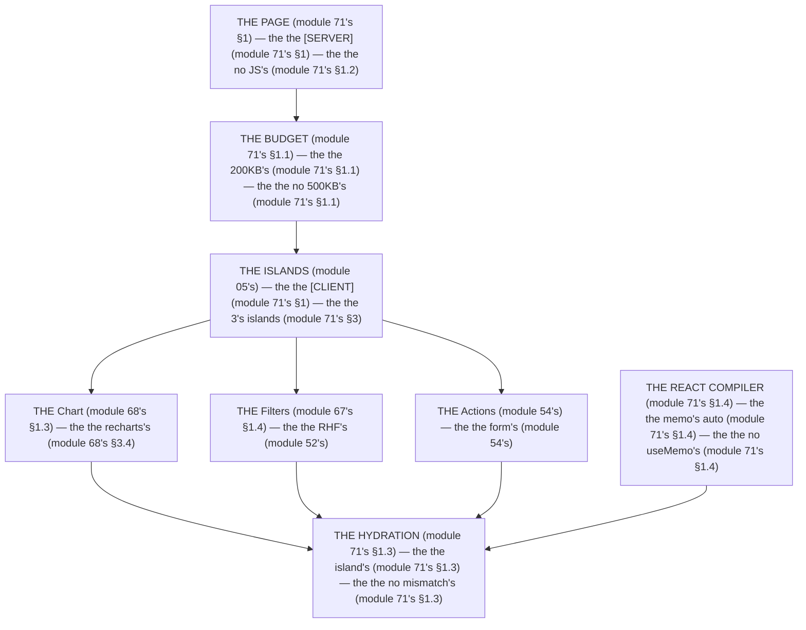

# Module 71 — Client Performance: Bundle Budgets, JS Reduction, Hydration, React Compiler

**Phase 18: Performance · Module 71 of 101**

> **Where does this run?** The bundle is **`[CLIENT]`** (the JS the browser downloads, parses, and executes); the *decision* to ship JS is **`[BOTH]`** (the `[SERVER]` renders the HTML without it, the `[CLIENT]` hydrates the islands); the *hydration* is **`[CLIENT]`. The module-71's standing rule (module 05's island contract, now the budget level): **the default is *no client JS* (the Server Component renders the HTML, module 05's); every `'use client'` is a *cost* against the budget (module 71's §1); the React Compiler removes the *memo* boilerplate, not the *decision* (module 71's §1)** (module 71's §1).

---

## 1. Concept — The client is the 200KB (the 4 levers)

**The budget's** (module 71's §1.1): the *the 200KB's gzipped* (module 71's §1.1) — the *module-71's line: the client is the 200KB's* (module 71's §1.1) — the *the no 500KB's* (module 71's §1.1).

**The JS's reduction** (module 71's §1.2): the *the Server Component's default* (module 05's) — the *module-71's line: the JS is the no's* (module 71's §1.2) — the *the no `'use client'`'s guess* (module 71's §1.2).

**The hydration's** (module 71's §1.3): the *the island's* (module 05's) — the *module-71's line: the hydration is the island's* (module 71's §1.3) — the *the no mismatch's* (module 71's §1.3).

**The React Compiler's** (module 71's §1.4): the *the memo's auto* (module 71's §1.4) — the *module-71's line: the compiler is the memo's* (module 71's §1.4) — the *the no `useMemo`'s* (module 71's §1.4).

## 2. Mental Model — The client's budget (drawn)



**The client's budget** (the module-71's mental model):
1. **The budget** (module 71's §1.1): the *the 200KB's* — the *module-71's line: the client is the 200KB's* (module 71's §1.1).
2. **The JS's reduction** (module 71's §1.2): the *the Server Component's* — the *module-71's line: the JS is the no's* (module 71's §1.2).
3. **The hydration** (module 71's §1.3): the *the island's* — the *module-71's line: the hydration is the island's* (module 71's §1.3).
4. **The React Compiler** (module 71's §1.4): the *the memo's auto* — the *module-71's line: the compiler is the memo's* (module 71's §1.4).

## 3. Architecture — The 4 levers (the code)

### 3.1 The budget's (module 71's §1.1 — the 200KB's)

`FILE: next.config.ts` (production pattern — the module-71's §3.1: the analyzer's)

```ts
// THE BUDGET'S (module 71's §3.1) — the the 200KB's (module 71's §1.1) — the the analyzer's (module 69's §1.3):
// import withBundleAnalyzer from '@next/bundle-analyzer'   (module 69's §3.3)
// const withBundleAnalyzerConfig = withBundleAnalyzer({ enabled: process.env.ANALYZE === 'true' })   (module 69's §3.3)
// module.exports = withBundleAnalyzerConfig({
//   /* THE BUDGET'S CHECK (module 71's §3.1) — the the 200KB's (module 71's §1.1):
      // - The main's chunk: < 200KB gzipped (module 71's §1.1)
      // - The 3rd party's: < 50KB gzipped (module 71's §1.1)
      // - The app's: < 100KB gzipped (module 71's §1.1)
   */
// })
```

**The module-71's line:** the *client is the 200KB's* (module 71's §1.1) — the *the no 500KB's* (module 71's §1.1) — the *the analyzer's* (module 69's §1.3).

### 3.2 The JS's reduction (module 71's §1.2 — the no `'use client'`'s guess)

`FILE: src/components/revenue-chart.tsx` (production pattern — [CLIENT] — the module-71's §3.2: the `dynamic`'s)

```tsx
// THE JS'S REDUCTION (module 71's §1.2) — the the dynamic's (module 71's §3.2) — the the no 'use client' (module 71's §1.2):
// 'use client' is NOT needed here — the dynamic's is the lazy's (module 71's §3.2)
import dynamic from 'next/dynamic'

const RevenueChart = dynamic(() => import('./revenue-chart-impl'), {   /* the module-71's line: the dynamic is the lazy's (module 71's §3.2) */
  loading: () => <ChartSkeleton />,   /* the module-58's line: the loading's is the skeleton's (module 58's §1.5) */
  ssr: true,   /* the module-71's line: the ssr is the true's (module 71's §3.2) — the the no client-only (module 71's §3.2) */
})

export { RevenueChart }
/* THE RULE (module 71's §3.2): the the dynamic is the lazy's (module 71's §3.2) — the the no 'use client' (module 71's §1.2) — the the ssr is the true's (module 71's §3.2) */
```

```tsx
// THE ISLAND'S AUDIT (module 71's §3.2) — the the no 'use client' (module 71's §1.2) — the the reason's (module 71's §3.2):
// 'use client'   /* THE REASON (module 71's §3.2): the the chart's is the canvas's (module 68's §1.3) — the the no server's canvas (module 68's §1.3) */
import { Bar, BarChart } from 'recharts'   /* the module-68's line: the recharts is the chart's (module 68's §3.4) */
export function RevenueChartImpl({ data }: { data: { date: string; revenue: number }[] }) {
  return <BarChart width={720} height={240} data={data}><Bar dataKey="revenue" /></BarChart>
}
```

**The module-71's line:** the *JS is the no's* (module 71's §1.2) — the *the `dynamic` is the lazy's* (module 71's §3.2) — the *the no `'use client`'s guess* (module 71's §1.2).

### 3.3 The hydration's (module 71's §1.3 — the island's)

`FILE: app/layout.tsx` (production pattern — [SERVER] — the module-71's §3.3: the no mismatch's)

```tsx
// THE HYDRATION (module 71's §3.3) — the the no mismatch's (module 71's §1.3) — the the suppressHydrationWarning's (module 57's §1.4):
export default function RootLayout({ children }: { children: React.ReactNode }) {
  return (
    <html lang="en" suppressHydrationWarning>   /* the module-71's line: the suppressHydrationWarning is the dark's (module 57's §1.4) — the the no mismatch's (module 71's §1.3) */
      <body>{children}</body>
    </html>
  )
}
/* THE RULE (module 71's §3.3): the the suppressHydrationWarning is the dark's (module 57's §1.4) — the the no mismatch's (module 71's §1.3) — the the no Date's in the render (module 71's §3.3) */
```

```tsx
// THE NO MISMATCH'S (module 71's §3.3) — the the no Date's in the render (module 71's §1.3):
// ❌ WRONG (module 71's §3.3) — the the Date's in the render (module 71's §1.3):
// <p>{new Date().toISOString()}</p>   /* the module-71's line: the no Date's in the render (module 71's §1.3) — the the mismatch's (module 71's §1.3) */
// ✅ RIGHT (module 71's §3.3) — the the server's Date's (module 71's §1.3):
// const now = await Date.now()   /* the module-71's line: the Date is the server's (module 71's §1.3) — the the no mismatch's (module 71's §1.3) */
```

**The module-71's line:** the *hydration is the island's* (module 71's §1.3) — the *the no mismatch's* (module 71's §1.3) — the *the no `Date`'s in the render* (module 71's §1.3).

### 3.4 The React Compiler's (module 71's §1.4 — the memo's auto)

`FILE: src/components/stat-cards.tsx` (production pattern — [SERVER] — the module-71's §3.4: the no `useMemo`'s)

```tsx
// THE REACT COMPILER (module 71's §1.4) — the the memo's auto (module 71's §1.4) — the the no useMemo's (module 71's §1.4):
// THE NO useMemo (module 71's §3.4) — the the compiler is the memo's (module 71's §1.4):
export function StatCards({ revenue, orders, products, avgOrderValue }: { revenue: number; orders: number; products: number; avgOrderValue: number }) {
  /* THE COMPILER (module 71's §1.4) — the the memo's auto (module 71's §1.4):
     const formattedRevenue = formatCents(revenue, 'USD')   (module 71's §3.4) — the the compiler memoizes it (module 71's §1.4)
     const formattedOrders = orders.toLocaleString()   (module 71's §3.4) — the the compiler memoizes it (module 71's §1.4) */
  const formattedRevenue = formatCents(revenue, 'USD')   /* the module-71's line: the compiler is the memo's (module 71's §1.4) */
  const formattedOrders = orders.toLocaleString()   /* the module-71's line: the compiler is the memo's (module 71's §1.4) */
  return (
    <div className="grid grid-cols-2 gap-4 sm:grid-cols-4">
      <StatCard label="Revenue" value={formattedRevenue} />   /* the module-68's line: the stats is the server's (module 68's §1.2) */
      <StatCard label="Orders" value={formattedOrders} />
      <StatCard label="Products" value={products.toLocaleString()} />
      <StatCard label="Avg Order" value={formatCents(avgOrderValue, 'USD')} />
    </div>
  )
}
/* THE RULE (module 71's §3.4): the the compiler is the memo's (module 71's §1.4) — the the no useMemo's (module 71's §1.4) — the the no useCallback's (module 71's §1.4) */
```

**The module-71's line:** the *compiler is the memo's* (module 71's §1.4) — the *the no `useMemo`'s* (module 71's §1.4) — the *the no `useCallback`'s* (module 71's §1.4).

## 4. Production Code — The `dynamic`'s (module 71's §4)

`FILE: src/components/interactive-map.tsx` (production pattern — [CLIENT] — the module-71's §4: the heavy's island)

```tsx
// THE DYNAMIC'S (module 71's §4) — the the heavy's island (module 71's §4) — the the no main's chunk (module 71's §1.1):
import dynamic from 'next/dynamic'

const InteractiveMap = dynamic(() => import('./interactive-map-impl'), {   /* the module-71's line: the dynamic is the lazy's (module 71's §4) */
  loading: () => <MapSkeleton />,   /* the module-58's line: the loading's is the skeleton's (module 58's §1.5) */
  ssr: false,   /* the module-71's line: the ssr is the false's (module 71's §4) — the the map's is the client's (module 71's §4) */
})
export { InteractiveMap }
/* THE RULE (module 71's §4): the the dynamic is the lazy's (module 71's §4) — the the no main's chunk (module 71's §1.1) — the the ssr is the false's (module 71's §4) */
```

**The module-71's line:** the *`dynamic` is the lazy's* (module 71's §4) — the *the no main's chunk* (module 71's §1.1) — the *the `ssr` is the `false`'s* (module 71's §4).

## 5. Common Mistakes (the client's failures)

| Mistake | The symptom | Fix |
|---|---|---|
| **The 500KB's** (module 71's §1.1's line violated) | the *module-71's line: the client is the 200KB's* (module 71's §1.1) — the *the 500KB's is the *no's* (module 71's §1.1) — the *module-71's line: the no 500KB's* (module 71's §1.1) — the *no 500KB's* (module 71's §1.1)* | the *the `dynamic`'s (module 71's §3.2) — the *module-71's line: the client is the 200KB's* (module 71's §1.1)* |
| **The `'use client'`'s guess** (module 71's §1.2's line violated) | the *module-71's line: the no `'use client`'s guess* (module 71's §1.2) — the *the `'use client'`'s guess is the *no's* (module 71's §1.2) — the *module-71's line: the no `'use client'`'s guess* (module 71's §1.2) — the *no `'use client'`'s guess* (module 71's §1.2)* | the *the Server Component's (module 05's) — the *module-71's line: the JS is the no's* (module 71's §1.2)* |
| **The mismatch's** (module 71's §1.3's line violated) | the *module-71's line: the no mismatch's* (module 71's §1.3) — the *the mismatch's is the *no's* (module 71's §1.3) — the *module-71's line: the no mismatch's* (module 71's §1.3) — the *no mismatch's* (module 71's §1.3)* | the *the `suppressHydrationWarning`'s (module 57's §1.4) — the *module-71's line: the no mismatch's* (module 71's §1.3)* |
| **The `useMemo`'s** (module 71's §1.4's line violated) | the *module-71's line: the compiler is the memo's* (module 71's §1.4) — the *the `useMemo`'s is the *no's* (module 71's §1.4) — the *module-71's line: the no `useMemo`'s* (module 71's §1.4) — the *no `useMemo`'s* (module 71's §1.4)* | the *the React Compiler's (module 71's §1.4) — the *module-71's line: the compiler is the memo's* (module 71's §1.4)* |
| **The main's chunk's map** (module 71's §4's line violated) | the *module-71's line: the no main's chunk* (module 71's §1.1) — the *the main's chunk's map's is the *no's* (module 71's §4) — the *module-71's line: the no main's chunk's map* (module 71's §4) — the *no main's chunk's map* (module 71's §4)* | the *the `dynamic`'s (module 71's §4) — the *module-71's line: the dynamic is the lazy's* (module 71's §4)* |
| **The `Date`'s in the render** (module 71's §1.3's line violated) | the *module-71's line: the no `Date`'s in the render* (module 71's §1.3) — the *the `Date`'s in the render's is the *no's* (module 71's §1.3) — the *module-71's line: the no `Date`'s in the render* (module 71's §1.3) — the *no `Date`'s in the render* (module 71's §1.3)* | the *the server's `Date`'s (module 71's §1.3) — the *module-71's line: the no `Date`'s in the render* (module 71's §1.3)* |

## 6. Security Notes

- **The no `dangerouslySetInnerHTML`** (module 75's): the *module-75's line: the XSS's is the no `dangerouslySetInnerHTML`'s* (module 75's) — the *module-71's* *deep-dive* (module 71's).
- **The `ssr: false`** (module 71's §4): the *module-71's line: the `ssr` is the `false`'s* (module 71's §4) — the *module-75's* *deep-dive* (module 75's).

## 7. Performance Notes

- **The 200KB's** (module 71's §1.1): the *module-71's line: the client is the 200KB's* (module 71's §1.1) — the *the no 500KB's* (module 71's §1.1).
- **The `dynamic`'s** (module 71's §3.2): the *module-71's line: the `dynamic` is the lazy's* (module 71's §3.2) — the *the no main's chunk* (module 71's §1.1).
- **The React Compiler's** (module 71's §1.4): the *module-71's line: the compiler is the memo's* (module 71's §1.4) — the *the no `useMemo`'s* (module 71's §1.4).

## 8. Exercise

**Beginner.** *The budget's* (module 71's §3.1): the *the `ANALYZE=true`'s* (module 3.1's) + the *the 200KB's check* (module 3.1's) — *build it* — the *artifact: the budget's* (module 3.1's).

**Intermediate.** *The `dynamic`'s* (module 71's §3.2): the *the `RevenueChart`'s `dynamic`* (module 3.2's) + the *the `loading`'s skeleton* (module 3.2's) + the *the `ssr: true`'s* (module 3.2's) — *build it* — the *artifact: the lazy's* (module 3.2's).

**Production.** *The hydration's + the React Compiler's* (module 71's §3.3 + §3.4): the *the `suppressHydrationWarning`'s* (module 3.3's) + the *the no `useMemo`'s* (module 3.4's) — *build it* — the *artifact: the clean's* (module 3.3's).

## 9. Architecture Challenge

**Prompt:** The *"the team's dashboard main chunk is 520KB, has 12 `'use client'` components, and 3 hydration mismatches"* (the *module-71's* *client* — the *module-69's* *measure* — the *module-71's line: the client is the 200KB's* (module 71's §1.1) — the *module-69's line: the number is the change's* (module 69's §1) — the *module-71's standing line: the client is the 200KB's + the JS is the no's + the no mismatch's + the compiler is the memo's* (module 71's §1.1 + module 71's §1.2 + module 71's §1.3 + module 71's §1.4)).

The *problems*: (1) the *the 520KB's* (the *the no `dynamic`'s* (module 71's §3.2) — the *module-71's line: the client is the 200KB's* (module 71's §1.1) — the *module-71's standing line: the client is the 200KB's* (module 71's §1.1)).

(2) the *the 12's `'use client`'s* (the *the no Server Component's* (module 05's) — the *module-71's line: the JS is the no's* (module 71's §1.2) — the *module-71's standing line: the JS is the no's* (module 71's §1.2)).

**Design**: the *the client's remediation* (the *the `dynamic`'s* (module 71's §3.2) + the *the Server Component's default* (module 05's) + the *the `suppressHydrationWarning`'s* (module 71's §3.3) + the *the React Compiler's* (module 71's §1.4) — the *module-71's line: the client is the 200KB's* (module 71's §1.1) — the *module-71's standing line: the client is the 200KB's + the JS is the no's + the no mismatch's + the compiler is the memo's* (module 71's §1.1 + module 71's §1.2 + module 71's §1.3 + module 71's §1.4)).

Produce: the *the client's remediation* (the *the `dynamic`'s* (module 71's §3.2) + the *the Server Component's default* (module 05's) + the *the `suppressHydrationWarning`'s* (module 71's §3.3) + the *the React Compiler's* (module 71's §1.4) — the *module-71's line: the client is the 200KB's* (module 71's §1.1) — the *module-71's standing line: the client is the 200KB's + the JS is the no's + the no mismatch's + the compiler is the memo's* (module 71's §1.1 + module 71's §1.2 + module 71's §1.3 + module 71's §1.4)).

<details>
<summary>Model answer</summary>
**The client's remediation** (module 71's §3.2 + module 05's + module 71's §3.3 + module 71's §1.4):
1. **The `dynamic`'s** (module 71's §3.2): the *the heavy's islands are the lazy's* — the *module-71's line: the `dynamic` is the lazy's* (module 71's §3.2).
2. **The Server Component's** (module 05's): the *the 12's `'use client`'s become the server's* — the *module-71's line: the JS is the no's* (module 71's §1.2).
3. **The `suppressHydrationWarning`'s** (module 71's §3.3): the *the dark's mismatch is the suppressed's* — the *module-71's line: the no mismatch's* (module 71's §1.3).
4. **The React Compiler's** (module 71's §1.4): the *the `useMemo`'s are the compiler's* — the *module-71's line: the compiler is the memo's* (module 71's §1.4).
**The generalization** (the *client's* pattern, the *module's* standing rule): **the *client is the 200KB's* (module 71's §1.1) — the *the JS is the no's* (module 71's §1.2) — the *the no mismatch's* (module 71's §1.3) — the *the compiler is the memo's* (module 71's §1.4) — the *module-71's standing line: the client is the 200KB's + the JS is the no's + the no mismatch's + the compiler is the memo's* (module 71's §1.1 + module 71's §1.2 + module 71's §1.3 + module 71's §1.4)*.
</details>

## 10. Official Documentation

- Next.js: `next/dynamic`: https://nextjs.org/docs/app/api-reference/functions/dynamic
- Next.js: React Compiler: https://nextjs.org/docs/app/guides/react-compiler
- React: `useMemo`: https://react.dev/reference/react/useMemo
- web.dev: JS payload: https://web.dev/articles/js-payload
- The module-05's island: the module-05 (the phase-1's file-05)
- The module-69's measure: the module-69 (the phase-18's file-01)

## 11. What You Should Know Before Continuing

- [ ] I can state the *4 levers* (module 1's: the budget/JS's reduction/hydration/React Compiler) — the *module-71's line: the client is the 200KB's* (module 1's)
- [ ] I know the *client is the 200KB's* (module 1.1's) — the *the no 500KB's* (module 1.1's)
- [ ] I know the *JS is the no's* (module 1.2's) — the *the no `'use client`'s guess* (module 1.2's)
- [ ] I know the *hydration is the island's* (module 1.3's) — the *the no mismatch's* (module 1.3's)
- [ ] I know the *compiler is the memo's* (module 1.4's) — the *the no `useMemo`'s* (module 1.4's)
- [ ] I know the *`dynamic` is the lazy's* (module 3.2's) — the *the no main's chunk* (module 3.2's)
- [ ] I've done the *budget's* (module 8's beginner) + the *`dynamic`'s* (module 8's intermediate) + the *hydration/Compiler* (module 8's production) — the *artifacts* (module 20's)

**Next:** Module 72 — Database Performance (the *the N+1's* — the *the index's* — the *module-72's line: the DB is the index's* (module 72's)).
