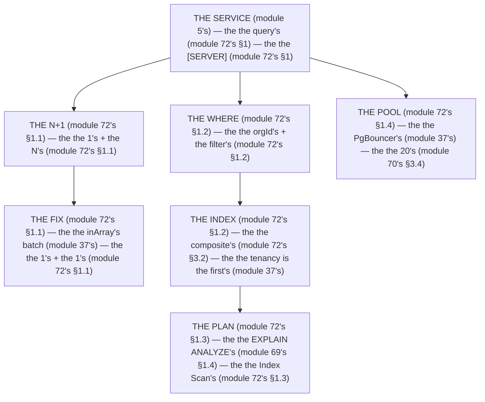

# Module 72 — Database Performance: N+1, Indexes, Query Plans, Pool Sizing

**Phase 18: Performance · Module 72 of 101**

> **Where does this run?** Everything in this module is **`[SERVER]`** (the query runs on the server, the index is in the DB, the plan is the DB's, the pool is the server's — module 72's §1). The module-72's standing rule (module 37's tenancy + module 05's service rule, now the DB level): **the query is the service's (module 05's), the tenancy clause is the *first* (module 37's), the index matches the *where* (module 72's §1), and the plan is the *measurement* (module 69's §1.4) — never guess, `EXPLAIN ANALYZE` (module 72's §1)** (module 72's §1).

---

## 1. Concept — The DB is the index's (the 4 levers)

**The N+1's** (module 72's §1.1): the *the 1's + the N's queries* (module 72's §1.1) — the *module-72's line: the N+1 is the no's* (module 72's §1.1) — the *the `inArray`'s batch* (module 37's).

**The index's** (module 72's §1.2): the *the `where`'s match* (module 72's §1.2) — the *module-72's line: the index is the `where`'s* (module 72's §1.2) — the *module-37's line: the tenancy is the first's* (module 37's).

**The plan's** (module 72's §1.3): the *the `EXPLAIN ANALYZE`'s* (module 69's §1.4) — the *module-72's line: the plan is the measure's* (module 69's §1.4) — the *the no guess's* (module 72's §1.3).

**The pool's** (module 72's §1.4): the *the PgBouncer's* (module 37's) — the *module-72's line: the pool is the 20's* (module 70's §3.4) — the *the no per-request's* (module 70's §1.4).

## 2. Mental Model — The query's path (drawn)



**The query's path** (the module-72's mental model):
1. **The N+1** (module 72's §1.1): the *the no's* — the *module-72's line: the N+1 is the no's* (module 72's §1.1).
2. **The index** (module 72's §1.2): the *the `where`'s match* — the *module-72's line: the index is the `where`'s* (module 72's §1.2).
3. **The plan** (module 72's §1.3): the *the measure's* — the *module-72's line: the plan is the measure's* (module 69's §1.4).
4. **The pool** (module 72's §1.4): the *the 20's* — the *module-72's line: the pool is the 20's* (module 70's §3.4).

## 3. Architecture — The 4 levers (the code)

### 3.1 The N+1's (module 72's §1.1 — the `inArray`'s batch)

`FILE: src/services/products.ts` (production pattern — [SERVER] — the module-72's §3.1: the no N+1's)

```ts
// THE N+1 (module 72's §1.1) — the the no's (module 72's §1.1) — the the inArray's batch (module 37's):
import { db } from '@/db'
import { products, productImages } from '@/db/schema'   /* the module-37's line: the table is the orgId's FK (module 37's) */
import { eq, and, desc, inArray } from 'drizzle-orm'

export async function listProducts(orgId: string, limit = 50) {
  /* THE WRONG (module 72's §3.1) — the the 1's + the N's (module 72's §1.1):
     const items = await db.select().from(products).where(eq(products.orgId, orgId)).limit(limit)   (module 72's §3.1) — the the 1's query (module 72's §1.1)
     for (const p of items) {   (module 72's §3.1) — the the N's queries (module 72's §1.1)
       p.images = await db.select().from(productImages).where(eq(productImages.productId, p.id))   (module 72's §3.1) — the the no inArray (module 72's §1.1)
     }
     /* 51 queries (module 72's §1.1) — the the no inArray (module 72's §1.1) */

  /* THE RIGHT (module 72's §3.1) — the the 1's + the 1's (module 72's §1.1): */
  const items = await db.select().from(products).where(eq(products.orgId, orgId)).orderBy(desc(products.createdAt)).limit(limit)   /* the module-72's line: the 1's query (module 72's §1.1) */
  const ids = items.map((p) => p.id)   /* the module-72's line: the ids is the batch's (module 72's §3.1) */
  const images = await db.select().from(productImages).where(inArray(productImages.productId, ids))   /* the module-72's line: the inArray is the 1's (module 72's §1.1) */
  const imagesById = new Map<string, typeof images>()   /* the module-72's line: the map is the group's (module 72's §3.1) */
  for (const img of images) {
    if (!imagesById.has(img.productId)) imagesById.set(img.productId, [])
    imagesById.get(img.productId)!.push(img)
  }
  return items.map((p) => ({ ...p, images: imagesById.get(p.id) ?? [] }))   /* the module-72's line: the 2's queries (module 72's §1.1) */
}
/* THE RULE (module 72's §3.1): the the N+1 is the no's (module 72's §1.1) — the the inArray is the 1's (module 72's §1.1) — the the 2's queries (module 72's §1.1) */
```

**The module-72's line:** the *N+1 is the no's* (module 72's §1.1) — the *`inArray` is the 1's* (module 72's §1.1) — the *the 2's queries* (module 72's §1.1).

### 3.2 The index's (module 72's §1.2 — the composite's)

`FILE: src/db/schema.ts` + `FILE: migrations/001_products_idx.sql` (production pattern — [SERVER] — the module-72's §3.2: the `where`'s match)

```ts
// THE INDEX (module 72's §1.2) — the the composite's (module 72's §3.2) — the the tenancy is the first's (module 37's):
export const products = pgTable('products', {
  id: uuid('id').primaryKey().defaultRandom(),   /* the module-37's line: the uuid's (module 37's) */
  orgId: uuid('org_id').notNull().references(() => orgs.id, { onDelete: 'cascade' }),   /* the module-49's line: the orgId is the FK's (module 49's) */
  name: text('name').notNull(),
  status: text('status').notNull().default('active'),
  price: integer('price').notNull(),   /* the module-37's line: the cents' (module 37's) */
  createdAt: timestamp('created_at', { withTimezone: true }).notNull().defaultNow(),   /* the module-37's line: the timestamptz's (module 37's) */
}, (t) => [
  /* THE COMPOSITE'S (module 72's §3.2) — the the tenancy is the first's (module 37's): */
  index('products_org_created_idx').on(t.orgId, t.createdAt.desc()),   /* the module-72's line: the index is the `where`'s (module 72's §1.2) — the the orgId is the first's (module 37's) */
  index('products_org_status_idx').on(t.orgId, t.status),   /* the module-72's line: the index is the `where`'s (module 72's §1.2) */
])
```

```sql
-- THE INDEX'S DDL (module 72's §3.2) — the the composite's (module 72's §3.2) — the the tenancy is the first's (module 37's):
CREATE INDEX products_org_created_idx ON products (org_id, created_at DESC);   /* the module-72's line: the orgId is the first's (module 37's) */
CREATE INDEX products_org_status_idx ON products (org_id, status);   /* the module-72's line: the orgId is the first's (module 37's) */
```

**The module-72's line:** the *index is the `where`'s* (module 72's §1.2) — the *tenancy is the first's* (module 37's) — the *the composite's* (module 72's §3.2).

### 3.3 The plan's (module 72's §1.3 — the `EXPLAIN ANALYZE`'s)

`FILE: terminal` (production pattern — [SERVER] — the module-72's §3.3: the Index Scan's)

```sql
-- THE PLAN (module 72's §1.3) — the the EXPLAIN ANALYZE's (module 69's §1.4) — the the no guess's (module 72's §1.3):
EXPLAIN (ANALYZE, BUFFERS)
SELECT * FROM products WHERE org_id = 'x' ORDER BY created_at DESC LIMIT 50;
-- BEFORE (module 72's §3.3) — the the Seq Scan's (module 72's §1.3) — the the no index's (module 72's §1.2):
-- Sort  (cost=... rows=... actual time=... rows=50)
--   ->  Seq Scan on products  (cost=... rows=... actual time=... rows=50)   (module 72's §3.3) — the the 80ms (module 72's §1.3)
-- AFTER (module 72's §3.3) — the the Index Scan's (module 72's §1.3) — the the index's (module 72's §1.2):
-- Limit  (cost=... rows=... actual time=... rows=50)
--   ->  Index Scan using products_org_created_idx on products  (cost=... rows=... actual time=... rows=50)   (module 72's §3.3) — the the 12ms (module 72's §1.3)
-- THE READ (module 72's §3.3): the the Seq Scan's is the 80ms's (module 72's §1.3) — the the Index Scan's is the 12ms's (module 72's §1.3)
```

**The module-72's line:** the *plan is the measure's* (module 69's §1.4) — the *Seq Scan is the 80ms's* (module 72's §1.3) — the *Index Scan is the 12ms's* (module 72's §1.3).

### 3.4 The pool's (module 72's §1.4 — the PgBouncer's)

`FILE: .env` + `FILE: pgbouncer.ini` (production pattern — [SERVER] — the module-72's §3.4: the 20's)

```ini
# THE PGBOUNCER (module 72's §3.4) — the the 20's (module 70's §3.4) — the the no per-request's (module 70's §1.4):
[databases]
shop = host=postgres.internal port=5432 dbname=shop

[pgbouncer]
pool_mode = transaction   /* the module-72's line: the pool_mode is the transaction's (module 37's) — the the no session's (module 37's) */
max_client_conn = 100   /* the module-72's line: the max_client_conn is the 100's (module 72's §3.4) */
default_pool_size = 20   /* the module-72's line: the default_pool_size is the 20's (module 70's §3.4) */
```

**The module-72's line:** the *pool is the 20's* (module 70's §3.4) — the *`pool_mode` is the transaction's* (module 37's) — the *the no per-request's* (module 70's §1.4).

## 4. Production Code — The query's budget (module 72's §4)

`FILE: docs/query-budget.md` (production pattern — the module-72's §4: the 50ms's)

```md
## THE QUERY'S BUDGET (module 72's §4 — the the 50ms's (module 72's §4))

| Query | Before | After | Target |
|---|---|---|---|
| listProducts | 80ms (Seq Scan) | 12ms (Index Scan) | <50ms (module 72's §4) |
| listProducts + images (N+1) | 320ms (51 queries) | 25ms (2 queries) | <50ms (module 72's §4) |
| getDashboardStats | 580ms (5 queries) | 200ms (Promise.all) | <300ms (module 70's §1.2) |

/* THE RULE (module 72's §4): the the query is the 50ms's (module 72's §4) — the the no 300ms's (module 72's §4) — the the plan is the measure's (module 69's §1.4) */
```

**The module-72's line:** the *query is the 50ms's* (module 72's §4) — the *the no 300ms's* (module 72's §4) — the *plan is the measure's* (module 69's §1.4).

## 5. Common Mistakes (the DB's failures)

| Mistake | The symptom | Fix |
|---|---|---|
| **The N+1's** (module 72's §1.1's line violated) | the *module-72's line: the N+1 is the no's* (module 72's §1.1) — the *the N+1's is the *no's* (module 72's §1.1) — the *module-72's line: the no N+1's* (module 72's §1.1) — the *no N+1's* (module 72's §1.1)* | the *the `inArray`'s (module 37's) — the *module-72's line: the N+1 is the no's* (module 72's §1.1)* |
| **The no index** (module 72's §1.2's line violated) | the *module-72's line: the index is the `where`'s* (module 72's §1.2) — the *the no index's is the *no's* (module 72's §1.2) — the *module-72's line: the no index's* (module 72's §1.2) — the *no index's* (module 72's §1.2)* | the *the composite's index (module 72's §3.2) — the *module-72's line: the index is the `where`'s* (module 72's §1.2)* |
| **The no `EXPLAIN`** (module 72's §1.3's line violated) | the *module-72's line: the plan is the measure's* (module 69's §1.4) — the *the no `EXPLAIN`'s is the *no's* (module 72's §1.3) — the *module-72's line: the no `EXPLAIN`'s* (module 72's §1.3) — the *no `EXPLAIN`'s* (module 72's §1.3)* | the *the `EXPLAIN ANALYZE`'s (module 69's §1.4) — the *module-72's line: the plan is the measure's* (module 69's §1.4)* |
| **The session's pool** (module 37's line violated) | the *module-72's line: the `pool_mode` is the transaction's* (module 37's) — the *the session's pool's is the *no's* (module 37's) — the *module-72's line: the no session's* (module 37's) — the *no session's* (module 37's)* | the *the `pool_mode = transaction`'s (module 37's) — the *module-72's line: the `pool_mode` is the transaction's* (module 37's)* |
| **The 100's pool** (module 70's §3.4's line violated) | the *module-72's line: the pool is the 20's* (module 70's §3.4) — the *the 100's pool's is the *no's* (module 72's §3.4) — the *module-72's line: the no 100's pool* (module 72's §3.4) — the *no 100's pool* (module 72's §3.4)* | the *the `default_pool_size = 20`'s (module 70's §3.4) — the *module-72's line: the pool is the 20's* (module 70's §3.4)* |
| **The no tenancy's index** (module 37's line violated) | the *module-72's line: the tenancy is the first's* (module 37's) — the *the no tenancy's index's is the *no's* (module 37's) — the *module-72's line: the no tenancy's index* (module 37's) — the *no tenancy's index* (module 37's)* | the *the composite's (orgId, ...) (module 72's §3.2) — the *module-72's line: the tenancy is the first's* (module 37's)* |

## 6. Security Notes

- **The tenancy's** (module 37's): the *module-37's line: the tenancy is the first's* (module 37's) — the *module-72's line: the index is the tenancy's* (module 37's) — the *module-75's* *deep-dive* (module 75's).
- **The no PII in the plan** (module 72's §3.3): the *module-72's line: the no PII in the plan* (module 72's §3.3) — the *module-75's* *deep-dive* (module 75's).

## 7. Performance Notes

- **The 50ms's** (module 72's §4): the *module-72's line: the query is the 50ms's* (module 72's §4) — the *the no 300ms's* (module 72's §4).
- **The `inArray`'s** (module 72's §1.1): the *module-72's line: the N+1 is the no's* (module 72's §1.1) — the *the 2's queries* (module 72's §1.1).
- **The Index Scan's** (module 72's §1.3): the *module-72's line: the Index Scan is the 12ms's* (module 72's §1.3) — the *the no Seq Scan's* (module 72's §1.3).

## 8. Exercise

**Beginner.** *The N+1's fix* (module 72's §3.1): the *the `inArray`'s batch* (module 3.1's) + the *the 2's queries* (module 3.1's) — *build it* — the *artifact: the 2's queries* (module 3.1's).

**Intermediate.** *The index's* (module 72's §3.2): the *the composite's DDL* (module 3.2's) + the *the `EXPLAIN ANALYZE`'s before/after* (module 3.3's) — *build it* — the *artifact: the index's* (module 3.2's).

**Production.** *The pool's* (module 72's §3.4): the *the `pgbouncer.ini`'s* (module 3.4's) + the *the `pool_mode = transaction`'s* (module 3.4's) + the *the query's budget's* (module 4's) — *build it* — the *artifact: the pool's* (module 3.4's).

## 9. Architecture Challenge

**Prompt:** The *"the team's product list takes 320ms (51 queries), the dashboard takes 580ms (5 queries), and the pool is at 100 connections"* (the *module-72's* *DB* — the *module-70's* *server* — the *module-72's line: the query is the 50ms's* (module 72's §4) — the *module-70's line: the pool is the 20's* (module 70's §3.4) — the *module-72's standing line: the N+1 is the no's + the index is the `where`'s + the plan is the measure's + the pool is the 20's* (module 72's §1.1 + module 72's §1.2 + module 72's §1.3 + module 72's §1.4)).

The *problems*: (1) the *the N+1's* (the *the no `inArray`'s* (module 37's) — the *module-72's line: the N+1 is the no's* (module 72's §1.1) — the *module-72's standing line: the N+1 is the no's* (module 72's §1.1)).

(2) the *the 100's pool* (the *the no PgBouncer's* (module 37's) — the *module-72's line: the pool is the 20's* (module 70's §3.4) — the *module-72's standing line: the pool is the 20's* (module 70's §3.4)).

**Design**: the *the DB's remediation* (the *the `inArray`'s* (module 37's) + the *the composite's index* (module 72's §3.2) + the *the `EXPLAIN ANALYZE`'s* (module 69's §1.4) + the *the PgBouncer's* (module 37's) — the *module-72's line: the query is the 50ms's* (module 72's §4) — the *module-72's standing line: the N+1 is the no's + the index is the `where`'s + the plan is the measure's + the pool is the 20's* (module 72's §1.1 + module 72's §1.2 + module 72's §1.3 + module 72's §1.4)).

Produce: the *the DB's remediation* (the *the `inArray`'s* (module 37's) + the *the composite's index* (module 72's §3.2) + the *the `EXPLAIN ANALYZE`'s* (module 69's §1.4) + the *the PgBouncer's* (module 37's) — the *module-72's line: the query is the 50ms's* (module 72's §4) — the *module-72's standing line: the N+1 is the no's + the index is the `where`'s + the plan is the measure's + the pool is the 20's* (module 72's §1.1 + module 72's §1.2 + module 72's §1.3 + module 72's §1.4)).

<details>
<summary>Model answer</summary>
**The DB's remediation** (module 37's + module 72's §3.2 + module 69's §1.4 + module 37's):
1. **The `inArray`'s** (module 37's): the *the 51's queries become the 2's* — the *module-72's line: the N+1 is the no's* (module 72's §1.1).
2. **The composite's index's** (module 72's §3.2): the *the Seq Scan's becomes the Index Scan's* — the *module-72's line: the index is the `where`'s* (module 72's §1.2).
3. **The `EXPLAIN`'s** (module 69's §1.4): the *the plan is the measure's* — the *module-72's line: the plan is the measure's* (module 69's §1.4).
4. **The PgBouncer's** (module 37's): the *the 100's connections become the 20's* — the *module-72's line: the pool is the 20's* (module 70's §3.4).
**The generalization** (the *DB's* pattern, the *module's* standing rule): **the *N+1 is the no's* (module 72's §1.1) — the *the index is the `where`'s* (module 72's §1.2) — the *the plan is the measure's* (module 69's §1.4) — the *the pool is the 20's* (module 70's §3.4) — the *module-72's standing line: the N+1 is the no's + the index is the `where`'s + the plan is the measure's + the pool is the 20's* (module 72's §1.1 + module 72's §1.2 + module 72's §1.3 + module 72's §1.4)*.
</details>

## 10. Official Documentation

- Drizzle: `inArray`: https://orm.drizzle.site/docs/queries/batch-insert
- Postgres: `EXPLAIN`: https://www.postgresql.org/docs/current/using-explain.html
- Postgres: Indexes: https://www.postgresql.org/docs/current/indexes.html
- PgBouncer: https://www.pgbouncer.org/
- The module-37's tenancy: the module-37 (the phase-8's file-05)
- The module-69's measure: the module-69 (the phase-18's file-01)

## 11. What You Should Know Before Continuing

- [ ] I can state the *4 levers* (module 1's: the N+1/index/plan/pool) — the *module-72's line: the query is the 50ms's* (module 1's)
- [ ] I know the *N+1 is the no's* (module 1.1's) — the *the `inArray`'s* (module 1.1's)
- [ ] I know the *index is the `where`'s* (module 1.2's) — the *the tenancy is the first's* (module 37's)
- [ ] I know the *plan is the measure's* (module 1.3's) — the *the `EXPLAIN ANALYZE`'s* (module 69's §1.4)
- [ ] I know the *pool is the 20's* (module 1.4's) — the *the `pool_mode` is the transaction's* (module 37's)
- [ ] I know the *query is the 50ms's* (module 4's) — the *the no 300ms's* (module 4's)
- [ ] I've done the *N+1's fix* (module 8's beginner) + the *index's* (module 8's intermediate) + the *pool's* (module 8's production) — the *artifacts* (module 20's)

**Next:** Module 73 — Web Vitals in the Loop (the *the LCP/INP/CLS/CNVT's* — the *module-73's line: the vitals are the p75's* (module 73's)).
