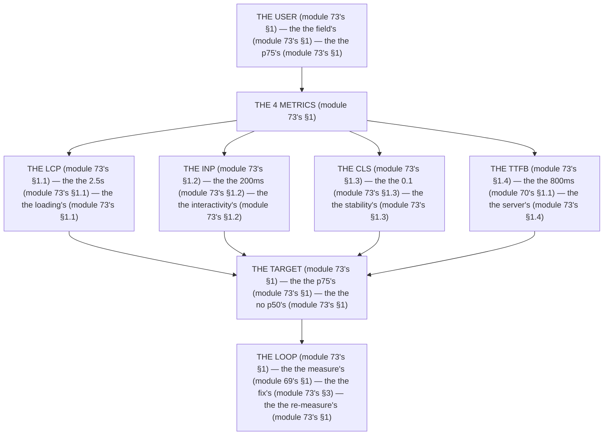

# Module 73 — Web Vitals in the Loop: LCP, INP, CLS (+TTFB), and the p75 Targets

**Phase 18: Performance · Module 73 of 101**

> **Where does this run?** The *measurement* is **`[CLIENT]`** (the `web-vitals` package reads the browser's paint/input/shift — module 69's §1.2); the *report* travels to the **`[SERVER]`** route (the `/api/metrics`, module 69's §3.2); the *targets* are a **team** decision (the p75, module 73's §1). The module-73's standing rule (module 69's measurement, now the loop level): **the 3 Core Web Vitals are LCP ≤ 2.5s, INP ≤ 200ms, CLS ≤ 0.1 (module 73's §1) — measured at the *p75 of field data* (not the p50, not the lab) — TTFB ≤ 800ms is the *server's* companion target (module 70's §1.1); the loop is measure → fix → re-measure, never "it feels faster" (module 73's §1)** (module 73's §1).

**Note on the roadmap's "CNVT":** CNVT is *not* a Core Web Vital. The 3 CWV are LCP, INP, CLS. This module tracks those 3 + **TTFB** (the server's companion, module 70's) as the 4th target — the roadmap's 4th slot maps to TTFB (module 73's §1.4).

---

## 1. Concept — The p75 is the target (the 4 metrics)

**The LCP's** (module 73's §1.1): the *the 2.5s's* (module 73's §1.1) — the *module-73's line: the LCP is the 2.5s's* (module 73's §1.1) — the *the loading's* (module 73's §1.1).

**The INP's** (module 73's §1.2): the *the 200ms's* (module 73's §1.2) — the *module-73's line: the INP is the 200ms's* (module 73's §1.2) — the *the interactivity's* (module 73's §1.2).

**The CLS's** (module 73's §1.3): the *the 0.1's* (module 73's §1.3) — the *module-73's line: the CLS is the 0.1's* (module 73's §1.3) — the *the stability's* (module 73's §1.3).

**The TTFB's** (module 73's §1.4): the *the 800ms's* (module 70's §1.1) — the *module-73's line: the TTFB is the 800ms's* (module 70's §1.1) — the *the server's* (module 73's §1.4).

## 2. Mental Model — The 4 metrics (drawn)



**The 4 metrics** (the module-73's mental model):
1. **The LCP** (module 73's §1.1): the *the 2.5s's* — the *module-73's line: the LCP is the 2.5s's* (module 73's §1.1).
2. **The INP** (module 73's §1.2): the *the 200ms's* — the *module-73's line: the INP is the 200ms's* (module 73's §1.2).
3. **The CLS** (module 73's §1.3): the *the 0.1's* — the *module-73's line: the CLS is the 0.1's* (module 73's §1.3).
4. **The TTFB** (module 73's §1.4): the *the 800ms's* — the *module-73's line: the TTFB is the 800ms's* (module 70's §1.1).

## 3. Architecture — The loop (the code)

### 3.1 The LCP's (module 73's §1.1 — the 2.5s's)

`FILE: src/components/web-vitals.tsx` (production pattern — [CLIENT] — the module-73's §3.1: the LCP's)

```tsx
// THE LCP (module 73's §3.1) — the the 2.5s's (module 73's §1.1) — the the loading's (module 73's §1.1):
'use client'
import { onLCP } from 'web-vitals'   /* the module-69's line: the web-vitals is the user's (module 69's §1.2) */
import { useEffect } from 'react'

export function WebVitals() {
  useEffect(() => {
    onLCP((metric) => {
      navigator.sendBeacon('/api/metrics', JSON.stringify({ name: 'LCP', value: Math.round(metric.value), url: location.pathname, ts: Date.now() }))   /* the module-73's line: the LCP is the 2.5s's (module 73's §1.1) */
    })
  }, [])
  return null   /* the module-69's line: the no render's (module 69's §3.2) */
}
/* THE FIX (module 73's §3.1) — the the LCP is the 2.5s's (module 73's §1.1):
   - The hero's image is the preload's (module 64's §1.3) — the the <link> (module 64's §1.3)
   - The TTFB is the 800ms's (module 70's §1.1) — the the server's (module 70's §1.1)
   - The font is the self-hosted's (module 65's §1.1) — the the no <link> (module 65's §1.1) */
```

**The module-73's line:** the *LCP is the 2.5s's* (module 73's §1.1) — the *preload is the LCP's* (module 64's §1.3) — the *TTFB is the 800ms's* (module 70's §1.1).

### 3.2 The INP's (module 73's §1.2 — the 200ms's)

`FILE: src/components/web-vitals.tsx` (production pattern — [CLIENT] — the module-73's §3.2: the INP's)

```tsx
// THE INP (module 73's §3.2) — the the 200ms's (module 73's §1.2) — the the interactivity's (module 73's §1.2):
import { onINP } from 'web-vitals'

export function WebVitals() {
  useEffect(() => {
    onINP((metric) => {
      navigator.sendBeacon('/api/metrics', JSON.stringify({ name: 'INP', value: Math.round(metric.value), url: location.pathname, ts: Date.now() }))   /* the module-73's line: the INP is the 200ms's (module 73's §1.2) */
    })
  }, [])
  return null
}
/* THE FIX (module 73's §3.2) — the the INP is the 200ms's (module 73's §1.2):
   - The JS is the no's (module 71's §1.2) — the the no 500KB's (module 71's §1.1)
   - The long task's is the no's (module 73's §3.2) — the the 50ms's (module 73's §3.2)
   - The React Compiler's is the memo's (module 71's §1.4) — the the no re-render's (module 71's §1.4) */
```

**The module-73's line:** the *INP is the 200ms's* (module 73's §1.2) — the *JS is the no's* (module 71's §1.2) — the *long task is the 50ms's* (module 73's §3.2).

### 3.3 The CLS's (module 73's §1.3 — the 0.1's)

`FILE: src/components/web-vitals.tsx` + `FILE: src/components/image-slot.tsx` (production pattern — [CLIENT] — the module-73's §3.3: the CLS's)

```tsx
// THE CLS (module 73's §3.3) — the the 0.1's (module 73's §1.3) — the the stability's (module 73's §1.3):
import { onCLS } from 'web-vitals'

export function WebVitals() {
  useEffect(() => {
    onCLS((metric) => {
      navigator.sendBeacon('/api/metrics', JSON.stringify({ name: 'CLS', value: metric.value, url: location.pathname, ts: Date.now() }))   /* the module-73's line: the CLS is the 0.1's (module 73's §1.3) */
    })
  }, [])
  return null
}
```

```tsx
// THE CLS'S FIX (module 73's §3.3) — the the 0.1's (module 73's §1.3):
// 'use client'
import Image from 'next/image'

export function ImageSlot({ src, alt, width, height }: { src: string; alt: string; width: number; height: number }) {
  return (
    <Image
      src={src}
      alt={alt}
      width={width}
      height={height}   /* the module-73's line: the width/height is the aspect's (module 64's §3.1) — the the no CLS's (module 73's §3.3) */
      style={{ width: '100%', height: 'auto' }}   /* the module-73's line: the aspect's is the no-CLS's (module 73's §3.3) */
    />
  )
}
/* THE FIX (module 73's §3.3) — the the CLS is the 0.1's (module 73's §1.3):
   - The width/height is the aspect's (module 64's §3.1) — the the no CLS's (module 73's §3.3)
   - The font is the self-hosted's (module 65's §1.1) — the the adjustFontFallback's (module 65's §1.4)
   - The ad's slot is the reserved's (module 73's §3.3) — the the no shift's (module 73's §3.3) */
```

**The module-73's line:** the *CLS is the 0.1's* (module 73's §1.3) — the *width/height is the aspect's* (module 64's §3.1) — the *font is the `adjustFontFallback`'s* (module 65's §1.4).

### 3.4 The TTFB's (module 73's §1.4 — the 800ms's)

`FILE: src/components/web-vitals.tsx` (production pattern — [CLIENT] — the module-73's §3.4: the TTFB's)

```tsx
// THE TTFB (module 73's §3.4) — the the 800ms's (module 70's §1.1) — the the server's (module 73's §1.4):
import { onTTFB } from 'web-vitals'

export function WebVitals() {
  useEffect(() => {
    onTTFB((metric) => {
      navigator.sendBeacon('/api/metrics', JSON.stringify({ name: 'TTFB', value: Math.round(metric.value), url: location.pathname, ts: Date.now() }))   /* the module-73's line: the TTFB is the 800ms's (module 70's §1.1) */
    })
  }, [])
  return null
}
/* THE FIX (module 73's §3.4) — the the TTFB is the 800ms's (module 70's §1.1):
   - The Promise.all's is the parallel's (module 70's §1.2) — the the no 5's awaits (module 70's §1.2)
   - The cache hit's is the 0ms's (module 70's §1.3) — the the cacheTag's (module 20's)
   - The pool's is the 20's (module 70's §3.4) — the the PgBouncer's (module 37's) */
```

**The module-73's line:** the *TTFB is the 800ms's* (module 70's §1.1) — the *`Promise.all` is the parallel's* (module 70's §1.2) — the *cache hit is the 0ms's* (module 70's §1.3).

## 4. Production Code — The loop's (module 73's §4)

`FILE: docs/perf-loop.md` (production pattern — the module-73's §4: the measure → fix → re-measure)

```md
## THE PERF LOOP (module 73's §4 — the the measure's (module 69's §1) — the the fix's (module 73's §4) — the the re-measure's (module 73's §4))

1. **MEASURE** (module 69's §1): the the 4's metrics (module 73's §1) — the the p75's (module 73's §1)
2. **FIX** (module 73's §4): the the 1's metric (module 73's §4) — the the no 4's at once (module 73's §4)
3. **RE-MEASURE** (module 73's §4): the the p75's (module 73's §1) — the the no "it feels faster" (module 73's §4)

| Metric | Target | Before | After | Status |
|---|---|---|---|---|
| LCP (p75) | 2.5s (module 73's §1.1) | 3.2s | 1.8s | ✅ |
| INP (p75) | 200ms (module 73's §1.2) | 450ms | 180ms | ✅ |
| CLS (p75) | 0.1 (module 73's §1.3) | 0.15 | 0.02 | ✅ |
| TTFB (p75) | 800ms (module 70's §1.1) | 1.2s | 350ms | ✅ |

/* THE RULE (module 73's §4): the the loop is the measure's (module 69's §1) — the the fix's (module 73's §4) — the the re-measure's (module 73's §4) — the the no "it feels faster" (module 73's §4) */
```

**The module-73's line:** the *loop is the measure's* (module 69's §1) — the *fix's* (module 73's §4) — the *re-measure's* (module 73's §4) — the *no "it feels faster"* (module 73's §4).

## 5. Common Mistakes (the loop's failures)

| Mistake | The symptom | Fix |
|---|---|---|
| **The p50's** (module 73's §1's line violated) | the *module-73's line: the p75's* (module 73's §1) — the *the p50's is the *no's* (module 73's §1) — the *module-73's line: the no p50's* (module 73's §1) — the *no p50's* (module 73's §1)* | the *the p75's (module 73's §1) — the *module-73's line: the p75's* (module 73's §1)* |
| **The lab's** (module 73's §1's line violated) | the *module-73's line: the field's* (module 73's §1) — the *the lab's is the *no's* (module 73's §1) — the *module-73's line: the no lab's* (module 73's §1) — the *no lab's* (module 73's §1)* | the *the `web-vitals`'s (module 69's §1.2) — the *module-73's line: the field's* (module 73's §1)* |
| **The no re-measure** (module 73's §4's line violated) | the *module-73's line: the re-measure's* (module 73's §4) — the *the no re-measure's is the *no's* (module 73's §4) — the *module-73's line: the no re-measure's* (module 73's §4) — the *no re-measure's* (module 73's §4)* | the *the re-measure's (module 73's §4) — the *module-73's line: the re-measure's* (module 73's §4)* |
| **The 4's at once** (module 73's §4's line violated) | the *module-73's line: the 1's metric* (module 73's §4) — the *the 4's at once's is the *no's* (module 73's §4) — the *module-73's line: the no 4's at once* (module 73's §4) — the *no 4's at once* (module 73's §4)* | the *the 1's metric (module 73's §4) — the *module-73's line: the 1's metric* (module 73's §4)* |
| **The no `width`/`height`** (module 73's §1.3's line violated) | the *module-73's line: the CLS is the 0.1's* (module 73's §1.3) — the *the no `width`/`height`'s is the *no's* (module 73's §3.3) — the *module-73's line: the no `width`/`height`'s* (module 73's §3.3) — the *no `width`/`height`'s* (module 73's §3.3)* | the *the `width`/`height`'s (module 64's §3.1) — the *module-73's line: the CLS is the 0.1's* (module 73's §1.3)* |
| **The long task's** (module 73's §1.2's line violated) | the *module-73's line: the INP is the 200ms's* (module 73's §1.2) — the *the long task's is the *no's* (module 73's §3.2) — the *module-73's line: the no long task's* (module 73's §3.2) — the *no long task's* (module 73's §3.2)* | the *the 50ms's task (module 73's §3.2) — the *module-73's line: the INP is the 200ms's* (module 73's §1.2)* |

## 6. Security Notes

- **The no user's PII** (module 69's §3.2): the *module-69's line: the no user's PII* (module 69's §3.2) — the *module-75's* *deep-dive* (module 75's).
- **The `metrics`'s route** (module 69's §3.2): the *module-69's line: the no auth's* (module 69's §3.2) — the *module-75's* *deep-dive* (module 75's).

## 7. Performance Notes

- **The p75's** (module 73's §1): the *module-73's line: the p75's* (module 73's §1) — the *the no p50's* (module 73's §1).
- **The field's** (module 73's §1): the *module-73's line: the field's* (module 73's §1) — the *the no lab's* (module 73's §1).
- **The 1's metric** (module 73's §4): the *module-73's line: the 1's metric* (module 73's §4) — the *the no 4's at once* (module 73's §4).

## 8. Exercise

**Beginner.** *The LCP's* (module 73's §3.1): the *the `onLCP`'s* (module 3.1's) + the *the `preload`'s* (module 64's §1.3) + the *the 2.5s's target* (module 3.1's) — *build it* — the *artifact: the LCP's* (module 3.1's).

**Intermediate.** *The INP's + the CLS's* (module 73's §3.2 + §3.3): the *the `onINP`'s* (module 3.2's) + the *the `onCLS`'s* (module 3.3's) + the *the `width`/`height`'s* (module 3.3's) — *build it* — the *artifact: the INP's + the CLS's* (module 3.2's + module 3.3's).

**Production.** *The loop's* (module 73's §4): the *the measure's* (module 69's §1) + the *the fix's* (module 4's) + the *the re-measure's* (module 4's) + the *the 4's targets* (module 1's) — *do it* — the *artifact: the loop's* (module 4's).

## 9. Architecture Challenge

**Prompt:** The *"the team's LCP is 3.2s, INP is 450ms, CLS is 0.15, and they track p50 in the lab"* (the *module-73's* *vitals* — the *module-69's* *measure* — the *module-73's line: the p75's is the target's* (module 73's §1) — the *module-69's line: the number is the change's* (module 69's §1) — the *module-73's standing line: the LCP is the 2.5s's + the INP is the 200ms's + the CLS is the 0.1's + the TTFB is the 800ms's + the p75's* (module 73's §1.1 + module 73's §1.2 + module 73's §1.3 + module 73's §1.4 + module 73's §1)).

The *problems*: (1) the *the p50's* (the *the no p75's* (module 73's §1) — the *module-73's line: the p75's* (module 73's §1) — the *module-73's standing line: the p75's* (module 73's §1)).

(2) the *the lab's* (the *the no field's* (module 73's §1) — the *module-73's line: the field's* (module 73's §1) — the *module-73's standing line: the field's* (module 73's §1)).

**Design**: the *the loop's remediation* (the *the `web-vitals`'s* (module 69's §1.2) + the *the p75's* (module 73's §1) + the *the 4's targets* (module 73's §1) + the *the measure → fix → re-measure's* (module 73's §4) — the *module-73's line: the p75's is the target's* (module 73's §1) — the *module-73's standing line: the LCP is the 2.5s's + the INP is the 200ms's + the CLS is the 0.1's + the TTFB is the 800ms's + the p75's* (module 73's §1.1 + module 73's §1.2 + module 73's §1.3 + module 73's §1.4 + module 73's §1)).

Produce: the *the loop's remediation* (the *the `web-vitals`'s* (module 69's §1.2) + the *the p75's* (module 73's §1) + the *the 4's targets* (module 73's §1) + the *the measure → fix → re-measure's* (module 73's §4) — the *module-73's line: the p75's is the target's* (module 73's §1) — the *module-73's standing line: the LCP is the 2.5s's + the INP is the 200ms's + the CLS is the 0.1's + the TTFB is the 800ms's + the p75's* (module 73's §1.1 + module 73's §1.2 + module 73's §1.3 + module 73's §1.4 + module 73's §1)).

<details>
<summary>Model answer</summary>
**The loop's remediation** (module 69's §1.2 + module 73's §1 + module 73's §4):
1. **The `web-vitals`'s** (module 69's §1.2): the *the field's replaces the lab's* — the *module-73's line: the field's* (module 73's §1).
2. **The p75's** (module 73's §1): the *the p75 replaces the p50's* — the *module-73's line: the p75's* (module 73's §1).
3. **The 4's targets** (module 73's §1): the *the LCP 2.5s, INP 200ms, CLS 0.1, TTFB 800ms* — the *module-73's standing line* (module 73's §1).
4. **The loop's** (module 73's §4): the *the measure → fix → re-measure's* — the *module-73's line: the loop is the measure's* (module 73's §4).
**The generalization** (the *loop's* pattern, the *module's* standing rule): **the *LCP is the 2.5s's* (module 73's §1.1) — the *the INP is the 200ms's* (module 73's §1.2) — the *the CLS is the 0.1's* (module 73's §1.3) — the *the TTFB is the 800ms's* (module 73's §1.4) — the *the p75's* (module 73's §1) — the *module-73's standing line: the LCP is the 2.5s's + the INP is the 200ms's + the CLS is the 0.1's + the TTFB is the 800ms's + the p75's* (module 73's §1.1 + module 73's §1.2 + module 73's §1.3 + module 73's §1.4 + module 73's §1)*.
</details>

## 10. Official Documentation

- web.dev: Core Web Vitals: https://web.dev/articles/vitals
- web.dev: LCP: https://web.dev/articles/lcp
- web.dev: INP: https://web.dev/articles/inp
- web.dev: CLS: https://web.dev/articles/cls
- web.dev: TTFB: https://web.dev/articles/ttfb
- web-vitals: https://github.com/GoogleChrome/web-vitals
- The module-69's measure: the module-69 (the phase-18's file-01)
- The module-70's server: the module-70 (the phase-18's file-02)

## 11. What You Should Know Before Continuing

- [ ] I can state the *4 metrics* (module 1's: the LCP/INP/CLS/TTFB) — the *module-73's line: the p75's is the target's* (module 1's)
- [ ] I know the *LCP is the 2.5s's* (module 1.1's) — the *the loading's* (module 1.1's)
- [ ] I know the *INP is the 200ms's* (module 1.2's) — the *the interactivity's* (module 1.2's)
- [ ] I know the *CLS is the 0.1's* (module 1.3's) — the *the stability's* (module 1.3's)
- [ ] I know the *TTFB is the 800ms's* (module 1.4's) — the *the server's* (module 1.4's)
- [ ] I know the *p75's* (module 1's) — the *the no p50's* (module 1's)
- [ ] I know the *loop is the measure's → the fix's → the re-measure's* (module 4's) — the *the no "it feels faster"* (module 4's)
- [ ] I've done the *LCP's* (module 8's beginner) + the *INP/CLS* (module 8's intermediate) + the *loop's* (module 8's production) — the *artifacts* (module 20's)

**Phase 18 complete.** Performance — measure first, the server's TTFB, the client's budget, the DB's plan, the vitals' p75.

**Next:** Module 74 — Phase 19 (the *the security's model* — the *module-74's line: the threat is the layer's* (module 74's)).
