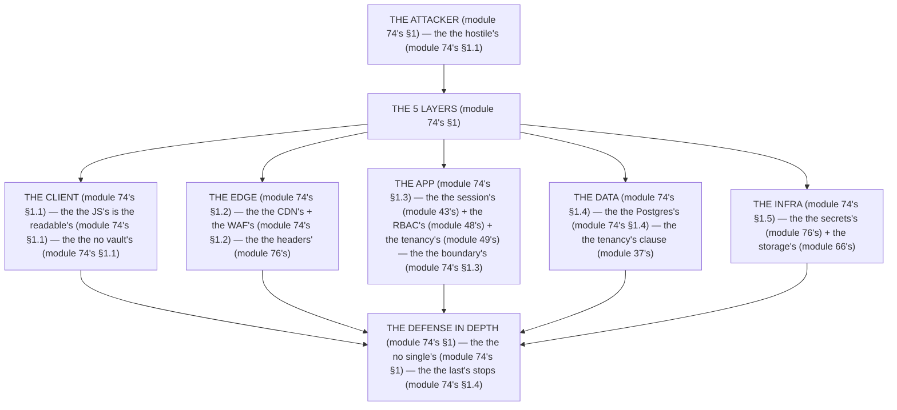

# Module 74 — The Security Model: Every Threat Maps to a Layer

**Phase 19: Security · Module 74 of 101**

> **Where does this run?** The model is **`[BOTH]`** (the client is *hostile*, the server is the *trust boundary*, the DB is the *last line* — module 74's §1); the *enforcement* is **`[SERVER]`** (the session, the RBAC, the tenancy clause — modules 43/48/49's). The module-74's standing rule (module 48's 2-gate + module 49's tenancy, now the model level): **the browser is not a vault (module 74's §1) — anything a user can *see* or *type* can be *read* or *typed by an attacker*; the server is the *only* trust boundary (module 74's §1); and *defense in depth* means the DB stops the attack even if the app fails (module 74's §1)** (module 74's §1).

---

## 1. Concept — The browser is not a vault (the 5 layers)

**The client's** (module 74's §1.1): the *the hostile's* (module 74's §1.1) — the *module-74's line: the client is the hostile's* (module 74's §1.1) — the *the no vault's* (module 74's §1.1).

**The edge's** (module 74's §1.2): the *the CDN's* + the *the WAF's* (module 74's §1.2) — the *module-74's line: the edge is the first's* (module 74's §1.2) — the *module-76's line: the headers are the edge's* (module 76's).

**The app's** (module 74's §1.3): the *the Next's server's* (module 74's §1.3) — the *module-74's line: the app is the boundary's* (module 74's §1.3) — the *module-48's line: the 2-gate is the 401→403's* (module 48's).

**The data's** (module 74's §1.4): the *the Postgres's* (module 74's §1.4) — the *module-74's line: the data is the last's* (module 74's §1.4) — the *module-37's line: the tenancy is the first's* (module 37's).

**The infra's** (module 74's §1.5): the *the secrets's* + the *the storage's* (module 74's §1.5) — the *module-74's line: the infra is the secrets's* (module 74's §1.5) — the *module-76's line: the env is the no-leak's* (module 76's).

## 2. Mental Model — The 5 layers (drawn)



**The 5 layers** (the module-74's mental model):
1. **The client** (module 74's §1.1): the *the hostile's* — the *module-74's line: the client is the hostile's* (module 74's §1.1).
2. **The edge** (module 74's §1.2): the *the first's* — the *module-74's line: the edge is the first's* (module 74's §1.2).
3. **The app** (module 74's §1.3): the *the boundary's* — the *module-74's line: the app is the boundary's* (module 74's §1.3).
4. **The data** (module 74's §1.4): the *the last's* — the *module-74's line: the data is the last's* (module 74's §1.4).
5. **The infra** (module 74's §1.5): the *the secrets's* — the *module-74's line: the infra is the secrets's* (module 74's §1.5).

## 3. Architecture — The threat → layer's map (the table)

`FILE: docs/threat-layer-map.md` (production pattern — the module-74's §3: the map's)

```md
## THE THREAT → LAYER'S MAP (module 74's §3 — the the map's (module 74's §3))

| Threat (module 75's) | Primary layer (module 74's §1) | Defense (module 74's §3) | Last line (module 74's §1.4) |
|---|---|---|---|
| XSS (module 75's §1.1) | The app (module 74's §1.3) | The no `dangerouslySetInnerHTML`'s (module 75's) + the CSP's (module 76's) | The no `eval`'s (module 75's §1.1) |
| CSRF (module 75's §1.2) | The app (module 74's §1.3) | The cookie's `SameSite=Lax` (module 43's) + the `Content-Type`'s check (module 75's §1.2) | The action's re-check (module 29's) |
| SSRF (module 75's §1.3) | The app (module 74's §1.3) | The no user's URL (module 75's §1.3) + the allowlist (module 75's §1.3) | The no egress's (module 74's §1.5) |
| CORS (module 75's §1.4) | The edge (module 74's §1.2) | The no `*`'s (module 75's §1.4) + the origin's check (module 75's §1.4) | The no CORS on the API's (module 34's) |
| SQLi (module 75's §1.5) | The app (module 74's §1.3) | The Drizzle's param's (module 5's) + the no raw's (module 75's §1.5) | The least's privilege (module 74's §1.4) |
| Open redirect (module 75's §1.6) | The app (module 74's §1.3) | The no user's redirect (module 75's §1.6) + the allowlist (module 75's §1.6) | The no `redirect`'s with the user's (module 75's §1.6) |
| IDOR (module 75's §1.7) | The app (module 74's §1.3) | The orgId's re-check (module 49's) + the RBAC's (module 48's) | The tenancy's clause (module 37's) |
| Auth attacks (module 75's §1.8) | The app (module 74's §1.3) | The session's pointer (module 43's) + the no localStorage's (module 43's §5) | The session's revoke (module 45's) |
| Upload abuse (module 75's §1.9) | The app (module 74's §1.3) | The size/MIME/magic's (module 66's) + the no `public/`'s (module 66's) | The storage's ACL (module 74's §1.5) |

/* THE RULE (module 74's §3): the the threat is the layer's (module 74's §3) — the the defense is the primary's (module 74's §3) — the the last's is the data's (module 74's §1.4) */
```

**The module-74's line:** the *threat is the layer's* (module 74's §3) — the *defense is the primary's* (module 74's §3) — the *last is the data's* (module 74's §1.4).

## 4. Production Code — The defense in depth (module 74's §4)

`FILE: src/lib/defense.ts` (production pattern — [SERVER] — the module-74's §4: the 3 checks)

```ts
// THE DEFENSE IN DEPTH (module 74's §4) — the the no single's (module 74's §1) — the the last's stops (module 74's §1.4):
import { AppError } from '@/lib/errors'   /* the module-5's line: the AppError's (module 5's) */

export function assertOrgMember(sessionUserId: string, orgId: string, memberRole: string | null) {
  /* CHECK 1: THE APP (module 74's §1.3) — the the session's (module 43's): */
  if (!memberRole) throw new AppError('NOT_FOUND', 404)   /* the module-49's line: the 404's no-leak (module 49's) */

  /* CHECK 2: THE APP (module 74's §1.3) — the the RBAC's (module 48's):
     requirePermission(session, 'orders:read')   (module 48's) */

  /* CHECK 3: THE DATA (module 74's §1.4) — the the tenancy's (module 37's):
     The service's WHERE always includes eq(products.orgId, orgId) (module 37's) — the the no bypass (module 74's §1.4) */
}
/* THE RULE (module 74's §4): the the no single's (module 74's §1) — the the last's stops (module 74's §1.4) — the the 3 checks (module 74's §4) */
```

**The module-74's line:** the *no single's* (module 74's §1) — the *last is the data's* (module 74's §1.4) — the *3 checks* (module 74's §4).

## 5. Common Mistakes (the model's failures)

| Mistake | The symptom | Fix |
|---|---|---|
| **The client's vault** (module 74's §1.1's line violated) | the *module-74's line: the client is the hostile's* (module 74's §1.1) — the *the client's vault's is the *no's* (module 74's §1.1) — the *module-74's line: the no vault's* (module 74's §1.1) — the *no vault's* (module 74's §1.1)* | the *the server's (module 74's §1.3) — the *module-74's line: the app is the boundary's* (module 74's §1.3)* |
| **The single's layer** (module 74's §1's line violated) | the *module-74's line: the no single's* (module 74's §1) — the *the single's layer's is the *no's* (module 74's §1) — the *module-74's line: the no single's* (module 74's §1) — the *no single's* (module 74's §1)* | the *the defense in depth's (module 74's §4) — the *module-74's line: the no single's* (module 74's §1)* |
| **The no last's** (module 74's §1.4's line violated) | the *module-74's line: the data is the last's* (module 74's §1.4) — the *the no last's is the *no's* (module 74's §1.4) — the *module-74's line: the no last's* (module 74's §1.4) — the *no last's* (module 74's §1.4)* | the *the tenancy's clause (module 37's) — the *module-74's line: the data is the last's* (module 74's §1.4)* |
| **The no secret's leak** (module 74's §1.5's line violated) | the *module-74's line: the infra is the secrets's* (module 74's §1.5) — the *the no secret's leak's is the *no's* (module 74's §1.5) — the *module-74's line: the no secret's leak* (module 74's §1.5) — the *no secret's leak* (module 74's §1.5)* | the *the env's no-leak's (module 76's) — the *module-74's line: the infra is the secrets's* (module 74's §1.5)* |
| **The edge's only** (module 74's §1.2's line violated) | the *module-74's line: the app is the boundary's* (module 74's §1.3) — the *the edge's only's is the *no's* (module 74's §1.2) — the *module-74's line: the no edge's only* (module 74's §1.2) — the *no edge's only* (module 74's §1.2)* | the *the app's (module 74's §1.3) — the *module-74's line: the app is the boundary's* (module 74's §1.3)* |
| **The no threat's map** (module 74's §3's line violated) | the *module-74's line: the threat is the layer's* (module 74's §3) — the *the no threat's map's is the *no's* (module 74's §3) — the *module-74's line: the no threat's map* (module 74's §3) — the *no threat's map* (module 74's §3)* | the *the map's (module 74's §3) — the *module-74's line: the threat is the layer's* (module 74's §3)* |

## 6. Security Notes

- **The client's hostile** (module 74's §1.1): the *module-74's line: the client is the hostile's* (module 74's §1.1) — the *module-75's* *deep-dive* (module 75's).
- **The last's** (module 74's §1.4): the *module-74's line: the data is the last's* (module 74's §1.4) — the *module-37's* *deep-dive* (module 37's).
- **The secrets's** (module 74's §1.5): the *module-74's line: the infra is the secrets's* (module 74's §1.5) — the *module-76's* *deep-dive* (module 76's).

## 7. Performance Notes

- **The edge's** (module 74's §1.2): the *module-74's line: the edge is the first's* (module 74's §1.2) — the *the no app's cost* (module 74's §1.2).
- **The last's** (module 74's §1.4): the *module-74's line: the data is the last's* (module 74's §1.4) — the *the index's cost* (module 72's §1.2).
- **The no single's** (module 74's §1): the *module-74's line: the no single's* (module 74's §1) — the *the 3's checks' cost* (module 74's §4).

## 8. Exercise

**Beginner.** *The threat's map* (module 74's §3): the *the 9's threats* (module 3's) + the *the 5's layers* (module 1's) — *build the table* — the *artifact: the map's* (module 3's).

**Intermediate.** *The defense in depth's* (module 74's §4): the *the 3's checks* (module 4's) + the *the tenancy's clause* (module 37's) — *build it* — the *artifact: the defense's* (module 4's).

**Production.** *The no single's* (module 74's §1): the *the 5's layers'* audit (module 1's) — *check each layer's failure mode* — the *artifact: the audit's* (module 1's).

## 9. Architecture Challenge

**Prompt:** The *"the team's security is one WAF and a `try/catch` in the action — no session re-check, no tenancy clause, and the secret is in `NEXT_PUBLIC_`"* (the *module-74's* *model* — the *module-75's* *attack* — the *module-74's line: the app is the boundary's* (module 74's §1.3) — the *module-76's line: the env is the no-leak's* (module 76's) — the *module-74's standing line: the client is the hostile's + the app is the boundary's + the data is the last's + the infra is the secrets's* (module 74's §1.1 + module 74's §1.3 + module 74's §1.4 + module 74's §1.5)).

The *problems*: (1) the *the no session's re-check* (the *the no boundary's* (module 74's §1.3) — the *module-74's line: the app is the boundary's* (module 74's §1.3) — the *module-74's standing line: the app is the boundary's* (module 74's §1.3)).

(2) the *the `NEXT_PUBLIC_`'s secret* (the *the no no-leak's* (module 76's) — the *module-74's line: the infra is the secrets's* (module 74's §1.5) — the *module-74's standing line: the infra is the secrets's* (module 74's §1.5)).

**Design**: the *the model's remediation* (the *the session's re-check* (module 43's) + the *the tenancy's clause* (module 37's) + the *the env's no-leak's* (module 76's) — the *module-74's line: the app is the boundary's* (module 74's §1.3) — the *module-74's standing line: the client is the hostile's + the app is the boundary's + the data is the last's + the infra is the secrets's* (module 74's §1.1 + module 74's §1.3 + module 74's §1.4 + module 74's §1.5)).

Produce: the *the model's remediation* (the *the session's re-check* (module 43's) + the *the tenancy's clause* (module 37's) + the *the env's no-leak's* (module 76's) — the *module-74's line: the app is the boundary's* (module 74's §1.3) — the *module-74's standing line: the client is the hostile's + the app is the boundary's + the data is the last's + the infra is the secrets's* (module 74's §1.1 + module 74's §1.3 + module 74's §1.4 + module 74's §1.5)).

<details>
<summary>Model answer</summary>
**The model's remediation** (module 43's + module 37's + module 76's):
1. **The session's re-check** (module 43's): the *the action re-reads the session* — the *module-74's line: the app is the boundary's* (module 74's §1.3).
2. **The tenancy's clause** (module 37's): the *the `WHERE org_id = ...` is the first's* — the *module-74's line: the data is the last's* (module 74's §1.4).
3. **The env's no-leak** (module 76's): the *the secret moves from `NEXT_PUBLIC_` to the server's* — the *module-74's line: the infra is the secrets's* (module 74's §1.5).
**The generalization** (the *model's* pattern, the *module's* standing rule): **the *client is the hostile's* (module 74's §1.1) — the *the app is the boundary's* (module 74's §1.3) — the *the data is the last's* (module 74's §1.4) — the *the infra is the secrets's* (module 74's §1.5) — the *module-74's standing line: the client is the hostile's + the app is the boundary's + the data is the last's + the infra is the secrets's* (module 74's §1.1 + module 74's §1.3 + module 74's §1.4 + module 74's §1.5)*.
</details>

## 10. Official Documentation

- OWASP Top 10: https://owasp.org/Top10/
- MDN: `SameSite`: https://developer.mozilla.org/en-US/docs/Web/HTTP/Headers/Set-Cookie#samesitesamesite-value
- Next.js: Security: https://nextjs.org/docs/app/guides/security
- The module-75's attack: the module-75 (the phase-19's file-02)
- The module-76's headers: the module-76 (the phase-19's file-03)

## 11. What You Should Know Before Continuing

- [ ] I can state the *5 layers* (module 1's: the client/edge/app/data/infra) — the *module-74's line: the threat is the layer's* (module 1's)
- [ ] I know the *client is the hostile's* (module 1.1's) — the *the no vault's* (module 1.1's)
- [ ] I know the *app is the boundary's* (module 1.3's) — the *the 2-gate's* (module 48's)
- [ ] I know the *data is the last's* (module 1.4's) — the *the tenancy's clause* (module 37's)
- [ ] I know the *infra is the secrets's* (module 1.5's) — the *the no-leak's* (module 76's)
- [ ] I know the *no single's* (module 1's) — the *the defense in depth's* (module 4's)
- [ ] I've done the *threat's map* (module 8's beginner) + the *defense in depth's* (module 8's intermediate) + the *no single's* (module 8's production) — the *artifacts* (module 20's)

**Next:** Module 75 — The Attack Surface (the *the 9's attacks* — the *module-75's line: the attack is the vector's* (module 75's)).
