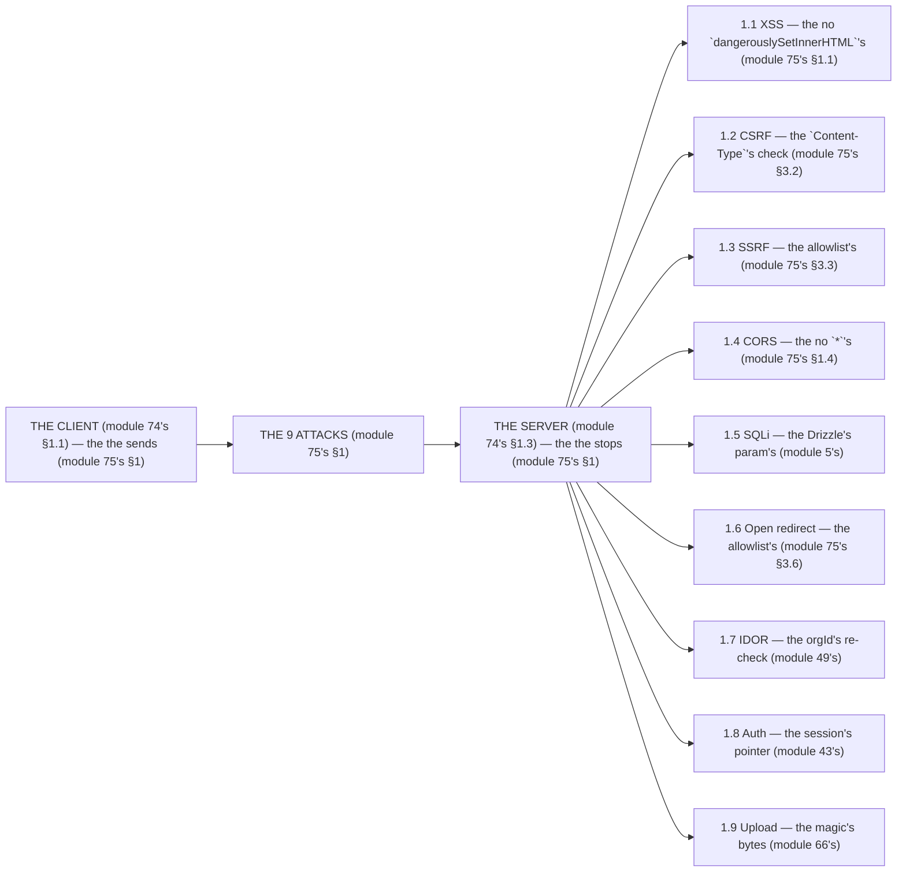

# Module 75 — The Attack Surface: 9 Attacks, Each with a Next.js-Specific Vector and Fix

**Phase 19: Security · Module 75 of 101**

> **Where does this run?** Every fix below is **`[SERVER]`** (the edge headers are `[SERVER]` config — module 76's); the *vector* is almost always **`[BOTH]`** (the client *sends* the attack, the server *stops* it). The module-75's standing rule (module 74's model, now the attack level): **the client *sends* the attack, the server *stops* it (module 75's §1) — every attack below has a *Next.js-specific vector* (module 75's §1), and every fix is a *server-side check* (module 75's §1), never a client-side `if` (module 74's §1.1)** (module 75's §1).

---

## 1. Concept — The 9 attacks (the table)

`FILE: docs/attack-surface.md` (production pattern — the module-75's §1: the table's)

```md
## THE 9 ATTACKS (module 75's §1 — the the vector's (module 75's §1) — the the fix's (module 75's §1))

| # | Attack | Next.js-specific vector (module 75's §1) | Fix (module 75's §1) | Last line (module 74's §1.4) |
|---|---|---|---|---|
| 1.1 | XSS | `dangerouslySetInnerHTML` with user content (module 62's JSON-LD is the DTO's — module 62's) | The no `dangerouslySetInnerHTML`'s (module 75's §1.1) + the CSP's (module 76's) | The no `eval`'s (module 75's §1.1) |
| 1.2 | CSRF | Server Action + cookie auto-send (module 29's) | The `Content-Type`'s check (module 75's §3.2) + the `SameSite=Lax`'s (module 43's) | The action's re-check (module 29's) |
| 1.3 | SSRF | Route Handler fetches the user's URL (`/api/fetch?url=`) (module 34's) | The no user's URL (module 75's §1.3) + the allowlist (module 75's §3.3) | The no egress's (module 74's §1.5) |
| 1.4 | CORS | `Access-Control-Allow-Origin: *` + credentials on the Route Handler (module 34's) | The no `*`'s (module 75's §1.4) + the no CORS on the BFF's (module 34's) | The origin's check (module 75's §1.4) |
| 1.5 | SQLi | Raw `sql` with interpolated *identifiers* (module 5's) | The Drizzle's param's (module 5's) + the no raw's (module 75's §1.5) | The least's privilege (module 74's §1.4) |
| 1.6 | Open redirect | `redirect(userInput)` after login/logout (module 29's) | The allowlist's (module 75's §3.6) + the no user's redirect (module 75's §1.6) | The no `redirect`'s with the user's (module 75's §1.6) |
| 1.7 | IDOR | The route's param's `?id=` without the orgId's re-check (module 49's) | The orgId's re-check (module 49's) + the RBAC's (module 48's) | The tenancy's clause (module 37's) |
| 1.8 | Auth attacks | The localStorage's token (module 43's §5's line violated) | The session's pointer (module 43's) + the no localStorage's (module 43's §5) | The session's revoke (module 45's) |
| 1.9 | Upload abuse | The `public/`'s upload (module 66's line violated) | The size/MIME/magic's (module 66's) + the no `public/`'s (module 66's) | The storage's ACL (module 74's §1.5) |

/* THE RULE (module 75's §1): the the client's sends (module 75's §1) — the the server's stops (module 75's §1) — the the no client's `if` (module 74's §1.1) */
```

## 2. Mental Model — The vector → the fix (drawn)



**The vector → the fix** (the module-75's mental model):
1. **The client's** (module 74's §1.1): the *the sends* — the *module-75's line: the client's sends* (module 75's §1).
2. **The server's** (module 74's §1.3): the *the stops* — the *module-75's line: the server's stops* (module 75's §1).

## 3. Architecture — The 9 fixes (the code)

### 3.1 XSS's (module 75's §1.1 — the no `dangerouslySetInnerHTML`'s)

`FILE: src/components/product-description.tsx` (production pattern — [BOTH] — the module-75's §3.1)

```tsx
// THE XSS'S FIX (module 75's §3.1) — the the no `dangerouslySetInnerHTML`'s (module 75's §1.1):
// 'use client'
import { useState } from 'react'

export function ProductDescription({ html }: { html: string }) {
  /* THE RIGHT (module 75's §3.1): the the React's auto-escape (module 75's §3.1) — the the no `dangerouslySetInnerHTML`'s (module 75's §1.1):
     return <div>{html}</div>   (module 75's §3.1) — the the no escape (module 75's §1.1) — the the no `dangerouslySetInnerHTML` (module 75's §1.1)
     /* THE WRONG (module 75's §3.1) — the the XSS's (module 75's §1.1):
     return <div dangerouslySetInnerHTML={{ __html: html }} />   (module 75's §3.1) — the the user's HTML (module 75's §1.1) */

  const [rendered, setRendered] = useState(false)
  if (!rendered) return <p>{html.slice(0, 120)}…</p>   /* the module-75's line: the text's (module 75's §3.1) */
  return <p>{html}</p>   /* the module-75's line: the text's (module 75's §3.1) — the the no `dangerouslySetInnerHTML`'s (module 75's §1.1) */
}
/* THE RULE (module 75's §3.1): the the no `dangerouslySetInnerHTML`'s (module 75's §1.1) — the the CSP's is the last's (module 76's) */
```

**The module-75's line:** the *no `dangerouslySetInnerHTML`* (module 75's §1.1) — the *CSP is the last's* (module 76's).

### 3.2 CSRF's (module 75's §1.2 — the `Content-Type`'s check)

`FILE: src/app/(org)/api/actions/order.ts` (production pattern — [SERVER] — the module-75's §3.2)

```ts
// 'use server'
import { headers } from 'next/headers'
import { AppError } from '@/lib/errors'   /* the module-5's line: the AppError's (module 5's) */

export async function createOrder(formData: FormData) {
  /* THE CSRF'S CHECK (module 75's §3.2) — the the `Content-Type`'s check (module 75's §1.2):
     A cross-origin `fetch` with `application/x-www-form-urlencoded` is the no CORS preflight's (module 75's §1.2)
     → The no content-type's check (module 75's §1.2) is the CSRF's (module 75's §1.2) */
  const contentType = (await headers()).get('content-type') ?? ''   /* the module-75's line: the content-type's (module 75's §3.2) */
  if (!contentType.includes('application/x-www-form-urlencoded')) throw new AppError('BAD_REQUEST', 400)   /* the module-75's line: the no content-type's (module 75's §1.2) */
  /* THE REST (module 29's): the the session's re-check (module 43's) + the orgId's (module 49's) */
}
/* THE RULE (module 75's §3.2): the the `Content-Type`'s check (module 75's §1.2) — the the `SameSite=Lax`'s (module 43's) — the the no content-type's (module 75's §1.2) */
```

**The module-75's line:** the *`Content-Type`'s check* (module 75's §1.2) — the *`SameSite=Lax`* (module 43's) — the *no content-type* (module 75's §1.2).

### 3.3 SSRF's (module 75's §1.3 — the allowlist's)

`FILE: src/app/api/webhooks/route.ts` (production pattern — [SERVER] — the module-75's §3.3)

```ts
import { NextRequest, NextResponse } from 'next/server'
import { AppError } from '@/lib/errors'   /* the module-5's line: the AppError's (module 5's) */

const ALLOWED_HOSTS = new Set(['api.stripe.com', 'notify.example.com'])   /* the module-75's line: the allowlist's (module 75's §1.3) */

export async function POST(req: NextRequest) {
  const { url } = (await req.json()) as { url: string }   /* the module-75's line: the url is the user's (module 75's §1.3) */
  const parsed = new URL(url)   /* the module-75's line: the URL's parse (module 75's §3.3) */
  if (parsed.protocol !== 'https:' || !ALLOWED_HOSTS.has(parsed.hostname)) throw new AppError('FORBIDDEN', 403)   /* the module-75's line: the no user's URL (module 75's §1.3) */
  const res = await fetch(url)   /* the module-75's line: the fetch is the allowlist's (module 75's §1.3) */
  return NextResponse.json({ ok: res.ok })
}
/* THE RULE (module 75's §3.3): the the no user's URL (module 75's §1.3) — the the allowlist's (module 75's §1.3) — the the no egress's (module 74's §1.5) */
```

**The module-75's line:** the *no user's URL* (module 75's §1.3) — the *allowlist's* (module 75's §1.3) — the *no egress's* (module 74's §1.5).

### 3.6 Open redirect's (module 75's §1.6 — the allowlist's)

`FILE: src/app/(auth)/login/actions.ts` (production pattern — [SERVER] — the module-75's §3.6)

```ts
// 'use server'
import { redirect } from 'next/navigation'
import { isSafeInternalPath } from '@/lib/safe-path'   /* the module-75's line: the allowlist's (module 75's §3.6) */

export function afterLogin(returnTo: string | null) {
  /* THE OPEN REDIRECT'S FIX (module 75's §3.6) — the the no user's redirect (module 75's §1.6):
     redirect(returnTo)   (module 75's §3.6) — the the user's URL (module 75's §1.6) — the the no allowlist (module 75's §1.6) */
  if (returnTo && isSafeInternalPath(returnTo)) redirect(returnTo)   /* the module-75's line: the allowlist's (module 75's §3.6) */
  redirect('/')   /* the module-75's line: the fallback is the '/' (module 75's §3.6) */
}

// THE ALLOWLIST (module 75's §3.6) — the the internal's path's (module 75's §3.6):
export function isSafeInternalPath(path: string) {
  return path.startsWith('/') && !path.startsWith('//') && !path.includes('\\')   /* the module-75's line: the no `//` (module 75's §3.6) */
}
/* THE RULE (module 75's §3.6): the the no user's redirect (module 75's §1.6) — the the allowlist's (module 75's §3.6) */
```

**The module-75's line:** the *no user's redirect* (module 75's §1.6) — the *allowlist's* (module 75's §3.6) — the *no `//`* (module 75's §3.6).

## 4. Production Code — The no client's `if` (module 75's §4)

`FILE: src/lib/checks.ts` (production pattern — [SERVER] — the module-75's §4: the 5 checks)

```ts
// THE NO CLIENT'S `if` (module 75's §4) — the the server's stops (module 75's §1) — the the no client's `if` (module 74's §1.1):
/* CHECK 1 (module 75's §1.1): the the no `dangerouslySetInnerHTML`'s (module 75's §1.1)
   CHECK 2 (module 75's §1.2): the the `Content-Type`'s check (module 75's §1.2)
   CHECK 3 (module 75's §1.3): the the allowlist's (module 75's §1.3)
   CHECK 4 (module 75's §1.6): the the no user's redirect (module 75's §1.6)
   CHECK 5 (module 75's §1.7): the the orgId's re-check (module 49's) */
/* THE RULE (module 75's §4): the the no client's `if` (module 74's §1.1) — the the 5's checks (module 75's §4) */
```

**The module-75's line:** the *no client's `if`* (module 74's §1.1) — the *5's checks* (module 75's §4).

## 5. Common Mistakes (the attack's failures)

| Mistake | The symptom | Fix |
|---|---|---|
| **The `dangerouslySetInnerHTML`'s** (module 75's §1.1's line violated) | the *module-75's line: the no `dangerouslySetInnerHTML`'s* (module 75's §1.1) — the *the `dangerouslySetInnerHTML`'s is the *no's* (module 75's §1.1) — the *module-75's line: the no `dangerouslySetInnerHTML`'s* (module 75's §1.1) — the *no `dangerouslySetInnerHTML`'s* (module 75's §1.1)* | the *the text's (module 75's §3.1) — the *module-75's line: the no `dangerouslySetInnerHTML`'s* (module 75's §1.1)* |
| **The no `Content-Type`** (module 75's §1.2's line violated) | the *module-75's line: the `Content-Type`'s check* (module 75's §1.2) — the *the no `Content-Type`'s is the *no's* (module 75's §3.2) — the *module-75's line: the no `Content-Type`* (module 75's §3.2) — the *no `Content-Type`* (module 75's §3.2)* | the *the `Content-Type`'s check (module 75's §3.2) — the *module-75's line: the `Content-Type`'s check* (module 75's §1.2)* |
| **The user's URL** (module 75's §1.3's line violated) | the *module-75's line: the no user's URL* (module 75's §1.3) — the *the user's URL's is the *no's* (module 75's §3.3) — the *module-75's line: the no user's URL* (module 75's §1.3) — the *no user's URL* (module 75's §1.3)* | the *the allowlist's (module 75's §3.3) — the *module-75's line: the no user's URL* (module 75's §1.3)* |
| **The `*`'s CORS** (module 75's §1.4's line violated) | the *module-75's line: the no `*`'s* (module 75's §1.4) — the *the `*`'s CORS's is the *no's* (module 75's §1.4) — the *module-75's line: the no `*`'s* (module 75's §1.4) — the *no `*`'s* (module 75's §1.4)* | the *the no CORS on the BFF's (module 34's) — the *module-75's line: the no `*`'s* (module 75's §1.4)* |
| **The raw's SQL** (module 75's §1.5's line violated) | the *module-75's line: the Drizzle's param's* (module 5's) — the *the raw's SQL's is the *no's* (module 75's §1.5) — the *module-75's line: the no raw's* (module 75's §1.5) — the *no raw's* (module 75's §1.5)* | the *the Drizzle's (module 5's) — the *module-75's line: the Drizzle's param's* (module 5's)* |
| **The user's redirect** (module 75's §1.6's line violated) | the *module-75's line: the no user's redirect* (module 75's §1.6) — the *the user's redirect's is the *no's* (module 75's §3.6) — the *module-75's line: the no user's redirect* (module 75's §1.6) — the *no user's redirect* (module 75's §3.6)* | the *the allowlist's (module 75's §3.6) — the *module-75's line: the no user's redirect* (module 75's §1.6)* |

## 6. Security Notes

- **The no client's `if`** (module 74's §1.1): the *module-75's line: the server's stops* (module 75's §1) — the *module-74's* *deep-dive* (module 74's).
- **The last's** (module 74's §1.4): the *module-75's line: the last's is the data's* (module 74's §1.4) — the *module-37's* *deep-dive* (module 37's).
- **The edge's** (module 74's §1.2): the *module-75's line: the CSP's is the edge's* (module 76's) — the *module-76's* *deep-dive* (module 76's).

## 7. Performance Notes

- **The no `*`'s** (module 75's §1.4): the *module-75's line: the no CORS on the BFF's* (module 34's) — the *the no preflight's cost* (module 75's §1.4).
- **The allowlist's** (module 75's §1.3): the *module-75's line: the no user's URL* (module 75's §1.3) — the *the no SSRF's cost* (module 75's §1.3).
- **The 5's checks** (module 75's §4): the *module-75's line: the no client's `if`* (module 74's §1.1) — the *the 5's checks' cost* (module 75's §4).

## 8. Exercise

**Beginner.** *The XSS's + the open redirect's* (module 75's §3.1 + §3.6): the *the no `dangerouslySetInnerHTML`'s* (module 3.1's) + the *the allowlist's* (module 3.6's) — *build it* — the *artifact: the 2's fixes* (module 3.1's + module 3.6's).

**Intermediate.** *The CSRF's + the SSRF's* (module 75's §3.2 + §3.3): the *the `Content-Type`'s check* (module 3.2's) + the *the allowlist's* (module 3.3's) — *build it* — the *artifact: the 2's fixes* (module 3.2's + module 3.3's).

**Production.** *The 9's attacks'* audit (module 1's): the *the 9's vectors* (module 1's) + the *the 9's fixes* (module 3's) — *build the audit* — the *artifact: the audit's* (module 1's).

## 9. Architecture Challenge

**Prompt:** The *"the team's login does `redirect(returnTo)`, the webhook fetches the user's URL, and the description renders `dangerouslySetInnerHTML`"* (the *module-75's* *attack* — the *module-74's* *model* — the *module-75's line: the server's stops* (module 75's §1) — the *module-74's line: the app is the boundary's* (module 74's §1.3) — the *module-75's standing line: the client's sends + the server's stops + the no client's `if`* (module 75's §1 + module 74's §1.1)).

The *problems*: (1) the *the user's redirect* (the *the no allowlist's* (module 75's §1.6) — the *module-75's line: the no user's redirect* (module 75's §1.6) — the *module-75's standing line: the server's stops* (module 75's §1)).

(2) the *the user's URL* (the *the no allowlist's* (module 75's §1.3) — the *module-75's line: the no user's URL* (module 75's §1.3) — the *module-75's standing line: the server's stops* (module 75's §1)).

**Design**: the *the attack's remediation* (the *the allowlist's* (module 75's §3.6) + the *the allowlist's* (module 75's §3.3) + the *the no `dangerouslySetInnerHTML`'s* (module 75's §3.1) — the *module-75's line: the server's stops* (module 75's §1) — the *module-75's standing line: the client's sends + the server's stops + the no client's `if`* (module 75's §1 + module 74's §1.1)).

Produce: the *the attack's remediation* (the *the allowlist's* (module 75's §3.6) + the *the allowlist's* (module 75's §3.3) + the *the no `dangerouslySetInnerHTML`'s* (module 75's §3.1) — the *module-75's line: the server's stops* (module 75's §1) — the *module-75's standing line: the client's sends + the server's stops + the no client's `if`* (module 75's §1 + module 74's §1.1)).

<details>
<summary>Model answer</summary>
**The attack's remediation** (module 75's §3.6 + module 75's §3.3 + module 75's §3.1):
1. **The redirect's allowlist** (module 75's §3.6): the *the `isSafeInternalPath`'s replaces `redirect(returnTo)`* — the *module-75's line: the no user's redirect* (module 75's §1.6).
2. **The webhook's allowlist** (module 75's §3.3): the *the `ALLOWED_HOSTS`'s replaces the user's URL* — the *module-75's line: the no user's URL* (module 75's §1.3).
3. **The description's text** (module 75's §3.1): the *the `{html}`'s replaces `dangerouslySetInnerHTML`* — the *module-75's line: the no `dangerouslySetInnerHTML`'s* (module 75's §1.1).
**The generalization** (the *attack's* pattern, the *module's* standing rule): **the *client's sends* (module 75's §1) — the *the server's stops* (module 75's §1) — the *the no client's `if`* (module 74's §1.1) — the *module-75's standing line: the client's sends + the server's stops + the no client's `if`* (module 75's §1 + module 74's §1.1)*.
</details>

## 10. Official Documentation

- Next.js: Security: https://nextjs.org/docs/app/guides/security
- OWASP: XSS: https://owasp.org/www-community/attacks/xss/
- OWASP: CSRF: https://owasp.org/www-community/attacks/csrf
- OWASP: SSRF: https://owasp.org/www-community/attacks/Server_Side_Request_Forgery
- MDN: CORS: https://developer.mozilla.org/en-US/docs/Web/HTTP/CORS
- The module-74's model: the module-74 (the phase-19's file-01)
- The module-76's headers: the module-76 (the phase-19's file-03)

## 11. What You Should Know Before Continuing

- [ ] I can state the *9 attacks* (module 1's: the XSS/CSRF/SSRF/CORS/SQLi/open-redirect/IDOR/auth/upload) — the *module-75's line: the client's sends + the server's stops* (module 1's)
- [ ] I know the *no `dangerouslySetInnerHTML`'s* (module 1.1's) — the *the CSP's is the last's* (module 76's)
- [ ] I know the *`Content-Type`'s check* (module 1.2's) — the *the `SameSite=Lax`'s* (module 43's)
- [ ] I know the *no user's URL* (module 1.3's) — the *the allowlist's* (module 1.3's)
- [ ] I know the *no `*`'s CORS* (module 1.4's) — the *the no CORS on the BFF's* (module 34's)
- [ ] I know the *Drizzle's param's* (module 1.5's) — the *the no raw's* (module 1.5's)
- [ ] I know the *no user's redirect* (module 1.6's) — the *the allowlist's* (module 1.6's)
- [ ] I know the *orgId's re-check* (module 1.7's) — the *the tenancy's clause* (module 37's)
- [ ] I know the *session's pointer* (module 1.8's) — the *the no localStorage's* (module 43's §5)
- [ ] I know the *magic's bytes* (module 1.9's) — the *the no `public/`'s* (module 66's)
- [ ] I've done the *XSS/open-redirect* (module 8's beginner) + the *CSRF/SSRF* (module 8's intermediate) + the *9's audit* (module 8's production) — the *artifacts* (module 20's)

**Next:** Module 76 — Headers, CSP & Env (the *the headers' + the CSP's + the env's* — the *module-76's line: the header is the edge's* (module 76's)).
