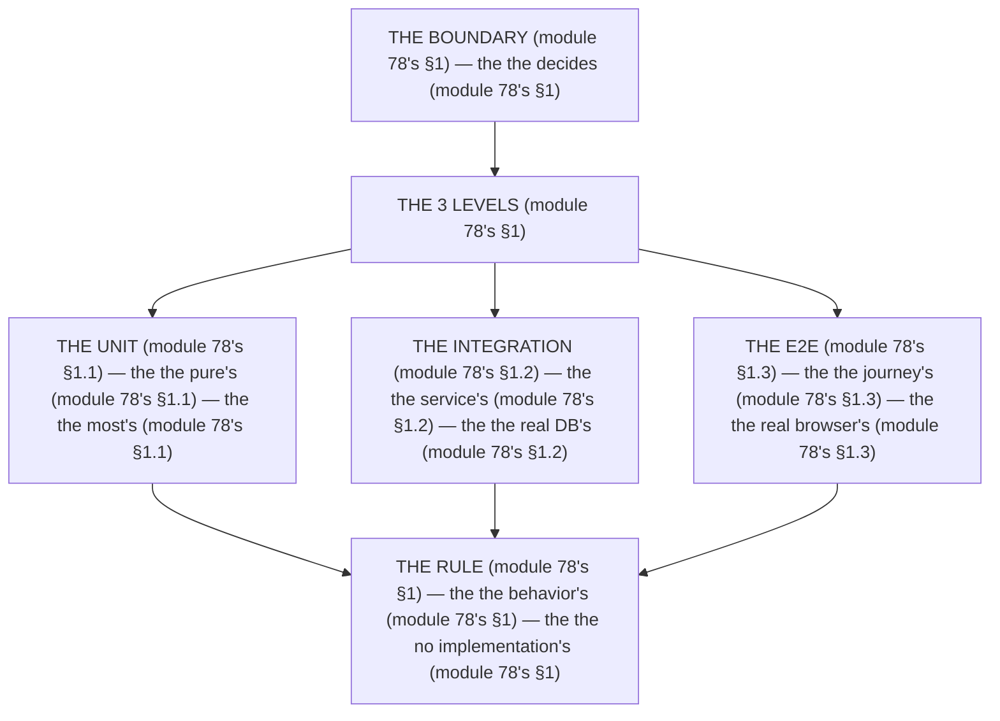

# Module 78 — Testing Strategy & the Pyramid: What Gets Which Level, and Why

**Phase 20: Testing · Module 78 of 101**

> **Where does this run?** The *decision* is a **team** one (module 78's §1); the *unit/integration* tests run **`[SERVER]`** (Vitest 5 — module 79's) or **`[CLIENT]`** (RTL — module 79's); the *E2E* runs in a **real browser** (Playwright — module 80's). The module-78's standing rule (module 05's service rule + module 48's 2-gate, now the test level): **the *boundary* decides the *test level* (module 78's §1) — pure logic is *unit*, the service→DB seam is *integration*, the UI→user seam is *E2E*; and you test the *behavior at the boundary*, not the *implementation inside* (module 78's §1)** (module 78's §1).

---

## 1. Concept — The boundary decides the level (the 3 levels)

**The unit's** (module 78's §1.1): the *the pure's* (module 78's §1.1) — the *module-78's line: the unit is the pure's* (module 78's §1.1) — the *the no mock's* (module 78's §1.1).

**The integration's** (module 78's §1.2): the *the service's* (module 78's §1.2) — the *module-78's line: the integration is the service's* (module 78's §1.2) — the *the real Postgres's* (module 78's §1.2).

**The E2E's** (module 78's §1.3): the *the user's journey* (module 78's §1.3) — the *module-78's line: the E2E is the journey's* (module 78's §1.3) — the *the real browser's* (module 78's §1.3).

## 2. Mental Model — The pyramid (drawn)



**The 3 levels** (the module-78's mental model):
1. **The unit** (module 78's §1.1): the *the pure's* — the *module-78's line: the unit is the pure's* (module 78's §1.1).
2. **The integration** (module 78's §1.2): the *the service's* — the *module-78's line: the integration is the service's* (module 78's §1.2).
3. **The E2E** (module 78's §1.3): the *the journey's* — the *module-78's line: the E2E is the journey's* (module 78's §1.3).

## 3. Architecture — The decision table (the map)

`FILE: docs/testing-strategy.md` (production pattern — the module-78's §3: the table's)

```md
## THE DECISION TABLE (module 78's §3 — the the table's (module 78's §3))

| Code (module 78's §3) | Boundary (module 78's §3) | Level (module 78's §3) | Tool (module 78's §3) | Why (module 78's §3) |
|---|---|---|---|---|
| The `computeCartTotal` (module 51's) | The pure's (module 78's §1.1) | The unit's (module 78's §1.1) | Vitest 5 (module 79's) | The no mock's (module 78's §1.1) |
| The `PERMISSIONS`/`ROLE_PERMISSIONS` (module 48's) | The pure's (module 78's §1.1) | The unit's (module 78's §1.1) | Vitest 5 (module 79's) | The no mock's (module 78's §1.1) |
| The service's (module 5's) | The service's→DB's (module 78's §1.2) | The integration's (module 78's §1.2) | Vitest 5 + real Postgres (module 79's) | The tenancy's (module 37's) |
| The Server Function's (module 29's) | The action's→DB's (module 78's §1.2) | The integration's (module 78's §1.2) | Vitest 5 + real Postgres (module 79's) | The 303's (module 29's) |
| The Route Handler's (module 34's) | The BFF's→service's (module 78's §1.2) | The integration's (module 78's §1.2) | Vitest 5 + real Postgres (module 79's) | The snake_case's (module 34's) |
| The component's (module 58's) | The UI's→props's (module 79's) | The RTL's (module 79's) | Vitest 5 + RTL (module 79's) | The 7's states (module 58's) |
| The user's journey (module 80's) | The user's→app's (module 78's §1.3) | The E2E's (module 78's §1.3) | Playwright (module 80's) | The auth's (module 43's) |

/* THE RULE (module 78's §3): the the boundary's (module 78's §3) — the the level's (module 78's §3) — the the behavior's (module 78's §1) */
```

## 4. Production Code — The pyramid's ratio (module 78's §4)

`FILE: docs/testing-ratio.md` (production pattern — the module-78's §4: the ratio's)

```md
## THE PYRAMID'S RATIO (module 78's §4 — the the ratio's (module 78's §4))

| Level (module 78's §4) | Count (module 78's §4) | Time (module 78's §4) | Cost (module 78's §4) |
|---|---|---|---|
| The unit's (module 78's §1.1) | 400 (module 78's §4) | 5s (module 78's §4) | The low's (module 78's §4) |
| The integration's (module 78's §1.2) | 80 (module 78's §4) | 30s (module 78's §4) | The medium's (module 78's §4) |
| The E2E's (module 78's §1.3) | 25 (module 78's §4) | 5min (module 78's §4) | The high's (module 78's §4) |

/* THE RULE (module 78's §4): the the most's is the unit's (module 78's §1.1) — the the fewest's is the E2E's (module 78's §1.3) — the the no "it works on my machine" (module 78's §4) */
```

**The module-78's line:** the *most is the unit's* (module 78's §1.1) — the *fewest is the E2E's* (module 78's §1.3) — the *no "it works on my machine"* (module 78's §4).

## 5. Common Mistakes (the pyramid's failures)

| Mistake | The symptom | Fix |
|---|---|---|
| **The E2E's everything** (module 78's §1.3's line violated) | the *module-78's line: the E2E is the journey's* (module 78's §1.3) — the *the E2E's everything's is the *no's* (module 78's §4) — the *module-78's line: the no E2E's everything* (module 78's §4) — the *no E2E's everything* (module 78's §4)* | the *the pyramid's (module 78's §4) — the *module-78's line: the E2E is the journey's* (module 78's §1.3)* |
| **The unit's DB** (module 78's §1.1's line violated) | the *module-78's line: the unit is the pure's* (module 78's §1.1) — the *the unit's DB's is the *no's* (module 78's §1.1) — the *module-78's line: the no unit's DB* (module 78's §1.1) — the *no unit's DB* (module 78's §1.1)* | the *the integration's (module 78's §1.2) — the *module-78's line: the integration is the service's* (module 78's §1.2)* |
| **The no integration** (module 78's §1.2's line violated) | the *module-78's line: the integration is the service's* (module 78's §1.2) — the *the no integration's is the *no's* (module 78's §1.2) — the *module-78's line: the no integration* (module 78's §1.2) — the *no integration* (module 78's §1.2)* | the *the real Postgres's (module 79's) — the *module-78's line: the integration is the service's* (module 78's §1.2)* |
| **The implementation's** (module 78's §1's line violated) | the *module-78's line: the behavior's* (module 78's §1) — the *the implementation's is the *no's* (module 78's §1) — the *module-78's line: the no implementation's* (module 78's §1) — the *no implementation's* (module 78's §1)* | the *the behavior's (module 78's §1) — the *module-78's line: the behavior's* (module 78's §1)* |
| **The no authz's negative** (module 78's §1.3's line violated) | the *module-78's line: the E2E is the journey's* (module 78's §1.3) — the *the no authz's negative's is the *no's* (module 78's §1.3) — the *module-78's line: the no authz's negative* (module 78's §1.3) — the *no authz's negative* (module 78's §1.3)* | the *the E2E's negative (module 80's) — the *module-78's line: the E2E is the journey's* (module 78's §1.3)* |
| **The no "it works"** (module 78's §4's line violated) | the *module-78's line: the no "it works on my machine"* (module 78's §4) — the *the no "it works"'s is the *no's* (module 78's §4) — the *module-78's line: the no "it works"* (module 78's §4) — the *no "it works"* (module 78's §4)* | the *the CI's (module 86's) — the *module-78's line: the no "it works on my machine"* (module 78's §4)* |

## 6. Security Notes

- **The authz's negative** (module 78's §1.3): the *module-78's line: the E2E is the journey's* (module 78's §1.3) — the *module-48's* *deep-dive* (module 48's).
- **The tenancy's** (module 37's): the *module-78's line: the integration is the service's* (module 78's §1.2) — the *module-37's* *deep-dive* (module 37's).
- **The behavior's** (module 78's §1): the *module-78's line: the behavior's* (module 78's §1) — the *module-77's* *deep-dive* (module 77's).

## 7. Performance Notes

- **The ratio's** (module 78's §4): the *module-78's line: the most's is the unit's* (module 78's §1.1) — the *the 5s's* (module 78's §4).
- **The 30s's** (module 78's §4): the *module-78's line: the integration is the service's* (module 78's §1.2) — the *the 30s's* (module 78's §4).
- **The 5min's** (module 78's §4): the *module-78's line: the E2E is the journey's* (module 78's §1.3) — the *the 5min's* (module 78's §4).

## 8. Exercise

**Beginner.** *The decision table's* (module 78's §3): the *the 7's rows* (module 3's) + the *the boundary's* (module 3's) — *build the table* — the *artifact: the table's* (module 3's).

**Intermediate.** *The ratio's* (module 78's §4): the *the 400's* (module 4's) + the *the 80's* (module 4's) + the *the 25's* (module 4's) — *build the ratio* — the *artifact: the ratio's* (module 4's).

**Production.** *The pyramid's* (module 78's §4): the *the 3's levels* (module 1's) + the *the no E2E's everything* (module 5's) — *audit it* — the *artifact: the pyramid's* (module 4's).

## 9. Architecture Challenge

**Prompt:** The *"the team has 40 E2E tests and no unit or integration tests — CI takes 25 minutes and half the tests are flaky"* (the *module-78's* *pyramid* — the *module-79's* *tools* — the *module-78's line: the E2E is the journey's* (module 78's §1.3) — the *module-79's line: the unit is the pure's* (module 79's) — the *module-78's standing line: the boundary decides the level + the behavior not the implementation* (module 78's §1)).

The *problems*: (1) the *the E2E's everything* (the *the no pyramid's* (module 78's §4) — the *module-78's line: the E2E is the journey's* (module 78's §1.3) — the *module-78's standing line: the E2E is the journey's* (module 78's §1.3)).

(2) the *the flaky's* (the *the no behavior's* (module 78's §1) — the *module-78's line: the behavior's* (module 78's §1) — the *module-78's standing line: the behavior's* (module 78's §1)).

**Design**: the *the pyramid's remediation* (the *the 400's unit* (module 4's) + the *the 80's integration* (module 4's) + the *the 25's E2E* (module 4's) — the *module-78's line: the boundary decides the level* (module 78's §1) — the *module-78's standing line: the boundary decides the level + the behavior not the implementation* (module 78's §1)).

Produce: the *the pyramid's remediation* (the *the 400's unit* (module 4's) + the *the 80's integration* (module 4's) + the *the 25's E2E* (module 4's) — the *module-78's line: the boundary decides the level* (module 78's §1) — the *module-78's standing line: the boundary decides the level + the behavior not the implementation* (module 78's §1)).

<details>
<summary>Model answer</summary>
**The pyramid's remediation** (module 78's §4):
1. **The 400's unit** (module 78's §1.1): the *the pure's logic becomes the 400's* — the *module-78's line: the unit is the pure's* (module 78's §1.1).
2. **The 80's integration** (module 78's §1.2): the *the service's seam becomes the 80's* — the *module-78's line: the integration is the service's* (module 78's §1.2).
3. **The 25's E2E** (module 78's §1.3): the *the journey's become the 25's* — the *module-78's line: the E2E is the journey's* (module 78's §1.3).
**The generalization** (the *pyramid's* pattern, the *module's* standing rule): **the *boundary decides the level* (module 78's §1) — the *the behavior's* (module 78's §1) — the *module-78's standing line: the boundary decides the level + the behavior not the implementation* (module 78's §1)*.
</details>

## 10. Official Documentation

- Vitest: https://vitest.dev/
- React Testing Library: https://testing-library.com/docs/
- Playwright: https://playwright.dev/
- MSW: https://mswjs.io/
- The module-79's tools: the module-79 (the phase-20's file-02)
- The module-80's E2E: the module-80 (the phase-20's file-03)

## 11. What You Should Know Before Continuing

- [ ] I can state the *3 levels* (module 1's: the unit/integration/E2E) — the *module-78's line: the boundary decides the level* (module 1's)
- [ ] I know the *unit is the pure's* (module 1.1's) — the *the no mock's* (module 1.1's)
- [ ] I know the *integration is the service's* (module 1.2's) — the *the real Postgres's* (module 1.2's)
- [ ] I know the *E2E is the journey's* (module 1.3's) — the *the real browser's* (module 1.3's)
- [ ] I know the *ratio's* (module 4's) — the *the 400's/80's/25's* (module 4's)
- [ ] I've done the *decision table's* (module 8's beginner) + the *ratio's* (module 8's intermediate) + the *pyramid's* (module 8's production) — the *artifacts* (module 20's)

**Next:** Module 79 — Vitest + RTL (the *the unit's + the integration's* — the *module-79's line: the unit is the pure's* (module 79's)).
