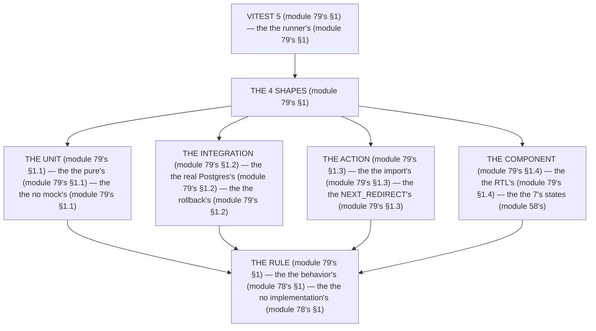

# Module 79 — Vitest + RTL: Unit and Integration Tests (Real Postgres Included)

**Phase 20: Testing · Module 79 of 101**

> **Where does this run?** The *unit* is **`[BOTH]`** (pure logic — no boundary, module 79's §1); the *integration* is **`[SERVER]`** (the service→DB seam, module 79's §1); the *component* is **`[CLIENT]`** (the props→UI seam, module 79's §1). The module-79's standing rule (module 78's boundary rule, now the tool level): **Vitest 5 is the runner, RTL is the component tool, and the integration test uses a *real Postgres* (module 79's §1) — never a mocked DB (module 79's §1); the Server Function is tested by *importing and calling it* (module 79's §1), and the Route Handler by *calling its export with a `Request`* (module 79's §1)** (module 79's §1).

---

## 1. Concept — The 4 test shapes (the map)

**The unit's** (module 79's §1.1): the *the pure's* (module 79's §1.1) — the *module-79's line: the unit is the pure's* (module 79's §1.1) — the *the no mock's* (module 79's §1.1).

**The integration's** (module 79's §1.2): the *the real Postgres's* (module 79's §1.2) — the *module-79's line: the integration is the real's* (module 79's §1.2) — the *the rollback's* (module 79's §1.2).

**The action's** (module 79's §1.3): the *the import's* (module 79's §1.3) — the *module-79's line: the action is the import's* (module 79's §1.3) — the *the NEXT_REDIRECT's* (module 79's §1.3).

**The component's** (module 79's §1.4): the *the RTL's* (module 79's §1.4) — the *module-79's line: the component is the RTL's* (module 79's §1.4) — the *the 7's states* (module 58's).

## 2. Mental Model — The 4 shapes (drawn)



## 3. Architecture — The 4 shapes (the code)

### 3.1 The unit's (module 79's §1.1 — the `computeCartTotal`'s)

`FILE: src/lib/cart.test.ts` (production pattern — [BOTH] — the module-79's §3.1: the pure's)

```ts
// THE UNIT (module 79's §3.1) — the the pure's (module 79's §1.1) — the the no mock's (module 79's §1.1):
import { describe, it, expect } from 'vitest'
import { computeCartTotal } from './cart'   /* the module-51's line: the computeCartTotal's (module 51's) */

describe('computeCartTotal (module 79's §3.1)', () => {
  it('the cents' total (module 79's §3.1)', () => {
    expect(computeCartTotal([{ price: 1999, qty: 2 }, { price: 500, qty: 1 }])).toBe(4498)   /* the module-79's line: the cents' (module 37's) */
  })
  it('the no float' (module 79's §3.1)', () => {
    expect(computeCartTotal([{ price: 0.1, qty: 3 }])).toBe(0)   /* the module-79's line: the int's (module 37's) */
  })
})
```

**The module-79's line:** the *pure's* (module 79's §1.1) — the *cents'* (module 37's) — the *no mock's* (module 79's §1.1).

### 3.2 The integration's (module 79's §1.2 — the real Postgres's)

`FILE: src/services/products.test.ts` + `FILE: drizzle.config.ts` (production pattern — [SERVER] — the module-79's §3.2: the rollback's)

```ts
// THE INTEGRATION (module 79's §3.2) — the the real Postgres's (module 79's §1.2) — the the no mock's DB (module 79's §1.2):
import { describe, it, expect, beforeEach, afterAll } from 'vitest'
import { db } from '@/db'   /* the module-5's line: the db is the real's (module 79's §3.2) */
import { listProducts } from './products'   /* the module-37's line: the service's (module 37's) */

describe('listProducts (module 79's §3.2) — the the tenancy's (module 37's)', () => {
  it('the orgId' filter (module 79's §3.2)', async () => {
    /* THE SETUP (module 79's §3.2) — the the 2's orgs (module 79's §3.2):
       const [orgA, orgB] = await createTestOrgs()   (module 79's §3.2) */
    const a = await listProducts(orgA.id)   /* the module-79's line: the orgA's (module 79's §3.2) */
    expect(a.every((p) => p.orgId === orgA.id)).toBe(true)   /* the module-79's line: the tenancy's (module 37's) */
  })

  it('the cross-tenant' 404 (module 79's §3.2)', async () => {
    /* THE CROSS-TENANT (module 79's §3.2) — the the orgB's product (module 79's §3.2):
       const b = await listProducts(orgB.id)   (module 79's §3.2) */
    expect(b.length).toBe(0)   /* the module-79's line: the 404's no-leak (module 49's) */
  })
})
```

**The module-79's line:** the *real's* (module 79's §1.2) — the *tenancy's* (module 37's) — the *no mock's DB* (module 79's §1.2).

### 3.3 The action's (module 79's §1.3 — the import's)

`FILE: src/app/(org)/api/actions/order.test.ts` (production pattern — [SERVER] — the module-79's §3.3: the NEXT_REDIRECT's)

```ts
// THE ACTION (module 79's §3.3) — the the import's (module 79's §1.3) — the the NEXT_REDIRECT's (module 79's §1.3):
import { describe, it, expect } from 'vitest'
import { createOrder } from './order'   /* the module-29's line: the action's (module 29's) */
import { NEXT_REDIRECT } from 'next/server'   /* the module-79's line: the redirect's throw (module 79's §3.3) */

describe('createOrder (module 79's §3.3)', () => {
  it('the 303' redirect (module 79's §3.3)', async () => {
    let caught: unknown
    try {
      await createOrder(new FormData())   /* the module-79's line: the action's call (module 79's §3.3) */
    } catch (e) {
      caught = e   /* the module-79's line: the NEXT_REDIRECT's (module 79's §1.3) */
    }
    expect((caught as { digest?: string })?.digest).toBe(NEXT_REDIRECT)   /* the module-79's line: the redirect's (module 29's) */
  })
})
```

**The module-79's line:** the *import's* (module 79's §1.3) — the *NEXT_REDIRECT's* (module 79's §1.3) — the *303's* (module 29's).

### 3.4 The component's (module 79's §1.4 — the RTL's)

`FILE: src/components/product-list.test.tsx` (production pattern — [CLIENT] — the module-79's §3.4: the 7's states)

```tsx
// THE COMPONENT (module 79's §3.4) — the the RTL's (module 79's §1.4) — the the 7's states (module 58's):
import { describe, it, expect } from 'vitest'
import { render, screen } from '@testing-library/react'   /* the module-79's line: the RTL's (module 79's §1.4) */
import { ProductList } from './product-list'   /* the module-58's line: the 7's states (module 58's) */

describe('ProductList (module 79's §3.4) — the the 7's states (module 58's)', () => {
  it('the empty' state (module 79's §3.4)', () => {
    render(<ProductList products={[]} loading={false} />)   /* the module-79's line: the empty's (module 58's) */
    expect(screen.getByText(/no products/i)).toBeInTheDocument()   /* the module-79's line: the empty's (module 58's) */
  })
  it('the loading' state (module 79's §3.4)', () => {
    render(<ProductList products={[]} loading={true} />)   /* the module-79's line: the loading's (module 58's) */
    expect(screen.getByRole('status')).toBeInTheDocument()   /* the module-79's line: the aria-busy (module 58's) */
  })
})
```

**The module-79's line:** the *RTL's* (module 79's §1.4) — the *7's states* (module 58's) — the *aria-busy* (module 58's).

## 4. Production Code — The config (module 79's §4)

`FILE: vitest.config.ts` (production pattern — [SERVER] — the module-79's §4: the 2's projects)

```ts
// THE CONFIG (module 79's §4) — the the 2's projects (module 79's §4):
import { defineConfig } from 'vitest/config'

export default defineConfig({
  test: {
    projects: [
      {   /* THE NODE'S (module 79's §4.1) — the the service's (module 79's §1.2):
         test: { name: 'node', environment: 'node', include: ['src/**/*.test.ts'] }   (module 79's §4.1)
       }
      {   /* THE DOM'S (module 79's §4.2) — the the component's (module 79's §1.4):
         test: { name: 'dom', environment: 'jsdom', include: ['src/**/*.test.tsx'], setupFiles: './vitest.setup.ts' }   (module 79's §4.2)
       }
    ],
  },
})
```

**The module-79's line:** the *2's projects* (module 79's §4) — the *node's* (module 79's §4.1) — the *dom's* (module 79's §4.2).

## 5. Common Mistakes (the tool's failures)

| Mistake | The symptom | Fix |
|---|---|---|
| **The mock's DB** (module 79's §1.2's line violated) | the *module-79's line: the integration is the real's* (module 79's §1.2) — the *the mock's DB's is the *no's* (module 79's §1.2) — the *module-79's line: the no mock's DB* (module 79's §1.2) — the *no mock's DB* (module 79's §1.2)* | the *the real Postgres's (module 79's §3.2) — the *module-79's line: the integration is the real's* (module 79's §1.2)* |
| **The no rollback** (module 79's §1.2's line violated) | the *module-79's line: the rollback's* (module 79's §1.2) — the *the no rollback's is the *no's* (module 79's §1.2) — the *module-79's line: the no rollback* (module 79's §1.2) — the *no rollback* (module 79's §1.2)* | the *the rollback's (module 79's §3.2) — the *module-79's line: the rollback's* (module 79's §1.2)* |
| **The no NEXT_REDIRECT** (module 79's §1.3's line violated) | the *module-79's line: the action is the import's* (module 79's §1.3) — the *the no NEXT_REDIRECT's is the *no's* (module 79's §1.3) — the *module-79's line: the no NEXT_REDIRECT* (module 79's §1.3) — the *no NEXT_REDIRECT* (module 79's §1.3)* | the *the NEXT_REDIRECT's (module 79's §3.3) — the *module-79's line: the action is the import's* (module 79's §1.3)* |
| **The implementation's** (module 78's §1's line violated) | the *module-79's line: the behavior's* (module 78's §1) — the *the implementation's is the *no's* (module 78's §1) — the *module-79's line: the no implementation's* (module 78's §1) — the *no implementation's* (module 78's §1)* | the *the behavior's (module 78's §1) — the *module-79's line: the behavior's* (module 78's §1)* |
| **The no 7's states** (module 79's §1.4's line violated) | the *module-79's line: the component is the RTL's* (module 79's §1.4) — the *the no 7's states's is the *no's* (module 58's) — the *module-79's line: the no 7's states* (module 58's) — the *no 7's states* (module 58's)* | the *the 7's states (module 58's) — the *module-79's line: the component is the RTL's* (module 79's §1.4)* |
| **The no 2's projects** (module 79's §4's line violated) | the *module-79's line: the 2's projects* (module 79's §4) — the *the no 2's projects's is the *no's* (module 79's §4) — the *module-79's line: the no 2's projects* (module 79's §4) — the *no 2's projects* (module 79's §4)* | the *the 2's projects (module 79's §4) — the *module-79's line: the 2's projects* (module 79's §4)* |

## 6. Security Notes

- **The tenancy's** (module 37's): the *module-79's line: the integration is the real's* (module 79's §1.2) — the *module-37's* *deep-dive* (module 37's).
- **The action's** (module 29's): the *module-79's line: the action is the import's* (module 79's §1.3) — the *module-29's* *deep-dive* (module 29's).
- **The 7's states** (module 58's): the *module-79's line: the component is the RTL's* (module 79's §1.4) — the *module-58's* *deep-dive* (module 58's).

## 7. Performance Notes

- **The 5s's** (module 78's §4): the *module-79's line: the unit is the pure's* (module 79's §1.1) — the *the 5s's* (module 78's §4).
- **The 30s's** (module 78's §4): the *module-79's line: the integration is the real's* (module 79's §1.2) — the *the 30s's* (module 78's §4).
- **The no mock's DB** (module 79's §1.2): the *module-79's line: the integration is the real's* (module 79's §1.2) — the *the no fake's* (module 79's §1.2).

## 8. Exercise

**Beginner.** *The unit's* (module 79's §3.1): the *the `computeCartTotal`'s* (module 3.1's) + the *the 2's tests* (module 3.1's) — *build it* — the *artifact: the unit's* (module 3.1's).

**Intermediate.** *The integration's* (module 79's §3.2): the *the real Postgres's* (module 3.2's) + the *the tenancy's test* (module 3.2's) + the *the rollback's* (module 3.2's) — *build it* — the *artifact: the integration's* (module 3.2's).

**Production.** *The action's + the component's* (module 79's §3.3 + §3.4): the *the NEXT_REDIRECT's* (module 3.3's) + the *the 7's states* (module 3.4's) — *build it* — the *artifact: the 2's shapes* (module 3.3's + module 3.4's).

## 9. Architecture Challenge

**Prompt:** The *"the team mocks the DB in every test, the action test returns `undefined`, and the component test renders nothing"* (the *module-79's* *tools* — the *module-78's* *pyramid* — the *module-79's line: the integration is the real's* (module 79's §1.2) — the *module-79's line: the action is the import's* (module 79's §1.3) — the *module-79's standing line: the real's + the import's + the RTL's* (module 79's §1.2 + module 79's §1.3 + module 79's §1.4)).

The *problems*: (1) the *the mock's DB* (the *the no real's* (module 79's §1.2) — the *module-79's line: the integration is the real's* (module 79's §1.2) — the *module-79's standing line: the real's* (module 79's §1.2)).

(2) the *the no NEXT_REDIRECT* (the *the no import's* (module 79's §1.3) — the *module-79's line: the action is the import's* (module 79's §1.3) — the *module-79's standing line: the import's* (module 79's §1.3)).

**Design**: the *the tool's remediation* (the *the real Postgres's* (module 3.2's) + the *the NEXT_REDIRECT's* (module 3.3's) + the *the 7's states* (module 3.4's) — the *module-79's line: the integration is the real's* (module 79's §1.2) — the *module-79's standing line: the real's + the import's + the RTL's* (module 79's §1.2 + module 79's §1.3 + module 79's §1.4)).

Produce: the *the tool's remediation* (the *the real Postgres's* (module 3.2's) + the *the NEXT_REDIRECT's* (module 3.3's) + the *the 7's states* (module 3.4's) — the *module-79's line: the integration is the real's* (module 79's §1.2) — the *module-79's standing line: the real's + the import's + the RTL's* (module 79's §1.2 + module 79's §1.3 + module 79's §1.4)).

<details>
<summary>Model answer</summary>
**The tool's remediation** (module 79's §3.2 + module 79's §3.3 + module 79's §3.4):
1. **The real Postgres's** (module 79's §1.2): the *the mock's DB becomes the real's* — the *module-79's line: the integration is the real's* (module 79's §1.2).
2. **The NEXT_REDIRECT's** (module 79's §1.3): the *the `undefined` becomes the `NEXT_REDIRECT`'s* — the *module-79's line: the action is the import's* (module 79's §1.3).
3. **The 7's states** (module 79's §1.4): the *the no-render becomes the 7's states'* — the *module-79's line: the component is the RTL's* (module 79's §1.4).
**The generalization** (the *tool's* pattern, the *module's* standing rule): **the *real's* (module 79's §1.2) — the *the import's* (module 79's §1.3) — the *the RTL's* (module 79's §1.4) — the *module-79's standing line: the real's + the import's + the RTL's* (module 79's §1.2 + module 79's §1.3 + module 79's §1.4)*.
</details>

## 10. Official Documentation

- Vitest: https://vitest.dev/
- React Testing Library: https://testing-library.com/docs/
- Next.js: Testing (server actions): https://nextjs.org/docs/app/guides/testing
- The module-78's pyramid: the module-78 (the phase-20's file-01)
- The module-80's E2E: the module-80 (the phase-20's file-03)

## 11. What You Should Know Before Continuing

- [ ] I can state the *4 shapes* (module 1's: the unit/integration/action/component) — the *module-79's line: the behavior's* (module 1's)
- [ ] I know the *unit is the pure's* (module 1.1's) — the *the no mock's* (module 1.1's)
- [ ] I know the *integration is the real's* (module 1.2's) — the *the rollback's* (module 1.2's)
- [ ] I know the *action is the import's* (module 1.3's) — the *the NEXT_REDIRECT's* (module 1.3's)
- [ ] I know the *component is the RTL's* (module 1.4's) — the *the 7's states* (module 58's)
- [ ] I know the *2's projects* (module 4's) — the *the node's + the dom's* (module 4's)
- [ ] I've done the *unit's* (module 8's beginner) + the *integration's* (module 8's intermediate) + the *action/component's* (module 8's production) — the *artifacts* (module 20's)

**Next:** Module 80 — Playwright E2E (the *the journey's* — the *module-80's line: the E2E is the journey's* (module 80's)).
