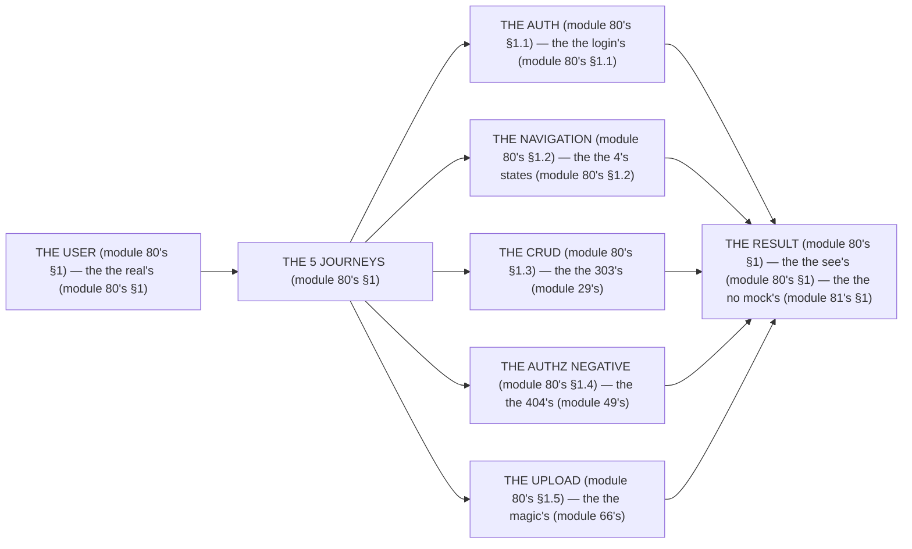

# Module 80 — Playwright E2E: Full Journeys, Auth, Authz Negatives, CRUD, Upload

**Phase 20: Testing · Module 80 of 101**

> **Where does this run?** E2E runs in a **real browser** (Playwright — module 80's §1) against a **`[SERVER]`** app and a **real DB** (module 80's §1). The module-80's standing rule (module 78's E2E level, now the journey level): **the E2E is the *journey* (module 80's §1) — *auth → navigate → act → see the result* — and it *never mocks its own server* (module 81's §1); the *authz negative* (the 404, not the 403, for cross-tenant — module 49's) is a *first-class* test, not an afterthought (module 80's §1)** (module 80's §1).

---

## 1. Concept — The 5 journeys (the map)

**The auth's** (module 80's §1.1): the *the login's* (module 80's §1.1) — the *module-80's line: the auth is the login's* (module 80's §1.1) — the *module-43's* *session* (module 43's).

**The navigation's** (module 80's §1.2): the *the 4's states* (module 80's §1.2) — the *module-80's line: the navigation is the 4's* (module 80's §1.2) — the *module-67's* *URL* (module 67's).

**The CRUD's** (module 80's §1.3): the *the 303's* (module 29's) — the *module-80's line: the CRUD is the 303's* (module 80's §1.3) — the *module-54's* *forms* (module 54's).

**The authz's negative** (module 80's §1.4): the *the 404's* (module 49's) — the *module-80's line: the authz is the 404's* (module 80's §1.4) — the *module-49's* *tenancy* (module 49's).

**The upload's** (module 80's §1.5): the *the magic's* (module 66's) — the *module-80's line: the upload is the magic's* (module 80's §1.5) — the *module-66's* *validator* (module 66's).

## 2. Mental Model — The journey (drawn)



## 3. Architecture — The 5 journeys (the code)

### 3.1 The auth's (module 80's §1.1 — the login's)

`FILE: e2e/auth.spec.ts` (production pattern — the module-80's §3.1: the session's)

```ts
// THE AUTH (module 80's §3.1) — the the login's (module 80's §1.1) — the the no mock's (module 81's §1):
import { test, expect } from '@playwright/test'

test('the login's (module 80's §3.1)', async ({ page }) => {
  await page.goto('/login')   /* the module-80's line: the login's (module 80's §1.1) */
  await page.getByLabel('Email').fill('admin@test.com')   /* the module-80's line: the email's (module 80's §3.1) */
  await page.getByLabel('Password').fill('password123')   /* the module-80's line: the password's (module 80's §3.1) */
  await page.getByRole('button', { name: 'Sign in' }).click()   /* the module-80's line: the click's (module 80's §3.1) */
  await expect(page).toHaveURL('/')   /* the module-80's line: the redirect's (module 29's) */
  await expect(page.getByText('Dashboard')).toBeVisible()   /* the module-80's line: the session's (module 43's) */
})
```

**The module-80's line:** the *login's* (module 80's §1.1) — the *session's* (module 43's) — the *no mock's* (module 81's §1).

### 3.2 The navigation's (module 80's §1.2 — the 4's states)

`FILE: e2e/navigation.spec.ts` (production pattern — the module-80's §3.2: the URL's)

```ts
// THE NAVIGATION (module 80's §3.2) — the the 4's states (module 80's §1.2) — the the URL's (module 67's):
test('the product list's (module 80's §3.2)', async ({ page }) => {
  await page.goto('/org/acme/products')   /* the module-80's line: the URL's (module 67's) */
  await expect(page.getByRole('table')).toBeVisible()   /* the module-80's line: the list's (module 67's) */

  await page.getByRole('link', { name: 'Filters' }).click()   /* the module-80's line: the filter's (module 67's) */
  await page.getByLabel('Status').selectOption('active')   /* the module-80's line: the status's (module 67's) */
  await expect(page).toHaveURL(/status=active/)   /* the module-80's line: the URL's (module 67's) */
})
```

**The module-80's line:** the *4's states* (module 80's §1.2) — the *URL's* (module 67's) — the *filter's* (module 67's).

### 3.3 The CRUD's (module 80's §1.3 — the 303's)

`FILE: e2e/crud.spec.ts` (production pattern — the module-80's §3.3: the action's)

```ts
// THE CRUD (module 80's §3.3) — the the 303's (module 29's) — the the no mock's (module 81's §1):
test('the create product's (module 80's §3.3)', async ({ page }) => {
  await page.goto('/org/acme/products/new')   /* the module-80's line: the new's (module 80's §3.3) */
  await page.getByLabel('Name').fill('Test Widget')   /* the module-80's line: the name's (module 80's §3.3) */
  await page.getByLabel('Price').fill('19.99')   /* the module-80's line: the price's (module 80's §3.3) */
  await page.getByRole('button', { name: 'Create' }).click()   /* the module-80's line: the 303's (module 29's) */
  await expect(page).toHaveURL('/org/acme/products')   /* the module-80's line: the redirect's (module 29's) */
  await expect(page.getByText('Test Widget')).toBeVisible()   /* the module-80's line: the see's (module 80's §1) */
})
```

**The module-80's line:** the *303's* (module 29's) — the *redirect's* (module 29's) — the *see's* (module 80's §1).

### 3.4 The authz's negative (module 80's §1.4 — the 404's)

`FILE: e2e/authz.spec.ts` (production pattern — the module-80's §3.4: the no-leak's)

```ts
// THE AUTHZ NEGATIVE (module 80's §3.4) — the the 404's (module 49's) — the the no-leak's (module 49's):
test('the cross-tenant' 404 (module 80's §3.4)', async ({ page, request }) => {
  /* THE SETUP (module 80's §3.4) — the the orgB's session (module 80's §3.4) */
  await page.goto('/org/orgA/products/other-org-product-id')   /* the module-80's line: the cross-tenant's (module 80's §1.4) */
  await expect(page).toHaveURL(/\/not-found/)   /* the module-80's line: the 404's (module 49's) */
  await expect(page.getByText('other-org-product')).not.toBeVisible()   /* the module-80's line: the no-leak's (module 49's) */
})
```

**The module-80's line:** the *404's* (module 49's) — the *no-leak's* (module 49's) — the *cross-tenant's* (module 80's §1.4).

### 3.5 The upload's (module 80's §1.5 — the magic's)

`FILE: e2e/upload.spec.ts` (production pattern — the module-80's §3.5: the reject's)

```ts
// THE UPLOAD (module 80's §3.5) — the the magic's (module 66's) — the the reject's (module 66's):
test('the upload's (module 80's §3.5)', async ({ page }) => {
  await page.goto('/org/acme/products/123')   /* the module-80's line: the product's (module 80's §3.5) */
  await page.setInputFiles('input[type="file"]', 'test-image.png')   /* the module-80's line: the file's (module 80's §3.5) */
  await expect(page.getByRole('img', { name: 'test-image' })).toBeVisible()   /* the module-80's line: the see's (module 80's §1) */

  await page.setInputFiles('input[type="file"]', 'evil.html')   /* the module-80's line: the reject's (module 66's) */
  await expect(page.getByText(/invalid file type/i)).toBeVisible()   /* the module-80's line: the error's (module 66's) */
})
```

**The module-80's line:** the *magic's* (module 66's) — the *reject's* (module 66's) — the *error's* (module 66's).

## 4. Production Code — The config (module 80's §4)

`FILE: playwright.config.ts` (production pattern — the module-80's §4: the 2's contexts)

```ts
// THE CONFIG (module 80's §4) — the the 2's contexts (module 80's §4):
import { defineConfig, devices } from '@playwright/test'

export default defineConfig({
  testDir: './e2e',
  use: {
    baseURL: process.env.E2E_BASE_URL ?? 'http://localhost:3000',   /* the module-80's line: the base's (module 80's §4) */
    ...devices['Desktop Chrome'],   /* the module-80's line: the chrome's (module 80's §4) */
  },
  projects: [
    { name: 'authed', use: { storageState: 'e2e/.auth/admin.json' } },   /* the module-80's line: the admin's (module 80's §4) */
    { name: 'viewer', use: { storageState: 'e2e/.auth/viewer.json' } },   /* the module-80's line: the viewer's (module 80's §4) */
  ],
  webServer: {   /* THE WEB'S SERVER (module 80's §4.1) — the the no "it works"'s (module 78's §4):
    command: 'npm run dev',
    url: 'http://localhost:3000',
    reuseExistingServer: !process.env.CI,
  },
})
```

**The module-80's line:** the *2's contexts* (module 80's §4) — the *admin's* (module 80's §4) — the *viewer's* (module 80's §4).

## 5. Common Mistakes (the journey's failures)

| Mistake | The symptom | Fix |
|---|---|---|
| **The mock's server** (module 81's §1's line violated) | the *module-80's line: the no mock's* (module 81's §1) — the *the mock's server's is the *no's* (module 81's §1) — the *module-80's line: the no mock's server* (module 81's §1) — the *no mock's server* (module 81's §1)* | the *the real's (module 80's §1) — the *module-80's line: the no mock's* (module 81's §1)* |
| **The no authz's negative** (module 80's §1.4's line violated) | the *module-80's line: the authz is the 404's* (module 80's §1.4) — the *the no authz's negative's is the *no's* (module 80's §1.4) — the *module-80's line: the no authz's negative* (module 80's §1.4) — the *no authz's negative* (module 80's §1.4)* | the *the 404's (module 80's §3.4) — the *module-80's line: the authz is the 404's* (module 80's §1.4)* |
| **The no 303's** (module 80's §1.3's line violated) | the *module-80's line: the CRUD is the 303's* (module 80's §1.3) — the *the no 303's is the *no's* (module 29's) — the *module-80's line: the no 303* (module 29's) — the *no 303* (module 29's)* | the *the 303's (module 29's) — the *module-80's line: the CRUD is the 303's* (module 80's §1.3)* |
| **The no upload's reject** (module 80's §1.5's line violated) | the *module-80's line: the upload is the magic's* (module 80's §1.5) — the *the no upload's reject's is the *no's* (module 66's) — the *module-80's line: the no upload's reject* (module 66's) — the *no upload's reject* (module 66's)* | the *the reject's (module 80's §3.5) — the *module-80's line: the upload is the magic's* (module 80's §1.5)* |
| **The no 2's contexts** (module 80's §4's line violated) | the *module-80's line: the 2's contexts* (module 80's §4) — the *the no 2's contexts's is the *no's* (module 80's §4) — the *module-80's line: the no 2's contexts* (module 80's §4) — the *no 2's contexts* (module 80's §4)* | the *the 2's contexts (module 80's §4) — the *module-80's line: the 2's contexts* (module 80's §4)* |
| **The flaky's** (module 78's §1's line violated) | the *module-80's line: the journey's* (module 78's §1.3) — the *the flaky's is the *no's* (module 78's §1) — the *module-80's line: the no flaky's* (module 78's §1) — the *no flaky's* (module 78's §1)* | the *the journey's (module 80's §1) — the *module-80's line: the journey's* (module 78's §1.3)* |

## 6. Security Notes

- **The authz's negative** (module 80's §1.4): the *module-80's line: the authz is the 404's* (module 80's §1.4) — the *module-49's* *deep-dive* (module 49's).
- **The no-leak's** (module 49's): the *module-80's line: the no-leak's* (module 49's) — the *module-49's* *deep-dive* (module 49's).
- **The upload's reject** (module 80's §1.5): the *module-80's line: the upload is the magic's* (module 80's §1.5) — the *module-66's* *deep-dive* (module 66's).

## 7. Performance Notes

- **The 5min's** (module 78's §4): the *module-80's line: the journey's* (module 78's §1.3) — the *the 5min's* (module 78's §4).
- **The 25's** (module 78's §4): the *module-80's line: the journey's* (module 78's §1.3) — the *the 25's* (module 78's §4).
- **The no flaky's** (module 78's §1): the *module-80's line: the journey's* (module 78's §1.3) — the *the no flaky's* (module 78's §1).

## 8. Exercise

**Beginner.** *The auth's + the navigation's* (module 80's §3.1 + §3.2): the *the login's* (module 3.1's) + the *the 4's states* (module 3.2's) — *build it* — the *artifact: the 2's journeys* (module 3.1's + module 3.2's).

**Intermediate.** *The CRUD's + the authz's negative* (module 80's §3.3 + §3.4): the *the 303's* (module 3.3's) + the *the 404's* (module 3.4's) — *build it* — the *artifact: the 2's journeys* (module 3.3's + module 3.4's).

**Production.** *The upload's* (module 80's §3.5): the *the magic's* (module 3.5's) + the *the reject's* (module 3.5's) + the *the 2's contexts* (module 4's) — *build it* — the *artifact: the journey's* (module 3.5's).

## 9. Architecture Challenge

**Prompt:** The *"the team's E2E suite has no authz negative, the upload test doesn't reject the `evil.html`, and the CRUD test asserts on a `div` class"* (the *module-80's* *journey* — the *module-49's* *tenancy* — the *module-80's line: the authz is the 404's* (module 80's §1.4) — the *module-66's line: the upload is the magic's* (module 66's) — the *module-80's standing line: the journey's + the 404's + the magic's* (module 80's §1 + module 80's §1.4 + module 80's §1.5)).

The *problems*: (1) the *the no authz's negative* (the *the no 404's* (module 80's §1.4) — the *module-80's line: the authz is the 404's* (module 80's §1.4) — the *module-80's standing line: the 404's* (module 80's §1.4)).

(2) the *the no upload's reject* (the *the no magic's* (module 66's) — the *module-80's line: the upload is the magic's* (module 80's §1.5) — the *module-80's standing line: the magic's* (module 80's §1.5)).

**Design**: the *the journey's remediation* (the *the 404's* (module 3.4's) + the *the magic's* (module 3.5's) + the *the no div's class* (module 3.3's) — the *module-80's line: the journey's* (module 80's §1) — the *module-80's standing line: the journey's + the 404's + the magic's* (module 80's §1 + module 80's §1.4 + module 80's §1.5)).

Produce: the *the journey's remediation* (the *the 404's* (module 3.4's) + the *the magic's* (module 3.5's) + the *the no div's class* (module 3.3's) — the *module-80's line: the journey's* (module 80's §1) — the *module-80's standing line: the journey's + the 404's + the magic's* (module 80's §1 + module 80's §1.4 + module 80's §1.5)).

<details>
<summary>Model answer</summary>
**The journey's remediation** (module 80's §3.4 + module 80's §3.5 + module 80's §3.3):
1. **The 404's** (module 80's §1.4): the *the cross-tenant's test becomes the 404's* — the *module-80's line: the authz is the 404's* (module 80's §1.4).
2. **The magic's** (module 80's §1.5): the *the `evil.html`'s test becomes the reject's* — the *module-80's line: the upload is the magic's* (module 80's §1.5).
3. **The no div's class** (module 80's §1.3): the *the `div`'s class becomes the `role`'s* — the *module-80's line: the journey's* (module 80's §1).
**The generalization** (the *journey's* pattern, the *module's* standing rule): **the *journey's* (module 80's §1) — the *the 404's* (module 80's §1.4) — the *the magic's* (module 80's §1.5) — the *module-80's standing line: the journey's + the 404's + the magic's* (module 80's §1 + module 80's §1.4 + module 80's §1.5)*.
</details>

## 10. Official Documentation

- Playwright: https://playwright.dev/docs/intro
- Playwright: Authentication: https://playwright.dev/docs/auth
- Next.js: Testing (E2E): https://nextjs.org/docs/app/guides/testing
- The module-78's pyramid: the module-78 (the phase-20's file-01)
- The module-81's MSW: the module-81 (the phase-20's file-04)

## 11. What You Should Know Before Continuing

- [ ] I can state the *5 journeys* (module 1's: the auth/navigation/CRUD/authz-negative/upload) — the *module-80's line: the journey's* (module 1's)
- [ ] I know the *auth is the login's* (module 1.1's) — the *the session's* (module 43's)
- [ ] I know the *navigation is the 4's* (module 1.2's) — the *the URL's* (module 67's)
- [ ] I know the *CRUD is the 303's* (module 1.3's) — the *the redirect's* (module 29's)
- [ ] I know the *authz is the 404's* (module 1.4's) — the *the no-leak's* (module 49's)
- [ ] I know the *upload is the magic's* (module 1.5's) — the *the reject's* (module 66's)
- [ ] I know the *2's contexts* (module 4's) — the *the admin's + the viewer's* (module 4's)
- [ ] I've done the *auth/navigation* (module 8's beginner) + the *CRUD/authz* (module 8's intermediate) + the *upload's* (module 8's production) — the *artifacts* (module 20's)

**Next:** Module 81 — MSW (the *the external's* — the *module-81's line: the external's is the mock's* (module 81's)).
