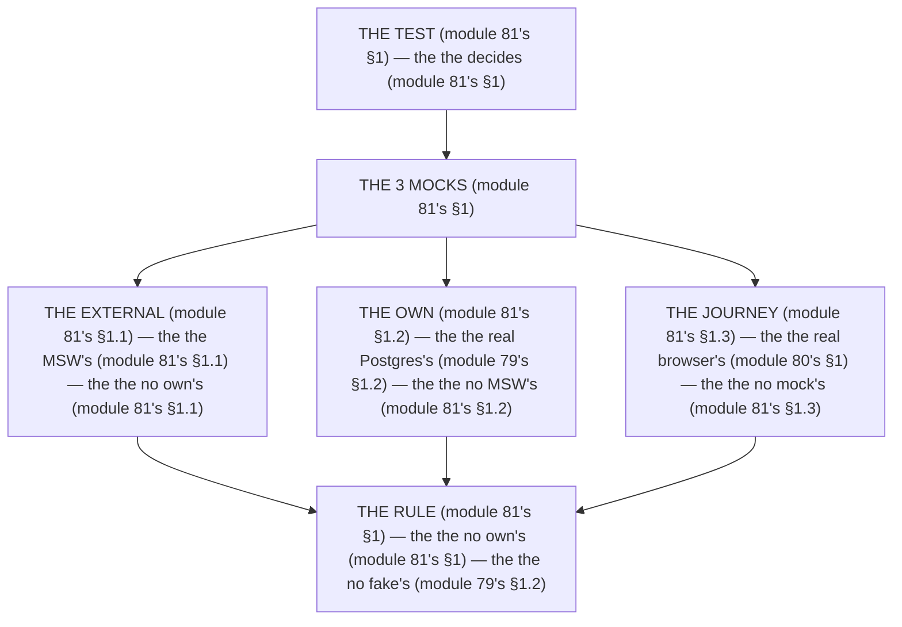

# Module 81 — MSW & When Mocking Stops: Mock the Boundary You Don't Own

**Phase 20: Testing · Module 81 of 101**

> **Where does this run?** MSW runs in the **test runtime** (node for services, jsdom for components — module 81's §1); it intercepts **`[CLIENT]`** or **`[SERVER]`** *outbound* HTTP (module 81's §1). The module-81's standing rule (module 79's real-DB rule, now the mock level): **mock the boundary you *don't own* (the external API — module 81's §1), never the boundary you *do own* (your service, action, route handler — module 79's §1.2); MSW 2 is the *external* interceptor, the *real Postgres* is the *own* seam, and the *real browser* is the *journey* (module 81's §1)** (module 81's §1).

---

## 1. Concept — The 3 mocks (the map)

**The external's** (module 81's §1.1): the *the MSW's* (module 81's §1.1) — the *module-81's line: the external's is the mock's* (module 81's §1.1) — the *the no own's* (module 81's §1.1).

**The own's** (module 81's §1.2): the *the real Postgres's* (module 79's §1.2) — the *module-81's line: the own's is the real's* (module 79's §1.2) — the *the no MSW's* (module 81's §1.2).

**The journey's** (module 81's §1.3): the *the real browser's* (module 80's §1) — the *module-81's line: the journey's is the real's* (module 80's §1) — the *the no mock's* (module 81's §1.3).

## 2. Mental Model — The 3 mocks (drawn)



## 3. Architecture — The 3 mocks (the code)

### 3.1 The external's (module 81's §1.1 — the MSW's)

`FILE: src/services/stripe.test.ts` + `FILE: test/handlers.ts` (production pattern — [SERVER] — the module-81's §3.1: the external's)

```ts
// THE EXTERNAL (module 81's §3.1) — the the MSW's (module 81's §1.1) — the the no own's (module 81's §1.1):
// test/handlers.ts (module 81's §3.1)
import { http, HttpResponse } from 'msw'   /* the module-81's line: the MSW 2's (module 81's §1.1) */
import { setupServer } from 'msw/node'   /* the module-81's line: the node's (module 81's §1.1) */

export const handlers = [
  http.post('https://api.stripe.com/v1/payment_intents', async () => {
    return HttpResponse.json({ id: 'pi_test_123', status: 'succeeded' })   /* the module-81's line: the stripe's (module 81's §3.1) */
  }),
]

export const server = setupServer(...handlers)   /* the module-81's line: the server's (module 81's §3.1) */

// src/services/stripe.test.ts (module 81's §3.1)
import { describe, it, expect, beforeAll, afterAll, afterEach } from 'vitest'
import { createStripePaymentIntent } from './stripe'   /* the module-81's line: the service's (module 81's §3.1) */
import { server } from '../../test/handlers'

describe('createStripePaymentIntent (module 81's §3.1)', () => {
  beforeAll(() => server.listen())   /* the module-81's line: the listen's (module 81's §3.1) */
  afterEach(() => server.resetHandlers())   /* the module-81's line: the reset's (module 81's §3.1) */
  afterAll(() => server.close())   /* the module-81's line: the close's (module 81's §3.1) */

  it('the external's (module 81's §3.1)', async () => {
    const intent = await createStripePaymentIntent({ amount: 1999 })   /* the module-81's line: the call's (module 81's §3.1) */
    expect(intent.id).toBe('pi_test_123')   /* the module-81's line: the mock's (module 81's §1.1) */
  })
})
```

**The module-81's line:** the *external's* (module 81's §1.1) — the *MSW 2's* (module 81's §1.1) — the *no own's* (module 81's §1.1).

### 3.2 The own's (module 81's §1.2 — the real Postgres's)

`FILE: src/services/orders.test.ts` (production pattern — [SERVER] — the module-81's §3.2: the no MSW's)

```ts
// THE OWN (module 81's §3.2) — the the real Postgres's (module 79's §1.2) — the the no MSW's (module 81's §1.2):
import { describe, it, expect } from 'vitest'
import { createOrder } from './orders'   /* the module-81's line: the service's (module 79's §3.2) */

describe('createOrder (module 81's §3.2)', () => {
  it('the own's (module 81's §3.2)', async () => {
    /* THE REAL'S (module 81's §3.2) — the the no MSW's (module 81's §1.2):
       const order = await createOrder({ orgId, items })   (module 81's §3.2)
       expect(order.status).toBe('pending')   (module 81's §3.2) — the the real's DB (module 79's §1.2) */
  })
})
```

**The module-81's line:** the *own's* (module 81's §1.2) — the *real Postgres's* (module 79's §1.2) — the *no MSW's* (module 81's §1.2).

### 3.3 The journey's (module 81's §1.3 — the real browser's)

`FILE: e2e/checkout.spec.ts` (production pattern — the module-81's §3.3: the no mock's)

```ts
// THE JOURNEY (module 81's §3.3) — the the real browser's (module 80's §1) — the the no mock's (module 81's §1.3):
import { test, expect } from '@playwright/test'

test('the checkout's (module 81's §3.3)', async ({ page }) => {
  /* THE REAL'S (module 81's §3.3) — the the no MSW's (module 81's §1.3):
     await page.goto('/checkout')   (module 81's §3.3)
     await page.getByRole('button', { name: 'Pay' }).click()   (module 81's §3.3) — the the real's stripe (module 81's §3.3)
     await expect(page).toHaveURL('/orders/success')   (module 81's §3.3) — the the real's journey (module 80's §1) */
})
```

**The module-81's line:** the *journey's* (module 81's §1.3) — the *real browser's* (module 80's §1) — the *no mock's* (module 81's §1.3).

## 4. Production Code — The no own's (module 81's §4)

`FILE: docs/mock-policy.md` (production pattern — the module-81's §4: the 3 rules)

```md
## THE MOCK'S POLICY (module 81's §4 — the the no own's (module 81's §1) — the the no fake's (module 79's §1.2))

1. **The external's** (module 81's §4.1): the the MSW's (module 81's §1.1) — the the no own's (module 81's §1.1)
2. **The own's** (module 81's §4.2): the the real Postgres's (module 79's §1.2) — the the no MSW's (module 81's §1.2)
3. **The journey's** (module 81's §4.3): the the real browser's (module 80's §1) — the the no mock's (module 81's §1.3)

/* THE RULE (module 81's §4): the the no own's (module 81's §1) — the the no fake's (module 79's §1.2) — the the 3's rules (module 81's §4) */
```

**The module-81's line:** the *no own's* (module 81's §1) — the *no fake's* (module 79's §1.2) — the *3's rules* (module 81's §4).

## 5. Common Mistakes (the mock's failures)

| Mistake | The symptom | Fix |
|---|---|---|
| **The own's MSW** (module 81's §1.2's line violated) | the *module-81's line: the own's is the real's* (module 79's §1.2) — the *the own's MSW's is the *no's* (module 81's §1.2) — the *module-81's line: the no own's MSW* (module 81's §1.2) — the *no own's MSW* (module 81's §1.2)* | the *the real Postgres's (module 79's §3.2) — the *module-81's line: the own's is the real's* (module 79's §1.2)* |
| **The journey's MSW** (module 81's §1.3's line violated) | the *module-81's line: the journey's is the real's* (module 80's §1) — the *the journey's MSW's is the *no's* (module 81's §1.3) — the *module-81's line: the no journey's MSW* (module 81's §1.3) — the *no journey's MSW* (module 81's §1.3)* | the *the real browser's (module 80's §1) — the *module-81's line: the journey's is the real's* (module 80's §1)* |
| **The no external's mock** (module 81's §1.1's line violated) | the *module-81's line: the external's is the mock's* (module 81's §1.1) — the *the no external's mock's is the *no's* (module 81's §1.1) — the *module-81's line: the no external's mock* (module 81's §1.1) — the *no external's mock* (module 81's §1.1)* | the *the MSW's (module 81's §3.1) — the *module-81's line: the external's is the mock's* (module 81's §1.1)* |
| **The real's stripe** (module 81's §1.1's line violated) | the *module-81's line: the external's is the mock's* (module 81's §1.1) — the *the real's stripe's is the *no's* (module 81's §1.1) — the *module-81's line: the no real's stripe* (module 81's §1.1) — the *no real's stripe* (module 81's §1.1)* | the *the MSW's (module 81's §3.1) — the *module-81's line: the external's is the mock's* (module 81's §1.1)* |
| **The no reset** (module 81's §3.1's line violated) | the *module-81's line: the reset's* (module 81's §3.1) — the *the no reset's is the *no's* (module 81's §3.1) — the *module-81's line: the no reset* (module 81's §3.1) — the *no reset* (module 81's §3.1)* | the *the resetHandlers's (module 81's §3.1) — the *module-81's line: the reset's* (module 81's §3.1)* |
| **The no close** (module 81's §3.1's line violated) | the *module-81's line: the close's* (module 81's §3.1) — the *the no close's is the *no's* (module 81's §3.1) — the *module-81's line: the no close* (module 81's §3.1) — the *no close* (module 81's §3.1)* | the *the close's (module 81's §3.1) — the *module-81's line: the close's* (module 81's §3.1)* |

## 6. Security Notes

- **The no own's** (module 81's §1): the *module-81's line: the own's is the real's* (module 79's §1.2) — the *module-79's* *deep-dive* (module 79's).
- **The no journey's** (module 81's §1.3): the *module-81's line: the journey's is the real's* (module 80's §1) — the *module-80's* *deep-dive* (module 80's).
- **The external's** (module 81's §1.1): the *module-81's line: the external's is the mock's* (module 81's §1.1) — the *module-81's* *deep-dive* (module 81's §3.1).

## 7. Performance Notes

- **The 5s's** (module 78's §4): the *module-81's line: the external's is the mock's* (module 81's §1.1) — the *the 5s's* (module 78's §4).
- **The 30s's** (module 78's §4): the *module-81's line: the own's is the real's* (module 79's §1.2) — the *the 30s's* (module 78's §4).
- **The 5min's** (module 78's §4): the *module-81's line: the journey's is the real's* (module 80's §1) — the *the 5min's* (module 78's §4).

## 8. Exercise

**Beginner.** *The external's* (module 81's §3.1): the *the MSW's* (module 3.1's) + the *the stripe's mock* (module 3.1's) — *build it* — the *artifact: the external's* (module 3.1's).

**Intermediate.** *The own's* (module 81's §3.2): the *the real Postgres's* (module 3.2's) + the *the no MSW's* (module 3.2's) — *build it* — the *artifact: the own's* (module 3.2's).

**Production.** *The mock's policy's* (module 81's §4): the *the 3's rules* (module 4's) + the *the no own's* (module 4's) — *build the policy* — the *artifact: the policy's* (module 4's).

## 9. Architecture Challenge

**Prompt:** The *"the team MSW-mocks its own API in the E2E, calls Stripe for real in the unit test, and has no MSW at all for the external email provider"* (the *module-81's* *mock* — the *module-79's* *real* — the *module-81's line: the external's is the mock's* (module 81's §1.1) — the *module-79's line: the own's is the real's* (module 79's §1.2) — the *module-81's standing line: the external's mock + the own's real + the journey's real* (module 81's §1.1 + module 81's §1.2 + module 81's §1.3)).

The *problems*: (1) the *the own's MSW* (the *the no real's* (module 79's §1.2) — the *module-81's line: the own's is the real's* (module 79's §1.2) — the *module-81's standing line: the own's real* (module 81's §1.2)).

(2) the *the no external's mock* (the *the no MSW's* (module 81's §1.1) — the *module-81's line: the external's is the mock's* (module 81's §1.1) — the *module-81's standing line: the external's mock* (module 81's §1.1)).

**Design**: the *the mock's remediation* (the *the real Postgres's* (module 79's §3.2) + the *the MSW's* (module 81's §3.1) + the *the 3's rules* (module 4's) — the *module-81's line: the external's is the mock's* (module 81's §1.1) — the *module-81's standing line: the external's mock + the own's real + the journey's real* (module 81's §1.1 + module 81's §1.2 + module 81's §1.3)).

Produce: the *the mock's remediation* (the *the real Postgres's* (module 79's §3.2) + the *the MSW's* (module 81's §3.1) + the *the 3's rules* (module 4's) — the *module-81's line: the external's is the mock's* (module 81's §1.1) — the *module-81's standing line: the external's mock + the own's real + the journey's real* (module 81's §1.1 + module 81's §1.2 + module 81's §1.3)).

<details>
<summary>Model answer</summary>
**The mock's remediation** (module 79's §3.2 + module 81's §3.1 + module 81's §4):
1. **The real Postgres's** (module 79's §1.2): the *the MSW's own API becomes the real's* — the *module-81's line: the own's is the real's* (module 79's §1.2).
2. **The MSW's** (module 81's §1.1): the *the email's provider becomes the MSW's* — the *module-81's line: the external's is the mock's* (module 81's §1.1).
3. **The 3's rules** (module 81's §4): the *the policy's becomes the 3's rules'* — the *module-81's line: the no own's* (module 81's §1).
**The generalization** (the *mock's* pattern, the *module's* standing rule): **the *external's mock* (module 81's §1.1) — the *the own's real* (module 79's §1.2) — the *the journey's real* (module 80's §1) — the *module-81's standing line: the external's mock + the own's real + the journey's real* (module 81's §1.1 + module 81's §1.2 + module 81's §1.3)*.
</details>

## 10. Official Documentation

- MSW 2: https://mswjs.io/docs
- MSW: Node: https://mswjs.io/docs/basics/response-handling
- Playwright: https://playwright.dev/
- Vitest: https://vitest.dev/
- The module-78's pyramid: the module-78 (the phase-20's file-01)
- The module-79's tools: the module-79 (the phase-20's file-02)
- The module-80's E2E: the module-80 (the phase-20's file-03)

## 11. What You Should Know Before Continuing

- [ ] I can state the *3 mocks* (module 1's: the external/own/journey) — the *module-81's line: the no own's* (module 1's)
- [ ] I know the *external's is the mock's* (module 1.1's) — the *the MSW's* (module 1.1's)
- [ ] I know the *own's is the real's* (module 1.2's) — the *the real Postgres's* (module 79's §1.2)
- [ ] I know the *journey's is the real's* (module 1.3's) — the *the real browser's* (module 80's §1)
- [ ] I know the *3's rules* (module 4's) — the *the no own's + the no fake's* (module 4's)
- [ ] I've done the *external's* (module 8's beginner) + the *own's* (module 8's intermediate) + the *policy's* (module 8's production) — the *artifacts* (module 20's)

**Phase 20 complete.** Testing — the pyramid (module 78's), the tools (module 79's), the journeys (module 80's), the mocks (module 81's).

**Next:** Module 82 — Phase 21 (the *the observability's* — the *module-82's line: the log is the structured's* (module 82's)).
