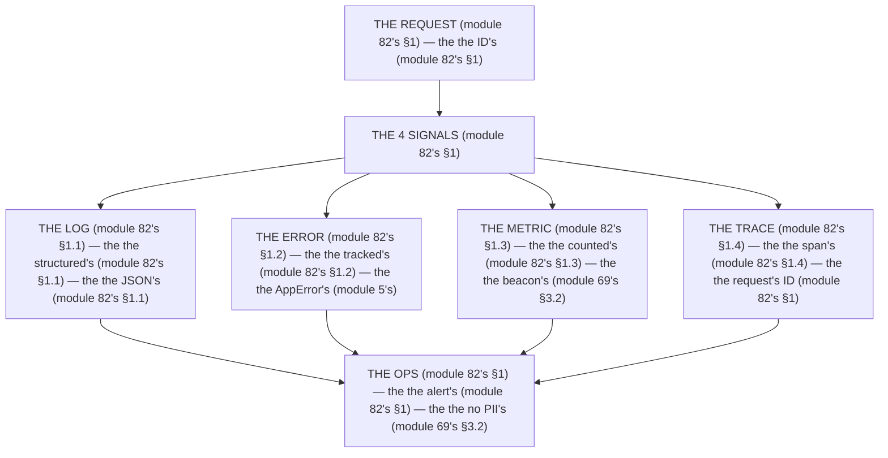

# Module 82 — Observability: Structured Logs, Request IDs, Error Tracking, Tracing, Failed-Action Alerts

**Phase 21: Observability & Analytics · Module 82 of 101**

> **Where does this run?** The logging is **`[SERVER]`** (the request, the action, the DB — module 82's §1); the *request ID* is born in **`[SERVER]`** (the `proxy.ts` — module 82's §1) and travels in the **headers** (module 82's §1); the *error tracking* is **`[BOTH]`** (the `error.tsx` boundary is `[CLIENT]`, the server log is `[SERVER]` — module 82's §1). The module-82's standing rule (module 69's measurement, now the ops level): **every request has a *request ID* (module 82's §1); every log line is *structured JSON* with that ID (module 82's §1); every *failed action* increments a counter that can *alert* (module 82's §1); and the log *never contains PII* (module 69's §3.2) — the ID, the status, the duration, the tag (module 82's §1)** (module 82's §1).

---

## 1. Concept — The 4 signals (the map)

**The log's** (module 82's §1.1): the *the structured's* (module 82's §1.1) — the *module-82's line: the log is the structured's* (module 82's §1.1) — the *the JSON's* (module 82's §1.1).

**The error's** (module 82's §1.2): the *the tracked's* (module 82's §1.2) — the *module-82's line: the error is the tracked's* (module 82's §1.2) — the *module-5's* *AppError* (module 5's).

**The metric's** (module 82's §1.3): the *the counted's* (module 82's §1.3) — the *module-82's line: the metric is the counted's* (module 82's §1.3) — the *module-69's* *beacon* (module 69's §3.2).

**The trace's** (module 82's §1.4): the *the span's* (module 82's §1.4) — the *module-82's line: the trace is the span's* (module 82's §1.4) — the *the request's ID* (module 82's §1).

## 2. Mental Model — The 4 signals (drawn)



## 3. Architecture — The 4 signals (the code)

### 3.1 The request ID's (module 82's §1 — the `proxy.ts`'s)

`FILE: src/proxy.ts` (production pattern — [SERVER] — the module-82's §3.1: the ID's)

```ts
// THE REQUEST ID (module 82's §3.1) — the the ID's (module 82's §1) — the the no PII's (module 69's §3.2):
import { NextRequest, NextResponse } from 'next/server'
import { randomUUID } from 'crypto'   /* the module-82's line: the uuid's (module 82's §3.1) */

export function proxy(req: NextRequest) {
  const requestId = req.headers.get('x-request-id') ?? randomUUID()   /* the module-82's line: the ID's (module 82's §1) */
  const res = NextResponse.next()   /* the module-82's line: the next's (module 82's §3.1) */
  res.headers.set('x-request-id', requestId)   /* the module-82's line: the ID's (module 82's §1) */
  req.headers.set('x-request-id', requestId)   /* the module-82's line: the ID's (module 82's §1) */
  return res
}

/* THE CONCEPT (module 82's §3.1): the the ID's is the trace's (module 82's §1.4) — the the no PII's (module 69's §3.2)
   The client can send the x-request-id (module 82's §3.1) — the the no new's (module 82's §3.1) */
```

**The module-82's line:** the *ID's* (module 82's §1) — the *uuid's* (module 82's §3.1) — the *no PII's* (module 69's §3.2).

### 3.2 The log's (module 82's §1.1 — the structured's)

`FILE: src/lib/logger.ts` (production pattern — [SERVER] — the module-82's §3.2: the JSON's)

```ts
// THE LOG (module 82's §3.2) — the the structured's (module 82's §1.1) — the the no PII's (module 69's §3.2):
import { headers } from 'next/headers'

export function log(level: 'info' | 'warn' | 'error', msg: string, meta: Record<string, unknown> = {}) {
  const id = (headers().get('x-request-id') ?? 'unknown') as string   /* the module-82's line: the ID's (module 82's §1) */
  const line = JSON.stringify({ ts: new Date().toISOString(), level, msg, requestId: id, ...meta })   /* the module-82's line: the JSON's (module 82's §1.1) */
  /* THE NO PII (module 82's §3.2) — the the no email's (module 69's §3.2) — the the no name's (module 69's §3.2):
     console.log(line)   (module 82's §3.2) — the the no PII's (module 69's §3.2) */
  console.log(line)   /* the module-82's line: the structured's (module 82's §1.1) */
}
```

**The module-82's line:** the *structured's* (module 82's §1.1) — the *JSON's* (module 82's §1.1) — the *no PII's* (module 69's §3.2).

### 3.3 The error's (module 82's §1.2 — the tracked's)

`FILE: src/lib/errors.ts` (production pattern — [SERVER] — the module-82's §3.3: the AppError's)

```ts
// THE ERROR (module 82's §3.3) — the the tracked's (module 82's §1.2) — the the no PII's (module 69's §3.2):
import { log } from './logger'   /* the module-82's line: the log's (module 82's §1.1) */

export class AppError extends Error {
  constructor(public code: string, public status: number, msg: string) {
    super(msg)   /* the module-5's line: the AppError's (module 5's) */
  }
}

export function trackError(err: unknown) {
  /* THE TRACK (module 82's §3.3) — the the no PII's (module 69's §3.2):
     if (err instanceof AppError) {
       log('error', 'app_error', { code: err.code, status: err.status })   (module 82's §3.3) — the the no PII's (module 69's §3.2)
     } else {
       log('error', 'unknown_error', { type: err?.constructor?.name })   (module 82's §3.3) — the the no PII's (module 69's §3.2)
     } */
}
```

**The module-82's line:** the *tracked's* (module 82's §1.2) — the *AppError's* (module 5's) — the *no PII's* (module 69's §3.2).

### 3.4 The metric's (module 82's §1.3 — the counted's)

`FILE: src/lib/metrics.ts` (production pattern — [SERVER] — the module-82's §3.4: the alert's)

```ts
// THE METRIC (module 82's §3.4) — the the counted's (module 82's §1.3) — the the alert's (module 82's §1):
let actionFailures = 0   /* the module-82's line: the counter's (module 82's §3.4) */
let actionTotal = 0   /* the module-82's line: the counter's (module 82's §3.4) */

export function countAction(ok: boolean) {
  actionTotal += 1   /* the module-82's line: the total's (module 82's §3.4) */
  if (!ok) actionFailures += 1   /* the module-82's line: the failure's (module 82's §3.4) */
  /* THE ALERT (module 82's §3.4) — the the threshold's (module 82's §3.4):
     if (actionTotal >= 100 && actionFailures / actionTotal > 0.05) {
       log('warn', 'action_failure_rate', { rate: actionFailures / actionTotal })   (module 82's §3.4) — the the alert's (module 82's §1)
     } */
}
```

**The module-82's line:** the *counted's* (module 82's §1.3) — the *alert's* (module 82's §1) — the *threshold's* (module 82's §3.4).

## 4. Production Code — The trace's (module 82's §4)

`FILE: docs/tracing.md` (production pattern — the module-82's §4: the span's)

```md
## THE TRACE (module 82's §4 — the the span's (module 82's §1.4) — the the request's ID (module 82's §1))

| Span (module 82's §4) | Duration (module 82's §4) | The ID's (module 82's §1) |
|---|---|---|
| The request's (module 82's §4.1) | 250ms (module 82's §4) | The ID's (module 82's §1) |
| The session's read (module 82's §4.2) | 10ms (module 82's §4) | The ID's (module 82's §1) |
| The service's query (module 82's §4.3) | 12ms (module 82's §4) | The ID's (module 82's §1) |
| The render's (module 82's §4.4) | 200ms (module 82's §4) | The ID's (module 82's §1) |

/* THE RULE (module 82's §4): the the trace's is the request's (module 82's §1) — the the span's is the boundary's (module 82's §1.4) — the the ID's is the link's (module 82's §1) */
```

**The module-82's line:** the *trace's is the request's* (module 82's §1) — the *span's is the boundary's* (module 82's §1.4) — the *ID's is the link's* (module 82's §1).

## 5. Common Mistakes (the ops's failures)

| Mistake | The symptom | Fix |
|---|---|---|
| **The no ID** (module 82's §1's line violated) | the *module-82's line: the ID's* (module 82's §1) — the *the no ID's is the *no's* (module 82's §1) — the *module-82's line: the no ID* (module 82's §1) — the *no ID* (module 82's §1)* | the *the `proxy.ts`'s (module 82's §3.1) — the *module-82's line: the ID's* (module 82's §1)* |
| **The PII's** (module 69's §3.2's line violated) | the *module-82's line: the no PII's* (module 69's §3.2) — the *the PII's is the *no's* (module 69's §3.2) — the *module-82's line: the no PII* (module 69's §3.2) — the *no PII* (module 69's §3.2)* | the *the ID's (module 82's §1) — the *module-82's line: the no PII's* (module 69's §3.2)* |
| **The no structured** (module 82's §1.1's line violated) | the *module-82's line: the log is the structured's* (module 82's §1.1) — the *the no structured's is the *no's* (module 82's §1.1) — the *module-82's line: the no structured* (module 82's §1.1) — the *no structured* (module 82's §1.1)* | the *the JSON's (module 82's §3.2) — the *module-82's line: the log is the structured's* (module 82's §1.1)* |
| **The no alert** (module 82's §1's line violated) | the *module-82's line: the alert's* (module 82's §1) — the *the no alert's is the *no's* (module 82's §3.4) — the *module-82's line: the no alert* (module 82's §3.4) — the *no alert* (module 82's §3.4)* | the *the threshold's (module 82's §3.4) — the *module-82's line: the alert's* (module 82's §1)* |
| **The no trace** (module 82's §1.4's line violated) | the *module-82's line: the trace is the span's* (module 82's §1.4) — the *the no trace's is the *no's* (module 82's §1.4) — the *module-82's line: the no trace* (module 82's §1.4) — the *no trace* (module 82's §1.4)* | the *the span's (module 82's §3.1) — the *module-82's line: the trace is the span's* (module 82's §1.4)* |
| **The console's string** (module 82's §1.1's line violated) | the *module-82's line: the JSON's* (module 82's §1.1) — the *the console's string's is the *no's* (module 82's §3.2) — the *module-82's line: the no console's string* (module 82's §3.2) — the *no console's string* (module 82's §3.2)* | the *the JSON's (module 82's §3.2) — the *module-82's line: the JSON's* (module 82's §1.1)* |

## 6. Security Notes

- **The no PII** (module 69's §3.2): the *module-82's line: the no PII's* (module 69's §3.2) — the *module-75's* *deep-dive* (module 75's).
- **The ID's** (module 82's §1): the *module-82's line: the ID's* (module 82's §1) — the *module-74's* *deep-dive* (module 74's).
- **The alert's** (module 82's §1): the *module-82's line: the alert's* (module 82's §1) — the *module-77's* *deep-dive* (module 77's).

## 7. Performance Notes

- **The 250ms's** (module 82's §4): the *module-82's line: the trace's is the request's* (module 82's §1) — the *the 250ms's* (module 82's §4).
- **The 12ms's** (module 82's §4): the *module-82's line: the span's is the boundary's* (module 82's §1.4) — the *the 12ms's* (module 72's §1.3).
- **The no PII** (module 69's §3.2): the *module-82's line: the no PII's* (module 69's §3.2) — the *the no GDPR's* (module 69's §3.2).

## 8. Exercise

**Beginner.** *The ID's + the log's* (module 82's §3.1 + §3.2): the *the `proxy.ts`'s* (module 3.1's) + the *the JSON's logger* (module 3.2's) — *build it* — the *artifact: the 2's signals* (module 3.1's + module 3.2's).

**Intermediate.** *The error's + the metric's* (module 82's §3.3 + §3.4): the *the AppError's track* (module 3.3's) + the *the counter's* (module 3.4's) — *build it* — the *artifact: the 2's signals* (module 3.3's + module 3.4's).

**Production.** *The trace's* (module 82's §4): the *the 4's spans* (module 4's) + the *the ID's link* (module 4's) — *build the table* — the *artifact: the trace's* (module 4's).

## 9. Architecture Challenge

**Prompt:** The *"the team logs `console.log('user ' + email + ' failed')` with no request ID, no error tracking, and no alerts"* (the *module-82's* *ops* — the *module-69's* *measure* — the *module-82's line: the log is the structured's* (module 82's §1.1) — the *module-69's line: the no PII's* (module 69's §3.2) — the *module-82's standing line: the ID's + the structured's + the tracked's + the counted's* (module 82's §1 + module 82's §1.1 + module 82's §1.2 + module 82's §1.3)).

The *problems*: (1) the *the PII's* (the *the no no-PII's* (module 69's §3.2) — the *module-82's line: the no PII's* (module 69's §3.2) — the *module-82's standing line: the no PII's* (module 69's §3.2)).

(2) the *the no ID* (the *the no trace's* (module 82's §1.4) — the *module-82's line: the ID's* (module 82's §1) — the *module-82's standing line: the ID's* (module 82's §1)).

**Design**: the *the ops's remediation* (the *the `proxy.ts`'s ID* (module 3.1's) + the *the JSON's logger* (module 3.2's) + the *the alert's* (module 3.4's) — the *module-82's line: the log is the structured's* (module 82's §1.1) — the *module-82's standing line: the ID's + the structured's + the tracked's + the counted's* (module 82's §1 + module 82's §1.1 + module 82's §1.2 + module 82's §1.3)).

Produce: the *the ops's remediation* (the *the `proxy.ts`'s ID* (module 3.1's) + the *the JSON's logger* (module 3.2's) + the *the alert's* (module 3.4's) — the *module-82's line: the log is the structured's* (module 82's §1.1) — the *module-82's standing line: the ID's + the structured's + the tracked's + the counted's* (module 82's §1 + module 82's §1.1 + module 82's §1.2 + module 82's §1.3)).

<details>
<summary>Model answer</summary>
**The ops's remediation** (module 82's §3.1 + module 82's §3.2 + module 82's §3.4):
1. **The `proxy.ts`'s ID** (module 82's §1): the *the `randomUUID`'s replaces the no-ID's* — the *module-82's line: the ID's* (module 82's §1).
2. **The JSON's logger** (module 82's §1.1): the *the `JSON.stringify`'s replaces the `console.log`'s string* — the *module-82's line: the log is the structured's* (module 82's §1.1).
3. **The alert's** (module 82's §1): the *the `action_failures`'s counter replaces the no-alert's* — the *module-82's line: the alert's* (module 82's §1).
**The generalization** (the *ops's* pattern, the *module's* standing rule): **the *ID's* (module 82's §1) — the *the structured's* (module 82's §1.1) — the *the tracked's* (module 82's §1.2) — the *the counted's* (module 82's §1.3) — the *module-82's standing line: the ID's + the structured's + the tracked's + the counted's* (module 82's §1 + module 82's §1.1 + module 82's §1.2 + module 82's §1.3)*.
</details>

## 10. Official Documentation

- Next.js: `instrumentation.ts`: https://nextjs.org/docs/app/api-reference/file-conventions/instrumentation
- Next.js: `error.tsx`: https://nextjs.org/docs/app/api-reference/file-conventions/error
- OpenTelemetry: https://opentelemetry.io/
- The module-69's measure: the module-69 (the phase-18's file-01)
- The module-83's analytics: the module-83 (the phase-21's file-02)

## 11. What You Should Know Before Continuing

- [ ] I can state the *4 signals* (module 1's: the log/error/metric/trace) — the *module-82's line: the ID's* (module 1's)
- [ ] I know the *log is the structured's* (module 1.1's) — the *the JSON's* (module 1.1's)
- [ ] I know the *error is the tracked's* (module 1.2's) — the *the AppError's* (module 5's)
- [ ] I know the *metric is the counted's* (module 1.3's) — the *the alert's* (module 1's)
- [ ] I know the *trace is the span's* (module 1.4's) — the *the request's ID* (module 1's)
- [ ] I know the *no PII's* (module 69's §3.2) — the *the ID's, not the email's* (module 1's)
- [ ] I've done the *ID/log* (module 8's beginner) + the *error/metric* (module 8's intermediate) + the *trace's* (module 8's production) — the *artifacts* (module 20's)

**Next:** Module 83 — Analytics (the *the event's* — the *module-83's line: the event is the privacy's* (module 83's)).
