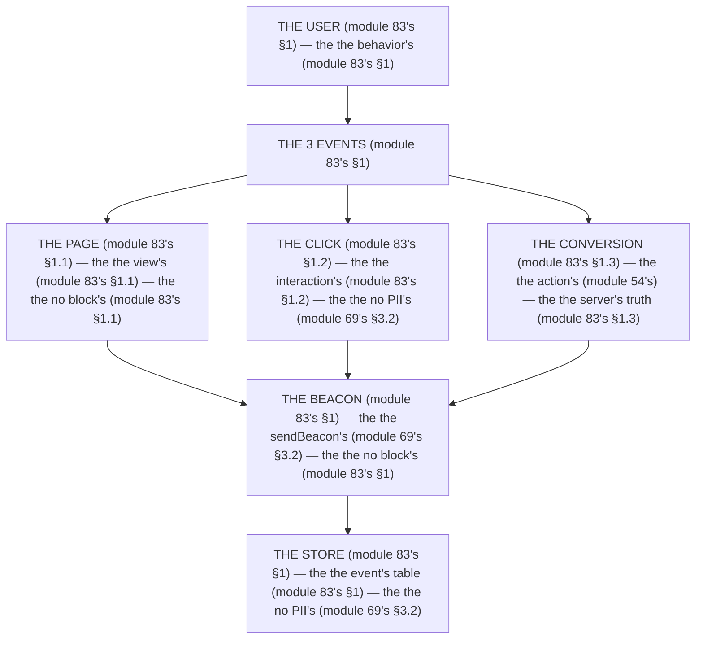

# Module 83 — Analytics: Page/View Events, Conversions, Privacy, and Performance Cost

**Phase 21: Observability & Analytics · Module 83 of 101**

> **Where does this run?** The *event* is born **`[CLIENT]`** (the page view, the click) or **`[SERVER]`** (the conversion — the checkout action, module 54's); the *collection* is a **`[SERVER]`** route (the beacon endpoint — module 83's §1). The module-83's standing rule (module 69's no-PII rule, now the analytics level): **the event is the *behavior*, not the *person* (module 83's §1) — no email, no name, no order contents in the payload (module 83's §1); the *conversion* is tracked at the *server's* truth (the action, module 54's), not at the client's click (module 83's §1); and the event *never blocks the render* (module 83's §1) — `sendBeacon`, fire-and-forget (module 69's §3.2)** (module 83's §1).

---

## 1. Concept — The 3 events (the map)

**The page's** (module 83's §1.1): the *the view's* (module 83's §1.1) — the *module-83's line: the page is the view's* (module 83's §1.1) — the *the no block's* (module 83's §1.1).

**The click's** (module 83's §1.2): the *the interaction's* (module 83's §1.2) — the *module-83's line: the click is the interaction's* (module 83's §1.2) — the *the no PII's* (module 69's §3.2).

**The conversion's** (module 83's §1.3): the *the action's* (module 54's) — the *module-83's line: the conversion is the action's* (module 83's §1.3) — the *the server's truth* (module 83's §1.3).

## 2. Mental Model — The 3 events (drawn)



## 3. Architecture — The 3 events (the code)

### 3.1 The page's (module 83's §1.1 — the view's)

`FILE: src/components/analytics.tsx` (production pattern — [CLIENT] — the module-83's §3.1: the no block's)

```tsx
// THE PAGE (module 83's §3.1) — the the view's (module 83's §1.1) — the the no block's (module 83's §1.1):
'use client'
import { useEffect } from 'react'
import { usePathname } from 'next/navigation'   /* the module-83's line: the pathname's (module 83's §3.1) */

export function Analytics() {
  const pathname = usePathname()   /* the module-83's line: the pathname's (module 83's §3.1) */

  useEffect(() => {
    navigator.sendBeacon('/api/track', JSON.stringify({ event: 'page_view', path: pathname, ts: Date.now() }))   /* the module-83's line: the beacon's (module 69's §3.2) */
  }, [pathname])   /* the module-83's line: the no block's (module 83's §1.1) */

  return null   /* the module-69's line: the no render's (module 69's §3.2) */
}
```

**The module-83's line:** the *view's* (module 83's §1.1) — the *beacon's* (module 69's §3.2) — the *no block's* (module 83's §1.1).

### 3.2 The click's (module 83's §1.2 — the interaction's)

`FILE: src/components/product-card.tsx` (production pattern — [CLIENT] — the module-83's §3.2: the no PII's)

```tsx
// THE CLICK (module 83's §3.2) — the the interaction's (module 83's §1.2) — the the no PII's (module 69's §3.2):
'use client'

export function ProductCard({ id, name }: { id: string; name: string }) {
  function trackClick() {
    navigator.sendBeacon('/api/track', JSON.stringify({ event: 'product_click', productId: id, ts: Date.now() }))   /* the module-83's line: the no PII's (module 69's §3.2) */
  }
  return (
    <button onClick={trackClick}>{name}</button>   /* the module-83's line: the interaction's (module 83's §1.2) */
  )
}
```

**The module-83's line:** the *interaction's* (module 83's §1.2) — the *no PII's* (module 69's §3.2) — the *beacon's* (module 69's §3.2).

### 3.3 The conversion's (module 83's §1.3 — the action's)

`FILE: src/app/(org)/api/actions/checkout.ts` (production pattern — [SERVER] — the module-83's §3.3: the truth's)

```ts
// 'use server'
// THE CONVERSION (module 83's §3.3) — the the action's (module 54's) — the the server's truth (module 83's §1.3):
import { checkoutAction } from '@/services/checkout'   /* the module-54's line: the checkout's (module 54's) */
import { trackEvent } from '@/lib/metrics'   /* the module-82's line: the metric's (module 82's §1.3) */

export async function completeCheckout(formData: FormData) {
  const order = await checkoutAction(formData)   /* the module-83's line: the action's (module 54's) */
  trackEvent('conversion', { orderId: order.id, total: order.total })   /* the module-83's line: the truth's (module 83's §1.3) — the the no PII's (module 69's §3.2) */
  return order   /* the module-83's line: the no click's (module 83's §1.3) */
}
```

**The module-83's line:** the *action's* (module 54's) — the *truth's* (module 83's §1.3) — the *no click's* (module 83's §1.3).

### 3.4 The store's (module 83's §1 — the event's table)

`FILE: src/db/schema.ts` (production pattern — [SERVER] — the module-83's §3.4: the no PII's)

```ts
// THE STORE (module 83's §3.4) — the the event's table (module 83's §1) — the the no PII's (module 69's §3.2):
export const events = pgTable('events', {
  id: uuid('id').primaryKey().defaultRandom(),   /* the module-83's line: the uuid's (module 83's §3.4) */
  orgId: uuid('org_id').notNull().references(() => orgs.id, { onDelete: 'cascade' }),   /* the module-49's line: the orgId's (module 49's) */
  event: text('event').notNull(),   /* the module-83's line: the event's (module 83's §3.4) */
  payload: jsonb('payload').notNull().default({}),   /* the module-83's line: the no PII's (module 69's §3.2) */
  createdAt: timestamp('created_at', { withTimezone: true }).notNull().defaultNow(),   /* the module-37's line: the timestamptz's (module 37's) */
})
```

**The module-83's line:** the *event's table* (module 83's §1) — the *no PII's* (module 69's §3.2) — the *orgId's* (module 49's).

## 4. Production Code — The no block's (module 83's §4)

`FILE: docs/analytics-policy.md` (production pattern — the module-83's §4: the 3 rules)

```md
## THE ANALYTICS'S POLICY (module 83's §4 — the the no block's (module 83's §1) — the the no PII's (module 69's §3.2))

1. **The no block** (module 83's §4.1): the the `sendBeacon`'s (module 69's §3.2) — the the no `fetch`'s await (module 83's §4.1)
2. **The no PII** (module 83's §4.2): the the no email's (module 69's §3.2) — the the no name's (module 69's §3.2)
3. **The truth's** (module 83's §4.3): the the action's (module 54's) — the the no click's (module 83's §1.3)

/* THE RULE (module 83's §4): the the no block's (module 83's §1) — the the no PII's (module 69's §3.2) — the the truth's (module 83's §1.3) */
```

**The module-83's line:** the *no block's* (module 83's §1) — the *no PII's* (module 69's §3.2) — the *truth's* (module 83's §1.3).

## 5. Common Mistakes (the analytics's failures)

| Mistake | The symptom | Fix |
|---|---|---|
| **The block's** (module 83's §1's line violated) | the *module-83's line: the no block's* (module 83's §1) — the *the block's is the *no's* (module 83's §1) — the *module-83's line: the no block* (module 83's §1) — the *no block* (module 83's §1)* | the *the `sendBeacon`'s (module 69's §3.2) — the *module-83's line: the no block's* (module 83's §1)* |
| **The PII's** (module 69's §3.2's line violated) | the *module-83's line: the no PII's* (module 69's §3.2) — the *the PII's is the *no's* (module 69's §3.2) — the *module-83's line: the no PII* (module 69's §3.2) — the *no PII* (module 69's §3.2)* | the *the event's (module 83's §3.4) — the *module-83's line: the no PII's* (module 69's §3.2)* |
| **The click's conversion** (module 83's §1.3's line violated) | the *module-83's line: the conversion is the action's* (module 83's §1.3) — the *the click's conversion's is the *no's* (module 83's §1.3) — the *module-83's line: the no click's conversion* (module 83's §1.3) — the *no click's conversion* (module 83's §1.3)* | the *the action's (module 54's) — the *module-83's line: the conversion is the action's* (module 83's §1.3)* |
| **The no orgId** (module 83's §3.4's line violated) | the *module-83's line: the orgId's* (module 49's) — the *the no orgId's is the *no's* (module 49's) — the *module-83's line: the no orgId* (module 49's) — the *no orgId* (module 49's)* | the *the orgId's (module 49's) — the *module-83's line: the orgId's* (module 49's)* |
| **The `fetch`'s await** (module 83's §4.1's line violated) | the *module-83's line: the no `fetch`'s await* (module 83's §4.1) — the *the `fetch`'s await's is the *no's* (module 83's §4.1) — the *module-83's line: the no `fetch`'s await* (module 83's §4.1) — the *no `fetch`'s await* (module 83's §4.1)* | the *the `sendBeacon`'s (module 69's §3.2) — the *module-83's line: the no `fetch`'s await* (module 83's §4.1)* |
| **The no truth** (module 83's §1.3's line violated) | the *module-83's line: the truth's* (module 83's §1.3) — the *the no truth's is the *no's* (module 83's §1.3) — the *module-83's line: the no truth* (module 83's §1.3) — the *no truth* (module 83's §1.3)* | the *the action's (module 54's) — the *module-83's line: the truth's* (module 83's §1.3)* |

## 6. Security Notes

- **The no PII** (module 69's §3.2): the *module-83's line: the no PII's* (module 69's §3.2) — the *module-75's* *deep-dive* (module 75's).
- **The orgId's** (module 49's): the *module-83's line: the orgId's* (module 49's) — the *module-49's* *deep-dive* (module 49's).
- **The truth's** (module 83's §1.3): the *module-83's line: the conversion is the action's* (module 83's §1.3) — the *module-54's* *deep-dive* (module 54's).

## 7. Performance Notes

- **The no block's** (module 83's §1): the *module-83's line: the no block's* (module 83's §1) — the *the `sendBeacon`'s* (module 69's §3.2).
- **The no `fetch`'s await** (module 83's §4.1): the *module-83's line: the no `fetch`'s await* (module 83's §4.1) — the *the no TTFB's cost* (module 70's §1.1).
- **The truth's** (module 83's §1.3): the *module-83's line: the conversion is the action's* (module 83's §1.3) — the *the no click's cost* (module 83's §1.3).

## 8. Exercise

**Beginner.** *The page's + the click's* (module 83's §3.1 + §3.2): the *the `usePathname`'s* (module 3.1's) + the *the `sendBeacon`'s* (module 3.2's) — *build it* — the *artifact: the 2's events* (module 3.1's + module 3.2's).

**Intermediate.** *The conversion's* (module 83's §3.3): the *the action's track* (module 3.3's) + the *the `events`'s table* (module 3.4's) — *build it* — the *artifact: the conversion's* (module 3.3's).

**Production.** *The policy's* (module 83's §4): the *the 3's rules* (module 4's) + the *the no PII's audit* (module 4's) — *build the policy* — the *artifact: the policy's* (module 4's).

## 9. Architecture Challenge

**Prompt:** The *"the team tracks the conversion on the client's click, logs the user's email in the payload, and `await`s the analytics `fetch` in the render"* (the *module-83's* *analytics* — the *module-69's* *measure* — the *module-83's line: the conversion is the action's* (module 83's §1.3) — the *module-69's line: the no PII's* (module 69's §3.2) — the *module-83's standing line: the behavior's + the no PII's + the no block's* (module 83's §1 + module 69's §3.2 + module 83's §1)).

The *problems*: (1) the *the click's conversion* (the *the no truth's* (module 83's §1.3) — the *module-83's line: the conversion is the action's* (module 83's §1.3) — the *module-83's standing line: the truth's* (module 83's §1.3)).

(2) the *the email's PII* (the *the no no-PII's* (module 69's §3.2) — the *module-83's line: the no PII's* (module 69's §3.2) — the *module-83's standing line: the no PII's* (module 69's §3.2)).

**Design**: the *the analytics's remediation* (the *the action's track* (module 3.3's) + the *the no PII's* (module 3.4's) + the *the `sendBeacon`'s* (module 3.1's) — the *module-83's line: the conversion is the action's* (module 83's §1.3) — the *module-83's standing line: the behavior's + the no PII's + the no block's* (module 83's §1 + module 69's §3.2 + module 83's §1)).

Produce: the *the analytics's remediation* (the *the action's track* (module 3.3's) + the *the no PII's* (module 3.4's) + the *the `sendBeacon`'s* (module 3.1's) — the *module-83's line: the conversion is the action's* (module 83's §1.3) — the *module-83's standing line: the behavior's + the no PII's + the no block's* (module 83's §1 + module 69's §3.2 + module 83's §1)).

<details>
<summary>Model answer</summary>
**The analytics's remediation** (module 83's §3.3 + module 83's §3.4 + module 83's §3.1):
1. **The action's track** (module 83's §1.3): the *the client's click becomes the action's track* — the *module-83's line: the conversion is the action's* (module 83's §1.3).
2. **The no PII's** (module 69's §3.2): the *the email's leaves the payload* — the *module-83's line: the no PII's* (module 69's §3.2).
3. **The `sendBeacon`'s** (module 83's §1.1): the *the `await`'s fetch becomes the `sendBeacon`'s* — the *module-83's line: the no block's* (module 83's §1).
**The generalization** (the *analytics's* pattern, the *module's* standing rule): **the *behavior's* (module 83's §1) — the *the no PII's* (module 69's §3.2) — the *the no block's* (module 83's §1) — the *module-83's standing line: the behavior's + the no PII's + the no block's* (module 83's §1 + module 69's §3.2 + module 83's §1)*.
</details>

## 10. Official Documentation

- MDN: `sendBeacon`: https://developer.mozilla.org/en-US/docs/Web/API/Navigator/sendBeacon
- Next.js: Route Handlers: https://nextjs.org/docs/app/api-reference/file-conventions/route
- GDPR: https://gdpr.eu/
- The module-69's measure: the module-69 (the phase-18's file-01)
- The module-82's observability: the module-82 (the phase-21's file-01)

## 11. What You Should Know Before Continuing

- [ ] I can state the *3 events* (module 1's: the page/click/conversion) — the *module-83's line: the behavior's* (module 1's)
- [ ] I know the *page is the view's* (module 1.1's) — the *the no block's* (module 1.1's)
- [ ] I know the *click is the interaction's* (module 1.2's) — the *the no PII's* (module 69's §3.2)
- [ ] I know the *conversion is the action's* (module 1.3's) — the *the server's truth* (module 1.3's)
- [ ] I know the *event's table* (module 3.4's) — the *the orgId's* (module 49's)
- [ ] I know the *3's rules* (module 4's) — the *the no block's + the no PII's + the truth's* (module 4's)
- [ ] I've done the *page/click* (module 8's beginner) + the *conversion's* (module 8's intermediate) + the *policy's* (module 8's production) — the *artifacts* (module 20's)

**Phase 21 complete.** Observability — the 4 signals (module 82's), the 3 events (module 83's).

**Next:** Module 84 — Phase 22 (the *the deployment's* — the *module-84's line: the target is the constraint's* (module 84's)).
